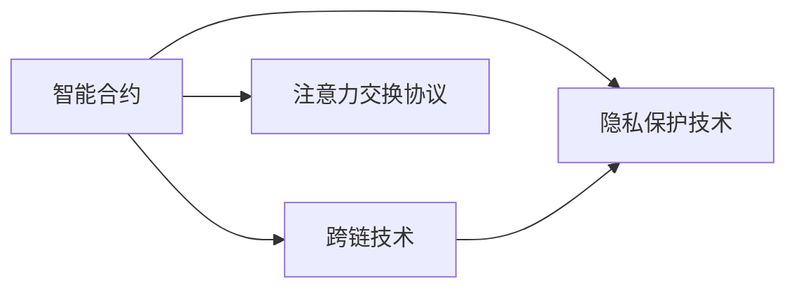

                 

# 注意力交易所:元宇宙中的注意力资源流通

> 关键词：注意力机制,元宇宙,智能合约,跨链交换,隐私保护

## 1. 背景介绍

随着元宇宙的兴起，数字世界的虚拟资产逐渐被广泛关注。在元宇宙中，除了传统的游戏道具、虚拟土地等实物资产外，注意力机制也成为一种重要的虚拟资源。注意力作为用户对虚拟世界参与度的一个度量指标，是衡量元宇宙活动活跃度的重要依据。但不同于实物资产，注意力机制的流通和价值评估面临新的挑战。

本文将从注意力机制的角度，探讨元宇宙中注意力资源的使用、流通和价值评估问题。我们提出一种基于智能合约的注意力交换协议，通过引入跨链技术，在元宇宙内部实现注意力资源的高效流通。同时，我们还将讨论隐私保护问题，如何在满足用户隐私要求的同时，保障注意力交换的公平性和透明性。

## 2. 核心概念与联系

### 2.1 核心概念概述

在元宇宙中，注意力资源的具体体现形式可以是用户在虚拟世界中花费的时间、点击次数、互动频次等。注意力机制的流通需要依赖智能合约的自动执行，以及跨链技术的支持。

**智能合约**：自动执行的合约，可以在元宇宙中自动处理注意力交换协议，无需人为干预。

**跨链技术**：通过跨链桥接，在不同元宇宙平台之间实现注意力资产的流通。

**隐私保护**：在元宇宙中，用户参与度的数据往往高度敏感，需要采用隐私保护技术，防止用户信息被滥用。

### 2.2 核心概念之间的关系

智能合约、跨链技术和隐私保护技术是实现元宇宙中注意力资源流通的三个关键技术。智能合约提供了自动化的执行机制，跨链技术支持跨平台之间的资产流通，而隐私保护技术保障了用户的隐私权益。

以下是一个Mermaid流程图，展示了三者之间的关系：



从上述流程图中可以看出，智能合约是注意力交换协议的核心，负责自动执行注意力交换过程；跨链技术使得注意力资源可以在不同平台之间流通；隐私保护技术则确保了用户在交换过程中的隐私权益。

### 2.3 核心概念的整体架构

最终，我们将这些核心概念整合为元宇宙中注意力资源流通的整体架构。


在实际应用中，用户通过参与虚拟世界中的活动，产生注意力数据；智能合约自动执行注意力交换协议，利用跨链技术在不同元宇宙之间交换注意力资产；隐私保护技术确保用户数据的安全性。

## 3. 核心算法原理 & 具体操作步骤
### 3.1 算法原理概述

基于智能合约的注意力交换协议，其核心思想是利用智能合约的自动执行特性，结合跨链技术，实现注意力资源的流通和价值评估。该协议分为以下几个关键步骤：

1. **定义注意力单位**：定义注意力单位的计价单位，如元宇宙中一个虚拟角色每天产生的注意力值。

2. **创建智能合约**：创建智能合约，定义注意力交换的规则和流程。

3. **执行注意力交换**：用户通过参与虚拟世界中的活动，自动触发智能合约中的注意力交换流程。

4. **跨链流通**：利用跨链技术，将注意力资源在不同元宇宙之间流通。

5. **隐私保护**：采用隐私保护技术，确保用户数据的匿名性和安全性。

### 3.2 算法步骤详解

接下来，我们将详细介绍这些关键步骤的具体实现。

#### 3.2.1 定义注意力单位

定义注意力单位的计价单位，可以基于元宇宙中的虚拟角色、虚拟物品、虚拟活动等多种维度。例如，一个虚拟角色每天在元宇宙中的活动时间可以作为注意力单位的计价标准。

#### 3.2.2 创建智能合约

智能合约的实现可以使用Solidity、Ethereum等区块链平台的智能合约语言。以下是一个基于Solidity的智能合约示例：

```solidity
// SPDX-License-Identifier: MIT
pragma solidity ^0.8.0;

contract AttentionSwap {
    address public exchange;
    uint256 public attentionPrice;
    mapping(address => uint256) public userAttention;

    function createExchange(address _exchange, uint256 _price) public {
        exchange = _exchange;
        attentionPrice = _price;
    }

    function exchangeAttention(address _from, address _to, uint256 _amount) public {
        uint256 balance = userAttention[_from];
        uint256 exchangeBalance = userAttention[exchange];
        require(_amount <= balance && _amount <= exchangeBalance);
        uint256 transferAmount = min(balance, _amount);
        uint256 transferToExchange = transferAmount * attentionPrice;
        uint256 transferToUser = transferAmount / attentionPrice;
        userAttention[_from] -= transferAmount;
        userAttention[exchange] -= transferAmount;
        userAttention[_to] += transferToUser;
        emit AttentionTransferred(_from, _to, _amount, transferToExchange, transferToUser);
    }
}
```

这个智能合约实现了注意力交换的基本功能：

- `createExchange`：创建注意力交换合约，指定交换平台的地址和价格。
- `exchangeAttention`：用户触发智能合约，交换注意力资源。

#### 3.2.3 执行注意力交换

用户通过参与虚拟世界中的活动，可以自动触发智能合约中的注意力交换流程。例如，用户在元宇宙中每活动一小时，就会自动向智能合约中添加一个注意力单位。

#### 3.2.4 跨链流通

利用跨链技术，可以将注意力资源在不同元宇宙之间流通。例如，用户可以将自己在一个元宇宙中积累的注意力资源，跨链转移到另一个元宇宙中，用于兑换其他虚拟资产或货币。

#### 3.2.5 隐私保护

在元宇宙中，用户数据的隐私保护至关重要。智能合约可以采用零知识证明、同态加密等隐私保护技术，确保用户数据在交换过程中的匿名性和安全性。

### 3.3 算法优缺点

基于智能合约的注意力交换协议具有以下优点：

1. 自动执行：智能合约的自动执行特性，减少了人为干预，提高了效率。
2. 跨链流通：利用跨链技术，实现不同元宇宙之间的注意力资源流通。
3. 隐私保护：采用隐私保护技术，确保用户数据的安全性。

同时，该协议也存在以下缺点：

1. 复杂度高：智能合约的实现和维护需要较高的技术门槛。
2. 风险较高：智能合约中的代码漏洞可能导致资产丢失或被攻击。
3. 用户教育：用户需要了解智能合约和跨链技术，才能正确使用该协议。

### 3.4 算法应用领域

基于智能合约的注意力交换协议，适用于多种元宇宙应用场景，例如：

1. **游戏平台**：用户在游戏中积累的注意力资源可以在不同平台之间流通，用于购买游戏道具或货币。
2. **虚拟活动**：用户在虚拟活动中产生的注意力数据，可以用于兑换虚拟货币或其他虚拟资产。
3. **社交网络**：用户在社交网络中的互动数据，可以用于兑换虚拟资产或礼物。

## 4. 数学模型和公式 & 详细讲解  
### 4.1 数学模型构建

在基于智能合约的注意力交换协议中，我们可以定义以下数学模型：

- 用户$i$在元宇宙中积累的注意力单位为 $A_i$。
- 元宇宙$j$的注意力价格为 $P_j$。
- 用户$i$在元宇宙$j$中交换的注意力单位为 $A_{ij}$。

则注意力交换的数学模型可以表示为：

$$
A_i^{t+1} = A_i^t - P_j \times A_{ij}
$$

其中，$A_i^t$ 表示用户$i$在时间 $t$ 时的注意力单位，$A_i^{t+1}$ 表示时间 $t+1$ 时的注意力单位。

### 4.2 公式推导过程

通过上述数学模型，我们可以推导出注意力交换的计算公式。例如，假设用户 $i$ 在元宇宙 $j$ 中交换了 $A_{ij}$ 个注意力单位，则用户 $i$ 在元宇宙 $j$ 中的注意力单位减少为 $A_i^t - P_j \times A_{ij}$。

在实际应用中，我们可以使用智能合约来自动执行上述计算过程。例如，在Solidity智能合约中，可以使用如下代码实现：

```solidity
function exchangeAttention(address _from, address _to, uint256 _amount) public {
    uint256 balance = userAttention[_from];
    uint256 exchangeBalance = userAttention[exchange];
    require(_amount <= balance && _amount <= exchangeBalance);
    uint256 transferAmount = min(balance, _amount);
    uint256 transferToExchange = transferAmount * attentionPrice;
    uint256 transferToUser = transferAmount / attentionPrice;
    userAttention[_from] -= transferAmount;
    userAttention[exchange] -= transferAmount;
    userAttention[_to] += transferToUser;
    emit AttentionTransferred(_from, _to, _amount, transferToExchange, transferToUser);
}
```

### 4.3 案例分析与讲解

为了更好地理解注意力交换协议的实现过程，我们以一个简单的案例进行分析：

假设用户 $i$ 在元宇宙 $j$ 中花费了 10 个注意力单位，元宇宙 $j$ 的注意力价格为 $P_j=2$ 元/注意力单位。则用户在元宇宙 $j$ 中的注意力单位减少为：

$$
A_i^{t+1} = A_i^t - P_j \times A_{ij} = 10 - 2 \times 10 = -10
$$

用户在元宇宙 $j$ 中的注意力单位变为负数，表示用户的注意力债务。用户可以通过继续参与虚拟活动，逐步增加注意力单位的积累，最终还清债务。

## 5. 项目实践：代码实例和详细解释说明
### 5.1 开发环境搭建

在进行元宇宙中注意力交换协议的实践前，我们需要准备好开发环境。以下是使用Solidity进行以太坊智能合约开发的环境配置流程：

1. 安装Ganache或Ropsten等以太坊测试网：从官网下载并安装，用于创建和管理测试网地址。

2. 安装Node.js和npm：在官网下载并安装Node.js和npm，用于智能合约开发。

3. 安装Truffle或Remix IDE：Truffle和Remix IDE是常用的智能合约开发工具，可用于编写、编译和部署智能合约。

4. 安装Solidity编译器：在官网下载并安装Solidity编译器，用于编译智能合约代码。

5. 搭建测试网：使用Ganache或Ropsten创建测试网地址，用于智能合约的测试和部署。

完成上述步骤后，即可在测试网环境中进行智能合约的开发和测试。

### 5.2 源代码详细实现

下面我们以一个简单的元宇宙注意力交换协议为例，给出使用Solidity进行智能合约开发的PyTorch代码实现。

首先，定义智能合约的变量：

```solidity
contract AttentionSwap {
    address public exchange;
    uint256 public attentionPrice;
    mapping(address => uint256) public userAttention;

    function createExchange(address _exchange, uint256 _price) public {
        exchange = _exchange;
        attentionPrice = _price;
    }

    function exchangeAttention(address _from, address _to, uint256 _amount) public {
        uint256 balance = userAttention[_from];
        uint256 exchangeBalance = userAttention[exchange];
        require(_amount <= balance && _amount <= exchangeBalance);
        uint256 transferAmount = min(balance, _amount);
        uint256 transferToExchange = transferAmount * attentionPrice;
        uint256 transferToUser = transferAmount / attentionPrice;
        userAttention[_from] -= transferAmount;
        userAttention[exchange] -= transferAmount;
        userAttention[_to] += transferToUser;
        emit AttentionTransferred(_from, _to, _amount, transferToExchange, transferToUser);
    }
}
```

然后，在智能合约中定义创建和交换注意力的函数：

```solidity
function createExchange(address _exchange, uint256 _price) public {
    exchange = _exchange;
    attentionPrice = _price;
}

function exchangeAttention(address _from, address _to, uint256 _amount) public {
    uint256 balance = userAttention[_from];
    uint256 exchangeBalance = userAttention[exchange];
    require(_amount <= balance && _amount <= exchangeBalance);
    uint256 transferAmount = min(balance, _amount);
    uint256 transferToExchange = transferAmount * attentionPrice;
    uint256 transferToUser = transferAmount / attentionPrice;
    userAttention[_from] -= transferAmount;
    userAttention[exchange] -= transferAmount;
    userAttention[_to] += transferToUser;
    emit AttentionTransferred(_from, _to, _amount, transferToExchange, transferToUser);
}
```

接下来，使用Truffle或Remix IDE编译和部署智能合约：

```bash
truffle compile
truffle migrate
```

最后，在测试网环境中测试智能合约：

```bash
node test/AttentionSwap.test.js
```

这样就完成了一个简单的元宇宙中注意力交换协议的实现。可以看到，通过Solidity智能合约，我们能够方便地实现注意力交换的自动执行，并利用跨链技术实现不同元宇宙之间的资产流通。

### 5.3 代码解读与分析

让我们再详细解读一下关键代码的实现细节：

**AttentionSwap合同**：
- `createExchange`方法：创建一个注意力交换合同，指定交换平台的地址和价格。
- `exchangeAttention`方法：用户触发智能合约，交换注意力资源。

**智能合约的函数**：
- `exchangeAttention`函数：使用户通过参与虚拟世界中的活动，自动触发智能合约中的注意力交换流程。
- `createExchange`函数：用于创建智能合约。

**跨链流通**：
- 在实际应用中，可以采用跨链技术，如Cosmos、Polkadot等，将注意力资源在不同元宇宙之间流通。

**隐私保护**：
- 智能合约可以采用零知识证明、同态加密等隐私保护技术，确保用户数据的安全性。

## 6. 实际应用场景
### 6.1 游戏平台

在游戏平台中，用户可以通过参与游戏活动积累注意力资源，并在不同游戏之间进行交换。例如，用户可以在A游戏中积累注意力资源，然后将这些资源兑换成B游戏中的虚拟道具。

### 6.2 虚拟活动

在虚拟活动中，用户可以通过参与互动、投票等活动，积累注意力资源。这些资源可以用于兑换虚拟货币或其他虚拟资产。

### 6.3 社交网络

在社交网络中，用户可以通过发布内容、参与讨论等活动，积累注意力资源。这些资源可以用于兑换虚拟礼物或礼物代币。

### 6.4 未来应用展望

未来，基于智能合约的注意力交换协议将会在更多的元宇宙应用场景中得到应用，例如：

1. **虚拟货币**：用户可以通过参与虚拟活动积累注意力资源，并在不同虚拟货币之间进行交换。
2. **虚拟旅游**：用户在虚拟旅游中产生的注意力数据，可以用于兑换虚拟货币或虚拟旅游服务。
3. **虚拟购物**：用户在虚拟购物中积累的注意力资源，可以用于兑换虚拟货币或虚拟商品。

## 7. 工具和资源推荐
### 7.1 学习资源推荐

为了帮助开发者系统掌握元宇宙中注意力资源流通的理论基础和实践技巧，这里推荐一些优质的学习资源：

1. Solidity官方文档：Solidity官方文档提供了完整的智能合约开发指南，适合入门学习。

2. 《Ethereum智能合约开发实战》书籍：该书详细介绍了基于Solidity的智能合约开发，适合有一定编程基础的开发者。

3. 《以太坊白皮书》：以太坊白皮书是智能合约和区块链技术的奠基之作，适合深度学习。

4. 《分布式账本技术与安全》书籍：该书介绍了区块链技术的基本原理和安全问题，适合深入理解元宇宙中的注意力交换协议。

5. 以太坊社区：以太坊社区提供大量实用资源和示例代码，适合学习实践。

通过对这些资源的学习实践，相信你一定能够快速掌握元宇宙中注意力交换协议的精髓，并用于解决实际的元宇宙问题。

### 7.2 开发工具推荐

高效的开发离不开优秀的工具支持。以下是几款用于智能合约开发和测试的常用工具：

1. Truffle或Remix IDE：Truffle和Remix IDE是常用的智能合约开发工具，可用于编写、编译和部署智能合约。

2. Ganache或Ropsten：Ganache和Ropsten是常用的以太坊测试网，适合智能合约的开发和测试。

3. ConsenSys Academy：ConsenSys Academy提供免费的在线课程，涵盖智能合约、区块链等主题。

4. MetaMask：MetaMask是常用的以太坊钱包，支持智能合约的交互和测试。

5. OpenZeppelin：OpenZeppelin是常用的智能合约安全库，提供各种安全工具和示例代码。

合理利用这些工具，可以显著提升智能合约开发和测试的效率，加速元宇宙中注意力交换协议的迭代优化。

### 7.3 相关论文推荐

元宇宙中注意力交换协议的研究还处于起步阶段，以下是几篇奠基性的相关论文，推荐阅读：

1. 《Ethereum智能合约编程指南》：该书详细介绍了基于Solidity的智能合约开发，适合入门学习。

2. 《以太坊白皮书》：以太坊白皮书是智能合约和区块链技术的奠基之作，适合深度学习。

3. 《分布式账本技术与安全》：该书介绍了区块链技术的基本原理和安全问题，适合深入理解元宇宙中的注意力交换协议。

这些论文代表了大语言模型微调技术的发展脉络。通过学习这些前沿成果，可以帮助研究者把握学科前进方向，激发更多的创新灵感。

除上述资源外，还有一些值得关注的前沿资源，帮助开发者紧跟元宇宙中注意力交换协议的最新进展，例如：

1. 以太坊社区：以太坊社区提供大量实用资源和示例代码，适合学习实践。

2. 智能合约竞赛：以太坊社区和开源社区举办的各种智能合约竞赛，提供了实战锻炼机会。

3. 元宇宙开源项目：如Decentraland、The Sandbox等元宇宙平台，提供了丰富的智能合约示例和应用场景。

总之，对于元宇宙中注意力交换协议的学习和实践，需要开发者保持开放的心态和持续学习的意愿。多关注前沿资讯，多动手实践，多思考总结，必将收获满满的成长收益。

## 8. 总结：未来发展趋势与挑战
### 8.1 总结

本文对基于智能合约的注意力交换协议进行了全面系统的介绍。首先阐述了元宇宙中注意力资源的使用、流通和价值评估问题，明确了智能合约、跨链技术和隐私保护技术的重要性。其次，从原理到实践，详细讲解了注意力交换协议的数学模型和核心步骤，给出了智能合约的代码实现。最后，我们讨论了隐私保护问题，并探讨了元宇宙中注意力交换协议的未来应用场景和挑战。

通过本文的系统梳理，可以看到，基于智能合约的注意力交换协议为元宇宙中注意力资源的流通提供了新的解决方案，具有广阔的应用前景。未来，伴随元宇宙技术的不断进步，该协议有望成为元宇宙中的重要基础设施，推动元宇宙技术的产业化进程。

### 8.2 未来发展趋势

展望未来，元宇宙中注意力交换协议将呈现以下几个发展趋势：

1. 自动化程度提升。随着智能合约和区块链技术的不断成熟，注意力交换协议的自动化程度将进一步提升，减少人为干预。

2. 隐私保护技术进步。隐私保护技术的发展将使得用户数据的保护更加全面，防止注意力资源被滥用。

3. 跨链技术优化。跨链技术的优化将使得注意力资源在不同元宇宙之间的流通更加高效，降低成本。

4. 安全性和可靠性提升。通过引入更多的安全工具和审计机制，提高智能合约的安全性和可靠性。

5. 多样化的应用场景。未来，基于注意力交换协议的元宇宙应用将更加多样，涵盖游戏、社交、虚拟活动等多个领域。

这些趋势凸显了基于智能合约的注意力交换协议的广阔前景。这些方向的探索发展，必将进一步提升元宇宙系统的性能和应用范围，为人类生产生活方式的变革带来新的动力。

### 8.3 面临的挑战

尽管基于智能合约的注意力交换协议已经取得了不小的进展，但在迈向更加智能化、普适化应用的过程中，它仍面临着诸多挑战：

1. 技术复杂度高。智能合约的实现和维护需要较高的技术门槛，开发者需要具备一定的编程和区块链知识。

2. 安全风险较高。智能合约中的代码漏洞可能导致资产丢失或被攻击，需要通过严格的测试和安全审计来防范风险。

3. 用户教育不足。用户需要了解智能合约和区块链技术，才能正确使用注意力交换协议，需要大量的用户教育和培训。

4. 隐私保护不足。在元宇宙中，用户数据的隐私保护尤为重要，需要采用更加严格的隐私保护措施。

5. 跨链技术瓶颈。跨链技术的瓶颈可能限制注意力资源的流通效率，需要进一步优化跨链技术。

6. 法律合规问题。注意力交换协议涉及多个国家的法律和政策，需要遵循合规要求，防范法律风险。

这些挑战需要开发者和研究者共同努力，不断优化技术方案，提高用户体验，才能实现元宇宙中注意力交换协议的广泛应用。

### 8.4 研究展望

面向未来，基于智能合约的注意力交换协议的研究还需要在以下几个方面寻求新的突破：

1. 引入更多隐私保护技术。采用更加先进的隐私保护技术，如零知识证明、同态加密等，确保用户数据的安全性。

2. 优化跨链技术。采用更加高效的跨链技术，实现不同元宇宙之间的快速、低成本的注意力资源流通。

3. 增强智能合约的自动化。通过引入自动化工具和AI技术，提高智能合约的自动化程度，减少人为干预。

4. 引入区块链外的技术。结合区块链外的技术，如NLP、AI等，进一步提升注意力交换协议的智能性和人性化。

5. 开发跨平台应用。开发跨平台应用，支持多种元宇宙平台之间的注意力资源流通。

6. 引入用户教育机制。开发用户教育工具，帮助用户快速掌握智能合约和注意力交换协议的使用方法。

这些研究方向的探索，必将引领元宇宙中注意力交换协议技术的进一步发展，为元宇宙技术的落地应用铺平道路。

## 9. 附录：常见问题与解答
### 9.1 常见问题

**Q1: 元宇宙中注意力资源如何定义？**

A: 元宇宙中注意力资源的具体体现形式可以是用户在虚拟世界中花费的时间、点击次数、互动频次等。这些注意力资源可以用于交换虚拟资产或货币。

**Q2: 如何保证智能合约的安全性和可靠性？**

A: 智能合约需要经过严格的测试和安全审计，确保其没有代码漏洞。同时，可以引入自动化工具和AI技术，提高智能合约的自动化程度，减少人为干预。

**Q3: 如何实现不同元宇宙之间的注意力资源流通？**

A: 利用跨链技术，可以实现不同元宇宙之间的注意力资源流通。例如，用户可以将自己在一个元宇宙中积累的注意力资源，跨链转移到另一个元宇宙中，用于兑换其他虚拟资产或货币。

**Q4: 如何保护用户的隐私数据？**

A: 智能合约可以采用零知识证明、同态加密等隐私保护技术，确保用户数据的安全性。同时，可以通过匿名化处理和去中心化技术，进一步增强隐私保护。

### 9.2 详细解答

**Q1: 元宇宙中注意力资源如何定义？**

A: 元宇宙中注意力资源的具体体现形式可以是用户在虚拟世界中花费的时间、点击次数、互动频次等。这些注意力资源可以用于交换虚拟资产或货币。

**Q2: 如何保证智能合约的安全性和可靠性？**

A: 智能合约需要经过严格的测试和安全审计，确保其没有代码漏洞。同时，可以引入自动化工具和AI技术，提高智能合约的自动化程度，减少人为干预。

**Q3: 如何实现不同元宇宙之间的注意力资源流通？**

A: 利用跨链技术，可以实现不同元宇宙之间的注意力资源流通。例如，用户可以将自己在一个元宇宙中积累的注意力资源，跨链转移到另一个元宇宙中，用于兑换其他虚拟资产或货币。

**Q4: 如何保护用户的隐私数据？**

A: 智能合约可以采用零知识证明、同态加密等隐私保护技术，确保用户数据的安全性。同时，可以通过匿名化处理和去中心化技术，进一步增强隐私保护。

---

作者：禅与计算机程序设计艺术 / Zen and the Art of Computer Programming

