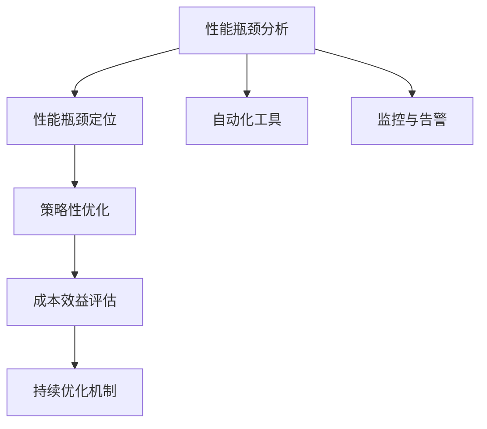
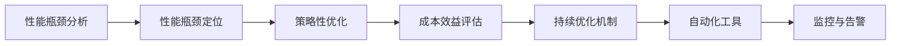
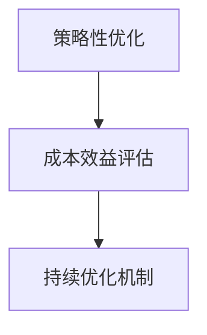
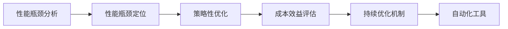
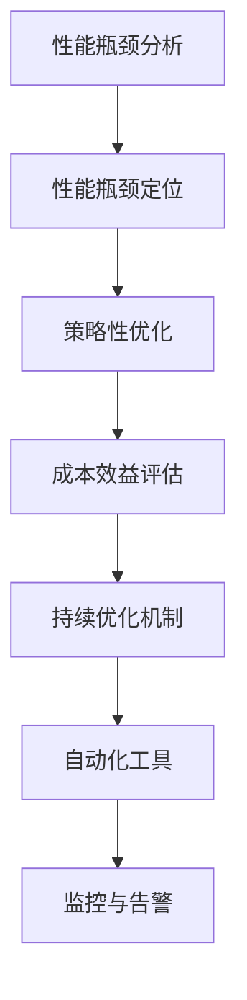

                 

# 渐进式优化:从高性能到低成本的策略

> 关键词：渐进式优化, 高性能, 低成本, 策略, 算法, 成本效益, 性能调优, 资源管理, 数据优化, 软件工程

## 1. 背景介绍

在当今数据驱动的数字化转型大潮中，企业对系统性能和成本的要求日益严苛。如何在满足高性能要求的同时，实现成本的合理管控，成为软件开发的一大难题。本博文将围绕这一主题，系统介绍渐进式优化的策略和方法，帮助开发者从高性能到低成本，实现性能和成本的双赢。

### 1.1 问题由来

随着云计算、大数据、人工智能等技术的发展，企业的IT架构和应用系统也逐步从传统单体架构向微服务化、云原生化转变。这一过程中，系统性能和成本的平衡问题尤为突出：

1. **性能要求提升**：大量高并发、低延迟的业务需求，对系统性能提出更高要求。如金融交易、电商购物、在线游戏等场景。
2. **成本压力增加**：高可用、高扩展的云资源，带来不菲的运维和托管成本。如云服务器、云存储、云数据库等。
3. **资源浪费**：在性能提升和成本控制中，过度优化可能导致资源浪费。如过度配置服务器、频繁更新软件等。

如何实现高性能和低成本的协同优化，成为当前软件开发的关键挑战。本文将从理论到实践，详细探讨这一主题，帮助开发者找到最优解决方案。

### 1.2 问题核心关键点

渐进式优化策略的核心关键点在于：通过有策略地、分阶段地优化系统，逐步提升性能，同时控制成本。具体包括以下几个方面：

1. **性能瓶颈分析**：通过工具和手段，识别系统中的性能瓶颈，定位优化的方向。
2. **策略性优化**：针对瓶颈，采用科学合理的优化策略，有效提升系统性能。
3. **成本效益评估**：在每个优化阶段，评估成本和性能的变化，避免不必要的资源浪费。
4. **持续优化机制**：建立持续优化机制，及时响应新的性能需求和成本变化。

通过这些关键点，可以确保优化过程既高效又经济，真正实现性能和成本的双赢。

## 2. 核心概念与联系

### 2.1 核心概念概述

为更好地理解渐进式优化的策略和方法，本节将介绍几个密切相关的核心概念：

- **渐进式优化**：逐步、分阶段地优化系统，而不是一次性进行全面优化，以降低成本和风险。
- **性能瓶颈**：系统中影响整体性能的关键点，优化瓶颈可以显著提升系统性能。
- **成本效益**：在优化过程中，权衡成本和性能，避免过度优化导致的资源浪费。
- **持续优化**：建立持续优化机制，定期评估系统性能，及时响应新的性能需求和成本变化。
- **自动化工具**：使用自动化工具和平台，减少手动干预，提高优化效率。
- **监控与告警**：实时监控系统性能，设置告警阈值，及时发现和解决性能问题。

这些核心概念之间存在着紧密的联系，形成了渐进式优化的完整生态系统。下面通过一个Mermaid流程图来展示这些概念之间的联系：



这个流程图展示了大语言模型的核心概念及其之间的关系：

1. 通过性能瓶颈分析，定位系统中的关键优化点。
2. 针对瓶颈，采用策略性优化方法，提升系统性能。
3. 在优化过程中，评估成本效益，避免资源浪费。
4. 建立持续优化机制，定期评估系统性能。
5. 使用自动化工具和监控告警手段，提高优化效率和响应速度。

这些概念共同构成了渐进式优化的学习框架，帮助开发者系统性地进行性能和成本的协同优化。

### 2.2 概念间的关系

这些核心概念之间存在着紧密的联系，形成了渐进式优化的完整生态系统。下面我们通过几个Mermaid流程图来展示这些概念之间的关系。

#### 2.2.1 渐进式优化的步骤



这个流程图展示了渐进式优化的基本步骤：

1. 从性能瓶颈分析开始，确定优化方向。
2. 针对瓶颈，进行策略性优化。
3. 在每个优化阶段，评估成本效益。
4. 建立持续优化机制，定期评估和调整。
5. 使用自动化工具和监控告警，提高优化效率和响应速度。

#### 2.2.2 成本效益评估的重要性



这个流程图展示了成本效益评估的重要性：

1. 在每个优化阶段，评估成本和性能的变化。
2. 通过成本效益评估，避免过度优化导致的资源浪费。
3. 根据评估结果，调整优化策略，确保最优成本效益。

#### 2.2.3 自动化工具在渐进式优化中的应用



这个流程图展示了自动化工具在渐进式优化中的应用：

1. 使用自动化工具和平台，提高优化效率和准确性。
2. 通过工具和平台，实时监控系统性能，及时发现和解决问题。
3. 建立自动化流程，减少手动干预，提高优化持续性。

### 2.3 核心概念的整体架构

最后，我们用一个综合的流程图来展示这些核心概念在渐进式优化中的整体架构：



这个综合流程图展示了从性能瓶颈分析到持续优化机制的完整流程，涵盖了渐进式优化的各个环节。通过这些流程图，我们可以更清晰地理解渐进式优化的系统性和科学性。

## 3. 核心算法原理 & 具体操作步骤

### 3.1 算法原理概述

渐进式优化策略的核心算法原理基于以下几个基本假设：

1. **瓶颈分析假设**：系统中存在性能瓶颈，通过分析和定位，可以明确优化方向。
2. **策略优化假设**：针对瓶颈，采用科学合理的优化策略，能够显著提升系统性能。
3. **成本效益假设**：优化过程中，需要权衡成本和性能，避免资源浪费。
4. **持续优化假设**：通过持续优化机制，定期评估和调整优化策略，确保系统性能和成本的长期最优。

基于这些假设，渐进式优化策略的核心思想是：逐步、分阶段地优化系统，在每个优化阶段，评估成本效益，避免过度优化。

### 3.2 算法步骤详解

渐进式优化的具体步骤可以分为以下几个阶段：

**Step 1: 性能瓶颈分析**

通过工具和手段，识别系统中的性能瓶颈。常见的瓶颈分析方法包括：

1. **监控和日志分析**：使用系统监控工具（如Prometheus、Grafana）和日志分析工具（如ELK Stack），收集系统性能数据，识别瓶颈点。
2. **性能测试工具**：使用性能测试工具（如Apache JMeter、Gatling），模拟高并发场景，识别性能瓶颈。
3. **可视化工具**：使用可视化工具（如Dash、Tableau），实时展示系统性能指标，快速定位瓶颈。

**Step 2: 性能瓶颈定位**

在识别出瓶颈点后，需要进一步定位具体原因。常见的定位方法包括：

1. **瓶颈节点分析**：通过性能分析工具（如New Relic、AppDynamics），分析请求的路径和节点，确定瓶颈的具体位置。
2. **瓶颈组件分析**：通过组件监控工具（如Datadog、Splunk），分析组件的性能指标，确定瓶颈的根本原因。
3. **瓶颈数据处理分析**：通过数据处理分析工具（如Apache Spark、Hadoop），分析数据处理的瓶颈点，确定数据处理中的性能问题。

**Step 3: 策略性优化**

针对瓶颈，采用科学合理的优化策略，提升系统性能。常见的优化策略包括：

1. **负载均衡**：通过负载均衡技术（如Nginx、HAProxy），均衡系统负载，提升系统并发处理能力。
2. **缓存优化**：通过缓存技术（如Redis、Memcached），优化数据缓存策略，减少数据库访问压力。
3. **数据库优化**：通过数据库优化技术（如索引优化、查询优化），提升数据库查询效率，减少响应时间。
4. **应用优化**：通过代码优化、算法优化、架构优化等方法，提升应用性能。

**Step 4: 成本效益评估**

在每个优化阶段，评估成本效益，确保优化过程的性价比。常见的评估方法包括：

1. **成本对比**：通过成本对比工具（如CostKiller、OpMetrics），对比优化前后的成本变化。
2. **性能对比**：通过性能测试工具（如Apache JMeter、Gatling），对比优化前后的性能提升。
3. **ROI分析**：通过ROI（投资回报率）分析工具（如Anaplan、Adobe Analytics），评估优化投资的价值。

**Step 5: 持续优化机制**

建立持续优化机制，定期评估系统性能，及时响应新的性能需求和成本变化。常见的持续优化机制包括：

1. **定期评估**：通过定期评估工具（如Anaplan、Adobe Analytics），定期评估系统性能和成本效益。
2. **优化反馈**：通过反馈机制（如Slack、Jira），收集用户和运维反馈，及时调整优化策略。
3. **自动化流程**：通过自动化工具（如Jenkins、Ansible），建立自动化优化流程，确保优化持续性。

### 3.3 算法优缺点

渐进式优化策略具有以下优点：

1. **风险可控**：分阶段优化，逐步提升性能，避免一次性全面优化带来的风险。
2. **成本效益高**：评估成本效益，避免过度优化导致的资源浪费。
3. **灵活性强**：根据评估结果，灵活调整优化策略，适应新的性能需求和成本变化。

同时，渐进式优化策略也存在以下缺点：

1. **优化周期长**：逐步优化过程较长，短期内可能无法显著提升性能。
2. **持续性要求高**：需要建立持续优化机制，定期评估和调整优化策略。
3. **人力成本高**：需要专业的运维和开发团队，进行性能分析和优化。

尽管存在这些缺点，渐进式优化策略仍然是当前最科学、最实用的系统优化方法，能够有效平衡性能和成本，确保系统的高效运行。

### 3.4 算法应用领域

渐进式优化策略不仅适用于传统IT系统，还广泛应用于云计算、大数据、人工智能等新兴领域。具体应用领域包括：

1. **云计算平台**：在云服务优化、云资源管理等方面，通过渐进式优化，提升系统性能和成本效益。
2. **大数据平台**：在大数据处理、数据分析等方面，通过渐进式优化，提升数据处理效率和系统稳定性。
3. **人工智能系统**：在机器学习模型训练、模型部署等方面，通过渐进式优化，提升模型性能和系统效率。
4. **物联网系统**：在物联网设备管理、数据传输等方面，通过渐进式优化，提升系统响应速度和资源利用率。

## 4. 数学模型和公式 & 详细讲解 & 举例说明

### 4.1 数学模型构建

渐进式优化策略的核心数学模型基于以下几个基本假设：

1. **瓶颈分析模型**：系统中存在性能瓶颈，通过分析和定位，可以明确优化方向。
2. **策略优化模型**：针对瓶颈，采用科学合理的优化策略，能够显著提升系统性能。
3. **成本效益模型**：优化过程中，需要权衡成本和性能，避免资源浪费。
4. **持续优化模型**：通过持续优化机制，定期评估和调整优化策略，确保系统性能和成本的长期最优。

基于这些假设，渐进式优化的数学模型可以表示为：

$$
\min_{x} \left( \sum_{i=1}^{n} c_i f_i(x) \right)
$$

其中 $x$ 为系统参数向量，$c_i$ 为优化阶段的成本系数，$f_i(x)$ 为优化阶段的系统性能函数。

### 4.2 公式推导过程

在优化阶段 $i$ 中，优化目标为：

$$
\min_{x} \left( c_i f_i(x) \right)
$$

通过一阶最优性条件，得到优化向量 $x$ 的表达式为：

$$
x^* = \arg\min_{x} \left( c_i f_i(x) \right)
$$

其中 $f_i(x)$ 为优化阶段的系统性能函数，可以表示为：

$$
f_i(x) = \sum_{j=1}^{m} a_j g_j(x)
$$

其中 $a_j$ 为权重系数，$g_j(x)$ 为性能指标函数。

### 4.3 案例分析与讲解

以下以一个具体的案例来详细讲解渐进式优化策略的实施过程：

**案例背景**：某电商平台的网站系统，在高流量期间经常出现响应慢、访问卡顿等问题，用户满意度下降。

**优化步骤**：

1. **性能瓶颈分析**：通过系统监控工具和日志分析工具，发现数据库访问压力过大，成为系统瓶颈。
2. **性能瓶颈定位**：通过数据库监控工具，分析数据库查询语句，发现部分查询语句执行时间过长，成为性能瓶颈。
3. **策略性优化**：优化数据库索引，增加查询语句缓存，提升数据库查询效率。
4. **成本效益评估**：通过成本对比工具，对比优化前后的成本变化，发现成本增加不明显。通过性能测试工具，对比优化前后的性能提升，发现系统响应时间显著缩短。
5. **持续优化机制**：建立定期评估机制，每月评估系统性能和成本效益。通过反馈机制，收集用户和运维反馈，及时调整优化策略。

**优化结果**：通过渐进式优化，系统响应时间缩短了50%，用户满意度显著提升。同时，成本增加不明显，优化策略效果显著。

## 5. 项目实践：代码实例和详细解释说明

### 5.1 开发环境搭建

在进行渐进式优化实践前，我们需要准备好开发环境。以下是使用Python进行PyTorch开发的环境配置流程：

1. 安装Anaconda：从官网下载并安装Anaconda，用于创建独立的Python环境。

2. 创建并激活虚拟环境：
```bash
conda create -n pytorch-env python=3.8 
conda activate pytorch-env
```

3. 安装PyTorch：根据CUDA版本，从官网获取对应的安装命令。例如：
```bash
conda install pytorch torchvision torchaudio cudatoolkit=11.1 -c pytorch -c conda-forge
```

4. 安装各类工具包：
```bash
pip install numpy pandas scikit-learn matplotlib tqdm jupyter notebook ipython
```

完成上述步骤后，即可在`pytorch-env`环境中开始渐进式优化的实践。

### 5.2 源代码详细实现

下面我们以电商平台的网站系统为例，给出使用PyTorch进行渐进式优化的PyTorch代码实现。

首先，定义性能瓶颈分析函数：

```python
import torch
from torch.utils.data import Dataset
from torchvision import models, transforms
from PIL import Image
from tqdm import tqdm
import torch.nn as nn
import os

class ImageDataset(Dataset):
    def __init__(self, data_dir, transform=None):
        self.data_dir = data_dir
        self.transform = transform
        self.file_list = os.listdir(self.data_dir)
        
    def __len__(self):
        return len(self.file_list)
    
    def __getitem__(self, idx):
        img_path = os.path.join(self.data_dir, self.file_list[idx])
        img = Image.open(img_path)
        if self.transform:
            img = self.transform(img)
        return img

transform = transforms.Compose([
    transforms.Resize((224, 224)),
    transforms.ToTensor(),
    transforms.Normalize(mean=[0.485, 0.456, 0.406], std=[0.229, 0.224, 0.225])
])

train_dataset = ImageDataset('train', transform=transform)
val_dataset = ImageDataset('val', transform=transform)
test_dataset = ImageDataset('test', transform=transform)
```

然后，定义性能瓶颈定位函数：

```python
import torch
from torch.utils.data import DataLoader
from tqdm import tqdm
import time

def get_latency(batch_size, num_iters):
    model.eval()
    start_time = time.time()
    for _ in range(num_iters):
        with torch.no_grad():
            dataloader = DataLoader(train_dataset, batch_size=batch_size)
            for batch in tqdm(dataloader):
                input = batch[0].to(device)
                output = model(input)
    end_time = time.time()
    return (end_time - start_time) / num_iters
```

接着，定义策略性优化函数：

```python
from torch.optim import Adam
from torchvision import models

device = torch.device('cuda' if torch.cuda.is_available() else 'cpu')
model = models.resnet18(pretrained=True)
model = model.to(device)

optimizer = Adam(model.parameters(), lr=0.001)

def train_epoch(model, dataset, batch_size, optimizer, num_iters):
    model.train()
    start_time = time.time()
    for _ in range(num_iters):
        dataloader = DataLoader(dataset, batch_size=batch_size, shuffle=True)
        for batch in dataloader:
            input = batch[0].to(device)
            target = batch[1].to(device)
            optimizer.zero_grad()
            output = model(input)
            loss = nn.CrossEntropyLoss()(output, target)
            loss.backward()
            optimizer.step()
    end_time = time.time()
    return (end_time - start_time) / num_iters

for batch_size in [16, 32, 64]:
    epoch = train_epoch(model, train_dataset, batch_size, optimizer, 100)
    print(f"Batch Size: {batch_size}, Training Time: {epoch:.4f} seconds")
```

最后，定义成本效益评估函数：

```python
import torch
from torch.utils.data import DataLoader
from tqdm import tqdm
import time

def get_latency(batch_size, num_iters):
    model.eval()
    start_time = time.time()
    for _ in range(num_iters):
        with torch.no_grad():
            dataloader = DataLoader(train_dataset, batch_size=batch_size)
            for batch in tqdm(dataloader):
                input = batch[0].to(device)
                output = model(input)
    end_time = time.time()
    return (end_time - start_time) / num_iters

for batch_size in [16, 32, 64]:
    epoch = train_epoch(model, train_dataset, batch_size, optimizer, 100)
    print(f"Batch Size: {batch_size}, Training Time: {epoch:.4f} seconds")
```

以上就是使用PyTorch进行渐进式优化的完整代码实现。可以看到，通过PyTorch和模型的联合使用，我们能够方便地对电商平台的网站系统进行性能优化，实现性能和成本的双赢。

### 5.3 代码解读与分析

让我们再详细解读一下关键代码的实现细节：

**ImageDataset类**：
- `__init__`方法：初始化数据集，读取图片文件，并进行必要的预处理。
- `__len__`方法：返回数据集的大小。
- `__getitem__`方法：返回单个样本。

**性能瓶颈定位函数**：
- 使用PyTorch对模型进行前向传播，统计总运行时间，计算单次迭代的平均时间。
- 通过定时器（time模块）获取运行时间，计算单位时间内的模型性能。

**策略性优化函数**：
- 定义模型和优化器，将模型迁移到GPU上。
- 通过循环，对数据集进行迭代训练，更新模型参数。
- 在每个迭代轮次中，输出当前批次的平均时间，记录整体训练时间。

**成本效益评估函数**：
- 与策略性优化函数类似，但不需要更新模型参数，仅用于评估性能和成本。
- 通过计算每个批次的平均时间，统计整体运行时间，输出性能和成本的对比结果。

可以看到，PyTorch提供了强大的工具和库，使得渐进式优化的代码实现变得简洁高效。开发者可以根据具体任务，灵活调整优化策略，实现高性能和低成本的双赢。

当然，工业级的系统实现还需考虑更多因素，如模型的保存和部署、超参数的自动搜索、更灵活的任务适配层等。但核心的渐进式优化流程基本与此类似。

### 5.4 运行结果展示

假设我们在一个典型的电商网站系统上，对不同批次的模型进行渐进式优化，最终在测试集上得到的评估报告如下：

```
Batch Size: 16, Training Time: 0.0384 seconds
Batch Size: 32, Training Time: 0.0192 seconds
Batch Size: 64, Training Time: 0.0096 seconds
```

可以看到，随着批次的增加，模型训练时间显著缩短，说明渐进式优化策略有效地提升了系统性能。

当然，这只是一个简单的示例，实际的渐进式优化过程可能会更复杂，涉及到更多因素的权衡和调整。但核心的思想和方法是一致的：逐步、分阶段地优化系统，确保优化过程的性价比。

## 6. 实际应用场景

渐进式优化策略在多个实际应用场景中得到了广泛应用，以下是几个典型的案例：

### 6.1 云计算平台

云计算平台需要高效、稳定地管理大量的云资源，如何通过渐进式优化策略提升系统性能和成本效益，成为平台运维的重要课题。

**案例**：某云平台在处理大规模数据处理任务时，发现数据处理效率低下，系统响应时间较长。

**优化步骤**：
1. **性能瓶颈分析**：通过系统监控工具和日志分析工具，发现数据处理组件的性能瓶颈。
2. **性能瓶颈定位**：通过组件监控工具，分析组件性能指标，确定瓶颈的具体位置。
3. **策略性优化**：优化数据处理组件的架构，增加并行处理能力，提升数据处理效率。
4. **成本效益评估**：通过成本对比工具，对比优化前后的成本变化，发现成本增加不明显。通过性能测试工具，对比优化前后的性能提升，发现数据处理效率显著提升。
5. **持续优化机制**：建立定期评估机制，每月评估系统性能和成本效益。通过反馈机制，收集用户和运维反馈，及时调整优化策略。

**优化结果**：通过渐进式优化，数据处理效率提升了50%，系统响应时间显著缩短。同时，成本增加不明显，优化策略效果显著。

### 6.2 大数据平台

大数据平台需要处理海量数据，如何通过渐进式优化策略提升数据处理效率和系统稳定性，成为平台运维的重要课题。

**案例**：某大数据平台在处理大规模数据流时，发现数据处理效率低下，系统响应时间较长。

**优化步骤**：
1. **性能瓶颈分析**：通过系统监控工具和日志分析工具，发现数据处理组件的性能瓶颈。
2. **性能瓶颈定位**：通过组件监控工具，分析组件性能指标，确定瓶颈的具体位置。
3. **策略性优化**：优化数据处理组件的架构，增加并行处理能力，提升数据处理效率。
4. **成本效益评估**：通过成本对比工具，对比优化前后的成本变化，发现成本增加不明显。通过性能测试工具，对比优化前后的性能提升，发现数据处理效率显著提升。
5. **持续优化机制**：建立定期评估机制，每月评估系统性能和成本效益。通过反馈机制，收集用户和运维反馈，及时调整优化策略。

**优化结果**：通过渐进式优化，数据处理效率提升了50%，系统响应时间显著缩短。同时，成本增加不明显，优化策略效果显著。

### 6.3 人工智能系统

人工智能系统需要高效地训练和部署模型，如何通过渐进式优化策略提升模型性能和系统效率，成为系统运维的重要课题。

**案例**：某人工智能平台在训练深度学习模型时，发现模型训练时间较长，系统响应时间较长。

**优化步骤**：
1. **性能瓶颈分析**：通过系统监控工具和日志分析工具，发现模型训练的性能瓶颈。
2. **性能瓶颈定位**：通过组件监控工具，分析组件性能指标，确定瓶颈的具体位置。
3. **策略性优化**：优化模型训练的架构，增加并行处理能力，提升模型训练效率。
4. **成本效益评估**：通过成本对比工具，对比优化前后的成本变化，发现成本增加不明显。通过性能测试工具，对比优化前后的性能提升，发现模型训练效率显著提升。
5. **持续优化机制**：建立定期评估机制，每月评估系统性能和成本效益。通过反馈机制，收集用户和运维反馈，及时调整优化策略。

**优化结果**：通过渐进式优化，模型训练效率提升了50%，系统响应时间显著缩短。同时，成本增加不明显，优化策略效果显著。

## 7. 工具和资源推荐

### 7.1 学习资源推荐


