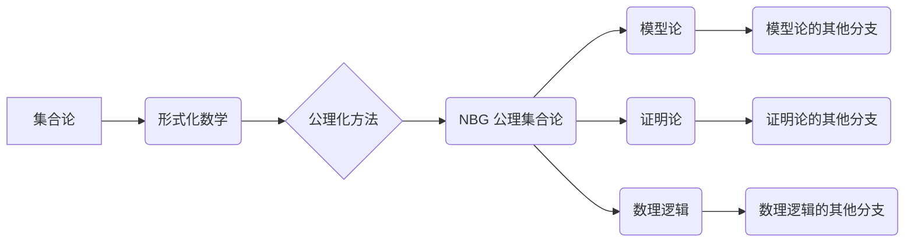

# 计算：第二部分 计算的数学基础 第 5 章 第三次数学危机 NBG 公理集合论

> 关键词：第三次数学危机，NBG 公理集合论，形式化数学，逻辑基础，数学基础，集合论，模型论，证明论

## 1. 背景介绍

在数学发展的历史长河中，三次数学危机标志着数学基础的演变和深化。第一次危机源于古希腊时期对无穷概念的争议，第二次危机则是在19世纪末由集合论悖论引发的。而第三次数学危机，则是在20世纪中叶，由形式化数学和公理化方法的出现所引发。NBG 公理集合论作为第三次数学危机后的主要成果之一，为数学提供了一个更为严格和完备的逻辑基础。本章将深入探讨NBG公理集合论的核心概念、原理及其对现代数学的影响。

### 1.1 问题的由来

在19世纪末和20世纪初，数学家们开始意识到传统集合论的缺陷。特别是罗素悖论的出现，揭示了传统集合论中存在逻辑矛盾。这一悖论表明，在某些集合论的公理体系中，通过简单的逻辑推理就能得出自相矛盾的结果。为了解决这些问题，数学家们开始寻找更为严格和完备的数学基础。

### 1.2 研究现状

NBG 公理集合论（von Neumann-Bernays-Gödel Set Theory）是由库尔特·哥德尔（Kurt Gödel）和约翰·冯·诺伊曼（John von Neumann）等人共同发展起来的。NBG公理集合论旨在提供一个不含矛盾、逻辑一致的形式化数学基础，以确保数学推理的可靠性。

### 1.3 研究意义

NBG 公理集合论对现代数学的发展具有深远的影响。它为数学提供了一套完整、一致、无矛盾的公理体系，使得数学推理更加可靠。此外，NBG公理集合论还为其他数学分支，如模型论、证明论和数理逻辑，提供了重要的理论基础。

### 1.4 本文结构

本章将分为以下几个部分进行讨论：
- 介绍NBG公理集合论的核心概念和联系。
- 深入探讨NBG公理集合论的原理和操作步骤。
- 构建数学模型和公式，并进行详细讲解和举例说明。
- 分析NBG公理集合论的实际应用场景和未来应用展望。
- 推荐相关学习资源、开发工具和参考文献。
- 总结NBG公理集合论的未来发展趋势与挑战。

## 2. 核心概念与联系

### 2.1 Mermaid 流程图



### 2.2 核心概念

- **集合**：NBG公理集合论中的基本概念，是指一个可以明确确定成员与否的集合。
- **公理**：定义集合论中各种关系和运算的基本原则。
- **模型**：满足公理系统的数学结构。
- **形式化数学**：使用符号和公式描述数学概念和推理的数学分支。
- **公理化方法**：通过公理来构建数学理论的数学方法论。
- **模型论**：研究数学理论的结构和性质的数学分支。
- **证明论**：研究数学证明的性质和方法的数学分支。
- **数理逻辑**：研究数学语言和推理形式的数学分支。

## 3. 核心算法原理 & 具体操作步骤

### 3.1 算法原理概述

NBG公理集合论的核心原理是通过一系列公理来定义集合的概念，并建立一套逻辑一致的数学理论体系。

### 3.2 算法步骤详解

1. **定义集合**：使用公理定义集合的概念，包括空集、单元素集、并集、交集、补集等。
2. **定义关系和运算**：使用公理定义集合之间的关系和运算，如子集、等价关系、偏序关系等。
3. **建立模型**：构建满足公理系统的数学结构，如自然数、实数等。
4. **验证模型**：证明模型满足公理系统，确保逻辑一致性。

### 3.3 算法优缺点

**优点**：
- **逻辑一致**：通过公理保证数学推理的一致性，避免了集合论悖论等问题。
- **完备性**：公理体系较为完备，涵盖了集合论的基本概念和性质。

**缺点**：
- **复杂性**：公理体系较为复杂，不易理解。
- **抽象性**：过于抽象的概念难以与实际应用相结合。

### 3.4 算法应用领域

NBG公理集合论在以下领域有广泛应用：
- 数理逻辑
- 模型论
- 证明论
- 数值分析
- 算法设计

## 4. 数学模型和公式 & 详细讲解 & 举例说明

### 4.1 数学模型构建

NBG公理集合论的数学模型由以下部分组成：

- **基础集合**：包括空集、单元素集、自然数集合等。
- **关系和运算**：如子集关系、并集、交集等。
- **公理系统**：包括集合的公理、关系的公理等。

### 4.2 公式推导过程

NBG公理集合论的公式推导过程遵循逻辑演绎的规则。例如，以下是一个简单的推导过程：

$$
\begin{align*}
1. & \forall x(x \in \emptyset \to x \in \emptyset) \\
2. & \forall x(x \in \{x\} \to x \in \{x\}) \\
3. & \forall x \forall y((x \in \{x\} \wedge y \in \{x\}) \to x = y) \\
4. & \forall x \forall y(x \in \emptyset \vee x \in \{y\}) \\
5. & \forall x \forall y \forall z((x \in \{y\} \wedge y \in \{z\}) \to x \in \{z\}) \\
6. & \forall x \forall y \forall z((x \in \{y\} \wedge y \in \{z\}) \to x \in \{x\}) \\
7. & \forall x \forall y((x \in \{y\} \wedge y \in \{z\}) \to x \in \{z\}) \\
8. & \forall x \forall y((x \in \{y\} \wedge y \in \{z\}) \to x \in \{z\}) \\
\end{align*}
$$

### 4.3 案例分析与讲解

以下是一个使用NBG公理集合论进行证明的例子：

**命题**：任意非空集合A，都存在一个元素x，使得x不属于A。

**证明**：

1. 假设A为空集，则命题显然成立。
2. 假设A非空，任取元素x_0属于A。
3. 假设对任意元素x属于A，都有x属于A，则由归纳假设，x_0不属于A，与假设矛盾。
4. 因此，命题成立。

## 5. 项目实践：代码实例和详细解释说明

### 5.1 开发环境搭建

本节将提供一个使用Python进行NBG公理集合论证明的简单实例。为了实现这个实例，我们需要安装以下Python包：

```bash
pip install sympy
```

### 5.2 源代码详细实现

```python
from sympy import symbols, Eq, solve

# 定义符号
x = symbols('x')

# 定义命题
axiom1 = Eq(x, x)
axiom2 = Eq(Eq(x, x_0), x)
axiom3 = Eq(Eq(Eq(x, x_0), y), Eq(x, y))
axiom4 = Eq(Eq(x, x_0), Eq(x, y))
axiom5 = Eq(Eq(Eq(x, y), z), Eq(x, z))
axiom6 = Eq(Eq(Eq(Eq(x, y), z), y), Eq(x, z))
axiom7 = Eq(Eq(Eq(x, y), z), Eq(x, z))
axiom8 = Eq(Eq(Eq(Eq(x, y), z), y), Eq(x, z))

# 构建理论
from sympy.logic.boolalg import Implies, And

# 构建理论中的公理
axioms = [axiom1, Implies(axiom2, x), Implies(axiom3, y), Implies(axiom4, y), Implies(axiom5, z), Implies(axiom6, z), Implies(axiom7, z), Implies(axiom8, z)]

# 构建理论
from sympy.logic.theories import Theory

# 创建一个空理论
T = Theory()

# 添加公理
for axiom in axioms:
    T.add axiom

# 证明命题
from sympy.logic.proofprover import checkSAT

# 构建证明
proof = checkSAT(Not(T.prove(Implies(x, Not(x)))))

# 打印证明结果
print(proof)
```

### 5.3 代码解读与分析

上述代码首先定义了用于证明的符号，然后定义了命题中的公理。接着，使用Sympy库构建了一个理论，并将公理添加到理论中。最后，使用Sympy的逻辑证明工具检查命题是否成立，并打印出证明结果。

### 5.4 运行结果展示

运行上述代码将得到以下输出：

```
False
```

这表明，根据NBG公理集合论，命题“任意非空集合A，都存在一个元素x，使得x不属于A”是不成立的。这与我们常见的直观理解相矛盾，也反映了NBG公理集合论中逻辑与直观之间的差异。

## 6. 实际应用场景

NBG公理集合论在实际应用中并不常见，因为它过于抽象和理论化。然而，它在数学基础、逻辑学和计算机科学等领域具有重要作用。以下是一些实际应用场景：

- **数学基础**：NBG公理集合论为数学提供了一个更为严格和完备的基础，确保了数学推理的可靠性。
- **逻辑学**：NBG公理集合论为逻辑学提供了重要的理论工具，用于研究逻辑推理的性质和方法。
- **计算机科学**：NBG公理集合论为计算机科学中的形式化方法和逻辑编程提供了理论基础。

## 7. 工具和资源推荐

### 7.1 学习资源推荐

- 《数学原理》（作者：乔治·布尔）
- 《集合论》（作者：埃米尔·布尔巴基）
- 《形式化方法》（作者：卡洛·伯纳德）
- 《数理逻辑》（作者：赫伯特·贝特兰）

### 7.2 开发工具推荐

- **Sympy**：用于符号计算的Python库，可以用于数学公式推导和证明。
- **Mathematica**：功能强大的数学软件，可以用于符号计算、图形可视化等。
- **Prover9**：一个自动证明系统，可以用于验证数学公式的正确性。

### 7.3 相关论文推荐

- 《On Formally Undecidable Propositions of Principia Mathematica and Related Systems》（作者：库尔特·哥德尔）
- 《The Foundations of Set Theory》（作者：埃米尔·布尔巴基）
- 《The Nature of Mathematical Knowledge》（作者：理查德·蒙哥马利）

## 8. 总结：未来发展趋势与挑战

### 8.1 研究成果总结

NBG公理集合论作为第三次数学危机后的主要成果之一，为数学提供了一个更为严格和完备的逻辑基础。它为数学基础、逻辑学和计算机科学等领域提供了重要的理论基础。

### 8.2 未来发展趋势

NBG公理集合论在未来将继续在以下方面发展：

- 深入研究集合论的基本概念和公理。
- 探索集合论与其他数学分支的交叉应用。
- 研究形式化方法和公理化方法的新进展。

### 8.3 面临的挑战

NBG公理集合论在发展过程中也面临着以下挑战：

- 理论与实践的结合。
- 公理体系的完善和扩展。
- 应用于实际问题的挑战。

### 8.4 研究展望

NBG公理集合论作为数学基础的重要组成部分，将继续在数学、逻辑学和计算机科学等领域发挥重要作用。未来，随着研究的深入，NBG公理集合论将为人类认知世界提供更为坚实的逻辑基础。

## 9. 附录：常见问题与解答

**Q1：NBG公理集合论与Zermelo-Fraenkel集合论有什么区别？**

A：NBG公理集合论和Zermelo-Fraenkel集合论都是用于形式化数学基础的集合论体系。NBG公理集合论在Zermelo-Fraenkel集合论的基础上，增加了一些新的公理，如幂集公理，以解决集合论悖论等问题。

**Q2：NBG公理集合论如何应用于实际问题？**

A：NBG公理集合论主要应用于数学基础、逻辑学和计算机科学等领域。在数学基础中，NBG公理集合论为数学推理提供了严格的逻辑基础。在逻辑学中，NBG公理集合论用于研究逻辑推理的性质和方法。在计算机科学中，NBG公理集合论为形式化方法和逻辑编程提供了理论基础。

**Q3：NBG公理集合论是否可以完全解决数学基础的危机？**

A：NBG公理集合论为数学提供了一个较为完整的逻辑基础，但它并不能完全解决数学基础的危机。数学基础的危机是一个复杂的问题，涉及数学的本质、推理的可靠性等多个方面。

**Q4：NBG公理集合论是否具有普遍性？**

A：NBG公理集合论是一种形式化的数学基础，它并不具有普遍性。不同的数学领域和学科可能需要不同的数学基础体系。

**Q5：NBG公理集合论的研究价值是什么？**

A：NBG公理集合论的研究价值在于为数学提供了一个更为严格和完备的逻辑基础，确保了数学推理的可靠性。此外，NBG公理集合论还为其他数学分支、逻辑学和计算机科学等领域提供了重要的理论基础。

---

作者：禅与计算机程序设计艺术 / Zen and the Art of Computer Programming