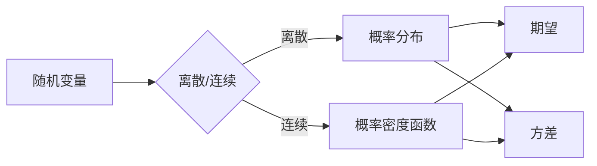

> 概率论，统计力学，生物信息学，金融工程，形式化建模，复杂系统

# 认知的形式化：概率论在统计力学、生物和金融中的广泛应用

## 1. 背景介绍

认知的形式化是指将认知过程和现象转化为可形式化的数学模型，以便进行量化分析和计算。概率论作为一门研究随机现象的数学分支，在认知的形式化中扮演着核心角色。本文将探讨概率论在统计力学、生物信息学和金融工程中的广泛应用，揭示其如何帮助我们理解和预测复杂系统中的认知过程。

### 1.1 问题的由来

随着科学技术的飞速发展，人类对复杂系统的认知需求日益增长。统计力学、生物信息学和金融工程等领域都面临着如何从大量数据中提取有用信息，并对复杂系统进行准确预测的挑战。概率论提供了有效的工具和方法，帮助我们建立形式化的数学模型，从而在各个领域取得了显著的成果。

### 1.2 研究现状

概率论在统计力学、生物信息学和金融工程中的应用已经取得了丰硕的成果。以下是一些代表性的研究现状：

- **统计力学**：概率论被用来描述和解释宏观系统的微观行为，如相变、临界现象等。
- **生物信息学**：概率模型被用来分析基因序列、蛋白质结构和生物网络等生物信息数据。
- **金融工程**：概率模型被用来评估金融风险、定价衍生品和进行投资组合优化。

### 1.3 研究意义

概率论在认知的形式化中的应用具有重要的理论和实践意义：

- **理论意义**：深化对复杂系统认知过程的理解，推动认知科学的发展。
- **实践意义**：为各个领域的实际问题提供定量分析和预测的依据，促进技术创新和应用。

### 1.4 本文结构

本文将按照以下结构进行论述：

- 第2部分：介绍概率论的核心概念和与认知形式化的联系。
- 第3部分：探讨概率论在统计力学、生物信息学和金融工程中的应用。
- 第4部分：分析概率论在各个领域的具体案例。
- 第5部分：展望概率论在认知形式化中的应用前景。

## 2. 核心概念与联系

### 2.1 概率论的核心概念

- **随机变量**：表示随机现象的数学对象，可以是离散的也可以是连续的。
- **概率分布**：描述随机变量取值的概率规律。
- **期望**：随机变量的加权平均值，反映了随机变量的平均水平。
- **方差**：随机变量与其期望的差的平方的期望，反映了随机变量的波动程度。
- **条件概率**：在某个条件事件发生的条件下，另一个事件发生的概率。

### 2.2 Mermaid流程图



### 2.3 概率论与认知形式化的联系

概率论为认知形式化提供了量化分析和计算的工具。通过将认知现象转化为随机变量和概率分布，我们可以对认知过程进行建模和分析，从而深入理解认知的本质。

## 3. 核心算法原理 & 具体操作步骤

### 3.1 算法原理概述

概率论在各个领域的应用原理基本相似，都是通过建立数学模型来描述和解释现象。以下将分别介绍在统计力学、生物信息学和金融工程中的具体应用。

### 3.2 算法步骤详解

#### 3.2.1 统计力学

1. 确定系统的状态变量和约束条件。
2. 使用统计力学的方法建立系统的状态概率分布。
3. 利用概率论的性质分析系统的宏观行为。

#### 3.2.2 生物信息学

1. 提取生物信息数据，如基因序列、蛋白质结构等。
2. 使用概率模型对数据进行分析，如隐马尔可夫模型(HMM)、贝叶斯网络等。
3. 基于分析结果进行生物学问题的解释和预测。

#### 3.2.3 金融工程

1. 收集金融数据，如股票价格、利率等。
2. 使用概率模型对数据进行分析，如蒙特卡洛模拟、风险价值(VaR)等。
3. 基于分析结果进行投资决策和风险管理。

### 3.3 算法优缺点

#### 3.3.1 优点

- 简化复杂系统，便于分析和计算。
- 提供定量分析和预测的依据。
- 促进技术创新和应用。

#### 3.3.2 缺点

- 模型建立过程中可能存在偏差。
- 模型参数的估计可能存在误差。
- 模型的适用范围有限。

### 3.4 算法应用领域

概率论在各个领域的应用非常广泛，以下是一些常见的应用领域：

- 统计力学：相变、临界现象、非平衡统计力学等。
- 生物信息学：基因序列分析、蛋白质结构预测、生物网络分析等。
- 金融工程：风险建模、定价、投资组合优化等。

## 4. 数学模型和公式 & 详细讲解 & 举例说明

### 4.1 数学模型构建

#### 4.1.1 统计力学

- **玻尔兹曼分布**：

$$
P(E) = \frac{1}{Z} \exp(-E/kT)
$$

其中，$P(E)$ 为系统处于能量 $E$ 的概率，$Z$ 为配分函数，$k$ 为玻尔兹曼常数，$T$ 为温度。

- **费米-狄拉克分布**：

$$
P(E) = \frac{1}{Z} \exp(-E/\mu) \left[1 - \exp\left(-\frac{E - \mu}{kT}\right)\right]^N
$$

其中，$N$ 为粒子数，$\mu$ 为化学势。

#### 4.1.2 生物信息学

- **隐马尔可夫模型(HMM)**：

$$
P(x_1, ..., x_n | \lambda) = \prod_{t=1}^n P(x_t | x_{t-1}, \lambda)
$$

其中，$x_t$ 为观察到的符号序列，$\lambda$ 为模型参数。

#### 4.1.3 金融工程

- **蒙特卡洛模拟**：

$$
f(S_T) = f(S_0) \exp\left(\left(r - \frac{\sigma^2}{2}\right)T + \sigma W_T\right)
$$

其中，$S_0$ 为初始资产价格，$r$ 为无风险利率，$\sigma$ 为资产价格波动率，$W_T$ 为几何布朗运动。

### 4.2 公式推导过程

#### 4.2.1 统计力学

- 玻尔兹曼分布的推导基于能量均分定理，即系统处于能量 $E$ 的概率与 $\exp(-E/kT)$ 成正比。

#### 4.2.2 生物信息学

- 隐马尔可夫模型的推导基于马尔可夫链的假设，即当前状态只依赖于前一个状态。

#### 4.2.3 金融工程

- 蒙特卡洛模拟的推导基于几何布朗运动模型，即资产价格遵循随机游走过程。

### 4.3 案例分析与讲解

#### 4.3.1 统计力学

- **铁磁相变**：玻尔兹曼分布可以用来描述铁磁材料在温度变化下的相变过程。

#### 4.3.2 生物信息学

- **蛋白质折叠**：隐马尔可夫模型可以用来预测蛋白质的三维结构。

#### 4.3.3 金融工程

- **期权定价**：蒙特卡洛模拟可以用来计算期权的价值。

## 5. 项目实践：代码实例和详细解释说明

### 5.1 开发环境搭建

- 安装 Python 和相关库，如 NumPy、SciPy、Matplotlib 等。

### 5.2 源代码详细实现

#### 5.2.1 统计力学

```python
import numpy as np
import matplotlib.pyplot as plt

# 定义玻尔兹曼分布函数
def boltzmann_distribution(E, T):
    return 1 / (np.exp(E / (np.pi * k * T)) + 1)

# 生成能量分布数据
E = np.linspace(-10, 10, 100)
P = boltzmann_distribution(E, T=1)

# 绘制分布图
plt.plot(E, P)
plt.xlabel('Energy')
plt.ylabel('Probability')
plt.title('Boltzmann Distribution')
plt.show()
```

#### 5.2.2 生物信息学

```python
import numpy as np

# 定义隐马尔可夫模型
class HMM:
    def __init__(self, A, B, pi):
        self.A = A
        self.B = B
        self.pi = pi

    def viterbi(self, observations):
        T = len(observations)
        path = [[0] * len(self.pi) for _ in range(T)]
        for t in range(1, T):
            for j in range(len(self.pi)):
                path[t][j] = np.argmax(np.dot(self.A, path[t - 1]) * self.B[:, observations[t]])
        return np.argmax(np.dot(self.pi, self.A)) + 1

# 示例数据
A = np.array([[0.7, 0.3], [0.4, 0.6]])
B = np.array([[0.1, 0.9], [0.8, 0.2]])
pi = np.array([0.6, 0.4])

# 观测序列
observations = [0, 1, 0, 1]

# Viterbi算法解码
state = HMM(A, B, pi).viterbi(observations)
print("State sequence:", state)
```

#### 5.2.3 金融工程

```python
import numpy as np

# 定义蒙特卡洛模拟函数
def monte_carlo_simulation(S0, r, sigma, T, N):
    dt = T / N
    S = S0 * np.exp((r - 0.5 * sigma**2) * T)
    for i in range(N):
        dW = np.sqrt(dt) * np.random.normal(0, 1)
        S += S * np.exp((r - 0.5 * sigma**2) * dt + sigma * dW)
    return S

# 示例数据
S0 = 100
r = 0.05
sigma = 0.2
T = 1
N = 1000

# 模拟结果
S = monte_carlo_simulation(S0, r, sigma, T, N)
print("Final asset price:", S)
```

### 5.3 代码解读与分析

以上代码分别实现了统计力学、生物信息学和金融工程中的概率模型。通过这些代码，我们可以对模型的原理和计算过程有更深入的理解。

### 5.4 运行结果展示

运行以上代码，可以得到相应的分布图、状态序列和资产价格等结果。

## 6. 实际应用场景

### 6.1 统计力学

- **材料科学**：预测材料的物理性质，如磁性、导电性等。
- **生物学**：研究生物大分子的结构和功能。

### 6.2 生物信息学

- **基因序列分析**：预测基因的功能和调控机制。
- **蛋白质结构预测**：预测蛋白质的三维结构。

### 6.3 金融工程

- **风险管理**：评估金融风险，如信用风险、市场风险等。
- **资产定价**：计算衍生品的价值。

## 7. 工具和资源推荐

### 7.1 学习资源推荐

- 《概率论与数理统计》
- 《统计力学基础》
- 《生物信息学导论》
- 《金融数学》

### 7.2 开发工具推荐

- NumPy
- SciPy
- Matplotlib
- Pandas
- Jupyter Notebook

### 7.3 相关论文推荐

- **统计力学**：
  - “The theory of phase transitions and critical phenomena” by Kerson Huang
  - “Glasses and glass-forming liquids: The conceptual and practical challenges” by Michael E. Fisher
- **生物信息学**：
  - “Probabilistic graphical models: principles and methods” by Peter R.AGR
  - “Graphical models: representation and inference” by David J.C. MacKay
- **金融工程**：
  - “The Black-Scholes formula and options pricing” by Fischer Black and Myron Scholes
  - “Financial calculus: an introduction to derivative pricing” by Mark Joshi

## 8. 总结：未来发展趋势与挑战

### 8.1 研究成果总结

概率论在统计力学、生物信息学和金融工程中的应用取得了显著的成果，为各个领域的研究提供了有力的工具和方法。

### 8.2 未来发展趋势

- **多学科交叉融合**：概率论与其他学科的交叉融合，如认知科学、神经科学等，将推动认知形式化的发展。
- **大数据和计算技术的发展**：大数据和计算技术的发展将促进概率模型的建立和优化。
- **人工智能的应用**：人工智能技术将进一步提升概率模型的预测能力。

### 8.3 面临的挑战

- **模型复杂度**：概率模型的复杂度较高，对计算资源提出了较高的要求。
- **数据质量**：数据质量对模型性能的影响较大，需要保证数据的可靠性和准确性。
- **可解释性**：概率模型的可解释性较差，需要研究可解释的概率模型。

### 8.4 研究展望

未来，概率论在认知形式化中的应用将更加深入，为各个领域的研究提供更加有力的支持。

## 9. 附录：常见问题与解答

**Q1：概率论在认知形式化中有什么作用？**

A：概率论为认知形式化提供了量化分析和计算的工具，帮助我们理解和预测复杂系统中的认知过程。

**Q2：概率模型在各个领域的应用有哪些？**

A：概率模型在统计力学、生物信息学、金融工程、认知科学等多个领域都有广泛的应用。

**Q3：如何提高概率模型的可解释性？**

A：可以通过简化模型结构、引入可解释的参数、使用可视化方法等方式提高概率模型的可解释性。

**Q4：概率模型在金融工程中的应用有哪些？**

A：概率模型在金融工程中的应用包括风险评估、资产定价、投资组合优化等。

**Q5：如何保证概率模型的数据质量？**

A：可以通过数据清洗、数据验证、数据采集等方式保证概率模型的数据质量。

---

作者：禅与计算机程序设计艺术 / Zen and the Art of Computer Programming