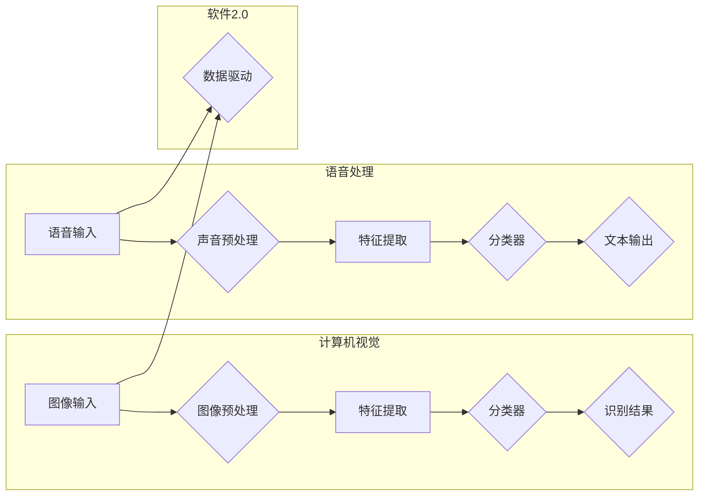

> 图像识别，语音识别，软件2.0，人工智能，机器学习，深度学习

# 软件 2.0 的应用领域：图像识别、语音识别

随着人工智能技术的飞速发展，软件2.0时代已经到来。在这个时代，软件不再仅仅是代码的集合，而是由数据驱动的智能系统。图像识别和语音识别作为人工智能领域的关键技术，已经在多个行业和领域中发挥着重要作用。本文将深入探讨软件2.0时代图像识别和语音识别的应用领域，以及其背后的技术原理和未来发展趋势。

## 1. 背景介绍

### 1.1 图像识别的起源与发展

图像识别是计算机视觉领域的一个重要分支，旨在让计算机理解和解释图像中的信息。从最初的基于规则的方法，到如今的深度学习模型，图像识别技术经历了漫长的发展历程。

### 1.2 语音识别的起源与发展

语音识别技术旨在让计算机理解和转换人类的语音指令。随着语音识别技术的不断进步，它已经广泛应用于智能助手、智能家居、语音搜索等领域。

### 1.3 软件2.0时代的到来

软件2.0时代以数据为中心，强调人工智能技术在软件中的应用，使得软件能够从数据中学习、适应和进化。

## 2. 核心概念与联系

### 2.1 核心概念

**图像识别**：通过计算机算法分析图像中的内容，识别其中的对象、场景和属性。

**语音识别**：将人类的语音信号转换为计算机可以理解的文本或指令。

### 2.2 架构图



### 2.3 关联

图像识别和语音识别都是软件2.0时代的数据驱动应用，它们通过学习大量数据来提升识别准确率，并不断进化。

## 3. 核心算法原理 & 具体操作步骤

### 3.1 算法原理概述

图像识别和语音识别都依赖于深度学习技术，特别是卷积神经网络（CNN）和循环神经网络（RNN）。

### 3.2 算法步骤详解

#### 图像识别

1. 图像预处理：对图像进行裁剪、缩放、旋转等操作，以适应模型的输入要求。
2. 特征提取：使用CNN提取图像的特征，如边缘、纹理、颜色等。
3. 分类器：使用全连接层或卷积层对提取的特征进行分类，识别图像中的对象。

#### 语音识别

1. 声音预处理：对语音信号进行降噪、去噪等操作，以提高识别准确率。
2. 特征提取：使用RNN或CNN提取语音的特征，如MFCC（梅尔频率倒谱系数）。
3. 分类器：使用全连接层对提取的特征进行分类，将语音转换为文本。

### 3.3 算法优缺点

#### 图像识别

优点：准确率高，泛化能力强。

缺点：计算量大，对硬件要求高。

#### 语音识别

优点：准确率高，对噪声容忍度高。

缺点：对说话人、语音风格变化敏感。

### 3.4 算法应用领域

图像识别：医疗影像诊断、自动驾驶、安防监控、人脸识别等。

语音识别：智能助手、智能家居、语音搜索、语音翻译等。

## 4. 数学模型和公式 & 详细讲解 & 举例说明

### 4.1 数学模型构建

#### 图像识别

假设输入图像为 $I$，经过预处理和特征提取后，得到的特征向量为 $X$。分类器的输出为 $Y$，损失函数为 $L(X, Y)$。

#### 语音识别

假设输入语音信号为 $V$，经过预处理和特征提取后，得到的特征向量为 $X$。分类器的输出为 $Y$，损失函数为 $L(X, Y)$。

### 4.2 公式推导过程

#### 图像识别

损失函数通常使用交叉熵损失函数：

$$
L(X, Y) = -\sum_{i=1}^N [y_i \log(\hat{y}_i)]
$$

其中，$y_i$ 为真实标签，$\hat{y}_i$ 为模型预测的标签。

#### 语音识别

损失函数同样使用交叉熵损失函数：

$$
L(X, Y) = -\sum_{i=1}^N [y_i \log(\hat{y}_i)]
$$

### 4.3 案例分析与讲解

#### 图像识别

以物体检测任务为例，可以使用Faster R-CNN模型进行实现。Faster R-CNN模型由三个部分组成：Region Proposal Network（RPN）、Region of Interest（ROI）Pool和Fast R-CNN。

1. RPN：生成候选区域。
2. ROI Pool：对候选区域进行特征提取。
3. Fast R-CNN：对提取的特征进行分类和边界框回归。

#### 语音识别

以端到端语音识别模型Transformer为例，其基本结构如下：

1. 编码器：将语音信号转换为序列向量。
2. 编码器输出：将序列向量转换为序列向量。
3. 解码器：将序列向量转换为文本。

## 5. 项目实践：代码实例和详细解释说明

### 5.1 开发环境搭建

以图像识别为例，需要安装以下软件：

- Python
- TensorFlow
- OpenCV
- PyTorch

### 5.2 源代码详细实现

以下是一个使用TensorFlow和Keras实现物体检测的简单示例：

```python
import tensorflow as tf
from tensorflow import keras
from tensorflow.keras.models import Sequential
from tensorflow.keras.layers import Conv2D, MaxPooling2D, Flatten, Dense, Dropout

# 创建模型
model = Sequential([
    Conv2D(32, (3, 3), activation='relu', input_shape=(64, 64, 3)),
    MaxPooling2D((2, 2)),
    Conv2D(64, (3, 3), activation='relu'),
    MaxPooling2D((2, 2)),
    Flatten(),
    Dense(128, activation='relu'),
    Dropout(0.5),
    Dense(1, activation='sigmoid')
])

# 编译模型
model.compile(optimizer='adam', loss='binary_crossentropy', metrics=['accuracy'])

# 训练模型
model.fit(x_train, y_train, epochs=10, batch_size=32)

# 评估模型
test_loss, test_acc = model.evaluate(x_test, y_test)
print('Test accuracy:', test_acc)
```

### 5.3 代码解读与分析

以上代码创建了一个简单的卷积神经网络模型，用于进行二分类任务。模型由卷积层、池化层、全连接层和Dropout层组成。模型训练过程中，使用二分类交叉熵损失函数和Adam优化器进行优化。训练完成后，在测试集上评估模型性能。

### 5.4 运行结果展示

运行上述代码后，可以在控制台看到模型的训练过程和最终测试集上的准确率。

## 6. 实际应用场景

### 6.1 图像识别

#### 医疗影像诊断

图像识别技术在医疗影像诊断中发挥着重要作用，可以帮助医生快速识别病变区域，提高诊断效率。

#### 自动驾驶

自动驾驶技术依赖于图像识别技术，用于识别道路标志、行人、车辆等，以确保行车安全。

#### 安防监控

图像识别技术可以用于安防监控，识别可疑人员、车辆等，提高监控效率。

#### 人脸识别

人脸识别技术可以用于门禁系统、支付系统等，提供便捷的身份验证方式。

### 6.2 语音识别

#### 智能助手

语音识别技术可以用于智能助手，实现语音指令识别和回复。

#### 智能家居

语音识别技术可以用于智能家居，实现语音控制家电、照明等。

#### 语音搜索

语音识别技术可以用于语音搜索，实现语音指令搜索和回复。

#### 语音翻译

语音识别技术可以用于语音翻译，实现不同语言之间的实时翻译。

## 7. 工具和资源推荐

### 7.1 学习资源推荐

- 《深度学习》
- 《Python深度学习》
- TensorFlow官方文档
- PyTorch官方文档

### 7.2 开发工具推荐

- TensorFlow
- PyTorch
- OpenCV
- Keras

### 7.3 相关论文推荐

- "Faster R-CNN: Towards Real-Time Object Detection with Region Proposal Networks"
- "Attention is All You Need"
- "Transformer: A Novel Neural Network Architecture for Language Modeling"

## 8. 总结：未来发展趋势与挑战

### 8.1 研究成果总结

图像识别和语音识别技术在软件2.0时代得到了广泛应用，为多个行业带来了巨大的变革。

### 8.2 未来发展趋势

- 模型轻量化：提高模型的运行效率，降低硬件要求。
- 模型可解释性：提高模型的可解释性，增强用户信任。
- 多模态融合：融合图像、语音等多模态信息，提高识别准确率。

### 8.3 面临的挑战

- 数据标注：高质量标注数据获取成本高。
- 模型泛化能力：提高模型在不同场景下的泛化能力。
- 模型鲁棒性：提高模型对噪声、干扰的鲁棒性。

### 8.4 研究展望

未来，图像识别和语音识别技术将继续发展，为人类生活带来更多便利和改变。

## 9. 附录：常见问题与解答

**Q1：图像识别和语音识别有什么区别？**

A：图像识别主要用于识别图像中的对象、场景和属性，而语音识别主要用于识别语音信号并将其转换为文本。

**Q2：如何提高图像识别和语音识别的准确率？**

A：可以通过增加数据量、改进模型结构、优化训练参数等方法提高准确率。

**Q3：图像识别和语音识别在哪些应用场景中使用？**

A：图像识别在医疗影像诊断、自动驾驶、安防监控、人脸识别等场景中使用；语音识别在智能助手、智能家居、语音搜索、语音翻译等场景中使用。

**Q4：如何处理图像识别和语音识别中的噪声问题？**

A：可以通过去噪、降噪等方法处理噪声问题。

**Q5：图像识别和语音识别的模型如何部署到实际应用中？**

A：可以将模型部署到服务器、移动设备或云端，并提供相应的API接口供应用调用。

---

作者：禅与计算机程序设计艺术 / Zen and the Art of Computer Programming