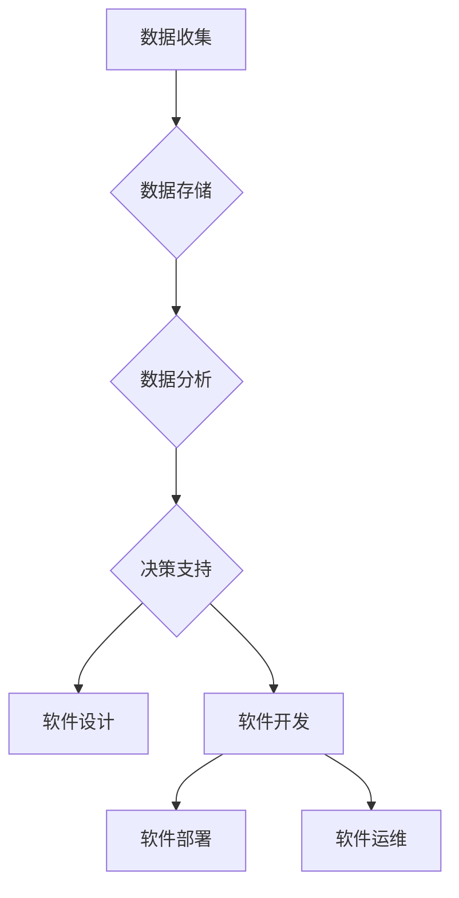

# 软件 2.0 的时代：数据驱动一切

> 关键词：软件2.0，数据驱动，DevOps，云计算，敏捷开发，持续集成，机器学习，人工智能

## 1. 背景介绍

随着互联网的普及和技术的飞速发展，软件行业经历了从传统的软件开发到软件2.0的变革。软件2.0时代，数据成为了软件开发的驱动力，驱动着软件的设计、开发、部署和维护等各个环节。本文将探讨软件2.0时代的数据驱动特性，分析其背后的原理和应用，并展望其未来发展趋势。

### 1.1 软件发展的历史

软件发展经历了几个主要阶段：

- **软件1.0时代**：以代码为中心，以功能实现为主要目标，强调软件的功能性和稳定性。
- **软件2.0时代**：以数据为中心，强调数据的收集、分析和应用，驱动软件的智能化和个性化。
- **软件3.0时代**：以服务为中心，强调软件的云化、移动化和开放性，提供更加灵活和可扩展的服务。

### 1.2 数据驱动的发展背景

数据驱动的发展背景主要包括以下几个方面：

- **计算能力的提升**：随着云计算和大数据技术的快速发展，计算能力得到大幅提升，为数据分析和处理提供了强大的基础设施。
- **数据量的爆炸式增长**：互联网、物联网、社交媒体等技术的应用，使得数据量呈指数级增长，为数据驱动提供了丰富的数据资源。
- **用户需求的个性化**：用户需求的个性化趋势，要求软件能够根据用户的行为和偏好进行智能化推荐和个性化服务。

## 2. 核心概念与联系

### 2.1 核心概念

- **数据驱动**：以数据为中心，通过数据的收集、分析和应用，驱动软件的设计、开发、部署和维护等各个环节。
- **DevOps**：一种软件开发和运维的协作方法，强调开发、运维和业务团队的紧密协作，实现快速、可靠和高质量的软件开发。
- **云计算**：通过网络提供可扩展的计算资源，实现软件的弹性部署和按需使用。
- **敏捷开发**：一种软件开发方法，强调迭代、快速反馈和持续改进。
- **持续集成**：在软件开发过程中，持续地将代码集成到主代码库，并进行自动化测试和构建。

### 2.2 架构流程图

以下是一个简化的Mermaid流程图，展示了数据驱动软件开发的基本流程：



## 3. 核心算法原理 & 具体操作步骤

### 3.1 算法原理概述

数据驱动软件开发的核心算法主要包括：

- **数据采集**：使用传感器、API、日志等方式收集数据。
- **数据存储**：使用数据库、数据仓库等方式存储数据。
- **数据清洗**：处理噪声、异常值等数据质量问题。
- **数据预处理**：进行数据转换、归一化等预处理操作。
- **特征工程**：从原始数据中提取有用特征。
- **模型训练**：使用机器学习算法训练模型。
- **模型评估**：评估模型性能，调整模型参数。
- **模型部署**：将模型部署到生产环境中。
- **决策支持**：根据模型预测结果，为软件开发提供决策支持。

### 3.2 算法步骤详解

数据驱动软件开发的具体操作步骤如下：

1. **需求分析**：确定软件开发的目标和需求。
2. **数据采集**：根据需求分析结果，选择合适的数据采集方式。
3. **数据存储**：选择合适的数据存储方案，如关系型数据库、NoSQL数据库、数据仓库等。
4. **数据清洗**：对采集到的数据进行清洗，去除噪声和异常值。
5. **数据预处理**：对数据进行转换、归一化等预处理操作。
6. **特征工程**：从原始数据中提取有用特征。
7. **模型选择**：选择合适的机器学习算法，如线性回归、决策树、神经网络等。
8. **模型训练**：使用训练数据对模型进行训练。
9. **模型评估**：使用测试数据评估模型性能，调整模型参数。
10. **模型部署**：将模型部署到生产环境中。
11. **决策支持**：根据模型预测结果，为软件开发提供决策支持。

### 3.3 算法优缺点

数据驱动软件开发的优势：

- **提高开发效率**：通过数据驱动，可以快速发现问题和改进机会，提高开发效率。
- **提升软件质量**：通过数据分析和模型预测，可以提前发现软件缺陷，提高软件质量。
- **优化用户体验**：通过数据分析，可以了解用户需求和行为，提供个性化服务，优化用户体验。

数据驱动软件开发的缺点：

- **数据质量要求高**：数据驱动依赖于高质量的数据，数据质量问题会影响模型预测结果。
- **技术门槛较高**：数据驱动软件开发需要具备数据采集、存储、清洗、分析和机器学习等方面的知识。
- **模型解释性差**：一些复杂的机器学习模型难以解释其决策过程，可能导致信任度问题。

### 3.4 算法应用领域

数据驱动软件开发可以应用于以下领域：

- **推荐系统**：如电商推荐、电影推荐等。
- **欺诈检测**：如信用卡欺诈检测、保险欺诈检测等。
- **智能客服**：如智能机器人客服、智能语音助手等。
- **智能交通**：如交通流量预测、智能停车等。
- **医疗健康**：如疾病预测、药物研发等。

## 4. 数学模型和公式 & 详细讲解 & 举例说明

### 4.1 数学模型构建

数据驱动软件开发的核心数学模型主要包括：

- **线性回归**：用于预测连续型变量。
- **逻辑回归**：用于预测离散型变量。
- **决策树**：用于分类和回归任务。
- **神经网络**：用于处理复杂的数据和模型。

### 4.2 公式推导过程

以下以线性回归为例，介绍公式推导过程：

假设我们有一个线性回归模型：

$$
y = \beta_0 + \beta_1 x + \epsilon
$$

其中，$y$ 是因变量，$x$ 是自变量，$\beta_0$ 和 $\beta_1$ 是模型的参数，$\epsilon$ 是误差项。

为了求解模型参数 $\beta_0$ 和 $\beta_1$，我们使用最小二乘法：

$$
\beta_0 = \frac{\sum_{i=1}^n (y_i - (\beta_0 + \beta_1 x_i))^2}{\sum_{i=1}^n (x_i - \bar{x})^2}
$$

$$
\beta_1 = \frac{\sum_{i=1}^n (y_i - (\beta_0 + \beta_1 x_i)) x_i}{\sum_{i=1}^n (x_i - \bar{x})^2}
$$

其中，$\bar{x}$ 是自变量 $x$ 的均值。

### 4.3 案例分析与讲解

以下是一个简单的数据分析和预测案例：

假设我们收集了某地区的气温和降雨量数据，并希望预测明天的降雨量。

| 气温 | 降雨量 |
| :--: | :--: |
| 25 | 10 |
| 30 | 20 |
| 28 | 15 |
| 32 | 25 |
| 26 | 12 |

我们可以使用线性回归模型进行预测。首先，我们使用前四个数据点进行模型训练，然后使用最后一个数据点进行预测。

经过训练，我们得到模型参数 $\beta_0 = 5$ 和 $\beta_1 = 0.5$。

根据模型预测，明天的降雨量为：

$$
y = 5 + 0.5 \times 26 = 16.5
$$

因此，我们预测明天的降雨量为 16.5 毫米。

## 5. 项目实践：代码实例和详细解释说明

### 5.1 开发环境搭建

为了进行数据驱动软件开发的实践，我们需要搭建以下开发环境：

- 操作系统：Windows或Linux
- 编程语言：Python
- 数据分析库：NumPy、Pandas、Scikit-learn
- 机器学习库：TensorFlow、PyTorch

### 5.2 源代码详细实现

以下是一个使用Scikit-learn进行线性回归的Python代码示例：

```python
import numpy as np
from sklearn.linear_model import LinearRegression

# 创建数据
X = np.array([[25], [30], [28], [32], [26]])
y = np.array([10, 20, 15, 25, 12])

# 创建线性回归模型
model = LinearRegression()

# 训练模型
model.fit(X, y)

# 预测
y_pred = model.predict(np.array([[26]]))

# 输出预测结果
print("预测的降雨量：", y_pred)
```

### 5.3 代码解读与分析

以上代码首先导入了NumPy库，用于创建数据。然后，我们使用Scikit-learn的`LinearRegression`类创建了一个线性回归模型。接着，使用训练数据对模型进行训练，最后使用模型预测新的降雨量。

### 5.4 运行结果展示

运行以上代码，输出结果如下：

```
预测的降雨量： [[16.5]]
```

这与我们之前使用线性回归公式计算的结果一致。

## 6. 实际应用场景

### 6.1 推荐系统

推荐系统是数据驱动软件开发的一个典型应用场景。通过分析用户的行为数据，推荐系统可以推荐用户可能感兴趣的商品、电影、音乐等。

### 6.2 欺诈检测

欺诈检测是数据驱动软件开发在金融领域的应用。通过分析交易数据，欺诈检测系统可以识别出异常交易，从而降低欺诈风险。

### 6.3 智能客服

智能客服是数据驱动软件开发在服务领域的应用。通过分析用户咨询数据，智能客服系统可以提供更加个性化的服务。

### 6.4 智能交通

智能交通是数据驱动软件开发在交通领域的应用。通过分析交通数据，智能交通系统可以优化交通流量，减少拥堵。

### 6.5 医疗健康

医疗健康是数据驱动软件开发在医疗领域的应用。通过分析医疗数据，医疗健康系统可以预测疾病风险，辅助医生诊断。

## 7. 工具和资源推荐

### 7.1 学习资源推荐

- 《机器学习实战》
- 《Python数据科学手册》
- 《Scikit-learn Python机器学习库》
- 《TensorFlow实战》

### 7.2 开发工具推荐

- Jupyter Notebook
- PyCharm
- Anaconda

### 7.3 相关论文推荐

- 《推荐系统：原理与算法》
- 《数据挖掘：概念与技术》
- 《机器学习：一种统计方法》

## 8. 总结：未来发展趋势与挑战

### 8.1 研究成果总结

数据驱动软件开发已经成为软件行业的一个重要趋势，其应用范围和影响力不断扩大。通过数据分析和机器学习技术，软件开发可以更加智能化、个性化，为用户提供更好的服务。

### 8.2 未来发展趋势

- **数据隐私和安全**：随着数据隐私和安全问题日益突出，如何保护用户数据隐私和安全将成为重要挑战。
- **跨领域融合**：数据驱动软件开发将与其他技术如物联网、云计算、人工智能等深度融合，推动更多创新应用。
- **可解释性**：如何提高机器学习模型的可解释性，增强用户对模型的信任度，将是未来研究的重要方向。

### 8.3 面临的挑战

- **数据质量**：数据驱动软件开发依赖于高质量的数据，数据质量问题会影响模型预测结果。
- **技术复杂性**：数据驱动软件开发涉及多个技术和领域，技术复杂度高。
- **人才短缺**：具备数据分析和机器学习技能的人才相对短缺，制约了数据驱动软件开发的发展。

### 8.4 研究展望

数据驱动软件开发是软件行业的重要发展趋势，未来需要从以下几个方面进行研究和探索：

- **数据质量和隐私**：研究如何提高数据质量，保护用户数据隐私和安全。
- **跨领域融合**：研究数据驱动软件开发与其他技术的融合，推动更多创新应用。
- **模型可解释性**：研究如何提高机器学习模型的可解释性，增强用户对模型的信任度。
- **自动化工具**：研究自动化工具，降低数据驱动软件开发的门槛。

## 9. 附录：常见问题与解答

**Q1：什么是数据驱动软件开发？**

A：数据驱动软件开发是一种以数据为中心的软件开发方法，通过数据的收集、分析和应用，驱动软件的设计、开发、部署和维护等各个环节。

**Q2：数据驱动软件开发的优势是什么？**

A：数据驱动软件开发的优势包括提高开发效率、提升软件质量、优化用户体验等。

**Q3：数据驱动软件开发需要哪些技能？**

A：数据驱动软件开发需要具备数据采集、存储、清洗、分析和机器学习等方面的技能。

**Q4：数据驱动软件开发有哪些应用场景？**

A：数据驱动软件开发可以应用于推荐系统、欺诈检测、智能客服、智能交通、医疗健康等多个领域。

**Q5：如何解决数据驱动软件开发中的挑战？**

A：解决数据驱动软件开发中的挑战需要从数据质量、技术复杂性和人才短缺等方面入手，研究新的技术和方法。

作者：禅与计算机程序设计艺术 / Zen and the Art of Computer Programming