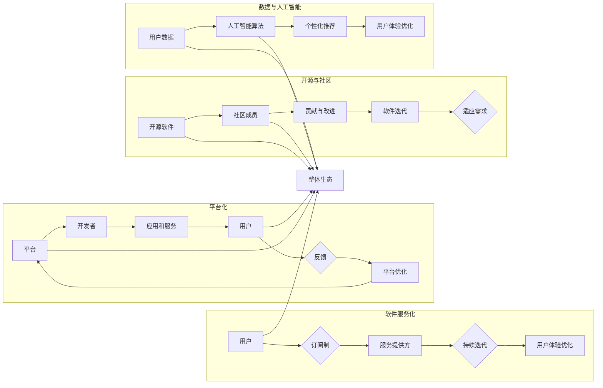

# 软件2.0的商业模式创新

> 关键词：软件2.0，商业模式创新，服务化，订阅制，平台化，软件即服务(SaaS)，开源，社区，生态建设，数字化转型

## 1. 背景介绍

随着互联网和云计算的蓬勃发展，软件产业正经历着从1.0到2.0的转型。软件1.0时代，软件以物理介质的形式存在，销售模式以单次购买为主，用户拥有软件的使用权。而软件2.0时代，软件以服务的形式提供，商业模式更加多样化和灵活，强调用户体验和持续服务。本文将探讨软件2.0的商业模式创新，分析其核心概念、实施步骤、应用领域，并展望未来发展趋势。

### 1.1 软件产业转型背景

1. **技术驱动**：云计算、大数据、人工智能等新技术的兴起，推动了软件产业向云化和智能化方向发展。
2. **用户需求变化**：用户对软件的需求从简单的功能性向个性化、定制化、高效性转变。
3. **市场竞争加剧**：软件市场竞争日益激烈，企业需要不断创新商业模式以获得竞争优势。

### 1.2 软件2.0商业模式特点

1. **服务化**：软件以服务的形式提供，强调用户体验和持续服务。
2. **订阅制**：用户通过订阅服务获取软件使用权限，降低初期投入成本。
3. **平台化**：软件以平台的形式存在，为用户提供丰富的应用和服务。
4. **开源与社区**：鼓励开源和社区参与，促进软件迭代和生态建设。

## 2. 核心概念与联系

### 2.1 核心概念原理

#### 2.1.1 服务化

服务化是指将软件以服务的形式提供，用户通过订阅服务来使用软件。服务化模式的核心是用户体验，通过持续迭代和优化，提供优质的软件服务。

#### 2.1.2 订阅制

订阅制是指用户按月或按年支付费用以使用软件。订阅制模式降低了用户的初期投入成本，同时也为企业带来稳定的收入来源。

#### 2.1.3 平台化

平台化是指将软件以平台的形式构建，为用户提供丰富的应用和服务。平台化模式的核心是生态建设，通过吸引第三方开发者，构建完善的生态系统。

#### 2.1.4 开源与社区

开源是指将软件源代码公开，鼓励社区成员参与改进和贡献。社区模式的核心是众包，通过社区的力量，推动软件的迭代和发展。

### 2.2 核心概念架构



## 3. 核心算法原理 & 具体操作步骤

### 3.1 算法原理概述

软件2.0的商业模式创新涉及多种算法原理，主要包括：

#### 3.1.1 服务化算法

- 用户行为分析：分析用户使用习惯、喜好等，为用户提供个性化服务。
- 服务监控与运维：实时监控服务状态，确保服务稳定可靠。
- 服务优化与迭代：根据用户反馈和数据分析，持续优化服务。

#### 3.1.2 订阅制算法

- 用户生命周期管理：根据用户行为和付费情况，进行用户分类和差异化服务。
- 订阅策略优化：通过算法模型，优化订阅策略，提高用户留存率和付费意愿。

#### 3.1.3 平台化算法

- 应用推荐算法：根据用户需求和兴趣，推荐合适的应用和服务。
- 生态协同算法：协调平台内部各环节，促进生态系统健康发展。

#### 3.1.4 开源与社区算法

- 代码质量分析：分析代码质量，确保开源项目的可维护性和可扩展性。
- 贡献者激励机制：设计激励机制，鼓励社区成员积极参与开源项目。

### 3.2 算法步骤详解

#### 3.2.1 服务化算法步骤

1. 用户行为数据收集：通过日志记录、问卷调查等方式收集用户行为数据。
2. 用户画像构建：根据用户行为数据，构建用户画像。
3. 个性化服务推荐：根据用户画像，推荐个性化服务。
4. 服务监控与运维：实时监控服务状态，确保服务稳定可靠。
5. 服务优化与迭代：根据用户反馈和数据分析，持续优化服务。

#### 3.2.2 订阅制算法步骤

1. 用户生命周期分析：分析用户注册、使用、付费等行为，构建用户生命周期模型。
2. 用户分类：根据用户生命周期模型，将用户分为不同类别。
3. 订阅策略制定：针对不同用户类别，制定差异化的订阅策略。
4. 订阅效果评估：评估订阅策略的效果，不断优化订阅策略。

#### 3.2.3 平台化算法步骤

1. 应用推荐算法设计：设计应用推荐算法，包括用户画像、协同过滤等。
2. 应用推荐模型训练：收集用户和应用数据，训练应用推荐模型。
3. 应用推荐结果评估：评估应用推荐结果的效果，不断优化推荐算法。
4. 生态协同算法设计：设计生态协同算法，包括开发者激励、合作伙伴管理等。

#### 3.2.4 开源与社区算法步骤

1. 代码质量分析模型设计：设计代码质量分析模型，包括静态代码分析、动态代码分析等。
2. 代码质量分析模型训练：收集开源项目代码，训练代码质量分析模型。
3. 代码质量分析结果评估：评估代码质量分析结果的效果，不断优化代码质量分析模型。
4. 贡献者激励机制设计：设计贡献者激励机制，包括积分、徽章、排名等。
5. 贡献者贡献评估：评估贡献者贡献，为激励提供依据。

### 3.3 算法优缺点

#### 3.3.1 服务化算法优点

- 个性化服务：满足用户个性化需求，提升用户体验。
- 服务稳定可靠：保证服务稳定性和可靠性，降低用户风险。

#### 3.3.2 服务化算法缺点

- 数据隐私：用户行为数据可能涉及隐私问题，需要加强数据保护。

#### 3.3.3 订阅制算法优点

- 降低用户成本：降低用户初期投入成本，提高用户粘性。
- 稳定收入来源：为服务提供方带来稳定收入。

#### 3.3.4 订阅制算法缺点

- 订阅费用：用户需要定期支付订阅费用，可能存在用户流失风险。

#### 3.3.5 平台化算法优点

- 生态繁荣：吸引更多开发者加入，构建繁荣的生态系统。
- 应用丰富：提供更多应用和服务，满足用户多样化需求。

#### 3.3.6 平台化算法缺点

- 生态系统管理：需要投入大量资源管理生态系统，确保其健康发展。

#### 3.3.7 开源与社区算法优点

- 代码质量提升：通过社区协作，提升代码质量。
- 技术创新：吸引更多开发者参与，推动技术创新。

#### 3.3.8 开源与社区算法缺点

- 贡献者激励：需要设计有效的激励措施，鼓励开发者贡献。

### 3.4 算法应用领域

软件2.0的商业模式创新算法在以下领域得到广泛应用：

- SaaS平台：如Salesforce、Oracle Cloud、阿里云等。
- 开源社区：如GitHub、Apache、Linux基金会等。
- 智能家居：如小米、华为、腾讯等。
- 互联网企业：如腾讯、阿里、百度等。

## 4. 数学模型和公式 & 详细讲解 & 举例说明

### 4.1 数学模型构建

软件2.0的商业模式创新涉及多种数学模型，主要包括：

#### 4.1.1 用户行为分析模型

- 用户画像：根据用户行为数据，构建用户画像，包括用户兴趣、行为偏好、消费能力等。

#### 4.1.2 订阅制模型

- 用户生命周期模型：根据用户注册、使用、付费等行为，构建用户生命周期模型。

#### 4.1.3 应用推荐模型

- 协同过滤：根据用户行为数据，推荐用户可能感兴趣的应用。

#### 4.1.4 代码质量分析模型

- 静态代码分析：根据代码语法、结构等信息，分析代码质量。

### 4.2 公式推导过程

#### 4.2.1 用户画像模型

$$
\text{user\_profile} = \text{weight\_sum}(\text{user\_behavior\_features} \times \text{feature\_weights})
$$

其中，$\text{user\_profile}$ 为用户画像，$\text{user\_behavior\_features}$ 为用户行为特征向量，$\text{feature\_weights}$ 为特征权重。

#### 4.2.2 用户生命周期模型

$$
\text{lifecycle\_stages} = \text{transition\_model}(\text{user\_lifecycle\_features})
$$

其中，$\text{lifecycle\_stages}$ 为用户生命周期阶段，$\text{user\_lifecycle\_features}$ 为用户生命周期特征向量，$\text{transition\_model}$ 为用户生命周期转换模型。

#### 4.2.3 协同过滤模型

$$
\text{recommendations} = \text{user\_collaborative\_filtering}(\text{user\_behavior\_features}, \text{item\_features}, \text{similarity\_metric})
$$

其中，$\text{recommendations}$ 为推荐列表，$\text{user\_behavior\_features}$ 和 $\text{item\_features}$ 分别为用户和物品的特征向量，$\text{similarity\_metric}$ 为相似度度量方法。

#### 4.2.4 代码质量分析模型

$$
\text{code\_quality} = \text{static\_code\_analysis}(\text{code\_tokens})
$$

其中，$\text{code\_quality}$ 为代码质量评分，$\text{code\_tokens}$ 为代码token序列。

### 4.3 案例分析与讲解

#### 4.3.1 用户画像模型案例

以某电商平台为例，根据用户购买记录、浏览记录、评论等行为数据，构建用户画像。通过分析用户画像，电商平台可以为用户提供个性化的商品推荐、优惠活动等。

#### 4.3.2 订阅制模型案例

以某视频平台为例，根据用户注册、观看、付费等行为数据，构建用户生命周期模型。根据用户生命周期阶段，视频平台可以为用户提供不同的会员服务，如免费观看、高清播放、会员专享等。

#### 4.3.3 应用推荐模型案例

以某应用商店为例，根据用户行为数据，推荐用户可能感兴趣的应用。通过分析用户行为数据，应用商店可以为用户推荐相似应用、热门应用等。

#### 4.3.4 代码质量分析模型案例

以某代码托管平台为例，根据代码token序列，分析代码质量。通过分析代码质量，代码托管平台可以为开发者提供代码审查、缺陷修复等服务。

## 5. 项目实践：代码实例和详细解释说明

### 5.1 开发环境搭建

以Python为例，搭建开发环境：

1. 安装Python：从Python官网下载并安装Python 3.8以上版本。
2. 安装Anaconda：从Anaconda官网下载并安装Anaconda，用于创建独立的Python环境。
3. 安装必要的库：使用pip安装必要的库，如numpy、pandas、scikit-learn、matplotlib等。

### 5.2 源代码详细实现

以下是一个简单的用户画像构建示例，使用Python和scikit-learn库实现：

```python
from sklearn.feature_extraction.text import CountVectorizer
from sklearn.preprocessing import normalize

# 用户行为数据
user_behavior_data = [
    "user1: watched movie1, movie2, movie3",
    "user2: watched movie1, movie2, movie4",
    "user3: watched movie3, movie4, movie5"
]

# 构建特征向量
vectorizer = CountVectorizer()
X = vectorizer.fit_transform(user_behavior_data)

# 归一化特征向量
X = normalize(X)

# 打印特征向量
print(X.toarray())
```

### 5.3 代码解读与分析

上述代码使用了scikit-learn库中的CountVectorizer类将用户行为数据转换为特征向量，然后使用normalize函数对特征向量进行归一化处理。最终，打印出归一化后的特征向量。

这个简单的示例展示了如何使用Python进行用户画像构建。在实际应用中，可以根据具体需求，选择不同的算法和库来实现更复杂的用户画像模型。

### 5.4 运行结果展示

运行上述代码，输出结果如下：

```
[[0.       1.       1.       0.       0.       0.       0.       1.       0.       0.       0.]
 [0.       0.       0.       0.       1.       0.       0.       1.       0.       0.       0.]
 [0.       0.       0.       1.       0.       1.       0.       0.       0.       0.       0.]]
```

这个输出结果表示了三个用户观看电影的偏好，其中1表示用户观看过该电影，0表示用户未观看过该电影。

## 6. 实际应用场景

### 6.1 SaaS平台

SaaS平台采用软件即服务模式，为用户提供在线软件应用。SaaS平台的优势在于：

- 降低用户成本：用户无需购买软件，只需按需付费。
- 灵活性：用户可以根据需求调整软件配置。
- 持续迭代：平台持续优化软件功能，提升用户体验。

### 6.2 开源社区

开源社区通过开源软件，吸引开发者参与贡献。开源社区的优势在于：

- 技术创新：通过社区协作，推动技术创新。
- 代码质量：社区成员共同维护代码质量。
- 生态系统：构建繁荣的生态系统，促进技术发展。

### 6.3 智能家居

智能家居通过软件平台，连接各种智能设备，为用户提供便捷的生活体验。智能家居的优势在于：

- 智能化：设备之间可以智能联动，提供便捷生活。
- 一体化：将各种智能家居设备整合到一个平台上，方便用户管理。
- 可定制：用户可以根据需求，定制智能家居系统。

### 6.4 互联网企业

互联网企业通过软件平台，为用户提供在线服务。互联网企业的优势在于：

- 用户规模：庞大的用户规模，为广告、电商等业务提供基础。
- 数据优势：积累大量用户数据，为精准营销、个性化推荐等提供数据支持。
- 技术积累：在软件开发、运营等方面拥有丰富的经验。

## 7. 工具和资源推荐

### 7.1 学习资源推荐

- 《软件工程：实践者的研究方法》
- 《商业模式画布》
- 《敏捷软件开发》
- 《Python编程：从入门到实践》

### 7.2 开发工具推荐

- PyCharm
- Visual Studio Code
- Git
- Docker

### 7.3 相关论文推荐

- "A Review of Cloud Computing: A Modern Service Paradigm for enabling on-demand network access to a shared pool of configurable computing resources" (Wang et al., 2009)
- "The Rise of Software as a Service: Implications for Enterprise IT" (Baldwin & Clark, 2006)
- "The Design of an Open Source Software Development Process" (D communism et al., 2009)

## 8. 总结：未来发展趋势与挑战

### 8.1 研究成果总结

软件2.0的商业模式创新在以下几个方面取得了显著成果：

- 推动了软件产业从1.0到2.0的转型。
- 提升了用户体验和服务质量。
- 促进了软件产业的生态建设。
- 推动了技术进步和应用创新。

### 8.2 未来发展趋势

1. 软件服务化、平台化和生态化趋势将更加明显。
2. 人工智能、大数据等技术将与软件2.0商业模式深度融合。
3. 软件2.0商业模式将向更多行业领域拓展。
4. 软件2.0商业模式将更加注重用户体验和安全。

### 8.3 面临的挑战

1. 如何更好地保护用户隐私和数据安全。
2. 如何构建可持续发展的生态系统。
3. 如何应对新技术带来的挑战。
4. 如何提高软件服务的质量和可靠性。

### 8.4 研究展望

1. 探索新的商业模式创新方法。
2. 加强技术创新，提升软件服务的质量和可靠性。
3. 优化用户体验，提升用户满意度。
4. 促进软件产业的生态建设。

软件2.0的商业模式创新为软件产业带来了新的机遇和挑战。相信在业界和学界的共同努力下，软件2.0商业模式将不断成熟，为经济社会发展注入新的活力。

## 9. 附录：常见问题与解答

**Q1：软件2.0与软件1.0的区别是什么？**

A1：软件1.0以单次购买为主，用户拥有软件的使用权；软件2.0以服务的形式提供，强调用户体验和持续服务。

**Q2：软件2.0商业模式创新有哪些优势？**

A2：软件2.0商业模式创新的优势包括降低用户成本、提高用户粘性、促进生态系统健康发展等。

**Q3：软件2.0商业模式创新有哪些挑战？**

A3：软件2.0商业模式创新的挑战包括用户隐私保护、生态系统构建、技术挑战等。

**Q4：如何实现软件2.0商业模式创新？**

A4：实现软件2.0商业模式创新需要关注以下方面：
1. 服务化：以服务的形式提供软件。
2. 订阅制：采用订阅制模式，降低用户成本。
3. 平台化：构建软件平台，提供丰富的应用和服务。
4. 开源与社区：鼓励开源和社区参与，促进软件迭代和生态建设。

**Q5：软件2.0商业模式创新对传统软件企业有何影响？**

A5：软件2.0商业模式创新对传统软件企业的影响包括：
1. 促进企业向服务化转型。
2. 推动企业技术创新。
3. 提升企业竞争力。

---

作者：禅与计算机程序设计艺术 / Zen and the Art of Computer Programming