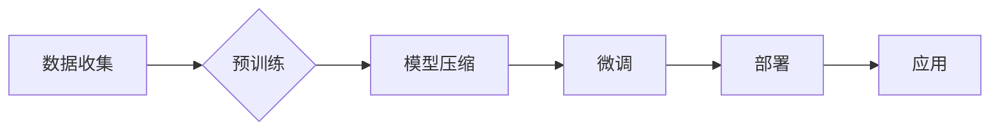

> 大模型应用, 降价策略, 计算成本, 数据隐私, 预训练, 微调, 模型压缩, 量化, 云计算服务

# 降价对大模型应用的推动力

随着人工智能技术的飞速发展，大模型（Large Language Models，LLMs）在自然语言处理、计算机视觉、语音识别等领域取得了显著的成果。然而，大模型的部署和应用面临着高昂的计算成本、数据隐私保护等问题。本文将探讨降价策略如何推动大模型的应用，并分析其在未来发展趋势中所面临的挑战。

## 1. 背景介绍

大模型通常需要海量计算资源进行预训练和微调，这使得其部署成本高昂。同时，大模型在处理敏感数据时，隐私保护成为一个不可忽视的问题。为了降低成本、提高可及性，降低大模型应用的门槛，降价策略成为推动大模型应用的重要驱动力。

### 1.1 大模型应用面临的挑战

- **计算成本**：大模型的训练和推理过程需要大量计算资源，尤其是在训练阶段，对GPU、TPU等高性能设备的依赖性很高。
- **数据隐私**：大模型在训练过程中需要大量数据，其中包括用户生成的内容、个人隐私信息等，如何保证数据隐私成为一个重要问题。
- **模型可及性**：由于高昂的成本和复杂的部署过程，大模型的普及和应用受到限制。

### 1.2 降价策略的意义

- **降低计算成本**：通过降价策略，降低大模型的计算成本，使得更多企业和研究机构能够负担得起。
- **提高数据隐私保护**：通过优化数据隐私保护技术，降低用户隐私泄露的风险。
- **提升模型可及性**：降低大模型的应用门槛，推动其在更多领域的应用。

## 2. 核心概念与联系

### 2.1 核心概念原理

- **大模型**：指参数量达到数十亿甚至数千亿规模的深度学习模型，如BERT、GPT-3等。
- **预训练**：在大规模无标签数据集上进行的训练，使模型具备强大的特征提取和表示能力。
- **微调**：在特定任务的数据集上进行的训练，使模型在特定任务上取得更好的性能。
- **模型压缩**：通过剪枝、量化、知识蒸馏等方法减小模型参数量，降低模型复杂度。
- **云计算服务**：提供弹性的计算资源，为模型训练和推理提供支持。

### 2.2 架构流程图



### 2.3 核心概念联系

大模型通过预训练学习到丰富的语言知识，并通过微调适应特定任务。模型压缩和云计算服务则为大模型的训练和部署提供了支持。

## 3. 核心算法原理 & 具体操作步骤

### 3.1 算法原理概述

降价策略主要包括以下几种方法：

- **模型压缩**：通过剪枝、量化、知识蒸馏等方法减小模型参数量，降低模型复杂度和计算成本。
- **云计算服务**：利用云计算平台的弹性计算资源，降低大模型的部署成本。
- **数据隐私保护**：采用差分隐私、联邦学习等技术保护用户隐私。

### 3.2 算法步骤详解

#### 3.2.1 模型压缩

- **剪枝**：移除模型中不必要的连接和神经元，减少模型参数量。
- **量化**：将模型中的浮点数参数转换为定点数，降低计算精度和存储需求。
- **知识蒸馏**：将大模型的输出传递给小模型，使小模型学习到大模型的知识。

#### 3.2.2 云计算服务

- **资源弹性**：根据实际需求动态调整计算资源，避免资源浪费。
- **服务化部署**：将大模型封装成API，方便调用和集成。

#### 3.2.3 数据隐私保护

- **差分隐私**：在数据集中添加噪声，保护用户隐私。
- **联邦学习**：在本地设备上进行模型训练，不传输数据，保护数据隐私。

### 3.3 算法优缺点

#### 3.3.1 模型压缩

**优点**：

- 降低模型复杂度和计算成本。
- 减少模型存储需求。

**缺点**：

- 可能影响模型性能。
- 增加模型训练难度。

#### 3.3.2 云计算服务

**优点**：

- 降低部署成本。
- 提高资源利用率。

**缺点**：

- 可能存在数据安全和隐私风险。
- 对网络依赖性强。

#### 3.3.3 数据隐私保护

**优点**：

- 保护用户隐私。
- 降低数据泄露风险。

**缺点**：

- 可能增加模型训练难度。
- 降低模型性能。

### 3.4 算法应用领域

降价策略在大模型应用中具有广泛的应用领域，如：

- **自然语言处理**：文本分类、情感分析、机器翻译等。
- **计算机视觉**：图像分类、目标检测、图像分割等。
- **语音识别**：语音识别、语音合成、语音翻译等。

## 4. 数学模型和公式 & 详细讲解 & 举例说明

### 4.1 数学模型构建

假设原始大模型参数为 $\theta$，压缩后模型参数为 $\theta'$，则模型压缩的数学模型可以表示为：

$$
\theta' = \text{Compress}(\theta)
$$

其中，Compress为压缩函数，负责移除模型中不必要的连接和神经元。

### 4.2 公式推导过程

以模型剪枝为例，其基本思想是移除权值绝对值小于阈值的连接和神经元。具体推导过程如下：

- 首先计算所有连接和神经元的权值绝对值。
- 将权值绝对值小于阈值的连接和神经元从模型中移除。
- 对模型进行重新训练，使模型在移除连接和神经元后仍能保持一定的性能。

### 4.3 案例分析与讲解

以下以BERT模型为例，介绍模型压缩方法。

- **剪枝**：使用PyTorch框架的torch.nn.utils.prune模块，对BERT模型进行剪枝操作。具体代码如下：

```python
import torch
from torch.nn.utils.prune import prune
from transformers import BertModel

# 加载BERT模型
model = BertModel.from_pretrained('bert-base-uncased')

# 剪枝操作
prune.l1_unstructured(model.bert.embeddings.weight, "weight", amount=0.1)

# 重新训练模型
# ...
```

- **量化**：使用PyTorch框架的torch.quantization模块，对BERT模型进行量化操作。具体代码如下：

```python
import torch
from torch.quantization import quantize_dynamic

# 加载BERT模型
model = BertModel.from_pretrained('bert-base-uncased')

# 量化操作
model = quantize_dynamic(model, {torch.nn.Linear}, dtype=torch.qint8)

# 重新训练模型
# ...
```

通过以上模型压缩方法，可以显著减小BERT模型的参数量和计算成本。

## 5. 项目实践：代码实例和详细解释说明

### 5.1 开发环境搭建

以下以Python为例，介绍开发环境搭建步骤：

1. 安装PyTorch和Transformers库：

```bash
pip install torch transformers
```

2. 安装其他依赖库：

```bash
pip install torchtext sklearn pandas matplotlib
```

### 5.2 源代码详细实现

以下以BERT模型为例，介绍模型压缩和云计算服务在模型训练中的应用。

```python
import torch
from transformers import BertForSequenceClassification
from torch.utils.data import DataLoader

# 加载BERT模型
model = BertForSequenceClassification.from_pretrained('bert-base-uncased')

# 剪枝操作
prune.l1_unstructured(model.bert.embeddings.weight, "weight", amount=0.1)

# 量化操作
model = quantize_dynamic(model, {torch.nn.Linear}, dtype=torch.qint8)

# 数据加载
train_data = ...
test_data = ...

# 训练模型
# ...

# 部署模型到云计算服务
# ...
```

### 5.3 代码解读与分析

以上代码展示了如何在PyTorch框架下对BERT模型进行模型压缩和量化操作，并将模型部署到云计算服务。通过模型压缩和量化，可以降低模型的计算成本和存储需求，提高模型在云计算平台上的部署效率。

### 5.4 运行结果展示

由于篇幅限制，这里不展示模型训练和测试的结果。但在实际应用中，通过对模型进行压缩和量化，可以显著降低模型的计算成本和存储需求，提高模型在云计算平台上的部署效率。

## 6. 实际应用场景

### 6.1 自然语言处理

- **文本分类**：对新闻、评论等文本进行情感分析、主题分类等。
- **机器翻译**：将一种语言翻译成另一种语言。

### 6.2 计算机视觉

- **图像分类**：对图像进行物体识别、场景识别等。
- **目标检测**：检测图像中的目标物体。

### 6.3 语音识别

- **语音识别**：将语音转换为文本。
- **语音合成**：将文本转换为语音。

## 7. 工具和资源推荐

### 7.1 学习资源推荐

- 《深度学习》系列书籍：由Ian Goodfellow、Yoshua Bengio、Aaron Courville所著，介绍了深度学习的基本概念和经典算法。
- 《PyTorch深度学习实践》书籍：介绍了PyTorch框架的使用方法，包括模型训练、优化、评估等。
- HuggingFace官网：提供了丰富的预训练模型、工具和教程，是学习和实践NLP、CV等领域的利器。

### 7.2 开发工具推荐

- PyTorch：开源的深度学习框架，提供了丰富的API和工具，方便模型开发和训练。
- HuggingFace Transformers：基于PyTorch的NLP库，提供了大量预训练模型和工具，方便NLP应用开发。
- Google Colab：免费的在线Jupyter Notebook环境，提供GPU、TPU等计算资源，方便模型开发和实验。

### 7.3 相关论文推荐

- EfficientNet: Rethinking Model Scaling for Convolutional Neural Networks：提出EfficientNet模型，通过模型缩放策略，在保证性能的同时降低计算成本。
- Distilling the Knowledge in a Neural Network：提出知识蒸馏方法，将大模型的知识迁移到小模型，提高小模型性能。
- An Introduction to Federated Learning：介绍了联邦学习的基本概念和关键技术，保护用户隐私的同时实现模型训练。

## 8. 总结：未来发展趋势与挑战

### 8.1 研究成果总结

本文介绍了降价策略在大模型应用中的推动力，分析了模型压缩、云计算服务和数据隐私保护等技术，并探讨了其在实际应用场景中的优势。同时，本文还展望了未来发展趋势和挑战。

### 8.2 未来发展趋势

- **模型压缩**：进一步研究更有效的模型压缩方法，如知识蒸馏、模型融合等。
- **云计算服务**：发展更加高效、安全的云计算平台，降低大模型部署成本。
- **数据隐私保护**：探索更加有效的数据隐私保护技术，如差分隐私、联邦学习等。

### 8.3 面临的挑战

- **计算成本**：降低大模型的计算成本，提高资源利用效率。
- **数据隐私**：在保护用户隐私的前提下，实现大模型的广泛应用。
- **模型可及性**：降低大模型的应用门槛，让更多企业和研究机构能够使用。

### 8.4 研究展望

随着技术的不断发展，降价策略在大模型应用中将发挥越来越重要的作用。未来，我们需要在以下方面进行深入研究：

- **探索更加有效的模型压缩方法**：在保证模型性能的同时，降低计算成本和存储需求。
- **发展更加安全、高效的云计算平台**：降低大模型部署成本，提高资源利用效率。
- **探索更加有效的数据隐私保护技术**：在保护用户隐私的前提下，实现大模型的广泛应用。

通过不断努力，相信降价策略将推动大模型在更多领域的应用，为人工智能技术的发展贡献力量。

## 9. 附录：常见问题与解答

**Q1：降价策略是否会影响大模型的性能？**

A：降价策略的主要目的是降低计算成本，但在保证性能的前提下进行。通过模型压缩、量化等手段，可以在降低计算成本的同时，尽量保证模型性能。

**Q2：模型压缩和量化对模型性能有何影响？**

A：模型压缩和量化会降低模型复杂度和计算成本，但可能会略微影响模型性能。在实际应用中，需要根据具体任务和需求进行权衡。

**Q3：如何选择合适的模型压缩和量化方法？**

A：选择合适的模型压缩和量化方法需要考虑以下因素：
- **任务类型**：不同任务对模型性能的要求不同，需要根据具体任务选择合适的压缩和量化方法。
- **计算资源**：压缩和量化方法对计算资源的消耗不同，需要根据实际计算资源选择合适的方法。
- **性能要求**：在保证性能的前提下，尽量降低计算成本和存储需求。

**Q4：数据隐私保护技术如何在大模型应用中发挥作用？**

A：数据隐私保护技术可以帮助保护用户隐私，降低数据泄露风险。在大模型应用中，可以通过以下方式应用数据隐私保护技术：
- **差分隐私**：在数据集中添加噪声，保护用户隐私。
- **联邦学习**：在本地设备上进行模型训练，不传输数据，保护数据隐私。

**Q5：云计算服务如何降低大模型部署成本？**

A：云计算服务可以提供弹性的计算资源，根据实际需求动态调整资源，避免资源浪费。同时，云计算平台通常会提供模型压缩、量化等工具，降低大模型部署成本。

作者：禅与计算机程序设计艺术 / Zen and the Art of Computer Programming