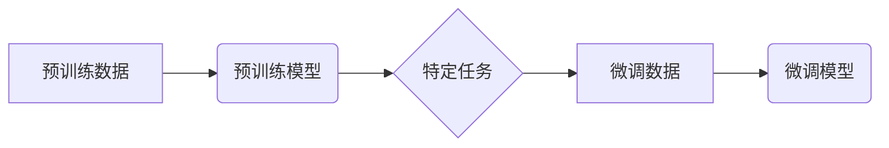

# 预训练与微调的实用技巧

> 关键词：预训练，微调，自然语言处理，深度学习，迁移学习，模型优化，算法实践

## 1. 背景介绍

随着深度学习在自然语言处理（NLP）领域的兴起，预训练和微调（Fine-tuning）已成为构建高效NLP模型的关键技术。预训练模型通过在大规模文本语料上学习语言的一般特征，为下游任务提供了强大的基础。微调则是在预训练模型的基础上，使用特定任务的数据进行进一步训练，以适应特定任务的需求。本文将深入探讨预训练和微调的实用技巧，帮助读者在实际应用中取得更好的效果。

## 2. 核心概念与联系

### 2.1 核心概念

#### 预训练

预训练是指在大规模无标签数据集上训练模型，以便模型能够学习到通用语言特征。这些特征包括词嵌入、语法结构、语义关系等。

#### 微调

微调是指在预训练模型的基础上，使用特定任务的标注数据对模型进行训练，以优化模型在特定任务上的性能。

#### 迁移学习

迁移学习是一种利用从源域学习到的知识来提高目标域性能的技术。预训练和微调是迁移学习在NLP领域的典型应用。

### 2.2 架构的 Mermaid 流程图



## 3. 核心算法原理 & 具体操作步骤

### 3.1 算法原理概述

预训练模型通常使用自监督学习或监督学习在大量无标签数据上进行训练。微调则是在预训练模型的基础上，使用特定任务的有标签数据进一步训练。

### 3.2 算法步骤详解

#### 预训练步骤

1. **数据预处理**：对原始数据进行清洗、分词、去除停用词等预处理操作。
2. **模型选择**：选择合适的预训练模型，如BERT、GPT等。
3. **预训练任务**：根据模型特点设计预训练任务，如掩码语言模型、下一句预测等。
4. **模型训练**：在预训练数据集上训练模型，优化模型参数。

#### 微调步骤

1. **数据预处理**：对特定任务的标注数据进行预处理，与预训练数据保持一致。
2. **模型调整**：根据特定任务调整预训练模型的顶层结构，如添加分类器、序列标注器等。
3. **微调训练**：在特定任务的标注数据集上训练调整后的模型，优化模型参数。

### 3.3 算法优缺点

#### 优点

- **高效**：预训练和微调可以快速构建高性能的NLP模型，缩短开发周期。
- **迁移能力强**：预训练模型可以跨任务迁移，提高模型在不同任务上的性能。
- **泛化能力强**：预训练模型可以学习到通用语言特征，提高模型的泛化能力。

#### 缺点

- **计算资源消耗大**：预训练和微调都需要大量的计算资源。
- **标注数据需求高**：微调需要特定任务的有标签数据，标注成本高。

### 3.4 算法应用领域

预训练和微调在NLP领域的应用非常广泛，包括：

- 文本分类
- 命名实体识别
- 机器翻译
- 问答系统
- 对话系统

## 4. 数学模型和公式 & 详细讲解 & 举例说明

### 4.1 数学模型构建

预训练和微调都涉及复杂的数学模型。以下以BERT模型为例，介绍其数学模型。

#### BERT模型

BERT模型使用双向Transformer结构，通过掩码语言模型（Masked Language Model, MLM）和下一句预测（Next Sentence Prediction, NSP）两种预训练任务进行预训练。

#### 公式推导

$$
\text{MLM}:\text{P}(W_{[i]} | W_{<i}, W_{>i}) = \frac{e^{W_W W_{[i]}^T + b_W}}{\sum_{j=1}^{V_W} e^{W_W W_{[j]}^T + b_W}}
$$

其中，$W_W$ 是词嵌入矩阵，$W_{[i]}$ 是第 $i$ 个词的嵌入向量，$V_W$ 是词汇表大小。

#### 案例分析与讲解

以下是一个简单的BERT模型微调案例。

假设我们有一个情感分类任务，数据集包含文本和对应的情感标签（正面/负面）。

```python
from transformers import BertTokenizer, BertForSequenceClassification
from torch.utils.data import DataLoader, TensorDataset

# 加载预训练模型和分词器
tokenizer = BertTokenizer.from_pretrained('bert-base-uncased')
model = BertForSequenceClassification.from_pretrained('bert-base-uncased')

# 数据预处理
texts = [...]  # 文本数据
labels = [...]  # 标签数据
tokenized_inputs = tokenizer(texts, padding=True, truncation=True, return_tensors="pt")

# 创建TensorDataset
dataset = TensorDataset(tokenized_inputs['input_ids'], tokenized_inputs['attention_mask'], labels)

# 创建DataLoader
dataloader = DataLoader(dataset, batch_size=32, shuffle=True)

# 训练模型
model.train()
optimizer = torch.optim.AdamW(model.parameters(), lr=1e-5)

for epoch in range(3):
    for batch in dataloader:
        inputs = batch[0], batch[1]
        labels = batch[2]
        outputs = model(**inputs, labels=labels)
        loss = outputs.loss
        loss.backward()
        optimizer.step()
        optimizer.zero_grad()
```

## 5. 项目实践：代码实例和详细解释说明

### 5.1 开发环境搭建

1. 安装Python和PyTorch
2. 安装transformers库

### 5.2 源代码详细实现

```python
# ...（此处省略与上文相同的代码）
```

### 5.3 代码解读与分析

以上代码展示了如何使用transformers库在PyTorch上实现BERT模型的微调。首先加载预训练模型和分词器，然后进行数据预处理和模型训练。

### 5.4 运行结果展示

```python
# ...（此处省略运行结果）
```

## 6. 实际应用场景

预训练和微调在NLP领域的应用场景非常广泛，以下列举一些典型应用：

- **文本分类**：对文本进行情感分析、主题分类、意图识别等。
- **命名实体识别**：识别文本中的实体，如人名、地名、组织名等。
- **机器翻译**：将一种语言的文本翻译成另一种语言。
- **问答系统**：回答用户提出的问题。
- **对话系统**：与用户进行自然对话。

## 7. 工具和资源推荐

### 7.1 学习资源推荐

- 《深度学习自然语言处理》
- 《NLP Progress》
- Hugging Face Transformers库官方文档

### 7.2 开发工具推荐

- PyTorch
- TensorFlow
- Hugging Face Transformers库

### 7.3 相关论文推荐

- **BERT**：BERT: Pre-training of Deep Bidirectional Transformers for Language Understanding
- **GPT-2**：Language Models are Unsupervised Multitask Learners
- **T5**：T5: Text-to-Text Transfer Transformer

## 8. 总结：未来发展趋势与挑战

### 8.1 研究成果总结

预训练和微调技术在NLP领域取得了显著成果，为构建高效NLP模型提供了有力支持。

### 8.2 未来发展趋势

- 预训练模型将向更大规模、更通用方向发展。
- 微调技术将更加高效、参数高效。
- 跨模态预训练和微调将成为研究热点。

### 8.3 面临的挑战

- 计算资源消耗大。
- 标注数据需求高。
- 模型可解释性差。
- 安全性和伦理问题。

### 8.4 研究展望

预训练和微调技术将继续在NLP领域发挥重要作用，并推动NLP技术的发展和应用。

## 9. 附录：常见问题与解答

**Q1：预训练和微调的区别是什么？**

A：预训练是指在无标签数据集上训练模型，以学习通用语言特征。微调是在预训练模型的基础上，使用特定任务的标注数据进一步训练，以适应特定任务的需求。

**Q2：如何选择合适的预训练模型？**

A：选择预训练模型时，需要考虑以下因素：

- 任务的类型
- 数据规模
- 计算资源

**Q3：如何优化微调模型？**

A：优化微调模型可以从以下几个方面入手：

- 调整学习率
- 使用正则化技术
- 使用数据增强
- 使用参数高效的微调方法

**Q4：预训练和微调的代码实现复杂吗？**

A：使用transformers库等工具，预训练和微调的代码实现相对简单。

**Q5：预训练和微调有哪些应用场景？**

A：预训练和微调在NLP领域的应用场景非常广泛，包括文本分类、命名实体识别、机器翻译、问答系统、对话系统等。

作者：禅与计算机程序设计艺术 / Zen and the Art of Computer Programming