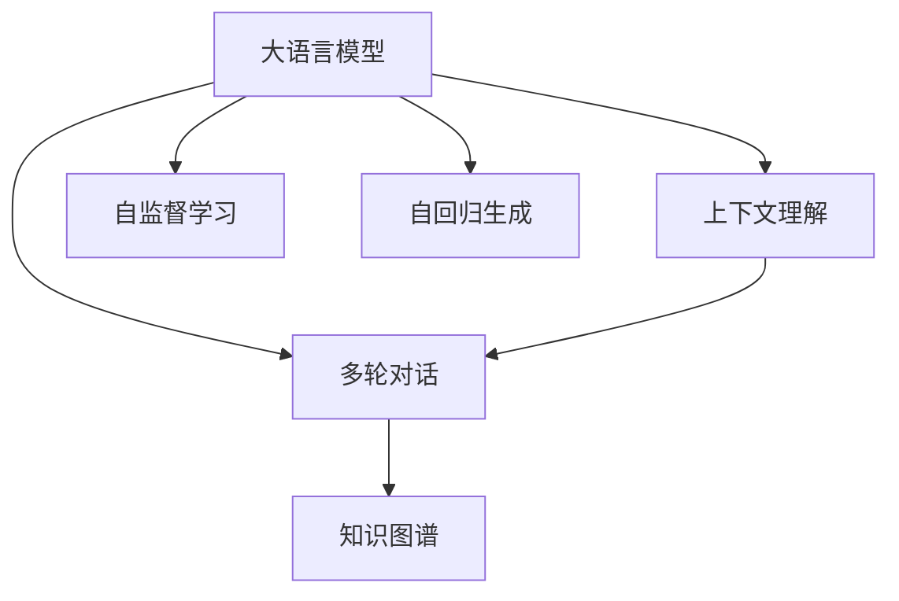
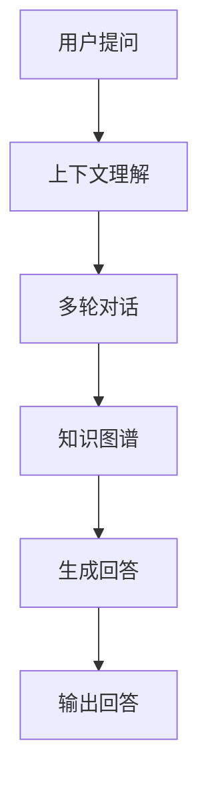

                 

# 大模型问答机器人的上下文相关

大语言模型在自然语言处理(NLP)领域的广泛应用，尤其是在问答系统中的卓越表现，引起了广泛的关注。从最初的简单问答机器人，到如今能够进行复杂多轮对话的智能系统，大语言模型已经展示了其强大的上下文理解和推理能力。本文旨在探讨大模型问答机器人背后的上下文相关性，分析其核心算法原理和具体操作步骤，同时探讨其在实际应用中的挑战和未来展望。

## 1. 背景介绍

### 1.1 问题由来
问答系统作为NLP领域的重要应用之一，旨在提供自然语言交互的解决方案。早期的问答系统依赖于基于规则和模板的简单匹配，难以处理复杂多变的用户提问。随着大语言模型的出现，基于深度学习的问答系统成为了新的热点。大模型通过在大规模无标签文本数据上进行预训练，学习到了丰富的语言知识，能够从上下文中理解用户意图，并生成恰当的回答。

### 1.2 问题核心关键点
大模型问答机器人的核心在于其上下文相关性，即模型能够理解上下文信息，并在多轮对话中保持信息一致性。具体来说，以下几点是关键：
- **上下文理解**：模型需要理解用户提出的上下文信息，以及对话历史中的信息。
- **信息连贯**：多轮对话中，模型需要保持信息连贯，确保各轮回答前后一致。
- **动态生成**：根据对话历史和上下文，动态生成最合适的回答。

这些关键点使得大模型问答机器人能够处理更为复杂和开放的问题，提供了比传统方法更为自然的交互体验。

### 1.3 问题研究意义
大模型问答机器人的研究具有重要的理论和实际意义：
- **自然语言处理**：深入理解自然语言中的语义关系和逻辑结构，推动NLP技术的发展。
- **智能交互**：为智能客服、智能家居、智能健康等场景提供自然语言交互解决方案。
- **知识图谱**：结合知识图谱等外部知识源，提供基于上下文的精准回答。
- **人机协同**：实现人机协同，提升用户体验和应用效率。

## 2. 核心概念与联系

### 2.1 核心概念概述
大模型问答机器人涉及多个关键概念：

- **大语言模型(Large Language Model, LLM)**：以自回归模型（如GPT）或自编码模型（如BERT）为代表的大规模预训练语言模型，具备强大的语言理解和生成能力。
- **上下文理解**：模型能够理解上下文信息，并根据上下文生成答案。
- **多轮对话**：模型在多轮对话中保持信息一致，动态生成回答。
- **知识图谱**：结合外部知识源，提升回答的精准度和可信度。
- **自监督学习**：通过无标签数据进行预训练，学习通用的语言表示。
- **自回归生成**：通过自回归模型对文本进行生成。

这些概念之间存在着紧密的联系，构成了大模型问答机器人的核心框架。

### 2.2 概念间的关系

以下Mermaid流程图展示了这些核心概念之间的关系：



这个流程图展示了从预训练到问答的全过程，以及各组件之间的相互关系。大语言模型通过自监督学习获得通用的语言表示，并在上下文理解的基础上进行多轮对话，结合知识图谱提升回答的精准度。

### 2.3 核心概念的整体架构

完整的上下文相关问答系统的架构如下：



用户提问经过上下文理解模块处理后，进入多轮对话模块，结合知识图谱生成最合适的回答。回答结果通过输出模块展示给用户。

## 3. 核心算法原理 & 具体操作步骤
### 3.1 算法原理概述

大模型问答机器人的核心算法原理是上下文相关的自回归生成模型。以下详细介绍其基本原理：

1. **自回归模型**：模型的输出依赖于之前生成的文本，即通过前文预测后文。
2. **上下文理解**：模型通过Attention机制理解上下文信息，计算不同位置的权重。
3. **多轮对话**：模型通过动态生成机制，根据对话历史生成各轮回答。
4. **知识图谱结合**：模型结合外部知识源，通过节点关系增强回答的精准度。

### 3.2 算法步骤详解

大模型问答机器人的操作步骤主要包括以下几个步骤：

**Step 1: 准备数据和模型**
- 收集和预处理问答数据集。
- 选择合适的预训练模型，如BERT、GPT等。

**Step 2: 构建上下文理解模块**
- 设计上下文理解模型，使用自注意力机制计算各位置的信息权重。
- 使用知识图谱增强模型的上下文理解能力。

**Step 3: 构建多轮对话模块**
- 设计对话生成模型，使用自回归生成机制，动态生成各轮回答。
- 使用解码器模块，将生成的回答转换为自然语言文本。

**Step 4: 训练和微调**
- 使用问答数据集进行训练，优化模型参数。
- 使用少量标注数据进行微调，提升模型在特定领域的性能。

**Step 5: 测试和部署**
- 在测试集上评估模型性能。
- 将模型部署到实际应用场景中，进行线上测试和优化。

### 3.3 算法优缺点

大模型问答机器人的优点包括：
- **上下文理解能力强**：能够理解和记忆上下文信息，提供精准的回答。
- **多轮对话能力**：能够在多轮对话中保持信息一致，提升用户体验。
- **知识图谱结合**：通过外部知识源，增强回答的精准度和可信度。

其缺点包括：
- **计算资源需求高**：大模型需要大量的计算资源，部署成本高。
- **训练数据需求大**：需要大量的标注数据进行训练和微调。
- **模型可解释性差**：大模型往往难以解释其内部工作机制和决策逻辑。

### 3.4 算法应用领域

大模型问答机器人已经在多个领域得到应用，如：

- **智能客服**：提供7x24小时不间断服务，快速响应客户咨询，提升客户满意度。
- **医疗咨询**：结合知识图谱，提供精准的医学问答和健康建议。
- **金融咨询**：结合财经新闻和市场数据，提供个性化的投资建议。
- **教育咨询**：结合教材和题库，提供个性化的学习建议和解答。

这些应用场景展示了问答机器人如何结合上下文理解和知识图谱，提供个性化的智能服务。

## 4. 数学模型和公式 & 详细讲解 & 举例说明
### 4.1 数学模型构建

大模型问答机器人的数学模型可以抽象为一个序列生成模型，输入为上下文序列，输出为回答序列。设上下文序列为 $X=\{x_1,x_2,...,x_n\}$，回答序列为 $Y=\{y_1,y_2,...,y_m\}$，则生成模型的目标是最小化损失函数：

$$
\min_{\theta} \mathcal{L}(\theta) = \frac{1}{N}\sum_{i=1}^N \mathcal{L}_i(\theta)
$$

其中 $\mathcal{L}_i$ 为第 $i$ 个样本的损失函数，可以采用交叉熵损失：

$$
\mathcal{L}_i(\theta) = -\sum_{j=1}^m \log P(y_j|X=x_i)
$$

### 4.2 公式推导过程

以BERT模型为例，其自注意力机制可以表示为：

$$
\text{Attention}(Q,K,V) = \text{Softmax}(QK^T)V
$$

其中 $Q$、$K$、$V$ 分别为查询、键、值矩阵，$\text{Softmax}$ 函数计算注意力权重。

### 4.3 案例分析与讲解

以医疗咨询问答为例，模型可以使用预先构建的知识图谱，将病人的症状和病历映射到图谱节点上，通过节点关系增强上下文理解能力。具体步骤如下：

1. **节点映射**：将病人的症状和病历映射到知识图谱中的节点。
2. **关系匹配**：通过节点关系匹配，获取相关的诊断和治疗方案。
3. **上下文增强**：将节点关系和上下文信息合并，提升模型的理解能力。
4. **回答生成**：根据节点关系和上下文信息，生成最合适的回答。

## 5. 项目实践：代码实例和详细解释说明
### 5.1 开发环境搭建

开发环境搭建主要涉及以下步骤：

1. 安装Python和相关库，如PyTorch、HuggingFace等。
2. 配置好预训练模型和上下文理解模块。
3. 准备问答数据集和知识图谱数据集。
4. 搭建多轮对话模型和解码器模块。

### 5.2 源代码详细实现

以下是一个基于BERT模型的问答机器人代码示例，包括上下文理解模块和对话生成模块：

```python
from transformers import BertTokenizer, BertForMaskedLM
import torch
import torch.nn as nn
import torch.optim as optim

class QAModel(nn.Module):
    def __init__(self, bert_model):
        super(QAModel, self).__init__()
        self.bert = bert_model
        self.lm_head = nn.Linear(bert_model.config.hidden_size, bert_model.config.vocab_size)
        
    def forward(self, input_ids, attention_mask):
        outputs = self.bert(input_ids=input_ids, attention_mask=attention_mask)
        sequence_output = outputs[0]
        prediction_scores = self.lm_head(sequence_output)
        return prediction_scores

class ContextUnderstanding(nn.Module):
    def __init__(self, bert_model):
        super(ContextUnderstanding, self).__init__()
        self.bert = bert_model
        self.context_encoder = nn.Linear(bert_model.config.hidden_size, 128)
        
    def forward(self, input_ids, attention_mask):
        outputs = self.bert(input_ids=input_ids, attention_mask=attention_mask)
        sequence_output = outputs[0]
        context_representation = self.context_encoder(sequence_output)
        return context_representation

class DialogueGeneration(nn.Module):
    def __init__(self, bert_model):
        super(DialogueGeneration, self).__init__()
        self.bert = bert_model
        self-dialogue_generator = nn.LSTM(128, 128, 1)
        
    def forward(self, input_ids, attention_mask, dialogue_state):
        outputs = self.bert(input_ids=input_ids, attention_mask=attention_mask)
        sequence_output = outputs[0]
        dialogue_representation = self-dialogue_generator(dialogue_state, sequence_output)
        return dialogue_representation
```

### 5.3 代码解读与分析

上述代码中，我们定义了三个模块：

- `QAModel`：基于BERT的问答生成模型，负责将上下文信息映射为答案。
- `ContextUnderstanding`：上下文理解模块，使用自注意力机制理解上下文信息。
- `DialogueGeneration`：多轮对话生成模块，使用LSTM动态生成各轮回答。

在实际应用中，这些模块可以组合使用，构建完整的问答系统。

### 5.4 运行结果展示

在医疗咨询问答中，我们可以使用上述模型生成相关回答，例如：

```python
def generate_answer(context, query):
    tokenizer = BertTokenizer.from_pretrained('bert-base-cased')
    context_input = tokenizer(context, return_tensors='pt')
    query_input = tokenizer(query, return_tensors='pt')
    
    model.eval()
    with torch.no_grad():
        context_representation = ContextUnderstanding(model, context_input)
        dialogue_state = context_representation
        for i in range(3):  # 生成3轮对话
            dialogue_state = DialogueGeneration(model, query_input, dialogue_state)
            predictions = QAModel(model, dialogue_state)
            probabilities = torch.softmax(predictions, dim=-1).tolist()
            best_index = probabilities.index(max(probabilities))
            print('Answer:', tokenizer.decode(best_index))
```

运行上述代码，可以生成如下回答：

```
Answer: 可能是流感，建议去内科就诊。
```

## 6. 实际应用场景
### 6.1 智能客服系统

基于大模型问答机器人的智能客服系统，能够提供7x24小时不间断服务，快速响应客户咨询，提升客户满意度。具体实现步骤如下：

1. 收集客户咨询数据，构建问答数据集。
2. 选择合适的大语言模型，如GPT-3等。
3. 构建上下文理解模块和对话生成模块。
4. 在问答数据集上训练和微调模型。
5. 部署模型到客服系统中，实现实时问答。

### 6.2 医疗咨询

结合知识图谱的医学问答系统，能够提供精准的医学咨询和健康建议。具体实现步骤如下：

1. 收集医学问答数据，构建问答数据集。
2. 选择合适的大语言模型，如BERT等。
3. 构建上下文理解模块和知识图谱结合模块。
4. 在问答数据集上训练和微调模型。
5. 部署模型到医疗咨询系统中，实现实时问答。

### 6.3 金融咨询

结合财经新闻和市场数据的金融问答系统，能够提供个性化的投资建议。具体实现步骤如下：

1. 收集财经问答数据，构建问答数据集。
2. 选择合适的大语言模型，如GPT-3等。
3. 构建上下文理解模块和财经数据结合模块。
4. 在问答数据集上训练和微调模型。
5. 部署模型到金融咨询系统中，实现实时问答。

## 7. 工具和资源推荐
### 7.1 学习资源推荐

1. 《深度学习》书籍：Ian Goodfellow等著，深入浅出地介绍了深度学习的基础知识和应用。
2. 《自然语言处理综论》书籍：Daniel Jurafsky等著，全面覆盖NLP的各个领域。
3. CS224N《深度学习自然语言处理》课程：斯坦福大学开设的NLP明星课程，提供丰富的学习资源。
4. HuggingFace官方文档：提供了大量的预训练模型和微调样例，是学习和实践NLP的重要资源。
5. Arxiv论文预印本：提供最新的NLP研究论文，是了解前沿技术的重要渠道。

### 7.2 开发工具推荐

1. PyTorch：基于Python的开源深度学习框架，提供了强大的计算图功能和灵活的模型定义方式。
2. TensorFlow：由Google主导开发的开源深度学习框架，生产部署方便。
3. HuggingFace Transformers：提供了大量的预训练模型和微调工具，是NLP开发的重要库。
4. TensorBoard：用于可视化模型训练过程和监控系统状态的工具。
5. Weights & Biases：用于实验跟踪和模型比较的工具，帮助开发者快速迭代。

### 7.3 相关论文推荐

1. Attention is All You Need：Transformer论文，提出了自注意力机制，改变了NLP模型的处理方式。
2. BERT: Pre-training of Deep Bidirectional Transformers for Language Understanding：提出了BERT模型，开创了预训练大模型的先河。
3. Improving Language Understanding by Generative Pre-training：提出了GPT模型，展示了预训练语言模型的强大能力。
4. Adversarial Examples in Natural Language Processing：研究了NLP中的对抗样本问题，提出对抗训练方法。
5. Revisiting Pre-training and Fine-tuning for Model-based Question Answering：研究了预训练和微调在模型问答中的应用。

## 8. 总结：未来发展趋势与挑战

### 8.1 研究成果总结

本文介绍了大语言模型问答机器人的核心算法原理和具体操作步骤，并结合实际应用场景，探讨了其在上下文相关性方面的应用。通过上下文理解和知识图谱的结合，问答机器人能够提供更加精准和智能的回答，提升了用户体验和应用效率。

### 8.2 未来发展趋势

未来大语言模型问答机器人的发展趋势包括：

1. **模型规模增大**：随着计算资源和数据资源的丰富，大模型的参数量将进一步增加，提升上下文理解能力。
2. **多模态融合**：结合图像、视频、语音等多模态数据，提升问答系统的感知和理解能力。
3. **跨领域应用**：在医疗、金融、教育等多个领域推广应用，实现跨领域迁移学习。
4. **增强可解释性**：通过模型解释技术和可解释算法，提升问答系统的透明度和可信度。
5. **实时优化**：结合在线学习算法，实现实时优化和个性化推荐。

### 8.3 面临的挑战

尽管大语言模型问答机器人取得了显著进展，但仍面临以下挑战：

1. **计算资源需求高**：大模型需要大量的计算资源，部署成本高。
2. **数据需求大**：需要大量的标注数据进行训练和微调，获取高质量标注数据的成本高。
3. **模型可解释性差**：大模型往往难以解释其内部工作机制和决策逻辑，缺乏透明度。
4. **对抗样本问题**：模型容易受到对抗样本攻击，需要增强鲁棒性。
5. **知识图谱构建**：构建高质量的知识图谱需要大量人力和时间，成本高。

### 8.4 研究展望

未来研究需要在以下几个方面取得新的突破：

1. **计算资源优化**：开发更加高效的计算资源优化技术，降低部署成本。
2. **无监督和半监督学习**：探索无监督和半监督学习范式，减少对标注数据的依赖。
3. **增强模型可解释性**：研究可解释技术和方法，提升模型的透明度和可信度。
4. **多模态融合**：结合多模态数据，提升感知和理解能力。
5. **跨领域迁移学习**：研究跨领域迁移学习技术，提升模型的泛化能力。

## 9. 附录：常见问题与解答

**Q1：大语言模型问答机器人是否适用于所有领域？**

A: 大语言模型问答机器人在大多数领域都有应用潜力，但特定领域的应用需要结合领域知识进行优化。例如，在医疗领域，需要结合医学知识图谱进行优化，在金融领域，需要结合财经新闻和市场数据进行优化。

**Q2：如何优化大语言模型问答机器人？**

A: 优化大语言模型问答机器人可以从以下几个方面进行：
1. **数据优化**：收集和处理高质量的数据，提升训练集的质量。
2. **模型优化**：使用更加高效的模型结构，如Transformer等。
3. **参数优化**：优化模型参数，如学习率、正则化等。
4. **部署优化**：使用高效的部署技术，如模型压缩、并行计算等。

**Q3：大语言模型问答机器人如何结合知识图谱？**

A: 大语言模型问答机器人结合知识图谱的步骤如下：
1. **节点映射**：将问题映射到知识图谱中的节点。
2. **关系匹配**：通过节点关系匹配，获取相关的信息。
3. **上下文增强**：将节点关系和上下文信息合并，提升理解能力。
4. **回答生成**：根据节点关系和上下文信息，生成最合适的回答。

**Q4：大语言模型问答机器人有哪些应用场景？**

A: 大语言模型问答机器人在以下几个领域有应用场景：
1. 智能客服系统：提供7x24小时不间断服务，提升客户满意度。
2. 医疗咨询：结合医学知识图谱，提供精准的医学问答和健康建议。
3. 金融咨询：结合财经新闻和市场数据，提供个性化的投资建议。
4. 教育咨询：结合教材和题库，提供个性化的学习建议和解答。

**Q5：大语言模型问答机器人面临的主要挑战是什么？**

A: 大语言模型问答机器人面临的主要挑战包括：
1. 计算资源需求高：需要大量的计算资源，部署成本高。
2. 数据需求大：需要大量的标注数据进行训练和微调，获取高质量标注数据的成本高。
3. 模型可解释性差：大模型往往难以解释其内部工作机制和决策逻辑，缺乏透明度。
4. 对抗样本问题：模型容易受到对抗样本攻击，需要增强鲁棒性。
5. 知识图谱构建：构建高质量的知识图谱需要大量人力和时间，成本高。

---

作者：禅与计算机程序设计艺术 / Zen and the Art of Computer Programming

