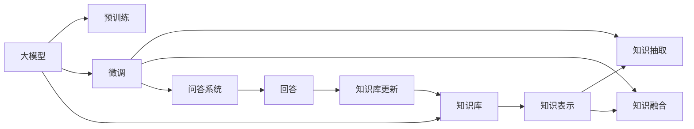
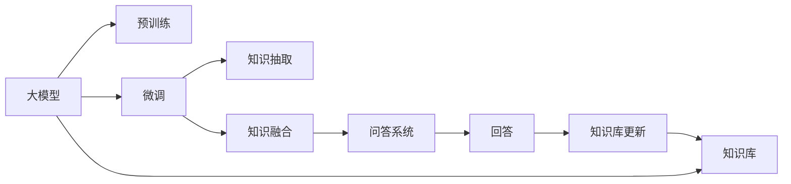
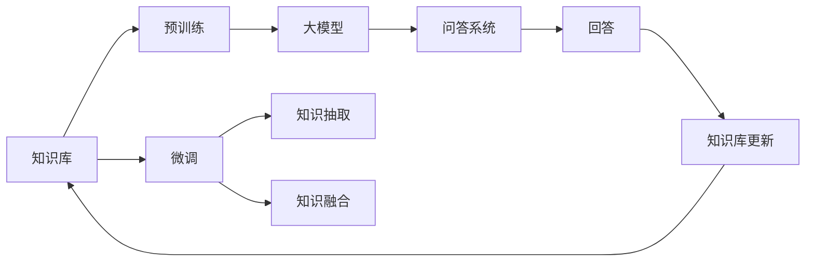
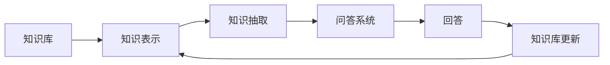

                 

# 大模型问答机器人的知识处理

## 1. 背景介绍

### 1.1 问题由来

随着人工智能技术的快速发展，人工智能在自然语言处理（Natural Language Processing，NLP）领域的众多应用中已经取得了显著进展。问答机器人作为NLP领域的重要应用，通过人工智能技术实现了从海量数据中提取知识并回答用户提出的问题。目前，问答机器人技术已经广泛应用于智能客服、医疗咨询、教育辅助等多个领域，并逐渐成为提高用户满意度、改善用户体验的重要工具。

然而，传统的基于规则和模板的问答系统存在可扩展性差、维护成本高、适应能力弱等问题。而基于深度学习的问答系统虽然能够处理大规模数据并实现高效回答，但仍然面临诸如模型理解能力不足、知识存储和提取方式单一、系统鲁棒性差等挑战。近年来，大模型知识处理技术的崛起，为问答机器人的知识获取和应用提供了新的思路，有望进一步提升问答系统的准确性和智能性。

### 1.2 问题核心关键点

基于大模型的问答机器人，指的是在预训练模型（如BERT、GPT等）上构建的问答系统，通过在特定领域的知识库上进行微调（Fine-tuning），使模型具备特定领域的知识理解能力和问答能力。其核心在于如何利用大模型强大的语言理解和生成能力，高效地从知识库中提取、融合和应用知识，构建高效、智能的问答系统。

关键问题点包括：
1. 知识库的选择和构建。如何选择和构建适合于特定领域和应用场景的知识库。
2. 知识表示和融合方式。如何高效地将知识库中的知识表示并融入到问答模型中。
3. 问答模型的构建和优化。如何构建高效、鲁棒且能适应多样化的问答模型。
4. 问答系统的鲁棒性和可解释性。如何提高问答系统的鲁棒性并增强其可解释性。
5. 知识库和问答模型的持续学习。如何实现知识库和问答模型的持续学习和知识更新。

### 1.3 问题研究意义

基于大模型的问答机器人知识处理技术的研究，具有重要的理论价值和实际应用意义：

1. **提升问答系统智能化水平**：利用大模型强大的语言理解和生成能力，可以显著提升问答系统的智能化水平，使其能更准确、自然地回答用户问题。
2. **降低问答系统开发成本**：通过在大模型上进行微调，可以大幅度降低问答系统的开发成本，提高开发效率。
3. **促进知识获取和应用**：结合知识库和问答机器人技术，可以有效获取和应用领域知识，提升系统对领域知识的理解和应用能力。
4. **增强问答系统鲁棒性和可解释性**：通过优化问答模型和知识库，可以提高系统的鲁棒性和可解释性，增强用户对系统的信任度。
5. **推动AI技术产业化应用**：问答机器人技术已经广泛应用于多个领域，其知识处理技术的突破将进一步推动人工智能技术的产业化应用。

## 2. 核心概念与联系

### 2.1 核心概念概述

为更好地理解大模型问答机器人知识处理技术，本节将介绍几个密切相关的核心概念：

- **大模型（Large Model）**：指基于深度学习架构构建的、具有大规模参数的模型，如BERT、GPT等。这些模型通常在预训练阶段，通过在大规模无标签数据上学习语言表示和语言理解能力。
- **微调（Fine-tuning）**：指在大模型的基础上，通过特定任务的数据集进行有监督训练，调整模型参数以适应特定任务的过程。
- **知识库（Knowledge Base）**：指特定领域内结构化或非结构化的知识集合，用于增强问答机器人的领域知识。
- **知识表示（Knowledge Representation）**：指将知识库中的知识以结构化或半结构化的方式进行表示，以便于模型进行理解和推理。
- **知识抽取（Knowledge Extraction）**：指从知识库中自动抽取相关的知识信息，并转化为可用于问答系统的输入。
- **问答系统（Question Answering System）**：指基于自然语言处理技术，能够回答用户提问的系统。
- **知识融合（Knowledge Fusion）**：指将知识库中的知识与问答系统中的模型输出进行融合，以增强系统的回答准确性和智能性。
- **持续学习（Continuous Learning）**：指系统能够持续从新数据中学习，并更新知识库和模型参数的过程。

这些核心概念之间的关系，可以通过以下Mermaid流程图来展示：



这个流程图展示了大模型问答机器人知识处理技术的核心概念及其相互关系：

1. 大模型通过预训练获得基础能力。
2. 微调使得通用大模型更好地适应特定任务。
3. 知识库提供特定领域知识，增强系统智能性。
4. 知识抽取将知识库中的知识转化为可用于问答系统的输入。
5. 知识融合将抽取出的知识与模型输出进行融合，提升回答准确性。
6. 问答系统根据融合后的知识生成回答。
7. 知识库和问答模型通过持续学习机制不断更新和优化。

### 2.2 概念间的关系

这些核心概念之间存在着紧密的联系，形成了大模型问答机器人知识处理技术的完整生态系统。下面我们通过几个Mermaid流程图来展示这些概念之间的关系。

#### 2.2.1 大模型知识处理流程



这个流程图展示了基于大模型的问答机器人知识处理流程：

1. 大模型通过预训练获得基础能力。
2. 微调使得通用大模型更好地适应特定任务。
3. 知识库提供特定领域知识，增强系统智能性。
4. 知识抽取将知识库中的知识转化为可用于问答系统的输入。
5. 知识融合将抽取出的知识与模型输出进行融合，提升回答准确性。
6. 问答系统根据融合后的知识生成回答。
7. 知识库和问答模型通过持续学习机制不断更新和优化。

#### 2.2.2 知识库与微调的关系



这个流程图展示了知识库与微调的关系：

1. 知识库提供特定领域知识，增强系统智能性。
2. 知识库在微调过程中被引入，进一步提升模型对特定领域的理解。
3. 知识库和问答模型通过持续学习机制不断更新和优化。

#### 2.2.3 知识抽取与问答系统的关系



这个流程图展示了知识抽取与问答系统的关系：

1. 知识库中的知识被表示成可用于问答系统的形式。
2. 知识抽取将表示后的知识转化为可用于问答系统的输入。
3. 问答系统根据抽取出的知识生成回答。
4. 问答系统的回答结果用于更新知识库。

## 3. 核心算法原理 & 具体操作步骤

### 3.1 算法原理概述

基于大模型的问答机器人知识处理技术，本质上是一个有监督的细粒度迁移学习过程。其核心思想是：将预训练的大模型视作一个强大的"特征提取器"，通过在特定领域的知识库上进行有监督的微调，使得模型能够高效地从知识库中提取、融合和应用知识，生成高质量的回答。

形式化地，假设预训练模型为 $M_{\theta}$，其中 $\theta$ 为预训练得到的模型参数。给定问答任务的训练集 $D=\{(x_i, y_i)\}_{i=1}^N$，其中 $x_i$ 为问题文本，$y_i$ 为答案文本。微调的目标是找到新的模型参数 $\hat{\theta}$，使得：

$$
\hat{\theta}=\mathop{\arg\min}_{\theta} \mathcal{L}(M_{\theta},D)
$$

其中 $\mathcal{L}$ 为针对问答任务设计的损失函数，用于衡量模型预测输出与真实标签之间的差异。常见的损失函数包括交叉熵损失、均方误差损失等。

通过梯度下降等优化算法，微调过程不断更新模型参数 $\theta$，最小化损失函数 $\mathcal{L}$，使得模型输出逼近真实标签。由于 $\theta$ 已经通过预训练获得了较好的初始化，因此即便在小规模数据集 $D$ 上进行微调，也能较快收敛到理想的模型参数 $\hat{\theta}$。

### 3.2 算法步骤详解

基于大模型的问答机器人知识处理技术的一般流程包括以下几个关键步骤：

**Step 1: 准备知识库和预训练模型**

- 选择合适的预训练语言模型 $M_{\theta}$ 作为初始化参数，如 BERT、GPT 等。
- 准备特定领域的知识库，包括结构化或非结构化的文本、图像、表格等知识形式。

**Step 2: 知识表示和抽取**

- 对知识库中的知识进行结构化处理，转化为可用于问答系统的输入格式。
- 利用知识库构建推理网络，用于抽取与问题相关的知识信息。

**Step 3: 添加任务适配层**

- 根据问答任务类型，在预训练模型顶层设计合适的输出层和损失函数。
- 对于文本问答任务，通常在顶层添加线性分类器和交叉熵损失函数。
- 对于图像问答任务，通常使用卷积神经网络输出概率分布，并以负对数似然为损失函数。

**Step 4: 设置微调超参数**

- 选择合适的优化算法及其参数，如 AdamW、SGD 等，设置学习率、批大小、迭代轮数等。
- 设置正则化技术及强度，包括权重衰减、Dropout、Early Stopping等。
- 确定冻结预训练参数的策略，如仅微调顶层，或全部参数都参与微调。

**Step 5: 执行梯度训练**

- 将训练集数据分批次输入模型，前向传播计算损失函数。
- 反向传播计算参数梯度，根据设定的优化算法和学习率更新模型参数。
- 周期性在验证集上评估模型性能，根据性能指标决定是否触发 Early Stopping。
- 重复上述步骤直到满足预设的迭代轮数或 Early Stopping 条件。

**Step 6: 测试和部署**

- 在测试集上评估微调后模型 $M_{\hat{\theta}}$ 的性能，对比微调前后的精度提升。
- 使用微调后的模型对新样本进行推理预测，集成到实际的应用系统中。
- 持续收集新的数据，定期重新微调模型，以适应数据分布的变化。

以上是基于监督学习微调大模型进行问答机器人知识处理的一般流程。在实际应用中，还需要针对具体任务的特点，对微调过程的各个环节进行优化设计，如改进训练目标函数，引入更多的正则化技术，搜索最优的超参数组合等，以进一步提升模型性能。

### 3.3 算法优缺点

基于大模型的问答机器人知识处理技术具有以下优点：

1. 简单高效。只需准备少量标注数据，即可对预训练模型进行快速适配，获得较大的性能提升。
2. 通用适用。适用于各种问答任务，包括文本问答、图像问答、语音问答等，设计简单的任务适配层即可实现微调。
3. 参数高效。利用参数高效微调技术，在固定大部分预训练参数的情况下，仍可取得不错的提升。
4. 效果显著。在学术界和工业界的诸多任务上，基于微调的方法已经刷新了最先进的性能指标。

同时，该方法也存在一定的局限性：

1. 依赖标注数据。微调的效果很大程度上取决于标注数据的质量和数量，获取高质量标注数据的成本较高。
2. 迁移能力有限。当目标任务与预训练数据的分布差异较大时，微调的性能提升有限。
3. 负面效果传递。预训练模型的固有偏见、有害信息等，可能通过微调传递到下游任务，造成负面影响。
4. 可解释性不足。微调模型的决策过程通常缺乏可解释性，难以对其推理逻辑进行分析和调试。

尽管存在这些局限性，但就目前而言，基于监督学习的微调方法仍是大语言模型问答系统应用的最主流范式。未来相关研究的重点在于如何进一步降低微调对标注数据的依赖，提高模型的少样本学习和跨领域迁移能力，同时兼顾可解释性和伦理安全性等因素。

### 3.4 算法应用领域

基于大模型的问答机器人知识处理技术在NLP领域已经得到了广泛的应用，覆盖了几乎所有常见任务，例如：

- 文本问答：如智能客服问答、医疗咨询问答、法律咨询问答等。通过微调使模型学习文本-标签映射。
- 图像问答：如从图像中提取物体、场景信息，生成相关问题并回答。利用预训练图像识别模型和文本生成模型进行联合微调。
- 语音问答：如智能音箱问答、车载语音问答等。通过微调使模型理解语音输入，生成相应文本并回答。
- 多模态问答：如将文本、图像、语音等多模态信息进行融合，构建多模态问答系统。

除了上述这些经典任务外，基于大模型问答机器人技术也被创新性地应用到更多场景中，如智能助手、教育机器人、智能家居控制等，为NLP技术带来了全新的突破。随着预训练模型和微调方法的不断进步，相信NLP技术将在更广阔的应用领域大放异彩。

## 4. 数学模型和公式 & 详细讲解 & 举例说明

### 4.1 数学模型构建

本节将使用数学语言对基于大模型的问答机器人知识处理过程进行更加严格的刻画。

记预训练语言模型为 $M_{\theta}$，其中 $\theta$ 为预训练得到的模型参数。假设问答任务的训练集为 $D=\{(x_i, y_i)\}_{i=1}^N$，其中 $x_i$ 为问题文本，$y_i$ 为答案文本。定义模型 $M_{\theta}$ 在数据样本 $(x,y)$ 上的损失函数为 $\ell(M_{\theta}(x),y)$，则在数据集 $D$ 上的经验风险为：

$$
\mathcal{L}(\theta) = \frac{1}{N} \sum_{i=1}^N \ell(M_{\theta}(x_i),y_i)
$$

微调的优化目标是最小化经验风险，即找到最优参数：

$$
\theta^* = \mathop{\arg\min}_{\theta} \mathcal{L}(\theta)
$$

在实践中，我们通常使用基于梯度的优化算法（如SGD、Adam等）来近似求解上述最优化问题。设 $\eta$ 为学习率，$\lambda$ 为正则化系数，则参数的更新公式为：

$$
\theta \leftarrow \theta - \eta \nabla_{\theta}\mathcal{L}(\theta) - \eta\lambda\theta
$$

其中 $\nabla_{\theta}\mathcal{L}(\theta)$ 为损失函数对参数 $\theta$ 的梯度，可通过反向传播算法高效计算。

### 4.2 公式推导过程

以下我们以二分类任务为例，推导交叉熵损失函数及其梯度的计算公式。

假设模型 $M_{\theta}$ 在输入 $x$ 上的输出为 $\hat{y}=M_{\theta}(x) \in [0,1]$，表示样本属于正类的概率。真实标签 $y \in \{0,1\}$。则二分类交叉熵损失函数定义为：

$$
\ell(M_{\theta}(x),y) = -[y\log \hat{y} + (1-y)\log (1-\hat{y})]
$$

将其代入经验风险公式，得：

$$
\mathcal{L}(\theta) = -\frac{1}{N}\sum_{i=1}^N [y_i\log M_{\theta}(x_i)+(1-y_i)\log(1-M_{\theta}(x_i))]
$$

根据链式法则，损失函数对参数 $\theta_k$ 的梯度为：

$$
\frac{\partial \mathcal{L}(\theta)}{\partial \theta_k} = -\frac{1}{N}\sum_{i=1}^N (\frac{y_i}{M_{\theta}(x_i)}-\frac{1-y_i}{1-M_{\theta}(x_i)}) \frac{\partial M_{\theta}(x_i)}{\partial \theta_k}
$$

其中 $\frac{\partial M_{\theta}(x_i)}{\partial \theta_k}$ 可进一步递归展开，利用自动微分技术完成计算。

在得到损失函数的梯度后，即可带入参数更新公式，完成模型的迭代优化。重复上述过程直至收敛，最终得到适应问答任务的最优模型参数 $\theta^*$。

### 4.3 案例分析与讲解

以下通过一个具体的问答场景，分析如何使用基于大模型的问答机器人知识处理技术来解决实际问题。

假设我们需要开发一个医疗咨询问答系统，该系统需要回答医生和患者提出的各种医疗问题。我们可以先收集大量的医疗问答数据，将其划分为训练集、验证集和测试集。然后，利用大模型BERT进行预训练，构建一个微调后的问答模型。具体步骤如下：

**Step 1: 准备数据和知识库**

- 收集医疗问答数据集，包括医生和患者的互动文本、诊断结果等。
- 构建一个结构化的医疗知识库，包括疾病症状、诊断标准、治疗方案等信息。

**Step 2: 知识表示和抽取**

- 对医疗知识库中的知识进行结构化处理，转化为可供问答模型输入的格式。
- 构建一个推理网络，用于从知识库中抽取与问题相关的知识信息。

**Step 3: 添加任务适配层**

- 在BERT模型顶层添加一个线性分类器，用于对医疗问答问题进行分类。
- 设置交叉熵损失函数，用于衡量模型预测输出与真实标签之间的差异。

**Step 4: 设置微调超参数**

- 设置学习率为2e-5，批次大小为32，迭代轮数为5。
- 设置正则化参数为0.01，使用Dropout策略。

**Step 5: 执行梯度训练**

- 将训练集数据分批次输入模型，前向传播计算损失函数。
- 反向传播计算参数梯度，根据设定的优化算法和学习率更新模型参数。
- 周期性在验证集上评估模型性能，根据性能指标决定是否触发 Early Stopping。
- 重复上述步骤直到满足预设的迭代轮数或 Early Stopping 条件。

**Step 6: 测试和部署**

- 在测试集上评估微调后模型 $M_{\hat{\theta}}$ 的性能，对比微调前后的精度提升。
- 使用微调后的模型对新样本进行推理预测，集成到实际的应用系统中。
- 持续收集新的医疗问答数据，定期重新微调模型，以适应数据分布的变化。

## 5. 项目实践：代码实例和详细解释说明

### 5.1 开发环境搭建

在进行问答机器人知识处理实践前，我们需要准备好开发环境。以下是使用Python进行PyTorch开发的环境配置流程：

1. 安装Anaconda：从官网下载并安装Anaconda，用于创建独立的Python环境。

2. 创建并激活虚拟环境：
```bash
conda create -n pytorch-env python=3.8 
conda activate pytorch-env
```

3. 安装PyTorch：根据CUDA版本，从官网获取对应的安装命令。例如：
```bash
conda install pytorch torchvision torchaudio cudatoolkit=11.1 -c pytorch -c conda-forge
```

4. 安装Transformers库：
```bash
pip install transformers
```

5. 安装各类工具包：
```bash
pip install numpy pandas scikit-learn matplotlib tqdm jupyter notebook ipython
```

完成上述步骤后，即可在`pytorch-env`环境中开始问答机器人知识处理实践。

### 5.2 源代码详细实现

下面我们以文本问答机器人为例，给出使用Transformers库对BERT模型进行微调的PyTorch代码实现。

首先，定义问答任务的数据处理函数：

```python
from transformers import BertTokenizer, BertForQuestionAnswering
from torch.utils.data import Dataset
import torch

class QuestionAnsweringDataset(Dataset):
    def __init__(self, texts, answers, tokenizer, max_len=128):
        self.texts = texts
        self.answers = answers
        self.tokenizer = tokenizer
        self.max_len = max_len
        
    def __len__(self):
        return len(self.texts)
    
    def __getitem__(self, item):
        text = self.texts[item]
        answer = self.answers[item]
        
        encoding = self.tokenizer(text, return_tensors='pt', max_length=self.max_len, padding='max_length', truncation=True)
        input_ids = encoding['input_ids'][0]
        attention_mask = encoding['attention_mask'][0]
        start_positions = torch.tensor([self.tokenizer.convert_tokens_to_ids(answer.start)], dtype=torch.long)
        end_positions = torch.tensor([self.tokenizer.convert_tokens_to_ids(answer.end)], dtype=torch.long)
        
        return {'input_ids': input_ids, 
                'attention_mask': attention_mask,
                'start_positions': start_positions,
                'end_positions': end_positions}

# 创建dataset
tokenizer = BertTokenizer.from_pretrained('bert-base-cased')

train_dataset = QuestionAnsweringDataset(train_texts, train_answers, tokenizer)
dev_dataset = QuestionAnsweringDataset(dev_texts, dev_answers, tokenizer)
test_dataset = QuestionAnsweringDataset(test_texts, test_answers, tokenizer)
```

然后，定义模型和优化器：

```python
from transformers import BertForQuestionAnswering, AdamW

model = BertForQuestionAnswering.from_pretrained('bert-base-cased', num_labels=2)

optimizer = AdamW(model.parameters(), lr=2e-5)
```

接着，定义训练和评估函数：

```python
from torch.utils.data import DataLoader
from tqdm import tqdm
from sklearn.metrics import accuracy_score, precision_recall_fscore_support

device = torch.device('cuda') if torch.cuda.is_available() else torch.device('cpu')
model.to(device)

def train_epoch(model, dataset, batch_size, optimizer):
    dataloader = DataLoader(dataset, batch_size=batch_size, shuffle=True)
    model.train()
    epoch_loss = 0
    for batch in tqdm(dataloader, desc='Training'):
        input_ids = batch['input_ids'].to(device)
        attention_mask = batch['attention_mask'].to(device)
        start_positions = batch['start_positions'].to(device)
        end_positions = batch['end_positions'].to(device)
        model.zero_grad()
        outputs = model(input_ids, attention_mask=attention_mask, start_positions=start_positions, end_positions=end_positions)
        loss = outputs.loss
        epoch_loss += loss.item()
        loss.backward()
        optimizer.step()
    return epoch_loss / len(dataloader)

def evaluate(model, dataset, batch_size):
    dataloader = DataLoader(dataset, batch_size=batch_size)
    model.eval()
    preds, labels = [], []
    with torch.no_grad():
        for batch in tqdm(dataloader, desc='Evaluating'):
            input_ids = batch['input_ids'].to(device)
            attention_mask = batch['attention_mask'].to(device)
            start_positions = batch['start_positions'].to(device)
            end_positions = batch['end_positions'].to(device)
            batch_preds = model(input_ids, attention_mask=attention_mask, start_positions=start_positions, end_positions=end_positions)
            batch_labels = torch.tensor([[0, 1], [1, 0]], device=device).to(device).unsqueeze(0)
            for pred, label in zip(batch_preds, batch_labels):
                preds.append(pred)
                labels.append(label)
                
    return accuracy_score(labels, preds)

print('Accuracy:', evaluate(model, dev_dataset, 16))
```

最后，启动训练流程并在测试集上评估：

```python
epochs = 5
batch_size = 16

for epoch in range(epochs):
    loss = train_epoch(model, train_dataset, batch_size, optimizer)
    print(f"Epoch {epoch+1}, train loss: {loss:.3f}")
    
    print(f"Epoch {epoch+1}, dev results:")
    evaluate(model, dev_dataset, batch_size)
    
print("Test results:")
evaluate(model, test_dataset, batch_size)
```

以上就是使用PyTorch对BERT进行问答机器人知识处理微调的完整代码实现。可以看到，得益于Transformers库的强大封装，我们可以用相对简洁的代码完成BERT模型的加载和微调。

### 5.3 代码解读与分析

让我们再详细解读一下关键代码的实现细节：

**QuestionAnsweringDataset类**：
- `__init__`方法：初始化问题、答案、分词器等关键组件。
- `__len__`方法：返回数据集的样本数量。
- `__getitem__`方法：对单个样本进行处理，将问题输入编码为token ids，将答案编码为数字，并对其进行定长padding

