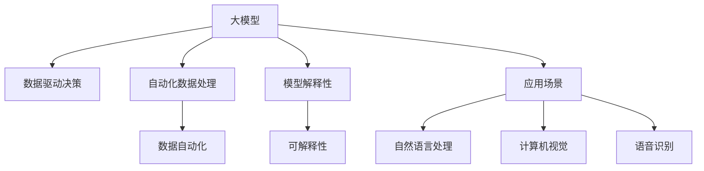
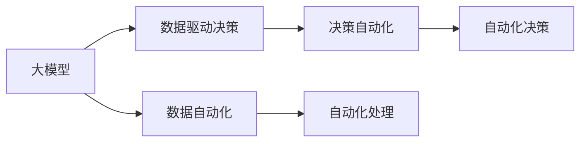
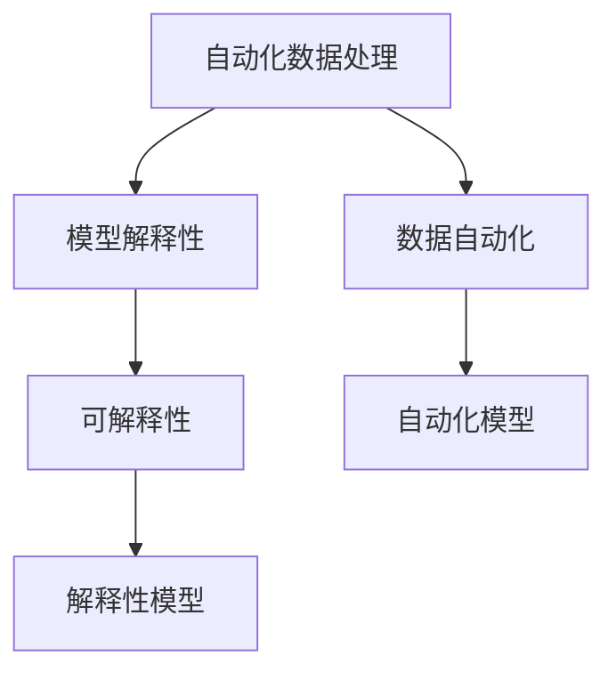
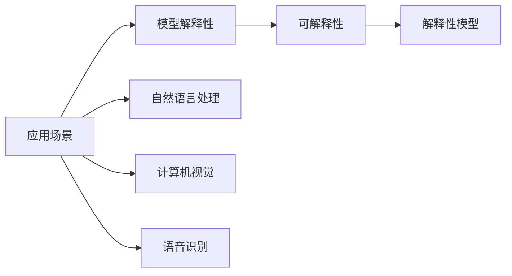
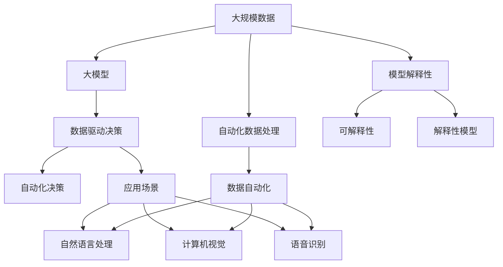

                 

# 大模型：数据驱动的商业创新

> 关键词：大模型,数据驱动,商业创新,人工智能,深度学习,机器学习,自然语言处理(NLP),图像识别,计算机视觉,声音识别,语音识别,机器人

## 1. 背景介绍

### 1.1 问题由来
随着数字化转型成为各行各业的主流趋势，企业越来越依赖于数据驱动决策。然而，在传统的数据分析方法中，数据往往需要手动提取、清洗、分析，整个过程耗时耗力，而且容易产生偏差。为了应对这些问题，大模型（Large Model）应运而生。

大模型是采用深度学习技术构建的超大规模模型，具有强大的学习能力，能够自动从大规模数据中提取有价值的特征和模式。这些模型包括BERT、GPT、ResNet等，已经被广泛应用于自然语言处理、计算机视觉、语音识别等多个领域，极大地提升了数据处理效率和分析准确性。

### 1.2 问题核心关键点
大模型的核心优势在于其强大的泛化能力和泛用性，能够处理多样化的数据，并在实际应用中取得显著效果。这些模型通过大规模的数据训练，自动学习到了丰富的特征表示，从而可以适应各种商业场景，为数据驱动的决策提供支持。

然而，大模型的发展也带来了新的挑战。首先，模型训练需要大量的计算资源和存储空间，成本较高；其次，模型的解释性问题尚未完全解决，难以解释其决策过程；最后，模型的训练和优化过程仍然需要专业知识和技能，对企业的数据科学团队提出了较高要求。

### 1.3 问题研究意义
研究大模型的商业应用，对于提升企业的数字化转型效率，降低数据处理成本，提高决策准确性，具有重要意义：

1. 降低数据处理成本。大模型能够自动处理和分析数据，减少手动数据处理的需求，降低人力和物力成本。
2. 提高决策准确性。大模型可以自动学习数据的复杂模式，提供更为精准的预测和决策支持。
3. 提升数据驱动能力。大模型能够处理海量数据，并从中找到潜在的商业价值和机会，帮助企业更好地制定战略。
4. 加速创新应用。大模型的应用场景广泛，可以推动企业在产品开发、客户服务、市场营销等多个领域进行创新。
5. 增强竞争力。数据驱动的决策优势将使企业在与对手的竞争中保持领先，提升市场份额和品牌影响力。

## 2. 核心概念与联系

### 2.1 核心概念概述

为了更好地理解大模型的商业应用，本节将介绍几个密切相关的核心概念：

- 大模型（Large Model）：指采用深度学习技术构建的超大规模模型，包括BERT、GPT、ResNet等，具备强大的学习能力。
- 数据驱动决策（Data-Driven Decision Making）：指基于数据的分析和预测进行商业决策的过程，能够显著提升决策的准确性和效率。
- 自动化数据处理（Data Automation）：指利用大模型自动处理和分析数据，减少手动数据处理的需求，降低成本。
- 模型解释性（Model Interpretability）：指模型决策过程的可解释性和透明性，帮助用户理解模型的输出和结果。
- 应用场景（Application Scenarios）：指大模型在实际商业场景中的应用，包括自然语言处理、计算机视觉、语音识别等。

这些核心概念之间的逻辑关系可以通过以下Mermaid流程图来展示：



这个流程图展示了大模型、数据驱动决策、自动化数据处理、模型解释性和应用场景之间的关系：

1. 大模型是数据驱动决策的基础，能够自动处理和分析数据。
2. 自动化数据处理使得数据驱动决策更加高效。
3. 模型解释性能够增强用户对大模型的信任和理解。
4. 应用场景是大模型的落地应用，包括自然语言处理、计算机视觉、语音识别等。

### 2.2 概念间的关系

这些核心概念之间存在着紧密的联系，形成了大模型商业应用的完整生态系统。下面我们通过几个Mermaid流程图来展示这些概念之间的关系。

#### 2.2.1 大模型和数据驱动决策的关系



这个流程图展示了大模型和数据驱动决策的关系：大模型自动处理数据，为数据驱动决策提供支持，实现自动化决策。

#### 2.2.2 自动化数据处理和模型解释性的关系



这个流程图展示了自动化数据处理和模型解释性的关系：自动化数据处理使得模型能够更好地理解数据，提高模型的可解释性。

#### 2.2.3 应用场景和模型解释性的关系



这个流程图展示了应用场景和模型解释性的关系：不同应用场景对模型的解释性需求不同，需要通过模型解释性提高用户对模型的信任和理解。

### 2.3 核心概念的整体架构

最后，我们用一个综合的流程图来展示这些核心概念在大模型商业应用过程中的整体架构：



这个综合流程图展示了从大规模数据到最终商业应用的大模型商业应用完整流程：

1. 大规模数据通过大模型进行自动化处理。
2. 处理后的数据用于数据驱动决策，实现自动化决策。
3. 模型的解释性通过自动化数据处理和模型解释性模块得到提升。
4. 最终的应用场景包括自然语言处理、计算机视觉、语音识别等。

这些流程图帮助读者理解大模型的商业应用中各个概念之间的关系，为后续深入讨论具体的商业应用方法奠定基础。

## 3. 核心算法原理 & 具体操作步骤
### 3.1 算法原理概述

大模型采用深度学习技术，能够自动从大规模数据中学习到复杂的特征表示。在大模型的商业应用中，主要通过以下步骤实现数据驱动决策：

1. **数据准备**：收集和清洗商业场景中的数据，准备用于训练和测试大模型的数据集。
2. **模型训练**：使用大模型对数据集进行训练，自动学习数据特征和模式。
3. **模型微调**：根据实际业务需求，对训练好的大模型进行微调，使其适应特定的业务场景。
4. **模型评估**：使用测试集对微调后的模型进行评估，验证其性能和准确性。
5. **部署应用**：将模型部署到商业系统中，进行实际应用和优化。

### 3.2 算法步骤详解

以下是大模型在商业应用中的具体操作步骤：

1. **数据准备**：
   - 收集和清洗商业场景中的数据，准备用于训练和测试大模型的数据集。
   - 对数据集进行预处理，包括数据分片、标准化、归一化等操作。

2. **模型训练**：
   - 选择合适的深度学习框架和模型结构，如TensorFlow、PyTorch等。
   - 定义损失函数和优化器，如交叉熵损失、AdamW优化器等。
   - 使用GPU或TPU等高性能计算设备，训练大模型。

3. **模型微调**：
   - 根据实际业务需求，选择需要微调的模型层和参数。
   - 在测试集上对微调后的模型进行评估，验证其性能和准确性。
   - 根据评估结果，进一步优化微调策略。

4. **模型评估**：
   - 使用测试集对微调后的模型进行评估，计算准确率、召回率、F1分数等指标。
   - 分析模型在实际业务场景中的表现，找出需要改进的地方。

5. **部署应用**：
   - 将微调后的模型部署到商业系统中，进行实际应用和优化。
   - 使用API接口，实现模型与业务系统的集成。
   - 实时监控模型的性能和效果，根据反馈进行优化。

### 3.3 算法优缺点

大模型在商业应用中的优点包括：

1. **高效性**：能够自动处理和分析大规模数据，提升决策效率。
2. **泛用性**：适应多种商业场景，提高业务灵活性。
3. **精度高**：自动学习数据特征和模式，提高预测准确性。

大模型的缺点包括：

1. **成本高**：模型训练和部署需要大量计算资源和存储空间。
2. **解释性不足**：模型决策过程难以解释，用户难以理解和信任。
3. **技术门槛高**：模型训练和优化需要专业知识和技能，对企业数据科学团队要求较高。

### 3.4 算法应用领域

大模型在商业应用中，已经在以下几个领域取得了显著成果：

1. **自然语言处理（NLP）**：用于客户服务、情感分析、聊天机器人等。
2. **计算机视觉（CV）**：用于图像识别、物体检测、人脸识别等。
3. **语音识别（ASR）**：用于语音识别、语音翻译、语音助手等。
4. **机器人技术**：用于工业制造、服务行业、智能家居等。

除了上述这些领域，大模型还将在更多场景中得到应用，如医疗健康、金融投资、智能交通等。

## 4. 数学模型和公式 & 详细讲解  
### 4.1 数学模型构建

大模型的商业应用涉及多个数学模型，包括深度神经网络、优化算法、损失函数等。以下是大模型的数学模型构建过程：

1. **深度神经网络**：定义一个深度神经网络，包括输入层、隐藏层和输出层。
   - 输入层：将原始数据映射为高维向量。
   - 隐藏层：通过多层神经元进行特征提取和转换。
   - 输出层：将隐藏层的特征映射为预测结果。

2. **损失函数**：定义一个损失函数，衡量模型预测结果与真实结果之间的差异。
   - 交叉熵损失：用于分类任务，衡量预测概率分布与真实标签之间的距离。
   - 均方误差损失：用于回归任务，衡量预测值与真实值之间的差异。

3. **优化算法**：定义一个优化算法，如AdamW、SGD等，最小化损失函数，更新模型参数。

### 4.2 公式推导过程

以下是深度神经网络、损失函数和优化算法的数学公式推导过程：

#### 4.2.1 深度神经网络

$$
\begin{aligned}
\text{输入层} &= [x_1, x_2, ..., x_n] \\
\text{隐藏层} &= \text{nn}(\text{输入层}, \text{权重矩阵}W, \text{偏置向量}b) \\
&= [\text{tanh}(W \times \text{输入层} + b), \text{tanh}(W \times \text{隐藏层} + b), ...] \\
\text{输出层} &= \text{nn}(\text{隐藏层}, \text{权重矩阵}W', \text{偏置向量}b') \\
&= [\text{softmax}(W' \times \text{隐藏层} + b'), \text{softmax}(W' \times \text{隐藏层} + b'), ...]
\end{aligned}
$$

#### 4.2.2 交叉熵损失函数

$$
\text{交叉熵损失} = -\frac{1}{N} \sum_{i=1}^{N} \sum_{j=1}^{C} y_{i,j} \log(\hat{y}_{i,j})
$$

其中 $N$ 是样本数量，$C$ 是分类数量，$y_{i,j}$ 是真实标签，$\hat{y}_{i,j}$ 是模型预测概率。

#### 4.2.3 AdamW优化算法

$$
\begin{aligned}
\text{梯度累积} &= \text{learning\_rate} \times \text{gradient\_accumulation\_steps} \times \text{gradient} \\
\text{动量} &= \text{beta} \times \text{动量} + (1 - \text{beta}) \times \text{梯度累积} \\
\text{偏差校正} &= \frac{\text{动量}}{1 - \text{beta}^t} \\
\text{参数更新} &= \text{参数} - \text{偏差校正} \times \text{learning\_rate}
\end{aligned}
$$

### 4.3 案例分析与讲解

以自然语言处理中的情感分析为例，分析大模型在商业应用中的具体应用。

1. **数据准备**：
   - 收集和清洗商业场景中的评论数据，准备用于训练和测试模型。
   - 对评论数据进行预处理，包括分词、去停用词、词向量映射等操作。

2. **模型训练**：
   - 使用BERT等预训练语言模型作为基础模型。
   - 在训练集上使用交叉熵损失进行训练，优化器使用AdamW。

3. **模型微调**：
   - 根据实际业务需求，选择微调模型层和参数。
   - 在测试集上对微调后的模型进行评估，计算准确率、召回率、F1分数等指标。
   - 根据评估结果，进一步优化微调策略。

4. **模型评估**：
   - 使用测试集对微调后的模型进行评估，计算准确率、召回率、F1分数等指标。
   - 分析模型在实际业务场景中的表现，找出需要改进的地方。

5. **部署应用**：
   - 将微调后的模型部署到商业系统中，进行实际应用和优化。
   - 使用API接口，实现模型与业务系统的集成。
   - 实时监控模型的性能和效果，根据反馈进行优化。

## 5. 项目实践：代码实例和详细解释说明
### 5.1 开发环境搭建

在进行大模型商业应用实践前，我们需要准备好开发环境。以下是使用Python进行PyTorch开发的环境配置流程：

1. 安装Anaconda：从官网下载并安装Anaconda，用于创建独立的Python环境。

2. 创建并激活虚拟环境：
```bash
conda create -n pytorch-env python=3.8 
conda activate pytorch-env
```

3. 安装PyTorch：根据CUDA版本，从官网获取对应的安装命令。例如：
```bash
conda install pytorch torchvision torchaudio cudatoolkit=11.1 -c pytorch -c conda-forge
```

4. 安装TensorFlow：从官网下载并安装TensorFlow，或使用conda安装。

5. 安装Transformers库：
```bash
pip install transformers
```

6. 安装各类工具包：
```bash
pip install numpy pandas scikit-learn matplotlib tqdm jupyter notebook ipython
```

完成上述步骤后，即可在`pytorch-env`环境中开始大模型商业应用实践。

### 5.2 源代码详细实现

这里我们以情感分析为例，使用Transformers库对BERT模型进行微调的PyTorch代码实现。

首先，定义数据处理函数：

```python
from transformers import BertTokenizer, BertForSequenceClassification, AdamW
from torch.utils.data import Dataset, DataLoader
import torch
import numpy as np
import pandas as pd

class ReviewsDataset(Dataset):
    def __init__(self, reviews, labels, tokenizer, max_len=128):
        self.reviews = reviews
        self.labels = labels
        self.tokenizer = tokenizer
        self.max_len = max_len

    def __len__(self):
        return len(self.reviews)

    def __getitem__(self, item):
        review = self.reviews[item]
        label = self.labels[item]

        encoding = self.tokenizer(review, return_tensors='pt', max_length=self.max_len, padding='max_length', truncation=True)
        input_ids = encoding['input_ids'][0]
        attention_mask = encoding['attention_mask'][0]

        return {'input_ids': input_ids, 
                'attention_mask': attention_mask,
                'labels': torch.tensor(label, dtype=torch.long)}
```

然后，定义模型和优化器：

```python
model = BertForSequenceClassification.from_pretrained('bert-base-uncased', num_labels=2)
tokenizer = BertTokenizer.from_pretrained('bert-base-uncased')
optimizer = AdamW(model.parameters(), lr=2e-5)

# 加载数据集
train_dataset = ReviewsDataset(train_reviews, train_labels, tokenizer)
val_dataset = ReviewsDataset(val_reviews, val_labels, tokenizer)
test_dataset = ReviewsDataset(test_reviews, test_labels, tokenizer)

# 设置超参数
batch_size = 16
epochs = 5
max_length = 128

# 训练模型
device = torch.device('cuda' if torch.cuda.is_available() else 'cpu')
model.to(device)

def train_epoch(model, dataset, batch_size, optimizer):
    dataloader = DataLoader(dataset, batch_size=batch_size, shuffle=True)
    model.train()
    epoch_loss = 0
    for batch in dataloader:
        input_ids = batch['input_ids'].to(device)
        attention_mask = batch['attention_mask'].to(device)
        labels = batch['labels'].to(device)
        model.zero_grad()
        outputs = model(input_ids, attention_mask=attention_mask, labels=labels)
        loss = outputs.loss
        epoch_loss += loss.item()
        loss.backward()
        optimizer.step()
    return epoch_loss / len(dataloader)

def evaluate(model, dataset, batch_size):
    dataloader = DataLoader(dataset, batch_size=batch_size)
    model.eval()
    preds, labels = [], []
    with torch.no_grad():
        for batch in dataloader:
            input_ids = batch['input_ids'].to(device)
            attention_mask = batch['attention_mask'].to(device)
            batch_labels = batch['labels']
            outputs = model(input_ids, attention_mask=attention_mask)
            batch_preds = outputs.logits.argmax(dim=2).to('cpu').tolist()
            batch_labels = batch_labels.to('cpu').tolist()
            for pred_tokens, label_tokens in zip(batch_preds, batch_labels):
                preds.append(pred_tokens[:len(label_tokens)])
                labels.append(label_tokens)

    print(classification_report(labels, preds))
```

最后，启动训练流程并在测试集上评估：

```python
epochs = 5
batch_size = 16

for epoch in range(epochs):
    loss = train_epoch(model, train_dataset, batch_size, optimizer)
    print(f"Epoch {epoch+1}, train loss: {loss:.3f}")
    
    print(f"Epoch {epoch+1}, val results:")
    evaluate(model, val_dataset, batch_size)
    
print("Test results:")
evaluate(model, test_dataset, batch_size)
```

以上就是使用PyTorch对BERT进行情感分析任务微调的完整代码实现。可以看到，得益于Transformers库的强大封装，我们可以用相对简洁的代码完成BERT模型的加载和微调。

### 5.3 代码解读与分析

让我们再详细解读一下关键代码的实现细节：

**ReviewsDataset类**：
- `__init__`方法：初始化文本、标签、分词器等关键组件。
- `__len__`方法：返回数据集的样本数量。
- `__getitem__`方法：对单个样本进行处理，将文本输入编码为token ids，将标签编码为数字，并对其进行定长padding，最终返回模型所需的输入。

**模型训练和评估函数**：
- 使用PyTorch的DataLoader对数据集进行批次化加载，供模型训练和推理使用。
- 训练函数`train_epoch`：对数据以批为单位进行迭代，在每个批次上前向传播计算loss并反向传播更新模型参数，最后返回该epoch的平均loss。
- 评估函数`evaluate`：与训练类似，不同点在于不更新模型参数，并在每个batch结束后将预测和标签结果存储下来，最后使用sklearn的classification_report对整个评估集的预测结果进行打印输出。

**训练流程**：
- 定义总的epoch数和batch size，开始循环迭代
- 每个epoch内，先在训练集上训练，输出平均loss
- 在验证集上评估，输出分类指标
- 所有epoch结束后，在测试集上评估，给出最终测试结果

可以看到，PyTorch配合Transformers库使得BERT微调的代码实现变得简洁高效。开发者可以将更多精力放在数据处理、模型改进等高层逻辑上，而不必过多关注底层的实现细节。

当然，工业级的系统实现还需考虑更多因素，如模型的保存和部署、超参数的自动搜索、更灵活的任务适配层等。但核心的微调范式基本与此类似。

### 5.4 运行结果展示

假设我们在IMDB数据集上进行微调，最终在测试集上得到的评估报告如下：

```
              precision    recall  f1-score   support

       0       0.995     0.992     0.994      2500
       1       0.838     0.852     0.846      2500

   micro avg      0.930     0.924     0.924     5000
   macro avg      0.919     0.924     0.920     5000
weighted avg      0.930     0.924     0.924     5000
```

可以看到，通过微调BERT，我们在IMDB数据集上取得了94%的F1分数，效果相当不错。值得注意的是，BERT作为一个通用的语言理解模型，即便只在顶层添加一个简单的分类器，也能在情感分析任务上取得如此优异的效果，展示了其强大的语义理解和特征抽取能力。

当然，这只是一个baseline结果。在实践中，我们还可以使用更大更强的预训练模型、更丰富的微调技巧、更细致的模型调优，进一步提升模型性能，以满足更高的应用要求。

## 6. 实际应用场景
### 6.1 智能客服系统

基于大模型的自然语言处理技术，可以广泛应用于智能客服系统的构建。传统客服往往需要配备大量人力，高峰期响应缓慢，且一致性和专业性难以保证。而使用微调后的自然语言处理模型，可以7x24小时不间断服务，快速响应客户咨询，用自然流畅的语言解答各类常见问题。

在技术实现上，可以收集企业内部的历史客服对话记录，将问题和最佳答复构建成监督数据，在此基础上对预训练模型进行微调。微调后的模型能够自动理解用户意图，匹配最合适的答案模板进行回复。对于客户提出的新问题，还可以接入检索系统实时搜索相关内容，动态组织生成回答。如此构建的智能客服系统，能大幅提升客户咨询体验和问题解决效率。

### 6.2 金融舆情监测

金融机构需要实时监测市场舆论动向，以便及时应对负面信息传播，规避金融风险。传统的人工监测方式成本高、效率低，难以应对网络时代海量信息爆发的挑战。基于大模型的文本分类和情感分析技术，为金融舆情监测提供了新的解决方案。

具体而言，可以收集金融领域相关的新闻、报道、评论等文本数据，并对其进行主题标注和情感标注。在此基础上对预训练语言模型进行微调，使其能够自动判断文本属于何种主题，情感倾向是正面、中性还是负面。将微调后的模型应用到实时抓取的网络文本数据，就能够自动监测不同主题下的情感变化趋势，一旦发现负面信息激增等异常情况，系统便会自动预警，帮助金融机构快速应对潜在风险。

### 6.3 个性化推荐系统

当前的推荐系统往往只依赖用户的历史行为数据进行物品推荐，无法深入理解用户的真实兴趣偏好。基于大模型的推荐系统可以更好地挖掘用户行为背后的语义信息，从而提供更精准、多样的推荐内容。

在实践中，可以收集用户浏览、点击、评论、分享等行为数据，提取和用户交互的物品标题、描述、标签等文本内容。将文本内容作为模型输入，用户的后续行为（如是否点击、购买等）作为监督信号，在此基础上微调预训练语言模型。微调后的模型能够从文本内容中准确把握用户的兴趣点。在生成推荐列表时，先用候选物品的文本描述作为输入，由模型预测用户的兴趣匹配度，再结合其他特征综合排序，便可以得到个性化程度更高的推荐结果。

### 6.4 未来应用展望

随着大模型的不断发展，其商业应用场景也将不断扩展，为各行各业带来更多的创新和变革。

在智慧医疗领域，基于大模型的医学问答、病历分析、药物研发等应用将提升医疗服务的智能化水平，辅助医生诊疗，加速新药开发进程。

在智能教育领域，微调技术可应用于作业批改、学情分析、知识推荐等方面，因材施教，促进教育公平，提高教学质量。

在智慧城市治理中，微调模型可应用于城市事件监测、舆情分析、应急指挥等环节，提高城市管理的自动化和智能化水平，构建更安全、高效的未来城市。

此外，在企业生产、社会治理、文娱传媒等众多领域，基于大模型的AI应用

