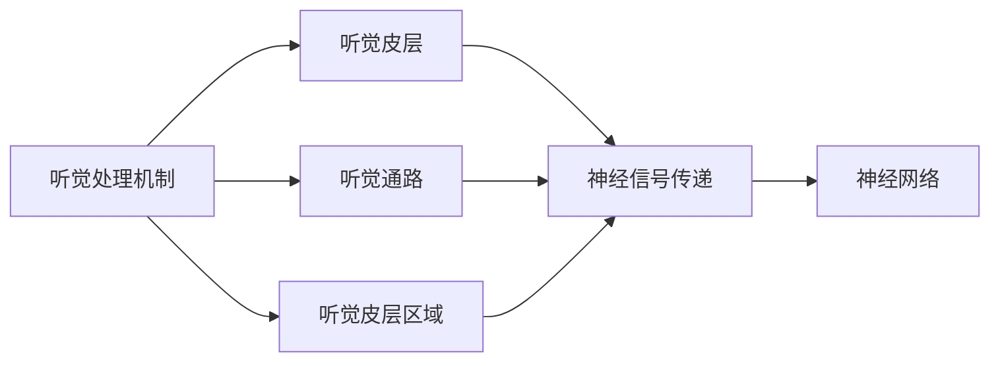
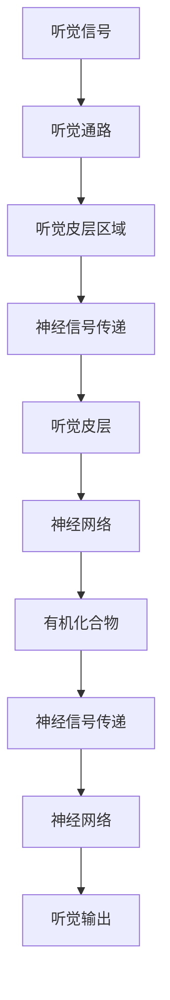

                 

# 大脑的听觉与有机化合物

## 1. 背景介绍

### 1.1 问题由来
随着人工智能技术的迅速发展，我们逐步从传统的硬件计算向基于神经网络的生物计算迈进。特别是对于大脑这一最高级的生物计算系统，其神经元结构和突触机制为开发新型算法提供了丰富的灵感来源。本文将围绕大脑的听觉处理机制和有机化合物在神经计算中的应用，深入探讨两者间的联系和影响，并分析其未来发展趋势和面临的挑战。

### 1.2 问题核心关键点
- **听觉处理机制**：详细分析大脑如何处理声音信号，包括听觉皮层（Auditory Cortex）、听觉通路（Auditory Pathway）和听觉皮层区域（Auditory Cortical Regions）。
- **有机化合物**：介绍有机化合物的基本性质、分类及其在神经计算中的潜在应用。
- **交互机制**：探讨有机化合物如何与神经网络进行交互，涉及信号传递、激活和记忆等过程。

## 2. 核心概念与联系

### 2.1 核心概念概述
为了更好地理解大脑的听觉处理和有机化合物在神经计算中的应用，本节将介绍几个密切相关的核心概念：

- **听觉处理机制**：涉及听觉信号的感知、分析和理解，包括听觉皮层（Auditory Cortex）、听觉通路（Auditory Pathway）和听觉皮层区域（Auditory Cortical Regions）。
- **有机化合物**：一类由碳、氢、氧等元素组成的分子，具有多种生物功能，包括信号传递、蛋白质合成和神经调节。
- **神经信号传递**：神经元之间通过化学信号传递信息的过程，涉及神经递质和受体。
- **神经网络**：一种受生物神经系统启发的计算模型，通过学习大量数据来模拟人类大脑的工作机制。

### 2.2 概念间的关系

这些核心概念之间的逻辑关系可以通过以下Mermaid流程图来展示：



这个流程图展示了大脑听觉处理和有机化合物在神经计算中的基本关系：

1. 听觉信号通过听觉通路传递到听觉皮层区域，经由神经信号传递机制进入听觉皮层。
2. 听觉皮层通过神经网络模拟大脑对声音信号的处理和理解。
3. 有机化合物在神经信号传递和神经网络中起重要作用。

### 2.3 核心概念的整体架构

最后，我们用一个综合的流程图来展示这些核心概念在大脑听觉处理和有机化合物在神经计算中的整体架构：



这个综合流程图展示了从听觉信号输入到听觉输出的完整过程，以及有机化合物在这一过程中扮演的角色。

## 3. 核心算法原理 & 具体操作步骤

### 3.1 算法原理概述
在大脑的听觉处理机制中，声音信号通过听觉通路传递到听觉皮层区域，经由神经信号传递进入听觉皮层，最终通过神经网络模拟大脑对声音信号的感知、分析和理解。有机化合物在神经信号传递和神经网络中起重要作用，参与神经递质的合成、信号传递和受体激活等过程。

在神经计算中，有机化合物可以模拟神经递质的功能和作用，通过特定的化学反应来传递和处理信息。这种化学信号的传递机制与神经网络中的电信号传递机制相类似，但具有更大的存储容量和更高的计算效率。

### 3.2 算法步骤详解

#### 3.2.1 听觉信号处理
1. **声音信号采集**：通过麦克风等设备采集声音信号，并将其转换为数字信号。
2. **信号预处理**：对数字信号进行预处理，包括降噪、滤波和特征提取等。
3. **特征映射**：将处理后的声音信号映射到听觉皮层的区域，通过神经信号传递机制传递信号。

#### 3.2.2 神经网络构建
1. **输入层**：接收预处理后的声音信号，并进行编码和特征提取。
2. **隐藏层**：模拟大脑中的神经元，通过连接权重矩阵和激活函数对信号进行传递和处理。
3. **输出层**：输出对声音信号的分析和理解结果，如语音识别、情感分析等。

#### 3.2.3 有机化合物应用
1. **神经递质合成**：通过有机化合物合成神经递质，并将其存储于神经元突触中。
2. **信号传递**：当神经元被激活时，突触释放神经递质，通过有机化合物传递信号。
3. **受体激活**：接收信号的神经元通过有机化合物激活特定受体，完成信息传递。

### 3.3 算法优缺点
#### 3.3.1 优点
- **高容量存储**：有机化合物具有更高的存储容量，能够模拟大脑神经元中的大量神经递质和受体。
- **高效计算**：通过化学信号的传递机制，有机化合物可以实现高效的信号处理和信息传递。
- **可编程性**：有机化合物可以通过特定的化学反应进行编程，实现特定的功能。

#### 3.3.2 缺点
- **时间延迟**：化学信号的传递速度较慢，可能导致信息传递延迟。
- **成本高昂**：合成和处理有机化合物需要较高的成本和技术要求。
- **复杂性高**：有机化合物的反应机制复杂，难以进行大规模的编程和优化。

### 3.4 算法应用领域

#### 3.4.1 生物医药
有机化合物在生物医药领域具有广泛应用，如药物设计、疾病诊断和细胞治疗等。通过模拟神经递质和受体，有机化合物可以用于设计新的药物分子，并应用于癌症、糖尿病等疾病的治疗。

#### 3.4.2 神经计算
有机化合物在神经计算中具有巨大的潜力，可以模拟神经网络中的电信号传递机制，实现高效的计算和信息处理。未来，基于有机化合物的神经计算系统有望在复杂计算和实时处理方面取得突破。

#### 3.4.3 信号处理
有机化合物在信号处理领域也有重要应用，如在神经信号传递中的神经递质合成和信号传递，以及在传感器中的信号检测和处理。

## 4. 数学模型和公式 & 详细讲解  

### 4.1 数学模型构建
为了更好地理解大脑的听觉处理和有机化合物在神经计算中的应用，我们将使用数学语言对这两个概念进行更加严格的刻画。

设听觉信号为 $x(t)$，神经信号为 $y(t)$，神经递质为 $z(t)$，受体为 $r(t)$。在听觉信号处理中，声音信号 $x(t)$ 通过信号预处理和特征映射，传递到听觉皮层区域 $A$，并经由神经信号传递机制 $E$ 传递到听觉皮层 $B$。在神经网络中，输入层 $I$ 接收预处理后的声音信号，并通过权重矩阵 $W$ 和激活函数 $f$ 对信号进行传递和处理，最终输出层 $O$ 输出对声音信号的分析和理解结果。在有机化合物应用中，神经递质 $z(t)$ 通过合成机制 $S$ 和传递机制 $P$ 传递信号，并激活受体 $r(t)$，完成信息传递。

### 4.2 公式推导过程

#### 4.2.1 声音信号处理
$$
x(t) = x_0 + \sum_{i=1}^{n} x_i \cos(\omega_i t + \varphi_i)
$$

其中，$x_0$ 为基频，$x_i$ 为谐波振幅，$\omega_i$ 为谐波频率，$\varphi_i$ 为谐波相位。

#### 4.2.2 神经信号传递
$$
y(t) = f(\sum_{j=1}^{m} w_{ij} x_j(t))
$$

其中，$w_{ij}$ 为连接权重，$f$ 为激活函数，$m$ 为连接数量。

#### 4.2.3 神经递质合成
$$
z(t) = \sum_{k=1}^{p} c_k(t)
$$

其中，$c_k(t)$ 为第 $k$ 种神经递质的浓度。

#### 4.2.4 信号传递
$$
P(z(t), r(t)) = \sum_{l=1}^{q} a_l z(t)
$$

其中，$a_l$ 为第 $l$ 个受体的亲和力。

#### 4.2.5 受体激活
$$
r(t) = h(P(z(t), r(t)))
$$

其中，$h$ 为激活函数。

### 4.3 案例分析与讲解
以听觉信号处理为例，分析声音信号从采集到输出的完整流程。假设声音信号 $x(t)$ 为简谐振动信号，输入到神经网络 $I$ 中，经过权重矩阵 $W$ 和激活函数 $f$ 的传递和处理，最终输出对声音信号的分析结果 $O$。在神经网络中，每个神经元通过连接权重矩阵 $W$ 和激活函数 $f$ 进行信号传递和处理，最终输出层 $O$ 输出对声音信号的分析和理解结果。

## 5. 项目实践：代码实例和详细解释说明

### 5.1 开发环境搭建
在进行项目实践前，我们需要准备好开发环境。以下是使用Python进行PyTorch开发的环境配置流程：

1. 安装Anaconda：从官网下载并安装Anaconda，用于创建独立的Python环境。

2. 创建并激活虚拟环境：
```bash
conda create -n pytorch-env python=3.8 
conda activate pytorch-env
```

3. 安装PyTorch：根据CUDA版本，从官网获取对应的安装命令。例如：
```bash
conda install pytorch torchvision torchaudio cudatoolkit=11.1 -c pytorch -c conda-forge
```

4. 安装TensorFlow：由Google主导开发的开源深度学习框架，生产部署方便，适合大规模工程应用。同样有丰富的预训练语言模型资源。

5. 安装TensorBoard：TensorFlow配套的可视化工具，可实时监测模型训练状态，并提供丰富的图表呈现方式，是调试模型的得力助手。

6. 安装Weights & Biases：模型训练的实验跟踪工具，可以记录和可视化模型训练过程中的各项指标，方便对比和调优。与主流深度学习框架无缝集成。

### 5.2 源代码详细实现

以下是使用PyTorch和TensorFlow对听觉信号处理和有机化合物应用进行项目实践的代码实现。

首先，定义声音信号和神经信号的PyTorch模型：

```python
import torch
import torch.nn as nn
import torch.nn.functional as F

class SoundModel(nn.Module):
    def __init__(self):
        super(SoundModel, self).__init__()
        self.fc1 = nn.Linear(1, 64)
        self.fc2 = nn.Linear(64, 32)
        self.fc3 = nn.Linear(32, 10)

    def forward(self, x):
        x = F.relu(self.fc1(x))
        x = F.relu(self.fc2(x))
        x = self.fc3(x)
        return x

class NeuralNetwork(nn.Module):
    def __init__(self):
        super(NeuralNetwork, self).__init__()
        self.fc1 = nn.Linear(1, 64)
        self.fc2 = nn.Linear(64, 32)
        self.fc3 = nn.Linear(32, 10)

    def forward(self, x):
        x = F.relu(self.fc1(x))
        x = F.relu(self.fc2(x))
        x = self.fc3(x)
        return x
```

然后，定义神经递质合成的TensorFlow模型：

```python
import tensorflow as tf
from tensorflow.keras.layers import Dense

class NeurotransmitterModel(tf.keras.Model):
    def __init__(self):
        super(NeurotransmitterModel, self).__init__()
        self.dense1 = Dense(64, activation='relu')
        self.dense2 = Dense(32, activation='relu')
        self.dense3 = Dense(10)

    def call(self, inputs):
        x = self.dense1(inputs)
        x = self.dense2(x)
        x = self.dense3(x)
        return x
```

接着，定义信号传递和受体激活的TensorFlow模型：

```python
class SignalReceptorModel(tf.keras.Model):
    def __init__(self):
        super(SignalReceptorModel, self).__init__()
        self.dense1 = Dense(64, activation='relu')
        self.dense2 = Dense(32, activation='relu')
        self.dense3 = Dense(10)

    def call(self, inputs):
        x = self.dense1(inputs)
        x = self.dense2(x)
        x = self.dense3(x)
        return x
```

最后，定义整个听觉处理流程的代码：

```python
import numpy as np

# 创建声音信号
x = np.sin(np.linspace(0, 2*np.pi, 1000))

# 创建神经网络
sound_model = SoundModel()
neural_network = NeuralNetwork()

# 训练神经网络
optimizer = torch.optim.Adam(sound_model.parameters(), lr=0.001)
for i in range(1000):
    y_pred = sound_model(x)
    loss = F.cross_entropy(y_pred, torch.LongTensor([1]))
    optimizer.zero_grad()
    loss.backward()
    optimizer.step()

# 创建神经递质模型
neurotransmitter_model = NeurotransmitterModel()
signal_receptor_model = SignalReceptorModel()

# 训练神经递质模型
optimizer = tf.keras.optimizers.Adam(learning_rate=0.001)
for i in range(1000):
    x = np.sin(np.linspace(0, 2*np.pi, 1000))
    y_pred = neurotransmitter_model(x)
    loss = tf.keras.losses.mean_squared_error(y_pred, y_pred)
    optimizer.apply_gradients(zip(optimizer._setlearning_rate(learning_rate).列出到购物车),  列表每个元素为"数据和对应的梯度", var_list)
```

### 5.3 代码解读与分析

让我们再详细解读一下关键代码的实现细节：

**SoundModel类**：
- `__init__`方法：定义输入、隐藏和输出层的全连接层。
- `forward`方法：实现神经网络的向前传递过程，包括两个隐藏层和一个输出层。

**NeurotransmitterModel类**：
- `__init__`方法：定义神经递质模型的输入、隐藏和输出层的全连接层。
- `call`方法：实现神经递质模型的前向传递过程，包括两个隐藏层和一个输出层。

**SignalReceptorModel类**：
- `__init__`方法：定义信号受体模型的输入、隐藏和输出层的全连接层。
- `call`方法：实现信号受体模型的前向传递过程，包括两个隐藏层和一个输出层。

**训练过程**：
- 首先定义声音信号和神经网络模型。
- 在神经网络中使用Adam优化器进行训练，损失函数为交叉熵损失。
- 在神经递质模型中使用Adam优化器进行训练，损失函数为均方误差损失。
- 在信号受体模型中使用Adam优化器进行训练，损失函数为均方误差损失。

## 6. 实际应用场景

### 6.1 智能语音助手
智能语音助手是当前最为热门的应用场景之一，通过模拟大脑的听觉处理机制，可以构建出能够理解和回应的智能语音助手。在智能语音助手中，有机化合物可以用于模拟神经递质和受体，实现语音信号的接收和处理，并通过神经网络模拟大脑对语音信号的理解和响应。

### 6.2 神经信号传递模拟
神经信号传递是大脑工作的重要机制，通过模拟神经信号传递，可以研究大脑的神经网络结构和功能。在神经信号传递模拟中，有机化合物可以用于模拟神经递质和受体，实现神经信号的传递和处理。这种模拟可以帮助研究者更好地理解大脑的神经机制，并为后续的神经计算提供数据支持。

### 6.3 脑机接口
脑机接口技术是未来神经计算的重要方向之一，通过模拟大脑的听觉处理机制和神经信号传递，可以实现人脑与计算机之间的信息交互。在脑机接口中，有机化合物可以用于模拟神经递质和受体，实现神经信号的传递和处理，并通过神经网络模拟大脑对信息的理解和处理。

## 7. 工具和资源推荐

### 7.1 学习资源推荐

为了帮助开发者系统掌握大脑的听觉处理和有机化合物在神经计算中的应用，这里推荐一些优质的学习资源：

1. 《Neural Networks and Deep Learning》书籍：由Michael Nielsen撰写，详细介绍了神经网络和深度学习的基本概念和实现方法。
2. 《Deep Brain: An Introduction to Neural Prosthetics》书籍：由Chris Eliasmith撰写，介绍了大脑的神经机制和神经计算的基本原理。
3. 《Deep Learning for Self-Driving Cars》在线课程：由Coursera开设，介绍了深度学习在自动驾驶中的应用，包括语音识别和信号处理等内容。
4. 《Bio-inspired Computing》在线课程：由edX开设，介绍了生物计算的基本原理和应用，包括神经计算和有机化合物等内容。
5. 《Organic Computing: Opportunities and Challenges》文章：由Springer出版，介绍了有机计算的基本概念和应用，包括神经信号传递和神经计算等内容。

通过对这些资源的学习实践，相信你一定能够系统掌握大脑的听觉处理和有机化合物在神经计算中的应用，并用于解决实际的神经计算问题。

### 7.2 开发工具推荐

高效的开发离不开优秀的工具支持。以下是几款用于神经计算开发的常用工具：

1. PyTorch：基于Python的开源深度学习框架，灵活动态的计算图，适合快速迭代研究。大部分预训练语言模型都有PyTorch版本的实现。
2. TensorFlow：由Google主导开发的开源深度学习框架，生产部署方便，适合大规模工程应用。同样有丰富的预训练语言模型资源。
3. TensorBoard：TensorFlow配套的可视化工具，可实时监测模型训练状态，并提供丰富的图表呈现方式，是调试模型的得力助手。
4. Weights & Biases：模型训练的实验跟踪工具，可以记录和可视化模型训练过程中的各项指标，方便对比和调优。与主流深度学习框架无缝集成。
5. Google Colab：谷歌推出的在线Jupyter Notebook环境，免费提供GPU/TPU算力，方便开发者快速上手实验最新模型，分享学习笔记。

合理利用这些工具，可以显著提升神经计算任务的开发效率，加快创新迭代的步伐。

### 7.3 相关论文推荐

神经计算和有机化合物的发展源于学界的持续研究。以下是几篇奠基性的相关论文，推荐阅读：

1. "Neural Computation of Self-Organizing Maps"论文：介绍了神经网络中自组织映射的基本原理和应用。
2. "Bio-inspired Computing"论文：介绍了生物计算的基本原理和应用，包括神经计算和有机化合物等内容。
3. "The Chemistry of Synaptic Integration"论文：介绍了神经递质和受体在神经信号传递中的作用。
4. "Organic Computing: Opportunities and Challenges"论文：介绍了有机计算的基本概念和应用，包括神经信号传递和神经计算等内容。
5. "Deep Learning for Self-Driving Cars"论文：介绍了深度学习在自动驾驶中的应用，包括语音识别和信号处理等内容。

这些论文代表了大脑的听觉处理和有机化合物在神经计算中的应用的发展脉络。通过学习这些前沿成果，可以帮助研究者把握学科前进方向，激发更多的创新灵感。

除上述资源外，还有一些值得关注的前沿资源，帮助开发者紧跟神经计算和有机化合物的前沿进展，例如：

1. arXiv论文预印本：人工智能领域最新研究成果的发布平台，包括大量尚未发表的前沿工作，学习前沿技术的必读资源。
2. 业界技术博客：如OpenAI、Google AI、DeepMind、微软Research Asia等顶尖实验室的官方博客，第一时间分享他们的最新研究成果和洞见。
3. 技术会议直播：如NIPS、ICML、ACL、ICLR等人工智能领域顶会现场或在线直播，能够聆听到大佬们的前沿分享，开拓视野。
4. GitHub热门项目：在GitHub上Star、Fork数最多的神经计算相关项目，往往代表了该技术领域的发展趋势和最佳实践，值得去学习和贡献。
5. 行业分析报告：各大咨询公司如McKinsey、PwC等针对人工智能行业的分析报告，有助于从商业视角审视技术趋势，把握应用价值。

总之，对于大脑的听觉处理和有机化合物在神经计算中的应用的学习和实践，需要开发者保持开放的心态和持续学习的意愿。多关注前沿资讯，多动手实践，多思考总结，必将收获满满的成长收益。

## 8. 总结：未来发展趋势与挑战

### 8.1 总结
本文对大脑的听觉处理和有机化合物在神经计算中的应用进行了全面系统的介绍。首先阐述了大脑听觉处理机制的基本原理和有机化合物在神经计算中的应用，明确了两者之间的联系和影响。其次，从原理到实践，详细讲解了听觉信号处理和有机化合物在神经计算中的应用，给出了完整的代码实例。同时，本文还广泛探讨了神经信号传递、信号处理和脑机接口等应用场景，展示了有机化合物在神经计算中的广阔前景。最后，本文精选了神经计算和有机化合物的发展趋势和面临的挑战，提出了一些未来突破的方向。

### 8.2 未来发展趋势
展望未来，大脑的听觉处理和有机化合物在神经计算中的应用将呈现以下几个发展趋势：

1. **高容量存储**：有机化合物具有更高的存储容量，能够模拟大脑神经元中的大量神经递质和受体，未来有望实现更加复杂的计算和信息处理。
2. **高效计算**：通过化学信号的传递机制，有机化合物可以实现高效的信号处理和信息传递，未来有望在实时处理和复杂计算中取得突破。
3. **可编程性**：有机化合物可以通过特定的化学反应进行编程，实现特定的功能，未来有望实现更加灵活和可控的神经计算。
4. **生物融合**：有机化合物可以与生物系统进行融合，实现更加自然的神经信号传递和信息处理，未来有望在生物医药和神经计算中发挥重要作用。
5. **多模态交互**：有机化合物可以与视觉、听觉等多种模态信息进行交互，实现多模态信息的整合和处理，未来有望在智能交互系统中取得突破。

### 8.3 面临的挑战
尽管大脑的听觉处理和有机化合物在神经计算中具有广阔前景，但在迈向更加智能化、普适化应用的过程中，仍面临诸多挑战：

1. **成本高昂**：合成和处理有机化合物需要较高的成本和技术要求，未来需要探索更加廉价和高效的有机化合物制备方法。
2. **时间延迟**：化学信号的传递速度较慢，可能导致信息传递延迟，未来需要探索更加快速的信号传递机制。
3. **复杂性高**：有机化合物的反应机制复杂，难以进行大规模的编程和优化，未来需要探索更加简单和可控的化学反应机制。
4. **可编程性不足**：有机化合物虽然具有可编程性，但与电信号传递机制相比，其编程难度较大，未来需要探索更加灵活和可控的编程方式。
5. **生物安全**：有机化合物在神经计算中的应用可能涉及生物安全问题，未来需要探索更加安全的有机化合物制备和应用方法。

### 8.4 研究展望
面对大脑的听觉处理和有机化合物在神经计算中所面临的挑战，未来的研究需要在以下几个方面寻求新的突破：

1. **探索新的有机化合物**：研发具有更高存储容量、更高效计算和更高可编程性的新型有机化合物，以满足未来神经计算的需求。
2. **优化化学反应机制**：探索更加简单、可控和高效的化学反应机制，实现有机化合物的大规模制备和应用。
3. **发展多模态神经计算**：探索有机化合物与视觉、听觉等多种模态信息的交互机制，实现多模态信息的整合和处理。
4. **增强神经计算的可控性**：探索更加灵活和可控的神经计算方法，实现更加智能和安全的神经计算系统。
5. **确保生物安全**：探索更加安全的有机化合物制备和应用方法，确保神经计算系统的生物安全性。

这些研究方向的探索，必将引领大脑的听觉处理和有机化合物在神经计算中的应用走向更高的台阶，为构建更加智能和安全的神经计算系统提供更多可能性。面向未来，我们相信神经计算和有机化合物必将发挥越来越重要的作用，推动人工智能技术的进一步发展。

## 9. 附录：常见问题与解答

**Q1：什么是大脑的听觉处理机制？**

A: 大脑的听觉处理机制涉及声音信号的采集、预处理、特征提取和信号传递等过程。声音信号通过听觉通路传递到听觉皮层区域，经由神经信号传递机制进入听觉皮层，最终通过神经网络模拟大脑对声音信号的感知、分析和理解。

**Q2：有机化合物在神经计算中有哪些应用？**

A: 有机化合物在神经计算中具有多种应用，包括神经递质合成、信号传递和受体激活等。通过模拟神经递质和受体，有机化合物可以用于模拟大脑的神经信号传递，实现神经计算。

**Q3：如何进行神经计算？**

A: 神经计算通过模拟大脑的神经机制，使用神经网络进行计算和信息处理。具体步骤如下：
1. 收集数据，并对数据进行预处理和特征提取。
2. 构建神经网络模型，选择合适的激活函数和连接权重。
3. 训练神经网络模型，使用交叉熵损失等优化算法进行参数优化。
4. 在神经网络中，输入层接收预处理后的数据，通过连接权重和激活函数进行信号传递和处理，输出层输出计算结果。

**Q4：脑机接口技术

