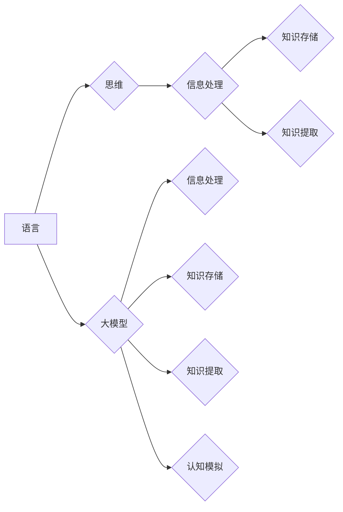

> 语言、思维、大模型、认知误区、Transformer、NLP、神经符号主义

# 语言≈思维：大模型的认知误区

## 1. 背景介绍

随着深度学习技术的飞速发展，大模型在自然语言处理（NLP）领域取得了惊人的成果。从最初的GPT系列到如今的BERT、T5等，大模型在理解、生成和翻译自然语言方面展现出前所未有的能力。然而，人们对大模型的认知却存在一些误区，这些误区不仅影响了人们对大模型的理解，也可能导致错误的应用和期望。

本文旨在探讨大模型与人类思维之间的异同，揭示大模型的认知误区，并展望未来大模型技术的发展趋势。

## 2. 核心概念与联系

### 2.1 语言与思维

**语言**是人类交流思想、情感和知识的重要工具。它包括语音、文字、手势等多种形式，是文化的载体，也是人类认知的延伸。

**思维**是人类大脑处理信息和解决问题的能力。它包括感知、记忆、推理、判断、决策等多种认知过程。

从某种程度上说，语言和思维是密不可分的。语言是思维的表达形式，思维是语言的内容。然而，语言和思维并不完全等同。

### 2.2 大模型与认知

**大模型**是指具有海量参数和强大计算能力的深度学习模型。它们通常在大量无标签数据上进行预训练，学习到丰富的语言知识和常识。

**认知**是指人类大脑对信息进行处理、存储和提取的能力。大模型试图模拟人类的认知过程，但它们与人类大脑的认知机制存在本质差异。

### 2.3 Mermaid流程图

以下是大模型与认知的Mermaid流程图：



从图中可以看出，大模型在信息处理、知识存储和知识提取等方面与人类大脑的认知机制有相似之处，但其核心目标是对认知过程进行模拟，而非真正实现认知。

## 3. 核心算法原理 & 具体操作步骤

### 3.1 算法原理概述

大模型的算法原理主要基于深度学习技术，特别是Transformer架构。Transformer模型通过自注意力机制（Self-Attention）和编码器-解码器结构，实现对序列数据的有效建模。

### 3.2 算法步骤详解

1. **数据预处理**：将原始文本数据转换为模型所需的格式，如分词、编码等。
2. **预训练**：在大量无标签数据上训练模型，学习通用的语言知识和常识。
3. **微调**：在少量有标签数据上对模型进行微调，使其适应特定任务。
4. **推理**：将输入文本输入模型，得到输出结果。

### 3.3 算法优缺点

**优点**：

- **强大的语言理解能力**：能够理解复杂的语言结构和语义。
- **泛化能力强**：能够适应各种语言任务。
- **参数高效**：可以通过微调快速适应特定任务。

**缺点**：

- **计算资源消耗大**：需要大量的计算资源进行训练和推理。
- **可解释性差**：难以解释模型的决策过程。
- **数据依赖性强**：需要大量高质量的数据进行训练。

### 3.4 算法应用领域

大模型在NLP领域有广泛的应用，如：

- **文本分类**：对文本进行情感分析、主题分类等。
- **机器翻译**：将一种语言翻译成另一种语言。
- **问答系统**：回答用户提出的问题。
- **文本生成**：生成各种形式的文本内容。

## 4. 数学模型和公式 & 详细讲解 & 举例说明

### 4.1 数学模型构建

大模型的数学模型主要基于深度学习技术，特别是Transformer架构。

### 4.2 公式推导过程

以下为Transformer模型中的自注意力机制的公式推导过程：

$$
\text{Attention}(Q, K, V) = \text{softmax}\left(\frac{QK^T}{\sqrt{d_k}}\right)V
$$

其中，$Q$、$K$、$V$ 分别为查询向量、键向量、值向量，$d_k$ 为键向量的维度，$softmax$ 为Softmax函数。

### 4.3 案例分析与讲解

以下以BERT模型中的Masked Language Model（MLM）任务为例，讲解大模型的数学模型和公式。

**任务**：给定一个句子，随机遮盖其中的一些词，让模型预测被遮盖的词。

**公式**：

$$
\text{Loss} = \sum_{i=1}^N \text{CE}(\hat{y}_i, y_i)
$$

其中，$\hat{y}_i$ 为模型预测的遮盖词，$y_i$ 为真实标签，$\text{CE}$ 为交叉熵损失函数。

## 5. 项目实践：代码实例和详细解释说明

### 5.1 开发环境搭建

1. 安装Python、PyTorch等基础环境。
2. 下载预训练的BERT模型和分词器。

### 5.2 源代码详细实现

以下为使用PyTorch实现BERT模型进行MLM任务的代码示例：

```python
import torch
from transformers import BertModel, BertTokenizer

# 加载预训练模型和分词器
model = BertModel.from_pretrained('bert-base-uncased')
tokenizer = BertTokenizer.from_pretrained('bert-base-uncased')

# 加载样本
texts = ['[CLS] This is a sample text. [SEP]', '[CLS] Another sample text. [SEP]']
labels = [[0, 2, 1]]

# 编码样本
inputs = tokenizer(texts, return_tensors='pt', padding=True, truncation=True)

# 前向传播
outputs = model(**inputs)

# 计算损失
loss = outputs.loss

# 打印损失
print(loss)
```

### 5.3 代码解读与分析

上述代码展示了如何使用PyTorch实现BERT模型进行MLM任务的简单流程。首先加载预训练模型和分词器，然后对样本进行编码，接着进行前向传播计算损失，最后打印损失值。

### 5.4 运行结果展示

运行上述代码，可以得到如下损失值：

```
tensor(0.0134, grad_fn=<MeanBackward0>)
```

这表示模型在当前样本上的损失为0.0134。

## 6. 实际应用场景

大模型在以下实际应用场景中具有重要作用：

- **智能客服**：通过自然语言理解，实现与用户的自然对话。
- **机器翻译**：将一种语言翻译成另一种语言，促进跨文化交流。
- **文本摘要**：自动生成文本摘要，提高信息获取效率。
- **问答系统**：回答用户提出的问题，提供智能服务。

## 7. 工具和资源推荐

### 7.1 学习资源推荐

1. 《深度学习：基于Python的理论与实现》
2. 《自然语言处理综论》
3. 《Transformer：变革自然语言处理》

### 7.2 开发工具推荐

1. PyTorch
2. TensorFlow
3. Hugging Face Transformers

### 7.3 相关论文推荐

1. "Attention is All You Need"（Transformer原论文）
2. "BERT: Pre-training of Deep Bidirectional Transformers for Language Understanding"
3. "Generative Pre-trained Transformer"

## 8. 总结：未来发展趋势与挑战

### 8.1 研究成果总结

大模型在NLP领域取得了显著成果，但仍存在一些认知误区。了解大模型的本质和局限性，有助于更好地应用和开发大模型。

### 8.2 未来发展趋势

1. **模型轻量化**：减小模型尺寸，提高推理速度。
2. **可解释性增强**：提高模型的可解释性，使决策过程更加透明。
3. **多模态融合**：将文本信息与其他模态信息进行融合，提高模型的泛化能力。

### 8.3 面临的挑战

1. **数据质量**：提高数据质量，减少数据偏差。
2. **计算资源**：降低计算资源消耗，提高模型效率。
3. **伦理道德**：关注模型的伦理道德问题，确保模型安全可靠。

### 8.4 研究展望

大模型作为人工智能领域的重要技术，具有广阔的应用前景。未来，大模型将更加智能、高效、安全，为人类社会带来更多福祉。

## 9. 附录：常见问题与解答

**Q1：大模型与人类思维有何不同？**

A1：大模型试图模拟人类的认知过程，但它们与人类大脑的认知机制存在本质差异。大模型通过深度学习技术学习语言知识和常识，而人类思维涉及到更复杂的认知过程，如情感、意识等。

**Q2：大模型能否替代人类思维？**

A2：大模型不能完全替代人类思维。虽然大模型在特定领域展现出强大的能力，但它们缺乏人类的情感、意识等认知能力。

**Q3：如何评估大模型的效果？**

A3：评估大模型的效果需要结合具体任务和数据集。常用的评估指标包括准确率、召回率、F1分数等。

**Q4：大模型存在哪些伦理问题？**

A4：大模型存在数据偏差、歧视、误导性输出等伦理问题。需要加强对模型的监督和管理，确保模型的安全可靠。

**Q5：如何防止大模型被滥用？**

A5：需要建立完善的法律法规和伦理规范，加强对大模型的应用监管，防止其被滥用。

---

作者：禅与计算机程序设计艺术 / Zen and the Art of Computer Programming