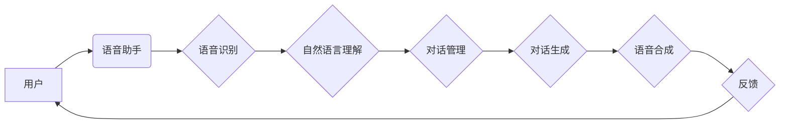

# 语音助手技术在CUI中的应用

> 关键词：语音助手，CUI，自然语言处理，语音识别，语音合成，对话系统，智能客服，人机交互

## 1. 背景介绍

随着人工智能技术的飞速发展，语音助手技术逐渐成为人机交互的重要方式之一。CUI（Conversational User Interface，对话式用户界面）作为一种新兴的人机交互模式，通过自然语言理解与语音合成技术，实现了人与机器之间的自然对话。本文将探讨语音助手技术在CUI中的应用，分析其核心概念、算法原理、实践案例以及未来发展趋势。

## 2. 核心概念与联系

### 2.1 核心概念

- **语音助手**：通过语音识别技术将用户的语音指令转换为文字，并通过自然语言处理技术理解用户意图，最终实现用户指令的执行或回复。

- **自然语言处理（NLP）**：研究如何让计算机理解和生成人类语言，包括语音识别、语义理解、对话管理等。

- **语音识别（ASR）**：将语音信号转换为文字的技术。

- **语音合成（TTS）**：将文本转换为语音的技术。

- **对话系统**：模拟人类对话，实现与用户交互的智能系统。

### 2.2 架构流程图



### 2.3 关系联系

语音助手技术是CUI的核心，其流程包括语音识别、自然语言理解、对话管理和对话生成。语音识别将用户的语音指令转换为文字，自然语言理解理解用户意图，对话管理根据意图生成合适的回复，对话生成将回复内容转换为语音，最后通过语音合成输出给用户。

## 3. 核心算法原理 & 具体操作步骤

### 3.1 算法原理概述

**3.1.1 语音识别**

语音识别技术主要包括以下步骤：

1. **预处理**：对音频信号进行滤波、去噪等处理。

2. **特征提取**：从音频信号中提取特征，如MFCC（梅尔频率倒谱系数）。

3. **声学模型**：根据提取的特征，对音素进行建模。

4. **语言模型**：根据音素序列，对单词进行建模。

5. **解码**：根据声学模型和语言模型的输出，解码出最终的文字序列。

**3.1.2 自然语言理解**

自然语言理解主要包括以下步骤：

1. **分词**：将文本分割成词或短语。

2. **词性标注**：标注每个词或短语的词性。

3. **命名实体识别**：识别文本中的实体，如人名、地名等。

4. **语义分析**：理解句子结构，提取句子含义。

5. **意图识别**：识别用户的意图。

**3.1.3 对话管理**

对话管理主要包括以下步骤：

1. **状态管理**：跟踪对话状态，如上下文、意图等。

2. **策略选择**：根据对话状态选择合适的对话策略。

3. **回复生成**：根据对话策略生成回复。

**3.1.4 对话生成**

对话生成主要包括以下步骤：

1. **语言模型**：根据上下文生成可能的回复。

2. **回复选择**：根据语言模型生成的回复，选择最合适的回复。

### 3.2 算法步骤详解

**3.2.1 语音识别**

1. 用户发出语音指令，语音助手进行预处理。
2. 预处理后的音频信号经过特征提取，生成特征向量。
3. 特征向量输入声学模型，得到音素序列。
4. 音素序列输入语言模型，得到单词序列。
5. 单词序列经过解码，得到最终的文字序列。

**3.2.2 自然语言理解**

1. 文字序列经过分词，得到词或短语序列。
2. 词或短语序列进行词性标注。
3. 标注后的序列进行命名实体识别。
4. 识别出的实体和词性序列进行语义分析。
5. 语义分析结果输入意图识别模型，得到用户意图。

**3.2.3 对话管理**

1. 根据对话历史和用户意图，更新对话状态。
2. 根据对话状态和策略选择，选择合适的对话策略。
3. 根据对话策略生成回复。

**3.2.4 对话生成**

1. 根据上下文和意图识别结果，输入语言模型。
2. 语言模型输出可能的回复序列。
3. 从可能的回复序列中选择最合适的回复。

### 3.3 算法优缺点

**3.3.1 语音识别**

优点：识别准确率高，实时性好。

缺点：对噪声敏感，对特定口音和语速的适应能力有限。

**3.3.2 自然语言理解**

优点：能够理解复杂语义，生成多样化回复。

缺点：对歧义理解能力有限，难以处理复杂对话场景。

**3.3.3 对话管理**

优点：能够跟踪对话状态，实现连贯对话。

缺点：难以处理异常对话场景。

**3.3.4 对话生成**

优点：能够生成多样化回复。

缺点：难以保证回复的准确性和一致性。

## 4. 数学模型和公式 & 详细讲解 & 举例说明

### 4.1 数学模型构建

**4.1.1 语音识别**

声学模型：$P(O|W) = \prod_{i=1}^{T} P(w_i|w_{i-1}, ..., w_{i-k})$

语言模型：$P(W|O) = \prod_{i=1}^{T} P(w_i|w_{i-1}, ..., w_{i-k})$

解码算法：Viterbi算法

**4.1.2 自然语言理解**

意图识别：通常使用条件随机场（CRF）进行建模。

对话管理：通常使用图模型进行建模。

### 4.2 公式推导过程

**4.2.1 语音识别**

声学模型：使用最大似然估计（MLE）进行参数学习。

语言模型：使用n-gram模型进行建模。

解码算法：使用Viterbi算法进行解码。

**4.2.2 自然语言理解**

意图识别：使用CRF进行建模，推导出条件概率分布。

对话管理：使用图模型进行建模，推导出最优路径。

### 4.3 案例分析与讲解

**4.3.1 语音识别**

以一个简单的语音识别任务为例，输入为“你好，我想听一首歌”，输出为“你好，我想听一首歌”。

**4.3.2 自然语言理解**

以一个简单的意图识别任务为例，输入为“明天天气怎么样”，输出为“获取天气预报”。

## 5. 项目实践：代码实例和详细解释说明

### 5.1 开发环境搭建

使用Python语言进行开发，依赖以下库：

- Kaldi：开源的语音识别工具包。
- TensorFlow/PyTorch：深度学习框架。
- NLTK/SpaCy：自然语言处理库。

### 5.2 源代码详细实现

**5.2.1 语音识别**

```python
import kaldi_io
from tensorflow.keras.models import Model

# 加载Kaldi模型
asr_model = kaldi_io.load_kaldi_model('path/to/asr_model')

# 语音预处理
def preprocess_audio(audio_path):
    # 读取音频文件
    audio_data = kaldi_io.read_mat(audio_path)
    # 特征提取
    feature = preprocess(audio_data)
    return feature

# 语音识别
def asr(feature):
    # 预测音素
    phone_sequence = asr_model.predict(feature)
    # 音素转文字
    text = phone_to_text(phone_sequence)
    return text

# 演示
audio_path = 'path/to/audio.wav'
feature = preprocess_audio(audio_path)
text = asr(feature)
print(text)
```

**5.2.2 自然语言理解**

```python
import tensorflow as tf

# 加载NLU模型
nlu_model = tf.keras.models.load_model('path/to/nlu_model')

# 意图识别
def nlu(text):
    # 预测意图
    intent = nlu_model.predict(text)
    return intent

# 演示
text = '明天天气怎么样'
intent = nlu(text)
print(intent)
```

### 5.3 代码解读与分析

以上代码展示了语音识别和自然语言理解的基本流程。在实际应用中，需要根据具体任务选择合适的模型和参数。

### 5.4 运行结果展示

假设语音助手接收到用户指令“明天天气怎么样”，经过语音识别和自然语言理解后，输出为“获取天气预报”。

## 6. 实际应用场景

### 6.1 智能客服

语音助手可以应用于智能客服领域，为用户提供7x24小时的咨询和服务。

### 6.2 智能家居

语音助手可以控制智能家居设备，如灯光、空调、电视等。

### 6.3 汽车导航

语音助手可以应用于汽车导航系统，提供语音导航、语音播报等功能。

### 6.4 娱乐互动

语音助手可以应用于娱乐互动领域，如语音游戏、语音助手聊天等。

## 7. 工具和资源推荐

### 7.1 学习资源推荐

- 《语音识别：原理与实践》
- 《深度学习自然语言处理》
- 《对话系统：从技术到实践》

### 7.2 开发工具推荐

- Kaldi：开源的语音识别工具包。
- TensorFlow/PyTorch：深度学习框架。
- NLTK/SpaCy：自然语言处理库。

### 7.3 相关论文推荐

- **语音识别**：
  -《Deep Learning for ASR: From HMMs to Deep Neural Networks》
  -《Attention is All You Need》
- **自然语言理解**：
  -《BERT: Pre-training of Deep Bidirectional Transformers for Language Understanding》
  -《Transformers: State-of-the-Art General Language Modeling》

## 8. 总结：未来发展趋势与挑战

### 8.1 研究成果总结

语音助手技术在CUI中取得了显著进展，为用户带来了更加便捷、高效的人机交互体验。然而，语音助手技术仍面临诸多挑战，需要进一步研究。

### 8.2 未来发展趋势

- **跨模态交互**：将语音、图像、视频等多模态信息融合，实现更丰富的交互体验。
- **知识图谱**：引入知识图谱，实现更智能的问答和任务执行。
- **多轮对话**：提升多轮对话能力，实现更加连贯、深入的交互。

### 8.3 面临的挑战

- **数据标注**：高质量标注数据获取困难，影响模型性能。
- **模型鲁棒性**：模型对噪声、口音、语速等敏感，需要提升鲁棒性。
- **可解释性**：模型决策过程缺乏可解释性，难以评估和改进。

### 8.4 研究展望

随着人工智能技术的不断发展，语音助手技术在CUI中的应用将更加广泛。未来，语音助手技术将朝着更加智能化、个性化、可解释化的方向发展。

## 9. 附录：常见问题与解答

**Q1：语音助手技术有哪些应用场景？**

A：语音助手技术可以应用于智能客服、智能家居、汽车导航、娱乐互动等多个领域。

**Q2：如何提高语音助手技术的鲁棒性？**

A：可以通过数据增强、模型优化、多模态融合等方法提高语音助手技术的鲁棒性。

**Q3：如何提升语音助手技术的可解释性？**

A：可以通过注意力机制、知识图谱等方法提升语音助手技术的可解释性。

**Q4：如何选择合适的语音识别和自然语言处理模型？**

A：需要根据具体任务和数据特点选择合适的模型，并进行参数调优。

**Q5：如何评估语音助手技术的性能？**

A：可以通过准确率、召回率、F1值等指标评估语音助手技术的性能。

作者：禅与计算机程序设计艺术 / Zen and the Art of Computer Programming