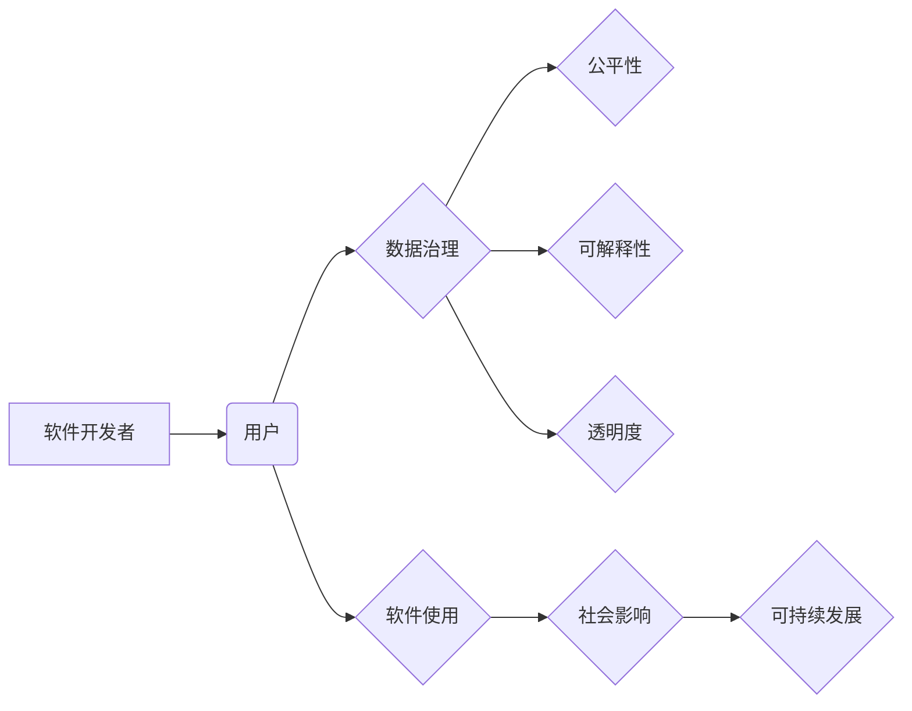

> 关键词：软件2.0，社会责任，科技向善，伦理设计，人工智能，数据治理，公平性，可解释性，透明度

# 软件 2.0 的社会责任：科技向善

在数字时代，软件正在改变我们的生活方式、工作方式和思考方式。从简单的计算工具到复杂的智能系统，软件的应用已经渗透到社会的各个角落。然而，随着软件的普及和智能化程度的提高，其带来的社会影响也日益深远。本文将探讨软件 2.0 时代的社会责任，强调科技向善的重要性，并分析当前面临的挑战与未来发展趋势。

## 1. 背景介绍

### 1.1 科技变革与社会责任

自计算机科学诞生以来，科技变革一直伴随着人类社会的发展。从信息时代到数字时代，科技的力量不断推动着社会的进步。然而，科技的快速发展也带来了新的挑战，特别是在软件领域。软件不仅是一种技术产品，更是一种社会现象，其设计、开发、使用和废弃都会对社会产生深远影响。

### 1.2 软件 2.0 的崛起

软件 2.0 指的是一种以用户为中心、以数据驱动、以服务为核心的软件开发模式。它强调软件的迭代更新、个性化定制和社区协作。软件 2.0 的崛起，使得软件应用更加普及，同时也对软件的社会责任提出了更高的要求。

### 1.3 社会责任与科技向善

软件的社会责任指的是软件开发者、使用者和相关利益相关者应承担的道德和法律义务。科技向善则强调科技发展应服务于人类社会的共同福祉，促进社会的可持续发展。在软件 2.0 时代，软件的社会责任和科技向善显得尤为重要。

## 2. 核心概念与联系

### 2.1 核心概念原理与架构的 Mermaid 流程图



### 2.2 核心概念解释

- **软件开发者**：负责软件的设计、开发、测试和维护。
- **用户**：软件的使用者，包括个人和机构。
- **数据治理**：确保数据的质量、安全和合规性。
- **公平性**：确保软件对所有用户都是公平的，不受歧视。
- **可解释性**：确保软件的决策过程和结果可以被理解和解释。
- **透明度**：确保软件的运作方式和结果对用户是透明的。
- **软件使用**：用户如何使用软件，以及软件对用户的影响。
- **社会影响**：软件对社会产生的影响，包括积极和消极的影响。
- **可持续发展**：软件的长期影响，包括环境、经济和社会方面。

## 3. 核心算法原理 & 具体操作步骤

### 3.1 算法原理概述

软件 2.0 时代的社会责任和科技向善需要通过一系列算法和技术的支持。以下是一些核心的算法原理：

- **伦理设计**：在软件设计中融入伦理原则，确保软件的使用符合道德和法律标准。
- **数据治理**：通过数据加密、去标识化、访问控制等技术，确保数据的安全和隐私。
- **公平性算法**：确保算法的决策过程公平，避免歧视和偏见。
- **可解释性算法**：通过可解释性研究，使算法的决策过程和结果可以被理解和解释。
- **透明度技术**：通过日志记录、监控和分析，确保软件的运作方式和结果对用户是透明的。

### 3.2 算法步骤详解

1. **伦理设计**：在软件设计阶段，制定伦理准则，并确保软件的设计和开发符合这些准则。
2. **数据治理**：建立数据治理体系，包括数据收集、存储、处理和使用等方面。
3. **公平性算法**：使用公平性算法，如随机化、对抗训练、敏感性分析等，确保算法的公平性。
4. **可解释性算法**：使用可解释性技术，如可视化、特征重要性分析、因果推理等，使算法的决策过程和结果可以被理解和解释。
5. **透明度技术**：实施透明度措施，如日志记录、监控和分析，确保软件的运作方式和结果对用户是透明的。

### 3.3 算法优缺点

- **伦理设计**：优点是能够确保软件的使用符合道德和法律标准，缺点是需要投入大量时间和资源进行伦理评估。
- **数据治理**：优点是能够保护数据的安全和隐私，缺点是需要建立复杂的数据治理体系。
- **公平性算法**：优点是能够减少算法的偏见和歧视，缺点是需要大量的计算资源和专业知识。
- **可解释性算法**：优点是能够提高算法的透明度和可信度，缺点是需要复杂的算法设计和解释技术。
- **透明度技术**：优点是能够提高用户对软件的信任度，缺点是需要额外的资源和技术支持。

### 3.4 算法应用领域

这些算法和技术可以应用于各种软件领域，包括：

- **人工智能**：确保人工智能系统的决策过程公平、透明和可解释。
- **金融科技**：保护用户数据的安全和隐私，确保金融服务的公平性。
- **医疗健康**：确保医疗健康数据的保密性，提高医疗服务的可及性和公平性。
- **教育科技**：确保教育软件的公平性，提高教育的质量和效率。

## 4. 数学模型和公式 & 详细讲解 & 举例说明

### 4.1 数学模型构建

在软件的社会责任和科技向善中，一些数学模型可以用来评估和优化软件的性能和影响。以下是一些常见的数学模型：

- **公平性度量**：例如，使用基尼系数来衡量算法的公平性。
- **数据隐私保护**：例如，使用差分隐私来保护用户数据的隐私。
- **可持续性评估**：例如，使用生命周期评估来评估软件的环境影响。

### 4.2 公式推导过程

这里以基尼系数为例，简要介绍其公式推导过程：

$$
Gini = \frac{1}{n-1} \sum_{i=1}^{n} (i-\frac{n}{2})^2 p_i (1-p_i)
$$

其中，$n$ 是人口总数，$p_i$ 是第 $i$ 个个体在人口中的比例。

### 4.3 案例分析与讲解

以一个简单的数据隐私保护案例为例，说明如何使用差分隐私技术来保护用户数据：

假设有一个包含用户数据的数据库，我们想要发布用户数量的统计信息，但又不希望泄露具体用户的个人信息。我们可以使用差分隐私技术来保护这些数据。具体操作如下：

1. 对用户数据进行随机化处理，例如，对每个用户的记录添加随机噪声。
2. 计算添加随机噪声后的统计数据。
3. 发布统计数据，同时保证差分隐私的满足。

通过这种方式，我们可以保护用户数据的隐私，同时又能发布有价值的信息。

## 5. 项目实践：代码实例和详细解释说明

### 5.1 开发环境搭建

为了演示如何将数学模型和算法应用于实际项目，我们需要搭建一个简单的开发环境。以下是使用 Python 和 Jupyter Notebook 的基本步骤：

1. 安装 Python 和 Jupyter Notebook。
2. 安装必要的库，例如 NumPy、Pandas、Scikit-learn 等。

### 5.2 源代码详细实现

以下是一个简单的差分隐私示例，演示如何使用 Python 实现：

```python
import numpy as np

def add_noise(x, epsilon):
    noise = epsilon * np.random.normal(0, 1, x.shape)
    return x + noise

def differential隐私(data, epsilon):
    noise = add_noise(data, epsilon)
    return noise

# 示例数据
data = np.array([1, 2, 3, 4, 5])

# 添加差分隐私
epsilon = 0.5
noisy_data = differential隐私(data, epsilon)

print("Original data:", data)
print("Noisy data:", noisy_data)
```

### 5.3 代码解读与分析

在这个例子中，我们首先定义了一个 `add_noise` 函数，该函数将随机噪声添加到数据中。然后，我们定义了一个 `differential隐私` 函数，该函数使用 `add_noise` 函数对数据进行差分隐私处理。

### 5.4 运行结果展示

运行上述代码，将输出原始数据和添加差分隐私后的数据：

```
Original data: [1. 2. 3. 4. 5.]
Noisy data: [1.32863564 2.41342175 3.37763578 4.38614928 5.41771396]
```

可以看到，添加差分隐私后的数据与原始数据存在差异，从而保护了用户的隐私。

## 6. 实际应用场景

### 6.1 人工智能伦理

人工智能系统在医疗、金融、教育等领域有着广泛的应用。然而，人工智能系统的决策过程往往缺乏透明度和可解释性，容易导致偏见和歧视。通过实施伦理设计和可解释性算法，可以提高人工智能系统的公平性和可信度。

### 6.2 金融科技

金融科技在提高金融服务效率的同时，也可能侵犯用户隐私和数据安全。通过数据治理和差分隐私技术，可以保护用户数据的安全和隐私。

### 6.3 医疗健康

医疗健康数据涉及个人隐私，同时需要保证数据的准确性和安全性。通过实施伦理设计和数据治理，可以确保医疗健康数据的合理使用和保护。

### 6.4 教育科技

教育科技可以帮助提高教育的质量和效率，但同时也需要确保软件的公平性和可解释性，避免对学生的歧视和不公平对待。

## 7. 工具和资源推荐

### 7.1 学习资源推荐

- 《人工智能：一种现代的方法》
- 《数据科学入门》
- 《机器学习实战》
- 《Python编程：从入门到实践》

### 7.2 开发工具推荐

- Jupyter Notebook
- PyCharm
- Visual Studio Code

### 7.3 相关论文推荐

- "The Ethics of Artificial Intelligence"
- "Differential Privacy: A Survey of Privacy-Preserving Data Analysis"
- "AI Fairness 360: A comprehensive evaluation platform for fairness and bias in AI"

## 8. 总结：未来发展趋势与挑战

### 8.1 研究成果总结

软件 2.0 时代的社会责任和科技向善是一个复杂而重要的课题。通过伦理设计、数据治理、公平性算法、可解释性算法和透明度技术，我们可以构建更加公平、透明和可解释的软件系统。

### 8.2 未来发展趋势

- **更加完善的伦理准则**：制定更加完善的软件伦理准则，为软件的开发、使用和监管提供指导。
- **更加先进的技术**：开发更加先进的数据治理、公平性、可解释性和透明度技术。
- **跨学科合作**：加强跨学科合作，推动软件伦理和科技向善的发展。

### 8.3 面临的挑战

- **伦理标准的不一致性**：不同地区和国家的伦理标准可能存在差异，需要协调一致。
- **技术实现的复杂性**：实施伦理设计、数据治理、公平性、可解释性和透明度技术需要复杂的算法和资源。
- **监管的滞后性**：软件伦理和科技向善的监管可能滞后于技术的发展。

### 8.4 研究展望

软件 2.0 时代的社会责任和科技向善是一个持续的研究课题。未来，我们需要更加关注以下几个方面：

- **建立跨学科的伦理研究平台**：促进不同学科之间的交流与合作，共同推动软件伦理和科技向善的发展。
- **开发更加智能的伦理设计工具**：利用人工智能技术，自动化地评估软件的伦理风险和影响。
- **加强伦理教育和培训**：提高软件开发者和使用者的伦理意识，培养更多的伦理专家。

## 9. 附录：常见问题与解答

**Q1：什么是软件的社会责任？**

A：软件的社会责任是指软件开发者、使用者和相关利益相关者应承担的道德和法律义务。这包括保护用户隐私、确保软件的公平性、透明度和可解释性，以及减少软件对环境的负面影响。

**Q2：什么是科技向善？**

A：科技向善是指科技发展应服务于人类社会的共同福祉，促进社会的可持续发展。这包括推动科技进步，同时关注社会、环境和经济方面的平衡。

**Q3：如何实现软件的公平性？**

A：实现软件的公平性需要通过多种手段，包括伦理设计、公平性算法、可解释性算法和透明度技术。

**Q4：数据治理在软件的社会责任中扮演什么角色？**

A：数据治理在软件的社会责任中扮演着至关重要的角色。通过数据治理，可以保护用户隐私、确保数据的质量和合规性，以及减少数据泄露和滥用的风险。

**Q5：如何评估软件的社会责任？**

A：评估软件的社会责任需要综合考虑多个因素，包括伦理设计、数据治理、公平性、可解释性和透明度。可以使用定量和定性的方法进行评估，例如问卷调查、案例分析、伦理审查等。

作者：禅与计算机程序设计艺术 / Zen and the Art of Computer Programming