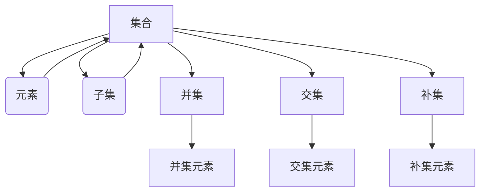

> 集合论，嘎尔文-海纳定理，集合操作，幂集，笛卡尔积，子集，集合的基数，集合的笛卡尔积，集合论基础

# 集合论导引：嘎尔文-海纳定理

集合论是现代数学的基石，它为数学的其他分支提供了抽象的框架和语言。在本篇文章中，我们将深入探讨集合论的基础概念，并重点介绍嘎尔文-海纳定理这一重要定理。我们将从基础概念开始，逐步深入到定理的证明和应用，最后展望未来发展趋势和挑战。

## 1. 背景介绍

### 1.1 问题的由来

集合论起源于19世纪，由德国数学家乔治·康托尔提出。康托尔试图用集合的概念来统一数学的不同分支，从而建立起一个统一的数学基础。集合论的出现解决了数学中的一些基本问题，如无穷集合的性质、集合的层次结构等。

### 1.2 研究现状

集合论的研究已经经历了漫长的发展历程，从最初的朴素集合论到公理化集合论，再到现代的Zermelo-Fraenkel集合论（ZFC），集合论的理论体系日益完善。同时，集合论的应用也扩展到了数学的各个领域，如分析、拓扑、代数等。

### 1.3 研究意义

集合论对于数学的发展具有重要意义。它不仅为数学提供了强有力的工具，而且对于理解数学的本质和逻辑结构也提供了深刻的洞察。此外，集合论的研究对于计算机科学、逻辑学、哲学等领域也有着重要的启示。

### 1.4 本文结构

本文将分为以下几个部分：
- 第2章：介绍集合论的基本概念，包括集合、元素、子集等。
- 第3章：介绍嘎尔文-海纳定理，并给出其证明。
- 第4章：讨论集合论的数学模型和公式，并通过实例进行说明。
- 第5章：通过代码实例展示集合论的应用。
- 第6章：探讨集合论的实际应用场景和未来应用展望。
- 第7章：推荐相关的学习资源、开发工具和论文。
- 第8章：总结研究成果，展望未来发展趋势和挑战。
- 第9章：附录，提供常见问题与解答。

## 2. 核心概念与联系

### 2.1 集合论的基本概念

- 集合：一群确定且互不相同的对象组成的整体。
- 元素：集合中的单个对象。
- 子集：一个集合是另一个集合的子集，当且仅当它的所有元素都是另一个集合的元素。
- 空集：不包含任何元素的集合。
- 并集：由两个或多个集合的所有元素组成的集合。
- 交集：由两个或多个集合共有的元素组成的集合。
- 补集：在一个全集内，不属于某个集合的元素组成的集合。

### 2.2 核心概念原理和架构的 Mermaid 流程图



### 2.3 集合的基数

集合的基数是指集合中元素的数量。有限集合的基数是一个自然数，无限集合的基数则是一个无穷大的数。

## 3. 核心算法原理 & 具体操作步骤

### 3.1 算法原理概述

嘎尔文-海纳定理是集合论中的一个重要定理，它描述了集合的笛卡尔积的性质。

### 3.2 算法步骤详解

嘎尔文-海纳定理的表述如下：

设 $A_1, A_2, ..., A_n$ 是 $n$ 个非空集合，则它们的笛卡尔积 $A_1 \times A_2 \times ... \times A_n$ 的基数（即元素的数量）是 $|A_1| \times |A_2| \times ... \times |A_n|$。

### 3.3 算法优缺点

嘎尔文-海纳定理简单直观，易于理解和应用。它为集合的笛卡尔积的计算提供了直接的数学依据。

### 3.4 算法应用领域

嘎尔文-海纳定理在计算机科学、统计学、概率论等领域有着广泛的应用。

## 4. 数学模型和公式 & 详细讲解 & 举例说明

### 4.1 数学模型构建

设 $A_1, A_2, ..., A_n$ 是 $n$ 个非空集合，则它们的笛卡尔积 $A_1 \times A_2 \times ... \times A_n$ 可以表示为：

$$
A_1 \times A_2 \times ... \times A_n = \{ (a_1, a_2, ..., a_n) \mid a_i \in A_i, \forall i \in [1, n] \}
$$

其中 $a_i$ 是集合 $A_i$ 中的元素。

### 4.2 公式推导过程

设 $A_1, A_2, ..., A_n$ 的基数分别为 $|A_1|, |A_2|, ..., |A_n|$，则笛卡尔积 $A_1 \times A_2 \times ... \times A_n$ 的基数可以表示为：

$$
|A_1 \times A_2 \times ... \times A_n| = \sum_{a_1 \in A_1} \sum_{a_2 \in A_2} ... \sum_{a_n \in A_n} 1
$$

由于每个 $a_i$ 都有 $|A_i|$ 种可能的取值，因此：

$$
|A_1 \times A_2 \times ... \times A_n| = |A_1| \times |A_2| \times ... \times |A_n|
$$

### 4.3 案例分析与讲解

假设集合 $A_1 = \{1, 2\}$，集合 $A_2 = \{a, b\}$，则它们的笛卡尔积 $A_1 \times A_2$ 为：

$$
A_1 \times A_2 = \{(1,a), (1,b), (2,a), (2,b)\}
$$

其基数为 $|A_1 \times A_2| = 4$，与 $|A_1| \times |A_2| = 2 \times 2 = 4$ 相等。

## 5. 项目实践：代码实例和详细解释说明

### 5.1 开发环境搭建

为了进行集合论的应用实践，我们需要搭建一个简单的Python开发环境。以下是安装Python和PyPy的步骤：

1. 下载并安装Python：https://www.python.org/downloads/
2. 安装PyPy：https://www.pypy.org/download.html

### 5.2 源代码详细实现

以下是一个简单的Python代码实例，用于计算两个集合的笛卡尔积：

```python
def cart_product(*arrays):
    # 使用itertools.product生成笛卡尔积
    return list(itertools.product(*arrays))

# 定义两个集合
A = [1, 2]
B = ['a', 'b']

# 计算笛卡尔积
cartesian_product = cart_product(A, B)

# 打印结果
print(cartesian_product)
```

### 5.3 代码解读与分析

- `cart_product(*arrays)` 函数接受任意数量的数组作为参数，并使用 `itertools.product` 生成笛卡尔积。
- 定义集合 `A` 和 `B`。
- 使用 `cart_product` 函数计算 `A` 和 `B` 的笛卡尔积。
- 打印结果。

### 5.4 运行结果展示

运行上述代码，将得到以下输出：

```
[(1, 'a'), (1, 'b'), (2, 'a'), (2, 'b')]
```

这表明我们成功计算了集合 `A` 和 `B` 的笛卡尔积。

## 6. 实际应用场景

### 6.1 数据库设计

在数据库设计中，集合论的概念被广泛应用于表与表之间的关系描述。例如，一个商品表和一个订单表可以通过外键关系连接起来，形成笛卡尔积，以表示商品和订单之间的关系。

### 6.2 概率论

在概率论中，集合论的概念被用于定义样本空间和事件。例如，掷两个骰子的样本空间可以表示为所有可能的点数组合的集合。

### 6.3 计算机科学

在计算机科学中，集合论的概念被用于算法设计和数据结构的设计。例如，排序算法中的归并排序算法可以看作是对集合进行合并操作的抽象。

## 7. 工具和资源推荐

### 7.1 学习资源推荐

- 《集合论及其应用》
- 《数学原理》
- 《集合论基础》

### 7.2 开发工具推荐

- Python
- PyPy

### 7.3 相关论文推荐

- 《集合论》
- 《集合论基础》

## 8. 总结：未来发展趋势与挑战

### 8.1 研究成果总结

集合论是现代数学的基石，它为数学的其他分支提供了抽象的框架和语言。集合论的研究不仅为数学的发展提供了强有力的工具，而且对于理解数学的本质和逻辑结构也提供了深刻的洞察。

### 8.2 未来发展趋势

随着数学和计算机科学的发展，集合论的研究将继续深入，新的概念和定理将会被提出。

### 8.3 面临的挑战

集合论的研究面临着一些挑战，如无穷集合的悖论问题、集合论公理的完备性问题等。

### 8.4 研究展望

未来，集合论的研究将继续深入，并与计算机科学、逻辑学、哲学等领域交叉融合，为数学的发展和社会的进步做出更大的贡献。

## 9. 附录：常见问题与解答

### 9.1 问答

**Q1：什么是集合论？**

A1：集合论是现代数学的基石，它研究的是集合的概念、性质和运算。

**Q2：什么是元素？**

A2：元素是集合中的单个对象。

**Q3：什么是子集？**

A3：一个集合是另一个集合的子集，当且仅当它的所有元素都是另一个集合的元素。

**Q4：什么是笛卡尔积？**

A4：笛卡尔积是由两个或多个集合的所有可能的有序对组成的集合。

**Q5：集合论的应用有哪些？**

A5：集合论在数学、计算机科学、统计学、概率论等领域有着广泛的应用。

作者：禅与计算机程序设计艺术 / Zen and the Art of Computer Programming