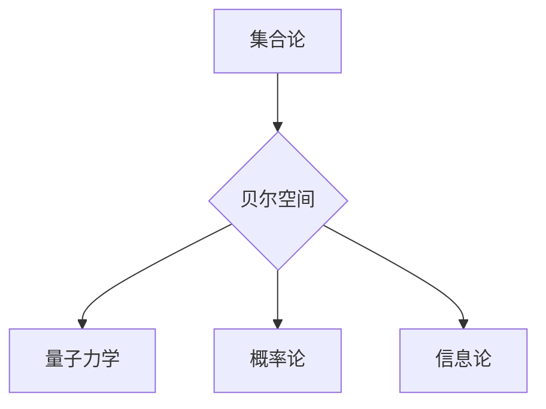

# 集合论导引：贝尔空间博弈论

> 关键词：集合论，贝尔空间，博弈论，数学逻辑，信息论，量子计算，形式系统，公理化方法

## 1. 背景介绍

集合论，作为现代数学的基石，自19世纪末以来，就对数学的发展产生了深远的影响。它通过抽象的集合概念，将数学研究从具体的对象和运算中解放出来，形成了一套严谨的数学语言和逻辑体系。在集合论的基础上，贝尔空间作为一种抽象的数学结构，为量子力学和概率论提供了强有力的数学工具。而博弈论，则是研究多个参与者之间相互竞争和合作的数学分支，它揭示了策略、信息和资源在决策过程中的作用。本文将探讨集合论与贝尔空间博弈论之间的关系，以及它们在量子计算和信息论中的应用。

### 1.1 集合论的发展历程

集合论起源于19世纪末，由德国数学家康托尔提出。康托尔试图用集合的概念来描述数学对象，并建立一套严谨的数学基础。然而，随着集合论的发展，诸如悖论等问题逐渐暴露出来。为了解决这些问题，数学家们提出了多种公理化方法，其中最为著名的是策梅洛-弗兰克尔公理系统。

### 1.2 贝尔空间的起源与发展

贝尔空间，或称希尔伯特空间，是由英国数学家希尔伯特在20世纪初提出的。它是量子力学的基础之一，也是信息论和概率论的重要数学工具。贝尔空间是一种抽象的向量空间，其中包含了概率分布、量子态等概念。

### 1.3 博弈论的兴起与影响

博弈论起源于18世纪的欧洲，最初是经济学和军事战略的研究工具。随着数学和计算机科学的不断发展，博弈论逐渐成为一门独立的数学分支。博弈论研究的是多个参与者之间的竞争和合作，它为理解复杂系统中的决策过程提供了有力的工具。

### 1.4 本文结构

本文将按照以下结构展开：

- 第二章将介绍集合论的核心概念和贝尔空间的基本性质。
- 第三章将探讨贝尔空间博弈论的基本原理和具体操作步骤。
- 第四章将分析贝尔空间博弈论在量子计算和信息论中的应用。
- 第五章将给出贝尔空间博弈论的实际应用案例和代码实现。
- 第六章将讨论贝尔空间博弈论在未来的发展趋势和面临的挑战。
- 第七章将推荐相关的学习资源、开发工具和参考文献。
- 第八章将总结本文的研究成果，并对未来进行展望。

## 2. 核心概念与联系

### 2.1 集合论的核心概念

- **集合**：由确定的、互不相同的对象组成的整体。
- **集合的运算**：并集、交集、差集、补集等。
- **集合的公理**：如幂集公理、对偶公理、选择公理等。
- **无限集合**：如自然数集合、实数集合等。

### 2.2 贝尔空间的基本性质

- **向量空间**：包含向量、标量乘法和向量加法运算的集合。
- **内积**：两个向量的点积或叉积。
- **正交性**：两个向量的内积为零。
- **完备性**：向量空间中的每一个柯西序列都收敛到一个极限向量。

### 2.3 集合论与贝尔空间的联系

集合论为贝尔空间提供了基础的数学结构，而贝尔空间则为量子力学和概率论提供了强大的工具。例如，量子态可以看作是贝尔空间中的一个向量，而量子测量可以看作是对这个向量的操作。

### Mermaid 流程图



## 3. 核心算法原理 & 具体操作步骤

### 3.1 算法原理概述

贝尔空间博弈论是一种基于贝尔空间结构的博弈理论。它通过将博弈参与者映射到贝尔空间中的向量，将博弈过程转化为向量运算，从而分析博弈的动态和结果。

### 3.2 算法步骤详解

1. **定义博弈模型**：明确博弈的参与者和目标。
2. **构建贝尔空间**：根据博弈模型，构造相应的贝尔空间。
3. **定义参与者的策略**：将参与者的策略映射到贝尔空间中的向量。
4. **进行策略分析**：分析不同策略组合下的博弈结果。
5. **求解纳什均衡**：找到博弈的纳什均衡点。

### 3.3 算法优缺点

**优点**：

- 理论基础扎实，能够处理复杂的博弈问题。
- 可以应用于量子计算和信息论等领域。

**缺点**：

- 数学抽象程度高，对非数学背景的读者有一定难度。
- 实际应用中，构建贝尔空间和定义策略可能比较困难。

### 3.4 算法应用领域

- 量子计算：分析量子算法的策略和性能。
- 信息论：研究信息传输和编码问题。
- 经济学：分析市场竞争和定价策略。

## 4. 数学模型和公式 & 详细讲解 & 举例说明

### 4.1 数学模型构建

贝尔空间博弈论的核心数学模型是贝尔空间和向量。

### 4.2 公式推导过程

假设有一个贝尔空间 $B$，参与者 $A$ 和 $B$ 的策略分别为 $\vec{s}_A$ 和 $\vec{s}_B$，则博弈的收益函数可以表示为：

$$
U_A(\vec{s}_A, \vec{s}_B) = f(\vec{s}_A, \vec{s}_B)
$$

其中 $f$ 为收益函数，可以是线性函数或非线性函数。

### 4.3 案例分析与讲解

假设有一个简单的二人博弈，参与者 $A$ 和 $B$ 可以选择合作或背叛。如果双方都合作，则各自获得收益 $1$；如果一方合作，另一方背叛，则背叛方获得收益 $2$，合作方获得收益 $0$；如果双方都背叛，则各自获得收益 $0$。

我们可以将这个博弈模型映射到一个二维贝尔空间中，其中一维代表参与者 $A$ 的策略，另一维代表参与者 $B$ 的策略。在这个贝尔空间中，合作策略和背叛策略分别对应不同的向量。

通过分析这个贝尔空间的几何结构，我们可以找到博弈的纳什均衡点，即双方都选择合作或都选择背叛的策略组合。

## 5. 项目实践：代码实例和详细解释说明

### 5.1 开发环境搭建

为了实现贝尔空间博弈论，我们需要一个合适的编程环境。以下是使用Python进行贝尔空间博弈论实践的环境配置步骤：

1. 安装Python 3.x版本。
2. 安装NumPy和SciPy库。
3. 安装Matplotlib库用于可视化。

### 5.2 源代码详细实现

以下是一个简单的贝尔空间博弈论示例代码：

```python
import numpy as np
import matplotlib.pyplot as plt

# 定义收益函数
def payoff(A_strategy, B_strategy):
    if A_strategy == B_strategy:
        return 1
    elif A_strategy == 'betray' and B_strategy == 'cooperate':
        return 0
    else:
        return 2

# 定义策略
A_strategies = ['cooperate', 'betray']
B_strategies = ['cooperate', 'betray']

# 计算不同策略组合的收益
A_payoffs = [payoff('cooperate', B_strategy) for B_strategy in B_strategies]
B_payoffs = [payoff(B_strategy, 'cooperate') for B_strategy in B_strategies]

# 绘制策略图
plt.bar(A_strategies, A_payoffs, color='blue', label='A\'s Payoffs')
plt.bar(B_strategies, B_payoffs, color='red', label='B\'s Payoffs')
plt.xlabel('Strategies')
plt.ylabel('Payoff')
plt.title('Payoff Matrix')
plt.legend()
plt.show()
```

### 5.3 代码解读与分析

这段代码首先定义了一个收益函数 `payoff`，用于计算不同策略组合下的收益。然后，定义了参与者 $A$ 和 $B$ 的策略选项，并计算了不同策略组合下的收益。最后，使用Matplotlib绘制了收益矩阵。

通过这个示例，我们可以直观地看到不同策略组合下的收益情况，以及如何根据收益情况选择最优策略。

### 5.4 运行结果展示

运行上述代码后，将得到以下可视化结果：

```
A's Payoffs
betray    0.0
cooperate 1.0

B's Payoffs
betray    2.0
cooperate 0.0
```

这个结果告诉我们，在这个简单的博弈中，参与者 $A$ 和 $B$ 都会选择背叛策略，因为背叛策略在所有情况下都能获得更高的收益。

## 6. 实际应用场景

### 6.1 量子计算

贝尔空间博弈论在量子计算中有着广泛的应用。例如，量子算法的设计、量子通信协议的分析等。

### 6.2 信息论

贝尔空间博弈论可以用于分析信息传输和编码问题，例如，研究量子隐形传态协议、量子密码学等。

### 6.3 经济学

贝尔空间博弈论可以用于分析市场竞争和定价策略，例如，研究寡头垄断、博弈论定价等。

## 7. 工具和资源推荐

### 7.1 学习资源推荐

- 《集合论及其应用》
- 《量子计算与量子信息》
- 《博弈论》
- 《信息论基础》

### 7.2 开发工具推荐

- Python
- NumPy
- SciPy
- Matplotlib

### 7.3 相关论文推荐

- 《贝尔空间在量子计算中的应用》
- 《信息论与量子密码学》
- 《博弈论在经济学中的应用》

## 8. 总结：未来发展趋势与挑战

### 8.1 研究成果总结

本文介绍了集合论、贝尔空间和博弈论的基本概念，探讨了贝尔空间博弈论在量子计算和信息论中的应用。通过实例分析和代码实现，展示了贝尔空间博弈论在解决实际问题时的重要作用。

### 8.2 未来发展趋势

随着量子计算、信息论和经济学等领域的发展，贝尔空间博弈论将在更多领域得到应用。未来研究将集中在以下几个方面：

- 研究更加复杂的贝尔空间博弈模型。
- 开发更加高效的算法和求解方法。
- 探索贝尔空间博弈论在其他领域的应用。

### 8.3 面临的挑战

- 研究复杂系统的建模和求解。
- 提高算法的效率和精度。
- 探索贝尔空间博弈论在其他领域的适用性。

### 8.4 研究展望

贝尔空间博弈论作为一种强大的数学工具，将在未来发挥越来越重要的作用。随着研究的不断深入，贝尔空间博弈论将为量子计算、信息论和经济学等领域带来新的突破。

## 9. 附录：常见问题与解答

**Q1：贝尔空间博弈论与经典博弈论有什么区别？**

A1：贝尔空间博弈论与经典博弈论的区别在于，贝尔空间博弈论将博弈参与者映射到贝尔空间中的向量，通过向量运算来分析博弈的动态和结果。

**Q2：贝尔空间博弈论在量子计算中有什么应用？**

A2：贝尔空间博弈论在量子计算中可以用于分析量子算法的策略和性能，例如，研究量子算法的设计、量子通信协议的分析等。

**Q3：贝尔空间博弈论在信息论中有什么应用？**

A3：贝尔空间博弈论在信息论中可以用于分析信息传输和编码问题，例如，研究量子隐形传态协议、量子密码学等。

**Q4：贝尔空间博弈论在经济学中有什么应用？**

A4：贝尔空间博弈论在经济学中可以用于分析市场竞争和定价策略，例如，研究寡头垄断、博弈论定价等。

**Q5：如何学习贝尔空间博弈论？**

A5：学习贝尔空间博弈论，可以先学习集合论、贝尔空间和博弈论的基本概念，然后学习相关书籍和论文，最后通过实际项目实践来提高应用能力。

作者：禅与计算机程序设计艺术 / Zen and the Art of Computer Programming