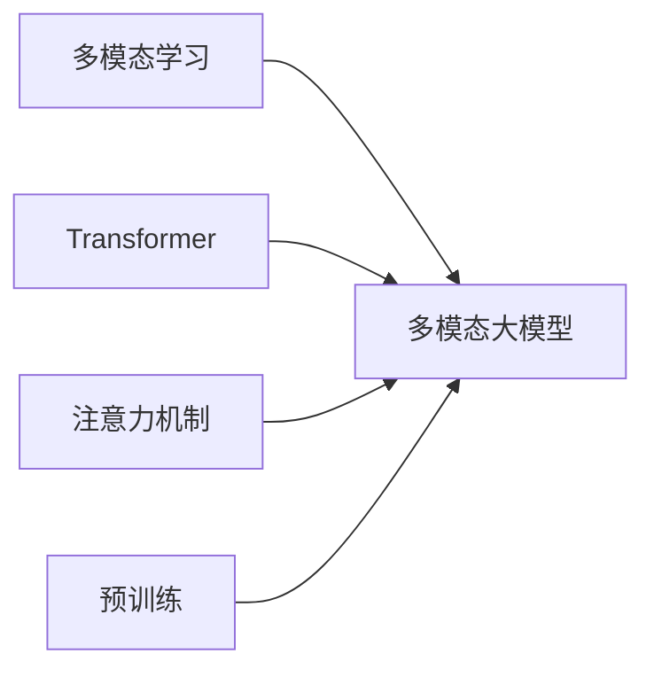

# 多模态大模型：技术原理与实战 如何提高长文本阅读能力

关键词：多模态大模型、长文本阅读、自然语言处理、深度学习、Transformer、注意力机制

## 1. 背景介绍
### 1.1  问题的由来
随着人工智能技术的飞速发展，自然语言处理(NLP)领域取得了巨大的进步。传统的NLP模型主要专注于文本数据的处理和分析，但现实世界中的信息往往以多种模态形式存在，如文本、图像、音频和视频等。为了更好地理解和处理这些多模态信息，多模态大模型应运而生。

多模态大模型是一种能够同时处理多种模态数据的深度学习模型，它可以学习不同模态之间的关联和互补信息，从而提高模型的理解和生成能力。特别是在长文本阅读理解任务中，多模态大模型展现出了巨大的潜力和优势。

### 1.2  研究现状
目前，多模态大模型已经在学术界和工业界得到了广泛的关注和应用。一些代表性的多模态大模型包括：

- ViLBERT：由Facebook AI研究院提出，通过共享的Transformer编码器学习文本和图像之间的关联[1]。
- LXMERT：由华盛顿大学和艾伦人工智能研究所联合提出，利用两个独立的Transformer编码器分别处理文本和图像，并通过交叉注意力机制实现多模态融合[2]。
- UNITER：由微软亚洲研究院提出，采用统一的Transformer编码器同时处理文本和图像，并引入了被遮挡的语言模型和图像-文本匹配任务进行预训练[3]。

这些多模态大模型在视觉问答、图像描述、视觉推理等任务上取得了显著的性能提升，展现出了多模态学习的巨大潜力。

### 1.3  研究意义
多模态大模型在长文本阅读理解任务中具有重要的研究意义：

1. 提高模型的理解能力：通过融合文本和图像等多模态信息，模型可以更全面、准确地理解文本内容，特别是对于一些抽象或复杂的概念。
2. 增强模型的泛化能力：多模态学习可以帮助模型学习到更加通用的表示，从而提高模型在新任务和新领域上的适应能力。
3. 拓展应用场景：多模态大模型可以应用于更加广泛的场景，如医疗诊断、金融风控、智能客服等，为这些领域带来新的解决方案和价值。

### 1.4  本文结构
本文将从以下几个方面对多模态大模型在长文本阅读理解任务中的技术原理和实战进行详细阐述：

1. 核心概念与联系
2. 核心算法原理与具体操作步骤
3. 数学模型和公式详细讲解与举例说明
4. 项目实践：代码实例和详细解释说明
5. 实际应用场景
6. 工具和资源推荐
7. 总结：未来发展趋势与挑战
8. 附录：常见问题与解答

## 2. 核心概念与联系
在多模态大模型中，有几个核心概念需要了解：

- 多模态学习：指同时处理和融合多种模态数据（如文本、图像、音频等）的机器学习方法。
- Transformer：一种基于自注意力机制的神经网络结构，广泛应用于NLP和CV领域[4]。
- 注意力机制：一种用于聚焦关键信息的机制，可以帮助模型在不同模态之间建立关联[5]。
- 预训练：在大规模无标注数据上进行自监督学习，以获得通用的数据表示。

这些概念之间存在着紧密的联系。多模态学习是多模态大模型的基础，它要求模型能够同时处理不同模态的数据。Transformer结构和注意力机制是实现多模态融合的关键技术，通过自注意力和交叉注意力机制，模型可以在不同模态之间建立关联和对齐。预训练则是提高模型泛化能力和鲁棒性的重要手段，通过在大规模多模态数据上进行自监督学习，模型可以学习到更加通用和有效的表示。

下图展示了多模态大模型的核心概念与联系：

## 3. 核心算法原理 & 具体操作步骤
### 3.1  算法原理概述
多模态大模型的核心算法主要基于Transformer结构和注意力机制。Transformer最初由Vaswani等人在2017年提出，用于解决序列到序列的学习问题[4]。它摒弃了传统的循环神经网络结构（如RNN和LSTM），完全依赖于注意力机制来建立输入和输出之间的关联。

Transformer的核心组件包括：

- 自注意力层：通过计算输入序列中不同位置之间的相关性，帮助模型捕捉序列的长距离依赖关系。
- 前馈神经网络层：对自注意力层的输出进行非线性变换，提高模型的表达能力。
- 残差连接和层归一化：稳定模型训练，加速收敛。

在多模态大模型中，Transformer结构被扩展到了多模态场景。通过引入交叉注意力机制，模型可以在不同模态之间建立关联和对齐。具体来说，模型会为每个模态（如文本和图像）分别构建独立的Transformer编码器，然后通过交叉注意力层将不同模态的信息融合在一起。

### 3.2  算法步骤详解
以ViLBERT模型为例，其具体的算法步骤如下：

1. 对文本和图像分别进行特征提取。对于文本，使用WordPiece分词[6]将其转换为子词序列，然后通过词嵌入和位置嵌入将其映射为连续向量表示。对于图像，使用预训练的CNN模型（如ResNet[7]）提取区域特征。

2. 将文本和图像特征输入到共享的Transformer编码器中。编码器由多个自注意力层和前馈神经网络层组成，用于学习文本和图像的内部表示。

3. 在每个自注意力层中，引入交叉注意力机制，将文本和图像的信息融合在一起。具体来说，对于文本的每个位置，计算其与图像区域特征的注意力权重，然后将图像信息聚合到文本表示中；反之亦然。

4. 在Transformer编码器的顶层，获得文本和图像的联合表示。这个联合表示包含了文本和图像的互补信息，可以用于下游的多模态任务，如视觉问答和图像描述等。

5. 在预训练阶段，ViLBERT采用两个自监督学习任务：被遮挡的语言模型和图像-文本匹配。前者通过随机遮挡文本中的一些单词，预测这些单词的概率分布；后者则判断给定的图像和文本是否匹配。这两个任务可以帮助模型学习到更加鲁棒和通用的多模态表示。

6. 在微调阶段，将预训练好的ViLBERT模型应用于特定的下游任务，如视觉问答。通过在任务特定的数据集上进行监督学习，模型可以进一步提高在目标任务上的性能。

### 3.3  算法优缺点
多模态大模型的优点包括：

- 可以有效融合不同模态的信息，提高模型的理解和生成能力。
- 通过预训练和微调，可以实现知识的迁移和泛化，减少对标注数据的依赖。
- Transformer结构和注意力机制的引入，使得模型能够捕捉长距离依赖关系，提高了处理长文本的能力。

但同时，多模态大模型也存在一些局限性：

- 模型参数量巨大，训练和推理成本高，对计算资源要求较高。
- 对于一些细粒度的多模态理解任务，如图像中的文本识别和关系推理等，现有的多模态大模型还难以达到理想的性能。
- 多模态数据的获取和标注成本较高，这在一定程度上限制了多模态大模型的应用范围。

### 3.4  算法应用领域
多模态大模型可以应用于多个领域，包括：

- 智能问答：回答用户提出的关于图像或视频内容的问题。
- 图像描述：根据给定的图像生成自然语言描述。
- 视觉推理：根据图像和文本信息进行推理和决策，如图像中的物体关系识别等。
- 多模态检索：根据文本查询检索相关的图像或视频，或根据图像查询检索相关的文本。
- 医疗诊断：结合医学影像和病历文本，辅助医生进行疾病诊断和治疗决策。

## 4. 数学模型和公式 & 详细讲解 & 举例说明
### 4.1  数学模型构建
以Transformer的自注意力机制为例，我们详细介绍其数学模型的构建过程。

给定一个输入序列$\mathbf{X} \in \mathbb{R}^{n \times d}$，其中$n$为序列长度，$d$为特征维度。自注意力机制的目标是学习一个权重矩阵$\mathbf{A} \in \mathbb{R}^{n \times n}$，用于聚合输入序列中不同位置的信息。

首先，通过线性变换将输入序列$\mathbf{X}$映射为查询矩阵$\mathbf{Q}$、键矩阵$\mathbf{K}$和值矩阵$\mathbf{V}$：

$$
\mathbf{Q} = \mathbf{X} \mathbf{W}^Q, \quad \mathbf{K} = \mathbf{X} \mathbf{W}^K, \quad \mathbf{V} = \mathbf{X} \mathbf{W}^V
$$

其中，$\mathbf{W}^Q, \mathbf{W}^K, \mathbf{W}^V \in \mathbb{R}^{d \times d_k}$为可学习的参数矩阵，$d_k$为注意力头的维度。

然后，通过查询矩阵$\mathbf{Q}$和键矩阵$\mathbf{K}$的乘积计算注意力权重矩阵$\mathbf{A}$：

$$
\mathbf{A} = \text{softmax}(\frac{\mathbf{Q} \mathbf{K}^T}{\sqrt{d_k}})
$$

其中，$\text{softmax}$函数用于将注意力权重归一化为概率分布，$\sqrt{d_k}$为缩放因子，用于缓解点积结果的量级问题。

最后，将注意力权重矩阵$\mathbf{A}$与值矩阵$\mathbf{V}$相乘，得到自注意力机制的输出$\mathbf{Z}$：

$$
\mathbf{Z} = \mathbf{A} \mathbf{V}
$$

输出$\mathbf{Z}$聚合了输入序列中不同位置的信息，可以作为下一层Transformer编码器的输入。

### 4.2  公式推导过程
接下来，我们对自注意力机制中的关键公式进行推导。

对于注意力权重矩阵$\mathbf{A}$的计算公式：

$$
\mathbf{A} = \text{softmax}(\frac{\mathbf{Q} \mathbf{K}^T}{\sqrt{d_k}})
$$

我们可以将其展开为：

$$
\mathbf{A}_{ij} = \frac{\exp(\mathbf{Q}_i \mathbf{K}_j^T / \sqrt{d_k})}{\sum_{j'=1}^n \exp(\mathbf{Q}_i \mathbf{K}_{j'}^T / \sqrt{d_k})}
$$

其中，$\mathbf{A}_{ij}$表示第$i$个查询向量对第$j$个键向量的注意力权重，$\mathbf{Q}_i$和$\mathbf{K}_j$分别表示查询矩阵$\mathbf{Q}$的第$i$行和键矩阵$\mathbf{K}$的第$j$行。

这个公式可以理解为：对于每个查询向量$\mathbf{Q}_i$，我们计算其与所有键向量$\mathbf{K}_j$的相似度（通过点积实现），然后通