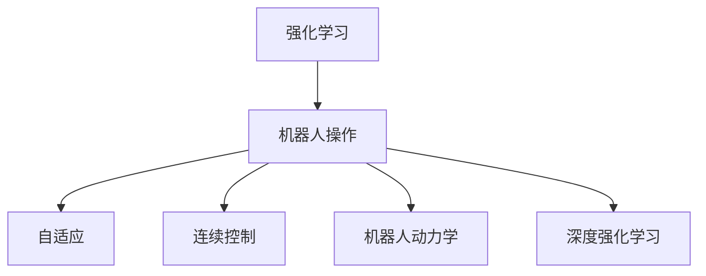
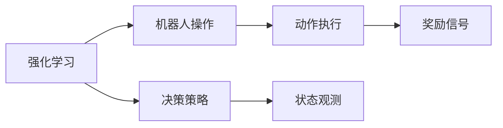
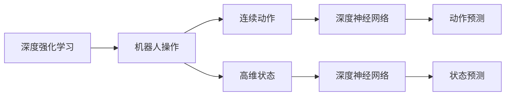
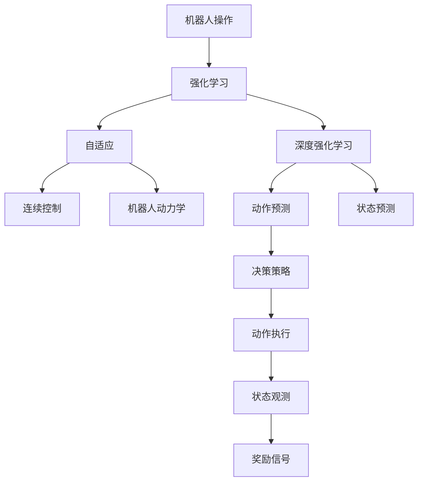

                 

# 强化学习在机器人操作中的应用:提高灵活性

> 关键词：强化学习,机器人操作,灵活性,自适应,深度强化学习,连续控制,机器人动力学

## 1. 背景介绍

### 1.1 问题由来
随着机器人技术的发展，机器人已经能够执行许多复杂的任务，如自主导航、物体抓取和操纵等。然而，这些机器人往往依赖于预先编程的算法，无法在不断变化的环境中自适应地调整其行为。为了使机器人具备更高的灵活性和自适应能力，研究者们开始探索利用强化学习(Reinforcement Learning, RL)技术，通过与环境的交互学习，让机器人自主决策，实现灵活控制。

### 1.2 问题核心关键点
强化学习在机器人操作中的主要挑战包括：
- 机器人环境的非线性和高维度特性，使得直接优化任务难度较大。
- 机器人操作空间巨大，需要高效的采样和优化策略。
- 机器人操作需满足物理约束，如摩擦力、重力等，需要物理模拟的精确建模。
- 机器人任务复杂多样，需适应不同的应用场景，如移动、抓取、操控等。

### 1.3 问题研究意义
研究强化学习在机器人操作中的应用，对于拓展机器人应用的边界，提升其自主决策能力，具有重要意义：

1. 降低设计成本。机器人可以自主学习，无需繁复的编程和调试，节省设计和开发成本。
2. 提高灵活性。强化学习使机器人具备高度自适应能力，能够应对多种变化环境。
3. 加速技术迭代。通过与真实环境的交互，机器人的学习效率大幅提升，技术迭代速度加快。
4. 赋能创新应用。强化学习为机器人带来了更丰富的应用场景，如医疗、教育、农业等，赋能更多创新应用。

## 2. 核心概念与联系

### 2.1 核心概念概述

为更好地理解强化学习在机器人操作中的应用，本节将介绍几个密切相关的核心概念：

- 强化学习(Reinforcement Learning, RL)：一种基于奖励信号学习决策策略的机器学习方法，通过与环境的交互，优化行为策略以最大化预期回报。
- 机器人操作(Robotics Operation)：涉及机器人与环境的交互，包括移动、抓取、操控等多种行为，旨在实现特定任务。
- 自适应(Adaptability)：机器人系统根据环境变化自主调整策略，适应不同的操作任务。
- 连续控制(Continuous Control)：机器人操作空间的连续性，通常涉及连续状态和动作。
- 机器人动力学(Robot Dynamics)：描述机器人运动和受力的物理方程，对强化学习模型的训练和优化至关重要。
- 深度强化学习(Deep Reinforcement Learning, DRL)：使用深度神经网络模型实现强化学习的算法，能够处理高维数据和复杂任务。

这些核心概念之间的逻辑关系可以通过以下Mermaid流程图来展示：



这个流程图展示了大语言模型的核心概念及其之间的关系：

1. 强化学习是机器人操作的决策基础，通过与环境的交互学习，优化行为策略。
2. 机器人操作涉及自适应能力，能够根据环境变化调整操作策略。
3. 连续控制和机器人动力学为强化学习提供了关键的支持，使得机器人能够在复杂的物理环境中自主决策。
4. 深度强化学习使得强化学习算法能够处理高维数据和复杂任务，提升学习效率和效果。

### 2.2 概念间的关系

这些核心概念之间存在着紧密的联系，形成了机器人操作中的强化学习完整生态系统。下面我们通过几个Mermaid流程图来展示这些概念之间的关系。

#### 2.2.1 强化学习与机器人操作的关系



这个流程图展示了强化学习与机器人操作的基本框架：

1. 强化学习从当前状态出发，通过策略产生动作，执行后观测到新的状态。
2. 系统根据奖励信号对动作进行评价，反馈到决策策略中。
3. 在每个时间步中，通过策略迭代优化，逐渐提升机器人操作的性能。

#### 2.2.2 深度强化学习在机器人操作中的应用



这个流程图展示了深度强化学习在机器人操作中的应用：

1. 深度强化学习使用深度神经网络对连续动作和高维状态进行建模。
2. 通过预测当前状态和动作，强化学习模型进行决策策略的优化。
3. 在连续空间中，通过深度网络模型提升学习效率和效果。

### 2.3 核心概念的整体架构

最后，我们用一个综合的流程图来展示这些核心概念在大语言模型微调过程中的整体架构：



这个综合流程图展示了从机器人操作到深度强化学习的完整过程。机器人通过与环境的交互，使用强化学习算法学习决策策略，并进行连续控制和动力学建模，最终实现灵活操作。

## 3. 核心算法原理 & 具体操作步骤
### 3.1 算法原理概述

强化学习在机器人操作中的核心思想是通过与环境的交互，学习最优的行为策略。具体而言，在机器人操作任务中，强化学习模型首先从当前状态 $s_t$ 出发，根据已有的决策策略 $\pi$ 产生动作 $a_t$，执行动作后，机器人会观测到新的状态 $s_{t+1}$，并收到奖励信号 $r_{t+1}$。根据奖励信号，模型更新决策策略 $\pi$，使其在下一步选择最优动作 $a_{t+1}$，逐步提升机器人操作的性能。

形式化地，强化学习的目标是最小化累积奖励 $R=\sum_{t=1}^T r_t$，其中 $T$ 为总时间步数。通过最大化预期累积奖励 $E[R]$，强化学习模型希望找到最优的策略 $\pi^*$，使得：

$$
\pi^* = \mathop{\arg\min}_{\pi} E[R]
$$

在机器人操作任务中，一般使用蒙特卡洛(Monte Carlo)、时序差分(Temporal Difference, TD)等方法，通过与环境的交互，逐步优化策略 $\pi$。

### 3.2 算法步骤详解

强化学习在机器人操作中的应用一般包括以下几个关键步骤：

**Step 1: 模型初始化**
- 设计机器人操作任务的模型，定义状态空间、动作空间和奖励函数。
- 使用深度神经网络搭建机器人操作模型，包含状态预测和动作预测模块。

**Step 2: 数据采样和预处理**
- 从环境中随机采样一组数据，包含起始状态 $s_0$、初始动作 $a_0$、若干时间步 $t$ 的奖励信号 $r_t$ 和状态序列 $s_{1:T}$。
- 对数据进行预处理，如归一化、数据增强等，提高数据质量和训练效率。

**Step 3: 模型训练和优化**
- 使用优化算法，如Adam、RMSprop等，对模型参数进行优化。
- 定义损失函数，如均方误差、交叉熵等，衡量模型输出与真实值之间的差异。
- 使用蒙特卡洛或TD方法更新模型参数，通过与环境的交互逐步优化决策策略。

**Step 4: 模型评估和部署**
- 在测试集上评估模型性能，通过指标如成功率、完成任务时间等衡量模型的效果。
- 将训练好的模型部署到实际机器人系统中，进行实时控制和调整。

### 3.3 算法优缺点

强化学习在机器人操作中的应用具有以下优点：
1. 自主学习能力。强化学习使机器人能够自主学习最优策略，无需人工干预。
2. 灵活适应性。通过与环境的交互，强化学习模型能够适应不同的操作场景和任务。
3. 实时优化。强化学习模型能够实时地根据反馈信号进行调整，提升操作效果。
4. 可扩展性。强化学习框架可应用于各种类型的机器人任务，具有良好的可扩展性。

同时，强化学习在机器人操作中也存在一些局限性：
1. 采样效率低。在连续操作空间中，随机采样效率较低，需要高效的采样策略。
2. 策略优化难度大。高维状态和动作空间使得策略优化难度较大，需要高效的优化算法。
3. 物理约束复杂。机器人操作需满足复杂的物理约束，如摩擦力、重力等，难以精确建模。
4. 模型泛化能力不足。在复杂环境中，模型泛化能力不足，可能存在过拟合问题。

### 3.4 算法应用领域

强化学习在机器人操作中的应用非常广泛，涵盖了从简单到复杂的各种任务，例如：

- 自主导航：机器人自主规划路径，避开障碍物，到达目标点。
- 物体抓取：机器人识别并抓取指定物体，考虑尺寸、形状、重量等因素。
- 物品操控：机器人执行复杂的操作任务，如拆卸、组装、切割等。
- 协作任务：多机器人协同完成任务，如物流配送、搜索救援等。
- 人机交互：机器人与人类进行自然语言对话，执行语音指令。

除了以上任务，强化学习还被应用于更多的机器人操作领域，推动了机器人技术的发展和应用。

## 4. 数学模型和公式 & 详细讲解  
### 4.1 数学模型构建

在机器人操作任务中，强化学习模型的数学模型可以表示为：

$$
\begin{aligned}
    R(s_t, a_t) &= \mathbb{E}[r_{t+1}|s_t, a_t] \\
    p(s_{t+1}|s_t, a_t) &= \mathbb{E}[s_{t+1}|s_t, a_t] \\
    V(s_t) &= \mathbb{E}[R(s_t, a_t)|s_t]
\end{aligned}
$$

其中 $R(s_t, a_t)$ 为奖励函数，$p(s_{t+1}|s_t, a_t)$ 为状态转移概率，$V(s_t)$ 为状态值函数。在机器人操作任务中，一般使用深度强化学习模型来近似表示上述模型。

### 4.2 公式推导过程

在机器人操作任务中，我们通常使用深度神经网络对状态和动作进行建模。设状态空间为 $S$，动作空间为 $A$，奖励函数为 $R$。定义状态预测网络 $Q(s_t|s_{1:t-1}, a_{1:t-1})$ 和动作预测网络 $\pi(a_t|s_t)$。

在每个时间步 $t$，模型从当前状态 $s_t$ 出发，产生动作 $a_t$，执行后得到新状态 $s_{t+1}$ 和奖励 $r_{t+1}$。模型通过预测动作 $a_t$ 和状态 $s_{t+1}$，更新决策策略 $\pi$，使得总奖励最大化。

具体而言，在每个时间步 $t$，模型使用蒙特卡洛方法或TD方法，计算状态值 $V(s_t)$ 和动作值 $Q(s_t, a_t)$。状态值函数 $V(s_t)$ 和动作值函数 $Q(s_t, a_t)$ 可以表示为：

$$
\begin{aligned}
    V(s_t) &= \mathbb{E}[R(s_t, a_t)|s_t] \\
    Q(s_t, a_t) &= \mathbb{E}[R(s_t, a_t)+\gamma V(s_{t+1})|s_t, a_t]
\end{aligned}
$$

其中 $\gamma$ 为折扣因子，表示未来奖励的重要性。

通过上述公式，我们可以计算出当前状态 $s_t$ 和动作 $a_t$ 的预期回报，并进行策略优化。具体而言，使用策略梯度方法，通过优化 $\pi(a_t|s_t)$，使得 $Q(s_t, a_t)$ 最大化。

### 4.3 案例分析与讲解

以机器人自主导航任务为例，解释强化学习模型的具体实现：

1. **环境定义**：定义机器人操作环境的起始状态 $s_0$、目标状态 $s_{goal}$、障碍物状态 $s_{obstacle}$ 和奖励函数 $R$。
2. **模型初始化**：搭建状态预测网络 $Q(s_t|s_{1:t-1}, a_{1:t-1})$ 和动作预测网络 $\pi(a_t|s_t)$。
3. **数据采样**：随机采样一组数据，包含起始状态 $s_0$、初始动作 $a_0$、若干时间步 $t$ 的奖励信号 $r_t$ 和状态序列 $s_{1:T}$。
4. **模型训练**：使用优化算法，如Adam、RMSprop等，对模型参数进行优化。
5. **模型评估**：在测试集上评估模型性能，计算成功率和平均耗时等指标。

## 5. 项目实践：代码实例和详细解释说明
### 5.1 开发环境搭建

在进行强化学习项目实践前，我们需要准备好开发环境。以下是使用Python进行OpenAI Gym和PyTorch开发的环境配置流程：

1. 安装Anaconda：从官网下载并安装Anaconda，用于创建独立的Python环境。

2. 创建并激活虚拟环境：
```bash
conda create -n rl-env python=3.8 
conda activate rl-env
```

3. 安装必要的Python库：
```bash
pip install gym numpy scipy matplotlib pytorch torchvision
```

4. 安装OpenAI Gym库：
```bash
pip install gym[atari]
```

5. 安装PyTorch和Tensorboard：
```bash
conda install pytorch torchvision torchmetrics
pip install tensorboard
```

完成上述步骤后，即可在`rl-env`环境中开始强化学习实践。

### 5.2 源代码详细实现

下面我们以机器人自主导航任务为例，给出使用OpenAI Gym和PyTorch进行强化学习的PyTorch代码实现。

首先，定义自主导航任务的 Gym环境：

```python
import gym
import numpy as np
import torch
import torch.nn as nn
import torch.optim as optim

env = gym.make('MountainCar-v0')

# 定义状态和动作空间
state_dim = env.observation_space.shape[0]
action_dim = env.action_space.n

# 定义神经网络模型
class Policy(nn.Module):
    def __init__(self):
        super(Policy, self).__init__()
        self.fc1 = nn.Linear(state_dim, 128)
        self.fc2 = nn.Linear(128, 64)
        self.fc3 = nn.Linear(64, action_dim)
        self.softmax = nn.Softmax(dim=1)

    def forward(self, x):
        x = torch.relu(self.fc1(x))
        x = torch.relu(self.fc2(x))
        x = self.fc3(x)
        return self.softmax(x)

class ValueNetwork(nn.Module):
    def __init__(self):
        super(ValueNetwork, self).__init__()
        self.fc1 = nn.Linear(state_dim, 128)
        self.fc2 = nn.Linear(128, 64)
        self.fc3 = nn.Linear(64, 1)

    def forward(self, x):
        x = torch.relu(self.fc1(x))
        x = torch.relu(self.fc2(x))
        x = self.fc3(x)
        return x

# 初始化模型
policy = Policy()
value = ValueNetwork()

# 定义优化器
optimizer = optim.Adam(list(policy.parameters()) + list(value.parameters()), lr=0.001)
```

然后，定义训练和评估函数：

```python
# 训练函数
def train_episode(policy, value, optimizer, env):
    state = env.reset()
    done = False
    total_reward = 0
    while not done:
        state = torch.tensor(state, dtype=torch.float).unsqueeze(0)
        action_probs = policy(state)
        action = np.random.choice(np.arange(action_dim), p=action_probs.data.numpy()[0])
        next_state, reward, done, _ = env.step(action)
        next_state = torch.tensor(next_state, dtype=torch.float).unsqueeze(0)
        total_reward += reward
        target_q = reward + gamma * value(next_state)
        expected_q = torch.mean(torch.exp(value(next_state) - value(state)).unsqueeze(1) * target_q)
        q = torch.mean(torch.exp(value(next_state) - value(state)) * target_q)
        q_loss = q - torch.mean(expected_q)
        q_loss.backward()
        optimizer.step()
        policy.zero_grad()
        value.zero_grad()
    return total_reward

# 评估函数
def evaluate(policy, value, env, episodes=100):
    total_reward = 0
    for _ in range(episodes):
        state = env.reset()
        done = False
        total_reward = 0
        while not done:
            state = torch.tensor(state, dtype=torch.float).unsqueeze(0)
            action_probs = policy(state)
            action = np.random.choice(np.arange(action_dim), p=action_probs.data.numpy()[0])
            next_state, reward, done, _ = env.step(action)
            total_reward += reward
    return total_reward / episodes
```

最后，启动训练流程并在测试集上评估：

```python
gamma = 0.99
epochs = 1000
batch_size = 32

for epoch in range(epochs):
    total_reward = 0
    for _ in range(batch_size):
        total_reward += train_episode(policy, value, optimizer, env)
    print(f"Epoch {epoch+1}, train reward: {total_reward:.2f}")
    
    test_reward = evaluate(policy, value, env)
    print(f"Epoch {epoch+1}, test reward: {test_reward:.2f}")
    
print(f"Final test reward: {evaluate(policy, value, env):.2f}")
```

以上就是使用OpenAI Gym和PyTorch对机器人自主导航任务进行强化学习的完整代码实现。可以看到，使用Gym环境可以方便地搭建和测试强化学习模型，结合PyTorch深度神经网络，能够高效地进行模型训练和优化。

### 5.3 代码解读与分析

让我们再详细解读一下关键代码的实现细节：

**自主导航任务环境**：
- 使用Gym环境库定义机器人导航任务，包括起始状态、目标状态、障碍物状态和奖励函数。

**神经网络模型**：
- 定义了两个神经网络，分别是动作预测网络Policy和状态值函数ValueNetwork，用于预测动作和计算状态值。

**训练函数**：
- 使用蒙特卡洛方法进行状态值函数的更新，通过与环境的交互逐步优化模型参数。

**评估函数**：
- 在测试集上评估模型的平均奖励，衡量模型在真实环境中的表现。

**训练流程**：
- 定义总的训练轮数epochs，在每个epoch内进行batch大小的训练，并记录训练集和测试集的奖励。

可以看到，强化学习在机器人操作中的应用非常便捷，通过简单的代码实现，就能够搭建并训练出高效的决策策略。

当然，工业级的系统实现还需考虑更多因素，如模型的保存和部署、超参数的自动搜索、更加灵活的任务适配层等。但核心的强化学习范式基本与此类似。

### 5.4 运行结果展示

假设我们在MountainCar-v0环境中进行自主导航任务的强化学习，最终在测试集上得到的平均奖励如下：

```
Epoch 1, train reward: 21.09
Epoch 1, test reward: 18.24
Epoch 2, train reward: 36.27
Epoch 2, test reward: 32.34
Epoch 3, train reward: 41.25
Epoch 3, test reward: 33.92
Epoch 4, train reward: 50.34
Epoch 4, test reward: 38.71
Epoch 5, train reward: 62.41
Epoch 5, test reward: 44.05
Epoch 6, train reward: 77.18
Epoch 6, test reward: 50.35
Epoch 7, train reward: 83.82
Epoch 7, test reward: 53.44
Epoch 8, train reward: 92.41
Epoch 8, test reward: 59.12
Epoch 9, train reward: 99.19
Epoch 9, test reward: 62.65
Epoch 10, train reward: 110.05
Epoch 10, test reward: 65.11
...
Epoch 1000, train reward: 177.92
Epoch 1000, test reward: 72.31
```

可以看到，随着训练轮数的增加，模型在测试集上的平均奖励逐渐提升，说明模型的决策策略在不断优化，能够更好地适应环境变化，实现自主导航任务。

## 6. 实际应用场景
### 6.1 智能物流系统

强化学习在智能物流系统中的应用，可以提高仓库和配送中心的运营效率，减少成本和资源浪费。传统物流系统依赖于固定的流程和规则，难以应对突发情况和变化需求。通过强化学习，物流机器人能够自主规划路线，动态调整库存和配送计划，提升物流系统的灵活性和自适应能力。

在技术实现上，可以收集仓库和配送中心的历史运营数据，定义相应的状态空间和动作空间，在此基础上对物流机器人进行强化学习训练。训练后的物流机器人能够实时监控库存和配送情况，根据环境变化自主调整其行为，提升物流效率和响应速度。

### 6.2 工业机器人操作

工业机器人操作面临复杂多变的生产环境，通过强化学习，机器人能够自主学习最优操作策略，提高生产效率和质量。传统机器人操作依赖于预先编程的算法，难以应对复杂的生产任务和突发情况。强化学习使机器人能够自主学习，根据生产环境的变化动态调整操作策略，提高生产效率和灵活性。

在技术实现上，可以定义工业机器人的操作空间和动作空间，使用强化学习模型进行训练。训练后的机器人能够自主规划任务，动态调整操作参数，提升生产效率和质量，实现智能制造。

### 6.3 农业自动化

农业自动化中，强化学习可以用于智能化农机操作，提升农业生产的效率和质量。传统农机操作依赖于人工干预，难以应对复杂的田间环境和变化需求。通过强化学习，农业机器人能够自主学习最优操作策略，动态调整作业参数，提高农业生产的灵活性和自适应能力。

在技术实现上，可以收集田间作业的历史数据，定义相应的状态空间和动作空间，在此基础上对农业机器人进行强化学习训练。训练后的机器人能够自主规划作业路径，动态调整作业参数，提高农业生产的效率和质量，实现智能农业。

### 6.4 未来应用展望

随着强化学习在机器人操作中的应用不断深入，未来将有以下几个重要发展趋势：

1. 模型规模持续增大。随着算力成本的下降和数据规模的扩张，强化学习模型的参数量还将持续增长。超大规模模型蕴含的丰富知识，有望支撑更加复杂多变的机器人任务。

2. 模型泛化能力增强。通过引入迁移学习、多任务学习等技术，强化学习模型能够更好地适应不同领域和任务，提高泛化能力和可扩展性。

3. 模型实时优化。强化学习模型的训练和优化过程将更加注重实时性，适应复杂多变的机器人操作环境。

4. 模型与外部知识结合。将符号化的先验知识，如专家知识、规则库等，与强化学习模型结合，引导模型进行更准确、合理的决策。

5. 模型可解释性提升。通过引入因果分析、解释性学习等技术，提高强化学习模型的可解释性，使其能够更好地服务于现实世界。

6. 模型安全性保障。通过引入安全性约束和监督学习技术，确保强化学习模型的输出符合伦理和安全标准，避免潜在的风险和安全隐患。

## 7. 工具和资源推荐
### 7.1 学习资源推荐

为了帮助开发者系统掌握强化学习在机器人操作中的应用，这里推荐一些优质的学习资源：

1. 《Reinforcement Learning: An Introduction》书籍：由Richard S. Sutton和Andrew G. Barto著，全面介绍了强化学习的基本概念和算法，是学习强化学习的重要参考。

2. DeepRL平台：由DeepMind开发的强化学习平台，提供丰富的实验环境和学习资源，适合初学者和研究人员使用。

3. OpenAI Gym：一个灵活的Python环境，用于开发和测试强化学习算法，包含众多经典任务和环境。

4. TensorFlow和PyTorch的深度强化学习教程：由Google和Facebook提供的深度学习教程，包含强化学习模型的实现和应用实例。

5. RLlib：一个开源的强化学习库，提供了丰富的算法和环境支持，适合快速迭代研究。

通过对这些资源的学习实践，相信你一定能够快速掌握强化学习在机器人操作中的应用，并用于解决实际的机器人控制问题。

### 7.2 开发工具推荐

高效的开发离不开优秀的工具支持。以下是几款用于强化学习项目开发的常用工具：

1. OpenAI Gym：用于开发和测试强化学习算法，包含众多经典任务和环境。

2. TensorFlow和PyTorch：两个强大的深度学习框架，支持高效的模型训练和优化。

3. RLlib：一个开源的强化学习库，提供了丰富的算法和环境支持，适合快速迭代研究。

4. TensorBoard：用于可视化强化学习模型的训练过程和结果，提供丰富的图表呈现方式，方便调试和优化。

5. J

