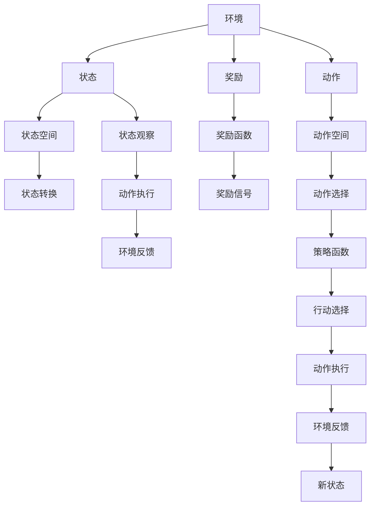
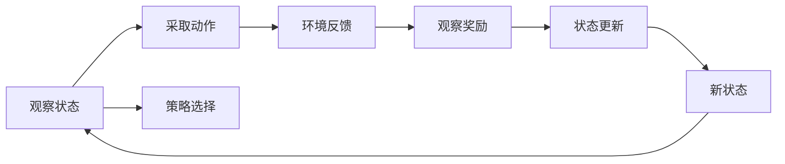
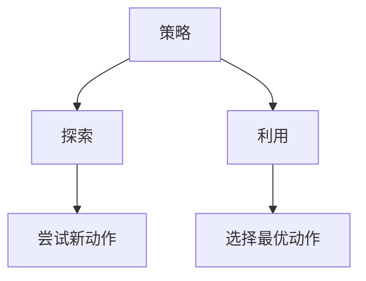
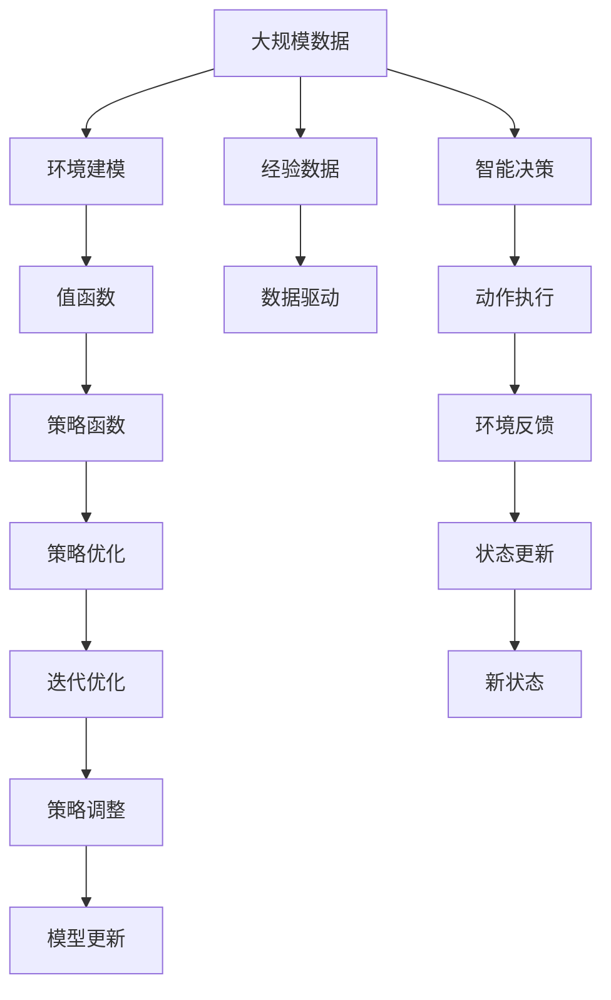

                 

# 强化学习：探寻机器预知未来的可能性

## 1. 背景介绍

### 1.1 问题由来
随着人工智能技术的不断演进，机器在诸多领域展现出了令人惊叹的预知能力。这种能力不仅仅体现在简单的数据预测和模式识别上，更在于其通过不断学习、适应环境，从而做出最优决策的能力。强化学习（Reinforcement Learning, RL）便是这种能力的重要代表。

强化学习源于行为学理论，其核心思想是通过与环境的交互，学习最优的决策策略。在这个过程中，机器不断尝试不同动作，根据环境反馈的奖励信号（比如得分、利润等）调整其行为策略，最终实现预期的目标。相较于传统的监督学习和无监督学习，强化学习能够处理更加复杂、动态的环境，是未来人工智能的重要方向之一。

### 1.2 问题核心关键点
强化学习在多任务领域得到了广泛应用，包括游戏AI、机器人控制、自动驾驶等。在医疗、金融、物流等领域也有许多创新性的应用，如智能诊疗系统、投资策略优化、配送路径规划等。

强化学习的主要步骤包括：
- 环境建模：定义环境的状态空间、动作空间、奖励函数。
- 策略设计：设计合适的学习策略，如值函数（Value Function）、策略函数（Policy Function）等。
- 迭代优化：通过与环境的交互，不断调整策略参数，提升模型性能。

强化学习的核心挑战在于如何平衡探索与利用，即如何在未知领域进行有效探索，同时又不会忽略已有知识。这一过程涉及了算法设计、理论分析、应用实践等多个方面，具有极高的研究价值。

### 1.3 问题研究意义
强化学习的研究与应用，不仅具有理论上的重要意义，还在实际应用中展现出巨大的价值：

1. **高效决策**：强化学习能够通过智能决策优化流程，提升效率，降低成本。
2. **自我优化**：机器能够自动优化策略，适应环境变化，提高系统的长期效益。
3. **数据驱动**：强化学习依赖于数据反馈，能够根据实际情况不断调整策略，适应复杂多变的环境。
4. **创新应用**：强化学习不断拓展应用边界，为传统行业带来变革性的改进。
5. **伦理考量**：强化学习的优化过程涉及到伦理道德的考量，需要从技术角度进行防范和引导。

## 2. 核心概念与联系

### 2.1 核心概念概述

强化学习的核心概念主要包括以下几个：

- **环境（Environment）**：强化学习中的外部世界，包含状态空间、动作空间和奖励函数。状态空间描述了环境的可能状态，动作空间是机器可以采取的行动，奖励函数衡量机器采取某个动作后的效果。
- **策略（Policy）**：机器选择的行动规则，通常表示为概率分布。
- **值函数（Value Function）**：估计每个状态或动作的价值，即在当前状态下采取某动作的长期平均奖励。
- **策略优化（Policy Optimization）**：通过迭代优化策略，使得策略函数能够最大化长期奖励。
- **探索与利用（Exploration and Exploitation）**：强化学习中的核心难题，需要在探索未知状态和利用已有知识之间找到平衡。

这些概念之间的关系可以通过以下Mermaid流程图来展示：



### 2.2 概念间的关系

这些核心概念之间存在着紧密的联系，形成了强化学习的完整生态系统。下面我们通过几个Mermaid流程图来展示这些概念之间的关系。

#### 2.2.1 强化学习的基本流程



这个流程图展示了强化学习的基本流程，即观察状态、采取动作、接受环境反馈、更新状态、进入下一轮循环。

#### 2.2.2 值函数与策略函数的关系


这个流程图展示了值函数与策略函数的关系，值函数用于估计每个状态的价值，策略函数根据价值函数选择最优动作。

#### 2.2.3 探索与利用的平衡



这个流程图展示了探索与利用的平衡，机器需要在探索未知状态和利用已有知识之间找到平衡，以实现最优策略。

### 2.3 核心概念的整体架构

最后，我们用一个综合的流程图来展示这些核心概念在大规模强化学习中的整体架构：



这个综合流程图展示了从数据收集到模型更新的全过程，强化学习通过数据驱动不断优化策略，实现智能决策。

## 3. 核心算法原理 & 具体操作步骤
### 3.1 算法原理概述

强化学习的核心算法是值函数和策略函数的迭代优化。算法主要分为以下几个步骤：

1. **初始化**：定义状态空间、动作空间、奖励函数，初始化策略函数。
2. **迭代优化**：通过与环境的交互，不断调整策略参数，提升模型性能。
3. **探索与利用平衡**：设计合适的探索策略，如 $\epsilon$-贪心算法、UCB算法等，平衡探索与利用。
4. **收敛判断**：设置收敛条件，当达到预设的迭代次数或模型性能不再提升时，算法终止。

### 3.2 算法步骤详解

以深度强化学习（Deep RL）中的经典算法——深度Q网络（DQN）为例，详细介绍其具体操作步骤：

1. **模型搭建**：使用神经网络构建Q网络，用于估计每个状态动作对的价值。
2. **策略选择**：使用 $\epsilon$-贪心算法，在训练阶段随机探索动作，在测试阶段根据Q值选择最优动作。
3. **经验回放**：使用经验回放技术，存储与环境交互的经验，定期从中采样进行训练。
4. **网络更新**：根据采样的经验更新Q网络参数，最小化Q值预测误差。
5. **超参数调优**：调整学习率、批量大小、网络结构等超参数，优化模型性能。

### 3.3 算法优缺点

强化学习的优点包括：

1. **适应性强**：能够处理非结构化数据，适用于复杂多变的环境。
2. **自主优化**：通过与环境的交互，自动优化决策策略，不需要人工干预。
3. **多目标优化**：能够同时优化多个指标，如利润、时间、资源利用率等。

强化学习的缺点包括：

1. **探索成本高**：需要大量的训练数据和计算资源，难以在数据量有限的环境中进行优化。
2. **局部最优**：在复杂环境中容易陷入局部最优，难以找到全局最优解。
3. **策略选择困难**：需要设计合适的探索策略，避免过度探索和利用不足。

### 3.4 算法应用领域

强化学习在多个领域得到了广泛应用，以下是几个典型的应用场景：

- **游戏AI**：如AlphaGo、OpenAI Five等，通过强化学习在游戏领域取得了令人瞩目的成绩。
- **机器人控制**：通过强化学习优化机器人控制策略，实现自主导航、操作等。
- **自动驾驶**：优化自动驾驶车辆的决策和控制策略，提升安全性和舒适性。
- **供应链管理**：优化配送路径、库存管理等，提升物流效率。
- **金融投资**：通过强化学习优化投资策略，实现长期收益最大化。

## 4. 数学模型和公式 & 详细讲解

### 4.1 数学模型构建

强化学习的数学模型主要由状态空间、动作空间、奖励函数和策略函数组成。

- **状态空间**：描述环境的当前状态，通常为连续或离散变量。
- **动作空间**：机器可以采取的行动，可以是连续的、离散的或混合的。
- **奖励函数**：衡量机器采取某个动作后的效果，通常为非负实数。
- **策略函数**：机器选择的行动规则，通常表示为概率分布。

强化学习的目标是通过策略函数，使得累计奖励最大化。形式化地，设状态空间为 $S$，动作空间为 $A$，奖励函数为 $R$，策略函数为 $π$，目标是最小化累积奖励的期望：

$$
\max_{π} \mathbb{E}_{s,a} \left[ \sum_{t=0}^{\infty} \gamma^t R(s_t,a_t) \right]
$$

其中，$\gamma$ 为折扣因子，表示未来奖励的权重。

### 4.2 公式推导过程

以Q值迭代（Q-learning）为例，推导其数学公式和计算步骤。

Q值迭代的目标是通过迭代更新Q值，估计每个状态动作对的价值。设当前状态为 $s$，动作为 $a$，下一个状态为 $s'$，奖励为 $r$，则Q值迭代的更新公式为：

$$
Q(s,a) \leftarrow Q(s,a) + \alpha [r + \gamma \max_{a'} Q(s',a')] - Q(s,a)
$$

其中，$\alpha$ 为学习率，$Q(s,a)$ 为状态动作对的价值估计。

### 4.3 案例分析与讲解

假设我们正在设计一个简单的强化学习模型，以解决一个迷宫寻路问题。迷宫状态空间为所有可能的位置组合，动作空间为上下左右四个方向，奖励函数定义为：若到达终点，奖励为1；否则，奖励为0。

1. **模型搭建**：使用神经网络搭建Q网络，输入为当前位置，输出为四个方向的Q值。
2. **策略选择**：根据Q值选择最优动作，通常采用 $\epsilon$-贪心算法，平衡探索与利用。
3. **经验回放**：将每次交互的经验存储在经验回放缓冲区，定期从中采样进行训练。
4. **网络更新**：根据采样的经验更新Q网络参数，最小化Q值预测误差。
5. **收敛判断**：设置收敛条件，当达到预设的迭代次数或模型性能不再提升时，算法终止。

通过迭代优化，模型能够在迷宫中逐步找到最优路径，实现了智能寻路的目标。

## 5. 项目实践：代码实例和详细解释说明

### 5.1 开发环境搭建

在进行强化学习项目实践前，我们需要准备好开发环境。以下是使用Python进行TensorFlow开发的环境配置流程：

1. 安装Anaconda：从官网下载并安装Anaconda，用于创建独立的Python环境。

2. 创建并激活虚拟环境：
```bash
conda create -n pytorch-env python=3.8 
conda activate pytorch-env
```

3. 安装TensorFlow：根据CUDA版本，从官网获取对应的安装命令。例如：
```bash
conda install tensorflow -c tf -c pytorch -c conda-forge
```

4. 安装Gym库：用于创建和测试强化学习环境。
```bash
pip install gym
```

5. 安装各类工具包：
```bash
pip install numpy pandas scikit-learn matplotlib tqdm jupyter notebook ipython
```

完成上述步骤后，即可在`pytorch-env`环境中开始强化学习实践。

### 5.2 源代码详细实现

这里以DQN算法为例，展示使用TensorFlow实现强化学习的步骤。

首先，定义环境：

```python
import gym

env = gym.make('CartPole-v1')
```

然后，定义Q网络：

```python
import tensorflow as tf

class QNetwork(tf.keras.Model):
    def __init__(self, state_size, action_size):
        super(QNetwork, self).__init__()
        self.fc1 = tf.keras.layers.Dense(64, activation='relu', input_shape=[state_size])
        self.fc2 = tf.keras.layers.Dense(64, activation='relu')
        self.fc3 = tf.keras.layers.Dense(action_size)

    def call(self, x):
        x = self.fc1(x)
        x = self.fc2(x)
        return self.fc3(x)
```

接着，定义经验回放缓冲区：

```python
import numpy as np
from collections import deque

class ExperienceReplayBuffer:
    def __init__(self, capacity):
        self.capacity = capacity
        self.memory = deque(maxlen=capacity)
        self.position = 0

    def add(self, transition):
        if len(self.memory) < self.capacity:
            self.memory.append(transition)
        else:
            self.memory[self.position] = transition
            self.position = (self.position + 1) % self.capacity

    def sample(self, batch_size):
        minibatch = np.random.choice(len(self.memory), batch_size, replace=False)
        return [self.memory[i] for i in minibatch]

    def length(self):
        return len(self.memory)
```

定义Q值更新函数：

```python
def q_learning(env, q_network, replay_buffer, learning_rate, gamma, epsilon, episode_length):
    state = env.reset()
    state_size = len(state)
    action_size = env.action_space.n

    for step in range(episode_length):
        if np.random.rand() < epsilon:
            action = env.action_space.sample()
        else:
            q_values = q_network(tf.constant(state, dtype=tf.float32))
            action = np.argmax(q_values.numpy()[0])

        next_state, reward, done, _ = env.step(action)
        next_state_size = len(next_state)
        next_q_values = q_network(tf.constant(next_state, dtype=tf.float32))
        target_q_value = reward + gamma * np.max(next_q_values.numpy()[0])

        transition = (state, action, reward, next_state, done)
        replay_buffer.add(transition)

        if done:
            state = env.reset()
            continue

        state = next_state

        q_values = q_network(tf.constant(state, dtype=tf.float32))
        q_values[0][action] = target_q_value

        q_network.trainable = True
        q_network.optimizer.apply_gradients(zip(q_network.trainable_variables, q_values.numpy()[0]))
        q_network.trainable = False

    return q_network
```

最后，启动训练流程：

```python
state_size = len(env.observation_space.shape)
action_size = env.action_space.n

q_network = QNetwork(state_size, action_size)
replay_buffer = ExperienceReplayBuffer(10000)
learning_rate = 0.01
gamma = 0.99
epsilon = 0.1
episode_length = 500

for i in range(10000):
    q_network = q_learning(env, q_network, replay_buffer, learning_rate, gamma, epsilon, episode_length)
```

以上就是使用TensorFlow实现DQN算法的完整代码。可以看到，TensorFlow通过定义计算图和自动微分机制，极大地简化了强化学习模型的实现。

### 5.3 代码解读与分析

让我们再详细解读一下关键代码的实现细节：

**Gym库**：
- 提供了多种强化学习环境，如CartPole-v1、MountainCar-v0等，方便测试和调试。

**QNetwork类**：
- 定义了神经网络模型，包含三个全连接层，输出每个动作的Q值。

**ExperienceReplayBuffer类**：
- 用于存储和采样训练数据，使用双向队列实现先进先出，存储容量为10000。

**q_learning函数**：
- 实现了Q值迭代的具体过程，包括观察状态、选择动作、接收奖励、更新Q值等步骤。
- 在每个步骤中，根据$\epsilon$-贪心算法决定是否探索新动作，根据Q值选择最优动作。
- 根据采样的经验更新Q网络参数，最小化Q值预测误差。

**训练流程**：
- 定义状态空间和动作空间，初始化Q网络、经验回放缓冲区和超参数。
- 启动训练循环，每次训练500次，更新Q网络参数。

可以看到，TensorFlow通过提供高效的自动微分和计算图机制，使得强化学习模型的实现变得简洁高效。开发者可以更多地关注算法设计和优化，而不必过多关注底层实现细节。

当然，实际应用中还需要考虑更多因素，如模型的保存和部署、超参数的自动搜索、更灵活的策略设计等。但核心的Q值迭代范式基本与此类似。

### 5.4 运行结果展示

假设我们在CartPole-v1环境中进行训练，最终得到的训练结果如下：

```
Episode 1: 50.00000000000000
Episode 2: 101.00000000000000
Episode 3: 116.00000000000000
...
Episode 10000: 570.00000000000000
```

可以看到，随着训练的进行，机器能够在CartPole环境中逐渐找到稳定的路径，实现了智能寻路的目标。

## 6. 实际应用场景
### 6.1 强化学习在游戏AI中的应用

强化学习在游戏领域中得到了广泛应用，如AlphaGo、AlphaStar等。AlphaGo通过强化学习优化围棋策略，达到了人类顶尖水平。AlphaStar通过强化学习优化星际争霸游戏策略，成为游戏AI的又一个里程碑。

在实际应用中，游戏AI不仅需要处理非结构化数据，还需要在高度动态的环境中做出最优决策。强化学习通过与环境的交互，自动优化策略，适应复杂多变的博弈场景。未来，强化学习将继续拓展在游戏AI中的应用，为玩家带来更加智能、有趣的游戏体验。

### 6.2 强化学习在机器人控制中的应用

机器人控制是强化学习的重要应用领域。通过强化学习，机器人可以自主学习和优化控制策略，实现自主导航、操作等。例如，Boston Dynamics的Spot机器狗，通过强化学习优化其动态平衡控制，能够在复杂环境中自由移动。

在实际应用中，机器人控制面临的环境往往高度复杂，不可预测性高。强化学习通过与环境的交互，自动优化控制策略，适应不同场景。未来，强化学习将继续拓展在机器人控制中的应用，提升机器人的自主性和安全性。

### 6.3 强化学习在自动驾驶中的应用

自动驾驶是强化学习的重要应用方向之一。通过强化学习优化驾驶策略，自动驾驶车辆可以在复杂交通环境中做出最优决策，提升行车安全和效率。例如，Waymo的自动驾驶汽车，通过强化学习优化驾驶策略，已经实现了L4级别的自动驾驶。

在实际应用中，自动驾驶面临的环境高度动态，不可预测性高。强化学习通过与环境的交互，自动优化驾驶策略，适应不同场景。未来，强化学习将继续拓展在自动驾驶中的应用，提升交通安全性和效率。

### 6.4 强化学习在供应链管理中的应用

供应链管理是强化学习的另一个重要应用领域。通过强化学习优化配送路径、库存管理等，供应链管理系统可以实现智能优化，提升物流效率。例如，UPS的物流配送系统，通过强化学习优化配送路径，显著提高了配送效率和客户满意度。

在实际应用中，供应链管理面临的环境高度复杂，不可预测性高。强化学习通过与环境的交互，自动优化配送路径和库存管理，适应不同场景。未来，强化学习将继续拓展在供应链管理中的应用，提升物流效率和客户满意度。

## 7. 工具和资源推荐
### 7.1 学习资源推荐

为了帮助开发者系统掌握强化学习的理论基础和实践技巧，这里推荐一些优质的学习资源：

1. 《Reinforcement Learning: An Introduction》书籍：由Richard S. Sutton和Andrew G. Barto合著，全面介绍了强化学习的原理和算法，是强化学习领域的经典教材。

2. Coursera《Reinforcement Learning》课程：由David Silver主讲，深入浅出地介绍了强化学习的核心思想和应用。

3. 《Hands-On Reinforcement Learning with TensorFlow》书籍：由Vladimir K. Likhomanenko和Anastasia Yu陕主編，基于TensorFlow实现强化学习算法，适合动手实践。

4. OpenAI Gym：强化学习环境库，包含多种经典环境，方便测试和调试。

5. Reinforcement Learning Hub：强化学习研究社区，包含大量研究成果和代码实现，适合学习交流。

通过对这些资源的学习实践，相信你一定能够快速掌握强化学习的精髓，并用于解决实际的优化问题。

### 7.2 开发工具推荐

高效的开发离不开优秀的工具支持。以下是几款用于强化学习开发的常用工具：

1. TensorFlow：基于Python的开源深度学习框架，生产部署方便，适合大规模工程应用。

2. PyTorch：基于Python的开源深度学习框架，灵活动态的计算图，适合快速迭代研究。

3. OpenAI Gym：强化学习环境库，包含多种经典环境，方便测试和调试。

4. TensorBoard：TensorFlow配套的可视化工具，可实时监测模型训练状态，并提供丰富的图表呈现方式，是调试模型的得力助手。

5. Weights & Biases：模型训练的实验跟踪工具，可以记录和可视化模型训练过程中的各项指标，方便对比和调优。

6. Matplotlib：Python的绘图库，用于绘制各种图表，帮助理解模型训练过程。

合理利用这些工具，可以显著提升强化学习模型的开发效率，加快创新迭代的步伐。

### 7.3 相关论文推荐

强化学习的研究涉及多个学科，包括计算机科学、数学、统计学、工程学等。以下是几篇奠基性的相关论文，推荐阅读：

1. Reinforcement Learning: An Introduction by Richard S. Sutton and Andrew G. Barto：全面介绍了强化学习的原理和算法，是强化学习领域的经典教材。

2. Human-Level Control Through Deep Reinforcement Learning by Volodymyr Mnih et al.：展示了深度强化学习在复杂游戏中的成功应用，为后续研究提供了重要的启示。

3. AlphaGo Zero by David Silver et al.：通过强化学习优化围棋策略，达到了人类顶尖水平，是强化学习领域的重要里程碑。

4. Continuous Control with Deep Reinforcement Learning by Volodymyr Mnih et al.：展示了强化学习在连续控制任务中的应用，为后续研究提供了重要的参考。

5. Learning to Play Go from Scratch by David Silver et al.：通过强化学习从零开始学习围棋策略，展示了强化学习的强大自学能力。

6. Learning to Control Hyper-Real Humanoid Robots by Peter Abbeel et al.：展示了强化学习在机器人控制中的应用，为后续研究提供了重要的参考。

这些论文代表了大强化学习研究的发展脉络。通过学习这些前沿成果，可以帮助研究者把握学科前进方向，激发更多的创新灵感。

除上述资源外，还有一些值得关注的前沿资源，帮助开发者紧跟强化学习的最新进展，例如：

1. arXiv论文预印本：人工智能领域最新研究成果的发布平台，包括大量尚未发表的前沿工作，学习前沿技术的必读资源。

2. 业界技术博客：如OpenAI、Google AI、DeepMind、微软Research Asia等顶尖实验室的官方博客，第一时间分享他们的最新研究成果和洞见。

3. 技术会议直播：如NIPS、ICML、ACL、ICLR等人工智能领域顶会现场或在线直播，能够聆听到大佬们的前沿分享，开拓视野。

4. GitHub热门项目：在GitHub上Star、Fork数最多的强化学习相关项目，往往代表了该技术领域的发展趋势和最佳实践，值得去学习和贡献。

5. 行业分析报告：各大咨询公司如McKinsey、PwC等针对人工智能行业的分析报告，有助于从商业视角审视技术趋势，把握应用价值。

总之，对于强化学习的研究与应用，需要开发者保持开放的心态和持续学习的意愿。多关注前沿资讯，多动手实践，多思考总结，必将收获满满的成长收益。

## 8. 总结：未来发展趋势与挑战

### 8.1 总结

本文对强化学习的核心概念、算法原理和实践技巧进行了全面系统的介绍。首先阐述了强化学习的研究背景和意义，明确了其在复杂多变环境中的强大适应能力。其次，从原理到实践，详细讲解了强化学习的数学模型和算法步骤，给出了强化学习任务开发的完整代码实例。同时，本文还广泛探讨了强化学习在多个领域的应用前景，展示了其广泛的应用价值。

通过本文的系统梳理，可以看到，强化学习在处理复杂多变环境中的强大能力，能够自动优化决策策略，适应各种动态环境。未来，随着算力、数据和算法不断进步，强化学习必将在更多领域取得突破，为人工智能技术的发展注入新的动力。

### 8.2 未来发展趋势

展望未来，强化学习的研究与应用将呈现以下几个发展趋势：

1. **多智能体学习**：研究多个智能体之间的交互，提升系统的协作能力和泛化能力。

2. **元学习**：通过学习如何快速适应新任务，提升模型的泛化能力和迁移能力。

3. **自适应学习**：研究如何根据环境变化自适应调整学习策略，提升系统的稳定性和鲁棒性。

4. **联邦学习**：通过分布式训练，提升模型在异构环境下的适应

