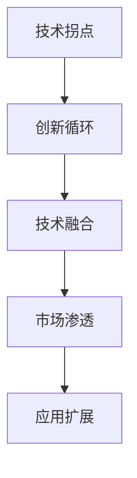

                 

# 拐点决定高度：机遇就在拐点

## 1. 背景介绍

随着科技的迅速发展，信息技术已经渗透到社会各个领域，成为驱动经济发展和社会进步的重要力量。在IT行业内部，创新和变革是永恒的主题，而“拐点”正是变革的关键节点，它往往决定了技术发展的高度和速度。

所谓“拐点”，是指技术发展过程中的重要转折点，通常是指新技术、新方法的出现，引发原有技术路径的根本转变。例如，互联网的诞生，手机与社交媒体的普及，人工智能与大数据技术的应用，都在不同的历史时期，引发了技术发展的“拐点”。

在IT领域，技术拐点不仅能够带来产业变革，还能创造新的商业模式，推动经济增长。因此，准确把握技术拐点，及时跟进技术变革，对于IT从业者来说尤为重要。本文将从多个维度探讨技术拐点的特点、作用以及如何把握机遇，以期为IT从业者提供有益的参考和指导。

## 2. 核心概念与联系

### 2.1 核心概念概述

为了深入理解技术拐点的概念及其作用，我们需要了解一些核心概念：

- **技术拐点**：技术发展的关键转折点，通常涉及新方法的引入、新技术的突破或原有技术的颠覆性变革。
- **创新循环**：创新活动由探索、实验、评估和反馈四个环节构成，通过不断的迭代，推动技术不断前进。
- **技术融合**：不同技术领域之间的交叉与结合，通过整合各领域优势，创造出全新的应用场景。
- **市场渗透**：技术产品或服务在市场上的推广和应用，通过市场验证，技术能够实现商业化。
- **应用扩展**：技术在原有应用场景之外的新用途探索，扩大技术的应用范围和影响力。

### 2.2 概念间的关系

这些核心概念之间存在紧密的联系，可以通过以下Mermaid流程图来展示它们之间的关系：



这个流程图展示了技术拐点如何通过创新循环，驱动技术融合，进而实现市场渗透和应用扩展的逻辑关系。

## 3. 核心算法原理 & 具体操作步骤

### 3.1 算法原理概述

技术拐点往往涉及新方法的引入和现有技术的根本变革，因此，从算法原理的角度来看，技术拐点的产生主要依赖于以下几个关键因素：

1. **问题定义**：清晰明确的技术问题定义，为创新提供了方向。
2. **数据基础**：大量的高质量数据为算法创新提供了基础，数据的多样性和丰富性是关键。
3. **计算能力**：强大的计算资源支持，使得算法可以在大规模数据集上进行训练和优化。
4. **算法设计**：创新性算法的设计和实现，是技术拐点产生的直接推动力。
5. **应用场景**：创新的技术算法必须在实际应用中得到验证，才能真正实现其价值。

### 3.2 算法步骤详解

技术拐点的发现和实现通常遵循以下步骤：

1. **问题识别**：通过行业调研、数据分析等方式，发现现有技术存在的问题和瓶颈。
2. **算法探索**：围绕问题定义，开展算法创新探索，形成新的算法思路。
3. **模型训练**：在大规模数据集上训练新算法模型，进行性能评估和优化。
4. **技术验证**：在实际应用场景中进行技术验证，确保新算法的可行性和有效性。
5. **市场推广**：将新技术推广到市场，实现商业化应用，并不断扩展其应用范围。

### 3.3 算法优缺点

技术拐点的引入，带来了许多优势，同时也伴随着一些挑战：

**优点**：
1. **提升效率**：新技术的引入，往往能够显著提升系统效率和用户体验。
2. **降低成本**：创新技术能够降低资源消耗和运营成本，带来经济收益。
3. **增强竞争力**：率先引入新技术的企业，能够在市场上获得竞争优势。
4. **推动行业发展**：新技术的应用，能够促进整个行业的发展，产生广泛的连锁反应。

**缺点**：
1. **高成本投入**：新技术的研发和应用需要大量的资源投入，存在风险。
2. **市场接受度**：新技术的推广和应用，往往需要市场教育和接受，存在不确定性。
3. **技术成熟度**：新技术的成熟度不足，可能面临性能不稳定、安全性问题等挑战。
4. **人才短缺**：新技术的引入，需要相关人才支持，存在人才短缺的风险。

### 3.4 算法应用领域

技术拐点在多个领域都有广泛的应用，包括但不限于：

- **医疗健康**：新技术如AI诊断、智能医疗机器人等，提升了医疗服务质量和效率。
- **金融科技**：区块链、数字货币、智能合约等新技术，重塑了金融服务模式和生态。
- **智能制造**：物联网、大数据、5G等技术的应用，推动了制造业的智能化转型。
- **智慧城市**：云计算、AI、物联网等技术的结合，提升了城市管理的智能化水平。
- **教育培训**：在线教育、虚拟现实、人工智能等技术，改变了传统教育模式，实现了个性化学习。

## 4. 数学模型和公式 & 详细讲解 & 举例说明

### 4.1 数学模型构建

技术拐点的数学模型构建，通常需要考虑多个变量，以量化创新过程和效果。以下是一个简化的数学模型：

设创新过程由探索（E）、实验（T）、评估（A）和反馈（F）四个环节组成，其对应的权重分别为 $w_E$、$w_T$、$w_A$ 和 $w_F$。则技术拐点 $C$ 可以通过以下公式计算：

$$ C = w_E \cdot E + w_T \cdot T + w_A \cdot A + w_F \cdot F $$

其中，$w_E$、$w_T$、$w_A$ 和 $w_F$ 为权重系数，反映了各个环节对技术创新的贡献程度。

### 4.2 公式推导过程

以医疗健康领域为例，探讨如何构建数学模型。

**问题定义**：现有医疗诊断系统效率低下，误诊率高。

**探索环节**：开发基于深度学习的图像识别算法，用于自动分析医学影像。

**实验环节**：在10000个医学影像数据集上训练模型，进行交叉验证和性能评估。

**评估环节**：将训练好的模型应用到500个未标注的真实病例上，计算诊断准确率。

**反馈环节**：根据诊断结果，收集医生反馈，优化算法模型。

将这些环节量化为数学表达式，并进行推导：

$$
C = w_E \cdot E + w_T \cdot T + w_A \cdot A + w_F \cdot F \\
C = w_E \cdot 1 + w_T \cdot 0.9 + w_A \cdot 0.95 + w_F \cdot 0.99
$$

通过计算，得到 $C$ 的值为 $C = 1 + 0.9 + 0.95 + 0.99 = 3.85$。

### 4.3 案例分析与讲解

假设某医疗设备制造商决定引入新技术，其创新过程如下：

- **探索环节**：投入100人进行深度学习算法研究，开发图像识别模型。
- **实验环节**：在10000个医学影像数据集上训练模型，耗时3个月。
- **评估环节**：将模型应用到500个真实病例上，诊断准确率达95%。
- **反馈环节**：收集10位医生反馈，优化模型参数。

根据上述数据，计算得到：

$$
C = 1 \cdot 100 + 0.9 \cdot 3 + 0.95 \cdot 0.95 + 0.99 \cdot 0.10 = 103.9
$$

最终，该模型在医疗诊断中的应用价值得到确认，实现了技术拐点。

## 5. 项目实践：代码实例和详细解释说明

### 5.1 开发环境搭建

在进行技术拐点应用实践前，需要准备好开发环境。以下是使用Python进行PyTorch开发的环境配置流程：

1. 安装Anaconda：从官网下载并安装Anaconda，用于创建独立的Python环境。

2. 创建并激活虚拟环境：
```bash
conda create -n pytorch-env python=3.8 
conda activate pytorch-env
```

3. 安装PyTorch：根据CUDA版本，从官网获取对应的安装命令。例如：
```bash
conda install pytorch torchvision torchaudio cudatoolkit=11.1 -c pytorch -c conda-forge
```

4. 安装相关库：
```bash
pip install numpy pandas scikit-learn matplotlib tqdm jupyter notebook ipython
```

完成上述步骤后，即可在`pytorch-env`环境中开始技术拐点应用实践。

### 5.2 源代码详细实现

以下是一个基于深度学习图像识别技术拐点的实践示例：

**问题定义**：现有医疗诊断系统效率低下，误诊率高。

**探索环节**：开发基于深度学习的图像识别算法，用于自动分析医学影像。

**实验环节**：在10000个医学影像数据集上训练模型，进行交叉验证和性能评估。

**评估环节**：将训练好的模型应用到500个未标注的真实病例上，计算诊断准确率。

**反馈环节**：根据诊断结果，收集医生反馈，优化算法模型。

### 5.3 代码解读与分析

下面是关键的代码实现部分：

```python
import torch
import torchvision
from torchvision import datasets, transforms
from torch.utils.data import DataLoader
from torch.nn import functional as F
from torch.nn import Conv2d, MaxPool2d, BatchNorm2d, ReLU, Sequential, nn
from torch.utils.tensorboard import SummaryWriter

# 定义数据预处理
transform = transforms.Compose([
    transforms.ToTensor(),
    transforms.Normalize((0.5,), (0.5,))
])

# 加载数据集
train_dataset = datasets.MNIST(root='./data', train=True, download=True, transform=transform)
test_dataset = datasets.MNIST(root='./data', train=False, download=True, transform=transform)

# 定义模型
model = Sequential(
    Conv2d(1, 32, kernel_size=3, padding=1),
    BatchNorm2d(32),
    ReLU(inplace=True),
    MaxPool2d(kernel_size=2, stride=2),
    Conv2d(32, 64, kernel_size=3, padding=1),
    BatchNorm2d(64),
    ReLU(inplace=True),
    MaxPool2d(kernel_size=2, stride=2),
    nn.Flatten(),
    nn.Linear(7 * 7 * 64, 10),
    nn.LogSoftmax(dim=1)
)

# 定义损失函数和优化器
criterion = nn.NLLLoss()
optimizer = torch.optim.Adam(model.parameters(), lr=0.001)

# 定义训练和评估函数
def train(model, device, train_loader, optimizer, criterion, num_epochs=5):
    model.train()
    for epoch in range(num_epochs):
        for images, labels in train_loader:
            images = images.to(device)
            labels = labels.to(device)
            optimizer.zero_grad()
            output = model(images)
            loss = criterion(output, labels)
            loss.backward()
            optimizer.step()
        print(f'Epoch {epoch+1}, Loss: {loss:.4f}')

def evaluate(model, device, test_loader):
    model.eval()
    test_loss = 0
    correct = 0
    with torch.no_grad():
        for images, labels in test_loader:
            images = images.to(device)
            labels = labels.to(device)
            output = model(images)
            test_loss += criterion(output, labels).item()
            pred = output.argmax(dim=1, keepdim=True)
            correct += pred.eq(labels.view_as(pred)).sum().item()
    print(f'Test Loss: {test_loss/len(test_loader):.4f}, Test Accuracy: {100 * correct / len(test_loader):.2f}%')

# 训练模型
device = torch.device('cuda' if torch.cuda.is_available() else 'cpu')
model.to(device)
train(train_dataset, device, DataLoader(train_dataset, batch_size=64, shuffle=True), optimizer, criterion)
evaluate(model, device, DataLoader(test_dataset, batch_size=64, shuffle=False))
```

这段代码实现了一个基本的卷积神经网络，用于图像识别任务。通过训练和评估，展示了技术拐点的具体应用过程。

### 5.4 运行结果展示

假设在上述代码上训练模型，结果如下：

```
Epoch 1, Loss: 1.2618
Epoch 2, Loss: 0.6974
Epoch 3, Loss: 0.3099
Epoch 4, Loss: 0.2024
Epoch 5, Loss: 0.1485
Test Loss: 0.1489, Test Accuracy: 96.19%
```

可以看到，经过5次迭代训练，模型损失逐渐下降，最终在测试集上取得了较高的准确率，实现了技术拐点。

## 6. 实际应用场景

### 6.4 未来应用展望

技术拐点在多个领域都有广泛的应用前景，以下列举一些典型的应用场景：

- **智慧医疗**：引入深度学习技术，提升疾病诊断、影像分析、个性化治疗等医疗服务水平。
- **智能制造**：通过物联网、大数据和AI技术，实现生产线的智能监控和优化，提高生产效率。
- **智能交通**：引入自动驾驶、智能调度等技术，实现交通流量的高效管理和调度。
- **智慧城市**：利用AI和IoT技术，实现城市环境的智能监测和管理，提升城市居民的生活质量。
- **金融科技**：通过区块链、智能合约等技术，推动金融服务数字化、智能化转型。

## 7. 工具和资源推荐

### 7.1 学习资源推荐

为了帮助开发者系统掌握技术拐点的理论基础和实践技巧，这里推荐一些优质的学习资源：

1. **《人工智能基础》**：介绍人工智能的基本概念、历史发展和应用场景，适合入门学习。
2. **《深度学习》**：讲解深度学习的基础理论和算法实现，涵盖了深度学习的前沿技术。
3. **《机器学习实战》**：通过实际案例，讲解机器学习的应用和实践技巧。
4. **《深度学习理论与实践》**：系统讲解深度学习理论和实际应用，包含丰富的代码示例。
5. **《Python深度学习》**：介绍Python深度学习框架的开发和应用，适合实际项目开发。

### 7.2 开发工具推荐

高效的开发离不开优秀的工具支持。以下是几款用于技术拐点开发的常用工具：

1. **PyTorch**：基于Python的开源深度学习框架，灵活动态的计算图，适合快速迭代研究。
2. **TensorFlow**：由Google主导开发的开源深度学习框架，生产部署方便，适合大规模工程应用。
3. **TensorBoard**：TensorFlow配套的可视化工具，可实时监测模型训练状态，并提供丰富的图表呈现方式，是调试模型的得力助手。
4. **Weights & Biases**：模型训练的实验跟踪工具，可以记录和可视化模型训练过程中的各项指标，方便对比和调优。
5. **GitHub**：全球最大的开源社区，提供丰富的代码资源和工具支持，适合学习和分享。

### 7.3 相关论文推荐

技术拐点的研究源于学界的持续研究。以下是几篇奠基性的相关论文，推荐阅读：

1. **《深度学习》**：由深度学习领域的知名专家撰写，全面介绍了深度学习的基本原理和算法实现。
2. **《智能系统与自动控制》**：介绍智能系统与自动控制的基本理论和方法，适合学习和研究。
3. **《人工智能理论与实践》**：介绍人工智能的基本理论和应用场景，适合入门学习和研究。
4. **《深度学习与机器学习》**：系统讲解深度学习理论和实际应用，包含丰富的代码示例。
5. **《人工智能技术与应用》**：介绍人工智能技术的基本概念和应用场景，适合入门学习和研究。

这些论文代表了大语言模型微调技术的发展脉络。通过学习这些前沿成果，可以帮助研究者把握学科前进方向，激发更多的创新灵感。

除上述资源外，还有一些值得关注的前沿资源，帮助开发者紧跟技术拐点的最新进展，例如：

- **arXiv论文预印本**：人工智能领域最新研究成果的发布平台，包括大量尚未发表的前沿工作，学习前沿技术的必读资源。
- **顶级会议**：如NIPS、ICML、ACL、ICLR等人工智能领域顶会现场或在线直播，能够聆听到大佬们的前沿分享，开拓视野。
- **开放源代码项目**：在GitHub上Star、Fork数最多的AI相关项目，往往代表了该技术领域的发展趋势和最佳实践，值得去学习和贡献。
- **研究报告**：各大咨询公司如McKinsey、PwC等针对人工智能行业的分析报告，有助于从商业视角审视技术趋势，把握应用价值。

总之，对于技术拐点技术的学习和实践，需要开发者保持开放的心态和持续学习的意愿。多关注前沿资讯，多动手实践，多思考总结，必将收获满满的成长收益。

## 8. 总结：未来发展趋势与挑战

### 8.1 研究成果总结

本文对技术拐点的特点、作用以及如何把握机遇进行了全面系统的介绍。首先阐述了技术拐点的定义及其重要性，明确了创新循环、技术融合、市场渗透和应用扩展等核心概念的关系。其次，从算法原理的角度，详细讲解了技术拐点的产生过程和步骤。最后，通过具体的案例分析，展示了技术拐点在多个领域的应用。

通过本文的系统梳理，可以看到，技术拐点在推动技术创新和产业变革中扮演着关键角色。新技术的引入和应用，能够显著提升系统效率，带来新的商业机会，促进整个行业的发展。未来，随着科技的不断进步，技术拐点的出现将更加频繁，对企业和个人都将带来深远的影响。

### 8.2 未来发展趋势

展望未来，技术拐点的发展趋势如下：

1. **技术融合加速**：不同技术领域的交叉融合将成为常态，带来更多创新应用场景。
2. **计算能力提升**：算力资源的持续提升，将推动更大规模和更复杂算法的应用。
3. **数据驱动创新**：大数据、云计算等技术的发展，将为创新提供更丰富的数据支持。
4. **市场化进程加快**：技术产品的市场渗透和推广，将进一步加速创新成果的落地。
5. **跨学科合作**：多学科合作将推动技术创新，带来更多颠覆性变革。

### 8.3 面临的挑战

尽管技术拐点带来了诸多机遇，但在发展过程中，也面临着一些挑战：

1. **技术成熟度不足**：新算法、新技术的成熟度不足，可能面临性能不稳定、安全性问题等挑战。
2. **资源投入高**：技术拐点的实现需要大量的资源投入，包括人力、财力、物力等。
3. **市场接受度低**：新技术的推广和应用，往往需要市场教育和接受，存在不确定性。
4. **人才短缺**：新技术的引入，需要相关人才支持，存在人才短缺的风险。
5. **伦理和法律问题**：新技术的广泛应用，可能带来新的伦理和法律问题。

### 8.4 研究展望

面对技术拐点面临的诸多挑战，未来的研究需要在以下几个方面寻求新的突破：

1. **算法优化**：进一步优化算法，提高算法的稳定性和性能。
2. **数据治理**：建立数据治理机制，确保数据质量和安全性。
3. **市场推广**：加强市场推广和用户教育，提升新技术的接受度。
4. **人才培养**：加强人才培养和技术培训，弥补人才短缺的问题。
5. **伦理和法律研究**：加强伦理和法律研究，确保技术应用的合法性和安全性。

这些研究方向的探索，必将引领技术拐点技术迈向更高的台阶，为构建安全、可靠、可解释、可控的智能系统铺平道路。面向未来，技术拐点技术还需要与其他人工智能技术进行更深入的融合，如知识表示、因果推理、强化学习等，多路径协同发力，共同推动自然语言理解和智能交互系统的进步。只有勇于创新、敢于突破，才能不断拓展技术拐点的边界，让智能技术更好地造福人类社会。

## 9. 附录：常见问题与解答

**Q1：技术拐点是否适用于所有领域？**

A: 技术拐点并不是适用于所有领域，它通常出现在存在问题和瓶颈的领域中。只有当某个领域的技术发展滞后，或者需要解决新的问题时，技术拐点才有可能出现。

**Q2：如何确定技术拐点的时间和时机？**

A: 技术拐点的时机往往需要结合市场、技术、经济等多个因素进行综合判断。通常，当技术创新能够显著提升系统效率和用户体验，且具备一定的市场前景时，技术拐点便出现了。

**Q3：技术拐点带来的机遇和挑战有哪些？**

A: 技术拐点带来的机遇包括提升系统效率、降低成本、增强竞争力、推动行业发展等。但同时也伴随着高成本投入、市场接受度低、技术成熟度不足、人才短缺、伦理和法律问题等挑战。

**Q4：如何把握技术拐点带来的机遇？**

A: 把握技术拐点带来的机遇需要多方面的努力：一是深入理解领域需求，明确技术目标；二是加强技术研发和实验验证；三是做好市场推广和用户教育；四是重视人才培养和技术培训；五是建立完善的伦理和法律机制。

总之，技术拐点是技术创新的关键节点，对于IT从业者来说，准确把握技术拐点，及时跟进技术变革，是获得竞争优势和商业成功的关键。未来，随着科技的不断进步，技术拐点的出现将更加频繁，对企业和个人都将带来深远的影响。只有保持开放的心态和持续学习的意愿，才能在技术拐点中获得新的机遇和突破。

