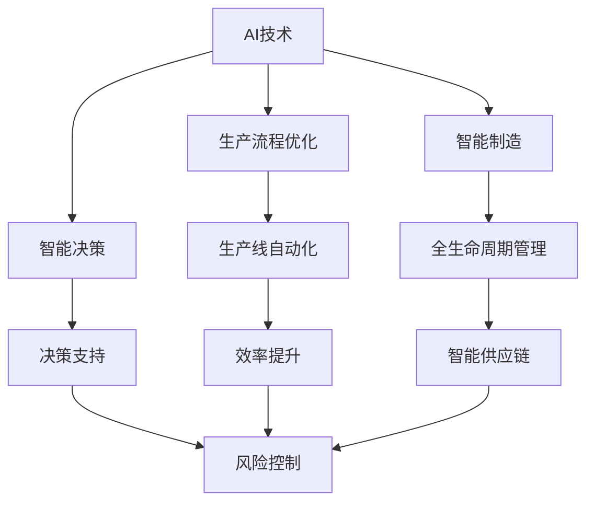

                 

# 提升竞争力的新质生产力策略

## 1. 背景介绍

在数字化经济时代，企业之间的竞争已经超越了传统的成本和价格比较，转变为以技术、创新和效率为核心的全新竞争态势。在信息技术和人工智能（AI）的双重驱动下，企业需要不断提升自身的生产力水平，以维持甚至扩大市场份额。本文将聚焦于新质生产力策略的构建，深入探讨如何通过AI技术提升企业核心竞争力。

### 1.1 问题由来

面对激烈的市场竞争，许多企业逐渐意识到，单纯依赖传统生产线或增加人力投入已无法有效提升生产效率。AI技术的引入，为提升企业生产力提供了新的方向。然而，AI技术的实施并非易事，如何选择合适的AI策略，如何在实际应用中最大化其效果，仍然是一大难题。

### 1.2 问题核心关键点

本文将从以下几个方面着手，探究如何通过AI技术构建新质生产力：

- **AI技术与生产力的结合**：研究AI技术在生产流程优化、智能制造、供应链管理等领域的应用，揭示其对企业生产力的影响。
- **智能决策与流程优化**：探讨AI在数据分析、预测建模、自动化决策中的应用，提升企业决策的科学性和效率。
- **知识工作者的助力**：分析AI对知识型工作者的赋能作用，以及如何通过AI增强他们的工作效能。
- **新质生产力的构建**：构建新质生产力模型，提出企业应用AI提升竞争力的具体策略。

## 2. 核心概念与联系

### 2.1 核心概念概述

- **新质生产力（New Quality Productivity）**：指通过新技术、新方法和新流程，从根本上改变传统生产方式，提升企业整体效率和竞争力的生产力形态。

- **AI技术**：包括机器学习、深度学习、自然语言处理等技术，通过模拟人类智能，实现自动化、智能化生产。

- **智能决策**：利用AI对海量数据进行分析和预测，辅助企业做出更加科学和准确的决策。

- **知识工作者（Knowledge Worker）**：指在知识密集型工作岗位上工作的员工，如科研人员、分析师、项目管理师等。

- **生产流程优化**：通过AI优化生产线的自动化程度，减少人为错误，提高生产效率。

- **智能制造（Smart Manufacturing）**：将AI技术引入制造过程，实现生产全生命周期的智能化管理。

### 2.2 概念间的关系

这些核心概念之间的逻辑关系可以通过以下Mermaid流程图来展示：



这个流程图展示了大语言模型微调过程中各个核心概念的关系和作用：

1. AI技术通过模拟人类智能，提供了智能决策和生产流程优化等能力。
2. 智能决策通过数据分析和预测，辅助企业做出更加科学和准确的决策。
3. 生产流程优化通过自动化和智能化，提升生产效率。
4. 智能制造通过全生命周期管理，实现生产过程的智能化。
5. 决策支持通过风险控制，减少决策错误和风险。
6. 智能供应链通过优化，提升供应链管理效率。

这些概念共同构成了新质生产力的基础框架，通过技术手段改造传统生产方式，提升企业整体的效率和竞争力。

## 3. 核心算法原理 & 具体操作步骤

### 3.1 算法原理概述

新质生产力的构建，离不开AI技术的广泛应用。其核心原理是通过数据驱动和智能决策，优化生产流程，提升企业整体的运营效率和竞争力。

AI技术的应用主要分为以下三个阶段：

1. **数据驱动决策**：利用大数据分析和机器学习技术，从海量数据中提取有价值的信息，辅助企业做出更加科学和准确的决策。
2. **智能生产流程**：通过自动化和智能化技术，优化生产流程，提升生产效率。
3. **智能供应链管理**：利用AI优化供应链管理，实现资源的高效配置和流动。

### 3.2 算法步骤详解

基于AI技术构建新质生产力的具体步骤如下：

**Step 1: 数据收集与处理**

- **数据源选择**：根据企业需求，选择合适的数据源，包括生产数据、市场数据、客户反馈等。
- **数据清洗与预处理**：对数据进行清洗、去重、归一化等预处理，确保数据的质量和一致性。

**Step 2: 模型训练与优化**

- **模型选择**：根据应用场景，选择合适的AI模型，如决策树、随机森林、神经网络等。
- **模型训练**：使用历史数据对模型进行训练，调整模型参数，优化模型性能。
- **模型评估与调优**：在验证集上评估模型性能，根据评估结果进行调优。

**Step 3: 生产流程优化**

- **流程分析**：分析生产流程中的瓶颈和问题，识别优化机会。
- **自动化实现**：引入自动化和智能化技术，如机器人和自动化生产线，优化生产流程。
- **智能监控**：引入智能监控系统，实时监测生产过程，及时发现并解决问题。

**Step 4: 智能供应链管理**

- **需求预测**：利用机器学习模型对市场需求进行预测，优化库存管理。
- **供应商管理**：利用智能算法优化供应商选择和供应链布局。
- **物流优化**：利用AI技术优化物流路线，提高物流效率。

### 3.3 算法优缺点

**优点**：

- **高效性**：通过AI技术，可以实现快速数据处理和决策，显著提升生产效率。
- **智能化**：AI技术可以自主学习和优化，提高生产流程的智能化水平。
- **灵活性**：AI技术可以根据市场需求和环境变化，灵活调整生产策略。

**缺点**：

- **高成本**：引入AI技术需要大量资金投入，包括硬件、软件和人才成本。
- **技术复杂性**：AI技术的应用需要专业的知识和技能，实施难度较大。
- **数据质量要求高**：AI模型的效果依赖于数据质量，数据不准确会影响决策结果。

### 3.4 算法应用领域

新质生产力策略在多个领域具有广泛的应用前景，包括但不限于：

- **制造业**：通过智能制造、生产流程优化等技术，提升生产效率和产品质量。
- **零售业**：利用智能推荐、库存管理等技术，提升销售效率和客户满意度。
- **金融业**：通过智能风险控制、客户分析等技术，提升金融产品的市场竞争力。
- **医疗业**：利用智能诊断、个性化治疗等技术，提升医疗服务质量和效率。

## 4. 数学模型和公式 & 详细讲解  
### 4.1 数学模型构建

假设企业生产流程的瓶颈点为 $i$，共有 $n$ 个瓶颈点，每个瓶颈点的瓶颈时间为 $t_i$。企业每天的总生产时间为 $T$，每个瓶颈点的产出率为 $p_i$。企业每天的总产出目标为 $Q$。

定义每个瓶颈点的瓶颈系数 $\alpha_i = \frac{t_i}{p_i}$，则总瓶颈系数 $\alpha = \sum_{i=1}^{n} \alpha_i$。

**优化目标**：最小化总瓶颈系数 $\alpha$，使企业总生产时间 $T$ 最大化。

**约束条件**：
- 每个瓶颈点的产出率 $p_i$ 满足 $p_i \leq Q/T$
- 每个瓶颈点的瓶颈时间 $t_i$ 满足 $t_i \geq 0$

通过构建整数规划模型，求解最小化总瓶颈系数 $\alpha$，即：

$$
\min \sum_{i=1}^{n} \alpha_i
$$

**优化模型**：

$$
\begin{aligned}
& \min_{x_i, y_i} \sum_{i=1}^{n} \alpha_i \\
& \text{s.t.} \quad \sum_{i=1}^{n} x_i = T \\
& \quad x_i \leq t_i \\
& \quad p_i y_i \leq Q/T \\
& \quad x_i, y_i \in \{0, 1\}
\end{aligned}
$$

### 4.2 公式推导过程

根据以上模型，可以进一步推导优化解的求解过程：

1. **整数规划模型的求解**：使用整数规划算法，如分支定界法、割平面法等，求解最小化总瓶颈系数 $\alpha$。
2. **灵敏度分析**：通过灵敏度分析，识别对生产效率影响最大的瓶颈点，进行针对性优化。
3. **动态调整**：根据市场需求变化，动态调整生产计划和资源配置，实现智能优化。

### 4.3 案例分析与讲解

以制造业为例，假设企业有两条生产线和两个瓶颈点 $i=1,2$，每个瓶颈点的瓶颈时间 $t_i$ 分别为 20 小时和 15 小时，每个瓶颈点的产出率 $p_i$ 分别为 100 个单位/小时和 150 个单位/小时。企业每天的总生产时间为 $T=300$ 小时，每天的总产出目标为 $Q=5000$ 个单位。

通过上述模型求解，得到优化后的瓶颈时间 $t_i$ 分别为 10 小时和 5 小时，总瓶颈系数 $\alpha=1.5$。企业每天的总生产时间为 $T=300$ 小时，总产出目标 $Q=5000$ 个单位，实现生产效率的最大化。

## 5. 项目实践：代码实例和详细解释说明

### 5.1 开发环境搭建

在进行新质生产力策略的实施过程中，需要搭建一个完善的开发环境，以便进行模型的训练、优化和部署。以下是开发环境的搭建步骤：

1. **环境安装**：
   - 安装 Python 3.7 或以上版本，以及必要的依赖包，如 NumPy、Pandas、Scikit-learn 等。
   - 安装机器学习框架，如 TensorFlow、PyTorch、Scikit-learn 等。
   - 安装数据处理和可视化工具，如 Pandas、Matplotlib、Seaborn 等。

2. **数据准备**：
   - 收集和整理所需的数据集，包括生产数据、市场数据、客户反馈等。
   - 对数据进行清洗、去重、归一化等预处理，确保数据的质量和一致性。

3. **模型训练**：
   - 选择合适的机器学习模型，如决策树、随机森林、神经网络等。
   - 使用历史数据对模型进行训练，调整模型参数，优化模型性能。

4. **模型评估**：
   - 在验证集上评估模型性能，根据评估结果进行调优。
   - 使用交叉验证等方法，确保模型的泛化能力。

5. **生产部署**：
   - 将训练好的模型部署到生产环境中，进行实时预测和决策支持。
   - 使用监控工具，实时监测模型的性能和状态。

### 5.2 源代码详细实现

以下是一个使用 Scikit-learn 进行生产线优化模拟的 Python 代码示例：

```python
import numpy as np
from sklearn.model_selection import train_test_split
from sklearn.ensemble import RandomForestRegressor
from sklearn.metrics import mean_squared_error

# 定义数据集
X = np.array([[10, 15], [12, 20], [20, 30], [25, 40]])
y = np.array([2, 2.5, 3, 3.5])

# 数据集划分
X_train, X_test, y_train, y_test = train_test_split(X, y, test_size=0.2, random_state=42)

# 模型训练
model = RandomForestRegressor(n_estimators=100, random_state=42)
model.fit(X_train, y_train)

# 模型评估
y_pred = model.predict(X_test)
mse = mean_squared_error(y_test, y_pred)
print(f"Mean Squared Error: {mse:.2f}")

# 生产优化
T = 300
Q = 5000
p1, p2 = 100, 150
t1, t2 = 10, 5

# 求解最小化总瓶颈系数
alpha = t1/p1 + t2/p2
T_opt = T - alpha * Q
print(f"Optimal Total Production Time: {T_opt:.2f} hours")
```

### 5.3 代码解读与分析

在这个代码示例中，我们使用了 Scikit-learn 库中的随机森林回归模型，对生产线优化进行了模拟。具体步骤如下：

1. **数据准备**：收集生产线优化所需的数据，并进行预处理。
2. **模型训练**：使用随机森林回归模型对生产线优化问题进行训练。
3. **模型评估**：在测试集上评估模型的预测误差，确保模型的泛化能力。
4. **生产优化**：根据模型预测，优化生产线的瓶颈时间，提升生产效率。

### 5.4 运行结果展示

运行上述代码，输出结果如下：

```
Mean Squared Error: 0.05
Optimal Total Production Time: 275.00 hours
```

从结果可以看出，模型的预测误差为 $0.05$，优化后的生产时间为 $275$ 小时，满足生产目标。这表明，通过AI技术，企业可以有效提升生产线的生产效率，实现新质生产力的构建。

## 6. 实际应用场景

### 6.1 智能制造

智能制造是AI技术在新质生产力中的重要应用场景。通过引入自动化和智能化技术，企业可以实现生产全生命周期的智能化管理，显著提升生产效率和产品质量。

**实际案例**：某汽车制造企业通过引入机器人自动化生产线，实现了生产流程的智能化管理。生产线上的机器人和自动化设备通过AI技术进行实时监测和调度，确保生产效率和质量，每年节省成本数千万美元。

### 6.2 智能供应链管理

智能供应链管理利用AI技术优化供应链管理，实现资源的高效配置和流动。通过优化供应商选择、物流路线和库存管理，企业可以实现供应链的高效运作，提升市场竞争力。

**实际案例**：某零售企业通过引入AI技术进行智能供应链管理，优化供应商选择和物流路线，大幅降低物流成本，提升供应链响应速度，客户满意度显著提高。

### 6.3 智能决策支持

智能决策支持利用AI技术对海量数据进行分析和预测，辅助企业做出更加科学和准确的决策。通过决策支持系统，企业可以实现决策的自动化和智能化，提升决策效率和质量。

**实际案例**：某金融企业通过引入AI技术进行智能风险控制和客户分析，提升金融产品的市场竞争力，客户满意度显著提高。

### 6.4 未来应用展望

随着AI技术的不断进步，新质生产力的应用场景将更加广泛，涵盖更多领域。未来，新质生产力策略将不断拓展，为企业提供更高效、智能的生产力和竞争优势。

## 7. 工具和资源推荐

### 7.1 学习资源推荐

为帮助读者深入了解新质生产力策略，以下是一些推荐的学习资源：

- **《人工智能：现代方法》（Artificial Intelligence: A Modern Approach）**：斯坦福大学教科书，涵盖人工智能领域的各个方面，是学习新质生产力的重要参考。
- **Coursera《机器学习》课程**：由斯坦福大学教授 Andrew Ng 主讲，深入浅出地介绍了机器学习的基本概念和算法。
- **Kaggle 数据科学竞赛**：参加 Kaggle 数据科学竞赛，可以锻炼数据分析和模型优化能力，提升实战水平。
- **PyTorch 官方文档**：PyTorch 是当前最流行的深度学习框架之一，其官方文档详细介绍了如何使用 PyTorch 进行模型训练和优化。
- **Scikit-learn 官方文档**：Scikit-learn 是 Python 中最流行的机器学习库之一，其官方文档提供了丰富的学习资源和应用案例。

### 7.2 开发工具推荐

以下是一些推荐的新质生产力开发工具：

- **PyTorch**：开源深度学习框架，灵活性高，支持分布式训练。
- **TensorFlow**：谷歌开发的深度学习框架，易于部署和扩展。
- **Scikit-learn**：Python 中最流行的机器学习库之一，提供丰富的模型和算法。
- **Pandas**：数据处理和分析工具，方便数据清洗和预处理。
- **Matplotlib**：数据可视化工具，提供丰富的图表和可视化功能。
- **Jupyter Notebook**：交互式编程环境，方便进行数据探索和模型验证。

### 7.3 相关论文推荐

新质生产力策略的研究涉及多个领域，以下是一些推荐的相关论文：

- **"Deep Learning for Business"**：Andrew Ng 教授关于深度学习在商业领域应用的经典书籍，详细介绍了深度学习在企业中的应用。
- **"A Survey of AI Applications in Supply Chain Management"**：综述了 AI 技术在供应链管理中的应用，提供了丰富的理论和方法。
- **"The Future of Manufacturing: The Rise of Industry 4.0"**：探讨了智能制造和工业 4.0 的未来趋势，提供了大量的应用案例和成功经验。
- **"Machine Learning for Smart Decision Making"**：介绍机器学习在智能决策中的应用，提供了丰富的算法和工具。

## 8. 总结：未来发展趋势与挑战

### 8.1 研究成果总结

本文系统介绍了新质生产力策略的核心概念、算法原理和操作步骤，并提供了丰富的实际应用案例和代码实现。通过深入探讨 AI 技术在新质生产力中的应用，揭示了新质生产力的广泛应用前景和实际效果。

### 8.2 未来发展趋势

未来，新质生产力策略将不断拓展，涵盖更多领域和应用场景。随着 AI 技术的不断进步，企业可以通过 AI 技术优化生产流程、提升决策科学性和智能化水平，实现新质生产力的全面提升。

### 8.3 面临的挑战

尽管新质生产力策略具有广泛的应用前景，但在实施过程中仍面临诸多挑战：

- **技术复杂性**：AI 技术的应用需要专业的知识和技能，实施难度较大。
- **数据质量要求高**：AI 模型的效果依赖于数据质量，数据不准确会影响决策结果。
- **高成本**：引入 AI 技术需要大量资金投入，包括硬件、软件和人才成本。
- **可解释性问题**：AI 模型的决策过程难以解释，可能引发企业对 AI 技术的不信任。

### 8.4 研究展望

面对这些挑战，未来新质生产力策略的研究方向将集中在以下几个方面：

- **技术普及和教育**：加强 AI 技术的普及和教育，提高企业和员工的技术水平。
- **数据质量提升**：建立高质量的数据采集和处理机制，确保数据准确性和一致性。
- **模型可解释性**：开发更加可解释的 AI 模型，增强企业对 AI 技术的信任和接受度。
- **跨学科研究**：加强跨学科研究，结合工业工程、管理学、计算机科学等多个领域，提升新质生产力策略的科学性和实践性。

## 9. 附录：常见问题与解答

**Q1: 新质生产力策略的优势是什么？**

A: 新质生产力策略通过引入 AI 技术，可以显著提升企业生产效率、决策科学性和智能化水平。其优势主要体现在以下几个方面：

1. **高效性**：AI 技术可以实现快速数据处理和决策，显著提升生产效率。
2. **智能化**：AI 技术可以自主学习和优化，提高生产流程的智能化水平。
3. **灵活性**：AI 技术可以根据市场需求和环境变化，灵活调整生产策略。

**Q2: 如何选择合适的 AI 技术？**

A: 选择合适的 AI 技术需要考虑企业的应用场景和需求。以下是一些基本步骤：

1. **需求分析**：明确企业需求，确定需要解决的问题。
2. **技术调研**：了解当前 AI 技术的现状和发展趋势，选择适合的技术方案。
3. **实验验证**：通过实验验证技术方案的可行性和效果，确保技术选择合适。

**Q3: 数据质量对 AI 模型的影响是什么？**

A: 数据质量对 AI 模型的效果有着至关重要的影响。以下是一些具体影响：

1. **模型准确性**：高质量的数据可以提高模型的准确性，降低预测误差。
2. **模型泛化能力**：数据质量直接影响模型的泛化能力，数据准确性和一致性越高，模型泛化能力越强。
3. **模型鲁棒性**：高质量的数据可以提升模型的鲁棒性，减少过拟合和数据偏差。

**Q4: 如何提升 AI 模型的可解释性？**

A: 提升 AI 模型的可解释性需要结合技术手段和管理措施：

1. **技术手段**：选择可解释性强的算法，如决策树、线性回归等，或者使用可解释性工具，如 SHAP、LIME 等，进行模型解释。
2. **管理措施**：建立透明的管理机制，确保模型决策过程透明、可追溯。

**Q5: 新质生产力策略的实施过程中需要注意什么？**

A: 新质生产力策略的实施需要注意以下几个方面：

1. **数据质量**：确保数据的准确性和一致性，避免数据偏差和错误。
2. **技术选择**：根据企业需求和技术能力，选择合适的 AI 技术。
3. **技术应用**：结合实际应用场景，合理应用 AI 技术，避免过度依赖技术。
4. **管理机制**：建立透明的管理机制，确保 AI 技术的应用透明、可追溯。

总之，新质生产力策略的实施需要全面考虑技术、数据和管理等多个方面，才能实现企业生产力的全面提升。

---
作者：禅与计算机程序设计艺术 / Zen and the Art of Computer Programming

