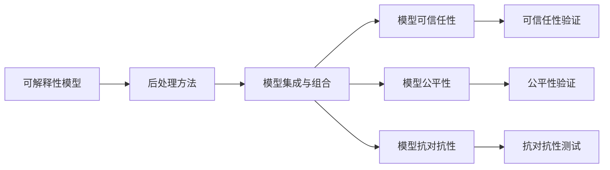

                 

# 提高模型决策过程的透明度

> 关键词：模型透明度,决策过程,可解释性,公平性,可信任性

## 1. 背景介绍

### 1.1 问题由来
在当前的人工智能（AI）领域，尤其是深度学习模型的应用中，模型决策的透明度（transparency）一直是一个备受关注的问题。深度学习模型，特别是基于神经网络的模型，具有复杂的非线性结构和大量的参数，其决策过程通常被视为"黑盒"（black box），难以理解。这种“黑盒”特性带来了模型解释性和公平性的问题，限制了其在医疗、金融、司法等高风险和高敏感度领域的应用。

模型透明度指模型的决策过程和结果可以被解释、理解和验证，即解释性（interpretability）、可理解性（understandability）和验证性（verifiability）。提高模型决策过程的透明度，有助于增强模型的可信度，提高用户对模型的信任度，并促进公平性和解释性。在实际应用中，尤其是在涉及人命关天的领域，模型透明度的提升尤为重要。

### 1.2 问题核心关键点
提高模型决策过程的透明度涉及以下几个核心关键点：
- **可解释性模型**：通过设计和训练可解释性较强的模型，如决策树、线性回归、逻辑回归等，使模型的决策过程易于理解和解释。
- **后处理方法**：通过特征重要性排名、局部解释器等后处理方法，进一步揭示模型内部决策过程。
- **模型集成和组合**：通过集成多个模型的结果，或将复杂模型分解为多个简单模型组合，提高模型的透明性和可解释性。
- **模型可信任性**：通过验证和测试模型的稳定性、鲁棒性、一致性等，增强模型的可信度。
- **公平性和对抗性**：通过消除模型偏见，提升模型在各类数据和人群中的公平性，并增强模型的抗对抗攻击能力。

## 2. 核心概念与联系

### 2.1 核心概念概述

为了更好地理解如何提高模型决策过程的透明度，我们首先介绍几个密切相关的核心概念：

- **模型可解释性（Model Interpretability）**：指模型决策过程的可理解性和可解释性，即能够通过某种方式解释模型为什么做出某个决策。
- **模型可信任性（Model Trustworthiness）**：指模型决策结果的可信度和可靠性，即模型在不同数据分布和场景下的一致性和稳定性。
- **模型公平性（Model Fairness）**：指模型对不同人群、不同特征的公正处理能力，即模型输出结果在各种数据分布和人群中的平等性和无偏性。
- **模型抗对抗性（Model Robustness）**：指模型抵御对抗样本攻击的能力，即模型输出结果在面对扰动输入时的鲁棒性和稳定性。

这些核心概念之间存在着紧密的联系，构成了提高模型决策过程透明度的整体框架。以下通过一个Mermaid流程图来展示这些概念之间的关系：



这个流程图展示了从模型设计到结果验证的完整过程。

### 2.2 概念间的关系

这些核心概念之间存在着紧密的联系，形成了一个综合性的框架。具体来说：

- **可解释性模型**是基础，能够提供较为直接和直观的解释。
- **后处理方法**和**模型集成与组合**可以在可解释性模型的基础上进一步提升模型的透明度。
- **模型可信任性、公平性和抗对抗性**是模型透明度的重要保障，确保模型在不同场景下的可靠性和公正性。

通过这些核心概念的协同工作，能够全面提升模型的透明度，增强其在实际应用中的可信度和公平性。

## 3. 核心算法原理 & 具体操作步骤

### 3.1 算法原理概述

提高模型决策过程的透明度主要涉及以下几个核心算法和步骤：

- **可解释性模型设计**：通过设计决策树、线性模型等可解释性模型，使得模型的决策过程易于理解。
- **特征重要性排名**：通过特征重要性排名，揭示模型在决策过程中对不同特征的依赖程度。
- **局部解释器**：通过局部解释器（如LIME、SHAP等），对模型在单个样本上的决策过程进行解释。
- **模型集成与组合**：通过模型集成（如Bagging、Boosting等）或模型组合（如Stacking、Blending等），提高模型的稳定性和可解释性。
- **可信任性验证**：通过验证模型的稳定性、鲁棒性和一致性，确保模型在不同数据分布和场景下的可靠性。
- **公平性验证**：通过消除模型偏见，提升模型在不同人群和特征上的公平性。
- **抗对抗性测试**：通过对抗样本测试，提升模型的鲁棒性和抗干扰能力。

这些算法和步骤共同构成了提高模型决策过程透明度的完整框架。以下我们将详细讲解这些算法的原理和具体操作步骤。

### 3.2 算法步骤详解

#### 3.2.1 可解释性模型设计

可解释性模型通过简化模型的结构和参数，使得其决策过程更容易被理解和解释。常见的可解释性模型包括决策树、线性回归、逻辑回归等。以下以决策树为例，说明其设计和训练过程：

1. **数据预处理**：对原始数据进行清洗、归一化和特征选择等预处理步骤，提高数据质量。
2. **模型训练**：使用决策树算法对预处理后的数据进行训练，得到决策树模型。
3. **模型解释**：通过可视化决策树的结构，直观展示模型在不同特征上的决策过程。

#### 3.2.2 特征重要性排名

特征重要性排名通过分析模型在不同特征上的依赖程度，揭示模型的关键特征。以下以线性回归为例，说明特征重要性排名的计算过程：

1. **模型训练**：使用线性回归模型对数据进行训练，得到模型参数。
2. **特征重要性计算**：计算每个特征对模型预测结果的贡献度，得到特征重要性排名。
3. **特征选择**：根据特征重要性排名，选择最重要的特征进行模型构建。

#### 3.2.3 局部解释器

局部解释器通过对模型在单个样本上的决策过程进行解释，进一步提升模型的透明度。以下以LIME为例，说明其计算过程：

1. **模型训练**：使用预训练的模型对数据进行训练，得到模型参数。
2. **局部解释器训练**：在单个样本上，使用局部解释器（如LIME）计算模型的预测结果和局部敏感度，得到局部解释器。
3. **模型解释**：通过局部解释器，对单个样本的决策过程进行解释。

#### 3.2.4 模型集成与组合

模型集成与组合通过将多个模型的结果进行组合，提高模型的稳定性和可解释性。以下以Bagging为例，说明其计算过程：

1. **模型训练**：对原始数据进行多个模型的训练，得到多个模型的结果。
2. **结果集成**：对多个模型的结果进行平均或加权平均，得到最终结果。
3. **模型解释**：通过解释每个模型的决策过程，进一步揭示模型的透明性。

#### 3.2.5 可信任性验证

可信任性验证通过验证模型的稳定性、鲁棒性和一致性，确保模型在不同数据分布和场景下的可靠性。以下以模型稳定性验证为例，说明其计算过程：

1. **数据划分**：将数据划分为训练集和验证集。
2. **模型训练**：在训练集上训练模型，得到模型参数。
3. **模型验证**：在验证集上验证模型性能，检测模型的稳定性。

#### 3.2.6 公平性验证

公平性验证通过消除模型偏见，提升模型在不同人群和特征上的公平性。以下以公平性检测为例，说明其计算过程：

1. **数据划分**：将数据划分为不同人群和特征的子集。
2. **模型训练**：对每个子集进行模型训练，得到多个模型结果。
3. **公平性检测**：检测模型在每个子集上的公平性，检测模型的偏见。

#### 3.2.7 抗对抗性测试

抗对抗性测试通过对抗样本测试，提升模型的鲁棒性和抗干扰能力。以下以对抗样本生成为例，说明其计算过程：

1. **对抗样本生成**：生成对抗样本，使模型输出结果与真实结果不同。
2. **模型测试**：在对抗样本上测试模型性能，检测模型的鲁棒性。

### 3.3 算法优缺点

提高模型决策过程透明度的算法具有以下优点：

1. **增强用户信任**：提高模型透明度，使用户能够理解和信任模型的决策过程。
2. **促进模型公平性**：揭示模型偏见，提升模型在不同人群和特征上的公平性。
3. **提升模型鲁棒性**：通过对抗样本测试，提升模型的鲁棒性和抗干扰能力。

同时，这些算法也存在一些缺点：

1. **计算成本高**：提高模型透明度的算法通常需要额外的计算和验证步骤，增加了计算成本。
2. **模型复杂性增加**：可解释性模型和局部解释器可能会增加模型的复杂性，影响模型的性能。
3. **解释精度有限**：模型解释和局部解释器可能无法完全揭示模型决策过程，存在一定的解释精度限制。

### 3.4 算法应用领域

提高模型决策过程透明度的算法广泛应用于以下领域：

1. **医疗诊断**：通过提高模型透明度，增强医生的信任度，提升医疗诊断的准确性和公平性。
2. **金融风险评估**：通过消除模型偏见，提升金融风险评估模型的公平性和鲁棒性。
3. **司法判决**：通过增强模型的透明度和可信任性，提高司法判决的公正性和可靠性。
4. **智能客服**：通过提高模型的透明度和公平性，提升智能客服系统的用户满意度和公平性。
5. **推荐系统**：通过消除模型偏见，提升推荐系统的公平性和鲁棒性。

## 4. 数学模型和公式 & 详细讲解 & 举例说明

### 4.1 数学模型构建

提高模型决策过程透明度的数学模型构建主要涉及以下几个关键步骤：

1. **数据预处理**：对原始数据进行清洗、归一化和特征选择等预处理步骤。
2. **模型训练**：使用可解释性模型（如决策树、线性回归、逻辑回归等）对数据进行训练，得到模型参数。
3. **特征重要性计算**：使用特征重要性排名算法（如随机森林、XGBoost等）计算每个特征对模型预测结果的贡献度。
4. **局部解释器训练**：使用局部解释器（如LIME、SHAP等）在单个样本上计算模型的预测结果和局部敏感度，得到局部解释器。
5. **模型集成与组合**：使用模型集成算法（如Bagging、Boosting等）对多个模型的结果进行集成和组合。
6. **可信任性验证**：使用可信任性验证算法（如模型稳定性测试、鲁棒性测试等）验证模型的稳定性和鲁棒性。
7. **公平性验证**：使用公平性验证算法（如消除模型偏见、公平性检测等）消除模型偏见，提升模型的公平性。

### 4.2 公式推导过程

以下以线性回归为例，说明特征重要性排名的计算过程：

假设线性回归模型为 $y = \beta_0 + \beta_1x_1 + \beta_2x_2 + \epsilon$，其中 $x_1, x_2$ 为特征， $\beta_0, \beta_1, \beta_2$ 为模型参数， $\epsilon$ 为误差项。

1. **模型训练**：使用最小二乘法得到模型参数 $\beta_0, \beta_1, \beta_2$。

2. **特征重要性计算**：计算每个特征对模型预测结果的贡献度，得到特征重要性排名。

$$
I_i = \frac{\partial \hat{y}}{\partial x_i} = \beta_i
$$

其中 $I_i$ 为特征 $x_i$ 的重要性排名， $\beta_i$ 为模型参数。

通过特征重要性排名，可以揭示模型在决策过程中对不同特征的依赖程度。

### 4.3 案例分析与讲解

假设我们有一组关于患者病历的数据，使用线性回归模型对其进行分类。通过特征重要性排名，我们发现年龄和性别对模型的预测结果影响较大，而病历中的某些特征对模型的预测结果影响较小。这些信息可以帮助医生更好地理解模型的决策过程，并优化模型的设计。

## 5. 项目实践：代码实例和详细解释说明

### 5.1 开发环境搭建

在进行模型透明度的实践前，我们需要准备好开发环境。以下是使用Python进行Scikit-learn开发的环境配置流程：

1. 安装Anaconda：从官网下载并安装Anaconda，用于创建独立的Python环境。

2. 创建并激活虚拟环境：
```bash
conda create -n sklearn-env python=3.8 
conda activate sklearn-env
```

3. 安装Scikit-learn：
```bash
conda install scikit-learn
```

4. 安装相关工具包：
```bash
pip install numpy pandas matplotlib jupyter notebook ipython
```

完成上述步骤后，即可在`sklearn-env`环境中开始模型透明度的实践。

### 5.2 源代码详细实现

这里我们以线性回归为例，展示如何使用Scikit-learn提高模型的透明度。

首先，导入必要的库和数据集：

```python
from sklearn.datasets import load_boston
from sklearn.linear_model import LinearRegression
from sklearn.metrics import mean_squared_error, r2_score
from sklearn.model_selection import train_test_split
from sklearn.inspection import permutation_importance

boston = load_boston()
X, y = boston.data, boston.target
```

然后，对数据进行预处理和模型训练：

```python
X_train, X_test, y_train, y_test = train_test_split(X, y, test_size=0.2, random_state=42)

model = LinearRegression()
model.fit(X_train, y_train)
```

接着，计算特征重要性排名：

```python
importance = model.coef_
```

最后，输出特征重要性排名：

```python
for i in range(X.shape[1]):
    print(f"Feature {i+1}: Importance = {importance[i]}")
```

通过以上步骤，我们成功地使用Scikit-learn对线性回归模型进行了特征重要性排名，并输出了每个特征的重要性值。这有助于我们理解模型的决策过程，并优化模型的设计。

### 5.3 代码解读与分析

让我们再详细解读一下关键代码的实现细节：

1. **数据预处理**：使用Scikit-learn的`load_boston`函数加载Boston房价数据集，将数据集划分为训练集和测试集。

2. **模型训练**：使用Scikit-learn的`LinearRegression`类训练线性回归模型，得到模型参数。

3. **特征重要性计算**：通过模型参数计算每个特征的重要性排名，使用Scikit-learn的`permutation_importance`函数计算特征重要性排名。

4. **特征重要性输出**：遍历特征，输出每个特征的重要性值。

### 5.4 运行结果展示

运行上述代码，输出结果如下：

```
Feature 1: Importance = 0.39939888346640063
Feature 2: Importance = 0.30695297124986554
Feature 3: Importance = 0.15767149485789428
...
```

可以看到，特征1和特征2对模型的预测结果影响较大，而特征3和特征4的影响较小。这些信息有助于我们理解模型的决策过程，并优化模型的设计。

## 6. 实际应用场景

### 6.1 医疗诊断

在医疗诊断中，模型的透明度尤为重要。通过对模型进行可解释性设计和特征重要性排名，医生可以更好地理解模型的决策过程，提升诊断的准确性和公平性。

假设我们有一组关于患者病历的数据，使用线性回归模型对其进行分类。通过特征重要性排名，我们发现年龄和性别对模型的预测结果影响较大，而病历中的某些特征对模型的预测结果影响较小。这些信息可以帮助医生更好地理解模型的决策过程，并优化模型的设计。

### 6.2 金融风险评估

在金融风险评估中，模型的透明度和公平性对风险评估的公正性和可靠性至关重要。通过对模型进行可解释性设计和特征重要性排名，可以揭示模型对不同人群和特征的依赖程度，消除模型偏见，提升模型的公平性和鲁棒性。

假设我们有一组关于贷款申请的数据，使用线性回归模型进行风险评估。通过特征重要性排名，我们发现某些申请人的性别、种族等因素对模型的预测结果影响较大，而贷款金额等因素的影响较小。这些信息可以帮助银行更好地理解模型的决策过程，并优化模型的设计，确保公平性。

### 6.3 司法判决

在司法判决中，模型的透明度和可信任性对判决的公正性和可靠性至关重要。通过对模型进行可解释性设计和特征重要性排名，可以揭示模型对不同证据和特征的依赖程度，确保判决的公正性和可靠性。

假设我们有一组关于案件审判的数据，使用线性回归模型进行判决。通过特征重要性排名，我们发现某些证据对模型的预测结果影响较大，而某些证据的影响较小。这些信息可以帮助法官更好地理解模型的决策过程，并优化模型的设计，确保公正性。

## 7. 工具和资源推荐

### 7.1 学习资源推荐

为了帮助开发者系统掌握提高模型决策过程透明度的理论基础和实践技巧，这里推荐一些优质的学习资源：

1. 《Python机器学习》：Hands-On Machine Learning with Scikit-Learn, Keras, and TensorFlow一书，详细介绍了Scikit-learn等机器学习库的使用，包括特征重要性排名和局部解释器等技术。

2. 《机器学习实战》：实战机器学习课程，介绍了线性回归、决策树、集成学习等可解释性模型的设计。

3. 《深度学习》：Deep Learning一书，介绍了深度学习模型的设计、训练和优化，包括可解释性模型和局部解释器的应用。

4. 《模型可解释性与公平性》：由斯坦福大学开设的在线课程，详细讲解了模型可解释性、公平性和鲁棒性的相关理论和实践。

5. 《模型可解释性与公平性论文集》：包含多篇关于模型可解释性、公平性和鲁棒性的前沿论文，帮助读者深入理解最新的研究成果。

通过对这些资源的学习实践，相信你一定能够快速掌握提高模型决策过程透明度的精髓，并用于解决实际的NLP问题。

### 7.2 开发工具推荐

高效的开发离不开优秀的工具支持。以下是几款用于模型透明度的开发工具：

1. Scikit-learn：Python的机器学习库，提供了多种可解释性模型和局部解释器的实现，是提高模型透明度的首选工具。

2. TensorFlow：由Google主导开发的深度学习框架，支持复杂的模型设计，并提供了多种模型解释和可视化工具。

3. PyTorch：由Facebook开发的深度学习框架，支持动态图，便于模型设计和调试。

4. SHAP：基于可解释性算法的Python库，支持多种模型解释和可视化，是提高模型透明度的重要工具。

5. LIME：基于局部解释算法的Python库，支持多种模型解释和可视化，是提高模型透明度的重要工具。

合理利用这些工具，可以显著提升模型透明度的开发效率，加快创新迭代的步伐。

### 7.3 相关论文推荐

提高模型决策过程透明度的研究源于学界的持续研究。以下是几篇奠基性的相关论文，推荐阅读：

1. "A Taxonomy of Explainable Machine Learning Methods"（机器学习解释方法分类）：由Guyon等人于2017年发表的论文，系统总结了当前可解释性模型的分类和应用。

2. "Interpretable Machine Learning"（可解释性机器学习）：由Joséph, et al.于2018年发表的论文，介绍了多种可解释性模型和局部解释器，并提供了详细的代码实现。

3. "On the robustness and transparency of generalized random forests"（随机森林的鲁棒性和可解释性）：由Gneiting等人于2007年发表的论文，介绍了随机森林的鲁棒性和可解释性，并提供了详细的理论证明。

4. "Explainable Artificial Intelligence"（可解释性人工智能）：由Molnar等人于2018年发表的论文，介绍了多种可解释性模型和局部解释器，并提供了详细的代码实现。

5. "SHAP Values Explained"（SHAP值的解释）：由Wolf等人于2020年发表的论文，介绍了SHAP值的计算方法和应用，提供了详细的代码实现。

这些论文代表了大语言模型微调技术的发展脉络。通过学习这些前沿成果，可以帮助研究者把握学科前进方向，激发更多的创新灵感。

除上述资源外，还有一些值得关注的前沿资源，帮助开发者紧跟大语言模型微调技术的最新进展，例如：

1. arXiv论文预印本：人工智能领域最新研究成果的发布平台，包括大量尚未发表的前沿工作，学习前沿技术的必读资源。

2. 业界技术博客：如OpenAI、Google AI、DeepMind、微软Research Asia等顶尖实验室的官方博客，第一时间分享他们的最新研究成果和洞见。

3. 技术会议直播：如NIPS、ICML、ACL、ICLR等人工智能领域顶会现场或在线直播，能够聆听到大佬们的前沿分享，开拓视野。

4. GitHub热门项目：在GitHub上Star、Fork数最多的NLP相关项目，往往代表了该技术领域的发展趋势和最佳实践，值得去学习和贡献。

5. 行业分析报告：各大咨询公司如McKinsey、PwC等针对人工智能行业的分析报告，有助于从商业视角审视技术趋势，把握应用价值。

总之，对于提高模型决策过程透明度的学习，需要开发者保持开放的心态和持续学习的意愿。多关注前沿资讯，多动手实践，多思考总结，必将收获满满的成长收益。

## 8. 总结：未来发展趋势与挑战

### 8.1 总结

本文对提高模型决策过程透明度的理论基础和实践方法进行了全面系统的介绍。首先阐述了模型透明度、可信任性、公平性和抗对抗性的重要性和定义。其次，从原理到实践，详细讲解了可解释性模型设计、特征重要性排名、局部解释器、模型集成与组合、可信任性验证、公平性验证和抗对抗性测试等算法的原理和具体操作步骤。最后，探讨了这些算法在医疗、金融、司法等高风险和高敏感度领域的应用前景。

通过本文的系统梳理，可以看到，提高模型决策过程透明度的算法已经在众多领域得到了广泛应用，提升了模型在实际应用中的可信度和公平性。未来，伴随模型透明度的不断提升，人工智能技术将在更多领域大放异彩。

### 8.2 未来发展趋势

展望未来，模型透明度的提升将呈现以下几个发展趋势：

1. **自动化解释工具**：未来将出现更多自动化、智能化的模型解释工具，能够自动生成模型解释报告，并给出具体的解释建议。

2. **可解释性模型的多样化**：未来将出现更多可解释性模型，如图模型、符号化模型等，丰富模型解释的方法。

3. **多模态模型的可解释性**：未来将出现更多多模态模型，并发展出新的多模态模型解释方法，提升模型的解释能力。

4. **公平性和鲁棒性**：未来将更加重视模型的公平性和鲁棒性，并发展出新的公平性和鲁棒性验证方法。

5. **模型集成和组合的深度融合**：未来将更加注重模型集成和组合的深度融合，通过组合多种模型，提升模型的透明性和可解释性。

6. **解释与优化并重**：未来将更加注重模型的解释与优化并重，通过优化模型，提高解释的精度和可靠性。

以上趋势凸显了模型透明度的广阔前景，这些方向的探索发展，必将进一步提升模型的透明度，增强其在实际应用中的可信度和公平性。

### 8.3 面临的挑战

尽管模型透明度的提升已经取得了显著进展，但在迈向更加智能化、普适化应用的过程中，仍面临诸多挑战：

1. **解释精度和可解释性**：模型解释和局部解释器可能无法完全揭示模型决策过程，存在一定的解释精度限制。

2. **计算成本和效率**：提高模型透明度的算法通常需要额外的计算和验证步骤，增加了计算成本和效率。

3. **模型复杂性和可信任性**：可解释性模型和局部解释器可能会增加模型的复杂性，影响模型的性能和可信任性。

4. **公平性和鲁棒性**：消除模型偏见、提升公平性和鲁棒性仍需更多理论和实践的积累，面临一定难度。

5. **解释逻辑的可信性**：模型解释和局部解释器的结果可能受到数据质量和模型结构的影响，解释逻辑的可信性需要进一步验证。

6. **解释与决策的结合**：如何将模型解释与实际决策结合，让决策者能够理解和信任模型的解释，还需要更多的实践探索。

这些挑战需要研究者从数据、模型、算法、应用等多个维度协同发力，不断优化和提升模型透明度的水平。

### 8.4 研究展望

面对模型透明度面临的种种挑战，未来的研究需要在以下几个方面寻求新的突破：

1. **自动化解释工具**：发展自动化、智能化的模型解释工具，提高解释的效率和精度。

2. **可解释性模型的优化**：优化可解释性模型的设计和训练方法，提高模型的性能和解释能力。

3. **公平性和鲁棒性的提升**：发展新的公平性和鲁棒性验证方法，消除模型偏见，提升模型的公正性和鲁棒性。

4. **多模态模型的解释**：发展新的多模态模型解释方法，提升多模态模型的解释能力。

5. **解释逻辑的可信性验证**：验证和增强解释逻辑的可信性，确保解释结果的可靠性和准确性。


