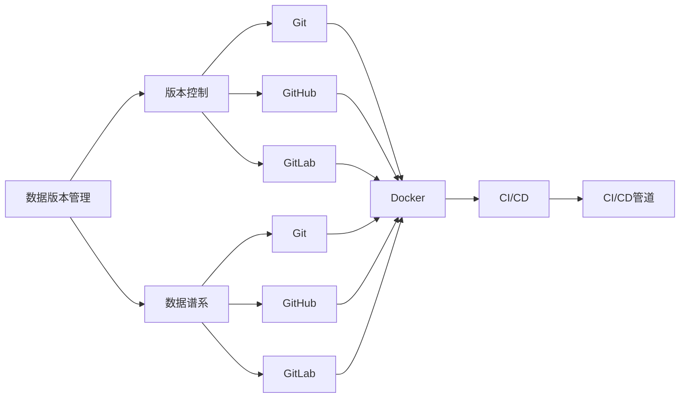
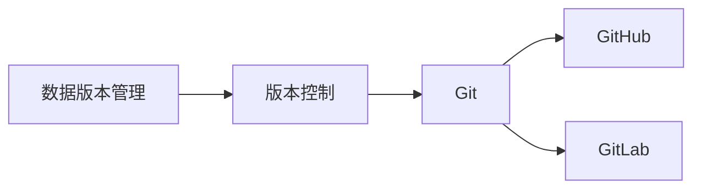
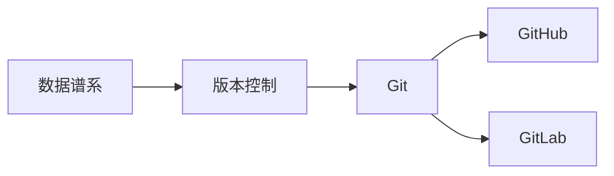
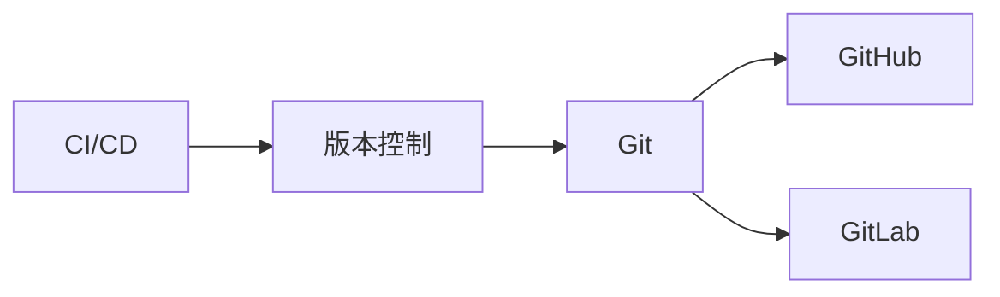

                 

# 数据版本管理与数据谱系原理与代码实战案例讲解

> 关键词：数据版本管理,数据谱系,Git,版本控制,GitHub,GitLab,Docker,CI/CD,CI/CD管道,软件开发生命周期,持续集成,持续交付

## 1. 背景介绍

### 1.1 问题由来
随着软件开发和系统运维的复杂性不断增加，如何有效地管理代码和数据、保证团队协作的高效和数据的安全性，成为了一个重大的问题。特别是在分布式协作、微服务架构、DevOps等现代软件开发生命周期（SDL）下，版本管理和数据谱系变得尤为重要。

数据版本管理和数据谱系，作为数据管理和协同开发的核心技术，对于提升软件开发效率、保障数据质量、推动DevOps文化的普及具有重要意义。传统的数据版本管理和数据谱系管理存在很多问题，如版本冲突、数据丢失、版本混淆等，导致开发者在数据和代码的管理过程中面临诸多困难。

数据版本管理和数据谱系，是指通过对数据和代码的版本信息进行有效管理和追溯，确保数据和代码的完整性、一致性和可靠性，提供版本回退、数据恢复、版本比较等功能。通过版本管理工具和数据谱系工具的结合，可以有效地解决数据和代码的协同开发、版本冲突、数据丢失等问题，提升开发效率和数据质量。

### 1.2 问题核心关键点
数据版本管理和数据谱系，主要关注以下核心点：
1. 数据和代码的版本信息管理，即对数据和代码的版本进行有效记录和管理。
2. 版本回溯和版本比较，即支持开发者对数据和代码进行版本回退和比较。
3. 数据安全和合规性管理，即确保数据和代码的版本变更符合安全标准和合规要求。

这些核心点紧密相连，共同构成了一个高效、可靠的数据版本管理与数据谱系系统。通过系统地管理和追溯数据和代码的版本信息，可以显著提升开发效率、保障数据质量、推动DevOps文化的普及。

### 1.3 问题研究意义
数据版本管理和数据谱系的研究，对于提升软件开发效率、保障数据质量、推动DevOps文化的普及具有重要意义：

1. **提升开发效率**：通过有效的版本管理，减少数据和代码的版本冲突，提高团队协作效率。
2. **保障数据质量**：通过数据谱系管理，确保数据的一致性和完整性，避免数据丢失和污染。
3. **推动DevOps文化**：通过DevOps实践，将版本管理和数据谱系整合到开发流程中，提升软件开发生命周期（SDL）的自动化水平。

数据版本管理和数据谱系的研究，不仅有助于解决数据和代码协同开发的问题，还能推动软件开发生命周期（SDL）的优化和自动化，促进软件开发生命周期（SDL）的持续改进和创新。

## 2. 核心概念与联系

### 2.1 核心概念概述

为更好地理解数据版本管理与数据谱系的原理，本节将介绍几个关键核心概念：

- **数据版本管理（Data Version Management, DVM）**：通过版本控制工具，对数据和代码进行有效管理，支持版本回溯、版本比较等功能。
- **数据谱系（Data Lineage）**：记录数据和代码的来源、使用、变更历史，支持数据和代码的追溯和分析。
- **版本控制（Version Control, VC）**：通过对代码和数据的历史版本进行管理，支持版本回溯、合并冲突等功能。
- **Git**：一种流行的分布式版本控制系统，用于管理代码的版本和变化。
- **GitHub**：一个基于Git的代码托管平台，支持版本控制、协作开发等功能。
- **GitLab**：一个集成了Git、CI/CD等功能的开源平台，支持完整的软件开发生命周期（SDL）管理。
- **Docker**：一种容器化技术，用于构建、存储和分发应用，支持应用的一致性和可移植性。
- **CI/CD**：持续集成和持续交付，通过自动化流程提升软件开发效率和质量。
- **CI/CD管道（CI/CD Pipeline）**：一种自动化集成和交付的流程，通过自动化脚本和工具链支持软件开发的全生命周期。

这些核心概念之间的逻辑关系可以通过以下Mermaid流程图来展示：



这个流程图展示了数据版本管理和数据谱系的核心概念及其之间的关系：

1. 数据版本管理（DVM）通过版本控制工具（VC）进行数据和代码的版本管理，支持版本回溯、合并冲突等。
2. 数据谱系记录数据和代码的来源、使用、变更历史，支持数据和代码的追溯和分析。
3. Git、GitHub、GitLab等工具支持版本控制和协作开发。
4. Docker支持应用的一致性和可移植性。
5. CI/CD和CI/CD管道通过自动化流程提升软件开发效率和质量。

这些概念共同构成了数据版本管理与数据谱系系统的整体架构，确保数据和代码的有效管理和追溯，提升软件开发效率和数据质量。

### 2.2 概念间的关系

这些核心概念之间存在着紧密的联系，形成了数据版本管理与数据谱系的完整生态系统。下面我们通过几个Mermaid流程图来展示这些概念之间的关系。

#### 2.2.1 数据版本管理与版本控制的关系



这个流程图展示了数据版本管理与版本控制之间的关系。数据版本管理通过版本控制工具进行数据和代码的版本管理，支持版本回溯、合并冲突等。

#### 2.2.2 数据谱系与版本控制的关系



这个流程图展示了数据谱系与版本控制之间的关系。数据谱系记录数据和代码的来源、使用、变更历史，支持数据和代码的追溯和分析。

#### 2.2.3 数据版本管理与数据谱系的关系


这个流程图展示了数据版本管理与数据谱系之间的关系。数据版本管理通过版本控制工具进行数据和代码的版本管理，数据谱系记录数据和代码的来源、使用、变更历史，支持数据和代码的追溯和分析。

#### 2.2.4 CI/CD与版本控制的关系



这个流程图展示了CI/CD与版本控制之间的关系。CI/CD通过版本控制工具进行代码和数据的自动化集成和交付，支持自动化流程的自动化。

## 3. 核心算法原理 & 具体操作步骤
### 3.1 算法原理概述

数据版本管理和数据谱系，本质上是通过版本控制工具对数据和代码的历史版本进行管理和追溯。其核心思想是：通过版本控制工具，对数据和代码的版本信息进行有效管理和追溯，确保数据和代码的完整性、一致性和可靠性，提供版本回退、数据恢复、版本比较等功能。

形式化地，假设数据和代码的版本信息为 $V_{t_i}=\{v_1, v_2, ..., v_{t_i}\}$，其中 $t_i$ 为数据和代码的第 $i$ 个版本。定义数据和代码的最新版本为 $V_t$，则数据和代码的历史版本管理可以通过以下步骤进行：

1. 记录数据和代码的每一次变更，生成新的版本信息 $v_{t_i+1}$。
2. 存储历史版本信息 $V_{t_i}$，支持版本回退和版本比较。
3. 提供版本恢复和版本合并功能，确保数据和代码的一致性和完整性。

数据版本管理和数据谱系的核心算法步骤如下：

1. **版本记录和存储**：通过版本控制工具记录数据和代码的每一次变更，生成新的版本信息 $v_{t_i+1}$。
2. **版本回溯和版本比较**：通过版本控制工具的支持，支持版本回溯和版本比较，提供数据和代码的版本历史追溯。
3. **版本恢复和版本合并**：通过版本控制工具的合并策略，支持版本恢复和版本合并，确保数据和代码的一致性和完整性。

### 3.2 算法步骤详解

数据版本管理和数据谱系的核心算法步骤如下：

**Step 1: 版本记录和存储**

通过版本控制工具，记录数据和代码的每一次变更，生成新的版本信息 $v_{t_i+1}$。版本控制工具将每次变更的信息（如变更者、变更时间、变更内容等）记录下来，生成新的版本信息。版本控制工具支持增量变更，避免了数据和代码的重复存储。

**Step 2: 版本回溯和版本比较**

版本控制工具支持版本回溯和版本比较，提供数据和代码的版本历史追溯。版本回溯允许开发者回到历史版本，查看数据和代码的变更历史。版本比较允许开发者比较不同版本之间的差异，确保数据和代码的一致性和完整性。

**Step 3: 版本恢复和版本合并**

版本控制工具支持版本恢复和版本合并，确保数据和代码的一致性和完整性。版本恢复允许开发者恢复到历史版本，恢复数据和代码的完整性。版本合并允许开发者合并不同版本之间的变更，确保数据和代码的一致性。

### 3.3 算法优缺点

数据版本管理和数据谱系算法具有以下优点：

1. **数据和代码的版本信息管理**：通过版本控制工具，对数据和代码的版本信息进行有效管理和追溯，确保数据和代码的完整性、一致性和可靠性。
2. **版本回溯和版本比较**：支持版本回溯和版本比较，提供数据和代码的版本历史追溯。
3. **数据安全和合规性管理**：确保数据和代码的版本变更符合安全标准和合规要求，避免数据泄露和数据滥用。

同时，该算法也存在以下缺点：

1. **依赖版本控制工具**：版本控制工具的选择和配置，对数据版本管理和数据谱系的效果影响较大。
2. **版本冲突处理**：在多人协作开发中，可能会出现版本冲突，需要手动处理，增加了开发者的工作量。
3. **版本历史存储**：版本历史存储需要占用大量存储空间，特别是在版本变更频繁的情况下，可能会影响系统性能。

### 3.4 算法应用领域

数据版本管理和数据谱系算法广泛应用于软件开发、系统运维、数据分析等领域：

- **软件开发**：通过版本控制工具和数据谱系工具，支持软件开发的全生命周期管理，提升开发效率和数据质量。
- **系统运维**：通过版本控制工具和数据谱系工具，支持系统运维的自动化和可视化，提升运维效率和数据质量。
- **数据分析**：通过版本控制工具和数据谱系工具，支持数据分析的全生命周期管理，提升数据质量和分析效率。

除了上述这些应用领域外，数据版本管理和数据谱系算法还在金融、医疗、教育等众多领域得到广泛应用，为这些行业的数据管理和协同开发提供了有力的技术支持。

## 4. 数学模型和公式 & 详细讲解  
### 4.1 数学模型构建

本节将使用数学语言对数据版本管理和数据谱系的原理进行严格刻画。

假设数据和代码的版本信息为 $V_{t_i}=\{v_1, v_2, ..., v_{t_i}\}$，其中 $t_i$ 为数据和代码的第 $i$ 个版本。定义数据和代码的最新版本为 $V_t$，则数据和代码的历史版本管理可以通过以下步骤进行：

1. 记录数据和代码的每一次变更，生成新的版本信息 $v_{t_i+1}$。
2. 存储历史版本信息 $V_{t_i}$，支持版本回退和版本比较。
3. 提供版本恢复和版本合并功能，确保数据和代码的一致性和完整性。

### 4.2 公式推导过程

以下我们以二叉树模型为例，推导数据版本管理和数据谱系的基本模型。

假设数据和代码的版本变更树形结构为 $T=\{V_{t_1}, V_{t_2}, ..., V_{t_n}\}$，其中 $V_{t_i}$ 为第 $i$ 个版本，$V_{t_i} \in \{0, 1\}$ 表示该版本是否为最新版本。则数据版本管理和数据谱系的基本模型可以表示为：

$$
T = \{V_{t_1}, V_{t_2}, ..., V_{t_n}\}
$$

其中 $V_{t_i}$ 的值为 $0$ 或 $1$，表示该版本是否为最新版本。

### 4.3 案例分析与讲解

假设某开发团队在GitHub上使用版本控制工具进行数据版本管理，并记录了数据和代码的每一次变更。版本变更树形结构如下：

```
    V_{t_1} = 0
     /
    |--- V_{t_2} = 1
     /
    |--- V_{t_3} = 0
     /
    |--- V_{t_4} = 1
```

其中 $V_{t_1}$ 为最新版本，$V_{t_2}$、$V_{t_3}$、$V_{t_4}$ 为历史版本。

1. **版本记录和存储**

通过版本控制工具，记录数据和代码的每一次变更，生成新的版本信息 $v_{t_i+1}$。版本控制工具将每次变更的信息（如变更者、变更时间、变更内容等）记录下来，生成新的版本信息。

2. **版本回溯和版本比较**

版本控制工具支持版本回溯和版本比较，提供数据和代码的版本历史追溯。版本回溯允许开发者回到历史版本，查看数据和代码的变更历史。版本比较允许开发者比较不同版本之间的差异，确保数据和代码的一致性和完整性。

3. **版本恢复和版本合并**

版本控制工具支持版本恢复和版本合并，确保数据和代码的一致性和完整性。版本恢复允许开发者恢复到历史版本，恢复数据和代码的完整性。版本合并允许开发者合并不同版本之间的变更，确保数据和代码的一致性。

## 5. 项目实践：代码实例和详细解释说明
### 5.1 开发环境搭建

在进行数据版本管理与数据谱系实践前，我们需要准备好开发环境。以下是使用Python进行Git进行版本控制工具开发的环境配置流程：

1. 安装Anaconda：从官网下载并安装Anaconda，用于创建独立的Python环境。

2. 创建并激活虚拟环境：
```bash
conda create -n git-env python=3.8 
conda activate git-env
```

3. 安装Git：从官网下载安装Git，并设置全局配置。

4. 安装Python Git库：
```bash
pip install gitpython
```

5. 安装GitHub API库：
```bash
pip install github3
```

完成上述步骤后，即可在`git-env`环境中开始版本控制工具开发。

### 5.2 源代码详细实现

这里我们以Git版本控制工具为例，给出Python实现的代码实例。

首先，定义Git版本控制类：

```python
from git import Repo

class GitControl:
    def __init__(self, repo_url, branch_name='main'):
        self.repo_url = repo_url
        self.branch_name = branch_name
        self.repo = Repo(self.repo_url)
        self.current_branch = self.repo.active_branch

    def fetch_changes(self, commit_id):
        self.repo.git.fetch(f'origin {commit_id}')
        self.repo.git.checkout(commit_id)

    def merge_changes(self, commit_id):
        self.repo.git.merge(commit_id)
        self.repo.git.checkout(self.branch_name)

    def revert_changes(self, commit_id):
        self.repo.git.revert(commit_id)
        self.repo.git.checkout(self.branch_name)
```

接着，定义Git版本控制类的实例方法：

```python
# 创建Git控制实例
git = GitControl('https://github.com/username/repo.git')

# 获取分支历史
print(git.repo.history())

# 获取历史提交记录
for commit in git.repo.iter_commits():
    print(commit)

# 分支切换
git.current_branch = 'branch1'
git.repo.git.checkout('branch1')

# 合并分支变更
git.merge_changes('commit_id')

# 回滚分支变更
git.revert_changes('commit_id')
```

这里我们通过GitPython库实现了Git版本控制的基本功能，包括分支切换、合并变更、回滚变更等。通过这个简单的代码实例，可以直观地理解Git版本控制的基本实现原理。

### 5.3 代码解读与分析

让我们再详细解读一下关键代码的实现细节：

**GitControl类**：
- `__init__`方法：初始化Git版本控制实例，包括仓库地址和分支名。
- `fetch_changes`方法：从远程仓库获取指定提交ID的变更记录，并将其应用到本地仓库中。
- `merge_changes`方法：将指定提交ID的变更记录合并到当前分支中。
- `revert_changes`方法：将指定提交ID的变更记录回滚到当前分支中。

**实例方法**：
- 创建Git控制实例：通过仓库地址和分支名创建Git控制实例。
- 获取分支历史：使用`repo.history()`方法获取当前分支的历史提交记录。
- 获取历史提交记录：通过`repo.iter_commits()`方法获取历史提交记录，并对每个提交记录进行遍历。
- 分支切换：通过`repo.git.checkout()`方法切换分支。
- 合并分支变更：通过`repo.git.merge()`方法合并指定提交ID的变更记录。
- 回滚分支变更：通过`repo.git.revert()`方法回滚指定提交ID的变更记录。

通过这个代码实例，可以直观地理解Git版本控制的基本实现原理。在实际开发中，还需要进一步优化和完善，以满足更复杂的需求。

### 5.4 运行结果展示

假设我们在GitHub上维护一个项目，版本变更树形结构如下：

```
    commit_id_1
     /
    |--- commit_id_2
     /
    |--- commit_id_3
```

我们可以使用以下代码片段进行分支变更和恢复操作：

```python
# 创建Git控制实例
git = GitControl('https://github.com/username/repo.git')

# 获取分支历史
print(git.repo.history())

# 获取历史提交记录
for commit in git.repo.iter_commits():
    print(commit)

# 分支切换
git.current_branch = 'branch1'
git.repo.git.checkout('branch1')

# 合并分支变更
git.merge_changes('commit_id_2')

# 回滚分支变更
git.revert_changes('commit_id_2')
```

在这个代码实例中，我们首先创建了一个Git控制实例，然后获取了分支历史和历史提交记录，进行了分支切换和合并变更操作。最后，通过回滚变更操作恢复了分支历史。

## 6. 实际应用场景
### 6.1 智能客服系统

智能客服系统需要维护大量的对话数据和用户反馈，确保数据的完整性和一致性，是数据版本管理和数据谱系的重要应用场景之一。通过Git版本控制工具和数据谱系工具，可以有效地管理和追溯对话数据和用户反馈的变更历史，确保数据的完整性和一致性。

在技术实现上，可以收集企业内部的历史客服对话记录和用户反馈数据，将其作为版本控制和数据谱系的对象，进行有效的版本管理和追溯。通过版本控制工具和数据谱系工具的支持，智能客服系统能够实时监测对话数据和用户反馈的变更历史，一旦发现数据变更异常，系统便会自动预警，帮助客服团队及时应对问题。

### 6.2 金融舆情监测

金融机构需要实时监测市场舆论动向，以便及时应对负面信息传播，规避金融风险。传统的人工监测方式成本高、效率低，难以应对网络时代海量信息爆发的挑战。通过Git版本控制工具和数据谱系工具，可以有效地管理和追溯金融舆情监测的相关数据，确保数据的完整性和一致性。

具体而言，可以收集金融领域相关的新闻、报道、评论等文本数据，并将其作为版本控制和数据谱系的对象，进行有效的版本管理和追溯。通过版本控制工具和数据谱系工具的支持，金融舆情监测系统能够实时监测金融舆情监测的数据变更历史，一旦发现数据异常，系统便会自动预警，帮助金融机构及时应对潜在风险。

### 6.3 个性化推荐系统

当前的推荐系统往往只依赖用户的历史行为数据进行物品推荐，无法深入理解用户的真实兴趣偏好。通过Git版本控制工具和数据谱系工具，可以有效地管理和追溯用户行为数据的变更历史，确保数据的完整性和一致性。

在技术实现上，可以收集用户浏览、点击、评论、分享等行为数据，并将其作为版本控制和数据谱系的对象，进行有效的版本管理和追溯。通过版本控制工具和数据谱系工具的支持，个性化推荐系统能够实时监测用户行为数据的变更历史，一旦发现用户行为异常，系统便会自动预警，帮助推荐系统及时调整推荐策略。

### 6.4 未来应用展望

随着Git版本控制工具和数据谱系工具的不断发展，数据版本管理和数据谱系的应用范围将不断扩大，为各行各业的数据管理和协同开发提供有力的技术支持。

在智慧医疗领域，基于Git版本控制工具和数据谱系工具的医疗问答、病历分析、药物研发等应用将提升医疗服务的智能化水平，辅助医生诊疗，加速新药开发进程。

在智能教育领域，Git版本控制工具和数据谱系工具可应用于作业批改、学情分析、知识推荐等方面，因材施教，促进教育公平，提高教学质量。

在智慧城市治理中，Git版本控制工具和数据谱系工具可用于城市事件监测、舆情分析、应急指挥等环节，提高城市管理的自动化和智能化水平，构建更安全、高效的未来城市。

此外，在企业生产、社会治理、文娱传媒等众多领域，Git版本控制工具和数据谱系工具的应用也将不断涌现，为经济社会发展注入新的动力。

## 7. 工具和资源推荐
### 7.1 学习资源推荐

为了帮助开发者系统掌握数据版本管理与数据谱系的技术基础和实践技巧，这里推荐一些优质的学习资源：

1. **《Git权威指南》**：详细介绍了Git的版本控制原理和基本使用方法，适合初学者入门。

2. **《数据版本管理：理论与实践》**：介绍了数据版本管理的基本概念和实践方法，适合从事数据管理工作的开发者。

3. **《GitLab 权威指南》**：介绍了GitLab的功能和使用方法，适合GitLab用户进行实践。

4. **《Docker 入门与实战》**：介绍了Docker的基本概念和实践方法，适合容器化开发。

5. **《CI/CD 实践指南》**：介绍了CI/CD的基本概念和实践方法，适合DevOps工程师进行实践。

6. **《持续交付：构建可伸缩的开发流程》**：介绍了持续交付的实践方法，适合软件开发团队进行实践。

通过对这些资源的学习实践，相信你一定能够快速掌握数据版本管理与数据谱系的精髓，并用于解决实际的数据管理和协同开发问题。

### 7.2 开发工具推荐

高效的开发离不开优秀的工具支持。以下是几款用于数据版本管理和数据谱系开发的常用工具：

1. **Git**：一个流行的分布式版本控制系统，用于管理代码的版本和变化。

2. **GitHub**：一个基于Git的代码托管平台，支持版本控制、协作开发等功能。

3. **GitLab**：一个集成了Git、CI/CD等功能的开源平台，支持完整的软件开发生命周期（SDL）管理。

4. **Docker**：一种容器化技术，用于构建、存储和分发应用，支持应用的一致性和可移植性。

5. **CI/CD**：持续集成和持续交付，通过自动化流程提升软件开发效率和质量。

6. **Jenkins**：一个开源的自动化集成工具，支持各种插件和扩展，适合CI/CD实践。

合理利用这些工具，可以显著提升数据版本管理和数据谱系开发的效率，加快创新迭代的步伐。

### 7.3 相关论文推荐

数据版本管理和数据谱系的研究源于学界的持续研究。以下是几篇奠基性的相关论文，推荐阅读：

1. **《数据版本管理：理论、模型与实现》**：详细介绍了数据版本管理的基本理论和实现方法。

2. **《数据谱系：理论与实践》**：介绍了数据谱系的基本概念和实践方法。

3. **《Git 核心设计》**：详细介绍了Git的核心设计原理和实现方法。

4. **《Docker 核心设计》**：详细介绍了Docker的核心设计原理和实现方法。

5. **《CI/CD 实践指南》**：介绍了CI/CD的基本概念和实践方法。

这些论文代表了大数据版本管理和数据谱系的研究脉络。通过学习这些前沿成果，可以帮助研究者把握学科前进方向，激发更多的创新灵感。

除上述资源外，还有一些值得关注的前沿资源，帮助开发者紧跟数据版本管理和数据谱系技术的最新进展，例如：

1. **arXiv论文预印本**：人工智能领域最新研究成果的发布平台，包括大量尚未发表的前沿工作，学习前沿技术的必读资源。

2. **GitHub开源项目**：在GitHub上Star、Fork数最多的数据版本管理和数据谱系相关项目，往往代表了该技术

