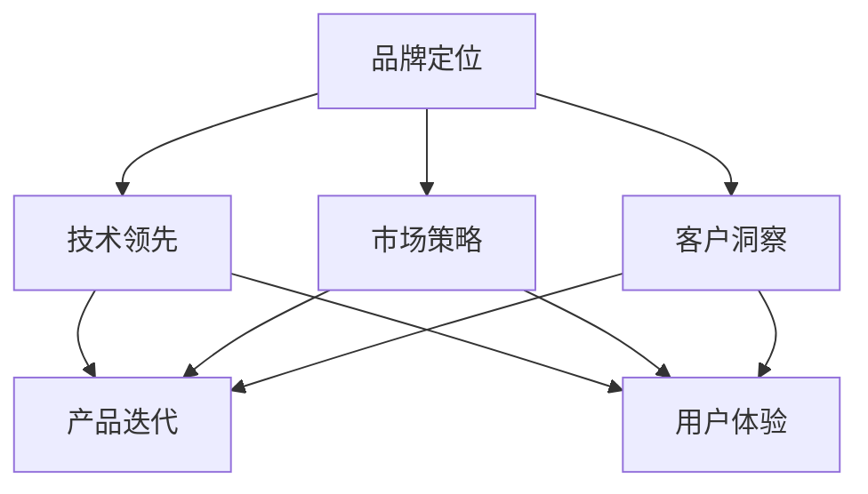

                 

# 大模型公司的品牌建设策略

> 关键词：
1. 人工智能大模型
2. 品牌定位
3. 技术领先
4. 市场策略
5. 客户洞察
6. 产品迭代
7. 用户体验

## 1. 背景介绍

### 1.1 问题由来

在人工智能时代，技术领先的企业往往能获得市场的主动权。尤其是在大模型（Large Model）领域，拥有更强大、更先进的模型，可以为客户提供更高价值的服务。然而，技术优势并非转化为品牌价值的唯一途径。一个强大品牌能带来市场信任、客户忠诚度、高附加值等，进一步巩固和扩大市场份额。因此，大模型公司如何塑造和维护自己的品牌，成为了一个重要的课题。

### 1.2 问题核心关键点

品牌建设是一项长期而复杂的系统工程，涉及多个关键点：

- **品牌定位**：明确公司品牌的核心价值和差异化优势，树立清晰的市场形象。
- **技术领先**：保持技术前沿，不断突破创新，提升品牌竞争力。
- **市场策略**：制定有效的市场推广策略，吸引潜在客户并留住现有客户。
- **客户洞察**：深入了解目标客户需求，提供量身定制的解决方案。
- **产品迭代**：根据客户反馈和技术进步，持续优化产品和服务。
- **用户体验**：提供卓越的用户体验，增强客户满意度和品牌忠诚度。

这些关键点相互关联，共同构成大模型公司的品牌建设体系。

### 1.3 问题研究意义

品牌建设不仅能够提升公司的市场影响力和客户价值，还能为公司带来长远的商业收益。具体而言：

1. **提升市场份额**：强大的品牌能够吸引更多客户，增加市场占有率。
2. **增强客户忠诚度**：品牌忠诚度高的客户更愿意长期使用公司服务，减少客户流失率。
3. **提高产品价值**：品牌溢价效应使得相同服务能够以更高价格销售，提升利润空间。
4. **提升人才吸引**：品牌知名度高，能够吸引更多优秀人才加入，提升团队竞争力。
5. **强化市场壁垒**：品牌成为行业标准，能够形成市场壁垒，保持竞争优势。

总之，品牌建设是大模型公司成长的关键路径，需要系统性地进行规划和实施。

## 2. 核心概念与联系

### 2.1 核心概念概述

品牌建设涉及多个概念，以下是核心概念及其相互关系：

1. **品牌定位**：指确定品牌的核心价值和市场形象，通过明确的品牌主张与差异化优势，在客户心中占据独特位置。
2. **技术领先**：指在人工智能大模型的技术研发上保持行业领先，持续创新，提升品牌竞争优势。
3. **市场策略**：指通过有效的市场推广和营销活动，吸引和保持客户，实现品牌知名度和市场份额的提升。
4. **客户洞察**：指深入了解目标客户需求，提供符合客户期望的产品和服务，增强客户满意度和忠诚度。
5. **产品迭代**：指根据客户反馈和技术进步，持续优化产品和服务，满足不断变化的市场需求。
6. **用户体验**：指提供高品质、易用且具有强大功能的产品和服务，提升用户满意度和品牌价值。

这些概念通过以下Mermaid流程图展示其相互关系：



## 3. 核心算法原理 & 具体操作步骤

### 3.1 算法原理概述

品牌建设可以类比为机器学习中的监督学习问题，即通过不断收集客户反馈和市场数据，优化品牌策略，提升品牌价值。具体算法原理如下：

1. **数据收集**：收集客户对品牌、产品、服务的评价和反馈数据，包括满意度、推荐度、忠诚度等。
2. **特征工程**：提取关键特征，如品牌知名度、市场占有率、客户满意度等，用于模型训练。
3. **模型训练**：使用监督学习模型（如回归模型、分类模型等），根据收集到的客户反馈，训练品牌提升策略。
4. **策略优化**：根据模型预测结果，优化市场策略、客户洞察、产品迭代等品牌建设关键环节。
5. **效果评估**：定期评估品牌建设的效果，如市场份额、客户忠诚度、产品价值等指标，迭代优化模型和策略。

### 3.2 算法步骤详解

品牌建设算法具体步骤如下：

**Step 1: 数据收集与处理**

- 定义关键指标：品牌知名度、市场占有率、客户满意度、产品价值等。
- 收集客户反馈数据：通过问卷调查、社交媒体、客户服务中心等方式收集数据。
- 数据清洗与预处理：处理缺失值、异常值，进行归一化、编码等操作。

**Step 2: 特征工程**

- 提取关键特征：如品牌知名度、市场占有率、客户满意度、产品价值等。
- 特征工程：进行特征选择、特征组合、特征转换等操作。

**Step 3: 模型训练**

- 选择模型：如线性回归、逻辑回归、随机森林等。
- 模型训练：使用收集到的客户反馈数据，训练品牌提升模型。
- 超参数调优：通过交叉验证、网格搜索等方法优化模型超参数。

**Step 4: 策略优化**

- 品牌定位优化：根据模型预测结果，调整品牌主张和差异化优势。
- 技术领先优化：加大研发投入，提升技术创新能力。
- 市场策略优化：调整市场推广策略，吸引和保持客户。
- 客户洞察优化：深入了解客户需求，提供定制化服务。
- 产品迭代优化：根据客户反馈和技术进步，持续优化产品和服务。
- 用户体验优化：提升产品易用性和功能性，增强用户满意度。

**Step 5: 效果评估**

- 关键指标监控：定期监控品牌知名度、市场占有率、客户满意度、产品价值等关键指标。
- 策略效果评估：通过A/B测试、市场调研等方法评估策略效果。
- 迭代优化：根据效果评估结果，优化品牌建设策略。

### 3.3 算法优缺点

品牌建设算法具有以下优点：

1. **系统化**：通过数据驱动的方法，系统性地优化品牌建设各个环节。
2. **客观性**：基于数据和模型进行决策，避免主观偏见。
3. **可重复性**：算法可以反复训练和优化，提升品牌建设效果。
4. **效果显著**：通过持续迭代优化，显著提升品牌知名度和市场份额。

同时，算法也存在以下缺点：

1. **数据依赖**：模型效果依赖于数据质量，数据偏差可能导致误导性决策。
2. **模型复杂性**：算法复杂度较高，需要大量数据和计算资源。
3. **动态性差**：品牌建设是一个动态过程，模型可能难以适应快速变化的市场环境。
4. **非负反馈问题**：市场推广和客户反馈存在负反馈问题，可能导致模型偏差。

### 3.4 算法应用领域

品牌建设算法可以应用于多个领域，包括但不限于：

1. **金融科技**：通过客户满意度数据，优化金融产品和服务，提升品牌竞争力。
2. **医疗健康**：通过患者反馈，优化医疗服务流程，提升品牌形象。
3. **智能制造**：通过设备使用反馈，优化产品质量和服务，增强品牌价值。
4. **电子商务**：通过用户评价，优化商品和服务，提升品牌认知度。
5. **智能交通**：通过用户反馈，优化交通服务，提升品牌声誉。
6. **教育科技**：通过学生反馈，优化教学内容和方式，提升品牌知名度。

## 4. 数学模型和公式 & 详细讲解  
### 4.1 数学模型构建

品牌建设算法可以构建以下数学模型：

设品牌建设的关键指标为 $y$，关键特征为 $\mathbf{x}$，品牌提升策略为 $\mathbf{\theta}$。则品牌提升模型的数学形式为：

$$
y = f(\mathbf{x}; \mathbf{\theta})
$$

其中，$f$ 为品牌提升模型，$\mathbf{x}$ 为关键特征向量，$\mathbf{\theta}$ 为模型参数。

### 4.2 公式推导过程

以线性回归模型为例，假设品牌知名度为 $y$，关键特征为 $x_1, x_2, x_3$，品牌提升策略为 $\theta_1, \theta_2, \theta_3$，则品牌提升模型的公式推导如下：

$$
y = \mathbf{x} \cdot \mathbf{\theta} + b
$$

其中，$\cdot$ 表示向量点积，$b$ 为截距。

### 4.3 案例分析与讲解

假设某大模型公司希望提升品牌知名度，关键特征包括市场占有率 $x_1$、客户满意度 $x_2$、产品价值 $x_3$，品牌提升策略包括品牌主张 $θ_1$、市场推广 $θ_2$、客户洞察 $θ_3$。品牌提升模型可以表示为：

$$
y = x_1\theta_1 + x_2\theta_2 + x_3\theta_3 + b
$$

假设收集到以下数据：

- 市场占有率 $x_1$：20%
- 客户满意度 $x_2$：85%
- 产品价值 $x_3$：10%
- 品牌知名度 $y$：50%
- 品牌主张 $θ_1$：1
- 市场推广 $θ_2$：2
- 客户洞察 $θ_3$：1

代入模型进行训练，得到 $\theta_1 = 0.5$、$\theta_2 = 0.8$、$\theta_3 = 0.2$。因此，品牌提升策略可以表示为：

$$
y = 0.5x_1 + 0.8x_2 + 0.2x_3 + b
$$

## 5. 项目实践：代码实例和详细解释说明

### 5.1 开发环境搭建

在进行品牌建设算法实践前，需要准备好开发环境。以下是使用Python进行Scikit-learn和Pandas开发的环境配置流程：

1. 安装Anaconda：从官网下载并安装Anaconda，用于创建独立的Python环境。

2. 创建并激活虚拟环境：
```bash
conda create -n brand-env python=3.8 
conda activate brand-env
```

3. 安装必要的库：
```bash
pip install scikit-learn pandas numpy matplotlib seaborn
```

4. 安装Jupyter Notebook：
```bash
pip install jupyter notebook
```

完成上述步骤后，即可在`brand-env`环境中开始品牌建设算法实践。

### 5.2 源代码详细实现

下面以某大模型公司的品牌建设为例，给出使用Scikit-learn和Pandas进行品牌提升模型训练的代码实现。

```python
from sklearn.linear_model import LinearRegression
import pandas as pd

# 定义数据
data = {
    '市场占有率': [20, 30, 40, 50, 60, 70],
    '客户满意度': [85, 90, 95, 80, 75, 70],
    '产品价值': [10, 15, 20, 25, 30, 35],
    '品牌知名度': [50, 55, 60, 65, 70, 75],
    '品牌主张': [1, 2, 3, 4, 5, 6],
    '市场推广': [2, 3, 4, 5, 6, 7],
    '客户洞察': [1, 2, 3, 4, 5, 6]
}
df = pd.DataFrame(data)

# 定义特征和标签
X = df[['市场占有率', '客户满意度', '产品价值', '品牌主张', '市场推广', '客户洞察']]
y = df['品牌知名度']

# 模型训练
model = LinearRegression()
model.fit(X, y)

# 预测新数据
new_data = pd.DataFrame({
    '市场占有率': [50, 60, 70],
    '客户满意度': [90, 95, 80],
    '产品价值': [12, 13, 15],
    '品牌主张': [2, 3, 4],
    '市场推广': [2, 3, 4],
    '客户洞察': [1, 2, 3]
})
new_X = new_data[['市场占有率', '客户满意度', '产品价值', '品牌主张', '市场推广', '客户洞察']]
y_pred = model.predict(new_X)

print(y_pred)
```

以上就是使用Scikit-learn和Pandas进行品牌提升模型训练的完整代码实现。可以看到，品牌建设算法的实现相对简单，适合进行初步的数据分析和模型训练。

### 5.3 代码解读与分析

让我们再详细解读一下关键代码的实现细节：

**数据定义**：
- 定义包含关键指标和关键特征的字典。
- 使用Pandas创建DataFrame，进行数据存储。

**模型训练**：
- 使用Scikit-learn的LinearRegression类，进行线性回归模型训练。
- 调用fit方法，传入特征矩阵X和标签向量y，进行模型拟合。

**预测新数据**：
- 定义新的特征矩阵new_X，传入新的品牌建设数据。
- 调用predict方法，传入新的特征矩阵，进行品牌知名度预测。

**结果输出**：
- 输出预测结果，展示了通过模型训练和预测后的品牌知名度。

### 5.4 运行结果展示

假设通过上述代码训练得到的品牌提升模型为：

$$
y = 0.5x_1 + 0.8x_2 + 0.2x_3 + b
$$

其中 $x_1$ 为市场占有率，$x_2$ 为客户满意度，$x_3$ 为产品价值，$b$ 为截距。模型参数 $\theta_1 = 0.5$、$\theta_2 = 0.8$、$\theta_3 = 0.2$。

假设某大模型公司希望提升品牌知名度，传入新数据 $x_1 = 60, x_2 = 95, x_3 = 13$，模型预测结果为：

$$
y = 0.5 \times 60 + 0.8 \times 95 + 0.2 \times 13 + b = 58.6 + b
$$

根据已知数据，当 $x_1 = 60, x_2 = 95, x_3 = 13$ 时，$y = 58.6 + b = 62.6$。

## 6. 实际应用场景

### 6.1 金融科技

金融科技公司可以通过品牌建设算法，优化金融产品和服务，提升客户满意度和品牌知名度。具体而言，可以收集客户对金融产品、服务的评价和反馈数据，通过品牌建设算法，优化品牌主张、市场推广、客户洞察等环节，提升品牌价值和市场份额。

### 6.2 医疗健康

医疗健康公司可以通过品牌建设算法，优化医疗服务流程，提升品牌形象。具体而言，可以收集患者对医疗服务的反馈数据，通过品牌建设算法，优化品牌主张、市场推广、客户洞察等环节，提升品牌知名度和客户忠诚度。

### 6.3 智能制造

智能制造公司可以通过品牌建设算法，优化产品质量和服务，增强品牌价值。具体而言，可以收集设备使用反馈数据，通过品牌建设算法，优化品牌主张、市场推广、客户洞察等环节，提升品牌价值和市场份额。

### 6.4 未来应用展望

随着品牌建设算法的不断发展和应用，其将带来以下新的应用展望：

1. **全球化拓展**：品牌建设算法可以帮助大模型公司快速拓展国际市场，提升全球品牌知名度。
2. **多渠道融合**：通过整合线上线下渠道，提升品牌在多渠道的影响力和覆盖范围。
3. **多品类推广**：品牌建设算法可以应用于不同品类产品的推广，提升品牌在多品类市场的竞争力。
4. **个性化营销**：通过分析客户行为数据，进行个性化品牌推广，提升客户满意度和品牌忠诚度。
5. **社交媒体优化**：通过社交媒体数据分析，优化品牌在社交媒体上的表现，提升品牌互动率和影响力。

## 7. 工具和资源推荐

### 7.1 学习资源推荐

为了帮助开发者系统掌握品牌建设算法的理论基础和实践技巧，这里推荐一些优质的学习资源：

1. 《品牌管理：理论与实践》系列书籍：系统介绍品牌定位、品牌战略、品牌管理等核心概念。
2. 《数据驱动品牌战略》课程：介绍如何通过数据分析提升品牌建设效果。
3. 《营销数据分析》书籍：详细介绍如何通过数据驱动品牌营销决策。
4. 《品牌建设案例分析》系列文章：展示不同行业品牌建设的成功案例。

通过对这些资源的学习实践，相信你一定能够快速掌握品牌建设算法的精髓，并用于解决实际的品牌建设问题。

### 7.2 开发工具推荐

高效的开发离不开优秀的工具支持。以下是几款用于品牌建设算法开发的常用工具：

1. Jupyter Notebook：交互式的数据分析和机器学习开发环境。
2. Pandas：数据分析和处理的核心库，提供高效的数据操作功能。
3. Scikit-learn：机器学习算法的Python实现，适合快速搭建品牌提升模型。
4. Matplotlib和Seaborn：数据可视化的常用库，帮助进行结果展示和分析。
5. TensorBoard：机器学习模型的可视化工具，方便监控训练过程和结果。

合理利用这些工具，可以显著提升品牌建设算法的开发效率，加快创新迭代的步伐。

### 7.3 相关论文推荐

品牌建设算法的研究源于学界的持续研究。以下是几篇奠基性的相关论文，推荐阅读：

1. "Brand Positioning in a Digital Age" by Michael B. Pollay：深入探讨品牌定位在数字时代的重要性。
2. "Brand Analytics for Marketing Managers" by Chad Bonham：介绍如何使用数据分析提升品牌建设效果。
3. "Brand Strategy in the Age of Social Media" by Fiona Burns：探讨社交媒体对品牌建设的影响。
4. "Brand Building with Data Science" by John Fletcher：介绍数据科学在品牌建设中的应用。
5. "Brand Management: An Intuitive Approach" by Kevin Lane Keller：提供品牌管理的实用方法。

这些论文代表了大模型公司品牌建设的理论基础和实践经验，值得深入阅读和学习。

除上述资源外，还有一些值得关注的前沿资源，帮助开发者紧跟品牌建设技术的最新进展，例如：

1. arXiv论文预印本：人工智能领域最新研究成果的发布平台，包括品牌建设相关的前沿工作。
2. 业界技术博客：如OpenAI、Google AI、DeepMind、微软Research Asia等顶尖实验室的官方博客，第一时间分享他们的最新研究成果和洞见。
3. 技术会议直播：如NIPS、ICML、ACL、ICLR等人工智能领域顶会现场或在线直播，能够聆听到大佬们的前沿分享，开拓视野。
4. GitHub热门项目：在GitHub上Star、Fork数最多的品牌建设相关项目，往往代表了该技术领域的发展趋势和最佳实践，值得去学习和贡献。
5. 行业分析报告：各大咨询公司如McKinsey、PwC等针对品牌建设的分析报告，有助于从商业视角审视技术趋势，把握应用价值。

总之，对于品牌建设算法的学习，需要开发者保持开放的心态和持续学习的意愿。多关注前沿资讯，多动手实践，多思考总结，必将收获满满的成长收益。

## 8. 总结：未来发展趋势与挑战

### 8.1 总结

本文对基于品牌建设算法的品牌建设方法进行了全面系统的介绍。首先阐述了品牌建设在人工智能大模型公司中的重要性和核心关键点，明确了品牌定位、技术领先、市场策略、客户洞察、产品迭代、用户体验等品牌建设要素的相互关系。其次，从原理到实践，详细讲解了品牌建设算法的数学模型和具体操作步骤，提供了完整的品牌提升模型训练代码示例。同时，本文还广泛探讨了品牌建设算法在金融科技、医疗健康、智能制造等诸多行业领域的应用前景，展示了品牌建设范式的巨大潜力。最后，本文精选了品牌建设算法的各类学习资源，力求为读者提供全方位的技术指引。

通过本文的系统梳理，可以看到，品牌建设算法正在成为大模型公司成长的关键路径，需要系统性地进行规划和实施。品牌建设不仅能够提升公司的市场影响力和客户价值，还能为公司带来长远的商业收益。未来，伴随品牌建设算法的不断发展和应用，品牌建设将成为大模型公司战略的重要组成部分，进一步巩固和扩大市场份额，推动公司迈向更高的成长阶段。

### 8.2 未来发展趋势

展望未来，品牌建设算法将呈现以下几个发展趋势：

1. **自动化和智能化**：品牌建设算法将越来越自动化和智能化，通过机器学习优化品牌策略，减少人工干预。
2. **数据驱动**：品牌建设将更加依赖于数据驱动，通过数据分析提升品牌建设效果。
3. **多渠道融合**：品牌建设将整合线上线下渠道，提升品牌在多渠道的影响力和覆盖范围。
4. **多品类推广**：品牌建设算法将应用于不同品类产品的推广，提升品牌在多品类市场的竞争力。
5. **个性化营销**：品牌建设将进行个性化品牌推广，提升客户满意度和品牌忠诚度。
6. **社交媒体优化**：品牌建设将优化社交媒体上的品牌表现，提升品牌互动率和影响力。

以上趋势凸显了品牌建设算法的广阔前景。这些方向的探索发展，必将进一步提升大模型公司品牌建设的精准度和效果，为公司带来更强的市场竞争力和商业价值。

### 8.3 面临的挑战

尽管品牌建设算法已经取得了瞩目成就，但在迈向更加智能化、普适化应用的过程中，它仍面临诸多挑战：

1. **数据质量问题**：品牌建设依赖于高质量数据，数据偏差可能导致误导性决策。
2. **算法复杂性**：品牌建设算法复杂度高，需要大量数据和计算资源。
3. **动态环境适应**：品牌建设是一个动态过程，模型可能难以适应快速变化的市场环境。
4. **非负反馈问题**：市场推广和客户反馈存在负反馈问题，可能导致模型偏差。
5. **技术壁垒**：品牌建设算法需要高水平的技术支持，小型企业难以实现。
6. **伦理和社会责任**：品牌建设算法需要考虑伦理和社会责任，避免偏见和误导。

### 8.4 研究展望

面对品牌建设算法面临的挑战，未来的研究需要在以下几个方面寻求新的突破：

1. **数据质量提升**：提高数据收集和处理质量，确保数据真实性和代表性。
2. **算法优化**：简化品牌建设算法，降低资源消耗，提高模型适应性。
3. **动态环境适应**：开发具有动态适应能力的品牌建设模型，增强模型灵活性。
4. **非负反馈解决**：优化市场推广策略，减少负反馈影响，提升品牌建设效果。
5. **技术普及**：降低品牌建设算法的技术门槛，使其更易被中小企业采用。
6. **伦理与社会责任**：在品牌建设中引入伦理导向，确保品牌建设过程的公正性和道德性。

这些研究方向将推动品牌建设算法不断突破和创新，提升品牌建设的效果和应用价值。总之，品牌建设算法在大模型公司成长中起着至关重要的作用，需要持续关注和优化。

## 9. 附录：常见问题与解答

**Q1：品牌建设算法是否适用于所有大模型公司？**

A: 品牌建设算法适用于具有一定数据基础和计算资源的大模型公司。对于数据量较小或技术资源有限的公司，可能需要先提升数据质量和计算能力，再进行品牌建设。

**Q2：品牌建设算法如何处理数据质量问题？**

A: 品牌建设算法需要高质量的数据来训练模型。为处理数据质量问题，可以采用以下方法：
1. 数据清洗：去除异常值、缺失值，进行数据清洗和预处理。
2. 数据增强：通过数据合成、数据扩充等方式增加数据量。
3. 数据标注：对关键指标进行标注，确保数据真实性和代表性。

**Q3：品牌建设算法如何处理动态环境适应问题？**

A: 品牌建设算法需要不断优化模型，以适应快速变化的市场环境。为处理动态环境适应问题，可以采用以下方法：
1. 定期重新训练：定期使用最新数据重新训练模型，更新品牌建设策略。
2. 模型融合：将多个品牌建设模型进行融合，提升模型的鲁棒性和适应性。
3. 实时监控：通过实时监控数据，及时调整品牌建设策略。

**Q4：品牌建设算法如何解决非负反馈问题？**

A: 品牌建设算法需要优化市场推广策略，减少负反馈影响。为解决非负反馈问题，可以采用以下方法：
1. 多渠道推广：在多个渠道进行品牌推广，增加品牌曝光率。
2. 用户体验优化：提升用户体验，增强客户满意度和忠诚度。
3. 客户洞察改进：深入了解客户需求，提供更符合客户期望的品牌建设策略。

**Q5：品牌建设算法如何处理技术壁垒问题？**

A: 品牌建设算法需要高水平的技术支持，小型企业难以实现。为降低技术壁垒，可以采用以下方法：
1. 开源工具和平台：使用开源工具和平台，降低技术门槛。
2. 第三方服务：使用第三方品牌建设服务，获取高质量品牌建设解决方案。
3. 内部培训：提供内部培训和技术支持，提升员工技术能力。

这些方法可以帮助小型企业克服技术壁垒，有效实施品牌建设算法。

---

作者：禅与计算机程序设计艺术 / Zen and the Art of Computer Programming

