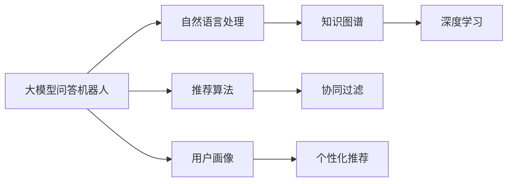

                 

# 大模型问答机器人与搜索推荐的对比

> 关键词：大模型问答机器人,搜索推荐系统,知识图谱,推荐算法,深度学习,协同过滤,用户画像,跨领域迁移学习

## 1. 背景介绍

在人工智能技术不断进步的今天，问答机器人（QA Robot）和搜索推荐系统（Search & Recommendation System）成为了为用户提供智能化服务的重要工具。它们利用深度学习、自然语言处理和信息检索等技术，为用户提供个性化和高效的服务。然而，这两类系统在技术原理、应用场景、性能瓶颈等方面有着显著的差异。本文将深入对比大模型问答机器人和搜索推荐系统，为读者提供更全面的理解和认识。

### 1.1 问题由来

在智能助手领域，大模型问答机器人（QA Robot）与搜索推荐系统（Search & Recommendation System）在商业应用中均占据重要地位。大模型问答机器人通过深度学习模型，在自然语言理解的基础上，对用户输入的问题给出精准的响应。而搜索推荐系统则通过协同过滤、基于内容的推荐算法等，为用户提供个性化内容。两者虽有相似之处，但在技术实现和应用场景上存在显著差异。本文将从背景、核心概念、原理与步骤等多个维度，详细对比两者的优劣。

## 2. 核心概念与联系

### 2.1 核心概念概述

1. **大模型问答机器人**：
   - **定义**：基于深度学习模型，结合自然语言处理和知识图谱等技术，能够对用户输入的问题进行理解和回答的智能系统。
   - **核心技术**：大模型（如BERT、GPT等）、预训练、微调、自然语言理解、知识图谱等。
   - **功能**：用户提问、自然语言理解、上下文处理、知识检索、知识融合、最终回答等。

2. **搜索推荐系统**：
   - **定义**：通过分析用户行为数据，结合协同过滤、基于内容的推荐算法等，为用户提供个性化内容推荐的系统。
   - **核心技术**：协同过滤、基于内容的推荐算法、深度学习、用户画像、个性化推荐等。
   - **功能**：用户行为记录、特征提取、相似度计算、推荐结果排序、个性化推荐等。

### 2.2 核心概念间的关系

通过以下Mermaid流程图，可以直观展示大模型问答机器人和搜索推荐系统的核心概念关系：

这个流程图展示了两者在核心技术层面的共同点，即都使用了深度学习和自然语言处理技术。同时，大模型问答机器人进一步整合了知识图谱技术，以增强其理解复杂问题的能力；而搜索推荐系统则结合了个性化推荐算法，以提供用户定制化的内容。

## 3. 核心算法原理 & 具体操作步骤
### 3.1 算法原理概述

#### 3.1.1 大模型问答机器人
- **算法原理**：大模型问答机器人通过预训练语言模型（如BERT、GPT等）在大规模无标签数据上进行预训练，学习到语言和语义的知识表示。然后通过微调，结合知识图谱，使模型能够处理具体的问答问题。
- **关键技术**：
  - **预训练**：在大规模无标签数据上自监督学习，如掩码语言模型（Masked Language Modeling, MLM）。
  - **微调**：在少量有标签的问答数据上进行监督学习，调整模型以适应特定任务。
  - **自然语言理解**：利用语言模型、向量空间模型等方法对用户输入的文本进行处理。
  - **知识图谱**：将知识图谱融入模型，增强对知识库中事实的检索和推理。

#### 3.1.2 搜索推荐系统
- **算法原理**：搜索推荐系统通过用户历史行为数据，利用协同过滤、基于内容的推荐算法等，生成个性化的推荐结果。
- **关键技术**：
  - **协同过滤**：基于用户和物品相似度的推荐算法，如基于用户的协同过滤、基于物品的协同过滤。
  - **基于内容的推荐算法**：利用物品特征和用户偏好进行推荐，如矩阵分解、深度学习等。
  - **用户画像**：通过用户行为数据和特征构建用户画像，实现更精准的个性化推荐。
  - **个性化推荐**：根据用户画像和推荐算法，生成符合用户兴趣的推荐结果。

### 3.2 算法步骤详解

#### 3.2.1 大模型问答机器人
1. **数据准备**：
   - 收集并标注问答数据集。
   - 预处理数据，如分词、去除停用词等。

2. **模型构建**：
   - 加载预训练语言模型，如BERT、GPT等。
   - 设计任务适配层，如上下文编码器、逻辑回归输出层等。

3. **微调**：
   - 在问答数据集上微调模型。
   - 调整学习率、批大小等超参数。

4. **推理**：
   - 对用户输入的文本进行编码和解码。
   - 根据推理策略生成答案。

#### 3.2.2 搜索推荐系统
1. **数据准备**：
   - 收集用户行为数据，如浏览、点击、购买等。
   - 处理数据，如特征提取、归一化等。

2. **模型构建**：
   - 设计推荐模型，如基于协同过滤的模型、基于内容的模型等。
   - 设计用户画像模型，如向量空间模型、神经网络模型等。

3. **训练**：
   - 在用户行为数据上训练推荐模型和用户画像模型。
   - 调整超参数，如学习率、迭代次数等。

4. **推荐**：
   - 对新用户输入进行特征提取。
   - 利用推荐算法生成推荐结果。

### 3.3 算法优缺点

#### 3.3.1 大模型问答机器人
- **优点**：
  - **跨领域迁移能力强**：预训练语言模型能够适应多种类型的问答问题。
  - **知识图谱增强**：结合知识图谱，能够处理复杂的查询和推理任务。
  - **自然语言理解力强**：结合上下文和语义，能够理解和回答自然语言问题。

- **缺点**：
  - **高昂的预训练成本**：预训练模型需要大量的计算资源和时间。
  - **过拟合风险高**：微调过程中，模型可能过拟合少量标注数据。
  - **上下文关联性强**：对于复杂的自然语言问题，上下文关联性可能导致推理错误。

#### 3.3.2 搜索推荐系统
- **优点**：
  - **高效性**：推荐算法能够快速生成个性化推荐结果。
  - **适应性强**：能够快速适应新用户和新物品。
  - **用户反馈机制**：能够及时根据用户反馈调整推荐策略。

- **缺点**：
  - **数据依赖性强**：推荐系统依赖于用户行为数据，缺乏对未发生行为的预测能力。
  - **推荐冷启动问题**：新用户的推荐结果较差。
  - **多样性问题**：推荐结果可能缺乏多样性，导致用户“茧房效应”。

### 3.4 算法应用领域

#### 3.4.1 大模型问答机器人
- **应用领域**：
  - **智能客服**：如银行、电商等客服场景。
  - **医疗咨询**：如在线医疗问答系统。
  - **教育辅导**：如在线教育平台的智能辅导系统。

#### 3.4.2 搜索推荐系统
- **应用领域**：
  - **电商推荐**：如亚马逊、淘宝等电商平台的商品推荐系统。
  - **视频推荐**：如YouTube、Netflix等视频平台的个性化推荐。
  - **新闻推荐**：如今日头条、搜狐新闻等新闻平台的个性化推荐。

## 4. 数学模型和公式 & 详细讲解  
### 4.1 数学模型构建

**大模型问答机器人**：
- **数学模型**：
  - 输入：用户输入的自然语言问题 $q$。
  - 输出：模型给出的答案 $a$。
  - 模型：$M = \{MLM, KG, TF, O\}$，其中 $MLM$ 表示预训练语言模型，$KG$ 表示知识图谱，$TF$ 表示上下文编码器，$O$ 表示逻辑回归输出层。

**搜索推荐系统**：
- **数学模型**：
  - 输入：用户的历史行为数据 $b$。
  - 输出：推荐结果 $r$。
  - 模型：$M = \{CF, DM, UW, R\}$，其中 $CF$ 表示协同过滤算法，$DM$ 表示深度学习模型，$UW$ 表示用户画像模型，$R$ 表示推荐结果排序算法。

### 4.2 公式推导过程

**大模型问答机器人**：
- **公式推导**：
  - 输入问题 $q$，通过语言模型得到表示 $v_q = MLM(q)$。
  - 将 $v_q$ 与知识图谱中的实体 $e$ 匹配，得到 $v_e = KG(v_q, e)$。
  - 结合上下文编码器 $TF(v_q, v_e)$，得到问题-答案表示 $v_{qe}$。
  - 使用逻辑回归输出层 $O(v_{qe})$，得到答案概率 $p(a|q)$。

**搜索推荐系统**：
- **公式推导**：
  - 用户历史行为 $b$，通过协同过滤算法得到用户画像 $u_b = CF(b)$。
  - 物品特征 $f_i$，通过深度学习模型得到物品表示 $v_i = DM(f_i)$。
  - 结合用户画像和物品表示，计算相似度 $s(u_b, v_i) = UW(u_b, v_i)$。
  - 对相似度排序，选择前 $k$ 个物品推荐给用户 $r = R(s_i)$。

### 4.3 案例分析与讲解

**案例一**：
- **场景**：电商推荐系统。
- **分析**：
  - 用户浏览、点击、购买历史数据，通过协同过滤算法生成用户画像。
  - 商品属性、评论、用户评价等数据，通过深度学习模型生成商品表示。
  - 计算用户画像与商品表示的相似度，选择前 $k$ 个推荐商品。

**案例二**：
- **场景**：智能客服系统。
- **分析**：
  - 用户输入的自然语言问题，通过预训练语言模型得到问题表示。
  - 知识图谱中匹配的相关实体，通过上下文编码器生成问题-实体表示。
  - 逻辑回归输出层计算答案概率，输出答案。

## 5. 项目实践：代码实例和详细解释说明
### 5.1 开发环境搭建

#### 5.1.1 大模型问答机器人
- **环境搭建**：
  - 安装Anaconda，创建虚拟环境。
  - 安装PyTorch、TensorFlow、Keras等深度学习库。
  - 安装Transformers库，用于预训练模型的加载和微调。
  - 安装NLTK、spaCy等自然语言处理库。

#### 5.1.2 搜索推荐系统
- **环境搭建**：
  - 安装Scikit-learn、NumPy、Pandas等数据处理库。
  - 安装TensorFlow、Keras等深度学习库。
  - 安装SciKit-learn、PyTorch等推荐算法库。
  - 安装SQLite、MySQL等数据库库。

### 5.2 源代码详细实现

**大模型问答机器人**：
- **代码实现**：
  - 数据准备：收集问答数据集，预处理数据。
  - 模型构建：加载预训练语言模型，设计任务适配层。
  - 微调：使用微调框架，调整模型参数。
  - 推理：对用户输入的文本进行编码和解码，生成答案。

**搜索推荐系统**：
- **代码实现**：
  - 数据准备：收集用户行为数据，处理数据。
  - 模型构建：设计推荐模型和用户画像模型。
  - 训练：在用户行为数据上训练推荐模型和用户画像模型。
  - 推荐：对新用户输入进行特征提取，生成推荐结果。

### 5.3 代码解读与分析

**大模型问答机器人**：
- **代码解读**：
  - 数据预处理：分词、去除停用词、向量化。
  - 模型构建：加载预训练BERT模型，设计上下文编码器和逻辑回归输出层。
  - 微调：使用Adam优化器，调整学习率、批大小等超参数。
  - 推理：对用户输入的文本进行编码和解码，生成答案。

**搜索推荐系统**：
- **代码解读**：
  - 数据预处理：特征提取、归一化。
  - 模型构建：设计基于协同过滤的推荐模型和基于深度学习的用户画像模型。
  - 训练：使用Adam优化器，调整学习率、迭代次数等超参数。
  - 推荐：对新用户输入进行特征提取，生成推荐结果。

### 5.4 运行结果展示

**大模型问答机器人**：
- **结果展示**：
  - 模型在问答数据集上的准确率、召回率和F1分数等评估指标。
  - 对典型问题的回答示例。

**搜索推荐系统**：
- **结果展示**：
  - 模型在用户行为数据上的准确率、召回率和NDCG等评估指标。
  - 推荐结果的可视化展示。

## 6. 实际应用场景
### 6.1 智能客服系统
#### 6.1.1 场景描述
智能客服系统通过大模型问答机器人，能够快速响应用户问题，提供准确的答案，提升用户体验。

**技术实现**：
- 收集客服历史对话数据，标注问答数据集。
- 加载预训练BERT模型，设计任务适配层。
- 在问答数据集上微调模型。
- 在测试集上评估模型性能，部署到生产环境。

**案例分析**：
- 用户输入问题：“请问如何用支付宝付款？”
- 机器人回答：“您可以通过手机支付宝APP或网页进行付款操作，具体步骤为...”

### 6.2 电商推荐系统
#### 6.2.1 场景描述
电商推荐系统通过搜索推荐技术，能够根据用户的历史行为数据，推荐符合用户兴趣的商品，提升销售转化率。

**技术实现**：
- 收集用户浏览、点击、购买等行为数据，处理数据。
- 设计基于协同过滤的推荐模型和用户画像模型。
- 在用户行为数据上训练模型，调整超参数。
- 对新用户输入进行特征提取，生成推荐结果。

**案例分析**：
- 用户历史浏览数据：“足球鞋、跑步鞋、篮球鞋”
- 推荐结果：“推荐您购买最新款的Nike跑步鞋”

### 6.3 视频推荐系统
#### 6.3.1 场景描述
视频推荐系统通过搜索推荐技术，能够根据用户观看历史数据，推荐符合用户兴趣的视频内容，提升用户观看时长和满意度。

**技术实现**：
- 收集用户观看历史数据，处理数据。
- 设计基于深度学习的推荐模型和用户画像模型。
- 在用户行为数据上训练模型，调整超参数。
- 对新用户输入进行特征提取，生成推荐结果。

**案例分析**：
- 用户历史观看数据：“悬疑片、喜剧片、恐怖片”
- 推荐结果：“推荐您观看最新上映的悬疑片《X》”

## 7. 工具和资源推荐
### 7.1 学习资源推荐
- **资源推荐**：
  - 《深度学习入门：基于PyTorch的理论与实现》书籍：介绍深度学习的基本概念和实践方法。
  - 《自然语言处理综论》书籍：介绍自然语言处理的基本理论和应用场景。
  - 《推荐系统实战》书籍：介绍推荐系统的算法和实现方法。
  - 深度学习与自然语言处理社区：如Stack Overflow、Kaggle等平台，交流学习心得。

### 7.2 开发工具推荐
- **工具推荐**：
  - PyTorch：基于Python的深度学习框架，灵活高效的计算图。
  - TensorFlow：由Google主导的开源框架，支持大规模分布式计算。
  - Scikit-learn：Python数据处理和机器学习库，方便快速实现推荐算法。
  - Keras：高级神经网络API，支持快速搭建模型。

### 7.3 相关论文推荐
- **论文推荐**：
  - Attention is All You Need：介绍Transformer模型的经典论文。
  - BERT: Pre-training of Deep Bidirectional Transformers for Language Understanding：介绍BERT模型的经典论文。
  - Deep Collaborative Filtering：介绍协同过滤算法的经典论文。
  - Matrix Factorization Techniques for Recommender Systems：介绍矩阵分解算法的经典论文。

## 8. 总结：未来发展趋势与挑战
### 8.1 总结
本文详细对比了大模型问答机器人和搜索推荐系统的技术原理、应用场景和实现细节。通过系统梳理，可以看出两者在技术实现和应用场景上具有明显的差异。大模型问答机器人通过深度学习模型，结合自然语言处理和知识图谱等技术，能够对用户输入的自然语言问题进行理解和回答。而搜索推荐系统则通过用户历史行为数据，利用协同过滤和基于内容的推荐算法，为用户推荐个性化的内容。两者各具特色，具有广阔的应用前景。

### 8.2 未来发展趋势

**1. 跨领域迁移学习**：
未来，大模型问答机器人和搜索推荐系统将更加注重跨领域迁移学习，通过知识图谱和预训练语言模型，提升对不同领域知识的泛化能力。

**2. 个性化推荐**：
推荐系统将进一步提升个性化推荐能力，结合用户画像和行为数据，生成更精准的推荐结果。

**3. 用户反馈机制**：
未来，推荐系统将更加注重用户反馈机制，实时调整推荐策略，提升用户满意度。

**4. 数据安全和隐私保护**：
随着用户对隐私保护的重视，未来的推荐系统将更加注重数据安全和隐私保护，采用加密、匿名化等技术。

**5. 多模态融合**：
推荐系统将进一步结合视觉、语音等多模态数据，提升推荐效果。

### 8.3 面临的挑战

**1. 数据质量问题**：
大模型问答机器人依赖于高质量的问答数据集，而搜索推荐系统则依赖于用户行为数据。如何保证数据质量，是一个重大挑战。

**2. 模型复杂性**：
大模型问答机器人和推荐系统都需要使用复杂的深度学习模型，如何优化模型结构，提高效率，是一个重要课题。

**3. 冷启动问题**：
新用户和新物品的推荐效果较差，如何提升冷启动性能，是一个关键问题。

**4. 多样性问题**：
推荐结果可能缺乏多样性，如何避免“茧房效应”，是一个需要解决的问题。

### 8.4 研究展望

**1. 跨领域迁移学习**：
研究如何通过知识图谱和预训练语言模型，提升大模型问答机器人的跨领域迁移能力。

**2. 个性化推荐**：
研究如何进一步提升推荐系统的个性化推荐能力，结合用户画像和行为数据，生成更精准的推荐结果。

**3. 用户反馈机制**：
研究如何实时调整推荐策略，提升用户满意度。

**4. 数据安全和隐私保护**：
研究如何保证数据安全和隐私保护，采用加密、匿名化等技术。

**5. 多模态融合**：
研究如何结合视觉、语音等多模态数据，提升推荐效果。

总之，未来的大模型问答机器人和搜索推荐系统将在数据质量、模型复杂性、冷启动性能、推荐多样性等方面面临诸多挑战，需要进一步探索和优化。只有不断创新和突破，才能满足用户日益增长的需求，推动人工智能技术在各行各业的发展。

## 9. 附录：常见问题与解答
----------------------------------------------------------------

**Q1：大模型问答机器人和搜索推荐系统的主要区别是什么？**

A: 大模型问答机器人和搜索推荐系统的主要区别在于技术实现和应用场景的不同。大模型问答机器人通过深度学习模型，结合自然语言处理和知识图谱等技术，对用户输入的自然语言问题进行理解和回答。而搜索推荐系统则通过用户历史行为数据，利用协同过滤和基于内容的推荐算法，为用户推荐个性化的内容。两者在技术实现和应用场景上存在显著差异。

**Q2：如何优化大模型问答机器人的跨领域迁移能力？**

A: 优化大模型问答机器人的跨领域迁移能力，可以通过以下方法：
1. 增加知识图谱的覆盖范围，涵盖更多的领域知识。
2. 使用跨领域数据集进行微调，提升模型对不同领域问题的泛化能力。
3. 引入预训练语言模型的多任务学习框架，提升模型的多领域适应性。

**Q3：搜索推荐系统如何解决冷启动问题？**

A: 搜索推荐系统解决冷启动问题，可以通过以下方法：
1. 利用用户兴趣引导推荐，减少冷启动对数据量的依赖。
2. 结合用户画像和行为数据，生成初始推荐结果，逐步提升推荐精度。
3. 引入半监督学习和迁移学习等方法，利用领域知识提升模型表现。

**Q4：如何提升推荐系统的多样性？**

A: 提升推荐系统的多样性，可以通过以下方法：
1. 引入多样性约束，确保推荐结果的多样性。
2. 结合协同过滤和基于内容的推荐算法，生成多种推荐结果。
3. 引入多模态融合技术，结合视觉、语音等多模态数据，提升推荐结果的多样性。

**Q5：推荐系统如何处理大规模数据？**

A: 推荐系统处理大规模数据，可以通过以下方法：
1. 利用分布式计算框架，如Spark、Flink等，提高数据处理效率。
2. 使用数据分片和索引技术，减少数据加载时间和内存占用。
3. 引入实时数据流处理技术，实时处理用户行为数据。

总之，大模型问答机器人和搜索推荐系统在技术实现和应用场景上具有明显的差异。本文通过系统对比，希望能够帮助读者更好地理解这两种技术的优劣和应用前景，为未来的研究与实践提供参考。

---

作者：禅与计算机程序设计艺术 / Zen and the Art of Computer Programming

