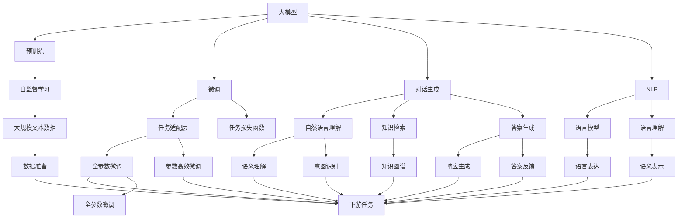

                 

# 大模型问答机器人的对话实现

> 关键词：大模型,问答机器人,对话生成,深度学习,自然语言处理(NLP)

## 1. 背景介绍

随着人工智能技术的迅猛发展，问答机器人逐渐成为智能应用的重要组成部分。传统基于规则的问答系统需要大量手工编写规则，难以适应复杂多变的用户问题。而基于深度学习的问答系统，特别是基于大模型的对话系统，能够从海量的无标签文本数据中自动学习语言表示和语义理解能力，实现高效、智能的自动问答。

近年来，大模型在自然语言处理(NLP)领域取得了重大突破，以GPT-3、BERT等预训练模型为代表，通过在海量文本数据上进行自监督学习，学习到了丰富的语言知识和语义表示。在此基础上，通过微调这些大模型，可以构建高性能的问答机器人系统，满足各种实际应用场景的需求。

本文聚焦于基于大模型的问答机器人，阐述了其对话实现的原理、方法和关键技术，旨在为NLP领域的研究者、开发者和应用者提供系统的技术指引。

## 2. 核心概念与联系

### 2.1 核心概念概述

在探讨大模型问答机器人之前，首先需要介绍一些核心概念及其相互联系。

#### 2.1.1 大模型

大模型指的是以自回归或自编码模型为代表的大规模预训练语言模型。如GPT-3、BERT等，通过在海量无标签文本数据上进行预训练，学习到丰富的语言知识和语义表示。大模型的特点在于其巨大的参数规模和强大的语义理解能力。

#### 2.1.2 问答机器人

问答机器人是一种能够理解自然语言问题，并提供准确答案的智能系统。它通常由语言理解、知识检索、答案生成和回应反馈四个关键组件构成，能够自动处理大量用户请求，提供高效、智能的问答服务。

#### 2.1.3 对话生成

对话生成是指通过语言模型自动生成对话响应，实现人机交互的过程。对话生成技术包括基于规则的对话系统、统计机器翻译、序列到序列模型等多种方法。大模型在对话生成中具有天然优势，因为其可以学习到丰富的语言表达和语义逻辑。

#### 2.1.4 自然语言处理(NLP)

自然语言处理是指使计算机能够理解、分析、生成和处理人类自然语言的技术。NLP涉及语言模型、分词、词性标注、句法分析、语义理解等多个方面。大模型在NLP中的广泛应用，使其成为构建高性能问答机器人的重要工具。

### 2.2 概念间的关系

这些核心概念之间存在着紧密的联系，形成了问答机器人对话实现的整体框架。



这个流程图展示了大模型问答机器人的核心概念及其之间的关系：

1. 大模型通过预训练学习基础语言表示。
2. 微调通过有监督任务适配顶层，提升模型在特定任务上的性能。
3. 对话生成利用语言模型生成自然语言回应。
4. NLP提供语言模型和语义理解能力。
5. 通过任务适配层和损失函数，将预训练模型应用于下游问答任务。
6. 对话系统包括自然语言理解、知识检索、答案生成和回应反馈等多个组件。
7. 大模型在对话系统各组件中发挥重要作用。

## 3. 核心算法原理 & 具体操作步骤
### 3.1 算法原理概述

基于大模型的问答机器人对话实现，本质上是一个基于预训练语言模型的对话生成过程。其核心算法包括：

1. 使用大模型进行预训练，学习到丰富的语言知识和语义表示。
2. 对预训练模型进行微调，适配问答任务的特定需求。
3. 利用微调后的模型进行对话生成，自动回答用户问题。
4. 通过NLP技术，对生成结果进行语义理解、意图识别和知识检索，以提升回答的准确性和智能性。

### 3.2 算法步骤详解

基于大模型的问答机器人对话实现，主要包括以下几个关键步骤：

**Step 1: 数据准备**

1. 收集问答任务的数据集，包括问题-答案对，或问题-知识图谱三元组。
2. 对数据进行清洗和标注，去除噪声数据，标记问答对中的问题和答案。
3. 将数据划分为训练集、验证集和测试集，用于模型训练、调优和评估。

**Step 2: 模型预训练**

1. 选择合适的预训练大模型，如GPT-3、BERT等。
2. 在大规模无标签文本数据上对大模型进行预训练，学习到通用的语言表示。
3. 对预训练模型进行微调，适配问答任务的需求。

**Step 3: 任务适配层设计**

1. 根据问答任务，设计合适的输出层和损失函数。
2. 对于分类任务，通常在顶层添加线性分类器，并使用交叉熵损失函数。
3. 对于生成任务，使用语言模型的解码器输出概率分布，并以负对数似然为损失函数。

**Step 4: 微调过程**

1. 选择适当的优化算法和超参数，如AdamW、SGD等。
2. 设置合适的学习率、批大小和迭代轮数，避免过拟合。
3. 对微调后的模型在训练集上进行训练，并在验证集上评估性能。
4. 根据验证集上的评估结果，调整超参数，继续训练模型。

**Step 5: 对话生成**

1. 将用户输入问题作为模型输入。
2. 利用微调后的模型生成响应，并进行后处理，如回译、改写等。
3. 将生成结果返回给用户，实现自然语言交互。

**Step 6: 后续改进**

1. 通过收集用户反馈，对生成结果进行优化和改进。
2. 定期更新模型参数，以应对数据分布的变化。
3. 引入知识图谱和规则库，增强回答的准确性和全面性。

### 3.3 算法优缺点

基于大模型的问答机器人对话实现，具有以下优点：

1. 高效智能。通过预训练和微调，能够自动学习丰富的语言知识和语义表示，自动回答问题。
2. 适用范围广。适用于各种类型的问答任务，如医疗咨询、技术支持、客户服务等。
3. 系统复杂度低。相较于传统规则系统，大模型系统的实现更加简单高效。

同时，该算法也存在一些局限性：

1. 数据依赖性强。大模型的性能高度依赖于预训练数据和微调数据的质量。
2. 模型鲁棒性不足。微调模型可能对小规模数据过度拟合，泛化性能有限。
3. 计算资源要求高。大模型需要较大的计算资源，训练和推理成本较高。
4. 可解释性差。大模型作为"黑盒"系统，其内部工作机制难以解释。
5. 安全性问题。微调模型可能学习到有害信息，造成不适当的回应。

### 3.4 算法应用领域

基于大模型的问答机器人对话实现，已经在诸多领域得到了广泛应用：

- 医疗咨询：构建医疗专家问答系统，为用户提供24/7的在线咨询服务。
- 技术支持：提供技术问题的快速解答，提升客户满意度。
- 客户服务：应用于在线客服，提供自动化问答服务，减轻人工客服压力。
- 教育辅导：开发智能辅导系统，帮助学生解决学习中的问题。
- 智能家居：构建智能家居问答系统，提升用户互动体验。
- 金融咨询：提供金融知识查询和理财建议，满足用户个性化需求。

## 4. 数学模型和公式 & 详细讲解 & 举例说明
### 4.1 数学模型构建

基于大模型的问答机器人对话实现，可以通过以下数学模型进行描述：

假设问题-答案对为 $(x,y)$，其中 $x$ 为问题，$y$ 为答案。微调后的模型为 $M_{\theta}$，其中 $\theta$ 为模型参数。模型的输出为 $z$，经过解码器输出概率分布 $p(z|x)$，损失函数为 $\ell(M_{\theta}(x),y)$。

微调的目标是最小化损失函数：

$$
\mathcal{L}(\theta) = \frac{1}{N} \sum_{i=1}^N \ell(M_{\theta}(x_i),y_i)
$$

其中 $N$ 为样本数，$\ell$ 为损失函数，通常使用交叉熵损失函数：

$$
\ell(M_{\theta}(x),y) = -y\log M_{\theta}(x) - (1-y)\log(1-M_{\theta}(x))
$$

### 4.2 公式推导过程

以分类任务为例，对模型的损失函数进行推导：

假设问题-答案对为 $(x,y)$，其中 $y \in \{0,1\}$，$M_{\theta}(x)$ 为模型输出，$y$ 为真实标签。则分类任务的损失函数为：

$$
\ell(M_{\theta}(x),y) = -y\log M_{\theta}(x) - (1-y)\log(1-M_{\theta}(x))
$$

在训练过程中，通过反向传播算法更新模型参数 $\theta$：

$$
\theta \leftarrow \theta - \eta \nabla_{\theta}\mathcal{L}(\theta) - \eta\lambda\theta
$$

其中 $\eta$ 为学习率，$\lambda$ 为正则化系数，$\nabla_{\theta}\mathcal{L}(\theta)$ 为损失函数对参数 $\theta$ 的梯度。

### 4.3 案例分析与讲解

以医疗咨询问答为例，分析基于大模型的问答机器人对话实现。

1. **数据准备**：收集医生问答数据集，划分为训练集、验证集和测试集。
2. **模型预训练**：使用大规模医疗文献作为预训练数据，训练BERT等大模型。
3. **任务适配层设计**：在BERT模型的顶层添加一个全连接层和softmax分类器，用于分类问答类型。
4. **微调过程**：在标注的问答数据集上，使用AdamW优化算法进行微调，调整分类器的权重和偏置。
5. **对话生成**：用户输入问题后，通过微调后的模型生成可能的回答，并根据上下文选择最合适的答案。
6. **后续改进**：定期更新模型参数，引入知识图谱和规则库，提升回答的准确性和全面性。

## 5. 项目实践：代码实例和详细解释说明
### 5.1 开发环境搭建

在进行大模型问答机器人开发前，需要准备以下开发环境：

1. 安装Python：从官网下载并安装Python，适用于开发环境的搭建。
2. 安装PyTorch：通过pip安装，适用于深度学习框架的开发。
3. 安装Transformers库：通过pip安装，适用于自然语言处理任务的开发。
4. 安装相关依赖包：如numpy、pandas、scikit-learn等，用于数据处理和模型评估。

### 5.2 源代码详细实现

以下是使用PyTorch对大模型进行医疗咨询问答机器人微调的示例代码：

```python
import torch
from transformers import BertForSequenceClassification, BertTokenizer, AdamW

# 数据准备
tokenizer = BertTokenizer.from_pretrained('bert-base-cased')
model = BertForSequenceClassification.from_pretrained('bert-base-cased', num_labels=2)

# 模型微调
optimizer = AdamW(model.parameters(), lr=2e-5)
train_dataset = ...  # 训练集
dev_dataset = ...  # 验证集
test_dataset = ...  # 测试集

for epoch in range(epochs):
    train_epoch(model, train_dataset, optimizer)
    dev_loss = evaluate(model, dev_dataset, optimizer)
    if dev_loss < best_dev_loss:
        best_dev_loss = dev_loss
        best_model = model
    else:
        break

# 对话生成
def generate_answer(question):
    input_ids = tokenizer.encode(question, return_tensors='pt')
    logits = model(input_ids).logits
    probs = logits.softmax(dim=1)
    answer = probs.argmax().item()
    return answer

# 测试模型效果
print(generate_answer('我的血压偏高，怎么办？'))
```

### 5.3 代码解读与分析

以上代码展示了使用PyTorch对BERT模型进行医疗咨询问答机器人微调的完整流程。

**数据准备**：
- 使用BertTokenizer从预训练模型中载入分词器。
- 使用BertForSequenceClassification从预训练模型中载入分类器。

**模型微调**：
- 定义AdamW优化器，学习率为2e-5。
- 定义训练集、验证集和测试集，用于模型训练和评估。
- 在每个epoch中，对训练集进行训练，并在验证集上评估性能。

**对话生成**：
- 定义generate_answer函数，将用户问题编码为模型输入，通过模型输出概率分布，选取最大概率的类别作为答案。

**测试模型效果**：
- 测试生成回答的质量，以验证模型性能。

## 6. 实际应用场景
### 6.1 智能客服系统

基于大模型的问答机器人，可以广泛应用于智能客服系统的构建。传统客服系统需要大量人力投入，响应速度慢，且无法24/7不间断服务。而基于大模型的问答机器人，可以全天候不间断地回答客户问题，显著提升客服效率和客户满意度。

在技术实现上，可以收集企业内部的客户咨询数据，进行预处理和标注，训练微调后的问答模型。通过自然语言理解和知识检索技术，问答模型能够理解客户意图，并提供个性化、精准的解答。在实时交互中，系统可以记录和分析用户行为，进一步优化回答策略，提升客户体验。

### 6.2 医疗咨询

医疗咨询问答机器人能够为患者提供24/7的在线咨询服务，减轻医生的工作压力，提升医疗服务效率。通过预训练大模型的微调，问答机器人能够理解病人的症状描述，并提供初步的诊断和治疗建议。对于复杂的医疗问题，系统可以提示患者联系医生，提供医疗咨询和指导。

在技术实现上，可以收集大量的医疗咨询数据，进行标注和预处理，训练大模型的微调模型。通过引入知识图谱和规则库，系统能够提供准确的医疗知识和治疗方案，帮助患者进行自我管理和疾病预防。

### 6.3 金融咨询

金融咨询问答机器人能够提供24/7的在线金融咨询服务，帮助客户解决各种金融问题。通过预训练大模型的微调，系统能够理解客户提出的投资、理财、贷款等金融问题，并提供个性化的金融建议和解决方案。

在技术实现上，可以收集金融领域的问答数据，进行标注和预处理，训练大模型的微调模型。通过引入金融知识图谱和规则库，系统能够提供准确、全面的金融知识和理财建议，帮助客户做出明智的投资决策。

### 6.4 教育辅导

教育辅导问答机器人能够为学生提供24/7的在线学习咨询服务，帮助学生解决学习中的各种问题。通过预训练大模型的微调，系统能够理解学生提出的问题，并提供相关的学习资源和辅导建议。

在技术实现上，可以收集教育领域的问答数据，进行标注和预处理，训练大模型的微调模型。通过引入知识图谱和规则库，系统能够提供准确的学习知识和辅导建议，帮助学生提高学习效率和成绩。

## 7. 工具和资源推荐
### 7.1 学习资源推荐

为了帮助开发者系统掌握大模型问答机器人对话实现的理论基础和实践技巧，以下是一些优质的学习资源：

1. 《自然语言处理与深度学习》书籍：全面介绍了自然语言处理和深度学习的相关概念和算法，适合入门学习。
2. 《Transformer模型从原理到实践》博文系列：由大模型技术专家撰写，深入浅出地介绍了Transformer原理、BERT模型、微调技术等前沿话题。
3. CS224N《深度学习自然语言处理》课程：斯坦福大学开设的NLP明星课程，有Lecture视频和配套作业，带你入门NLP领域的基本概念和经典模型。
4. HuggingFace官方文档：提供了丰富的预训练模型和微调样例代码，是上手实践的必备资料。
5. TensorFlow官方文档：提供了详细的TensorFlow框架介绍和使用方法，适合深度学习框架的学习和实践。

通过这些资源的学习实践，相信你一定能够快速掌握大模型问答机器人的对话实现，并用于解决实际的NLP问题。

### 7.2 开发工具推荐

高效的开发离不开优秀的工具支持。以下是几款用于大模型问答机器人对话实现开发的常用工具：

1. PyTorch：基于Python的开源深度学习框架，灵活动态的计算图，适合快速迭代研究。
2. TensorFlow：由Google主导开发的开源深度学习框架，生产部署方便，适合大规模工程应用。
3. Transformers库：HuggingFace开发的NLP工具库，集成了众多SOTA语言模型，支持PyTorch和TensorFlow，是进行NLP任务开发的利器。
4. Weights & Biases：模型训练的实验跟踪工具，可以记录和可视化模型训练过程中的各项指标，方便对比和调优。
5. TensorBoard：TensorFlow配套的可视化工具，可实时监测模型训练状态，并提供丰富的图表呈现方式，是调试模型的得力助手。

合理利用这些工具，可以显著提升大模型问答机器人对话实现的开发效率，加快创新迭代的步伐。

### 7.3 相关论文推荐

大模型问答机器人对话实现的发展离不开学界的持续研究。以下是几篇奠基性的相关论文，推荐阅读：

1. Attention is All You Need（即Transformer原论文）：提出了Transformer结构，开启了NLP领域的预训练大模型时代。
2. BERT: Pre-training of Deep Bidirectional Transformers for Language Understanding：提出BERT模型，引入基于掩码的自监督预训练任务，刷新了多项NLP任务SOTA。
3. Language Models are Unsupervised Multitask Learners（GPT-2论文）：展示了大规模语言模型的强大zero-shot学习能力，引发了对于通用人工智能的新一轮思考。
4. Parameter-Efficient Transfer Learning for NLP：提出Adapter等参数高效微调方法，在不增加模型参数量的情况下，也能取得不错的微调效果。
5. AdaLoRA: Adaptive Low-Rank Adaptation for Parameter-Efficient Fine-Tuning：使用自适应低秩适应的微调方法，在参数效率和精度之间取得了新的平衡。
6. Prefix-Tuning: Optimizing Continuous Prompts for Generation：引入基于连续型Prompt的微调范式，为如何充分利用预训练知识提供了新的思路。

这些论文代表了大模型问答机器人对话实现的发展脉络。通过学习这些前沿成果，可以帮助研究者把握学科前进方向，激发更多的创新灵感。

除上述资源外，还有一些值得关注的前沿资源，帮助开发者紧跟大模型问答机器人对话实现技术的最新进展，例如：

1. arXiv论文预印本：人工智能领域最新研究成果的发布平台，包括大量尚未发表的前沿工作，学习前沿技术的必读资源。
2. 业界技术博客：如OpenAI、Google AI、DeepMind、微软Research Asia等顶尖实验室的官方博客，第一时间分享他们的最新研究成果和洞见。
3. 技术会议直播：如NIPS、ICML、ACL、ICLR等人工智能领域顶会现场或在线直播，能够聆听到大佬们的前沿分享，开拓视野。
4. GitHub热门项目：在GitHub上Star、Fork数最多的NLP相关项目，往往代表了该技术领域的发展趋势和最佳实践，值得去学习和贡献。
5. 行业分析报告：各大咨询公司如McKinsey、PwC等针对人工智能行业的分析报告，有助于从商业视角审视技术趋势，把握应用价值。

总之，对于大模型问答机器人对话实现技术的学习和实践，需要开发者保持开放的心态和持续学习的意愿。多关注前沿资讯，多动手实践，多思考总结，必将收获满满的成长收益。

## 8. 总结：未来发展趋势与挑战

### 8.1 总结

本文对基于大模型的问答机器人对话实现进行了全面系统的介绍。首先阐述了问答机器人的核心算法和操作步骤，并详细讨论了模型预训练、任务适配、微调过程、对话生成等关键步骤。其次，通过数学模型和公式，深入讲解了问答机器人的原理和计算细节。最后，结合具体应用场景，展示了问答机器人在智能客服、医疗咨询、金融咨询、教育辅导等多个领域的实际应用。

通过本文的系统梳理，可以看到，基于大模型的问答机器人对话实现技术正在成为NLP领域的重要范式，极大地拓展了预训练语言模型的应用边界，催生了更多的落地场景。未来，伴随大模型和微调方法的不断演进，问答机器人必将在更多领域得到应用，为人工智能技术的发展注入新的动力。

### 8.2 未来发展趋势

展望未来，大模型问答机器人对话实现技术将呈现以下几个发展趋势：

1. 大模型规模继续增大。随着算力成本的下降和数据规模的扩张，预训练语言模型的参数量还将持续增长。超大规模语言模型蕴含的丰富语言知识，有望支撑更加复杂多变的问答任务。
2. 微调方法日趋多样。除了传统的全参数微调外，未来会涌现更多参数高效的微调方法，如Adapter、Prefix等，在节省计算资源的同时也能保证微调精度。
3. 多模态微调崛起。未来的问答机器人将更多地融合视觉、语音等多模态信息，提供更全面的自然语言理解能力。
4. 知识图谱的广泛应用。通过引入知识图谱，问答机器人能够提供更加全面、准确的答案，提升回答的智能性。
5. 推理效率的提升。针对推理速度慢的问题，未来的问答机器人将通过优化计算图、引入并行计算等手段，提高推理效率，实现实时响应。
6. 可解释性和透明度的提升。未来的问答机器人将更加注重输出结果的解释和透明度，增强用户信任和满意度。

以上趋势凸显了大模型问答机器人对话实现技术的广阔前景。这些方向的探索发展，必将进一步提升问答机器人的性能和应用范围，为人工智能技术的发展注入新的活力。

### 8.3 面临的挑战

尽管大模型问答机器人对话实现技术已经取得了瞩目成就，但在迈向更加智能化、普适化应用的过程中，它仍面临着诸多挑战：

1. 数据依赖性强。大模型的性能高度依赖于预训练数据和微调数据的质量，数据获取和标注成本较高。
2. 模型鲁棒性不足。微调模型可能对小规模数据过度拟合，泛化性能有限。
3. 计算资源要求高。大模型需要较大的计算资源，训练和推理成本较高。
4. 可解释性差。大模型作为"黑盒"系统，其内部工作机制难以解释。
5. 安全性问题。微调模型可能学习到有害信息，造成不适当的回应。

### 8.4 研究展望

面对大模型问答机器人对话实现技术所面临的挑战，未来的研究需要在以下几个方面寻求新的突破：

1. 探索无监督和半监督微调方法。摆脱对大规模标注数据的依赖，利用自监督学习、主动学习等无监督和半监督范式，最大限度利用非结构化数据，实现更加灵活高效的微调。
2. 研究参数高效和计算高效的微调范式。开发更加参数高效的微调方法，在固定大部分预训练参数的同时，只更新极少量的任务相关参数。同时优化微调模型的计算图，减少前向传播和反向传播的资源消耗，实现更加轻量级、实时性的部署。
3. 融合因果和对比学习范式。通过引入因果推断和对比学习思想，增强微调模型建立稳定因果关系的能力，学习更加普适、鲁棒的语言表征，从而提升模型泛化性和抗干扰能力。
4. 引入更多先验知识。将符号化的先验知识，如知识图谱、逻辑规则等，与神经网络模型进行巧妙融合，引导微调过程学习更准确、合理的语言模型。同时加强不同模态数据的整合，实现视觉、语音等多模态信息与文本信息的协同建模。
5. 结合因果分析和博弈论工具。将因果分析方法引入微调模型，识别出模型决策的关键特征，增强输出解释的因果性和逻辑性。借助博弈论工具刻画人机交互过程，主动探索并规避模型的脆弱点，提高系统稳定性。
6. 纳入伦理道德约束。在模型训练目标中引入伦理导向的评估指标，过滤和惩罚有偏见、有害的输出倾向。同时加强人工干预和审核，建立模型行为的监管机制，确保输出符合人类价值观和伦理道德。

这些研究方向的探索，必将引领大模型问答机器人对话实现技术迈向更高的台阶，为构建安全、可靠、可解释、可控的智能系统铺平道路。面向未来，大模型问答机器人对话实现技术还需要与其他人工智能技术进行更深入的融合，如知识表示、因果推理、强化学习等，多路径协同发力，共同推动自然语言理解和智能交互系统的进步。只有勇于创新、敢于

