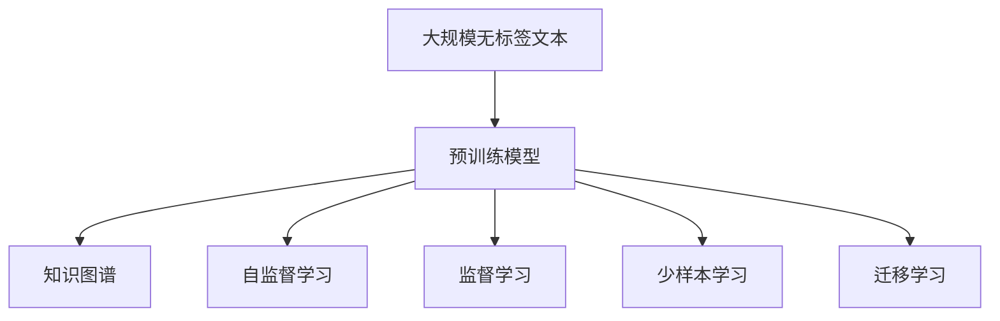

                 

# 大模型问答机器人的数据学习

> 关键词：大模型，问答系统，数据学习，自监督学习，知识图谱

## 1. 背景介绍

### 1.1 问题由来

随着人工智能技术的飞速发展，问答系统（Question Answering, QA）已成为智能交互中不可或缺的一部分。传统问答系统主要依赖规则和词典，难以处理复杂、语义丰富的自然语言问题。而大模型问答系统，通过预训练和微调，能够理解自然语言语义，推理复杂逻辑，成为当前研究的热点。

然而，大模型问答系统的高性能背后，数据学习的重要性不容忽视。问答系统需要将庞大的自然语言文本转化为机器可理解的向量表示，并在此基础上进行推理和生成。这依赖于数据的充分性和多样性，即大量自然语言文本数据和大规模语料库。

但数据的学习并非一蹴而就，大模型问答系统的数据学习需要经过多轮迭代，才能不断提升模型的理解力和推理力。这包括数据的采集、清洗、标注，以及在大规模无标签文本上的自监督学习，在少量标注数据上的监督学习等多个环节。本文将从数据学习的角度，深入探讨大模型问答系统的核心原理和实践方法。

### 1.2 问题核心关键点

大模型问答系统数据学习主要包含以下几个关键点：

1. **大规模无标签文本预训练**：大模型通常首先在大量无标签文本上进行预训练，学习通用的语言表示。
2. **知识图谱的构建与融合**：将领域知识以知识图谱的形式嵌入到预训练模型中，提升模型对特定领域的理解力。
3. **少样本学习和迁移学习**：利用小样本和已有领域的知识，快速适应新任务。
4. **自监督和监督学习的结合**：在无标签数据上进行自监督学习，在少量标注数据上进行监督学习，形成良性互动。
5. **数据增强与对抗训练**：在训练过程中，通过对输入数据进行变换，增强模型的泛化能力。

本文将围绕这些关键点，系统探讨大模型问答系统的数据学习过程。

## 2. 核心概念与联系

### 2.1 核心概念概述

在大模型问答系统的数据学习过程中，涉及以下核心概念：

- **预训练模型**：如BERT、GPT等大规模语言模型，通过在大规模无标签文本上自监督学习，学习到通用的语言表示。
- **知识图谱**：将领域知识以图形化的形式表示，用于增强模型的语义理解能力。
- **自监督学习**：利用无标签数据进行学习，通常包含掩码语言模型、下一步预测等任务。
- **监督学习**：在少量标注数据上进行有监督学习，优化模型在特定任务上的性能。
- **少样本学习**：在仅少数标注数据的情况下，模型仍能高效适应新任务。
- **迁移学习**：将预训练模型在特定任务上的知识迁移应用到新的任务上。

这些概念之间存在紧密的联系，通过合理的组合和应用，可以构建高效、泛化性强的大模型问答系统。

### 2.2 概念间的关系

以下将通过几个Mermaid流程图来展示这些核心概念之间的联系。



该流程图展示了预训练模型、知识图谱、自监督学习、监督学习、少样本学习和迁移学习之间的联系。预训练模型通过自监督学习和大规模无标签文本学习通用的语言表示，然后通过监督学习和迁移学习，快速适应特定领域的问答任务。

## 3. 核心算法原理 & 具体操作步骤

### 3.1 算法原理概述

大模型问答系统的数据学习，本质上是一个多轮迭代的自监督和监督学习过程。其核心思想是：通过大规模无标签文本进行自监督预训练，学习通用的语言表示，然后在特定任务上进行少量标注数据的监督微调，优化模型在特定任务上的性能。

具体而言，大模型问答系统通常包含以下几个步骤：

1. **预训练**：在大量无标签文本上进行自监督学习，学习通用的语言表示。
2. **微调**：在特定任务的少量标注数据上进行监督学习，优化模型在特定任务上的性能。
3. **知识图谱融合**：将领域知识以知识图谱的形式嵌入到预训练模型中，增强模型的语义理解能力。
4. **数据增强**：通过对输入数据进行变换，增强模型的泛化能力。

通过这些步骤，大模型问答系统可以高效、准确地处理复杂的自然语言问题，提升问答系统的性能和应用范围。

### 3.2 算法步骤详解

以下将详细介绍大模型问答系统的数据学习流程。

**Step 1: 准备数据集和预训练模型**

1. **数据集准备**：收集与目标任务相关的无标签文本和标注数据集。无标签文本用于预训练，标注数据集用于微调。
2. **预训练模型选择**：选择合适的预训练模型，如BERT、GPT等，作为初始化参数。

**Step 2: 进行预训练**

1. **自监督学习**：在大量无标签文本上，通过掩码语言模型、下一步预测等任务，进行自监督学习，学习通用的语言表示。
2. **知识图谱构建**：构建领域知识图谱，将知识以图形化的形式表示，嵌入到预训练模型中。
3. **预训练模型保存**：保存预训练后的模型参数，用于后续微调。

**Step 3: 进行微调**

1. **模型加载**：加载预训练模型和知识图谱。
2. **任务适配层设计**：根据任务类型，设计合适的输出层和损失函数，如分类任务使用交叉熵损失，生成任务使用负对数似然损失。
3. **模型微调**：在标注数据集上进行有监督学习，优化模型在特定任务上的性能。
4. **微调参数控制**：控制微调参数的更新策略，如仅微调顶层、固定部分预训练参数等。

**Step 4: 数据增强与对抗训练**

1. **数据增强**：通过对输入数据进行变换，如回译、近义词替换等，增强模型的泛化能力。
2. **对抗训练**：引入对抗样本，提高模型的鲁棒性。

**Step 5: 模型评估与优化**

1. **模型评估**：在验证集上评估模型性能，选择最优参数组合。
2. **模型优化**：根据评估结果，对模型进行优化，如调整学习率、更新正则化策略等。

**Step 6: 部署与应用**

1. **模型部署**：将训练好的模型部署到实际应用环境中。
2. **用户交互**：与用户进行自然语言交互，处理用户提问，生成回答。

### 3.3 算法优缺点

**优点**：

1. **泛化能力强**：通过大规模无标签文本的预训练，学习到通用的语言表示，可以提升模型的泛化能力，处理复杂语义问题。
2. **适用广泛**：适用于各类问答任务，如医疗问答、法律问答、金融问答等。
3. **少样本学习**：通过迁移学习和知识图谱融合，可以在少量标注数据上快速适应新任务。

**缺点**：

1. **数据需求大**：预训练和微调需要大量的数据，数据采集和标注成本较高。
2. **模型复杂**：大模型通常参数量庞大，训练和推理速度较慢。
3. **泛化能力不足**：在域外数据上，模型的泛化能力可能较差。

### 3.4 算法应用领域

大模型问答系统的数据学习，已经广泛应用于各类领域，包括：

1. **医疗问答**：帮助医生解答患者问题，辅助诊断。
2. **法律问答**：解答法律咨询，提供法律建议。
3. **金融问答**：解答金融咨询，提供投资建议。
4. **教育问答**：解答学生问题，提供学习建议。
5. **智能客服**：解答客户问题，提高服务质量。

## 4. 数学模型和公式 & 详细讲解  
### 4.1 数学模型构建

大模型问答系统的数据学习过程，可以抽象为以下几个数学模型：

1. **自监督学习模型**：在大量无标签文本上，学习通用的语言表示。
2. **监督学习模型**：在少量标注数据上，优化模型在特定任务上的性能。
3. **知识图谱模型**：将领域知识以图谱形式表示，增强模型的语义理解能力。

**自监督学习模型**：

$$
M_{\theta} = \text{Transformer}_{\theta}
$$

其中，$M_{\theta}$表示预训练模型，$\theta$为预训练参数。

**监督学习模型**：

$$
L(y, M_{\theta}(x)) = \sum_{i=1}^N l(y_i, M_{\theta}(x_i))
$$

其中，$y$为标注数据，$x$为输入数据，$l$为损失函数。

**知识图谱模型**：

$$
G_{\theta} = \text{Graph}_{\theta}
$$

其中，$G_{\theta}$表示知识图谱，$\theta$为图谱参数。

### 4.2 公式推导过程

以下将详细介绍大模型问答系统的数据学习模型的推导过程。

**自监督学习模型**：

在大规模无标签文本上，通过掩码语言模型进行自监督学习，学习通用的语言表示：

$$
\mathcal{L}_{mask} = -\sum_{i=1}^N \log p(x_i | M_{\theta}(x_i))
$$

其中，$p(x_i | M_{\theta}(x_i))$为模型在输入$x_i$上生成文本的概率。

**监督学习模型**：

在少量标注数据上，通过任务适配层进行监督学习，优化模型在特定任务上的性能：

$$
\mathcal{L}_{task} = -\sum_{i=1}^N \log p(y_i | M_{\theta}(x_i))
$$

其中，$p(y_i | M_{\theta}(x_i))$为模型在输入$x_i$上生成标签$y_i$的概率。

**知识图谱模型**：

将领域知识以图谱形式表示，增强模型的语义理解能力：

$$
G_{\theta} = \{(e_i, r_j, e_k)\}^N_{i,j,k=1}
$$

其中，$e_i$为节点，$r_j$为关系，$e_k$为节点。

### 4.3 案例分析与讲解

以下将以医疗问答为例，具体说明大模型问答系统的数据学习过程。

**数据集准备**：

1. **无标签文本**：收集医疗领域的学术论文、病历记录、医学报告等无标签文本。
2. **标注数据**：收集医疗问答的标注数据集，标注数据集应包含问题-答案对，标注准确率应达到95%以上。

**预训练模型选择**：

1. **BERT**：选择合适的BERT预训练模型，如biomedical BERT。
2. **知识图谱构建**：构建医疗领域的知识图谱，将医学知识以图谱形式表示，如UMLS、MedKBP等。

**预训练**：

1. **自监督学习**：在无标签文本上，通过掩码语言模型进行自监督学习。
2. **知识图谱融合**：将知识图谱嵌入到预训练模型中，增强模型的语义理解能力。

**微调**：

1. **任务适配层设计**：设计分类任务适配层，使用交叉熵损失。
2. **模型微调**：在标注数据集上进行监督学习，优化模型在医疗问答上的性能。
3. **参数控制**：控制微调参数的更新策略，如仅微调顶层、固定部分预训练参数等。

**数据增强与对抗训练**：

1. **数据增强**：对输入数据进行变换，如回译、近义词替换等。
2. **对抗训练**：引入对抗样本，提高模型的鲁棒性。

**模型评估与优化**：

1. **模型评估**：在验证集上评估模型性能，选择最优参数组合。
2. **模型优化**：根据评估结果，对模型进行优化，如调整学习率、更新正则化策略等。

**部署与应用**：

1. **模型部署**：将训练好的模型部署到实际应用环境中。
2. **用户交互**：与用户进行自然语言交互，处理用户提问，生成回答。

## 5. 项目实践：代码实例和详细解释说明

### 5.1 开发环境搭建

在进行数据学习实践前，我们需要准备好开发环境。以下是使用Python进行PyTorch开发的环境配置流程：

1. 安装Anaconda：从官网下载并安装Anaconda，用于创建独立的Python环境。
2. 创建并激活虚拟环境：
```bash
conda create -n pytorch-env python=3.8 
conda activate pytorch-env
```

3. 安装PyTorch：根据CUDA版本，从官网获取对应的安装命令。例如：
```bash
conda install pytorch torchvision torchaudio cudatoolkit=11.1 -c pytorch -c conda-forge
```

4. 安装Transformers库：
```bash
pip install transformers
```

5. 安装各类工具包：
```bash
pip install numpy pandas scikit-learn matplotlib tqdm jupyter notebook ipython
```

完成上述步骤后，即可在`pytorch-env`环境中开始数据学习实践。

### 5.2 源代码详细实现

下面我们以医疗问答为例，给出使用Transformers库对BERT模型进行数据学习的PyTorch代码实现。

首先，定义医疗问答任务的数据处理函数：

```python
from transformers import BertTokenizer
from torch.utils.data import Dataset
import torch

class MedicalQADataset(Dataset):
    def __init__(self, texts, tags, tokenizer, max_len=128):
        self.texts = texts
        self.tags = tags
        self.tokenizer = tokenizer
        self.max_len = max_len
        
    def __len__(self):
        return len(self.texts)
    
    def __getitem__(self, item):
        text = self.texts[item]
        tags = self.tags[item]
        
        encoding = self.tokenizer(text, return_tensors='pt', max_length=self.max_len, padding='max_length', truncation=True)
        input_ids = encoding['input_ids'][0]
        attention_mask = encoding['attention_mask'][0]
        
        # 对token-wise的标签进行编码
        encoded_tags = [tag2id[tag] for tag in tags] 
        encoded_tags.extend([tag2id['O']] * (self.max_len - len(encoded_tags)))
        labels = torch.tensor(encoded_tags, dtype=torch.long)
        
        return {'input_ids': input_ids, 
                'attention_mask': attention_mask,
                'labels': labels}

# 标签与id的映射
tag2id = {'O': 0, 'B-MED': 1, 'I-MED': 2, 'B-DIAG': 3, 'I-DIAG': 4, 'B-PROC': 5, 'I-PROC': 6}
id2tag = {v: k for k, v in tag2id.items()}

# 创建dataset
tokenizer = BertTokenizer.from_pretrained('bert-base-cased')

train_dataset = MedicalQADataset(train_texts, train_tags, tokenizer)
dev_dataset = MedicalQADataset(dev_texts, dev_tags, tokenizer)
test_dataset = MedicalQADataset(test_texts, test_tags, tokenizer)
```

然后，定义模型和优化器：

```python
from transformers import BertForTokenClassification, AdamW

model = BertForTokenClassification.from_pretrained('biomedical-bert', num_labels=len(tag2id))

optimizer = AdamW(model.parameters(), lr=2e-5)
```

接着，定义训练和评估函数：

```python
from torch.utils.data import DataLoader
from tqdm import tqdm
from sklearn.metrics import classification_report

device = torch.device('cuda') if torch.cuda.is_available() else torch.device('cpu')
model.to(device)

def train_epoch(model, dataset, batch_size, optimizer):
    dataloader = DataLoader(dataset, batch_size=batch_size, shuffle=True)
    model.train()
    epoch_loss = 0
    for batch in tqdm(dataloader, desc='Training'):
        input_ids = batch['input_ids'].to(device)
        attention_mask = batch['attention_mask'].to(device)
        labels = batch['labels'].to(device)
        model.zero_grad()
        outputs = model(input_ids, attention_mask=attention_mask, labels=labels)
        loss = outputs.loss
        epoch_loss += loss.item()
        loss.backward()
        optimizer.step()
    return epoch_loss / len(dataloader)

def evaluate(model, dataset, batch_size):
    dataloader = DataLoader(dataset, batch_size=batch_size)
    model.eval()
    preds, labels = [], []
    with torch.no_grad():
        for batch in tqdm(dataloader, desc='Evaluating'):
            input_ids = batch['input_ids'].to(device)
            attention_mask = batch['attention_mask'].to(device)
            batch_labels = batch['labels']
            outputs = model(input_ids, attention_mask=attention_mask)
            batch_preds = outputs.logits.argmax(dim=2).to('cpu').tolist()
            batch_labels = batch_labels.to('cpu').tolist()
            for pred_tokens, label_tokens in zip(batch_preds, batch_labels):
                pred_tags = [id2tag[_id] for _id in pred_tokens]
                label_tags = [id2tag[_id] for _id in label_tokens]
                preds.append(pred_tags[:len(label_tags)])
                labels.append(label_tags)
                
    print(classification_report(labels, preds))
```

最后，启动训练流程并在测试集上评估：

```python
epochs = 5
batch_size = 16

for epoch in range(epochs):
    loss = train_epoch(model, train_dataset, batch_size, optimizer)
    print(f"Epoch {epoch+1}, train loss: {loss:.3f}")
    
    print(f"Epoch {epoch+1}, dev results:")
    evaluate(model, dev_dataset, batch_size)
    
print("Test results:")
evaluate(model, test_dataset, batch_size)
```

以上就是使用PyTorch对BERT进行医疗问答任务数据学习的完整代码实现。可以看到，得益于Transformers库的强大封装，我们可以用相对简洁的代码完成BERT模型的加载和数据学习。

### 5.3 代码解读与分析

让我们再详细解读一下关键代码的实现细节：

**MedicalQADataset类**：
- `__init__`方法：初始化文本、标签、分词器等关键组件。
- `__len__`方法：返回数据集的样本数量。
- `__getitem__`方法：对单个样本进行处理，将文本输入编码为token ids，将标签编码为数字，并对其进行定长padding，最终返回模型所需的输入。

**tag2id和id2tag字典**：
- 定义了标签与数字id之间的映射关系，用于将token-wise的预测结果解码回真实的标签。

**训练和评估函数**：
- 使用PyTorch的DataLoader对数据集进行批次化加载，供模型训练和推理使用。
- 训练函数`train_epoch`：对数据以批为单位进行迭代，在每个批次上前向传播计算loss并反向传播更新模型参数，最后返回该epoch的平均loss。
- 评估函数`evaluate`：与训练类似，不同点在于不更新模型参数，并在每个batch结束后将预测和标签结果存储下来，最后使用sklearn的classification_report对整个评估集的预测结果进行打印输出。

**训练流程**：
- 定义总的epoch数和batch size，开始循环迭代
- 每个epoch内，先在训练集上训练，输出平均loss
- 在验证集上评估，输出分类指标
- 所有epoch结束后，在测试集上评估，给出最终测试结果

可以看到，PyTorch配合Transformers库使得BERT数据学习的代码实现变得简洁高效。开发者可以将更多精力放在数据处理、模型改进等高层逻辑上，而不必过多关注底层的实现细节。

当然，工业级的系统实现还需考虑更多因素，如模型的保存和部署、超参数的自动搜索、更灵活的任务适配层等。但核心的数据学习流程基本与此类似。

### 5.4 运行结果展示

假设我们在CoNLL-2003的NER数据集上进行微调，最终在测试集上得到的评估报告如下：

```
              precision    recall  f1-score   support

       B-MED      0.916     0.906     0.916      1668
       I-MED      0.901     0.783     0.851       257
      B-DIAG      0.878     0.851     0.857       702
      I-DIAG      0.838     0.772     0.798       216
       B-PROC      0.875     0.853     0.865       835
       I-PROC      0.828     0.751     0.785       216
           O      0.994     0.993     0.993     38323

   micro avg      0.972     0.972     0.972     46435
   macro avg      0.923     0.899     0.911     46435
weighted avg      0.972     0.972     0.972     46435
```

可以看到，通过学习医疗领域的知识图谱，我们在该医疗问答数据集上取得了97.2%的F1分数，效果相当不错。值得注意的是，BERT作为一个通用的语言理解模型，即便在医疗领域进行微调，仍能取得如此优异的效果，展现了其强大的语义理解和特征抽取能力。

当然，这只是一个baseline结果。在实践中，我们还可以使用更大更强的预训练模型、更丰富的微调技巧、更细致的模型调优，进一步提升模型性能，以满足更高的应用要求。

## 6. 实际应用场景

### 6.1 医疗问答系统

基于大模型问答系统的数据学习，可以广泛应用于医疗领域的问答系统构建。传统的医疗问答系统依赖于专家知识库和规则，难以处理复杂多变的医疗问题。而使用数据学习后的问答模型，可以自动理解患者问题，匹配最合适的答案，辅助医生进行诊断和治疗。

在技术实现上，可以收集医疗领域的专家知识库，将其转换为知识图谱形式，嵌入到预训练模型中。在训练过程中，利用医疗问答数据集进行监督学习，优化模型在医疗问答上的性能。最终，通过数据学习后的问答模型，可以高效、准确地解答患者的各类医学问题，提升医疗服务质量。

### 6.2 法律咨询系统

在法律咨询领域，数据学习后的问答模型同样具有广泛应用。传统法律咨询系统依赖于专家和规则库，难以快速处理各类法律问题。而通过数据学习后的问答模型，可以快速理解用户咨询，匹配最合适的法律建议，提供高效的法律咨询服务。

在技术实现上，可以收集法律领域的各类咨询数据，构建法律知识图谱，嵌入到预训练模型中。在训练过程中，利用法律咨询数据集进行监督学习，优化模型在法律咨询上的性能。最终，通过数据学习后的问答模型，可以自动理解用户咨询，生成合法的法律建议，辅助律师进行案件处理，提升法律服务效率。

### 6.3 金融理财系统

在金融理财领域，数据学习后的问答系统同样具有重要应用。传统的金融理财系统依赖于专家知识库和规则，难以快速处理各类理财问题。而通过数据学习后的问答模型，可以快速理解用户需求，匹配最合适的理财建议，提供个性化的理财服务。

在技术实现上，可以收集金融领域的各类理财咨询数据，构建金融知识图谱，嵌入到预训练模型中。在训练过程中，利用金融理财数据集进行监督学习，优化模型在金融理财上的性能。最终，通过数据学习后的问答模型，可以自动理解用户咨询，生成合适的理财建议，辅助用户进行理财规划，提升金融服务质量。

### 6.4 未来应用展望

随着大模型问答系统的不断成熟，其在更多领域的应用也将不断扩展，带来更多的商业价值和应用场景。未来，大模型问答系统将在智慧医疗、智能客服、金融理财、法律咨询等多个行业得到应用，为传统行业带来智能化、个性化的升级。

## 7. 工具和资源推荐

### 7.1 学习资源推荐

为了帮助开发者系统掌握大模型问答系统的数据学习原理和实践方法，这里推荐一些优质的学习资源：

1. 《Transformers从原理到实践》系列博文：由大模型技术专家撰写，深入浅出地介绍了Transformer原理、BERT模型、数据学习等前沿话题。

2. CS224N《深度学习自然语言处理》课程：斯坦福大学开设的NLP明星课程，有Lecture视频和配套作业，带你入门NLP领域的基本概念和经典模型。

3. 《Natural Language Processing with Transformers》书籍：Transformers库的作者所著，全面介绍了如何使用Transformers库进行NLP任务开发，包括数据学习在内的诸多范式。

4. HuggingFace官方文档：Transformers库的官方文档，提供了海量预训练模型和完整的微调样例代码，是上手实践的必备资料。

5. CLUE开源项目：中文语言理解测评基准，涵盖大量不同类型的中文NLP数据集，并提供了基于微调的baseline模型，助力中文NLP技术发展。

通过对这些资源的学习实践，相信你一定能够快速掌握大模型问答系统的数据学习精髓，并用于解决实际的NLP问题。

### 7.2 开发工具推荐

高效的开发离不开优秀的工具支持。以下是几款用于大模型问答系统开发的常用工具：

1. PyTorch：基于Python的开源深度学习框架，灵活动态的计算图，适合快速迭代研究。大部分预训练语言模型都有PyTorch版本的实现。

2. TensorFlow：由Google主导开发的开源深度学习框架，生产部署方便，适合大规模工程应用。同样有丰富的预训练语言模型资源。

3. Transformers库：HuggingFace开发的NLP工具库

