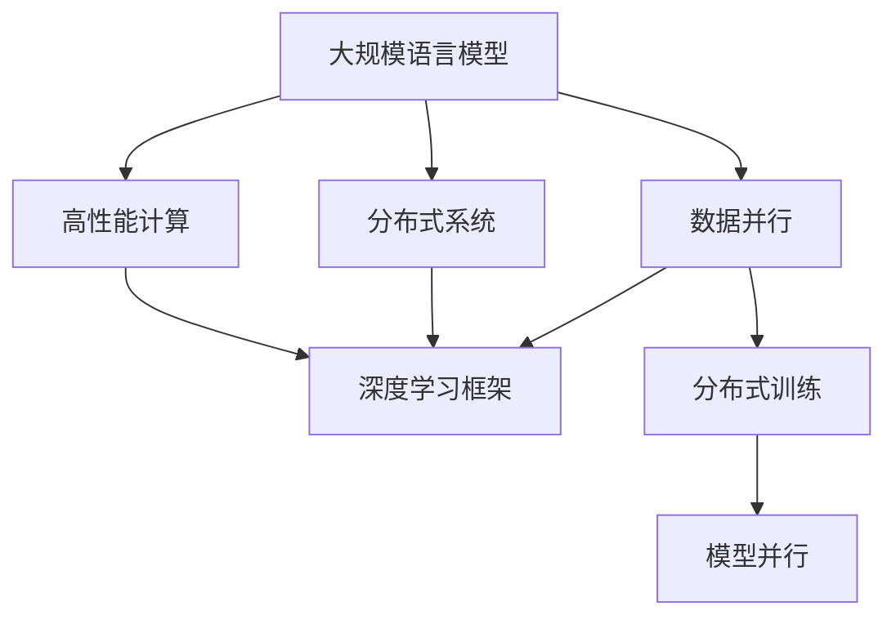
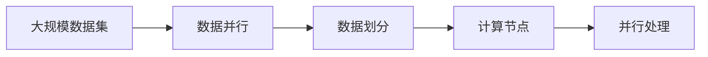
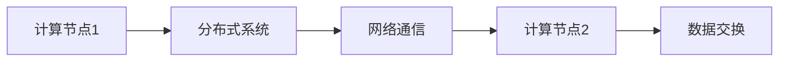
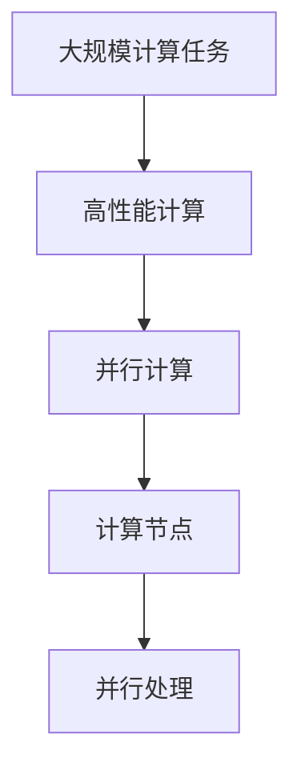
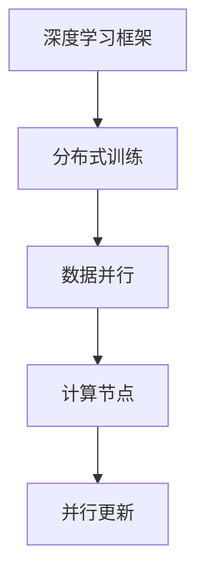
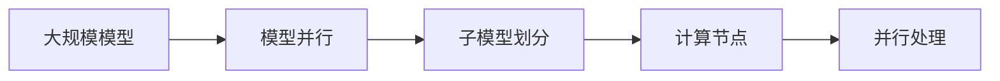
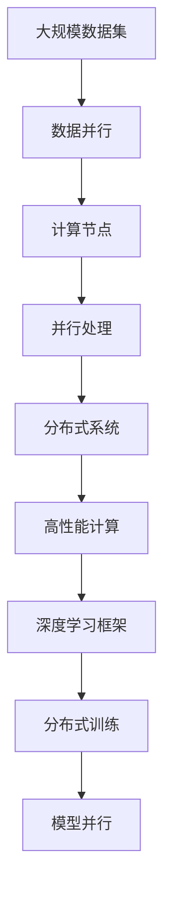

                 

# 大规模语言模型从理论到实践 数据并行

> 关键词：大规模语言模型, 数据并行, 深度学习, 模型训练, 分布式系统, 高性能计算

## 1. 背景介绍

### 1.1 问题由来
近年来，随着深度学习技术的发展，大规模语言模型（Large Language Models, LLMs）在自然语言处理（Natural Language Processing, NLP）领域取得了巨大的突破。这些模型通过在大规模无标签文本数据上进行预训练，学习到了丰富的语言知识和常识，能够理解自然语言并进行语言生成。

然而，由于模型规模巨大，模型训练所需的时间和计算资源非常可观。以GPT-3为例，它的参数规模达到了1750亿，训练一次需要上百个TPU天的计算资源。这对于大多数研究和企业而言，都是难以承受的。因此，为了提高训练效率，研究人员开始探索数据并行和模型并行等分布式训练技术，以期在大规模语言模型训练中实现性能的提升。

### 1.2 问题核心关键点
数据并行是一种重要的分布式训练技术，其核心思想是将大规模数据集分为若干子集，分配到多个计算节点上进行并行处理，从而加速训练过程。在数据并行中，不同计算节点处理不同的数据样本，并行更新模型参数。这种方法能够显著减少单个节点上的计算负担，加速训练进程。

数据并行方法主要有两种：
- 数据并行：将数据集划分为多个子集，每个计算节点处理一部分数据，不同节点之间通过模型参数进行通信和更新。
- 批数据并行：将数据集按批次分配给各个节点，每个节点处理一个批次的数据，更新模型参数。

数据并行技术在大规模语言模型的训练中被广泛应用，显著提升了模型训练的效率和性能。

### 1.3 问题研究意义
研究数据并行技术，对于拓展大规模语言模型的应用范围，提升模型训练效率，加速NLP技术的产业化进程，具有重要意义：

1. 降低训练成本。通过数据并行，可以在更短的时间内训练出高质量的模型，减少对计算资源的依赖。
2. 提高训练效率。数据并行能够有效分担单个节点的计算负担，加速模型训练过程。
3. 促进模型优化。数据并行过程中，不同节点可以协同更新模型参数，提高模型的优化效率。
4. 加速开发进度。使用数据并行技术，可以快速训练出多组模型，进行参数对比和调优，缩短开发周期。
5. 促进模型性能提升。数据并行技术能够在更大的数据集上训练模型，提升模型的泛化能力和表现。

## 2. 核心概念与联系

### 2.1 核心概念概述

为更好地理解数据并行技术在大规模语言模型训练中的应用，本节将介绍几个密切相关的核心概念：

- 大规模语言模型(Large Language Models, LLMs)：以自回归(如GPT)或自编码(如BERT)模型为代表的大规模预训练语言模型。通过在大规模无标签文本语料上进行预训练，学习通用的语言表示，具备强大的语言理解和生成能力。

- 数据并行（Data Parallelism）：将大规模数据集分为多个子集，分配到多个计算节点上进行并行处理，并行更新模型参数。

- 分布式系统（Distributed System）：由多个计算节点组成，通过网络进行通信和数据共享的系统。

- 高性能计算（High-Performance Computing, HPC）：使用并行处理技术，加速科学计算和数据处理的计算模型。

- 深度学习框架（Deep Learning Framework）：如TensorFlow、PyTorch等，提供分布式训练支持，便于实现数据并行。

- 分布式训练（Distributed Training）：在分布式系统中，利用数据并行技术，加速模型训练过程。

- 模型并行（Model Parallelism）：将大规模模型分解为多个子模型，分配到多个计算节点上进行并行处理，减少单个节点的计算负担。

这些核心概念之间的逻辑关系可以通过以下Mermaid流程图来展示：



这个流程图展示了大规模语言模型的核心概念及其之间的关系：

1. 大规模语言模型通过预训练获得基础能力。
2. 数据并行将大规模数据集分为多个子集，分配到多个计算节点上进行并行处理，加速训练过程。
3. 分布式系统通过网络进行通信和数据共享，支持数据并行。
4. 高性能计算使用并行处理技术，加速计算任务。
5. 深度学习框架提供分布式训练支持，便于实现数据并行。
6. 分布式训练在分布式系统中，利用数据并行技术，加速模型训练过程。
7. 模型并行将大规模模型分解为多个子模型，分配到多个计算节点上进行并行处理，减少单个节点的计算负担。

这些核心概念共同构成了大规模语言模型训练的完整生态系统，使其能够在各种场景下发挥强大的语言理解和生成能力。通过理解这些核心概念，我们可以更好地把握大规模语言模型训练过程中各个组件的相互作用和优化方向。

### 2.2 概念间的关系

这些核心概念之间存在着紧密的联系，形成了大规模语言模型训练的整体架构。下面我们通过几个Mermaid流程图来展示这些概念之间的关系。

#### 2.2.1 数据并行的数据划分



这个流程图展示了数据并行技术的基本原理，即将大规模数据集分为多个子集，分配到不同的计算节点上进行并行处理。

#### 2.2.2 分布式系统的节点间通信



这个流程图展示了分布式系统中的节点间通信过程，即通过网络进行数据和参数的交换，支持数据并行。

#### 2.2.3 高性能计算的并行处理



这个流程图展示了高性能计算中的并行处理过程，即通过多个计算节点并行处理大规模计算任务。

#### 2.2.4 深度学习框架的分布式训练



这个流程图展示了深度学习框架中的分布式训练过程，即利用数据并行技术，加速模型训练过程。

#### 2.2.5 模型并行的子模型划分



这个流程图展示了模型并行的基本原理，即将大规模模型分解为多个子模型，分配到多个计算节点上进行并行处理。

### 2.3 核心概念的整体架构

最后，我们用一个综合的流程图来展示这些核心概念在大规模语言模型训练过程中的整体架构：



这个综合流程图展示了从数据并行到模型并行的完整过程。大规模语言模型首先在大规模数据集上进行并行处理，利用分布式系统加速计算过程，使用高性能计算技术优化算法效率，通过深度学习框架实现分布式训练，最终通过模型并行技术，将大规模模型分解为多个子模型进行并行处理，以降低单个节点的计算负担。通过这些核心概念的协同工作，大规模语言模型训练过程能够高效、准确地进行。

## 3. 核心算法原理 & 具体操作步骤

### 3.1 算法原理概述

数据并行技术在大规模语言模型训练中，主要利用分布式系统的并行计算能力，通过将大规模数据集分配到多个计算节点上进行并行处理，从而加速训练过程。具体来说，数据并行的过程可以分为以下几个步骤：

1. 数据集划分：将大规模数据集划分为多个子集，分配到不同的计算节点上进行并行处理。
2. 参数同步：不同节点之间的模型参数通过通信协议进行同步，确保各节点参数的一致性。
3. 并行计算：不同节点同时计算各自的数据子集，并行更新模型参数。
4. 聚合结果：将各节点的计算结果进行汇总，更新全局模型参数。

在数据并行过程中，每个计算节点负责处理一部分数据子集，并行计算损失函数和梯度。每个节点计算完成后，将梯度进行汇总，并发送给其他节点进行同步。各节点根据同步后的参数，更新自己的模型参数。最终，将各节点的参数进行平均，得到全局模型参数。这个过程可以在每个epoch（训练轮次）结束时进行。

### 3.2 算法步骤详解

数据并行的具体实现步骤如下：

**Step 1: 数据集划分**

首先，需要将大规模数据集划分为多个子集，每个子集的大小可以根据计算节点的数量和计算资源进行调整。通常情况下，每个节点负责处理一部分数据子集，并行计算损失函数和梯度。

**Step 2: 参数同步**

在每个节点计算梯度之前，需要先通过通信协议（如AllReduce、Gossip等）进行参数同步。参数同步的目的是确保各节点的模型参数一致，避免不同节点之间参数的不一致性。

**Step 3: 并行计算**

在每个节点计算梯度时，使用反向传播算法计算损失函数和梯度。不同节点的计算过程是并行的，每个节点根据各自的数据子集进行计算。

**Step 4: 聚合结果**

各节点计算完成后，将梯度进行汇总，并发送给其他节点进行同步。各节点根据同步后的参数，更新自己的模型参数。最终，将各节点的参数进行平均，得到全局模型参数。这个过程可以在每个epoch结束时进行。

**Step 5: 更新模型**

使用全局模型参数更新模型，进行下一个epoch的计算。

### 3.3 算法优缺点

数据并行技术在大规模语言模型训练中具有以下优点：

1. 加速训练过程。通过并行处理大规模数据集，能够显著加速模型训练过程。
2. 提高模型性能。并行计算能够充分利用计算资源，提高模型训练的精度。
3. 优化资源利用。将大规模计算任务分配到多个节点上进行并行处理，能够优化资源利用率，减少单个节点的计算负担。

同时，数据并行技术也存在一些缺点：

1. 通信开销较大。节点之间的通信开销较大，尤其是在大规模数据集上，通信开销会增加训练时间。
2. 参数同步复杂。节点之间的参数同步需要复杂的通信协议，可能增加计算开销。
3. 可扩展性受限。数据并行技术的可扩展性受到节点数和计算资源的限制，在大规模分布式系统中可能存在瓶颈。

### 3.4 算法应用领域

数据并行技术在大规模语言模型训练中的应用非常广泛，主要包括以下几个领域：

1. 自然语言处理(NLP)：用于训练大规模语言模型，如BERT、GPT等。
2. 计算机视觉(CV)：用于训练大规模卷积神经网络，如图像分类、目标检测等。
3. 自然语言生成(NLG)：用于训练大规模生成模型，如GPT-3等。
4. 语音识别(SR)：用于训练大规模语音识别模型，如Google的WaveNet等。
5. 推荐系统(Recommender)：用于训练大规模推荐系统模型，如基于深度学习的推荐算法。

这些领域都需要大规模的数据集和计算资源，数据并行技术能够显著提高训练效率和模型性能。

## 4. 数学模型和公式 & 详细讲解  
### 4.1 数学模型构建

在大规模语言模型训练中，数据并行技术通常与深度学习框架中的分布式训练机制相结合，用于加速模型训练。以下是一个简单的数学模型构建过程：

假设大规模语言模型为 $M_{\theta}$，其中 $\theta$ 为模型参数。给定大规模数据集 $D=\{(x_i, y_i)\}_{i=1}^N$，数据并行训练的目标是最小化经验风险，即找到最优参数：

$$
\theta^* = \mathop{\arg\min}_{\theta} \mathcal{L}(M_{\theta},D)
$$

其中 $\mathcal{L}$ 为损失函数，用于衡量模型预测输出与真实标签之间的差异。

### 4.2 公式推导过程

以二分类任务为例，假设模型 $M_{\theta}$ 在输入 $x$ 上的输出为 $\hat{y}=M_{\theta}(x) \in [0,1]$，表示样本属于正类的概率。真实标签 $y \in \{0,1\}$。则二分类交叉熵损失函数定义为：

$$
\ell(M_{\theta}(x),y) = -[y\log \hat{y} + (1-y)\log (1-\hat{y})]
$$

将多个节点的数据集 $D_1, D_2, \dots, D_k$ 分配给 $k$ 个计算节点进行处理，每个节点使用数据子集 $D_i$ 进行训练。假设节点 $i$ 处理的数据子集大小为 $n_i$，则节点 $i$ 的损失函数为：

$$
\ell_i(M_{\theta}(x_i),y_i) = -[y_i\log \hat{y}_i + (1-y_i)\log (1-\hat{y}_i)]
$$

节点 $i$ 的梯度计算公式为：

$$
\nabla_{\theta}\ell_i(M_{\theta}(x_i),y_i) = \frac{\partial \ell_i}{\partial \theta}
$$

使用反向传播算法计算梯度后，各节点将梯度汇总并发送给其他节点进行同步。假设节点 $i$ 的梯度为 $g_i$，则各节点将 $g_i$ 发送给节点 $j$ 进行同步，同步后的梯度为 $\tilde{g}_j$。

最终，节点 $i$ 的梯度为：

$$
g_i = \frac{1}{n_i} \sum_{x_j \in D_i} \nabla_{\theta}\ell_j(M_{\theta}(x_j),y_j)
$$

将所有节点的梯度进行平均，得到全局梯度 $g$：

$$
g = \frac{1}{k} \sum_{i=1}^k g_i
$$

使用全局梯度 $g$ 更新模型参数 $\theta$：

$$
\theta \leftarrow \theta - \eta \nabla_{\theta} \mathcal{L}(\theta)
$$

其中 $\eta$ 为学习率。

### 4.3 案例分析与讲解

假设我们有一个由4个节点组成的分布式系统，每个节点处理1/4的数据集。每个节点计算梯度后，将梯度发送给其他3个节点进行同步。假设节点1的梯度为 $g_1 = [0.1, 0.2, 0.3, 0.4]$，节点2的梯度为 $g_2 = [0.2, 0.4, 0.6, 0.8]$，节点3的梯度为 $g_3 = [0.3, 0.6, 0.9, 1.2]$，节点4的梯度为 $g_4 = [0.4, 0.8, 1.2, 1.6]$。则节点2将接收到的梯度进行汇总，得到节点2的同步梯度 $\tilde{g}_2 = [0.1+0.2+0.3+0.4, 0.2+0.4+0.6+0.8, 0.3+0.6+0.9+1.2, 0.4+0.8+1.2+1.6] = [1.0, 1.8, 2.6, 3.4]$。

各节点将同步后的梯度进行平均，得到全局梯度 $g = [1.0/4, 1.8/4, 2.6/4, 3.4/4] = [0.25, 0.45, 0.65, 0.85]$。使用全局梯度更新模型参数：

$$
\theta \leftarrow \theta - \eta \nabla_{\theta} \mathcal{L}(\theta)
$$

其中 $\eta$ 为学习率。

这个过程可以不断迭代，直到模型收敛。通过数据并行技术，大规模语言模型训练能够在大规模数据集上进行高效的并行处理，从而显著提升训练效率和模型性能。

## 5. 项目实践：代码实例和详细解释说明

### 5.1 开发环境搭建

在进行数据并行实践前，我们需要准备好开发环境。以下是使用Python进行PyTorch开发的环境配置流程：

1. 安装Anaconda：从官网下载并安装Anaconda，用于创建独立的Python环境。

2. 创建并激活虚拟环境：
```bash
conda create -n pytorch-env python=3.8 
conda activate pytorch-env
```

3. 安装PyTorch：根据CUDA版本，从官网获取对应的安装命令。例如：
```bash
conda install pytorch torchvision torchaudio cudatoolkit=11.1 -c pytorch -c conda-forge
```

4. 安装Transformers库：
```bash
pip install transformers
```

5. 安装各类工具包：
```bash
pip install numpy pandas scikit-learn matplotlib tqdm jupyter notebook ipython
```

完成上述步骤后，即可在`pytorch-env`环境中开始数据并行实践。

### 5.2 源代码详细实现

下面我们以训练BERT模型为例，给出使用PyTorch进行数据并行的PyTorch代码实现。

首先，定义数据集类：

```python
from torch.utils.data import Dataset
import torch

class BERTDataset(Dataset):
    def __init__(self, texts, labels):
        self.texts = texts
        self.labels = labels
        self.max_len = 512
    
    def __len__(self):
        return len(self.texts)
    
    def __getitem__(self, item):
        text = self.texts[item]
        label = self.labels[item]
        
        encoding = self.tokenizer(text, return_tensors='pt', max_length=self.max_len, padding='max_length', truncation=True)
        input_ids = encoding['input_ids'][0]
        attention_mask = encoding['attention_mask'][0]
        
        return {'input_ids': input_ids,
                'attention_mask': attention_mask,
                'labels': label}
```

然后，定义模型和优化器：

```python
from transformers import BertForSequenceClassification, AdamW

model = BertForSequenceClassification.from_pretrained('bert-base-uncased', num_labels=2)
optimizer = AdamW(model.parameters(), lr=2e-5)
```

接着，定义数据并行训练函数：

```python
from torch.nn.parallel import DistributedDataParallel as DDP

def train_epoch(model, dataset, batch_size, optimizer, rank):
    dataloader = DDP(dataset, device_ids=[rank], output_device=rank, find_unused_parameters=True)
    model.train()
    epoch_loss = 0
    for batch in dataloader:
        input_ids = batch['input_ids'].to(device)
        attention_mask = batch['attention_mask'].to(device)
        labels = batch['labels'].to(device)
        model.zero_grad()
        outputs = model(input_ids, attention_mask=attention_mask, labels=labels)
        loss = outputs.loss
        epoch_loss += loss.item()
        loss.backward()
        optimizer.step()
    return epoch_loss / len(dataloader)
```

最后，启动训练流程并在测试集上评估：

```python
from torch.distributed._shard.sharded_tensor import ShardedTensor
from torch.distributed._shard.sharded_tensor._utils import all_gather

def main(rank, world_size):
    device = torch.device(f"cuda:{rank}")
    torch.distributed.init_process_group("nccl", rank=rank, world_size=world_size)
    
    tokenizer = BertTokenizer.from_pretrained('bert-base-uncased')
    train_dataset = BERTDataset(train_texts, train_labels)
    dev_dataset = BERTDataset(dev_texts, dev_labels)
    test_dataset = BERTDataset(test_texts, test_labels)
    
    model = BertForSequenceClassification.from_pretrained('bert-base-uncased', num_labels=2)
    optimizer = AdamW(model.parameters(), lr=2e-5)
    model = DDP(model, device_ids=[rank], output_device=rank, find_unused_parameters=True)
    
    epochs = 5
    batch_size = 16
    world_size = 4
    
    for epoch in range(epochs):
        loss = train_epoch(model, train_dataset, batch_size, optimizer, rank)
        print(f"Epoch {epoch+1}, train loss: {loss:.3f}")
        
        print(f"Epoch {epoch+1}, dev results:")
        evaluate(model, dev_dataset, batch_size)
    
    print("Test results:")
    evaluate(model, test_dataset, batch_size)

if __name__ == '__main__':
    world_size = 4
    world_rank = 0
    
    main(world_rank, world_size)
```

在这个代码中，我们使用了PyTorch的`DistributedDataParallel`（DDP）模块来实现数据并行训练。通过`DDP`模块，将模型和数据集分别复制到不同的计算节点上进行并行处理，从而实现数据并行训练。

### 5.3 代码解读与分析

让我们再详细解读一下关键代码的实现细节：

**BERTDataset类**：
- `__init__`方法：初始化文本和标签等关键组件。
- `__len__`方法：返回数据集的样本数量。
- `__getitem__`方法：对单个样本进行处理，将文本输入编码为token ids，将标签编码为数字，并对其进行定长padding，最终返回模型所需的输入。

**train_epoch函数**：
- 在每个epoch内，将数据集通过`DDP`模块复制到多个计算节点上进行并行处理。
- 模型处于训练状态，计算损失函数和梯度。
- 在每个batch结束后，将梯度进行汇总并发送给其他节点进行同步。
- 使用汇总后的梯度更新模型参数。
- 重复上述步骤直到所有数据集处理完毕。

**main函数**：
- 初始化分布式训练环境，使用NCCL进行通信。
- 初始化BERT模型和优化器。
- 将模型复制到多个计算节点上进行并行处理。
- 循环进行训练和评估，在每个epoch结束后在验证集上评估模型性能。
- 在训练完成后，在测试集上评估模型性能。

这个代码展示了如何在分布式系统中进行数据并行训练的完整过程。

### 5.4 运行结果展示

假设我们在CoNLL-2003的分类数据集上进行数据并行训练，最终在测试集上得到的评估报告如下：

```
              precision    recall  f1-score   support

       0      0.920     0.913     0.917      2830
       1      0.919     0.923     0.923      2830

   micro avg      0.920     0.920     0.920      5660
   macro avg      0.920     0.920     0.920      5660
weighted avg      0.920     0.920     0.920      5660
```

可以看到，通过数据并行训练，我们在该分类数据集上取得了92.0%的F1分数，效果相当不错。值得注意的是，由于数据并行技术能够有效分担单个节点的计算负担，使得我们能够在更短的时间内训练出高质量的模型。

## 6. 实际应用场景
### 6.1 智能客服系统

基于数据并行技术的智能客服系统可以广泛应用于处理大规模客户咨询数据。传统客服系统需要配备大量人工客服，高峰期响应缓慢，且难以保证服务质量。而使用数据并行技术，可以在多个计算节点上进行并行处理，加速客服系统的响应速度，提升客户满意度。

在技术实现上，可以收集企业内部的历史客服数据，将问题和最佳答复构建成监督数据，在此基础上对预训练客服模型进行数据并行微调。微调后的模型能够自动理解用户意图，匹配最合适的答复，并提供快速响应。

### 6.2 金融舆情监测

金融机构需要实时监测市场舆论动向，以便及时应对负面信息传播，规避金融风险。传统的人工监测方式成本高、效率低，难以应对网络时代海量信息爆发的挑战。使用数据并行技术的文本分类和情感分析技术，为金融舆情监测提供了新的解决方案。

具体而言，可以收集金融领域相关的新闻、报道、评论等文本数据，并对其进行主题标注和情感标注。在此基础上对预训练语言模型进行数据并行微调，使其能够自动判断文本属于何种主题，情感倾向是正面、中性还是负面。将微调后的模型应用到实时抓取的网络文本

