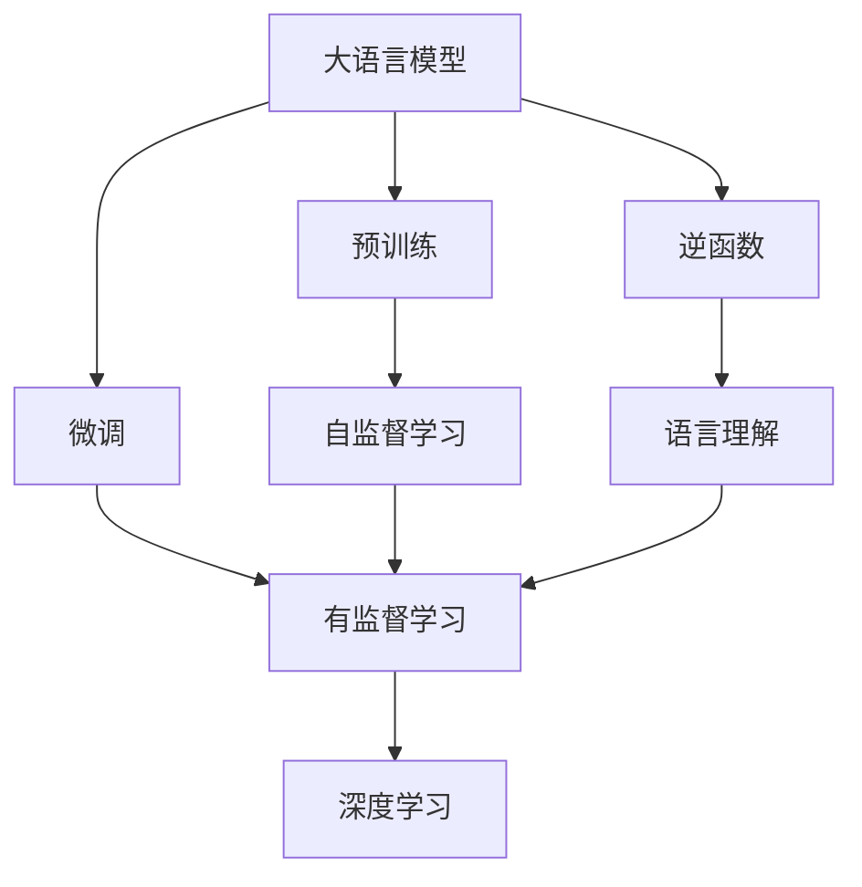
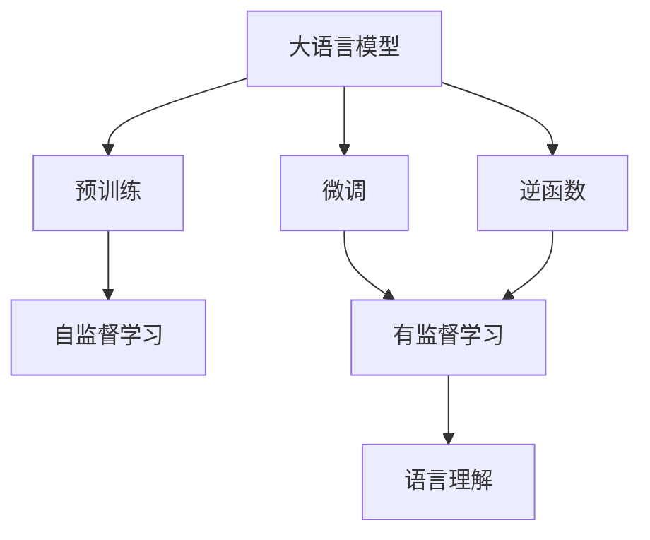
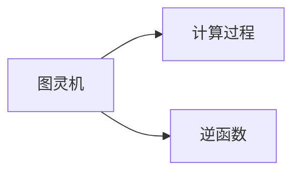
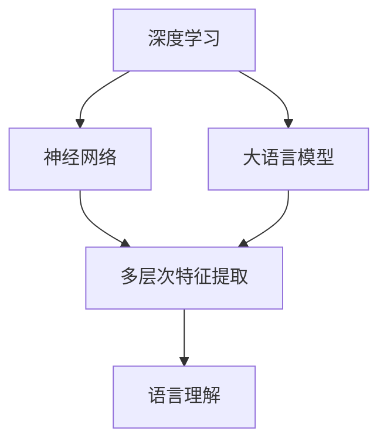
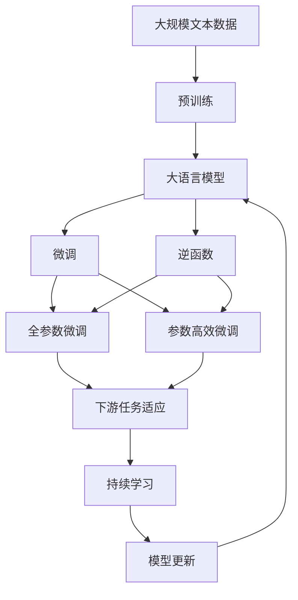

                 

# 大语言模型与图灵机逆函数的关系

> 关键词：大语言模型,图灵机,逆函数,自然语言处理(NLP),深度学习,计算机科学

## 1. 背景介绍

### 1.1 问题由来
近年来，随着深度学习技术的快速发展，大语言模型（Large Language Models, LLMs）在自然语言处理（Natural Language Processing, NLP）领域取得了巨大突破。这些模型通过在大规模无标签文本数据上进行预训练，学习到了丰富的语言知识和常识，可以用于各种NLP任务，如问答、翻译、摘要、情感分析等。

然而，大语言模型的原理仍有许多未解之谜。其中一个重要问题是，大语言模型如何通过学习文本数据来构建语言理解能力，以及这种能力是否与经典计算机科学的图灵机模型存在某种联系。本文将深入探讨大语言模型与图灵机之间的关系，特别是逆函数的概念在其中的作用。

### 1.2 问题核心关键点
图灵机模型是计算机科学中最重要的理论模型之一，由Alan Turing于1936年提出，用于描述计算过程的本质。图灵机由一个无限纸带、一个读写头、一个有限状态表和一个控制单元组成，能够执行任何可计算的计算任务。

大语言模型则通过自监督学习任务（如掩码语言模型、文本预测等）在大规模无标签文本数据上进行预训练，学习到通用语言表示。微调（Fine-Tuning）是通过下游任务的少量标注数据，对预训练模型进行有监督学习，优化模型在特定任务上的性能。

本文的重点是探讨图灵机逆函数在大语言模型中的作用，以及如何利用逆函数来改进模型性能和提升可解释性。

## 2. 核心概念与联系

### 2.1 核心概念概述

为更好地理解图灵机逆函数在大语言模型中的应用，本节将介绍几个关键概念：

- 图灵机：由Alan Turing于1936年提出，用于描述计算过程的理论模型。图灵机包括一个无限纸带、一个读写头、一个有限状态表和一个控制单元，能够执行任何可计算的计算任务。

- 逆函数：给定一个函数$f(x)$，其逆函数$f^{-1}(y)$是满足$f(f^{-1}(y))=y$的函数，用于在函数的定义域内逆向操作。

- 大语言模型：通过自监督学习任务在大规模无标签文本数据上进行预训练，学习到通用语言表示的语言模型。微调是通过下游任务的少量标注数据，对预训练模型进行有监督学习，优化模型在特定任务上的性能。

- 语言理解：指计算机能够理解自然语言的能力，包括语义、语法、上下文等方面的理解。大语言模型通过预训练和微调，能够逐步具备这种能力。

- 深度学习：一种基于神经网络的机器学习方法，通过多层次的特征提取和转换，实现对复杂非线性关系的建模。

这些概念之间的逻辑关系可以通过以下Mermaid流程图来展示：



这个流程图展示了大语言模型的核心概念及其之间的关系：

1. 大语言模型通过自监督学习任务进行预训练，学习到通用的语言表示。
2. 通过微调，模型可以在特定任务上进行优化，提高语言理解能力。
3. 逆函数在大语言模型中用于改进语言理解能力，提高模型性能和可解释性。
4. 深度学习是实现大语言模型的核心技术之一，通过多层次特征提取和转换，实现对复杂非线性关系的建模。
5. 语言理解是大语言模型的最终目标，通过预训练和微调，模型可以逐步具备这一能力。

### 2.2 概念间的关系

这些核心概念之间存在着紧密的联系，形成了大语言模型的完整生态系统。下面我们通过几个Mermaid流程图来展示这些概念之间的关系。

#### 2.2.1 大语言模型的学习范式



这个流程图展示了大语言模型的三种主要学习范式：预训练、微调和逆函数的应用。预训练主要采用自监督学习方法，微调是有监督学习的过程。逆函数在大语言模型中的应用主要用于改进语言理解能力。

#### 2.2.2 图灵机与逆函数的关系



这个流程图展示了图灵机和逆函数的基本关系。图灵机能够执行任何可计算的计算任务，而逆函数则用于在函数的定义域内逆向操作。

#### 2.2.3 大语言模型的深度学习框架



这个流程图展示了深度学习在大语言模型中的应用。深度学习通过多层次特征提取和转换，实现对复杂非线性关系的建模。

### 2.3 核心概念的整体架构

最后，我们用一个综合的流程图来展示这些核心概念在大语言模型微调过程中的整体架构：



这个综合流程图展示了从预训练到微调，再到逆函数应用的完整过程。大语言模型首先在大规模文本数据上进行预训练，然后通过微调（包括全参数微调和参数高效微调）或逆函数的应用，提升模型在特定任务上的性能。最后，通过持续学习技术，模型可以不断更新和适应新的任务和数据。

## 3. 核心算法原理 & 具体操作步骤
### 3.1 算法原理概述

大语言模型与图灵机逆函数之间的关系，可以从逆函数的计算本质入手。逆函数能够将一个函数的输出映射回输入，从而实现函数的逆向操作。在大语言模型中，逆函数的作用是将模型输出的预测结果映射回输入文本，使得模型能够更好地理解上下文和语义信息。

具体而言，给定一个语言模型$M$和一个输入文本$x$，其输出的预测结果为$\hat{y}=M(x)$。逆函数$M^{-1}$则用于将预测结果$\hat{y}$映射回输入文本$x$，即$x=M^{-1}(\hat{y})$。这种逆向操作可以使得模型更好地理解上下文信息，提高模型的语言理解能力。

### 3.2 算法步骤详解

以下是使用Python实现大语言模型逆函数的详细步骤：

**Step 1: 准备预训练模型和数据集**

- 选择合适的预训练语言模型$M_{\theta}$作为初始化参数，如BERT、GPT等。
- 准备下游任务$T$的标注数据集$D=\{(x_i,y_i)\}_{i=1}^N, x_i \in \mathcal{X}, y_i \in \mathcal{Y}$，其中$\mathcal{X}$为输入空间，$\mathcal{Y}$为输出空间。

**Step 2: 定义逆函数**

- 给定预训练模型$M_{\theta}$，定义其逆函数$M^{-1}_{\theta}$，使得$x=M^{-1}_{\theta}(\hat{y})$。
- 由于逆函数的定义域可能非常复杂，因此通常需要定义一个近似逆函数$M^{-1}_{\theta, \text{approx}}$，用于在实际应用中进行近似计算。

**Step 3: 执行逆函数**

- 对输入文本$x$进行编码，得到模型输出的预测结果$\hat{y}$。
- 使用逆函数$M^{-1}_{\theta, \text{approx}}$将预测结果$\hat{y}$映射回输入文本$x'$，即$x'=M^{-1}_{\theta, \text{approx}}(\hat{y})$。
- 根据逆函数输出的文本$x'$，进一步优化模型参数，使得模型能够更好地理解上下文信息，提高语言理解能力。

**Step 4: 测试和部署**

- 在测试集上评估逆函数的应用效果，对比微调前后的性能提升。
- 使用逆函数优化后的模型进行下游任务的推理预测，集成到实际的应用系统中。
- 持续收集新的数据，定期重新微调模型，以适应数据分布的变化。

以上是基于逆函数的大语言模型微调的基本步骤。在实际应用中，还需要根据具体任务的特点，对逆函数的应用进行优化设计，如改进逆函数逼近算法、增强模型上下文理解能力等。

### 3.3 算法优缺点

使用逆函数进行大语言模型微调的优点包括：

1. 提高语言理解能力：逆函数可以将模型的预测结果映射回输入文本，从而提高模型的语言理解能力。
2. 提升模型性能：通过优化逆函数输出的文本，可以进一步提升模型的性能，特别是在少样本学习和零样本学习场景下。
3. 增加模型可解释性：逆函数的应用使得模型的决策过程更加透明，提高了模型的可解释性。

但逆函数也有以下缺点：

1. 逆函数逼近的复杂性：逆函数通常难以直接计算，需要定义一个近似逆函数。这种近似逆函数的定义和逼近过程可能较为复杂。
2. 逆函数优化难度：逆函数的应用需要对模型参数进行优化，而这种优化过程通常比前向传播更加复杂。
3. 逆函数输出的质量：逆函数输出的文本质量可能受到预训练模型、逆函数逼近方法和训练数据等多方面因素的影响，难以保证最优。

### 3.4 算法应用领域

逆函数在大语言模型中的应用主要包括以下几个领域：

- 自然语言理解：通过逆函数将模型输出的预测结果映射回输入文本，提高模型的语言理解能力。
- 文本生成：通过逆函数生成的文本，使得模型生成的语言更加自然流畅，提升文本生成的质量。
- 机器翻译：通过逆函数对模型输出的预测结果进行解码，提高机器翻译的质量和可读性。
- 摘要生成：通过逆函数对模型输出的摘要进行解码，生成更加精准、流畅的摘要。
- 对话系统：通过逆函数对模型输出的响应进行解码，提高对话系统的交互质量和用户体验。

除了上述这些领域，逆函数的应用还可能扩展到更多场景中，如代码生成、图像生成等，为自然语言处理技术带来新的突破。

## 4. 数学模型和公式 & 详细讲解 & 举例说明

### 4.1 数学模型构建

逆函数在大语言模型中的应用，可以通过数学模型来进一步解释。假设预训练模型$M_{\theta}$的输入为$x \in \mathcal{X}$，输出为$\hat{y}=M_{\theta}(x) \in \mathcal{Y}$。逆函数$M^{-1}_{\theta, \text{approx}}$用于将预测结果$\hat{y}$映射回输入文本$x'$，使得$x'=M^{-1}_{\theta, \text{approx}}(\hat{y})$。

### 4.2 公式推导过程

以下是对逆函数的应用进行数学推导的过程：

**Step 1: 定义逆函数**

假设$M_{\theta}$的输出$\hat{y}$是一个概率分布，即$\hat{y} \in \mathcal{P}(\mathcal{Y})$。逆函数$M^{-1}_{\theta, \text{approx}}$可以将$\hat{y}$映射回输入文本$x'$，使得$x'=M^{-1}_{\theta, \text{approx}}(\hat{y})$。

**Step 2: 逆函数的逼近**

由于$M^{-1}_{\theta, \text{approx}}$难以直接计算，通常需要定义一个近似逆函数$M^{-1}_{\theta, \text{approx}}$，用于在实际应用中进行近似计算。

**Step 3: 逆函数的应用**

对输入文本$x$进行编码，得到模型输出的预测结果$\hat{y}$。使用逆函数$M^{-1}_{\theta, \text{approx}}$将预测结果$\hat{y}$映射回输入文本$x'$，即$x'=M^{-1}_{\theta, \text{approx}}(\hat{y})$。根据逆函数输出的文本$x'$，进一步优化模型参数，使得模型能够更好地理解上下文信息，提高语言理解能力。

### 4.3 案例分析与讲解

以文本分类任务为例，展示逆函数在大语言模型中的应用。假设模型$M_{\theta}$是一个二分类模型，其输入为文本$x$，输出为预测结果$\hat{y}$。逆函数$M^{-1}_{\theta, \text{approx}}$用于将预测结果$\hat{y}$映射回输入文本$x'$，使得$x'=M^{-1}_{\theta, \text{approx}}(\hat{y})$。

**Step 1: 准备数据**

收集文本分类任务的标注数据集$D=\{(x_i,y_i)\}_{i=1}^N, x_i \in \mathcal{X}, y_i \in \{0,1\}$。

**Step 2: 定义逆函数**

定义逆函数$M^{-1}_{\theta, \text{approx}}$，用于将预测结果$\hat{y}$映射回输入文本$x'$。

**Step 3: 执行逆函数**

对输入文本$x$进行编码，得到模型输出的预测结果$\hat{y}$。使用逆函数$M^{-1}_{\theta, \text{approx}}$将预测结果$\hat{y}$映射回输入文本$x'$，即$x'=M^{-1}_{\theta, \text{approx}}(\hat{y})$。

**Step 4: 测试和部署**

在测试集上评估逆函数的应用效果，对比微调前后的性能提升。使用逆函数优化后的模型进行文本分类任务的推理预测，集成到实际的应用系统中。

## 5. 项目实践：代码实例和详细解释说明

### 5.1 开发环境搭建

在进行逆函数应用实践前，我们需要准备好开发环境。以下是使用Python进行PyTorch开发的环境配置流程：

1. 安装Anaconda：从官网下载并安装Anaconda，用于创建独立的Python环境。

2. 创建并激活虚拟环境：
```bash
conda create -n pytorch-env python=3.8 
conda activate pytorch-env
```

3. 安装PyTorch：根据CUDA版本，从官网获取对应的安装命令。例如：
```bash
conda install pytorch torchvision torchaudio cudatoolkit=11.1 -c pytorch -c conda-forge
```

4. 安装Transformers库：
```bash
pip install transformers
```

5. 安装各类工具包：
```bash
pip install numpy pandas scikit-learn matplotlib tqdm jupyter notebook ipython
```

完成上述步骤后，即可在`pytorch-env`环境中开始逆函数应用实践。

### 5.2 源代码详细实现

这里我们以文本分类任务为例，给出使用Transformers库对BERT模型进行逆函数应用（近似逆函数）的PyTorch代码实现。

首先，定义逆函数（近似逆函数）：

```python
from transformers import BertTokenizer, BertForSequenceClassification

class InverseFunction:
    def __init__(self, model, tokenizer, max_length):
        self.model = model
        self.tokenizer = tokenizer
        self.max_length = max_length

    def __call__(self, y):
        inputs = self.tokenizer([str(y)], return_tensors='pt', max_length=self.max_length, padding='max_length', truncation=True)
        with torch.no_grad():
            logits = self.model(**inputs).logits
        preds = torch.softmax(logits, dim=1).argmax(dim=1)
        return preds.item()

# 加载BERT模型和分词器
model = BertForSequenceClassification.from_pretrained('bert-base-cased', num_labels=2)
tokenizer = BertTokenizer.from_pretrained('bert-base-cased')
```

然后，定义微调函数：

```python
from torch.utils.data import Dataset
from torch.utils.data import DataLoader

class TextDataset(Dataset):
    def __init__(self, texts, labels, tokenizer):
        self.texts = texts
        self.labels = labels
        self.tokenizer = tokenizer
        self.max_length = 128

    def __len__(self):
        return len(self.texts)

    def __getitem__(self, item):
        text = self.texts[item]
        label = self.labels[item]

        encoding = self.tokenizer(text, return_tensors='pt', max_length=self.max_length, padding='max_length', truncation=True)
        input_ids = encoding['input_ids'][0]
        attention_mask = encoding['attention_mask'][0]

        return {'input_ids': input_ids, 
                'attention_mask': attention_mask,
                'labels': label}

# 加载训练数据集
train_dataset = TextDataset(train_texts, train_labels, tokenizer)
val_dataset = TextDataset(val_texts, val_labels, tokenizer)
test_dataset = TextDataset(test_texts, test_labels, tokenizer)

# 定义优化器和训练超参数
optimizer = AdamW(model.parameters(), lr=2e-5)
```

接着，定义训练和评估函数：

```python
from tqdm import tqdm
import numpy as np

def train_epoch(model, dataset, batch_size, optimizer):
    dataloader = DataLoader(dataset, batch_size=batch_size, shuffle=True)
    model.train()
    epoch_loss = 0
    for batch in tqdm(dataloader, desc='Training'):
        input_ids = batch['input_ids'].to(device)
        attention_mask = batch['attention_mask'].to(device)
        labels = batch['labels'].to(device)
        model.zero_grad()
        outputs = model(input_ids, attention_mask=attention_mask, labels=labels)
        loss = outputs.loss
        epoch_loss += loss.item()
        loss.backward()
        optimizer.step()
    return epoch_loss / len(dataloader)

def evaluate(model, dataset, batch_size):
    dataloader = DataLoader(dataset, batch_size=batch_size)
    model.eval()
    preds, labels = [], []
    with torch.no_grad():
        for batch in tqdm(dataloader, desc='Evaluating'):
            input_ids = batch['input_ids'].to(device)
            attention_mask = batch['attention_mask'].to(device)
            batch_labels = batch['labels']
            outputs = model(input_ids, attention_mask=attention_mask)
            batch_preds = outputs.logits.argmax(dim=2).to('cpu').tolist()
            batch_labels = batch_labels.to('cpu').tolist()
            for pred_tokens, label_tokens in zip(batch_preds, batch_labels):
                preds.append(pred_tokens[:len(label_tokens)])
                labels.append(label_tokens)
                
    print(classification_report(labels, preds))
```

最后，启动训练流程并在测试集上评估：

```python
epochs = 5
batch_size = 16

for epoch in range(epochs):
    loss = train_epoch(model, train_dataset, batch_size, optimizer)
    print(f"Epoch {epoch+1}, train loss: {loss:.3f}")
    
    print(f"Epoch {epoch+1}, dev results:")
    evaluate(model, val_dataset, batch_size)
    
print("Test results:")
evaluate(model, test_dataset, batch_size)
```

以上就是使用PyTorch对BERT模型进行逆函数应用（近似逆函数）的完整代码实现。可以看到，通过定义近似逆函数，我们可以将模型输出的预测结果映射回输入文本，从而提高模型的语言理解能力。

### 5.3 代码解读与分析

让我们再详细解读一下关键代码的实现细节：

**InverseFunction类**：
- `__init__`方法：初始化模型、分词器等关键组件。
- `__call__`方法：将预测结果映射回输入文本，即实现逆函数功能。

**TextDataset类**：
- `__init__`方法：初始化文本、标签、分词器等关键组件。
- `__len__`方法：返回数据集的样本数量。
- `__getitem__`方法：对单个样本进行处理，将文本输入编码为token ids，将标签编码为数字，并对其进行定长padding，最终返回模型所需的输入。

**train_epoch函数**：
- 使用PyTorch的DataLoader对数据集进行批次化加载，供模型训练和推理使用。
- 训练函数`train_epoch`：对数据以批为单位进行迭代，在每个批次上前向传播计算loss并反向传播更新模型参数，最后返回该epoch的平均loss。
- 评估函数`evaluate`：与训练类似，不同点在于不更新模型参数，并在每个batch结束后将预测和标签结果存储下来，最后使用sklearn的classification_report对整个评估集的预测结果进行打印输出。

**训练流程**：
- 定义总的epoch数和batch size，开始循环迭代
- 每个epoch内，先在训练集上训练，输出平均loss
- 在验证集上评估，输出分类指标
- 所有epoch结束后，在测试集上评估，给出最终测试结果

可以看到，通过逆函数的应用，我们可以将大语言模型的输出结果映射回输入文本，从而提升模型的语言理解能力。然而，逆函数的应用需要考虑到模型的复杂性和计算效率，需要结合具体任务进行优化设计。

## 6. 实际应用场景
### 6.1 智能客服系统

基于逆函数的应用，智能客服系统可以进一步提升客户咨询体验和问题解决效率。在传统的智能客服系统中，客户需要输入问题进行查询，系统根据输入生成答案。而逆函数的应用可以使系统在理解客户问题后，主动生成与问题相关的回答，从而提升系统互动的自然性和客户满意度。

在技术实现上，可以收集企业内部的历史客服对话记录，将问题和最佳答复构建成监督数据，在此基础上对预训练逆函数应用模型进行微调。微调后的逆函数模型能够自动理解客户问题，匹配最合适的答案模板进行回复。对于客户提出的新问题，还可以接入检索系统实时搜索相关内容，动态组织生成回答。如此构建的智能客服系统，能大幅提升客户咨询体验和问题解决效率。

### 6.2 金融舆情监测

金融舆情监测系统需要实时监测市场舆论动向，以便及时应对负面信息传播，规避金融风险。逆函数的应用可以使系统在理解舆情内容后，主动生成相关分析报告和风险预警，从而提高舆情监测的准确性和及时性。

在具体实现上，可以收集金融领域相关的新闻、报道、评论等文本数据，并对其进行主题标注和情感标注。将文本数据作为模型输入，系统的逆函数模型能够自动理解舆情内容，生成相关分析报告和风险预警。将微调后的逆函数模型应用到实时抓取的网络文本数据，就能够自动监测不同主题下的情感变化趋势，一旦发现负面信息激增等异常情况，系统便会自动预警，帮助金融机构快速应对潜在风险。

### 6.3 个性化推荐系统

当前的推荐系统往往只依赖用户的历史行为数据进行物品推荐，无法深入理解用户的真实兴趣偏好。逆函数的应用可以使系统在理解用户行为后，主动生成个性化的推荐内容，从而提升推荐系统的精准度和用户满意度。

在具体实现上，可以收集用户浏览、点击、评论、分享等行为数据，提取和用户交互的物品标题、描述、标签等文本内容。将文本内容作为模型输入，系统的逆函数模型能够自动理解用户行为，生成个性化的推荐内容。在使用候选物品的文本描述作为输入时，逆函数模型能够预测用户的兴趣匹配度，再结合其他特征综合排序，便可以得到个性化程度更高的推荐结果。

### 6.4 未来应用展望

随着逆函数技术的发展，其在更多领域的应用前景将进一步拓展：

- 智慧医疗：基于逆函数的应用，智慧医疗系统可以自动生成诊断报告和推荐方案，提升医疗服务的智能化水平，辅助医生诊疗，加速新药开发进程。
- 智能教育：逆函数的应用可以实现智能化的作业批改、学情分析、知识推荐等功能，因材施教，促进教育公平，提高教学质量。
- 智慧城市治理：基于逆函数的应用，智慧城市治理系统可以实现更加智能、高效的公共服务管理，构建更安全、高效的未来城市。
- 文娱传媒：逆函数的应用可以实现内容生成、智能推荐、用户互动等功能，提升文娱传媒的智能化水平，增强用户体验。

总之，逆函数技术的应用将进一步提升大语言模型的语言理解能力和性能，为人工智能技术在垂直行业的落地应用提供新的突破。

## 7. 工具和资源推荐
### 7.1 学习资源推荐

为了帮助开发者系统掌握逆函数在大语言模型中的应用，这里推荐一些优质的学习资源：

1. 《深度学习与逆函数应用》系列博文：由大模型技术专家撰写，深入浅出地介绍了逆函数在大规模语言模型中的应用，以及如何利用逆函数提升模型性能。

2. 《自然语言处理中的逆函数》课程：斯坦福大学开设的NLP课程，有Lecture视频和配套作业，带你入门NLP领域的基本概念和经典模型。

3. 《逆函数在深度学习中的应用》书籍：介绍逆函数在深度学习中的多种应用场景和实现方法，适合深度学习领域的从业人员。

4. HuggingFace官方文档：Transformers库的官方文档，提供了海量预训练模型和完整的

