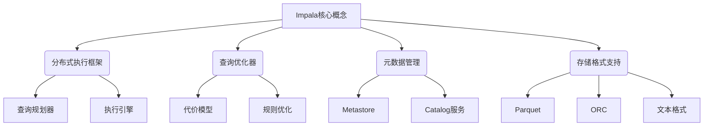
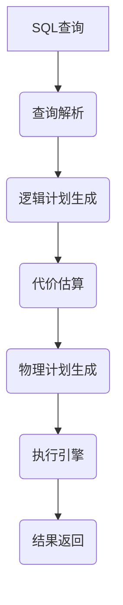

# Impala原理与代码实例讲解

## 1. 背景介绍

### 1.1 问题的由来

在大数据时代，数据量的快速增长使得传统的数据库系统难以满足实时分析的需求。为了解决这一问题,Apache Impala应运而生。Impala是一种分析型大规模并行处理(Massively Parallel Processing,MPP)的SQL查询引擎,旨在提供低延迟和高吞吐量的大数据分析能力。

### 1.2 研究现状

目前,Impala已经被广泛应用于各种大数据分析场景,如交互式商业智能(BI)、数据探索和数据仓库等。它基于Google的Dremel项目,并针对Apache Hadoop生态系统进行了优化。与Apache Hive等其他大数据查询引擎相比,Impala具有更低的延迟、更高的并行度和更好的性能。

### 1.3 研究意义

深入理解Impala的原理和实现细节,对于优化查询性能、提高数据分析效率至关重要。本文将全面剖析Impala的核心概念、算法原理、数学模型以及实际应用,为读者提供一个系统的学习和实践指南。

### 1.4 本文结构

本文将从以下几个方面对Impala进行深入探讨:

1. 核心概念与联系
2. 核心算法原理与具体操作步骤
3. 数学模型和公式详细讲解及案例分析
4. 项目实践:代码实例和详细解释
5. 实际应用场景
6. 工具和资源推荐
7. 总结:未来发展趋势与挑战
8. 附录:常见问题与解答

## 2. 核心概念与联系



Impala的核心概念主要包括以下几个方面:

1. **分布式执行框架**: Impala采用了分布式架构,由多个组件协同工作以实现高效的查询执行。其中包括查询规划器(Query Planner)和执行引擎(Execution Engine)。
2. **查询优化器**: 查询优化器负责分析SQL查询,并基于代价模型(Cost Model)和规则优化(Rule-based Optimization)生成高效的执行计划。
3. **元数据管理**: Impala通过Metastore和Catalog服务管理表、视图、函数等元数据信息。
4. **存储格式支持**: Impala支持多种列式存储格式,如Parquet、ORC和文本格式,以提高查询效率。

这些核心概念相互关联,共同构建了Impala高性能的分析引擎。

## 3. 核心算法原理 & 具体操作步骤

### 3.1 算法原理概述

Impala的核心算法原理基于谷歌的Dremel项目,采用了树形执行计划和列式存储格式。其主要思想是将数据按列存储,并通过高度并行化的执行引擎进行查询处理。



1. **查询解析**: SQL查询首先被解析成抽象语法树(AST)。
2. **逻辑计划生成**: AST被转换为逻辑执行计划,描述了查询的高级操作。
3. **代价估算**: 查询优化器基于代价模型估算每个可能的执行计划的代价。
4. **物理计划生成**: 选择代价最小的执行计划,并生成对应的物理执行计划。
5. **执行引擎**: 物理执行计划由执行引擎并行执行,从而高效地处理查询。
6. **结果返回**: 最终查询结果被返回给客户端。

### 3.2 算法步骤详解

1. **查询解析**

   Impala使用ANTLR解析器将SQL查询解析为抽象语法树(AST)。AST描述了查询的语法结构,为后续的逻辑计划生成奠定基础。

2. **逻辑计划生成**

   Impala的查询优化器将AST转换为逻辑执行计划,其中包含一系列关系代数操作,如扫描、投影、连接、聚合等。逻辑计划描述了查询的高级操作,而不涉及具体的执行细节。

3. **代价估算**

   查询优化器基于代价模型估算每个可能的执行计划的代价。代价模型考虑了多个因素,如数据大小、数据分布、计算资源等,以确定最优的执行计划。

4. **物理计划生成**

   根据代价估算结果,查询优化器选择代价最小的执行计划,并将其转换为物理执行计划。物理计划包含了具体的执行操作,如扫描、哈希连接、聚合等。

5. **执行引擎**

   Impala的执行引擎并行执行物理执行计划。它利用了列式存储格式的优势,只读取所需的列数据,从而提高了I/O效率。执行引擎采用了多种优化技术,如向量化执行、代码生成等,以进一步提升查询性能。

6. **结果返回**

   执行引擎处理完查询后,将结果返回给客户端。Impala支持多种结果格式,如纯文本、Parquet等,以满足不同的使用场景。

### 3.3 算法优缺点

**优点**:

- 高度并行化的执行引擎,能够充分利用集群资源。
- 支持列式存储格式,提高了I/O效率。
- 查询优化器采用了多种优化技术,如代价模型、规则优化等,能够生成高效的执行计划。
- 与Hadoop生态系统无缝集成,可以直接查询HDFS上的数据。

**缺点**:

- 对于小规模数据集,Impala的性能优势可能不太明显。
- 对于需要频繁更新的工作负载,Impala可能不太适合,因为它主要面向分析型查询。
- 元数据管理依赖于Hive Metastore,可能会带来一些性能瓶颈。

### 3.4 算法应用领域

Impala主要应用于以下几个领域:

1. **交互式商业智能(BI)**: Impala可以提供低延迟的数据查询和分析,支持各种BI工具和仪表板。
2. **数据探索**: Impala适合于对大规模数据集进行ad-hoc查询和数据探索。
3. **数据仓库**: Impala可以作为数据仓库的查询引擎,提供高性能的分析能力。
4. **ETL工作流**: Impala可以用于ETL(提取、转换、加载)工作流中的数据处理和转换。

总的来说,Impala擅长于需要低延迟和高吞吐量的大数据分析场景。

## 4. 数学模型和公式 & 详细讲解 & 举例说明

### 4.1 数学模型构建

Impala的查询优化器采用了基于代价的优化策略,其核心是代价模型。代价模型旨在估算每个可能的执行计划的代价,从而选择代价最小的执行计划。

Impala的代价模型主要考虑以下几个因素:

- 数据大小: 包括表的行数、列数以及每列的数据大小。
- 数据分布: 包括数据在集群中的分布情况,如数据倾斜等。
- 计算资源: 包括CPU、内存、网络带宽等资源的可用情况。
- 操作代价: 包括扫描、连接、聚合等操作的代价估算。

基于上述因素,Impala构建了一个综合的代价模型,用于估算执行计划的总代价。总代价可以表示为:

$$
Cost_{total} = \sum_{i=1}^{n} Cost_{op_i} + \sum_{j=1}^{m} Cost_{transfer_j}
$$

其中:

- $Cost_{op_i}$ 表示第 i 个操作的代价,包括CPU和I/O代价。
- $Cost_{transfer_j}$ 表示第 j 个数据传输的代价,包括网络传输和数据重分布的代价。
- n 是操作数量,m 是数据传输数量。

### 4.2 公式推导过程

我们以估算扫描操作的代价为例,推导相关公式。

扫描操作的代价主要包括两部分:I/O代价和CPU代价。

**I/O代价**

I/O代价与需要读取的数据大小成正比。假设需要扫描的表有 R 行,每行大小为 row_size,则I/O代价可表示为:

$$
Cost_{IO} = R \times row\_size
$$

**CPU代价**

CPU代价与需要处理的数据量和操作复杂度有关。假设每行数据的CPU处理代价为 cpu_cost,则CPU代价可表示为:

$$
Cost_{CPU} = R \times cpu\_cost
$$

综合I/O代价和CPU代价,扫描操作的总代价为:

$$
Cost_{scan} = Cost_{IO} + Cost_{CPU} = R \times (row\_size + cpu\_cost)
$$

在实际估算中,Impala会根据具体的存储格式、压缩比例、数据分布等因素,对上述公式进行调整和优化。

### 4.3 案例分析与讲解

假设我们需要扫描一个存储在HDFS上的Parquet表 orders,该表有 1 亿行,每行大小约为 100 字节。我们来估算扫描该表的代价。

首先,我们需要确定每行数据的 cpu_cost。根据经验,对于 Parquet 格式的数据,cpu_cost 约为 10 纳秒。

接下来,我们可以计算扫描操作的代价:

$$
\begin{aligned}
R &= 10^8 \
row\_size &= 100 \text{ bytes} \
cpu\_cost &= 10 \text{ ns} \
Cost_{scan} &= R \times (row\_size + cpu\_cost) \
           &= 10^8 \times (100 \text{ bytes} + 10 \text{ ns}) \
           &= 10^{10} \text{ bytes} + 10^9 \text{ ns} \
           &\approx 9.54 \text{ GB} + 1 \text{ s}
\end{aligned}
$$

因此,扫描 1 亿行的 Parquet 表需要读取约 9.54 GB 的数据,并且需要约 1 秒的 CPU 时间。

通过上述案例,我们可以看到 Impala 的代价模型如何估算查询操作的代价,从而指导查询优化器选择最优的执行计划。

### 4.4 常见问题解答

**1. Impala 的代价模型是如何处理数据倾斜的?**

Impala 的代价模型会考虑数据分布情况,包括数据倾斜。对于倾斜的数据,Impala 会增加相应的代价估算,从而避免选择不合适的执行计划。同时,Impala 也提供了一些技术来缓解数据倾斜的影响,如广播连接(Broadcast Join)和分区裁剪(Partition Pruning)。

**2. Impala 是如何估算连接操作的代价的?**

对于连接操作,Impala 会根据连接类型(如哈希连接、嵌套循环连接等)、连接键的基数、数据大小等因素来估算代价。通常情况下,Impala 会优先选择哈希连接,因为它具有更好的性能。

**3. Impala 的代价模型是否考虑了并行度?**

是的,Impala 的代价模型会考虑集群中可用的计算资源和并行度。对于并行执行的操作,Impala 会根据可用的插槽数量来估算代价。

## 5. 项目实践:代码实例和详细解释说明

在本节中,我们将通过一个实际的代码示例,展示如何使用 Impala 进行数据分析。

### 5.1 开发环境搭建

首先,我们需要准备一个 Hadoop 集群环境,并在集群中安装 Impala。以下是一个基于 Docker 的快速搭建方式:

1. 拉取 Impala 镜像:

```bash
docker pull apache/impala:latest
```

2