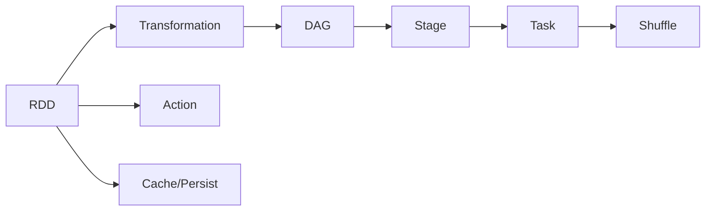

# Spark内存计算引擎原理与代码实例讲解

关键词：Spark、内存计算、DAG、RDD、Shuffle、Cache

## 1. 背景介绍
### 1.1 问题的由来
随着大数据时代的到来,传统的基于磁盘的 MapReduce 计算框架已经难以满足实时计算、迭代计算等场景下的计算需求。Spark 应运而生,其基于内存的计算引擎大大提高了数据处理和计算的效率。
### 1.2 研究现状
目前 Spark 已经成为大数据领域最流行的开源分布式计算框架之一,被广泛应用于数据处理、机器学习、图计算等领域。众多互联网公司都基于 Spark 构建了自己的大数据处理平台。
### 1.3 研究意义
深入理解 Spark 内存计算引擎的原理,对于优化 Spark 程序性能、改进计算框架都有重要意义。同时对于学习和研究其他分布式计算框架也很有启发。
### 1.4 本文结构
本文将从 Spark 内存计算的核心概念出发,结合代码实例深入讲解其中的原理。内容涵盖 RDD、Spark 运行架构、Shuffle 原理、内存管理、容错机制、典型应用场景等方面。

## 2. 核心概念与联系

Spark 内存计算引擎的核心概念主要包括:

- RDD(Resilient Distributed Dataset):Spark 核心数据抽象,提供了一组 API 用于操作分布在集群上的内存数据集。
- DAG(Directed Acyclic Graph):Spark 通过 DAG 描述 RDD 之间的依赖关系,进而生成物理执行计划。
- Shuffle:Spark 在 Stage 边界上引入 Shuffle,将一个 Stage 的计算结果重分区到下一个 Stage。
- Cache:Spark 支持将 RDD 数据缓存在内存或磁盘中,加速后续的计算。

下图展示了 Spark 核心概念之间的关系:



## 3. 核心算法原理 & 具体操作步骤
### 3.1 算法原理概述
Spark 内存计算引擎基于 RDD 模型,通过函数式编程的 Transformation 和 Action 操作来描述计算逻辑。Spark 会根据 RDD 之间的依赖关系构建 DAG,将 DAG 划分为多个 Stage,每个 Stage 内部是一组并行 Task。Task 在集群的 Executor 进程上运行,读写 HDFS 等分布式存储系统上的数据。
### 3.2 算法步骤详解
1. 构建 RDD 对象,可以从 HDFS、HBase、Local FS 等数据源创建。
2. 通过一系列的 Transformation(如 map、filter、join 等)构建 RDD 之间的依赖关系,形成 Lineage(血统)。这一步是 lazy 的,即不会触发真正计算。
3. 当执行 Action(如 count、collect)时,Spark 会根据 RDD 的 Lineage 构建 DAG。
4. DAG Scheduler 将 DAG 划分为多个 Stage,每个 Stage 内部是一组并行 Task,Stage 之间以 Shuffle 依赖相连。
5. Task Scheduler 将 Task 分发到集群的 Executor 进程,Task 在分配到的分区上执行计算。
6. 如果 Shuffle 依赖,需要将上游 Stage 的计算结果持久化到磁盘,供下游 Stage 拉取。
7. 将所有 Task 的执行结果进行合并,得到 Action 的最终结果。
### 3.3 算法优缺点
优点:
- 基于内存的高性能计算
- DAG 引擎可自动划分 Stage,减少数据 IO
- 容错机制和数据本地性保证了高可用性
- 支持多种数据源和丰富的 API

缺点:
- 不适合流式小批量数据处理
- 不支持细粒度的资源隔离
- Shuffle 可能成为性能瓶颈
### 3.4 算法应用领域
Spark 内存计算引擎广泛应用于以下领域:
- 大规模数据 ETL 和数据分析
- 机器学习和图计算
- 交互式数据查询
- 流式数据处理

## 4. 数学模型和公式 & 详细讲解 & 举例说明
### 4.1 数学模型构建
Spark 内存计算引擎涉及的数学模型主要有:
- 有向无环图 DAG 模型
- RDD 依赖模型
- Stage 划分模型
- 任务调度模型

以 RDD 依赖模型为例,RDD 之间存在窄依赖(Narrow Dependency)和宽依赖(Wide Dependency,即 Shuffle Dependency)。

窄依赖:每个父 RDD 的 Partition 最多被子 RDD 的一个 Partition 使用。
$$
Dependency(RDD_1,RDD_2)=\bigcup\limits_{p_2\in RDD_2} \left\{p_1\left|p_1\in RDD_1 \wedge Dependency\left(p_1,p_2\right)\right.\right\}
$$

宽依赖:多个子 RDD 的 Partition 会依赖同一个父 RDD 的 Partition,引起 Shuffle。
$$
Dependency(RDD_1,RDD_2)=\left\{p_1\left|p_1\in RDD_1 \wedge \exists p_2\in RDD_2,Dependency\left(p_1,p_2\right)\right.\right\}
$$
### 4.2 公式推导过程
以 RDD 依赖模型中的窄依赖为例,推导如下:
1. 定义 $RDD_1$ 和 $RDD_2$ 及其 Partition 之间的依赖关系 $Dependency$。
2. 对于 $RDD_2$ 中的每个 Partition $p_2$,找出其在 $RDD_1$ 中依赖的所有 Partition 集合。
3. 将每个 $p_2$ 依赖的 $RDD_1$ 的 Partition 集合合并,去重,得到 $RDD_1$ 和 $RDD_2$ 之间的窄依赖。

宽依赖的推导过程类似,区别在于一个父 Partition 可以被多个子 Partition 依赖。
### 4.3 案例分析与讲解
下面以一个词频统计的例子说明 RDD 之间的依赖关系:

```scala
val textFile = sc.textFile("hdfs://...")
val counts = textFile.flatMap(line => line.split(" "))
                     .map(word => (word, 1))
                     .reduceByKey(_ + _)
counts.collect()
```

其中 RDD 之间的依赖关系如下:

```
textFile ---> flatMap ---> map ---> reduceByKey ---> collect
```

其中,textFile 到 map 是窄依赖,reduceByKey 到 collect 是宽依赖(Shuffle)。
### 4.4 常见问题解答
- Q:如何区分窄依赖和宽依赖?
- A:窄依赖是指每个父 RDD 的 Partition 最多被子 RDD 的一个 Partition 使用,而宽依赖则是多个子 Partition 会依赖同一个父 Partition。需要引起 Shuffle 的操作如 reduceByKey、join 等都会产生宽依赖。

## 5. 项目实践：代码实例和详细解释说明
### 5.1 开发环境搭建
- Spark:2.4.0
- Scala:2.12.0
- JDK:1.8
- IDEA:2019.2

在 IDEA 中新建一个 Maven 项目,添加 Spark 依赖:

```xml
<dependency>
    <groupId>org.apache.spark</groupId>
    <artifactId>spark-core_2.12</artifactId>
    <version>2.4.0</version>
</dependency>
```
### 5.2 源代码详细实现
以词频统计为例,实现如下:

```scala
import org.apache.spark.{SparkConf, SparkContext}

object WordCount {
  def main(args: Array[String]): Unit = {
    val conf = new SparkConf().setAppName("WordCount").setMaster("local[2]")
    val sc = new SparkContext(conf)

    val textFile = sc.textFile("data/wordcount.txt")
    val wordCounts = textFile.flatMap(line => line.split(" "))
      .map(word => (word, 1))
      .reduceByKey(_ + _)

    wordCounts.collect().foreach(println)

    sc.stop()
  }
}
```
### 5.3 代码解读与分析
1. 创建 SparkConf 对象,设置应用名称和运行模式。
2. 创建 SparkContext 对象,它是 Spark 程序的入口。
3. 读取文本文件,创建 RDD。
4. 对 RDD 进行一系列 Transformation:
   - flatMap 将每一行拆分为单词
   - map 将每个单词转换为 (word, 1) 的形式
   - reduceByKey 按单词进行分组,对每个组内的计数相加
5. 调用 Action 算子 collect 将结果拉取到 Driver,打印输出。
6. 关闭 SparkContext。

其中,flatMap 和 map 是窄依赖,reduceByKey 会产生宽依赖,需要 Shuffle。
### 5.4 运行结果展示
假设 wordcount.txt 文件内容如下:

```
hello world
hello spark
hello hadoop
```

则运行结果为:

```
(hadoop,1)
(hello,3)
(spark,1)
(world,1)
```

## 6. 实际应用场景
Spark 内存计算引擎在实际中有非常广泛的应用,主要场景包括:
- 日志分析:对服务器、App 等产生的日志进行实时或离线分析,挖掘用户行为特征。
- 用户画像:对用户的历史行为数据进行挖掘,构建用户画像,应用于个性化推荐等服务。
- 交互式查询:利用 Spark SQL 对结构化数据进行交互式查询分析。
- 图计算:利用 GraphX 进行社交网络分析、PageRank 计算等。
- 机器学习:利用 MLlib 进行大规模机器学习,如分类、聚类、协同过滤等。
### 6.4 未来应用展望
未来 Spark 有望在以下领域得到更广泛应用:
- 流批一体:Structured Streaming 将流处理与批处理统一,简化应用开发。
- 深度学习:与 TensorFlow、PyTorch 等深度学习框架结合,进行大规模分布式训练。
- 云原生:基于 Kubernetes 实现 Spark 应用的弹性调度和动态资源分配。
- 数据湖分析:对数据湖中的结构化、半结构化数据进行分析挖掘。

## 7. 工具和资源推荐
### 7.1 学习资源推荐
- 《Spark: The Definitive Guide》
- 《Learning Spark》
- Spark 官方文档:http://spark.apache.org/docs/latest/
- Spark 源码:https://github.com/apache/spark
### 7.2 开发工具推荐
- IDEA + Maven + Scala 插件
- Spark-shell:交互式 Scala/Python Shell
- Zeppelin:基于 Web 的交互式开发和可视化工具
- Spark SQL CLI:交互式 SQL 查询命令行
### 7.3 相关论文推荐
- Resilient Distributed Datasets: A Fault-Tolerant Abstraction for In-Memory Cluster Computing
- Spark SQL: Relational Data Processing in Spark
- GraphX: Graph Processing in a Distributed Dataflow Framework
### 7.4 其他资源推荐
- Databricks 博客:https://databricks.com/blog
- Spark Summit 大会:https://databricks.com/sparkaisummit
- Spark Packages:http://spark-packages.org

## 8. 总结：未来发展趋势与挑战
### 8.1 研究成果总结
本文从 Spark 内存计算引擎的核心概念出发,结合数学模型和代码实例,对其原理进行了深入讲解。Spark 基于 RDD 模型,通过 DAG 引擎动态生成并优化物理执行计划,支持多种数据源、丰富的 API 和容错机制,使其成为大数据处理领域的主流框架。
### 8.2 未来发展趋势
展望未来,Spark 有望向以下方向发展:
- 云原生化:原生支持 Kubernetes,简化部署和资源管理。
- 批流一体化:统一流处理和批处理 API,简化应用开发。
- AI 平台化:与深度学习框架无缝整合,成为 AI 应用的首选数据处理平台。
- 扩展性增强:在保持