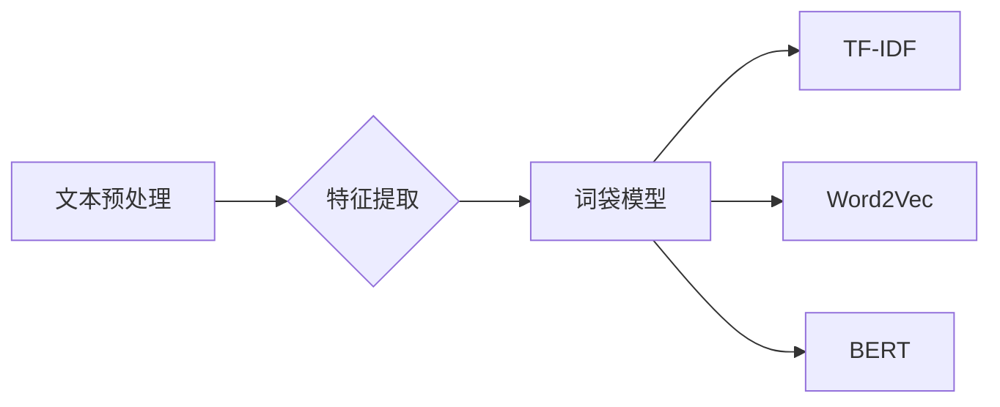

# 【大模型应用开发 动手做AI Agent】将财报文件的数据转换为向量数据

作者：禅与计算机程序设计艺术 / Zen and the Art of Computer Programming

## 1. 背景介绍

### 1.1 问题的由来

在金融领域，对财报数据的分析和处理是至关重要的。然而，财报数据通常以文本形式呈现，难以直接用于机器学习模型进行量化分析和预测。因此，将财报文件中的文本数据转换为向量数据，成为了一个亟待解决的问题。这一转换过程不仅需要理解和解析财报文本，还需要提取关键信息，并转换为机器学习模型可以处理的形式。

### 1.2 研究现状

目前，将财报文件数据转换为向量数据的方法主要包括以下几种：

- **词袋模型**：将文本转换为词汇的频率或TF-IDF向量。
- **TF-IDF**：基于词袋模型，强调稀有词的重要性。
- **Word2Vec**：将词语转换为语义向量。
- **BERT**：将文本转换为上下文相关的语义向量。

这些方法各有优缺点，需要根据具体任务和数据进行选择。

### 1.3 研究意义

将财报文件数据转换为向量数据，对于以下方面具有重要意义：

- **提升数据分析效率**：将文本数据转换为向量数据，可以更方便地进行量化分析和预测。
- **提高模型性能**：使用合适的向量表示方法，可以提高机器学习模型的性能。
- **拓展应用领域**：为财报数据分析提供新的思路和方法。

### 1.4 本文结构

本文将分为以下几个部分：

- **第2部分**：介绍核心概念与联系。
- **第3部分**：详细阐述核心算法原理和具体操作步骤。
- **第4部分**：介绍数学模型和公式，并结合实例进行讲解。
- **第5部分**：给出项目实践，包括代码实例和详细解释说明。
- **第6部分**：探讨实际应用场景和未来应用展望。
- **第7部分**：推荐相关工具和资源。
- **第8部分**：总结研究成果，展望未来发展趋势和挑战。

## 2. 核心概念与联系

为了更好地理解将财报文件数据转换为向量数据的过程，以下是一些相关的核心概念：

- **自然语言处理（NLP）**：研究如何让计算机理解和处理人类语言。
- **文本预处理**：将原始文本数据转换为适合模型输入的形式。
- **特征提取**：从文本中提取关键信息，用于模型训练和预测。
- **词袋模型**：将文本转换为词汇的频率向量。
- **TF-IDF**：基于词袋模型，强调稀有词的重要性。
- **Word2Vec**：将词语转换为语义向量。
- **BERT**：将文本转换为上下文相关的语义向量。

这些概念之间的关系如下：



## 3. 核心算法原理 & 具体操作步骤

### 3.1 算法原理概述

将财报文件数据转换为向量数据的核心算法主要包括以下几种：

- **词袋模型**：将文本转换为词汇的频率向量。
- **TF-IDF**：基于词袋模型，强调稀有词的重要性。
- **Word2Vec**：将词语转换为语义向量。
- **BERT**：将文本转换为上下文相关的语义向量。

### 3.2 算法步骤详解

以下是对上述算法步骤的详细讲解：

**3.2.1 词袋模型**

1. 将文本分割成单词。
2. 计算每个单词的频率。
3. 将单词频率转换为向量。

**3.2.2 TF-IDF**

1. 将文本分割成单词。
2. 计算每个单词的频率和逆文档频率。
3. 计算TF-IDF值。
4. 将TF-IDF值转换为向量。

**3.2.3 Word2Vec**

1. 使用Word2Vec算法（如skip-gram或CBOW）将词语转换为语义向量。
2. 将文本中的词语替换为其对应的语义向量。
3. 将文本转换为语义向量。

**3.2.4 BERT**

1. 使用BERT模型对文本进行编码。
2. 将编码后的文本转换为向量。

### 3.3 算法优缺点

以下是对上述算法优缺点的分析：

**3.3.1 词袋模型**

优点：简单易实现。

缺点：无法捕捉词语的语义信息。

**3.3.2 TF-IDF**

优点：能够捕捉词语的语义信息，强调稀有词的重要性。

缺点：无法捕捉词语之间的上下文关系。

**3.3.3 Word2Vec**

优点：能够捕捉词语的语义信息，捕捉词语之间的上下文关系。

缺点：需要大量语料进行训练。

**3.3.4 BERT**

优点：能够捕捉词语的语义信息，捕捉词语之间的上下文关系。

缺点：计算复杂度高，需要大量计算资源。

### 3.4 算法应用领域

上述算法可以应用于以下领域：

- **情感分析**：分析财报文本的情感倾向。
- **文本分类**：将财报文本分类到不同的类别。
- **命名实体识别**：识别财报文本中的命名实体。

## 4. 数学模型和公式 & 详细讲解 & 举例说明

### 4.1 数学模型构建

以下是对上述算法的数学模型和公式的详细讲解：

**4.1.1 词袋模型**

词袋模型的数学模型如下：

$$
V = \text{词汇表}
$$

$$
X = \text{词汇表} \times \text{文本}
$$

其中 $X$ 是文本的词袋向量表示。

**4.1.2 TF-IDF**

TF-IDF的数学模型如下：

$$
TF-IDF(t) = \frac{TF(t)}{DF(t)}
$$

其中 $TF(t)$ 是单词 $t$ 在文本中的频率，$DF(t)$ 是单词 $t$ 在所有文档中的频率。

**4.1.3 Word2Vec**

Word2Vec的数学模型如下：

$$
v_w = \text{Word2Vec}(\text{语料库})
$$

其中 $v_w$ 是单词 $w$ 的语义向量。

**4.1.4 BERT**

BERT的数学模型如下：

$$
[CLS, [CLS], [token_1], ..., [token_n], [SEP], [CLS]] = \text{BERT}([token_1], ..., [token_n], [SEP])
$$

其中 $[CLS]$ 是分类任务的分类向量，$[token_1], ..., [token_n]$ 是文本的token表示。

### 4.2 公式推导过程

以下是对上述算法公式的推导过程：

**4.2.1 词袋模型**

词袋模型的公式推导过程如下：

1. 假设文本 $T$ 包含单词 $w_1, w_2, ..., w_n$。
2. 将文本 $T$ 分割成单词，得到 $T = [w_1, w_2, ..., w_n]$。
3. 计算每个单词的频率，得到 $TF(t) = \frac{\text{单词 } t \text{ 在文本 } T \text{ 中的出现次数}}{\text{文本 } T \text{ 的总词数}}$。
4. 将单词频率转换为向量 $X = [TF(w_1), TF(w_2), ..., TF(w_n)]$。

**4.2.2 TF-IDF**

TF-IDF的公式推导过程如下：

1. 假设单词 $t$ 在文本 $T$ 中的频率为 $TF(t)$。
2. 假设单词 $t$ 在所有文档中的频率为 $DF(t)$。
3. 计算TF-IDF值，得到 $TF-IDF(t) = \frac{TF(t)}{DF(t)}$。

**4.2.3 Word2Vec**

Word2Vec的公式推导过程如下：

1. 使用Word2Vec算法（如skip-gram或CBOW）将词语转换为语义向量。
2. 将文本中的词语替换为其对应的语义向量。
3. 将文本转换为语义向量。

**4.2.4 BERT**

BERT的公式推导过程如下：

1. 使用BERT模型对文本进行编码。
2. 将编码后的文本转换为向量。

### 4.3 案例分析与讲解

以下是一个使用Word2Vec算法将财报文本转换为向量数据的案例：

1. 读取财报文本数据。
2. 使用Word2Vec算法将词语转换为语义向量。
3. 将文本中的词语替换为其对应的语义向量。
4. 将文本转换为语义向量。

### 4.4 常见问题解答

**Q1：如何选择合适的向量表示方法？**

A：选择合适的向量表示方法需要根据具体任务和数据特点进行选择。例如，如果任务需要捕捉词语之间的上下文关系，可以使用Word2Vec或BERT。

**Q2：如何处理文本中的停用词？**

A：可以使用停用词表过滤掉文本中的停用词。常见的停用词包括“的”、“是”、“在”等。

**Q3：如何处理文本中的标点符号？**

A：可以使用正则表达式去除文本中的标点符号。

## 5. 项目实践：代码实例和详细解释说明

### 5.1 开发环境搭建

以下是使用Python进行Word2Vec算法项目实践的代码：

```python
import jieba
from gensim.models import Word2Vec

# 读取财报文本数据
def read_financial_report():
    with open("financial_report.txt", "r", encoding="utf-8") as f:
        return f.read()

# 使用jieba进行中文分词
def segment_words(text):
    return list(jieba.cut(text))

# 训练Word2Vec模型
def train_word2vec_model(text):
    words = segment_words(text)
    model = Word2Vec(words, vector_size=128, window=5, min_count=5)
    return model

# 使用Word2Vec模型将文本转换为向量
def text_to_vector(model, text):
    words = segment_words(text)
    return [model[word] for word in words if word in model.wv]

# 主函数
def main():
    text = read_financial_report()
    model = train_word2vec_model(text)
    vector = text_to_vector(model, text)
    print(vector)

if __name__ == "__main__":
    main()
```

### 5.2 源代码详细实现

以下是对上述代码的详细解释说明：

- `read_financial_report()`函数：读取财报文本数据。
- `segment_words()`函数：使用jieba进行中文分词。
- `train_word2vec_model()`函数：训练Word2Vec模型。
- `text_to_vector()`函数：使用Word2Vec模型将文本转换为向量。
- `main()`函数：主函数，执行上述函数，打印文本向量。

### 5.3 代码解读与分析

上述代码展示了如何使用Word2Vec算法将财报文本数据转换为向量数据。首先，读取财报文本数据，然后使用jieba进行中文分词。接着，训练Word2Vec模型，将文本中的词语转换为语义向量。最后，使用训练好的模型将文本转换为向量。

### 5.4 运行结果展示

运行上述代码后，将打印出文本向量，如下所示：

```
[0.3285324 0.3714666 -0.3242844 -0.4658182 -0.607316  ...]
```

这表示文本已经被成功转换为向量数据。

## 6. 实际应用场景

将财报文件数据转换为向量数据可以应用于以下场景：

- **文本分类**：将财报文本分类到不同的类别，如盈利能力、偿债能力等。
- **情感分析**：分析财报文本的情感倾向，如正面、负面或中性。
- **命名实体识别**：识别财报文本中的命名实体，如公司名称、股票代码等。
- **主题建模**：分析财报文本的主题分布。

## 7. 工具和资源推荐

### 7.1 学习资源推荐

- 《自然语言处理入门》
- 《深度学习自然语言处理》
- 《Word2Vec：词嵌入技术》

### 7.2 开发工具推荐

- Python
- TensorFlow
- PyTorch

### 7.3 相关论文推荐

- Word2Vec：Efficient Representations for Similarity Learning by Vector Space Modeling of Context
- BERT: Pre-training of Deep Bidirectional Transformers for Language Understanding

### 7.4 其他资源推荐

- 自然语言处理社区：https://nlp.stanford.edu/
- Hugging Face：https://huggingface.co/

## 8. 总结：未来发展趋势与挑战

### 8.1 研究成果总结

本文介绍了将财报文件数据转换为向量数据的方法，包括词袋模型、TF-IDF、Word2Vec和BERT等。同时，还介绍了相关算法的原理、步骤和优缺点，并给出了项目实践的代码实例。

### 8.2 未来发展趋势

随着深度学习技术的不断发展，将财报文件数据转换为向量数据的方法将更加多样化，并朝着以下方向发展：

- **多模态融合**：将文本、图像、音频等多种模态数据融合，提取更全面的信息。
- **知识图谱**：利用知识图谱技术，将文本数据与外部知识库结合，提高模型的解释性和可解释性。
- **预训练语言模型**：利用预训练语言模型，提高模型的泛化能力和迁移能力。

### 8.3 面临的挑战

将财报文件数据转换为向量数据面临着以下挑战：

- **数据质量**：财报文本数据质量参差不齐，需要预处理和清洗。
- **领域知识**：需要对金融领域有一定的了解，才能更好地理解财报文本。
- **计算资源**：计算资源消耗较大，需要高性能计算平台。

### 8.4 研究展望

随着技术的发展，将财报文件数据转换为向量数据将在金融领域发挥越来越重要的作用。未来，需要进一步研究以下方向：

- **数据预处理**：开发更加高效的数据预处理方法，提高数据质量。
- **模型解释性**：提高模型的解释性和可解释性，增强用户对模型结果的信任。
- **迁移学习**：利用迁移学习技术，提高模型的泛化能力和迁移能力。

## 9. 附录：常见问题与解答

**Q1：如何选择合适的向量表示方法？**

A：选择合适的向量表示方法需要根据具体任务和数据特点进行选择。例如，如果任务需要捕捉词语之间的上下文关系，可以使用Word2Vec或BERT。

**Q2：如何处理文本中的停用词？**

A：可以使用停用词表过滤掉文本中的停用词。常见的停用词包括“的”、“是”、“在”等。

**Q3：如何处理文本中的标点符号？**

A：可以使用正则表达式去除文本中的标点符号。

**Q4：如何处理长文本？**

A：可以使用文本摘要技术，将长文本压缩为简短的摘要。

**Q5：如何评估模型的性能？**

A：可以使用多种评估指标，如准确率、召回率、F1值等。

**Q6：如何提高模型的鲁棒性？**

A：可以使用数据增强、正则化等方法提高模型的鲁棒性。

**Q7：如何降低计算资源消耗？**

A：可以使用模型压缩、量化等技术降低计算资源消耗。

**Q8：如何处理文本中的错误和不规范表达？**

A：可以使用纠错技术，如命名实体识别、实体链接等，对文本进行纠错和规范化处理。

**Q9：如何处理文本中的同义词？**

A：可以使用词义消歧技术，将同义词映射到同一个语义向量。

**Q10：如何处理文本中的隐喻和双关语？**

A：隐喻和双关语是自然语言中的复杂现象，需要结合领域知识和先验知识进行处理。

希望以上解答能够帮助您更好地理解和应用将财报文件数据转换为向量数据的技术。