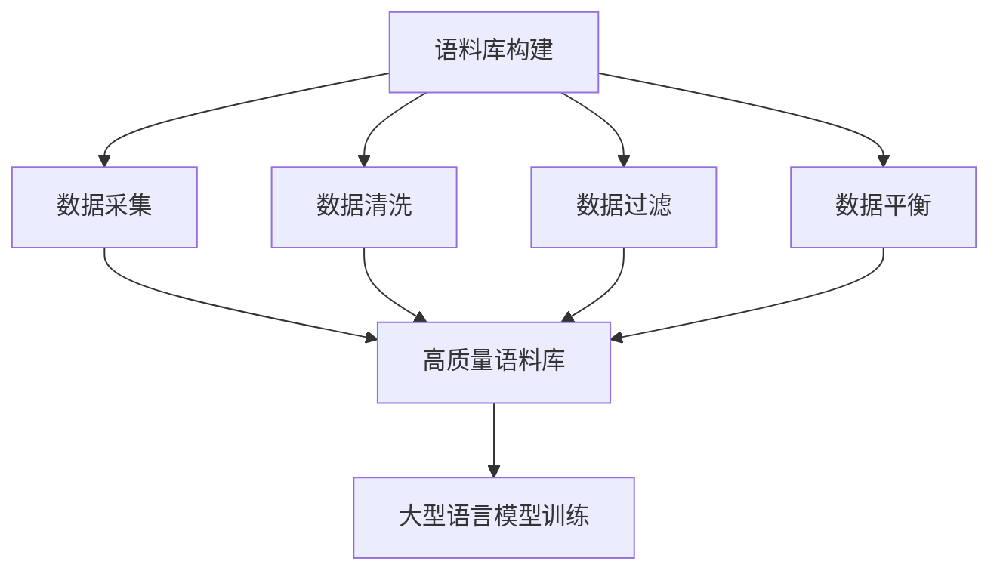

# 大语言模型原理与工程实践：手把手教你训练 7B 大语言模型 语料预处理

## 1. 背景介绍

### 1.1 问题的由来

随着人工智能技术的不断发展,大型语言模型 (Large Language Model, LLM) 已经成为自然语言处理领域的关键技术之一。作为一种基于深度学习的语言模型,LLM 能够从海量文本数据中学习语言知识,并用于各种自然语言处理任务,如机器翻译、问答系统、文本生成等。

然而,训练一个高质量的大型语言模型并非易事。它需要大量的计算资源、优质的训练数据以及合理的模型架构设计。其中,训练数据的质量直接影响了模型的性能表现。低质量的训练数据不仅会导致模型学习到噪声和错误知识,还可能引入不当的偏见,从而影响模型的泛化能力和公平性。

### 1.2 研究现状

目前,一些科技巨头如 Google、OpenAI 等公司已经训练出了一些大型语言模型,如 GPT-3、PaLM、LaMDA 等,并在特定领域取得了不错的效果。但这些模型大多基于网络爬取的公开数据进行训练,数据质量参差不齐,存在一定的噪声和偏差。

与此同时,一些研究机构和公司也在探索如何构建高质量的训练语料库,以提高大型语言模型的性能。例如,斯坦福大学的 Pile 数据集就是一个尝试,它从多个公开数据源中清理和整合了大量高质量文本数据。

### 1.3 研究意义

构建高质量的训练语料库对于提高大型语言模型的性能至关重要。通过对训练数据进行适当的预处理和优化,我们可以有效降低噪声、去除偏差,从而使模型学习到更加准确和中立的语言知识。

本文将详细介绍如何为 7B 参数规模的大型语言模型构建高质量的训练语料库。我们将探讨数据预处理的各个环节,包括数据采集、清洗、过滤、平衡等,并给出具体的实现方法和代码示例。希望本文能为读者提供实用的指导,帮助他们训练出更加优秀的大型语言模型。

### 1.4 本文结构

本文的结构安排如下:

1. 背景介绍
2. 核心概念与联系
3. 核心算法原理与具体操作步骤
4. 数学模型和公式详细讲解与举例说明
5. 项目实践:代码实例和详细解释说明
6. 实际应用场景
7. 工具和资源推荐
8. 总结:未来发展趋势与挑战
9. 附录:常见问题与解答

## 2. 核心概念与联系

在开始讨论语料库构建的具体细节之前,我们先来了解一些核心概念及它们之间的联系。

- **数据采集**: 从各种来源收集原始文本数据,如网页、书籍、论文等。
- **数据清洗**: 去除原始数据中的噪声,如 HTML 标签、垃圾信息等。
- **数据过滤**: 根据特定标准过滤掉质量较差的数据,如机器翻译文本、低质量网页等。
- **数据平衡**: 调整数据集的构成,使其在主题、语言风格等方面保持均衡。
- **高质量语料库**: 经过上述处理后得到的高质量文本数据集合。
- **大型语言模型训练**: 使用高质量语料库作为训练数据,训练大型语言模型。

通过对原始数据进行采集、清洗、过滤和平衡等一系列预处理操作,我们最终可以获得一个高质量的语料库。这个语料库将作为大型语言模型的训练数据,对模型的性能起到至关重要的作用。

## 3. 核心算法原理与具体操作步骤

### 3.1 算法原理概述

语料库构建过程中涉及的核心算法主要包括:

1. **数据清洗算法**: 用于去除原始数据中的噪声,如 HTML 标签、垃圾信息等。常用的算法有基于规则的方法和基于统计的方法。

2. **数据过滤算法**: 根据特定标准过滤掉质量较差的数据。这可以基于文本长度、语言类型、主题相关性等特征进行过滤。常用的算法有基于规则的过滤、基于机器学习的分类等。

3. **数据平衡算法**: 调整数据集的构成,使其在主题、语言风格等方面保持均衡。常用的算法有基于主题建模的方法、基于风格迁移的方法等。

4. **数据去重算法**: 去除数据集中的重复数据,提高数据的多样性。常用的算法有基于哈希的方法、基于相似度的方法等。

5. **数据增强算法**: 通过一些技术手段扩充数据集的规模,如数据噪声注入、回译、上采样等。

这些算法在语料库构建的不同环节发挥着重要作用,共同确保了最终语料库的高质量。

### 3.2 算法步骤详解

我们将语料库构建过程分为以下几个主要步骤:

#### 步骤1: 数据采集

首先,我们需要从各种来源采集原始文本数据,包括:

- 网页数据: 通过网络爬虫获取网页内容
- 书籍数据: 从电子书、扫描版书籍等获取书籍内容
- 论文数据: 从在线数据库、开放获取库等获取论文全文
- 新闻数据: 从新闻网站、RSS 源等获取新闻文章
- 社交媒体数据: 从社交媒体平台获取用户发布的内容

在这一步骤中,我们需要注意版权问题,尊重知识产权。

#### 步骤2: 数据清洗

获取原始数据后,我们需要对数据进行清洗,去除其中的噪声。常见的噪声包括:

- HTML 标签
- 脚本代码
- 垃圾信息(如广告、版权声明等)
- 非文本内容(如图片、视频等)
- 格式错误(如乱码、换行符等)

我们可以使用基于规则的方法和基于统计的方法来实现数据清洗。例如,使用正则表达式来去除 HTML 标签,使用语言模型来检测和过滤垃圾信息等。

#### 步骤3: 数据过滤

清洗后的数据可能仍然包含一些质量较差的部分,如机器翻译文本、低质量网页等。因此,我们需要进一步对数据进行过滤,确保最终语料库只包含高质量的文本数据。

常用的过滤标准包括:

- 文本长度: 过滤掉过短或过长的文本
- 语言类型: 过滤掉非目标语言的文本
- 主题相关性: 过滤掉与目标主题无关的文本
- 质量评分: 基于机器学习模型对文本质量进行评分,过滤低分文本

我们可以使用基于规则的过滤方法,也可以训练机器学习模型(如文本分类模型)来实现过滤。

#### 步骤4: 数据平衡

即使过滤后的数据集已经相对高质量,但它可能在主题分布、语言风格等方面存在失衡。例如,数据集中可能包含过多的新闻类文本,而缺乏小说类文本。这种失衡会导致训练出的语言模型在处理不同类型文本时表现不佳。

为了解决这个问题,我们需要对数据集进行平衡处理,使其在不同维度上保持均衡。常用的平衡方法包括:

- 基于主题建模: 对数据集进行主题建模,根据主题分布对数据进行重采样
- 基于风格迁移: 使用风格迁移技术,将数据集中缺失的风格文本"迁移"过来
- 数据增强: 对缺失类型的数据进行增强(如回译、噪声注入等)

通过平衡处理,我们可以获得一个在主题、风格等方面更加均衡的数据集,从而避免训练出偏向某些特定类型文本的语言模型。

#### 步骤5: 数据去重

在前面的步骤中,我们已经获得了一个相对高质量和均衡的数据集。但这个数据集中可能仍然存在重复的文本数据,这会导致模型在训练时过度关注重复数据,影响泛化能力。

因此,我们需要对数据集进行去重处理,去除重复文本。常用的去重算法包括:

- 基于哈希的去重: 计算每个文本的哈希值,去除哈希值相同的文本
- 基于相似度的去重: 计算文本之间的相似度,去除高度相似的文本

去重处理可以进一步提高语料库的质量和多样性,为训练出泛化能力更强的语言模型奠定基础。

#### 步骤6: 数据切分

最后,我们需要将处理好的语料库切分为训练集、验证集和测试集,用于语言模型的训练、评估和测试。

常用的切分方式是按照特定比例(如 80% 训练集、10% 验证集、10% 测试集)随机切分数据。我们也可以根据数据的来源、主题等维度进行分层抽样,以确保各个子集在这些维度上保持均衡。

### 3.3 算法优缺点

上述算法在语料库构建中发挥着重要作用,但也存在一些优缺点:

**优点**:

- 能够有效去除原始数据中的噪声和低质量部分
- 可以调整数据集的构成,使其在主题、风格等方面保持均衡
- 通过去重处理,可以提高语料库的多样性
- 算法流程清晰,可操作性强

**缺点**:

- 某些算法(如基于规则的清洗、过滤)可能过于简单,无法完全解决问题
- 需要大量的人工参与,如标注数据、设计规则等
- 部分算法(如风格迁移)的效果有待提高
- 整个流程相对复杂,需要投入较多的人力和计算资源

总的来说,这些算法为构建高质量语料库提供了有力支持,但仍有改进的空间。未来,我们可以探索更加智能化、自动化的语料库构建方法。

### 3.4 算法应用领域

语料库构建算法不仅可以应用于大型语言模型的训练数据准备,还可以用于其他自然语言处理任务的数据预处理,如:

- 机器翻译: 构建高质量的平行语料库
- 问答系统: 构建高质量的问答对语料库
- 文本分类: 构建高质量的分类语料库
- 情感分析: 构建高质量的情感标注语料库
- 等等

只要是基于文本数据的任务,都可以借助这些算法来优化和改善训练数据的质量,从而提高最终模型的性能表现。

## 4. 数学模型和公式详细讲解与举例说明

在语料库构建过程中,我们也会使用一些数学模型和公式,用于度量文本质量、计算文本相似度等。下面我们将详细介绍其中的几个核心模型和公式。

### 4.1 数学模型构建

#### 文本质量评估模型

为了过滤掉低质量的文本数据,我们需要一个模型来评估文本的质量分数。一种常见的做法是将文本质量评估建模为一个二分类问题,即将文本分为"高质量"和"低质量"两类。

我们可以使用逻辑回归(Logistic Regression)模型来解决这个问题。逻辑回归是一种广泛使用的机器学习模型,适用于二分类任务。

对于一个文本 $x$,我们可以提取一些特征 $\boldsymbol{x} = (x_1, x_2, \ldots, x_n)$,如文本长度、词汇丰富度