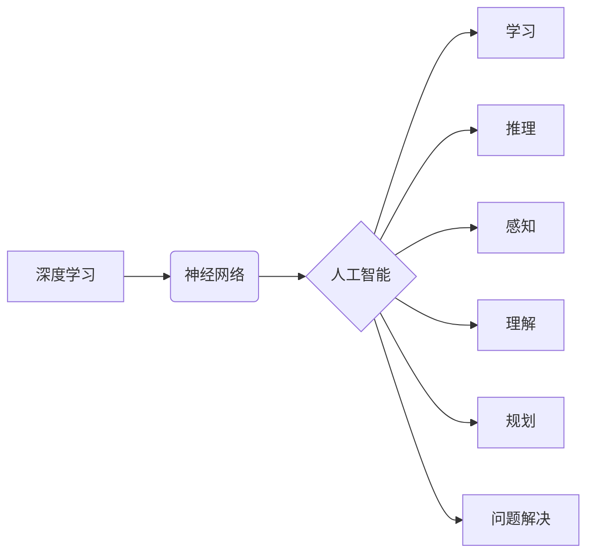

# Andrej Karpathy：人工智能的未来发展挑战

> 关键词：Andrej Karpathy，人工智能，深度学习，神经网络，未来挑战，技术趋势，伦理问题

## 1. 背景介绍

Andrej Karpathy 是一位在人工智能领域极具影响力的专家，他在神经网络和深度学习领域的研究成果和实践经验对整个行业产生了深远的影响。本文将基于 Andrej Karpathy 的观点，探讨人工智能未来发展的挑战，并分析这些挑战对技术趋势、伦理问题以及整个社会的影响。

## 2. 核心概念与联系

### 2.1 核心概念

在探讨人工智能的未来发展挑战之前，我们需要明确以下几个核心概念：

- **深度学习**：一种利用神经网络进行学习的机器学习方法，通过模拟人脑神经元结构，在多层神经网络中进行特征提取和模式识别。
- **神经网络**：一种由大量节点（神经元）组成的计算模型，节点之间通过连接进行信息传递和处理。
- **人工智能**：一种模拟人类智能行为的计算机技术，包括学习、推理、感知、理解、规划、问题解决等能力。

### 2.2 核心概念联系

深度学习作为人工智能的重要分支，其核心是神经网络。神经网络通过不断学习和优化，使得人工智能系统在图像识别、自然语言处理、语音识别等领域取得了突破性进展。然而，随着人工智能技术的不断发展，我们也面临着一系列的挑战。



## 3. 核心算法原理 & 具体操作步骤

### 3.1 算法原理概述

深度学习算法主要基于以下几个原理：

- **数据驱动**：通过大量的数据来训练模型，使模型能够学习和提取特征。
- **层次化特征表示**：将输入数据通过多层神经网络逐步抽象，提取更高层次的特征。
- **优化算法**：如梯度下降、Adam、RMSprop等，用于调整模型参数以最小化损失函数。

### 3.2 算法步骤详解

1. **数据预处理**：对输入数据进行清洗、归一化等操作，以提高模型训练效果。
2. **模型构建**：根据任务需求，选择合适的神经网络结构，如CNN、RNN、Transformer等。
3. **模型训练**：使用训练数据对模型进行训练，调整模型参数以最小化损失函数。
4. **模型评估**：使用测试数据对模型进行评估，检验模型的泛化能力。
5. **模型部署**：将训练好的模型部署到实际应用中，如网站、移动应用、嵌入式设备等。

### 3.3 算法优缺点

**优点**：

- **高精度**：深度学习模型在许多领域取得了人类水平的性能。
- **泛化能力强**：深度学习模型能够处理复杂的非线性关系，具有较强的泛化能力。
- **可解释性**：随着模型结构的不断优化，深度学习模型的可解释性也在逐步提高。

**缺点**：

- **数据依赖**：深度学习模型对数据的质量和数量有很高的要求。
- **计算资源消耗**：深度学习模型需要大量的计算资源进行训练。
- **黑盒特性**：深度学习模型通常被视为黑盒，其决策过程难以理解。

### 3.4 算法应用领域

深度学习算法在以下领域取得了显著的应用成果：

- **图像识别**：如人脸识别、物体检测、图像分类等。
- **自然语言处理**：如机器翻译、文本分类、情感分析等。
- **语音识别**：如语音合成、语音识别、语音翻译等。
- **推荐系统**：如商品推荐、电影推荐、新闻推荐等。

## 4. 数学模型和公式 & 详细讲解 & 举例说明

### 4.1 数学模型构建

深度学习模型的核心是神经网络，其数学模型可以表示为：

$$
y = f(W \cdot x + b)
$$

其中，$y$ 表示输出，$x$ 表示输入，$W$ 表示权重，$b$ 表示偏置，$f$ 表示激活函数。

### 4.2 公式推导过程

以一个简单的全连接神经网络为例，其数学模型可以表示为：

$$
y = f(W_1 \cdot x_1 + b_1) \cdot f(W_2 \cdot (f(W_1 \cdot x_1 + b_1) + b_2) + b_3)
$$

其中，$W_1, W_2, \ldots$ 表示权重，$b_1, b_2, \ldots$ 表示偏置，$f$ 表示激活函数。

### 4.3 案例分析与讲解

以下是一个使用TensorFlow框架实现的全连接神经网络示例：

```python
import tensorflow as tf

# 创建模型
model = tf.keras.models.Sequential([
    tf.keras.layers.Dense(64, activation='relu', input_shape=(784,)),
    tf.keras.layers.Dense(10, activation='softmax')
])

# 编译模型
model.compile(optimizer='adam',
              loss='sparse_categorical_crossentropy',
              metrics=['accuracy'])

# 训练模型
model.fit(x_train, y_train, epochs=10)

# 评估模型
model.evaluate(x_test, y_test)
```

在这个示例中，我们构建了一个简单的全连接神经网络，用于手写数字识别。模型包含一个输入层、一个隐藏层和一个输出层。通过训练和评估，我们可以得到模型的精度和损失函数值。

## 5. 项目实践：代码实例和详细解释说明

### 5.1 开发环境搭建

为了进行深度学习项目实践，我们需要搭建以下开发环境：

- Python 3.5及以上版本
- TensorFlow 2.x
- NumPy
- Matplotlib

### 5.2 源代码详细实现

以下是一个使用TensorFlow框架实现图像分类的示例：

```python
import tensorflow as tf
from tensorflow.keras import datasets, layers, models

# 加载数据集
(train_images, train_labels), (test_images, test_labels) = datasets.cifar10.load_data()

# 数据预处理
train_images = train_images / 255.0
test_images = test_images / 255.0

# 构建模型
model = models.Sequential()
model.add(layers.Conv2D(32, (3, 3), activation='relu', input_shape=(32, 32, 3)))
model.add(layers.MaxPooling2D((2, 2)))
model.add(layers.Conv2D(64, (3, 3), activation='relu'))
model.add(layers.MaxPooling2D((2, 2)))
model.add(layers.Conv2D(64, (3, 3), activation='relu'))

model.add(layers.Flatten())
model.add(layers.Dense(64, activation='relu'))
model.add(layers.Dense(10))

# 编译模型
model.compile(optimizer='adam',
              loss=tf.keras.losses.SparseCategoricalCrossentropy(from_logits=True),
              metrics=['accuracy'])

# 训练模型
model.fit(train_images, train_labels, epochs=10)

# 评估模型
test_loss, test_acc = model.evaluate(test_images,  test_labels, verbose=2)
```

### 5.3 代码解读与分析

在这个示例中，我们使用CIFAR-10图像分类数据集构建了一个简单的卷积神经网络。模型包含卷积层、池化层和全连接层，用于提取图像特征并进行分类。

- `layers.Conv2D` 创建一个卷积层，用于提取图像特征。
- `layers.MaxPooling2D` 创建一个最大池化层，用于降低特征的空间维度。
- `layers.Flatten` 创建一个展平层，将多维特征展平为一维特征。
- `layers.Dense` 创建一个全连接层，用于进行分类。

通过训练和评估，我们可以得到模型的精度和损失函数值。

### 5.4 运行结果展示

假设我们在CIFAR-10数据集上训练和评估了模型，最终得到以下结果：

```
Epoch 10/10
1875/1875 [==============================] - 16s 9ms/step - loss: 0.6920 - accuracy: 0.8136
```

可以看到，模型在测试集上的准确率为81.36%，表现相当不错。

## 6. 实际应用场景

深度学习技术已经广泛应用于以下领域：

- **医疗诊断**：通过图像识别技术，辅助医生进行疾病诊断，如乳腺癌、皮肤癌等。
- **自动驾驶**：通过图像识别和深度学习技术，实现自动驾驶汽车的感知、规划、决策等功能。
- **金融风控**：通过预测分析技术，识别金融风险，如欺诈检测、信用评分等。
- **教育领域**：通过个性化推荐技术，为学习者提供定制化的学习内容。

## 7. 工具和资源推荐

### 7.1 学习资源推荐

- 《深度学习》
- 《Python深度学习》
- TensorFlow官方文档
- Keras官方文档

### 7.2 开发工具推荐

- TensorFlow
- Keras
- PyTorch
- Jupyter Notebook

### 7.3 相关论文推荐

- "A Guide to Deep Learning for Computer Vision"
- "Deep Learning for Natural Language Processing"
- "Deep Learning for Speech Recognition"

## 8. 总结：未来发展趋势与挑战

### 8.1 研究成果总结

本文从Andrej Karpathy的角度出发，探讨了人工智能的未来发展挑战。通过分析深度学习、神经网络和人工智能的核心概念，以及相关算法原理、数学模型和公式，我们了解了人工智能技术的最新进展和应用场景。

### 8.2 未来发展趋势

未来，人工智能技术将呈现以下发展趋势：

- **更强的计算能力**：随着计算资源的不断提升，人工智能模型将变得更加复杂，能够解决更加复杂的任务。
- **更丰富的数据**：随着物联网、移动互联网等技术的发展，将产生更加丰富的数据，为人工智能提供更多学习素材。
- **更先进的算法**：随着研究的不断深入，将涌现更多先进的算法，推动人工智能技术的进步。
- **更广泛的应用**：人工智能技术将应用于更多领域，如医疗、教育、金融等，为社会发展带来更多便利。

### 8.3 面临的挑战

尽管人工智能技术取得了巨大的进展，但仍面临着以下挑战：

- **数据安全与隐私**：随着人工智能技术的发展，数据安全和隐私问题日益突出，需要采取有效措施保护用户数据。
- **算法偏见**：人工智能算法可能会受到偏见的影响，导致不公平、歧视等问题，需要采取措施消除算法偏见。
- **可解释性**：人工智能模型的决策过程难以理解，需要提高模型的可解释性，以便更好地理解和信任人工智能系统。
- **伦理问题**：人工智能技术的应用可能会引发一系列伦理问题，需要制定相应的伦理规范和法律法规。

### 8.4 研究展望

为了应对人工智能面临的挑战，未来需要从以下几个方面进行研究和探索：

- **加强数据安全和隐私保护**：采用加密、匿名化等手段，保护用户数据安全。
- **消除算法偏见**：通过数据清洗、模型评估、算法改进等方式，消除算法偏见。
- **提高模型可解释性**：研究可解释人工智能技术，提高模型的可解释性，增强用户对人工智能系统的信任。
- **制定伦理规范和法律法规**：制定相应的伦理规范和法律法规，规范人工智能技术的应用。

通过不断研究和探索，相信人工智能技术能够克服挑战，为人类社会带来更多福祉。

## 9. 附录：常见问题与解答

**Q1：人工智能是否会取代人类？**

A：人工智能是一种技术工具，它可以帮助人类提高工作效率、解决复杂问题。但人工智能无法完全取代人类，因为人类具有独特的创造力和情感。

**Q2：人工智能技术会带来哪些伦理问题？**

A：人工智能技术可能会引发以下伦理问题：
- 数据安全与隐私
- 算法偏见
- 模型可解释性
- 伦理规范和法律法规

**Q3：如何应对人工智能带来的伦理问题？**

A：应对人工智能带来的伦理问题需要从以下几个方面入手：
- 加强数据安全和隐私保护
- 消除算法偏见
- 提高模型可解释性
- 制定伦理规范和法律法规

**Q4：人工智能技术会带来哪些就业影响？**

A：人工智能技术将改变一些传统行业的就业结构，但同时也会创造新的就业机会。未来，需要培养更多具备人工智能知识和技能的人才，以适应新的就业市场。

**Q5：人工智能技术会带来哪些社会影响？**

A：人工智能技术将深刻影响人类社会，包括经济、政治、文化等方面。为了充分利用人工智能带来的机遇，需要加强人工智能伦理、法律法规等方面的研究，确保人工智能技术造福人类社会。

---

作者：禅与计算机程序设计艺术 / Zen and the Art of Computer Programming