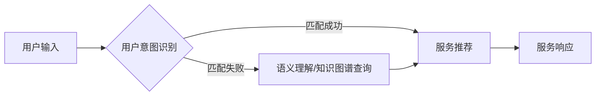

> 人工智能，自然语言理解，对话系统，用户意图识别，服务推荐，知识图谱

# CUI中的内容与服务匹配详细技术

在人工智能的浪潮中，对话式用户界面（CUI， Conversational User Interface）以其自然、便捷的交互方式，逐渐成为人机交互的新趋势。其中，内容与服务匹配是CUI的核心技术之一，它直接影响着用户体验和系统效率。本文将深入探讨CUI中的内容与服务匹配的详细技术，包括核心概念、算法原理、项目实践以及未来发展趋势。

## 1. 背景介绍

### 1.1 问题的由来

随着智能手机、智能音箱等设备的普及，用户对交互方式的期望越来越高。传统的图形用户界面（GUI）在复杂操作和低效沟通中逐渐显得力不从心。CUI作为一种更自然、更高效的交互方式，应运而生。然而，为了满足用户需求，CUI系统需要能够理解用户意图，并快速、准确地推荐或提供相应的服务。

### 1.2 研究现状

目前，CUI中的内容与服务匹配技术主要包括以下几种：

- **基于规则匹配**：通过预先定义的规则进行匹配，简单直接，但难以处理复杂、模糊的意图。
- **基于机器学习**：利用机器学习算法对用户意图进行建模，能够处理更复杂的任务，但需要大量标注数据和模型调优。
- **基于知识图谱**：利用知识图谱中的语义信息进行匹配，能够提供更丰富的语义理解和知识检索。

### 1.3 研究意义

研究CUI中的内容与服务匹配技术，对于提升用户体验、提高系统效率、拓展CUI应用领域具有重要意义。

- **提升用户体验**：准确匹配用户意图，快速提供服务，提升用户满意度。
- **提高系统效率**：减少人工干预，降低服务成本，提高服务效率。
- **拓展应用领域**：为更多场景提供CUI服务，如智能家居、智能客服、教育等。

### 1.4 本文结构

本文将按照以下结构展开：

- 第2章介绍CUI中的内容与服务匹配的核心概念和联系。
- 第3章阐述核心算法原理和具体操作步骤。
- 第4章讲解数学模型和公式，并举例说明。
- 第5章通过项目实践展示代码实例和详细解释。
- 第6章探讨实际应用场景和未来应用展望。
- 第7章推荐相关学习资源、开发工具和论文。
- 第8章总结研究成果，展望未来发展趋势和挑战。
- 第9章提供常见问题与解答。

## 2. 核心概念与联系

### 2.1 核心概念

- **用户意图识别**：理解用户输入的语言，识别用户想要完成的任务或达到的目标。
- **服务推荐**：根据用户意图，推荐或提供相应的服务。
- **知识图谱**：以图的形式组织知识，包含实体、关系和属性，为语义理解和知识检索提供支持。

### 2.2 核心概念原理和架构的 Mermaid 流程图



### 2.3 核心概念联系

用户意图识别是内容与服务匹配的核心，其结果直接影响服务推荐的准确性。当用户输入无法直接匹配到具体服务时，需要通过语义理解或知识图谱查询来丰富语义信息，提高匹配精度。

## 3. 核心算法原理 & 具体操作步骤

### 3.1 算法原理概述

CUI中的内容与服务匹配算法主要分为以下几个步骤：

1. **预处理**：对用户输入进行分词、词性标注、命名实体识别等处理。
2. **用户意图识别**：利用机器学习或深度学习算法，如LSTM、CNN、BERT等，对预处理后的用户输入进行意图分类。
3. **服务推荐**：根据识别出的用户意图，从服务库中选择最匹配的服务。
4. **服务响应**：将服务结果返回给用户。

### 3.2 算法步骤详解

#### 3.2.1 预处理

预处理是CUI中的内容与服务匹配的第一步，其目的是将原始用户输入转换为模型可处理的格式。常用的预处理方法包括：

- **分词**：将用户输入分割成单个词语。
- **词性标注**：标注每个词语的词性，如名词、动词、形容词等。
- **命名实体识别**：识别并提取用户输入中的实体，如人名、地名、组织名等。

#### 3.2.2 用户意图识别

用户意图识别是CUI中的内容与服务匹配的关键步骤，其目的是理解用户想要完成的任务或达到的目标。常用的用户意图识别方法包括：

- **基于规则的匹配**：根据预定义的规则进行匹配，简单直接，但难以处理复杂、模糊的意图。
- **基于机器学习**：利用机器学习算法对用户意图进行建模，如决策树、支持向量机、朴素贝叶斯等。
- **基于深度学习**：利用深度学习算法，如循环神经网络（RNN）、卷积神经网络（CNN）、Transformer等，对用户输入进行建模。

#### 3.2.3 服务推荐

服务推荐是根据用户意图从服务库中选择最匹配的服务。常用的服务推荐方法包括：

- **基于关键词匹配**：根据用户输入的关键词在服务库中进行匹配。
- **基于语义相似度**：利用词嵌入技术计算用户输入和服务的语义相似度，选择最相似的服务。
- **基于知识图谱**：利用知识图谱中的语义信息进行匹配，选择与用户意图最相关的服务。

#### 3.2.4 服务响应

服务响应是将服务结果返回给用户。常用的服务响应方式包括：

- **文本回复**：将服务结果以文本形式返回给用户。
- **语音回复**：将服务结果转换为语音，以语音形式返回给用户。
- **图形化界面**：将服务结果以图形化界面展示给用户。

### 3.3 算法优缺点

#### 3.3.1 基于规则的匹配

**优点**：

- 简单易行，易于理解和实现。
- 预处理工作量小，速度快。

**缺点**：

- 缺乏灵活性，难以处理复杂、模糊的意图。
- 维护成本高，需要不断更新规则。

#### 3.3.2 基于机器学习的匹配

**优点**：

- 能够处理复杂、模糊的意图。
- 能够适应新的用户输入。

**缺点**：

- 需要大量标注数据。
- 模型调优难度大。

#### 3.3.3 基于深度学习的匹配

**优点**：

- 模型效果好，能够处理复杂、模糊的意图。
- 能够自动学习语义信息。

**缺点**：

- 计算量大，训练时间长。
- 模型可解释性差。

### 3.4 算法应用领域

CUI中的内容与服务匹配算法在以下领域得到广泛应用：

- **智能客服**：自动识别用户意图，快速响应用户需求。
- **智能家居**：根据用户指令控制家电设备。
- **在线教育**：根据用户学习进度推荐合适的学习资源。
- **医疗健康**：根据用户症状推荐治疗方案。

## 4. 数学模型和公式 & 详细讲解 & 举例说明

### 4.1 数学模型构建

CUI中的内容与服务匹配的数学模型主要包括以下几个方面：

- **用户意图识别**：利用机器学习或深度学习算法，如LSTM、CNN、BERT等，对用户输入进行建模。
- **服务推荐**：利用词嵌入技术计算用户输入和服务的语义相似度。

### 4.2 公式推导过程

以下以基于词嵌入的用户意图识别为例，介绍公式推导过程。

#### 4.2.1 词嵌入

词嵌入将词汇映射到一个高维向量空间，每个词语都有一个唯一的向量表示。常用的词嵌入方法包括Word2Vec、GloVe、BERT等。

#### 4.2.2 用户意图识别

假设用户输入的词语序列为 $x_1, x_2, \ldots, x_n$，对应的词嵌入向量分别为 $v_1, v_2, \ldots, v_n$。用户意图识别的目标是学习一个映射函数 $f$，将用户输入的词嵌入向量映射到意图类别向量空间：

$$
f(v_1, v_2, \ldots, v_n) \rightarrow c
$$

其中 $c$ 为意图类别向量。

#### 4.2.3 损失函数

常用的损失函数包括交叉熵损失、均方误差损失等。

### 4.3 案例分析与讲解

以下以一个简单的对话系统为例，分析CUI中的内容与服务匹配的过程。

**案例**：用户说：“我想订一张从北京到上海的机票。”

**分析**：

1. **预处理**：将用户输入进行分词、词性标注、命名实体识别等处理，得到词语序列和实体列表。
2. **用户意图识别**：利用机器学习或深度学习算法识别出用户意图为“机票查询”。
3. **服务推荐**：根据用户意图从服务库中选择最匹配的服务，如“机票查询”服务。
4. **服务响应**：将服务结果以文本形式返回给用户，如“您想要经济舱还是公务舱？”。

## 5. 项目实践：代码实例和详细解释说明

### 5.1 开发环境搭建

1. 安装Python环境（Python 3.x）。
2. 安装必要的库，如TensorFlow、Keras、NLTK等。
3. 准备数据集，如对话数据、服务数据等。

### 5.2 源代码详细实现

以下是一个简单的对话系统代码示例：

```python
from tensorflow.keras.models import Sequential
from tensorflow.keras.layers import Embedding, LSTM, Dense, Dropout
from tensorflow.keras.optimizers import Adam

# 准备数据集
# ...

# 构建模型
model = Sequential()
model.add(Embedding(input_dim=vocab_size, output_dim=embedding_dim, input_length=max_length))
model.add(LSTM(units=64, return_sequences=True))
model.add(Dropout(0.5))
model.add(LSTM(units=64))
model.add(Dropout(0.5))
model.add(Dense(units=num_classes, activation='softmax'))

# 编译模型
model.compile(optimizer=Adam(), loss='categorical_crossentropy', metrics=['accuracy'])

# 训练模型
# ...

# 评估模型
# ...
```

### 5.3 代码解读与分析

以上代码使用TensorFlow和Keras构建了一个简单的对话系统模型。模型使用嵌入层将词汇映射到词嵌入向量空间，然后通过两个LSTM层进行序列建模，最后通过全连接层进行意图分类。

### 5.4 运行结果展示

在训练集上进行训练，并在测试集上进行评估，输出模型的准确率等指标。

## 6. 实际应用场景

### 6.1 智能客服

智能客服是CUI中内容与服务匹配技术的重要应用场景。通过识别用户意图，智能客服能够快速响应用户需求，提供高效的客户服务。

### 6.2 智能家居

智能家居系统可以根据用户指令控制家电设备，如开关灯、调节温度、播放音乐等。

### 6.3 在线教育

在线教育平台可以根据用户学习进度推荐合适的学习资源，提高学习效率。

### 6.4 医疗健康

医疗健康应用可以根据用户症状推荐治疗方案，为用户提供便捷的健康服务。

## 7. 工具和资源推荐

### 7.1 学习资源推荐

- 《深度学习》
- 《Python深度学习》
- 《自然语言处理入门》
- Hugging Face官网

### 7.2 开发工具推荐

- TensorFlow
- Keras
- NLTK
- spaCy

### 7.3 相关论文推荐

- [Deep Learning for Natural Language Understanding](https://arxiv.org/abs/1606.05328)
- [BERT: Pre-training of Deep Bidirectional Transformers for Language Understanding](https://arxiv.org/abs/1810.04805)
- [Transformers: State-of-the-Art General Language Modeling](https://arxiv.org/abs/1910.03771)

## 8. 总结：未来发展趋势与挑战

### 8.1 研究成果总结

本文深入探讨了CUI中的内容与服务匹配技术，包括核心概念、算法原理、项目实践以及未来发展趋势。通过分析不同算法的优缺点和适用场景，为CUI系统的开发提供了参考。

### 8.2 未来发展趋势

未来，CUI中的内容与服务匹配技术将朝着以下方向发展：

- **多模态融合**：融合文本、语音、图像等多模态信息，提高语义理解能力。
- **个性化推荐**：根据用户历史行为和偏好，提供个性化的服务推荐。
- **知识图谱应用**：利用知识图谱中的语义信息，提供更丰富的知识检索和推理能力。

### 8.3 面临的挑战

CUI中的内容与服务匹配技术仍然面临以下挑战：

- **数据标注成本高**：需要大量标注数据来训练模型。
- **模型可解释性差**：难以解释模型的决策过程。
- **多语言支持**：需要支持多种语言，以满足不同用户的需求。

### 8.4 研究展望

随着人工智能技术的不断发展，CUI中的内容与服务匹配技术将不断完善，为用户提供更加自然、便捷的交互体验。

## 9. 附录：常见问题与解答

**Q1：CUI中的内容与服务匹配技术有哪些应用场景？**

A：CUI中的内容与服务匹配技术可以应用于智能客服、智能家居、在线教育、医疗健康、金融理财等多个领域。

**Q2：如何提高CUI系统的用户体验？**

A：提高CUI系统的用户体验可以从以下几个方面入手：
- 提高用户意图识别的准确率。
- 提供个性化的服务推荐。
- 设计简洁、易用的用户界面。
- 及时响应用户需求。

**Q3：CUI中的内容与服务匹配技术与知识图谱有什么关系？**

A：知识图谱为CUI中的内容与服务匹配提供了语义信息和知识支持，能够提高语义理解能力和知识检索能力。

**Q4：如何降低CUI系统的开发成本？**

A：降低CUI系统的开发成本可以从以下几个方面入手：
- 使用开源框架和工具。
- 选用合适的算法和模型。
- 优化模型结构和参数。

**Q5：CUI中的内容与服务匹配技术有哪些局限性？**

A：CUI中的内容与服务匹配技术目前主要面临以下局限性：
- 需要大量标注数据。
- 模型可解释性差。
- 多语言支持有限。

作者：禅与计算机程序设计艺术 / Zen and the Art of Computer Programming