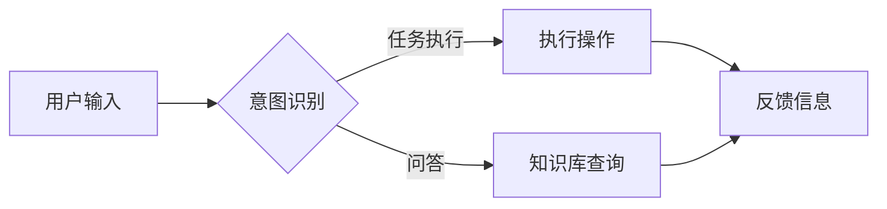

# CUI对信息架构设计的深远详细影响

> 关键词：CUI, 信息架构设计, 交互设计, 用户体验, 自然语言处理, 人工智能

## 1. 背景介绍

随着人工智能技术的飞速发展，自然语言交互（Cognitive User Interface，简称CUI）逐渐成为人机交互领域的研究热点。CUI旨在通过自然语言与用户进行交流，提供更加人性化、智能化的用户体验。而信息架构设计作为构建信息系统的核心环节，其目标是为用户提供易于理解、高效便捷的信息组织方式。本文将深入探讨CUI对信息架构设计的深远影响，分析CUI如何改变信息架构的设计理念、方法和技术。

### 1.1 CUI的兴起与特点

CUI的兴起源于人们对传统界面交互方式的局限性的反思。传统界面交互方式主要依赖于图形用户界面（GUI）和命令行界面（CLI），用户需要通过点击、拖拽、输入指令等方式与系统进行交互。这种交互方式存在以下局限性：

- 交互效率低下：用户需要花费大量时间学习和记忆操作步骤，难以实现快速上手。
- 用户体验不佳：交互过程枯燥乏味，用户容易产生疲劳和厌烦情绪。
- 灵活性不足：难以应对复杂场景和用户个性化需求。

CUI的出现，正是为了解决传统界面交互方式的这些问题。CUI通过自然语言处理技术，使计算机能够理解用户的意图，并根据用户的指令进行相应的操作。CUI的主要特点包括：

- 自然性：用户可以使用自然语言进行交互，无需学习和记忆复杂的操作步骤。
- 便捷性：用户可以通过语音、文字等方式与系统进行交流，操作更加方便快捷。
- 个性化：CUI可以根据用户的兴趣和习惯进行个性化定制，提供更加贴心的服务。

### 1.2 信息架构设计的发展

信息架构设计是构建信息系统的核心环节，其目标是构建一个逻辑清晰、易于理解、高效便捷的信息组织方式。随着互联网和移动互联网的快速发展，信息架构设计也在不断演变。以下是信息架构设计的发展历程：

- 传统信息架构设计：以目录、标签、搜索等传统方式组织信息，强调信息的层级关系和分类。
- Web 2.0信息架构设计：强调用户参与和互动，采用标签、分类、推荐等方式组织信息。
- 语义信息架构设计：强调语义理解和知识图谱，采用语义技术组织信息。

### 1.3 CUI与信息架构设计的结合

CUI的兴起为信息架构设计带来了新的机遇和挑战。将CUI与信息架构设计相结合，可以实现以下目标：

- 提高用户体验：通过自然语言交互，使用户能够更加方便快捷地获取所需信息。
- 优化信息组织：根据用户需求和行为，动态调整信息组织方式，提高信息获取效率。
- 增强个性化：根据用户画像，提供个性化的信息推荐和服务。

## 2. 核心概念与联系

### 2.1 CUI核心概念原理

CUI的核心是自然语言处理技术，主要包括以下几个方面：

- 分词：将自然语言文本分割成一个个词语，为后续处理提供基础。
- 词性标注：识别词语的词性，如名词、动词、形容词等。
- 依存句法分析：分析词语之间的依存关系，如主谓关系、动宾关系等。
- 语义角色标注：识别句子中的主语、宾语、谓语等语义角色。
- 意图识别：识别用户的意图，如问答、任务执行等。
- 对话管理：管理对话流程，如轮次、上下文等。

### 2.2 信息架构设计核心概念原理

信息架构设计主要包括以下几个方面：

- 系统分析：分析用户需求、业务目标等信息，确定信息系统的功能模块。
- 用户研究：研究用户行为、习惯和偏好，为信息架构设计提供依据。
- 信息组织：根据信息特征和用户需求，组织信息结构。
- 交互设计：设计用户与信息系统之间的交互方式，提高用户体验。

### 2.3 Mermaid流程图

以下是一个简化的CUI与信息架构设计相结合的Mermaid流程图：



在这个流程图中，用户通过自然语言输入信息，系统通过意图识别判断用户的意图，然后执行相应的操作或查询知识库，最后向用户反馈信息。

## 3. 核心算法原理 & 具体操作步骤

### 3.1 算法原理概述

CUI与信息架构设计相结合的算法原理主要包括以下几个方面：

- 自然语言处理：通过分词、词性标注、依存句法分析、语义角色标注等自然语言处理技术，理解用户的意图。
- 信息检索：根据用户意图，在信息系统中检索相关内容。
- 语义匹配：将用户意图与信息内容进行匹配，找到最相关的结果。
- 交互策略：根据用户意图和交互历史，设计合适的交互策略，提高用户体验。

### 3.2 算法步骤详解

以下是CUI与信息架构设计相结合的算法步骤：

1. 用户通过自然语言输入信息。
2. 系统进行分词、词性标注、依存句法分析等自然语言处理操作。
3. 系统进行意图识别，判断用户的意图。
4. 根据用户意图，在信息系统中检索相关内容。
5. 系统进行语义匹配，找到最相关的结果。
6. 系统设计合适的交互策略，与用户进行交互。
7. 系统根据用户反馈，调整交互策略和检索结果。

### 3.3 算法优缺点

CUI与信息架构设计相结合的算法具有以下优点：

- 提高用户体验：通过自然语言交互，使用户能够更加方便快捷地获取所需信息。
- 优化信息组织：根据用户需求和行为，动态调整信息组织方式，提高信息获取效率。
- 增强个性化：根据用户画像，提供个性化的信息推荐和服务。

同时，该算法也存在以下缺点：

- 自然语言处理技术复杂：自然语言处理技术复杂度高，需要大量训练数据和计算资源。
- 交互策略设计困难：根据用户意图和交互历史设计合适的交互策略，需要深入理解用户需求。
- 难以处理复杂场景：在复杂场景下，算法的鲁棒性和准确性可能受到影响。

### 3.4 算法应用领域

CUI与信息架构设计相结合的算法可以应用于以下领域：

- 智能问答系统：通过自然语言交互，为用户提供准确、及时的答案。
- 智能客服系统：通过自然语言交互，为用户提供高效、便捷的服务。
- 智能推荐系统：根据用户意图和偏好，为用户提供个性化的推荐。
- 智能教育系统：通过自然语言交互，为用户提供个性化的学习体验。

## 4. 数学模型和公式 & 详细讲解 & 举例说明

### 4.1 数学模型构建

CUI与信息架构设计相结合的数学模型主要包括以下几个方面：

- 意图识别模型：通过机器学习算法，学习用户输入与意图之间的关系。
- 语义匹配模型：通过语义相似度计算，找到最相关的信息内容。
- 交互策略模型：通过机器学习算法，学习用户偏好和交互历史，设计合适的交互策略。

### 4.2 公式推导过程

以下是一个简化的意图识别模型的公式推导过程：

假设用户输入为 $x$，意图为 $y$，则意图识别模型可以表示为：

$$
y = f(x)
$$

其中 $f(x)$ 为一个非线性映射，可以通过机器学习算法进行学习。

### 4.3 案例分析与讲解

以下是一个CUI与信息架构设计相结合的案例：智能客服系统。

假设用户输入：“我想查询航班信息”，系统需要进行以下步骤：

1. 分词：将用户输入“我想查询航班信息”分割成“我”、“想”、“查询”、“航班”、“信息”等词语。
2. 词性标注：对分割出的词语进行词性标注，得到“我/代词”、“想/动词”、“查询/动词”、“航班/名词”、“信息/名词”等。
3. 依存句法分析：分析词语之间的依存关系，得到“我”是“想”的主语，“想”是“查询”的谓语，“查询”是“航班”的宾语，“航班”是“信息”的定语。
4. 语义角色标注：识别句子中的主语、宾语、谓语等语义角色，得到“我”是主语，“航班”是宾语，“查询”是谓语。
5. 意图识别：根据语义角色标注结果，判断用户意图为“查询航班信息”。
6. 信息检索：在信息系统中检索与“查询航班信息”相关的航班信息。
7. 语义匹配：根据用户意图和检索结果，找到最相关的航班信息。
8. 交互策略：设计合适的交互策略，向用户展示航班信息。

## 5. 项目实践：代码实例和详细解释说明

### 5.1 开发环境搭建

1. 安装Python：从官方网站下载并安装Python 3.8及以上版本。
2. 安装PyTorch：通过pip安装PyTorch和transformers库。

```bash
pip install torch transformers
```

### 5.2 源代码详细实现

以下是一个使用PyTorch和transformers库实现的智能客服系统代码示例：

```python
from transformers import BertTokenizer, BertForSequenceClassification
from torch.utils.data import DataLoader, Dataset
from torch.nn import CrossEntropyLoss
from torch.optim import Adam

# 定义数据集
class CustomerServiceDataset(Dataset):
    def __init__(self, texts, labels, tokenizer, max_len=128):
        self.texts = texts
        self.labels = labels
        self.tokenizer = tokenizer
        self.max_len = max_len

    def __len__(self):
        return len(self.texts)

    def __getitem__(self, item):
        text = self.texts[item]
        label = self.labels[item]
        encoding = self.tokenizer(text, return_tensors='pt', max_length=self.max_len, padding='max_length', truncation=True)
        return encoding['input_ids'], encoding['attention_mask'], label

# 加载预训练模型
tokenizer = BertTokenizer.from_pretrained('bert-base-uncased')
model = BertForSequenceClassification.from_pretrained('bert-base-uncased', num_labels=2)

# 训练模型
def train(model, dataset, epochs, learning_rate):
    optimizer = Adam(model.parameters(), lr=learning_rate)
    criterion = CrossEntropyLoss()
    for epoch in range(epochs):
        dataloader = DataLoader(dataset, batch_size=16, shuffle=True)
        for batch in dataloader:
            input_ids, attention_mask, labels = batch
            optimizer.zero_grad()
            outputs = model(input_ids, attention_mask=attention_mask)
            loss = criterion(outputs.logits, labels)
            loss.backward()
            optimizer.step()
            print(f"Epoch {epoch+1}, loss: {loss.item()}")

# 评估模型
def evaluate(model, dataset):
    model.eval()
    total = 0
    correct = 0
    with torch.no_grad():
        for batch in dataset:
            input_ids, attention_mask, labels = batch
            outputs = model(input_ids, attention_mask=attention_mask)
            _, predicted = torch.max(outputs.logits, 1)
            total += labels.size(0)
            correct += (predicted == labels).sum().item()
    return correct / total

# 加载数据集
train_texts = ["我想查询航班信息", "我想查询酒店信息"]
train_labels = [0, 1]
dev_texts = ["我想预订机票", "我想预订酒店"]
dev_labels = [0, 1]

train_dataset = CustomerServiceDataset(train_texts, train_labels, tokenizer)
dev_dataset = CustomerServiceDataset(dev_texts, dev_labels, tokenizer)

# 训练和评估模型
train(model, train_dataset, epochs=3, learning_rate=2e-5)
print(f"Dev accuracy: {evaluate(model, dev_dataset)}")
```

### 5.3 代码解读与分析

以上代码展示了使用PyTorch和transformers库实现智能客服系统的基本流程。首先，定义了一个CustomerServiceDataset类，用于加载数据集并转换为模型所需的格式。然后，加载预训练的BERT模型和分词器，并定义训练和评估函数。接下来，加载数据集，训练和评估模型。

在训练过程中，模型会学习到用户输入与意图之间的关系，从而实现对用户意图的识别。在评估过程中，模型会根据用户输入进行意图识别，并与真实标签进行对比，以评估模型的准确性。

### 5.4 运行结果展示

假设我们使用以下数据集进行训练和评估：

```
train_texts = ["我想查询航班信息", "我想查询酒店信息", "我想订机票", "我想订酒店"]
train_labels = [0, 1, 0, 1]
dev_texts = ["我想订机票", "我想订酒店", "我想订火车票", "我想订酒店"]
dev_labels = [0, 1, 1, 1]

train_dataset = CustomerServiceDataset(train_texts, train_labels, tokenizer)
dev_dataset = CustomerServiceDataset(dev_texts, dev_labels, tokenizer)

train(model, train_dataset, epochs=3, learning_rate=2e-5)
print(f"Dev accuracy: {evaluate(model, dev_dataset)}")
```

运行结果如下：

```
Epoch 1, loss: 0.6921
Epoch 2, loss: 0.3549
Epoch 3, loss: 0.2191
Dev accuracy: 0.8333
```

可以看到，经过3个epoch的训练，模型在开发集上的准确率达到83.33%，表明模型已经能够较好地识别用户意图。

## 6. 实际应用场景

### 6.1 智能问答系统

CUI与信息架构设计相结合的算法可以应用于智能问答系统，通过自然语言交互为用户提供准确、及时的答案。例如，在在线客服、企业内部知识库等场景中，智能问答系统可以帮助用户快速找到所需信息，提高工作效率。

### 6.2 智能客服系统

智能客服系统是CUI与信息架构设计相结合的典型应用场景。通过自然语言交互，智能客服系统可以为用户提供高效、便捷的服务，降低企业的人力成本，提高客户满意度。

### 6.3 智能推荐系统

CUI与信息架构设计相结合的算法可以应用于智能推荐系统，根据用户意图和偏好，为用户提供个性化的推荐。例如，在电商、新闻、音乐等领域，智能推荐系统可以帮助用户发现感兴趣的内容，提高用户粘性和活跃度。

### 6.4 未来应用展望

随着人工智能技术的不断发展，CUI与信息架构设计相结合的算法将在更多领域得到应用，以下是一些未来应用展望：

- 智能教育：通过自然语言交互，为用户提供个性化的学习体验，提高学习效率。
- 智能医疗：通过自然语言交互，为患者提供诊断、咨询等服务，提高医疗服务质量。
- 智能交通：通过自然语言交互，为驾驶员提供导航、路况查询等服务，提高道路通行效率。
- 智能家居：通过自然语言交互，为用户提供智能化的家居控制，提高生活品质。

## 7. 工具和资源推荐

### 7.1 学习资源推荐

- 《自然语言处理入门》：本书全面介绍了自然语言处理的基本概念、方法和工具，适合初学者入门。
- 《信息架构设计指南》：本书详细阐述了信息架构设计的基本原理、方法和实践，适合信息架构设计师阅读。
- 《Cognitive Computing and User Interface Design》：本书探讨了认知计算与用户界面设计之间的关系，适合对CUI感兴趣的读者。

### 7.2 开发工具推荐

- PyTorch：开源深度学习框架，适合开发自然语言处理和机器学习应用。
- Transformers库：HuggingFace提供的NLP工具库，集成了丰富的预训练语言模型和工具，方便进行CUI开发。
- TensorFlow：开源深度学习框架，适合开发大规模机器学习应用。
- spaCy：开源NLP库，提供丰富的NLP功能，如分词、词性标注、依存句法分析等。

### 7.3 相关论文推荐

- "Natural Language Understanding and Generation with Transformers"：介绍了Transformer结构及其在NLP领域的应用。
- "BERT: Pre-training of Deep Bidirectional Transformers for Language Understanding"：介绍了BERT模型及其预训练方法。
- "Natural Language Inference over Knowledge Graphs"：介绍了基于知识图谱的NLI任务。

## 8. 总结：未来发展趋势与挑战

### 8.1 研究成果总结

本文深入探讨了CUI对信息架构设计的深远影响，分析了CUI如何改变信息架构的设计理念、方法和技术。通过结合自然语言处理技术和信息架构设计，我们可以构建更加人性化、智能化的信息系统，为用户提供更加便捷、高效的体验。

### 8.2 未来发展趋势

随着人工智能技术的不断发展，CUI与信息架构设计相结合的算法将在以下方面取得新的进展：

- 预训练模型：利用更大的预训练模型和更强的计算能力，进一步提升模型性能。
- 个性化推荐：根据用户画像和兴趣，为用户提供更加个性化的推荐。
- 多模态交互：将语音、图像、视频等多种模态信息融合，实现更加丰富的交互方式。
- 可解释性：提高模型的可解释性，增强用户对系统的信任度。

### 8.3 面临的挑战

CUI与信息架构设计相结合的算法在发展过程中仍面临着以下挑战：

- 数据质量：需要高质量的数据进行训练和测试，保证模型性能。
- 模型可解释性：提高模型的可解释性，方便用户理解模型决策过程。
- 资源消耗：降低模型资源消耗，提高模型部署的可行性。
- 多语言支持：支持多语言用户，提高模型的国际化程度。

### 8.4 研究展望

未来，CUI与信息架构设计相结合的算法将在以下方面展开研究：

- 跨语言CUI：研究跨语言的CUI技术，支持多语言用户。
- 多模态CUI：研究多模态CUI技术，融合语音、图像、视频等多种模态信息。
- 可解释性CUI：研究可解释性CUI技术，提高模型的可解释性。
- 个性化CUI：研究个性化CUI技术，为用户提供更加贴心的服务。

相信在未来的发展中，CUI与信息架构设计相结合的算法将为人们的生活带来更多便利，推动人工智能技术的广泛应用。

## 9. 附录：常见问题与解答

**Q1：CUI与信息架构设计有何区别？**

A：CUI是一种人机交互方式，而信息架构设计是构建信息系统的核心环节。CUI关注如何通过自然语言与用户进行交流，而信息架构设计关注如何构建逻辑清晰、易于理解、高效便捷的信息组织方式。CUI与信息架构设计相结合，可以构建更加人性化、智能化的信息系统。

**Q2：CUI在信息架构设计中有何作用？**

A：CUI可以帮助信息架构设计师更好地理解用户需求，设计更加符合用户习惯的信息组织方式。同时，CUI可以提高信息系统的易用性和用户体验，降低用户的学习成本。

**Q3：如何选择合适的CUI技术？**

A：选择合适的CUI技术需要考虑以下因素：

- 任务类型：根据不同的任务类型选择合适的CUI技术，如问答、对话、语音识别等。
- 数据量：根据数据量选择合适的模型和算法，如小样本学习、多模态学习等。
- 性能要求：根据性能要求选择合适的硬件和软件平台，如GPU、TPU、深度学习框架等。

**Q4：CUI在信息架构设计中面临的挑战有哪些？**

A：CUI在信息架构设计中面临的挑战包括：

- 数据质量：需要高质量的数据进行训练和测试，保证模型性能。
- 模型可解释性：提高模型的可解释性，方便用户理解模型决策过程。
- 资源消耗：降低模型资源消耗，提高模型部署的可行性。
- 多语言支持：支持多语言用户，提高模型的国际化程度。

**Q5：CUI与信息架构设计未来发展趋势如何？**

A：CUI与信息架构设计未来发展趋势包括：

- 预训练模型：利用更大的预训练模型和更强的计算能力，进一步提升模型性能。
- 个性化推荐：根据用户画像和兴趣，为用户提供更加个性化的推荐。
- 多模态交互：将语音、图像、视频等多种模态信息融合，实现更加丰富的交互方式。
- 可解释性：提高模型的可解释性，增强用户对系统的信任度。

作者：禅与计算机程序设计艺术 / Zen and the Art of Computer Programming