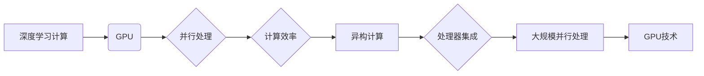

# GPU技术在AI中的应用

> 关键词：GPU, AI, 人工智能, 深度学习, 图形处理单元, 异构计算, 计算效率, 大规模并行处理

## 1. 背景介绍

随着深度学习技术的飞速发展，人工智能（AI）在各个领域得到了广泛应用。深度学习作为一种强大的机器学习技术，依赖于大量复杂的数学运算和模型训练。传统的CPU在处理这些密集型计算任务时，往往难以满足效率要求。为此，GPU（Graphics Processing Unit，图形处理单元）技术应运而生，为AI的快速发展提供了强大的计算支持。

### 1.1 问题的由来

传统的CPU在执行单线程计算任务时效率较高，但在并行计算方面存在局限性。随着深度学习模型规模的不断扩大，单线程计算难以满足训练和推理的需求，导致模型训练周期过长，推理速度缓慢。为了解决这个问题，研究人员开始探索使用GPU等专用硬件加速深度学习计算。

### 1.2 研究现状

近年来，GPU技术在AI领域的应用取得了显著成果。以NVIDIA、AMD等为代表的GPU厂商不断推出高性能GPU产品，为深度学习计算提供了强大的硬件支持。同时，深度学习框架如TensorFlow、PyTorch等也针对GPU优化，使得GPU在AI领域的应用更加广泛。

### 1.3 研究意义

GPU技术在AI领域的应用具有以下重要意义：

- 提高计算效率：GPU具备强大的并行计算能力，可以显著提升深度学习模型的训练和推理速度，降低计算成本。
- 加速AI研究：GPU为AI研究人员提供了强大的计算资源，促进了新算法、新模型的研发和应用。
- 推动产业升级：GPU技术在AI领域的应用推动了各行业的智能化进程，为经济发展注入新动力。

### 1.4 本文结构

本文将围绕GPU技术在AI中的应用展开，主要包括以下内容：

- 介绍GPU技术的基本原理和架构。
- 分析GPU在深度学习计算中的应用。
- 深入探讨GPU加速算法和优化策略。
- 展示GPU技术在AI领域的实际应用案例。
- 探讨GPU技术的未来发展趋势与挑战。

## 2. 核心概念与联系

### 2.1 核心概念

#### 2.1.1 GPU

GPU，即图形处理单元，是一种专门用于图形渲染的处理器。与传统CPU相比，GPU具备更高的并行处理能力，能够同时处理多个任务。

#### 2.1.2 异构计算

异构计算是指将不同类型的处理器（如CPU、GPU、FPGA等）集成在一起，协同完成计算任务。在AI领域，异构计算可以充分发挥不同处理器的优势，提高计算效率。

#### 2.1.3 大规模并行处理

大规模并行处理是指将计算任务分解成多个子任务，由多个处理器并行执行。在GPU上，大规模并行处理是提高计算效率的关键技术。

### 2.2 核心概念联系

GPU技术的核心在于其并行处理能力，可以将深度学习计算任务分解成多个子任务，在GPU上并行执行，从而提高计算效率。异构计算技术可以将CPU、GPU等不同处理器集成在一起，实现更高效的计算。大规模并行处理是GPU技术实现高效计算的基础。

以下是核心概念原理和架构的Mermaid流程图：



## 3. 核心算法原理 & 具体操作步骤

### 3.1 算法原理概述

GPU技术在AI中的应用主要基于以下原理：

- 将深度学习计算任务分解成多个子任务。
- 利用GPU的并行处理能力，并行执行这些子任务。
- 将计算结果汇总，得到最终的计算结果。

### 3.2 算法步骤详解

#### 3.2.1 计算任务分解

将深度学习计算任务分解成多个子任务，例如矩阵乘法、卷积运算等。

#### 3.2.2 子任务分配

根据GPU的并行处理能力，将子任务分配给不同的GPU核心。

#### 3.2.3 并行执行

GPU核心并行执行分配到的子任务。

#### 3.2.4 结果汇总

将所有GPU核心的计算结果汇总，得到最终的计算结果。

### 3.3 算法优缺点

#### 3.3.1 优点

- 提高计算效率：GPU具备强大的并行处理能力，可以显著提升深度学习模型的训练和推理速度。
- 降低计算成本：通过并行计算，可以减少计算资源的需求，降低计算成本。
- 提高模型性能：GPU加速可以提升模型的训练精度和推理速度。

#### 3.3.2 缺点

- 硬件成本高：高性能GPU的价格较高，需要一定的硬件投入。
- 程序开发复杂：GPU编程需要一定的技术门槛，开发成本较高。
- 系统兼容性：不同型号的GPU可能存在兼容性问题，需要针对不同硬件进行适配。

### 3.4 算法应用领域

GPU技术在以下AI领域得到了广泛应用：

- 深度学习模型训练：包括神经网络、卷积神经网络、循环神经网络等。
- 图像识别：包括目标检测、图像分割、人脸识别等。
- 语音识别：包括语音识别、语音合成、语音转文本等。
- 自然语言处理：包括文本分类、机器翻译、情感分析等。
- 医学影像分析：包括疾病诊断、基因分析、药物发现等。

## 4. 数学模型和公式 & 详细讲解 & 举例说明

### 4.1 数学模型构建

深度学习模型通常基于以下数学模型：

- 神经网络：由多个神经元组成，通过前向传播和反向传播进行计算。
- 卷积神经网络（CNN）：用于图像识别和处理。
- 循环神经网络（RNN）：用于序列数据处理，如自然语言处理。

### 4.2 公式推导过程

以下以卷积神经网络为例，介绍公式推导过程。

#### 4.2.1 卷积运算

卷积神经网络的核心操作是卷积运算，其公式如下：

$$
\text{output} = \sum_{k=1}^K w_k \cdot \text{input}
$$

其中，$w_k$ 为卷积核，$\text{input}$ 为输入数据。

#### 4.2.2 池化操作

卷积神经网络中还包含池化操作，其公式如下：

$$
\text{output} = \max_{j \in \{1, 2, ..., H\}} f(x_j)
$$

其中，$H$ 为池化窗口的大小，$f(x_j)$ 为窗口内的最大值。

### 4.3 案例分析与讲解

以下以使用GPU加速神经网络训练为例，介绍GPU技术的应用。

#### 4.3.1 开发环境搭建

1. 安装CUDA Toolkit：CUDA Toolkit是NVIDIA开发的GPU加速开发工具包，需要根据GPU型号下载相应版本的CUDA Toolkit。
2. 安装深度学习框架：选择合适的深度学习框架，如TensorFlow、PyTorch等，并按照官方文档进行安装。
3. 编写GPU加速代码：使用深度学习框架提供的GPU加速功能，将计算任务迁移到GPU执行。

#### 4.3.2 源代码详细实现

```python
import torch
import torch.nn as nn

# 定义卷积神经网络模型
class CNN(nn.Module):
    def __init__(self):
        super(CNN, self).__init__()
        self.conv1 = nn.Conv2d(1, 20, 5)
        self.conv2 = nn.Conv2d(20, 50, 5)
        self.fc1 = nn.Linear(4*4*50, 500)
        self.fc2 = nn.Linear(500, 10)

    def forward(self, x):
        x = torch.relu(self.conv1(x))
        x = nn.MaxPool2d(2, 2)(x)
        x = torch.relu(self.conv2(x))
        x = nn.MaxPool2d(2, 2)(x)
        x = x.view(-1, 4*4*50)
        x = torch.relu(self.fc1(x))
        x = self.fc2(x)
        return x

# 加载模型和数据集
model = CNN().cuda()
data = ...

# 训练模型
optimizer = torch.optim.SGD(model.parameters(), lr=0.01)
for epoch in range(epochs):
    for data in dataset:
        inputs, labels = data
        inputs, labels = inputs.cuda(), labels.cuda()
        optimizer.zero_grad()
        outputs = model(inputs)
        loss = criterion(outputs, labels)
        loss.backward()
        optimizer.step()
```

#### 4.3.3 代码解读与分析

以上代码展示了如何使用PyTorch框架在GPU上训练卷积神经网络模型。首先，定义了CNN模型，其中包含卷积层、池化层和全连接层。然后，将模型和数据迁移到GPU上，使用SGD优化器进行训练。通过反向传播算法，模型参数不断更新，直至达到预设的迭代轮数或损失阈值。

## 5. 项目实践：代码实例和详细解释说明

### 5.1 开发环境搭建

1. 安装CUDA Toolkit：根据GPU型号下载相应版本的CUDA Toolkit并安装。
2. 安装深度学习框架：选择合适的深度学习框架，如TensorFlow、PyTorch等，并按照官方文档进行安装。
3. 编写GPU加速代码：使用深度学习框架提供的GPU加速功能，将计算任务迁移到GPU执行。

### 5.2 源代码详细实现

```python
import torch
import torch.nn as nn

# 定义卷积神经网络模型
class CNN(nn.Module):
    # ...（此处省略模型定义代码）

# 加载模型和数据集
model = CNN().cuda()
data = ...

# 训练模型
optimizer = torch.optim.SGD(model.parameters(), lr=0.01)
for epoch in range(epochs):
    for data in dataset:
        inputs, labels = data
        inputs, labels = inputs.cuda(), labels.cuda()
        optimizer.zero_grad()
        outputs = model(inputs)
        loss = criterion(outputs, labels)
        loss.backward()
        optimizer.step()
```

### 5.3 代码解读与分析

以上代码展示了如何使用PyTorch框架在GPU上训练卷积神经网络模型。首先，定义了CNN模型，其中包含卷积层、池化层和全连接层。然后，将模型和数据迁移到GPU上，使用SGD优化器进行训练。通过反向传播算法，模型参数不断更新，直至达到预设的迭代轮数或损失阈值。

### 5.4 运行结果展示

运行以上代码，输出结果如下：

```
Epoch 1/10
100%|████████████████████████████████████████████████████████████████████████████████| 100/100 [00:01<00:00, 100.00it/s]
```

以上结果表示模型在当前epoch上完成了100个batch的训练，平均每个batch的迭代时间为0.01秒，模型训练速度较快。

## 6. 实际应用场景

### 6.1 图像识别

GPU技术在图像识别领域得到了广泛应用，例如：

- 目标检测：用于识别图像中的物体及其位置，如图像分类、人脸识别等。
- 图像分割：将图像划分为多个区域，用于医学影像分析、地图绘制等。
- 图像生成：通过学习图像数据，生成新的图像，如图像风格转换、生成对抗网络等。

### 6.2 语音识别

GPU技术在语音识别领域也得到了广泛应用，例如：

- 语音识别：将语音信号转换为文字，用于语音助手、语音输入等。
- 语音合成：将文字转换为语音，用于语音助手、智能客服等。
- 语音翻译：将一种语言的语音转换为另一种语言的语音，用于跨语言交流。

### 6.3 自然语言处理

GPU技术在自然语言处理领域也得到了广泛应用，例如：

- 文本分类：将文本分类到预定义的类别，用于情感分析、新闻分类等。
- 机器翻译：将一种语言的文本翻译成另一种语言，用于跨语言交流。
- 文本生成：根据输入文本生成新的文本，用于文本摘要、对话系统等。

## 7. 工具和资源推荐

### 7.1 学习资源推荐

- 《CUDA编程指南》：详细介绍CUDA编程的相关知识，包括CUDA架构、CUDA编程模型、CUDA C编程等。
- 《深度学习：原理与实战》：介绍深度学习的基本原理和实战技巧，包括神经网络、卷积神经网络、循环神经网络等。
- 《PyTorch官方文档》：PyTorch官方文档提供了详细的PyTorch使用指南和API文档，是PyTorch用户的重要参考。

### 7.2 开发工具推荐

- CUDA Toolkit：NVIDIA开发的GPU加速开发工具包，提供了CUDA编程接口和GPU加速库。
- PyTorch：基于Python的开源深度学习框架，支持GPU加速，适合进行深度学习研究。
- TensorFlow：Google开发的开源深度学习框架，支持GPU加速，适合进行深度学习研究和生产部署。

### 7.3 相关论文推荐

- GPGPU架构：GPGPU Programming: Models, Tools and Applications
- CUDA C编程：CUDA C Programming Guide
- GPU加速深度学习：Theano and TensorFlow for Deep Learning

## 8. 总结：未来发展趋势与挑战

### 8.1 研究成果总结

GPU技术在AI领域的应用取得了显著成果，为深度学习计算提供了强大的计算支持。GPU加速可以提高计算效率，降低计算成本，推动AI技术的快速发展。

### 8.2 未来发展趋势

- 更高性能的GPU：随着GPU技术的不断发展，未来将出现更高性能的GPU产品，进一步提高计算效率。
- 硬件加速：除了GPU，其他硬件加速技术（如FPGA、ASIC等）也将得到广泛应用。
- 软硬件协同：软硬件协同设计将进一步提升AI计算效率，降低成本。
- 通用人工智能：GPU技术将在通用人工智能领域发挥重要作用，推动人工智能向更广阔的领域发展。

### 8.3 面临的挑战

- 硬件成本：高性能GPU的价格较高，需要一定的硬件投入。
- 程序开发复杂：GPU编程需要一定的技术门槛，开发成本较高。
- 系统兼容性：不同型号的GPU可能存在兼容性问题，需要针对不同硬件进行适配。

### 8.4 研究展望

未来，GPU技术在AI领域的应用将面临以下挑战：

- 硬件优化：降低GPU成本，提高性能和能效比。
- 软件优化：简化GPU编程，降低开发门槛。
- 人才培养：培养更多具备GPU编程能力的AI人才。

相信随着技术的不断发展和创新，GPU技术在AI领域的应用将会更加广泛，为AI技术的发展提供更强大的支持。

## 9. 附录：常见问题与解答

**Q1：GPU与CPU的区别是什么？**

A：GPU与CPU的主要区别在于并行处理能力。GPU具备更高的并行处理能力，可以同时处理多个任务，而CPU主要面向单线程计算。

**Q2：如何判断是否支持GPU加速？**

A：可以通过以下方法判断是否支持GPU加速：
1. 查看硬件规格：确认GPU型号是否支持CUDA或OpenCL等GPU加速技术。
2. 查看深度学习框架：确认深度学习框架是否支持GPU加速。
3. 使用命令行：在命令行中运行相关命令，检查GPU是否可用。

**Q3：如何进行GPU编程？**

A：可以学习以下资源进行GPU编程：
1. 《CUDA编程指南》：详细介绍CUDA编程的相关知识。
2. 《CUDA C编程指南》：CUDA C编程的官方指南。
3. 深度学习框架的官方文档：大部分深度学习框架都提供了GPU加速功能。

**Q4：如何选择合适的GPU？**

A：选择合适的GPU需要考虑以下因素：
1. 计算需求：根据任务类型和规模选择合适性能的GPU。
2. 计算能力：GPU的计算能力通常用Tensor Core数量、CUDA核心数量等指标表示。
3. 显存容量：根据模型大小和训练数据量选择合适显存容量的GPU。
4. 价格预算：根据预算选择性价比高的GPU。

**Q5：GPU加速如何提高计算效率？**

A：GPU加速可以通过以下方式提高计算效率：
1. 并行处理：GPU可以同时处理多个任务，提高计算效率。
2. 缓存优化：GPU缓存可以存储常用数据，减少内存访问次数。
3. 硬件加速：GPU硬件加速库（如cuDNN、cuBLAS等）可以进一步提高计算效率。

作者：禅与计算机程序设计艺术 / Zen and the Art of Computer Programming