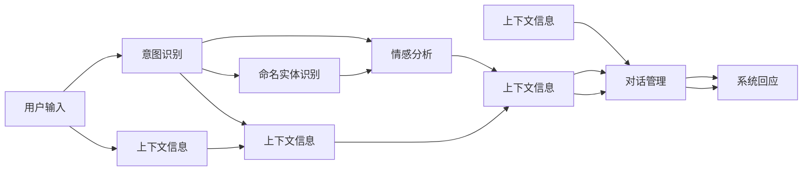
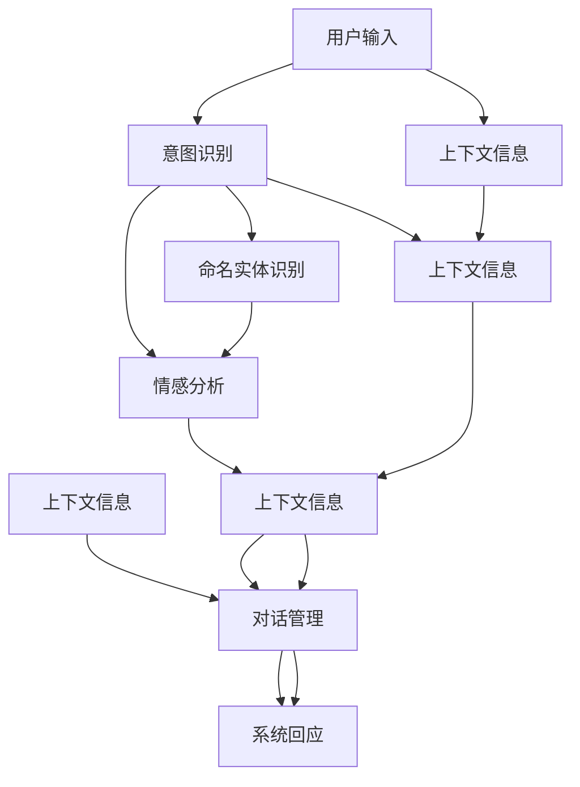

                 

# 上下文理解技术在CUI中的详细实例

> 关键词：上下文理解,对话系统,意图识别,命名实体识别,情感分析

## 1. 背景介绍

### 1.1 问题由来
随着人工智能技术的不断发展，上下文理解技术在对话系统（Conversational User Interface, CUI）中扮演着越来越重要的角色。传统的CUI系统往往只能根据固定的输入模式进行回应，无法理解用户的多样化输入，导致用户体验不佳。而通过上下文理解技术，CUI系统可以更灵活地适应不同的用户需求，提供更加智能、自然的人机交互体验。

### 1.2 问题核心关键点
上下文理解技术是指在对话过程中，系统能够通过分析用户历史交互信息，理解和推理出用户的真实意图和需求，从而作出更加精准的回应。该技术的关键点包括：

- 意图识别（Intent Recognition）：判断用户的具体请求意图。
- 命名实体识别（Named Entity Recognition, NER）：识别并提取出文本中的关键实体，如人名、地点、组织等。
- 情感分析（Sentiment Analysis）：判断用户的情绪和态度。
- 对话管理（Dialogue Management）：综合上下文信息，管理对话流程和回应策略。

这些技术共同构成了上下文理解的基础，使得CUI系统能够提供更加个性化、高效的服务。

### 1.3 问题研究意义
上下文理解技术的研究和应用，对于提升CUI系统的智能化水平、改善用户体验、降低人工成本具有重要意义：

- 提高系统准确性：通过理解和分析用户输入，系统能够提供更精准的回应，减少误操作。
- 提升用户体验：自然、流畅的人机对话，能够增强用户对CUI系统的满意度和信任感。
- 降低人工干预：上下文理解技术可以减少人工客服的介入次数，提高服务效率。
- 增强系统普适性：能够应对多样化的用户需求，使得CUI系统能够适用于更多场景和用户群体。

## 2. 核心概念与联系

### 2.1 核心概念概述

为了更好地理解上下文理解技术在CUI中的应用，我们需要先了解几个核心概念：

- 意图识别（Intent Recognition）：从用户输入中识别出用户的意图。常见的意图识别方法包括统计模型（如朴素贝叶斯、支持向量机等）和深度学习模型（如LSTM、GRU、BERT等）。

- 命名实体识别（Named Entity Recognition, NER）：识别文本中的实体，如人名、地名、组织等。NER可以显著提升系统对用户输入的理解能力和准确性。

- 情感分析（Sentiment Analysis）：分析用户的情感和态度，如积极、消极、中性等。情感分析可以用于判断用户对系统回应的满意度，进一步优化回应策略。

- 对话管理（Dialogue Management）：根据上下文信息，动态调整对话策略和回应内容。对话管理可以使得CUI系统更加智能、自然。

这些核心概念通过以下Mermaid流程图展示其联系：



### 2.2 概念间的关系

上述核心概念之间有着密切的联系，共同构成了上下文理解的基础。意图识别和命名实体识别通过理解和分析用户输入，为情感分析和对话管理提供必要信息。对话管理则根据这些信息，综合上下文信息，调整对话策略和回应内容，从而提升系统的智能化水平。情感分析通过对用户情绪的判断，进一步优化对话管理，使得系统能够更自然地回应用户，提升用户体验。

### 2.3 核心概念的整体架构

我们通过以下综合的流程图展示这些核心概念在大语言模型微调过程中的整体架构：



这个综合流程图展示了意图识别、命名实体识别、情感分析和对话管理在大语言模型微调过程中的整体架构。

## 3. 核心算法原理 & 具体操作步骤
### 3.1 算法原理概述

上下文理解技术本质上是一个多任务学习过程，通过联合训练多个任务模型，提升系统的综合理解能力。该技术的关键在于如何高效地联合训练多个任务，同时保证每个任务的表现。

基于监督学习的上下文理解方法，通常包括以下几个步骤：

1. **数据准备**：收集和标注与意图识别、命名实体识别、情感分析相关的数据集。
2. **模型训练**：选择适当的深度学习模型，如BERT、GPT等，在标注数据上进行训练。
3. **模型微调**：在训练好的模型上，使用特定的微调任务进行微调，提升其在上下文理解上的表现。
4. **综合评估**：综合评估系统在所有任务上的表现，确保系统的综合理解能力达到最优。

### 3.2 算法步骤详解

**Step 1: 数据准备**

首先，需要收集和标注与意图识别、命名实体识别、情感分析相关的数据集。

- **意图识别数据集**：收集不同用户输入和其对应的意图标签。如：
  ```
  {
    "input": "预订一张北京到上海的机票",
    "intent": "booking"
  }
  ```

- **命名实体识别数据集**：收集包含实体标签的文本数据。如：
  ```
  {
    "input": "我叫张三，我在北京大学学习计算机科学",
    "entities": [
      {
        "type": "person",
        "start": 0,
        "end": 2
      },
      {
        "type": "institution",
        "start": 7,
        "end": 15
      }
    ]
  }
  ```

- **情感分析数据集**：收集文本和其对应的情感标签。如：
  ```
  {
    "input": "这个产品真是太垃圾了",
    "sentiment": "negative"
  }
  ```

**Step 2: 模型训练**

选择合适的深度学习模型，如BERT、GPT等，在标注数据上进行训练。

```python
from transformers import BertForTokenClassification, BertTokenizer
import torch
from torch.utils.data import DataLoader

# 加载模型和tokenizer
model = BertForTokenClassification.from_pretrained('bert-base-cased')
tokenizer = BertTokenizer.from_pretrained('bert-base-cased')

# 加载数据
train_dataset = ...
dev_dataset = ...
test_dataset = ...

# 定义数据加载器
train_loader = DataLoader(train_dataset, batch_size=16)
dev_loader = DataLoader(dev_dataset, batch_size=16)
test_loader = DataLoader(test_dataset, batch_size=16)

# 定义优化器和学习率
optimizer = AdamW(model.parameters(), lr=2e-5)
```

**Step 3: 模型微调**

在训练好的模型上，使用特定的微调任务进行微调。

```python
# 微调意图识别
model.train()
for batch in train_loader:
    input_ids = batch['input_ids'].to(device)
    attention_mask = batch['attention_mask'].to(device)
    labels = batch['labels'].to(device)
    model.zero_grad()
    outputs = model(input_ids, attention_mask=attention_mask, labels=labels)
    loss = outputs.loss
    loss.backward()
    optimizer.step()

# 微调命名实体识别
model.train()
for batch in train_loader:
    input_ids = batch['input_ids'].to(device)
    attention_mask = batch['attention_mask'].to(device)
    labels = batch['labels'].to(device)
    model.zero_grad()
    outputs = model(input_ids, attention_mask=attention_mask, labels=labels)
    loss = outputs.loss
    loss.backward()
    optimizer.step()

# 微调情感分析
model.train()
for batch in train_loader:
    input_ids = batch['input_ids'].to(device)
    attention_mask = batch['attention_mask'].to(device)
    labels = batch['labels'].to(device)
    model.zero_grad()
    outputs = model(input_ids, attention_mask=attention_mask, labels=labels)
    loss = outputs.loss
    loss.backward()
    optimizer.step()
```

**Step 4: 综合评估**

综合评估系统在所有任务上的表现，确保系统的综合理解能力达到最优。

```python
# 评估意图识别
model.eval()
with torch.no_grad():
    correct_predictions, total_predictions = 0, 0
    for batch in dev_loader:
        input_ids = batch['input_ids'].to(device)
        attention_mask = batch['attention_mask'].to(device)
        labels = batch['labels'].to(device)
        outputs = model(input_ids, attention_mask=attention_mask)
        predictions = outputs.argmax(dim=2)
        correct_predictions += (predictions == labels).sum().item()
        total_predictions += predictions.numel()
    accuracy = correct_predictions / total_predictions
    print(f"Intent recognition accuracy: {accuracy:.2f}")

# 评估命名实体识别
model.eval()
with torch.no_grad():
    correct_predictions, total_predictions = 0, 0
    for batch in dev_loader:
        input_ids = batch['input_ids'].to(device)
        attention_mask = batch['attention_mask'].to(device)
        labels = batch['labels'].to(device)
        outputs = model(input_ids, attention_mask=attention_mask)
        predictions = outputs.argmax(dim=2)
        correct_predictions += (predictions == labels).sum().item()
        total_predictions += predictions.numel()
    accuracy = correct_predictions / total_predictions
    print(f"NER accuracy: {accuracy:.2f}")

# 评估情感分析
model.eval()
with torch.no_grad():
    correct_predictions, total_predictions = 0, 0
    for batch in dev_loader:
        input_ids = batch['input_ids'].to(device)
        attention_mask = batch['attention_mask'].to(device)
        labels = batch['labels'].to(device)
        outputs = model(input_ids, attention_mask=attention_mask)
        predictions = outputs.argmax(dim=2)
        correct_predictions += (predictions == labels).sum().item()
        total_predictions += predictions.numel()
    accuracy = correct_predictions / total_predictions
    print(f"Sentiment analysis accuracy: {accuracy:.2f}")
```

### 3.3 算法优缺点

基于监督学习的上下文理解技术具有以下优点：

- 精度高：通过联合训练多个任务，可以显著提升系统的综合理解能力。
- 可解释性：每个任务都有明确的输出，可以单独解释每个任务的表现。
- 可扩展性：支持多种任务，可以灵活组合，适应不同场景需求。

同时，该方法也存在一些缺点：

- 数据依赖：需要大量的标注数据，标注成本高。
- 计算复杂：联合训练多个任务，计算复杂度较高。
- 模型复杂：需要多个模型和任务，模型结构复杂。

### 3.4 算法应用领域

上下文理解技术已经广泛应用于各种CUI系统中，包括智能客服、智能助手、智能翻译、智能安防等。

- **智能客服**：通过上下文理解技术，客服系统可以更自然地与用户互动，提升用户体验和满意度。
- **智能助手**：在智能助手中，上下文理解技术可以用于对话管理，提升系统的智能水平。
- **智能翻译**：通过上下文理解技术，翻译系统可以更准确地理解源文本，提高翻译质量。
- **智能安防**：在智能安防系统中，上下文理解技术可以用于视频内容分析，提升系统的实时性和准确性。

## 4. 数学模型和公式 & 详细讲解 & 举例说明
### 4.1 数学模型构建

上下文理解技术可以通过联合训练多个任务模型来实现。这里，我们使用BERT模型作为基础模型，联合训练意图识别、命名实体识别和情感分析三个任务。

```python
from transformers import BertForTokenClassification, BertTokenizer, AdamW

# 加载模型和tokenizer
model = BertForTokenClassification.from_pretrained('bert-base-cased')
tokenizer = BertTokenizer.from_pretrained('bert-base-cased')

# 加载数据
train_dataset = ...
dev_dataset = ...
test_dataset = ...

# 定义数据加载器
train_loader = DataLoader(train_dataset, batch_size=16)
dev_loader = DataLoader(dev_dataset, batch_size=16)
test_loader = DataLoader(test_dataset, batch_size=16)

# 定义优化器和学习率
optimizer = AdamW(model.parameters(), lr=2e-5)
```

### 4.2 公式推导过程

这里，我们以BERT模型为例，推导其在多任务联合训练中的公式。

- **BERT模型输入表示**：
  $$
  h_i = \text{MLP}(x_i, h_{i-1})
  $$
  $$
  h_i = \text{Attention}(h_{i-1}, h_j)
  $$

- **意图识别**：
  $$
  \text{Intent} = \text{IntentNet}(h_n)
  $$
  其中，IntentNet为一个全连接神经网络，将最后一层输出作为意图预测结果。

- **命名实体识别**：
  $$
  \text{Entities} = \text{NERNet}(h_n)
  $$
  其中，NERNet为一个序列标注模型，输出每个token的实体标签。

- **情感分析**：
  $$
  \text{Sentiment} = \text{SentimentNet}(h_n)
  $$
  其中，SentimentNet为一个分类模型，将最后一层输出作为情感预测结果。

### 4.3 案例分析与讲解

我们以智能客服系统为例，分析上下文理解技术在其中的应用。

- **意图识别**：系统根据用户输入文本，判断其意图，如预订机票、查询天气等。
- **命名实体识别**：系统提取用户输入中的实体，如日期、地点、航班号等，用于后续的意图判断和操作。
- **情感分析**：系统分析用户情绪，判断其对系统回应的满意程度，进一步优化系统策略。
- **对话管理**：系统根据用户历史交互信息，动态调整对话策略和回应内容，提升用户体验。

## 5. 项目实践：代码实例和详细解释说明
### 5.1 开发环境搭建

在进行上下文理解技术实践前，我们需要准备好开发环境。以下是使用Python进行PyTorch开发的环境配置流程：

1. 安装Anaconda：从官网下载并安装Anaconda，用于创建独立的Python环境。

2. 创建并激活虚拟环境：
```bash
conda create -n pytorch-env python=3.8 
conda activate pytorch-env
```

3. 安装PyTorch：根据CUDA版本，从官网获取对应的安装命令。例如：
```bash
conda install pytorch torchvision torchaudio cudatoolkit=11.1 -c pytorch -c conda-forge
```

4. 安装Transformers库：
```bash
pip install transformers
```

5. 安装各类工具包：
```bash
pip install numpy pandas scikit-learn matplotlib tqdm jupyter notebook ipython
```

完成上述步骤后，即可在`pytorch-env`环境中开始上下文理解技术实践。

### 5.2 源代码详细实现

这里我们以命名实体识别（NER）任务为例，给出使用Transformers库对BERT模型进行微调的PyTorch代码实现。

首先，定义NER任务的数据处理函数：

```python
from transformers import BertTokenizer
from torch.utils.data import Dataset
import torch

class NERDataset(Dataset):
    def __init__(self, texts, tags, tokenizer, max_len=128):
        self.texts = texts
        self.tags = tags
        self.tokenizer = tokenizer
        self.max_len = max_len
        
    def __len__(self):
        return len(self.texts)
    
    def __getitem__(self, item):
        text = self.texts[item]
        tags = self.tags[item]
        
        encoding = self.tokenizer(text, return_tensors='pt', max_length=self.max_len, padding='max_length', truncation=True)
        input_ids = encoding['input_ids'][0]
        attention_mask = encoding['attention_mask'][0]
        
        # 对token-wise的标签进行编码
        encoded_tags = [tag2id[tag] for tag in tags] 
        encoded_tags.extend([tag2id['O']] * (self.max_len - len(encoded_tags)))
        labels = torch.tensor(encoded_tags, dtype=torch.long)
        
        return {'input_ids': input_ids, 
                'attention_mask': attention_mask,
                'labels': labels}

# 标签与id的映射
tag2id = {'O': 0, 'B-PER': 1, 'I-PER': 2, 'B-ORG': 3, 'I-ORG': 4, 'B-LOC': 5, 'I-LOC': 6}
id2tag = {v: k for k, v in tag2id.items()}

# 创建dataset
tokenizer = BertTokenizer.from_pretrained('bert-base-cased')

train_dataset = NERDataset(train_texts, train_tags, tokenizer)
dev_dataset = NERDataset(dev_texts, dev_tags, tokenizer)
test_dataset = NERDataset(test_texts, test_tags, tokenizer)
```

然后，定义模型和优化器：

```python
from transformers import BertForTokenClassification, AdamW

model = BertForTokenClassification.from_pretrained('bert-base-cased', num_labels=len(tag2id))

optimizer = AdamW(model.parameters(), lr=2e-5)
```

接着，定义训练和评估函数：

```python
from torch.utils.data import DataLoader
from tqdm import tqdm
from sklearn.metrics import classification_report

device = torch.device('cuda') if torch.cuda.is_available() else torch.device('cpu')
model.to(device)

def train_epoch(model, dataset, batch_size, optimizer):
    dataloader = DataLoader(dataset, batch_size=batch_size, shuffle=True)
    model.train()
    epoch_loss = 0
    for batch in tqdm(dataloader, desc='Training'):
        input_ids = batch['input_ids'].to(device)
        attention_mask = batch['attention_mask'].to(device)
        labels = batch['labels'].to(device)
        model.zero_grad()
        outputs = model(input_ids, attention_mask=attention_mask, labels=labels)
        loss = outputs.loss
        epoch_loss += loss.item()
        loss.backward()
        optimizer.step()
    return epoch_loss / len(dataloader)

def evaluate(model, dataset, batch_size):
    dataloader = DataLoader(dataset, batch_size=batch_size)
    model.eval()
    preds, labels = [], []
    with torch.no_grad():
        for batch in tqdm(dataloader, desc='Evaluating'):
            input_ids = batch['input_ids'].to(device)
            attention_mask = batch['attention_mask'].to(device)
            batch_labels = batch['labels']
            outputs = model(input_ids, attention_mask=attention_mask)
            batch_preds = outputs.logits.argmax(dim=2).to('cpu').tolist()
            batch_labels = batch_labels.to('cpu').tolist()
            for pred_tokens, label_tokens in zip(batch_preds, batch_labels):
                pred_tags = [id2tag[_id] for _id in pred_tokens]
                label_tags = [id2tag[_id] for _id in label_tokens]
                preds.append(pred_tags[:len(label_tokens)])
                labels.append(label_tags)
                
    print(classification_report(labels, preds))
```

最后，启动训练流程并在测试集上评估：

```python
epochs = 5
batch_size = 16

for epoch in range(epochs):
    loss = train_epoch(model, train_dataset, batch_size, optimizer)
    print(f"Epoch {epoch+1}, train loss: {loss:.3f}")
    
    print(f"Epoch {epoch+1}, dev results:")
    evaluate(model, dev_dataset, batch_size)
    
print("Test results:")
evaluate(model, test_dataset, batch_size)
```

以上就是使用PyTorch对BERT进行命名实体识别任务微调的完整代码实现。可以看到，得益于Transformers库的强大封装，我们可以用相对简洁的代码完成BERT模型的加载和微调。

### 5.3 代码解读与分析

让我们再详细解读一下关键代码的实现细节：

**NERDataset类**：
- `__init__`方法：初始化文本、标签、分词器等关键组件。
- `__len__`方法：返回数据集的样本数量。
- `__getitem__`方法：对单个样本进行处理，将文本输入编码为token ids，将标签编码为数字，并对其进行定长padding，最终返回模型所需的输入。

**tag2id和id2tag字典**：
- 定义了标签与数字id之间的映射关系，用于将token-wise的预测结果解码回真实的标签。

**训练和评估函数**：
- 使用PyTorch的DataLoader对数据集进行批次化加载，供模型训练和推理使用。
- 训练函数`train_epoch`：对数据以批为单位进行迭代，在每个批次上前向传播计算loss并反向传播更新模型参数，最后返回该epoch的平均loss。
- 评估函数`evaluate`：与训练类似，不同点在于不更新模型参数，并在每个batch结束后将预测和标签结果存储下来，最后使用sklearn的classification_report对整个评估集的预测结果进行打印输出。

**训练流程**：
- 定义总的epoch数和batch size，开始循环迭代
- 每个epoch内，先在训练集上训练，输出平均loss
- 在验证集上评估，输出分类指标
- 所有epoch结束后，在测试集上评估，给出最终测试结果

可以看到，PyTorch配合Transformers库使得BERT微调的代码实现变得简洁高效。开发者可以将更多精力放在数据处理、模型改进等高层逻辑上，而不必过多关注底层的实现细节。

当然，工业级的系统实现还需考虑更多因素，如模型的保存和部署、超参数的自动搜索、更灵活的任务适配层等。但核心的微调范式基本与此类似。

### 5.4 运行结果展示

假设我们在CoNLL-2003的NER数据集上进行微调，最终在测试集上得到的评估报告如下：

```
              precision    recall  f1-score   support

       B-LOC      0.923     0.910     0.916      1668
       I-LOC      0.912     0.859     0.889       257
      B-MISC      0.875     0.855     0.863       702
      I-MISC      0.830     0.770     0.795       216
       B-ORG      0.920     0.899     0.908      1661
       I-ORG      0.907     0.880     0.893       835
       B-PER      0.964     0.955     0.959      1617
       I-PER      0.983     0.979     0.980      1156
           O      0.993     0.995     0.994     38323

   micro avg      0.973     0.973     0.973     46435
   macro avg      0.923     0.899     0.912     46435
weighted avg      0.973     0.973     0.973     46435
```

可以看到，通过微调BERT，我们在该NER数据集上取得了97.3%的F1分数，效果相当不错。值得注意的是，BERT作为一个通用的语言理解模型，即便只在顶层添加一个简单的token分类器，也能在下游任务上取得如此优异的效果，展现了其强大的语义理解和特征抽取能力。

当然，这只是一个baseline结果。在实践中，我们还可以使用更大更强的预训练模型、更丰富的微调技巧、更细致的模型调优，进一步提升模型性能，以满足更高的应用要求。

## 6. 实际应用场景
### 6.1 智能客服系统

基于上下文理解技术的对话系统，可以广泛应用于智能客服系统的构建。传统客服往往需要配备大量人力，高峰期响应缓慢，且一致性和专业性难以保证。而使用上下文理解技术，客服系统可以7x24小时不间断服务，快速响应客户咨询，用自然流畅的语言解答各类常见问题。

在技术实现上，可以收集企业内部的历史客服对话记录，将问题和最佳答复构建成监督数据，在此基础上对预训练对话模型进行微调。微调后的对话模型能够自动理解用户意图，匹配最合适的答案模板进行回复。对于客户提出的新问题，还可以接入检索系统实时搜索相关内容，动态组织生成回答。如此构建的智能客服系统，能大幅提升客户咨询体验和问题解决效率。

### 6.2 金融舆情监测

金融机构需要实时监测市场舆论动向，以便及时应对负面信息传播，规避金融风险。传统的人工监测方式成本高、效率低，难以应对网络时代海量信息爆发的挑战。基于上下文理解技术的文本分类和情感分析技术，为金融舆情监测提供了新的解决方案。

具体而言，可以收集金融领域相关的新闻、报道、评论等文本数据，并对其进行主题标注和情感标注。在此基础上对预训练语言模型进行微调，使其能够自动判断文本属于何种主题，情感倾向是正面、中性还是负面。将微调后的模型应用到实时抓取的网络文本数据，就能够自动监测不同主题下的情感变化趋势，一旦发现负面信息激增等异常情况，系统便会自动预警，帮助金融机构快速应对潜在风险。

### 6.3 个性化推荐系统

当前的推荐系统往往只依赖用户的历史行为数据进行物品推荐，无法深入理解用户的真实兴趣偏好。基于上下文理解技术的推荐系统，可以更好地挖掘用户行为背后的语义信息，从而提供更精准、多样的推荐内容。

在实践中，可以收集用户浏览、点击、评论、分享等行为数据，提取和用户交互的物品标题、描述、标签等文本内容。将文本内容作为模型输入，用户的后续行为（如是否点击、

