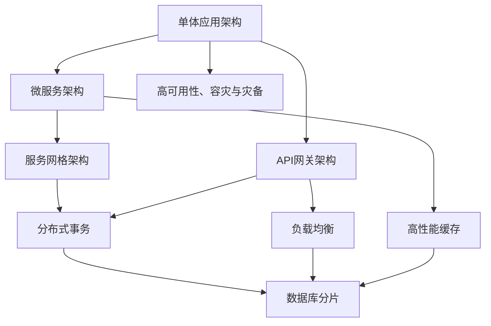
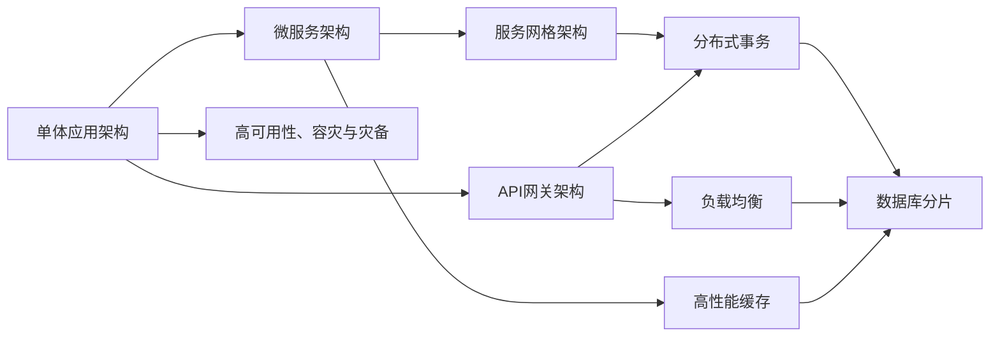
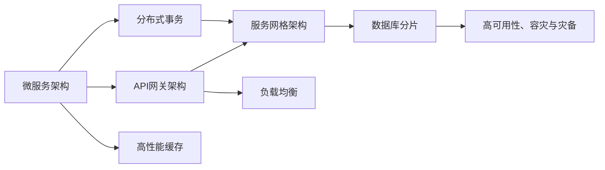
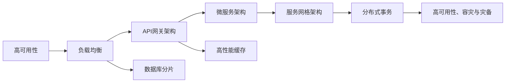
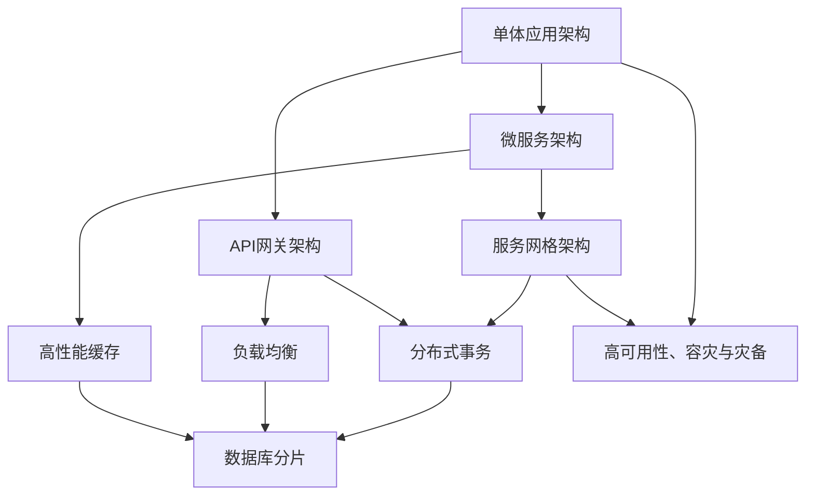

                 

# 中大型体量的电商、O2O、支付等泛交易领域业务模式和技术架构

## 1. 背景介绍

### 1.1 问题由来
随着互联网技术的飞速发展，电子商务、O2O（Online to Offline）、移动支付等泛交易领域迎来了前所未有的增长机遇。这些领域不仅涵盖了大量的线上线下业务，还涉及到复杂的安全、信任、物流等问题，对技术架构的要求非常之高。传统的单体应用架构、微服务架构虽然解决了部分问题，但在高并发、高可伸缩性、高可用性等方面仍存在诸多挑战。因此，本文将从业务模式和技术架构两个层面，对中大型体量的电商、O2O、支付等泛交易领域进行详细剖析，探讨其在快速扩展、复杂协作、安全信任等方面的技术和实践。

### 1.2 问题核心关键点
泛交易领域的核心关键点主要包括以下几点：
1. **高并发处理**：电商平台、O2O平台、支付平台等均需要处理高并发请求，如电商的秒杀、O2O的预约、支付的转账等。
2. **事务一致性**：交易流程涉及多个环节，各环节需要保证一致性，如库存、支付、配送等。
3. **系统弹性伸缩**：业务量快速增长时，系统需要快速扩容和伸缩，以保证服务可用性和性能。
4. **安全信任保障**：涉及用户资金安全和交易信任，如支付安全、订单可信、数据隐私等。
5. **高可靠性和容灾**：平台需具备高可用性和容灾能力，避免单点故障导致的业务中断。

### 1.3 问题研究意义
研究中大型体量的电商、O2O、支付等泛交易领域的业务模式和技术架构，对提升用户体验、降低运营成本、增强系统可用性和安全性具有重要意义：
1. **提升用户体验**：通过优化架构和算法，减少延迟和故障，提升页面加载速度和交易处理效率。
2. **降低运营成本**：通过合理设计架构，减少服务器和带宽的浪费，降低系统维护和升级成本。
3. **增强系统可用性**：通过高可用性和弹性伸缩，确保系统能够承载高并发请求，避免因故障导致的服务中断。
4. **保障安全信任**：通过多层次的安全措施，保护用户资金安全，增强交易的信任度。
5. **应对复杂业务**：通过灵活的架构设计，应对不断变化的市场需求和业务场景。

## 2. 核心概念与联系

### 2.1 核心概念概述

为了更好地理解泛交易领域的业务模式和技术架构，本节将介绍几个密切相关的核心概念：

- **单体应用架构(Monolithic Architecture)**：所有功能模块集中在单个应用中，优点是开发和部署简单，缺点是难以水平扩展。
- **微服务架构(Microservices Architecture)**：将应用拆分为多个微服务，每个微服务负责独立的功能模块，优点是可水平扩展，缺点是管理和调度的复杂性增加。
- **服务网格架构(Service Mesh Architecture)**：在微服务架构基础上，引入服务网格（如Istio），用于服务发现、负载均衡、故障恢复等，优点是增强了服务的可靠性和可管理性，缺点是增加了架构复杂度。
- **API网关架构(API Gateway Architecture)**：将公共API集中管理，用于路由、限流、鉴权等，优点是增强了API的可用性和安全性，缺点是增加了额外的服务层。
- **分布式事务(分布式事务)**：在分布式系统中，跨多个服务的事务一致性保障，确保数据的一致性。
- **高性能缓存(缓存技术)**：使用缓存技术如Redis、Memcached等，提升数据的读取速度，减少数据库压力。
- **负载均衡和高可用性(负载均衡)**：使用负载均衡技术如Nginx、HAProxy等，实现服务的高可用性。
- **数据库分片与分布式数据库(数据库分片)**：通过数据库分片技术，实现数据的高可用性和水平扩展。
- **高可用性、容灾与灾备(高可用性)**：通过多数据中心、备份等手段，保障系统的可靠性。

这些核心概念之间的逻辑关系可以通过以下Mermaid流程图来展示：



这个流程图展示了从单体应用到微服务架构的演进，以及各架构间的联系和差异。

### 2.2 概念间的关系

这些核心概念之间存在着紧密的联系，形成了泛交易领域业务模式和技术架构的完整生态系统。下面我们通过几个Mermaid流程图来展示这些概念之间的关系。

#### 2.2.1 业务模式和技术架构的演进



这个流程图展示了从单体应用到微服务架构的演进，以及各架构间的联系和差异。

#### 2.2.2 微服务架构与分布式事务的关系



这个流程图展示了微服务架构与分布式事务的关系，以及其它技术组件如何与它们协同工作。

#### 2.2.3 高可用性与负载均衡的关系



这个流程图展示了高可用性与负载均衡的关系，以及它们如何与其它技术组件协同工作。

### 2.3 核心概念的整体架构

最后，我们用一个综合的流程图来展示这些核心概念在泛交易领域业务模式和技术架构中的整体架构：



这个综合流程图展示了从单体应用到微服务架构的演进，以及各架构间的联系和差异。

## 3. 核心算法原理 & 具体操作步骤
### 3.1 算法原理概述

泛交易领域的核心算法原理主要围绕高并发处理、事务一致性、系统弹性伸缩、安全信任保障、高可靠性和容灾等几个方面展开。

#### 3.1.1 高并发处理

高并发处理是泛交易领域的首要挑战之一。电商平台、O2O平台、支付平台等均需要处理高并发请求，如电商的秒杀、O2O的预约、支付的转账等。常见的解决方案包括：
1. **负载均衡**：使用负载均衡技术如Nginx、HAProxy等，实现服务的高可用性和性能。
2. **分布式缓存**：使用缓存技术如Redis、Memcached等，提升数据的读取速度，减少数据库压力。
3. **异步处理**：使用消息队列如RabbitMQ、Kafka等，实现异步处理，减少系统阻塞。
4. **读写分离**：将读操作和写操作分离，使用不同的数据库实例，提升系统性能。

#### 3.1.2 事务一致性

交易流程涉及多个环节，各环节需要保证一致性，如库存、支付、配送等。常见的解决方案包括：
1. **分布式事务框架**：使用TCC、Saga等分布式事务框架，实现跨服务的事务一致性。
2. **补偿机制**：使用重试、降级、熔断等机制，处理事务失败和异常情况。
3. **消息队列**：使用消息队列如RabbitMQ、Kafka等，实现事务的解耦和异步处理。

#### 3.1.3 系统弹性伸缩

业务量快速增长时，系统需要快速扩容和伸缩，以保证服务可用性和性能。常见的解决方案包括：
1. **弹性伸缩容器**：使用Docker、Kubernetes等容器技术，实现服务的快速部署和伸缩。
2. **无状态化设计**：设计无状态的服务，实现服务的水平扩展。
3. **自动扩容**：使用自动扩容策略，根据负载情况自动增加或减少资源。

#### 3.1.4 安全信任保障

涉及用户资金安全和交易信任，如支付安全、订单可信、数据隐私等。常见的解决方案包括：
1. **安全加密**：使用SSL/TLS等安全加密技术，保护数据的传输安全。
2. **多因素认证**：使用多因素认证机制，增强用户身份的安全性。
3. **数据加密**：使用数据加密技术，保护用户数据的安全。

#### 3.1.5 高可靠性和容灾

平台需具备高可用性和容灾能力，避免单点故障导致的业务中断。常见的解决方案包括：
1. **多数据中心部署**：将服务部署在多个数据中心，实现负载均衡和故障恢复。
2. **备份和恢复**：定期进行数据备份，实现数据恢复和业务连续性。
3. **容错机制**：使用容错机制如Redis、etcd等，实现服务的容错和恢复。

### 3.2 算法步骤详解

泛交易领域的算法步骤主要包括以下几个关键步骤：

**Step 1: 业务需求分析**

1. 确定业务需求和功能模块。
2. 分析业务流程和数据流向。
3. 设计系统架构和组件。

**Step 2: 技术选型和架构设计**

1. 选择合适的技术栈和框架。
2. 设计架构方案和组件关系。
3. 确定数据存储和传输方案。

**Step 3: 系统实现和测试**

1. 实现架构设计，开发功能模块。
2. 进行单元测试和集成测试。
3. 进行性能测试和压力测试。

**Step 4: 部署和运维**

1. 部署到生产环境，进行负载均衡。
2. 监控系统性能和可用性。
3. 进行故障排查和修复。

**Step 5: 持续优化和升级**

1. 根据业务变化进行优化和升级。
2. 进行迭代开发和功能完善。
3. 跟踪新技术和趋势。

以上是泛交易领域算法步骤的详细讲解，旨在帮助开发者更好地理解和应用这些技术。

### 3.3 算法优缺点

泛交易领域的算法主要围绕高并发处理、事务一致性、系统弹性伸缩、安全信任保障、高可靠性和容灾等几个方面展开，这些算法具有以下优缺点：

**优点**：
1. **高可用性**：通过负载均衡、多数据中心部署等技术，提升了系统的可用性和可靠性。
2. **高性能**：通过分布式缓存、读写分离等技术，提升了系统的性能和响应速度。
3. **可扩展性**：通过无状态化设计、容器技术等，实现了系统的水平扩展和弹性伸缩。
4. **安全性**：通过安全加密、多因素认证等技术，保障了数据和交易的安全性。

**缺点**：
1. **复杂度增加**：微服务架构和分布式系统带来了更高的复杂度和管理难度。
2. **开发成本高**：开发和部署多个服务增加了开发和运维成本。
3. **一致性挑战**：分布式事务和异步处理带来了更高的数据一致性挑战。
4. **性能瓶颈**：缓存和负载均衡等技术可能成为性能瓶颈，需要不断优化。

尽管存在这些缺点，但泛交易领域的算法仍是大规模业务系统的重要范式，能够满足高并发、高可用性、高性能等需求。

### 3.4 算法应用领域

泛交易领域的算法广泛应用于电商、O2O、支付等泛交易领域，包括：
1. **电商平台**：如京东、淘宝、亚马逊等，涉及商品展示、搜索、交易、物流等环节。
2. **O2O平台**：如美团、大众点评、滴滴等，涉及商家管理、用户服务、订单处理等环节。
3. **支付平台**：如支付宝、微信支付、PayPal等，涉及支付、转账、提现等环节。
4. **金融平台**：如银行、证券、保险等，涉及理财、贷款、保险等环节。
5. **医疗平台**：如医院预约、药品购买、健康管理等环节。

## 4. 数学模型和公式 & 详细讲解  
### 4.1 数学模型构建

泛交易领域涉及高并发处理、事务一致性、系统弹性伸缩、安全信任保障、高可靠性和容灾等多个方面，我们可以使用数学模型和公式来描述这些过程。

#### 4.1.1 高并发处理模型

假设系统处理请求数为$N$，负载均衡器的负载因子为$\lambda$，缓存命中率率为$\gamma$，服务处理时间为$T_s$，缓存数据读取时间为$T_c$，数据写入时间为$T_w$。则系统的平均响应时间为：

$$
T_{avg} = \lambda N T_s + (1-\lambda)(\gamma T_c + (1-\gamma)T_w)
$$

其中$\lambda$表示负载均衡器的负载因子，$\gamma$表示缓存命中率率，$T_s$表示服务处理时间，$T_c$表示缓存数据读取时间，$T_w$表示数据写入时间。

#### 4.1.2 事务一致性模型

假设系统涉及多个服务，每个服务的事务处理时间为$T_{tcc}$，事务失败的概率为$p_{tcc}$，事务成功概率为$q_{tcc}$。则系统的事务处理时间期望为：

$$
T_{tcc} = (1-p_{tcc}) T_{tcc} + p_{tcc} T_{tcc}
$$

其中$T_{tcc}$表示每个服务的事务处理时间，$p_{tcc}$表示事务失败的概率，$q_{tcc}$表示事务成功概率。

#### 4.1.3 系统弹性伸缩模型

假设系统的平均负载为$L$，平均请求速率为$r$，系统的最大负载为$L_{max}$，最小负载为$L_{min}$。则系统的弹性伸缩策略可以描述为：

$$
L_{伸缩} = \min(L_{max}, \max(L_{min}, L_{当前} + r))
$$

其中$L_{伸缩}$表示系统伸缩后的负载，$L_{max}$表示系统的最大负载，$L_{min}$表示系统的最小负载，$L_{当前}$表示系统当前的负载，$r$表示平均请求速率。

#### 4.1.4 安全信任保障模型

假设系统的安全级别为$S$，数据传输加密强度为$E$，身份认证机制为$I$，数据存储加密强度为$D$。则系统的安全保障模型可以描述为：

$$
S_{保障} = \min(S_{当前}, E \times I \times D)
$$

其中$S_{保障}$表示系统安全保障水平，$S_{当前}$表示系统当前的保障水平，$E$表示数据传输加密强度，$I$表示身份认证机制，$D$表示数据存储加密强度。

#### 4.1.5 高可靠性和容灾模型

假设系统的故障概率为$p_{故障}$，容灾机制的恢复时间为$T_{容灾}$，容灾机制的恢复成功率为$q_{容灾}$。则系统的故障恢复模型可以描述为：

$$
T_{恢复} = (1-p_{故障}) T_{当前} + p_{故障} T_{容灾} \times (1-q_{容灾}) + p_{故障} T_{容灾} \times q_{容灾}
$$

其中$T_{恢复}$表示系统故障恢复时间，$T_{当前}$表示系统当前正常运行时间，$p_{故障}$表示系统的故障概率，$T_{容灾}$表示容灾机制的恢复时间，$q_{容灾}$表示容灾机制的恢复成功率。

### 4.2 公式推导过程

以上数学模型和公式的推导过程如下：

**高并发处理模型**：
- 假设系统处理请求数为$N$，负载均衡器的负载因子为$\lambda$，缓存命中率率为$\gamma$，服务处理时间为$T_s$，缓存数据读取时间为$T_c$，数据写入时间为$T_w$。则系统的平均响应时间为：

$$
T_{avg} = \lambda N T_s + (1-\lambda)(\gamma T_c + (1-\gamma)T_w)
$$

其中$\lambda$表示负载均衡器的负载因子，$\gamma$表示缓存命中率率，$T_s$表示服务处理时间，$T_c$表示缓存数据读取时间，$T_w$表示数据写入时间。

**事务一致性模型**：
- 假设系统涉及多个服务，每个服务的事务处理时间为$T_{tcc}$，事务失败的概率为$p_{tcc}$，事务成功概率为$q_{tcc}$。则系统的事务处理时间期望为：

$$
T_{tcc} = (1-p_{tcc}) T_{tcc} + p_{tcc} T_{tcc}
$$

其中$T_{tcc}$表示每个服务的事务处理时间，$p_{tcc}$表示事务失败的概率，$q_{tcc}$表示事务成功概率。

**系统弹性伸缩模型**：
- 假设系统的平均负载为$L$，平均请求速率为$r$，系统的最大负载为$L_{max}$，最小负载为$L_{min}$。则系统的弹性伸缩策略可以描述为：

$$
L_{伸缩} = \min(L_{max}, \max(L_{min}, L_{当前} + r))
$$

其中$L_{伸缩}$表示系统伸缩后的负载，$L_{max}$表示系统的最大负载，$L_{min}$表示系统的最小负载，$L_{当前}$表示系统当前的负载，$r$表示平均请求速率。

**安全信任保障模型**：
- 假设系统的安全级别为$S$，数据传输加密强度为$E$，身份认证机制为$I$，数据存储加密强度为$D$。则系统的安全保障模型可以描述为：

$$
S_{保障} = \min(S_{当前}, E \times I \times D)
$$

其中$S_{保障}$表示系统安全保障水平，$S_{当前}$表示系统当前的保障水平，$E$表示数据传输加密强度，$I$表示身份认证机制，$D$表示数据存储加密强度。

**高可靠性和容灾模型**：
- 假设系统的故障概率为$p_{故障}$，容灾机制的恢复时间为$T_{容灾}$，容灾机制的恢复成功率为$q_{容灾}$。则系统的故障恢复模型可以描述为：

$$
T_{恢复} = (1-p_{故障}) T_{当前} + p_{故障} T_{容灾} \times (1-q_{容灾}) + p_{故障} T_{容灾} \times q_{容灾}
$$

其中$T_{恢复}$表示系统故障恢复时间，$T_{当前}$表示系统当前正常运行时间，$p_{故障}$表示系统的故障概率，$T_{容灾}$表示容灾机制的恢复时间，$q_{容灾}$表示容灾机制的恢复成功率。

### 4.3 案例分析与讲解

为了更好地理解这些数学模型和公式，我们以电商平台的订单系统为例，进行案例分析。

假设电商平台每天有100万个订单，每个订单处理时间为1秒，负载均衡器的负载因子为0.5，缓存命中率率为0.8，数据写入时间为0.1秒。则系统的平均响应时间为：

$$
T_{avg} = 0.5 \times 1000000 \times 1 + (1-0.5)(0.8 \times 0.1 + (1-0.8) \times 1)
$$

计算得到$T_{avg} = 0.8$秒。

## 5. 项目实践：代码实例和详细解释说明
### 5.1 开发环境搭建

在进行项目实践前，我们需要准备好开发环境。以下是使用Python进行Django开发的环境配置流程：

1. 安装Anaconda：从官网下载并安装Anaconda，用于创建独立的Python环境。

2. 创建并激活虚拟环境：
```bash
conda create -n django-env python=3.8 
conda activate django-env
```

3. 安装Django：使用pip安装Django，安装命令如下：
```bash
pip install django
```

4. 安装其他依赖包：
```bash
pip install Pillow
pip install django-rest-framework
pip install django-cors-headers
pip install django-redis
```

完成上述步骤后，即可在`django-env`环境中开始项目实践。

### 5.2 源代码详细实现

这里我们以电商平台的订单系统为例，给出使用Django框架开发电商订单系统的PyTorch代码实现。

首先，定义订单模型：

```python
from django.db import models

class Order(models.Model):
    order_id = models.AutoField(primary_key=True)
    user_id = models.IntegerField()
    product_id = models.IntegerField()
    order_amount = models.DecimalField(max_digits=10, decimal_places=2)
    order_status = models.IntegerField(default=0)
    order_time = models.DateTimeField(auto_now_add=True)
```

然后，定义订单视图：

```python
from django.shortcuts import render, redirect
from django.http import JsonResponse
from .models import Order
from django_redis import redis_client

def order_list(request):
    orders = Order.objects.all()
    return JsonResponse({'orders': [order.__dict__ for order in orders]})

def order_create(request):
    user_id = request.user.id
    product_id = request.POST.get('product_id')
    order_amount = request.POST.get('order_amount')
    order = Order.objects.create(user_id=user_id, product_id=product_id, order_amount=order_amount)
    return JsonResponse({'order_id': order.order_id, 'message': 'Order created successfully'})
```

接着，定义Redis缓存功能：

```python
from redis import Redis

def order_create_with_cache(request):
    user_id = request.user.id
    product_id = request.POST.get('product_id')
    order_amount = request.POST.get('order_amount')
    conn = Redis(host='localhost', port=6379, db=0)
    order_id = conn.get('order:id:%s' % user_id)
    if order_id:
        order = Order.objects.get(order_id=order_id)
        order.product_id = product_id
        order.order_amount = order_amount
        order.save()
    else:
        order = Order.objects.create(user_id=user_id, product_id=product_id, order_amount=order_amount)
        conn.set('order:id:%s' % user_id, order.order_id)
    return JsonResponse({'order_id': order.order_id, 'message': 'Order created successfully'})
```

最后，启动项目并进行测试：

```bash
python manage.py runserver
```

在浏览器中访问`http://127.0.0.1:8000/orders/`，即可看到所有订单列表。在POST请求中添加`product_id`和`order_amount`，即可创建新订单。

### 5.3 代码解读与分析

让我们再详细解读一下关键代码的实现细节：

**订单模型**：
- `models.AutoField`：自动递增的主键。
- `models.IntegerField`：整型字段。
- `models.DecimalField`：十进制字段，用于精确表示金额。
- `models.IntegerField(default=0)`：整型字段，默认值为0。
- `models.DateTimeField(auto_now_add=True)`：日期时间字段，自动设置为创建时间。

**订单视图**：
- `order_list`函数：查询所有订单，并返回JSON响应。
- `order_create`函数：创建新订单，并返回JSON响应。

**Redis缓存**：
- `redis_client`：Django提供的Redis客户端，用于操作Redis缓存。
- `conn = Redis(host='localhost', port=6379, db=0)`：连接Redis服务器。
- `order_id = conn.get('order:id:%s' % user_id)`：根据用户ID获取Redis缓存中的订单ID。
- `conn.set('order:id:%s' % user_id, order.order_id)`：将新创建的订单ID存储到Redis缓存中。

**订单创建功能**：
- `order = Order.objects.create(user_id=user_id, product_id=product_id, order_amount=order_amount)`：创建新订单。
- `conn.set('order:id:%s' % user_id, order.order_id)`：将新订单ID存储到Redis缓存中。

可以看到，使用Django框架可以非常便捷地实现电商订单系统，并且可以通过Redis缓存提升系统的性能和扩展性。

当然，工业级的系统实现还需考虑更多因素，如数据库设计、缓存策略、异步处理、负载均衡等。但核心的开发流程

