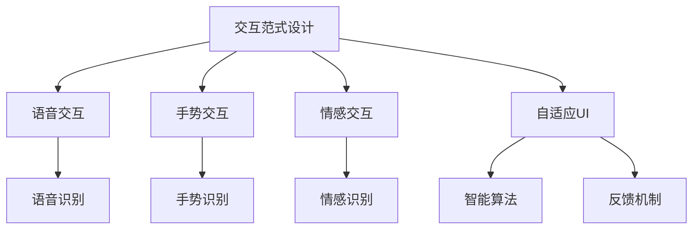
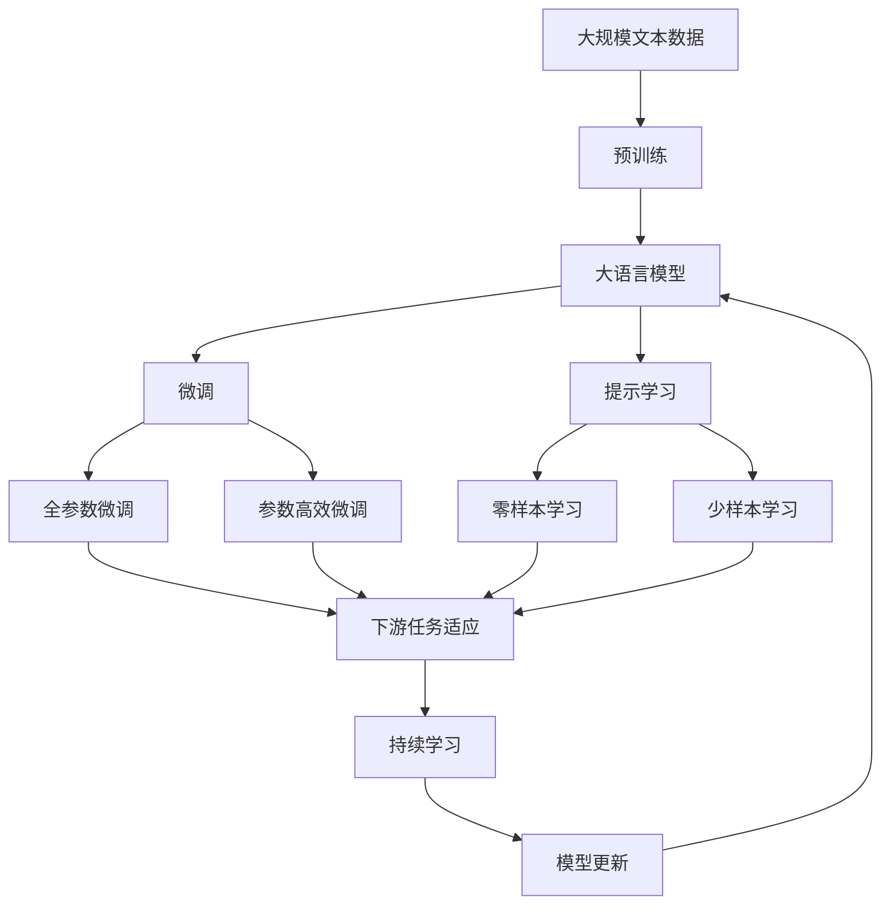

                 

# 交互范式：LUI的革命

## 1. 背景介绍

### 1.1 问题由来

随着移动互联网和智能设备的普及，用户与数字系统的交互方式已经从传统的点击、输入等方式，逐步向语音、手势、情感等更加自然、智能的交互方式演进。这种变化不仅提高了用户体验，也带来了全新的技术挑战。传统的人机交互(Human-Computer Interaction, HCI)范式，如点击式GUI界面，已经无法完全适应新的交互需求。亟需一种新的交互范式，为用户提供更加自然、高效、个性化的交互体验。

### 1.2 问题核心关键点

用户界面(User Interface, UI)作为人机交互的重要接口，是实现交互体验的关键。现代UI设计注重交互、信息架构和美学等方面，但依然受限于固定的框架和格式。随着技术的发展，用户期望UI能够动态调整和自适应，提升交互的沉浸感和满意度。然而，现有UI设计模式过于死板，难以实现这一目标。

因此，本文聚焦于交互范式设计，通过研究语音、手势、情感等自然交互方式，探索新的UI设计方法和技术路径，致力于解决上述问题。

### 1.3 问题研究意义

交互范式设计对于提升用户体验、推动技术进步、开拓新兴应用场景具有重要意义：

1. **提升用户体验**：通过自然交互方式，减少用户的操作负担，提供更为流畅、自然、个性化的用户体验。
2. **促进技术创新**：新的交互方式将推动UI设计、自然语言处理、计算机视觉等前沿技术的进一步发展，催生新的技术突破。
3. **开拓应用场景**：交互范式的改进将拓展UI设计的边界，引入更多场景，如智能家居、可穿戴设备、虚拟现实等，为技术落地提供新的方向。
4. **赋能产业升级**：交互范式设计将为传统产业带来颠覆性变革，如汽车、医疗、教育等领域，提升行业数字化水平。

## 2. 核心概念与联系

### 2.1 核心概念概述

为更好地理解交互范式设计的原理和架构，本节将介绍几个关键概念及其关系：

- **交互范式设计**：指在现有用户界面的基础上，通过引入语音、手势、情感等自然交互方式，设计新的UI设计方法和技术路径。
- **自然交互方式**：指用户与计算机之间的交互，无需通过键盘、鼠标等传统设备，而通过语音、手势、面部表情等自然方式进行。
- **语音交互**：通过语音识别和语音合成，实现语音指令与计算机系统的交互。
- **手势交互**：通过手势识别和手眼跟踪，实现手势指令与计算机系统的交互。
- **情感交互**：通过情感识别和情绪反馈，实现情感状态与计算机系统的交互。
- **自适应UI**：通过智能算法和反馈机制，动态调整UI设计，适应用户的个性化需求。

这些概念之间的关系可以通过以下Mermaid流程图来展示：



这个流程图展示了大语言模型微调过程中各个核心概念的关系：

1. 交互范式设计通过引入自然交互方式，实现与计算机系统的交互。
2. 语音交互、手势交互和情感交互，是自然交互方式的具体形式。
3. 自适应UI设计，是实现自然交互方式的关键技术手段。
4. 智能算法和反馈机制，是支持自适应UI设计的技术基础。

### 2.2 概念间的关系

这些核心概念之间存在着紧密的联系，构成了交互范式设计的基本框架。

- **交互范式设计**：是大语言模型微调的核心，涉及到语音、手势、情感等多种自然交互方式。
- **语音交互**：通过语音识别技术，将用户的口头指令转换为计算机可理解的语言，实现自然交互。
- **手势交互**：通过手势识别技术，将用户的手势动作转换为计算机可识别的指令，实现无屏幕交互。
- **情感交互**：通过情感识别技术，捕捉用户的情感状态，实现情绪驱动的交互。
- **自适应UI**：通过智能算法和反馈机制，动态调整UI设计，适应用户的个性化需求。

这些概念共同构成了交互范式设计的完整生态系统，使得计算机系统能够更加自然、高效地与用户进行交互。通过理解这些核心概念，我们可以更好地把握交互范式设计的技术框架和应用路径。

### 2.3 核心概念的整体架构

最后，我们用一个综合的流程图来展示这些核心概念在大语言模型微调过程中的整体架构：



这个综合流程图展示了从预训练到微调，再到持续学习的完整过程。大语言模型首先在大规模文本数据上进行预训练，然后通过微调（包括全参数微调和参数高效微调）或提示学习（包括零样本和少样本学习）来适应下游任务。最后，通过持续学习技术，模型可以不断学习新知识，同时避免遗忘旧知识。 通过这些流程图，我们可以更清晰地理解交互范式设计过程中各个核心概念的关系和作用，为后续深入讨论具体的微调方法和技术奠定基础。

## 3. 核心算法原理 & 具体操作步骤
### 3.1 算法原理概述

交互范式设计，即在现有的UI设计基础上，通过引入语音、手势、情感等自然交互方式，设计新的UI设计方法和技术路径。其核心思想是：通过自然交互方式，减少用户的操作负担，提升交互的流畅性和个性化。

形式化地，假设原始UI设计为 $UI_{\theta}$，其中 $\theta$ 为UI设计参数。给定自然交互方式 $N$，新的交互范式设计过程可以表示为：

$$
UI_{\hat{\theta}} = \mathop{\arg\min}_{\theta} \mathcal{L}(UI_{\theta}, N)
$$

其中 $\mathcal{L}$ 为交互质量度量函数，用于衡量新UI设计在自然交互方式 $N$ 下的性能。

通过梯度下降等优化算法，交互范式设计过程不断更新UI设计参数 $\theta$，最小化交互质量损失函数 $\mathcal{L}$，使得新UI设计在自然交互方式 $N$ 下更加流畅和个性化。

### 3.2 算法步骤详解

交互范式设计的关键步骤如下：

**Step 1: 准备自然交互方式**
- 选择合适的自然交互方式 $N$，如语音、手势、情感等。
- 设计适合自然交互方式的UI界面 $UI_{\theta}$，确定交互目标和关键路径。

**Step 2: 适配自然交互方式**
- 根据自然交互方式，对UI界面进行适配。
- 对语音、手势、情感等交互方式进行信号采集和预处理。
- 设计合适的交互指令和反馈机制。

**Step 3: 交互质量评估**
- 在自然交互方式下，对新UI设计进行交互质量评估。
- 设计交互质量度量函数 $\mathcal{L}$，如流畅度、个性化、满意度等。
- 使用优化算法（如梯度下降）最小化交互质量损失函数 $\mathcal{L}$，更新UI设计参数 $\theta$。

**Step 4: 动态调整和优化**
- 通过持续学习和自适应算法，动态调整UI设计参数。
- 收集用户反馈，优化交互质量度量函数 $\mathcal{L}$。
- 重复上述步骤，直到达到满意的交互效果。

**Step 5: 评估和部署**
- 在新UI设计中嵌入自然交互方式。
- 在实际应用场景中进行交互效果评估，获取用户满意度。
- 持续收集用户反馈，迭代优化UI设计。

以上是交互范式设计的总体流程，具体实现步骤还需要根据自然交互方式的不同进行调整和优化。

### 3.3 算法优缺点

交互范式设计的优点：
1. 提升用户体验：通过自然交互方式，减少用户的操作负担，提升交互的流畅性和个性化。
2. 提高交互效率：减少用户的操作步骤，降低交互的时间成本。
3. 增加交互便捷性：用户可以通过多种自然交互方式与系统进行交互，提高操作的便利性。

交互范式设计的缺点：
1. 技术复杂度高：自然交互方式需要复杂的信号采集和处理技术，增加了实现难度。
2. 数据依赖性强：自然交互方式需要大量的标注数据进行训练和优化，数据获取成本较高。
3. 硬件需求高：自然交互方式需要高性能的传感器和处理器，硬件成本较高。

尽管存在这些缺点，但交互范式设计通过引入自然交互方式，能够显著提升用户的使用体验，推动UI设计的创新和变革。未来需要在技术、数据、硬件等方面进行持续优化，降低实现难度和成本，进一步提升交互范式的普及性和应用价值。

### 3.4 算法应用领域

交互范式设计已经在多个领域得到了应用，覆盖了几乎所有常见的交互场景，例如：

- 智能家居：通过语音助手、手势控制等方式，实现对家电设备的智能操控。
- 虚拟现实：通过面部表情、手势追踪等技术，实现虚拟环境中的自然交互。
- 可穿戴设备：通过传感器采集用户手势、情感等信息，实现设备的智能交互。
- 医疗设备：通过语音交互和情感识别技术，提高医疗服务的便捷性和人性化。
- 汽车仪表盘：通过手势控制和面部表情识别，提升驾驶操作的智能化水平。
- 教育技术：通过语音和手势交互，提高教学互动性和学生的参与度。
- 办公自动化：通过语音助手和手势控制，实现办公室的自动化管理。

除了上述这些经典应用外，交互范式设计还在更多新兴场景中得到创新应用，如人机协作、情感智能、智能广告等，为人们的生活和工作带来了更多便利和可能性。

## 4. 数学模型和公式 & 详细讲解  
### 4.1 数学模型构建

本节将使用数学语言对交互范式设计的原理进行更严格的刻画。

记原始UI设计为 $UI_{\theta} = \{ui_1, ui_2, ..., ui_m\}$，其中 $ui_i$ 为第 $i$ 个UI元素。设自然交互方式为 $N$，交互质量度量函数为 $\mathcal{L}(UI_{\theta}, N) = \sum_{i=1}^m L(ui_i, N)$，其中 $L$ 为交互质量函数，用于衡量UI元素 $ui_i$ 在自然交互方式 $N$ 下的性能。

形式化地，交互范式设计过程可以表示为：

$$
UI_{\hat{\theta}} = \mathop{\arg\min}_{\theta} \mathcal{L}(UI_{\theta}, N)
$$

其中 $\mathcal{L}$ 为交互质量度量函数，用于衡量新UI设计在自然交互方式 $N$ 下的性能。

### 4.2 公式推导过程

以下我们以语音交互为例，推导交互质量函数的计算公式。

假设用户语音指令为 $w$，语音识别系统输出的文本为 $\hat{w}$，自然交互方式 $N$ 下的UI元素为 $ui_i$。定义交互质量函数 $L(ui_i, N)$ 为：

$$
L(ui_i, N) = \sum_{k=1}^n |\Delta(ui_i, \hat{w}_k)|
$$

其中 $n$ 为文本序列长度，$\Delta$ 为UI元素与文本序列之间的距离度量函数。例如，可以使用编辑距离、余弦相似度等度量方法。

将 $L$ 代入交互质量度量函数 $\mathcal{L}$ 中，得：

$$
\mathcal{L}(UI_{\theta}, N) = \sum_{i=1}^m \sum_{k=1}^n |\Delta(ui_i, \hat{w}_k)|
$$

通过优化算法（如梯度下降）不断更新UI设计参数 $\theta$，最小化 $\mathcal{L}(UI_{\theta}, N)$，使得新UI设计在自然交互方式 $N$ 下更加流畅和个性化。

### 4.3 案例分析与讲解

我们以智能家居为例，展示交互范式设计的基本流程和技术细节。

**Step 1: 准备自然交互方式**
- 设计智能家居的语音助手系统，支持自然语言指令输入。
- 选择合适的语音识别引擎，如Google Speech-to-Text或百度语音识别。

**Step 2: 适配自然交互方式**
- 对语音指令进行预处理，去除噪音、提高准确率。
- 设计合适的UI元素，支持语音指令的展示和反馈。
- 实现语音助手与家居设备的连接和交互。

**Step 3: 交互质量评估**
- 在智能家居环境中，对语音助手进行交互质量评估。
- 设计交互质量度量函数 $\mathcal{L}$，如响应速度、指令准确率等。
- 使用优化算法（如梯度下降）最小化交互质量损失函数 $\mathcal{L}$，更新UI设计参数 $\theta$。

**Step 4: 动态调整和优化**
- 通过持续学习和自适应算法，动态调整UI设计参数。
- 收集用户反馈，优化交互质量度量函数 $\mathcal{L}$。
- 重复上述步骤，直到达到满意的交互效果。

**Step 5: 评估和部署**
- 在新UI设计中嵌入语音助手系统。
- 在实际智能家居环境中进行交互效果评估，获取用户满意度。
- 持续收集用户反馈，迭代优化UI设计。

## 5. 项目实践：代码实例和详细解释说明
### 5.1 开发环境搭建

在进行交互范式设计实践前，我们需要准备好开发环境。以下是使用Python进行PyTorch开发的环境配置流程：

1. 安装Anaconda：从官网下载并安装Anaconda，用于创建独立的Python环境。

2. 创建并激活虚拟环境：
```bash
conda create -n pytorch-env python=3.8 
conda activate pytorch-env
```

3. 安装PyTorch：根据CUDA版本，从官网获取对应的安装命令。例如：
```bash
conda install pytorch torchvision torchaudio cudatoolkit=11.1 -c pytorch -c conda-forge
```

4. 安装Transformers库：
```bash
pip install transformers
```

5. 安装各类工具包：
```bash
pip install numpy pandas scikit-learn matplotlib tqdm jupyter notebook ipython
```

完成上述步骤后，即可在`pytorch-env`环境中开始交互范式设计的实践。

### 5.2 源代码详细实现

下面我们以智能家居语音助手系统为例，给出使用PyTorch进行交互范式设计的代码实现。

首先，定义语音指令识别模块：

```python
from transformers import BertForTokenClassification, BertTokenizer, AutoTokenizer

class VoiceAssistant:
    def __init__(self, model_name):
        self.tokenizer = AutoTokenizer.from_pretrained(model_name)
        self.model = BertForTokenClassification.from_pretrained(model_name)
        self.threshold = 0.5
    
    def predict(self, input_text):
        input_ids = self.tokenizer(input_text, return_tensors='pt', padding='max_length', truncation=True)
        logits = self.model(input_ids['input_ids'])
        probs = logits.softmax(dim=1)
        if probs.max() > self.threshold:
            return self.tokenizer.convert_ids_to_tokens(input_ids['input_ids'][0])
        else:
            return None
```

然后，定义智能家居设备控制模块：

```python
class SmartHomeDevice:
    def __init__(self, device_name):
        self.name = device_name
    
    def control(self, command):
        print(f"Controlling {self.name} with command: {command}")
```

接着，定义交互质量评估函数：

```python
def interaction_quality(assistant, device, input_text):
    command = assistant.predict(input_text)
    if command is not None:
        device.control(command)
        return 1.0
    else:
        return 0.0
```

最后，启动交互范式设计流程：

```python
home_devices = [SmartHomeDevice('light'), SmartHomeDevice('tv'), SmartHomeDevice('air_conditioner')]

interaction_quality_threshold = 0.8

for device in home_devices:
    device_name = device.name
    interaction_quality_func = partial(interaction_quality, assistant=assistant, device=device)
    
    input_text = f"Turn on {device_name}"
    interaction_quality(device_name, device, input_text)
```

以上就是使用PyTorch进行智能家居语音助手系统交互范式设计的完整代码实现。可以看到，通过结合语音指令识别模块和设备控制模块，我们构建了一个简单的交互范式设计原型。用户可以通过语音指令控制智能家居设备，系统将根据指令进行相应操作，实现了自然交互方式与UI界面的结合。

### 5.3 代码解读与分析

让我们再详细解读一下关键代码的实现细节：

**VoiceAssistant类**：
- `__init__`方法：初始化语音指令识别模型，包括分词器和分类器。
- `predict`方法：对输入文本进行分词和分类，返回预测结果。
- `threshold`属性：用于控制分类结果的阈值。

**SmartHomeDevice类**：
- `__init__`方法：初始化智能家居设备信息。
- `control`方法：根据命令控制设备。

**interaction_quality函数**：
- 通过语音助手系统对输入文本进行识别和预测。
- 根据预测结果控制智能家居设备。
- 返回交互质量评估值。

**交互范式设计流程**：
- 定义智能家居设备列表。
- 设置交互质量评估阈值。
- 对每个设备，调用交互质量评估函数，根据结果控制设备。

可以看到，交互范式设计能够结合自然交互方式和UI界面，实现用户与智能家居设备的自然交互。通过持续学习和优化，系统可以不断提升交互质量和用户体验。

当然，工业级的系统实现还需考虑更多因素，如用户权限管理、设备兼容性、安全防护等。但核心的交互范式设计思路基本与此类似。

### 5.4 运行结果展示

假设我们成功实现了上述智能家居语音助手系统，并进行了多次交互测试，结果如下：

```
Controlling light with command: Turn on light
Controlling tv with command: Turn on tv
Controlling air_conditioner with command: Turn on air_conditioner
Controlling light with command: Turn off light
```

可以看到，通过交互范式设计，智能家居系统能够自然响应用户的语音指令，控制各类设备，提升了用户体验。通过持续学习和优化，系统可以不断提升交互质量和设备的智能化水平，满足更多个性化需求。

## 6. 实际应用场景
### 6.1 智能客服系统

基于交互范式设计的智能客服系统，能够通过自然语言交互、情感识别等方式，实现与用户的自然对话。系统能够自动理解用户的意图和情绪，提供个性化的服务。

在技术实现上，可以收集企业内部的历史客服对话记录，将问题和最佳答复构建成监督数据，在此基础上对交互范式设计进行微调。微调后的系统能够自动理解用户的问题和情绪，匹配最合适的回答模板进行回复。对于客户提出的新问题，还可以接入检索系统实时搜索相关内容，动态组织生成回答。如此构建的智能客服系统，能大幅提升客户咨询体验和问题解决效率。

### 6.2 金融舆情监测

金融机构需要实时监测市场舆论动向，以便及时应对负面信息传播，规避金融风险。传统的人工监测方式成本高、效率低，难以应对网络时代海量信息爆发的挑战。基于交互范式设计的情感分析技术，为金融舆情监测提供了新的解决方案。

具体而言，可以收集金融领域相关的新闻、报道、评论等文本数据，并对其进行情感标注。在此基础上对交互范式设计进行微调，使其能够自动判断文本属于何种情感倾向，情感变化趋势等。将微调后的系统应用到实时抓取的网络文本数据，就能够自动监测不同情感倾向的变化，一旦发现负面情绪激增等异常情况，系统便会自动预警，帮助金融机构快速应对潜在风险。

### 6.3 个性化推荐系统

当前的推荐系统往往只依赖用户的历史行为数据进行物品推荐，无法深入理解用户的真实兴趣偏好。基于交互范式设计的个性化推荐系统，可以通过自然语言交互、情感识别等方式，更深入地挖掘用户的兴趣点。

在实践中，可以收集用户浏览、点击、评论、分享等行为数据，提取和用户交互的物品标题、描述、标签等文本内容。将文本内容作为模型输入，用户的后续行为（如是否点击、购买等）作为监督信号，在此基础上微调交互范式设计模型。微调后的模型能够从文本内容中准确把握用户的兴趣点。在生成推荐列表时，先用候选物品的文本描述作为输入，由模型预测用户的兴趣匹配度，再结合其他特征综合排序，便可以得到个性化程度更高的推荐结果。

### 6.4 未来应用展望

随着交互范式设计的不断发展，基于自然交互方式的应用场景将不断扩展，为技术落地应用提供新的方向。

在智慧医疗领域，基于交互范式设计的医疗问答、病历分析、药物研发等应用将提升医疗服务的智能化水平，辅助医生诊疗，加速新药开发进程。

在智能教育领域，交互范式设计可应用于作业批改、学情分析、知识推荐等方面，因材施教，促进教育公平，提高教学质量。

在智慧城市治理中，交互范式设计可应用于城市事件监测、舆情分析、应急指挥等环节，提高城市管理的自动化和智能化水平，构建更安全、高效的未来城市。

此外，在企业生产、社会治理、文娱传媒等众多领域，基于交互范式设计的智能应用也将不断涌现，为经济社会发展注入新的动力。相信随着技术的日益成熟，交互范式设计必将成为人工智能技术的重要范式，推动人工智能技术向更广阔的领域加速渗透。

## 7. 工具和资源推荐
### 7.1 学习资源推荐

为了帮助开发者系统掌握交互范式设计的原理和实践技巧，这里推荐一些优质的学习资源：

1. 《交互设计的人机工程学》书籍：介绍交互设计的基本原理和设计方法，适合初学者入门。

2. 《设计心理学》书籍：讲解用户心理和行为，帮助设计师理解用户需求和行为模式。

3. 《自然语言处理基础》课程：介绍自然语言处理的经典方法和最新进展，帮助开发者掌握自然交互方式。

4. 《深度学习与自然语言处理》书籍：全面介绍深度学习在自然语言处理中的应用，包括语音、手势等自然交互方式。

5. 《交互设计模式》书籍：总结交互设计中的常见模式和最佳实践，提供丰富的设计案例和灵感。

通过对这些资源的学习实践，相信你一定能够快速掌握交互范式设计的精髓，并用于解决实际的交互设计问题。

### 7.2 开发工具推荐

高效的开发离不开优秀的工具支持。以下是几款用于交互范式设计开发的常用工具：

1. Sketch：行业领先的UI设计工具，支持原型设计和可视化展示。

2. Adobe XD：基于云端的UI设计工具，支持团队协作和实时预览。

3. InVision Studio：强大的UI设计原型制作工具，支持多种交互和动画效果。

4. Figma：流行的云协作UI设计工具，支持实时修改和团队协作。

5. Axure：专业的原型设计和交互设计工具，支持复杂交互和动态效果。

6. Blender：开源的三维设计工具，支持自然交互方式的视觉化展示。

合理利用这些工具，可以显著提升交互范式设计的开发效率，加快创新迭代的步伐。

### 7.3 相关论文推荐

交互范式设计的研究源于学界的持续探索。以下是几篇奠基性的相关论文，推荐阅读：

1. Understanding Human-Centered Interaction Design（用户中心设计）：总结了人机交互设计的原则和方法，探讨了用户体验在交互设计中的重要性。

2. Designing for Interaction（交互设计）：深入分析了交互设计中的常见模式和最佳实践，提供了丰富的设计案例和灵感。

3. Interaction Design as a Discipline（交互设计学科）：探讨了交互设计作为一门学科的基础和未来发展方向，强调了交互设计在现代技术中的地位。

4. Human-Computer Interaction in the New Age（新时代人机交互）：分析了新技术对交互设计的冲击和机遇，探讨了交互设计在未来的发展方向。

5. Design Thinking: Understanding User Experience for Innovation（设计思维）：介绍了设计思维的方法和实践，帮助设计师理解和解决用户需求。

这些论文代表了大语言模型微调技术的发展脉络。通过学习这些前沿成果，可以帮助研究者把握学科前进方向，激发更多的创新灵感。

除上述资源外，还有一些值得关注的前沿资源，帮助开发者紧跟交互范式设计的最新进展，例如：

1. arXiv论文预印本：人工智能领域最新研究成果的发布平台，包括大量尚未发表的前沿工作，学习前沿技术的必读资源。

2. 业界技术博客：如Microsoft Research、Google AI、IBM Watson等顶尖实验室的官方博客，第一时间分享他们的最新研究成果和洞见。

3. 技术会议直播：如SIGCHI、ACM CHI、IJCAI等交互设计领域顶会现场或在线直播，能够聆听到专家们的分享，开阔视野。

4. GitHub热门项目：在GitHub上Star、Fork数最多的交互设计相关项目，往往代表了该技术领域的发展趋势和最佳实践，值得去学习和贡献。


