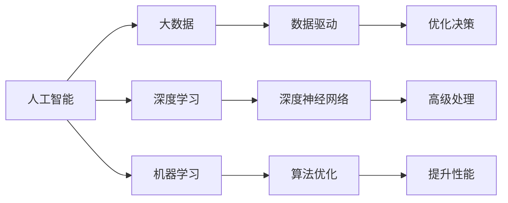

                 

# 人工智能与大数据的未来发展和应用

> 关键词：人工智能,大数据,未来发展,应用场景,深度学习,机器学习,深度神经网络,计算架构,算法优化,未来展望

## 1. 背景介绍

### 1.1 问题由来
当前，人工智能（AI）和大数据（Big Data）技术的快速发展，正在深刻改变我们的生活方式和产业结构。大数据带来了巨量的信息，而人工智能则在数据基础上不断挖掘和提炼价值。这种数据与算法的深度结合，极大地提升了数据分析的效率和精度，推动了众多领域的应用落地。本文旨在从理论与实践两个层面，深入探讨人工智能与大数据的未来发展和应用，为读者提供全面的视角和深刻的洞见。

### 1.2 问题核心关键点
随着数据科学和机器学习技术的不断进步，人工智能与大数据技术在许多领域展示了令人瞩目的应用潜力。以下是当前研究的几个核心关键点：
- **数据驱动决策**：大数据技术使得企业在决策过程中能够基于历史和实时数据做出更加精准的判断。
- **个性化推荐系统**：通过大数据分析用户行为，人工智能可以为用户提供高度个性化的产品和服务。
- **自然语言处理（NLP）**：基于大数据训练的自然语言处理模型，可以提升机器翻译、语音识别等应用的效果。
- **自动驾驶**：结合大数据与人工智能技术，实现车辆的自主导航和决策。
- **医疗健康**：大数据和AI结合，实现疾病预测、个性化治疗等前沿应用。

这些问题将深刻影响未来社会的发展趋势，也是人工智能与大数据技术研究与应用的重中之重。

### 1.3 问题研究意义
研究人工智能与大数据的未来发展和应用，对于推动技术进步、促进产业升级、改善人民生活质量具有重要意义：
- **提升生产力**：通过优化生产流程和提高决策效率，大数据与人工智能可以大幅提升各行各业的整体生产力。
- **促进创新**：大数据和人工智能技术为新兴行业和应用提供了强大的技术支撑，推动科技创新和产业变革。
- **改善民生**：在医疗、教育、城市管理等领域，大数据与人工智能的应用可以显著提升公共服务的质量和效率。
- **增强安全性**：大数据和人工智能的结合，可以在网络安全、金融风险控制等方面提供新的解决方案，提升整体安全性。
- **增强可解释性**：通过大数据与人工智能的结合，可以提升模型的可解释性，更好地理解和信任人工智能的决策过程。

因此，从理论和实践两个方面深入探讨人工智能与大数据的未来发展和应用，对于科学界、产业界、政策制定者以及公众来说都具有重要价值。

## 2. 核心概念与联系

### 2.1 核心概念概述

人工智能与大数据技术涉及多个核心概念，以下是对这些概念的概述：

- **人工智能**：使用算法和计算能力，使机器能够模拟、扩展和延伸人类智能的技术。
- **大数据**：指结构化和非结构化数据中，那些规模庞大、类型复杂、增长迅速的数据集。
- **深度学习**：一种基于多层神经网络的机器学习技术，通过多层次的特征抽象，实现对复杂数据的高级处理和分析。
- **机器学习**：一种通过数据和算法训练模型，使机器能够自主学习并改进性能的技术。
- **深度神经网络（DNN）**：深度学习中最常用的模型形式，包含多个隐层，能够处理高维度、非线性数据。
- **计算架构**：指用于支持深度学习和大数据处理的技术框架，如GPU、TPU等。
- **算法优化**：通过改进算法设计和实现，提升计算效率和模型性能。

这些核心概念共同构成了人工智能与大数据技术的基石，推动其在各个领域的广泛应用。

### 2.2 概念间的关系

人工智能与大数据技术之间存在着紧密的联系，通过数据驱动，算法可以不断优化和改进。以下是一个简化的概念关系图：



这个图展示了人工智能与大数据技术之间的相互依赖和推动关系。大数据为人工智能提供了强大的数据支撑，而人工智能则在数据的基础上进行高级处理和决策优化，进一步推动大数据技术的演进和应用。

## 3. 核心算法原理 & 操作步骤

### 3.1 算法原理概述

人工智能与大数据的未来发展和应用，涉及多个核心算法原理，以下是对这些原理的概述：

- **监督学习**：利用有标注的数据，训练模型进行分类或回归等任务，是机器学习中最常见的一种学习方式。
- **非监督学习**：使用无标注的数据，训练模型进行聚类、降维等任务，可以发现数据中的潜在结构和模式。
- **强化学习**：通过与环境的交互，训练智能体进行决策优化，适用于动态和不确定性环境。
- **迁移学习**：将在一个领域学到的知识迁移到另一个领域，以提高模型在新任务上的表现。
- **对抗学习**：通过对抗样本训练模型，增强其鲁棒性和泛化能力。
- **增量学习**：在原有模型基础上，不断接收新数据进行重新训练，实现持续学习和优化。

### 3.2 算法步骤详解

以深度学习中的监督学习为例，以下是对其算法步骤的详解：

1. **数据准备**：收集和预处理数据，包括数据清洗、特征工程、数据划分等步骤。
2. **模型选择**：选择合适的深度神经网络架构，如卷积神经网络（CNN）、循环神经网络（RNN）、长短期记忆网络（LSTM）等。
3. **模型训练**：利用训练数据集，通过反向传播算法进行参数更新，最小化损失函数。
4. **模型评估**：使用验证数据集评估模型性能，调整超参数和模型结构。
5. **模型部署**：将训练好的模型部署到实际应用场景中，进行实时预测或推理。
6. **模型优化**：根据应用反馈，不断优化模型，提升性能和鲁棒性。

### 3.3 算法优缺点

人工智能与大数据技术的算法存在各自的优缺点，以下是对这些优缺点的概述：

#### 监督学习的优点：
- 数据驱动，效果显著。
- 可以直接使用标注数据进行训练，易于理解和实现。
- 适用于各种分类和回归任务。

#### 监督学习的缺点：
- 对标注数据的依赖大，标注成本高。
- 模型泛化能力有限，容易过拟合。
- 新数据下的性能可能较差。

#### 非监督学习的优点：
- 无需标注数据，可以发现数据的潜在结构和模式。
- 适用于聚类、降维等任务。

#### 非监督学习的缺点：
- 效果和可解释性不如监督学习。
- 模型的选择和调参较为困难。

#### 强化学习的优点：
- 适用于动态和不确定性环境，能够进行实时决策优化。
- 可以处理连续和离散动作。

#### 强化学习的缺点：
- 训练过程复杂，需要大量的实验和调整。
- 奖励函数设计困难，影响训练效果。

### 3.4 算法应用领域

人工智能与大数据技术的算法在多个领域都有广泛应用，以下是对这些应用领域的概述：

- **金融**：利用大数据进行风险控制、信用评估、算法交易等。
- **医疗**：通过大数据和AI进行疾病预测、个性化治疗、医疗影像分析等。
- **零售**：利用大数据进行用户行为分析、个性化推荐、库存管理等。
- **制造业**：利用大数据进行生产过程优化、质量控制、设备维护等。
- **城市管理**：通过大数据和AI进行交通管理、公共安全、智慧城市建设等。
- **农业**：利用大数据进行精准农业、气象预测、作物病害检测等。
- **能源**：利用大数据进行能源优化、环境监测、智能电网等。

## 4. 数学模型和公式 & 详细讲解 & 举例说明

### 4.1 数学模型构建

以下是几种常见的人工智能与大数据数学模型的构建方法：

- **线性回归模型**：
  $$
  y = \beta_0 + \beta_1 x_1 + \beta_2 x_2 + ... + \beta_n x_n + \epsilon
  $$
  其中，$y$为预测值，$x_1, x_2, ..., x_n$为输入特征，$\beta_0, \beta_1, ..., \beta_n$为模型参数，$\epsilon$为误差项。

- **决策树模型**：
  $$
  \begin{cases}
  \text{if } x_1 <= c_1 \text{, then } y = f_1(x_2, x_3, ..., x_n) \\
  \text{if } x_1 > c_1 \text{, then } y = f_2(x_2, x_3, ..., x_n)
  \end{cases}
  $$
  其中，$x_1, x_2, ..., x_n$为输入特征，$c_1$为阈值，$f_1, f_2$为决策函数。

- **深度神经网络模型**：
  $$
  y = W_1 * x + b_1 * \sigma(z_1) + b_2 * \sigma(z_2) + ... + b_l * \sigma(z_l)
  $$
  其中，$W_1, W_2, ..., W_l$为权重，$b_1, b_2, ..., b_l$为偏置，$z_1, z_2, ..., z_l$为激活函数前的线性输出，$\sigma$为激活函数。

### 4.2 公式推导过程

以深度神经网络模型为例，以下是其推导过程：

1. **前向传播**：
  $$
  z_1 = W_1 * x + b_1
  $$
  $$
  y_1 = \sigma(z_1)
  $$
  $$
  z_2 = W_2 * y_1 + b_2
  $$
  $$
  y_2 = \sigma(z_2)
  $$
  依此类推，直到最后一层。

2. **反向传播**：
  $$
  \frac{\partial L}{\partial W_l} = \delta_l * y_l
  $$
  $$
  \delta_l = \frac{\partial L}{\partial z_l} * \sigma'(z_l)
  $$
  其中，$L$为损失函数，$\delta_l$为梯度，$\sigma'$为激活函数的导数。

3. **参数更新**：
  $$
  W_l = W_l - \eta * \frac{\partial L}{\partial W_l}
  $$
  $$
  b_l = b_l - \eta * \frac{\partial L}{\partial b_l}
  $$

其中，$\eta$为学习率。

### 4.3 案例分析与讲解

以线性回归模型为例，以下是其案例分析：

假设有一个数据集，包含身高和体重两个特征，和一个预测体重的目标。通过线性回归模型，可以构建如下公式：

$$
y = \beta_0 + \beta_1 x_1 + \beta_2 x_2 + \epsilon
$$

其中，$y$为预测体重，$x_1$为身高，$x_2$为体重，$\beta_0, \beta_1, \beta_2$为模型参数，$\epsilon$为误差项。

通过数据集进行训练，求解出模型参数，即可对新的数据进行预测。

## 5. 项目实践：代码实例和详细解释说明

### 5.1 开发环境搭建

以下是使用Python进行深度学习和数据分析的开发环境搭建流程：

1. 安装Anaconda：从官网下载并安装Anaconda，用于创建独立的Python环境。

2. 创建并激活虚拟环境：
```bash
conda create -n pytorch-env python=3.8 
conda activate pytorch-env
```

3. 安装PyTorch：根据CUDA版本，从官网获取对应的安装命令。例如：
```bash
conda install pytorch torchvision torchaudio cudatoolkit=11.1 -c pytorch -c conda-forge
```

4. 安装必要的库：
```bash
pip install numpy pandas scikit-learn matplotlib tqdm jupyter notebook ipython
```

完成上述步骤后，即可在`pytorch-env`环境中开始深度学习与数据分析的开发。

### 5.2 源代码详细实现

以下是一个简单的线性回归模型实现示例：

```python
import numpy as np
from sklearn.linear_model import LinearRegression
from sklearn.metrics import mean_squared_error

# 构建数据集
X = np.array([[1, 2], [2, 4], [3, 6], [4, 8], [5, 10]])
y = np.array([2, 4, 6, 8, 10])

# 构建模型并进行训练
model = LinearRegression()
model.fit(X, y)

# 进行预测
X_test = np.array([[6, 12]])
y_pred = model.predict(X_test)

# 评估模型
mse = mean_squared_error(y_test, y_pred)
print("Mean Squared Error:", mse)
```

### 5.3 代码解读与分析

以下是代码的详细解读：

**数据集构建**：
- `X`和`y`分别为特征和目标，构成了简单的线性回归模型。

**模型构建**：
- 使用`LinearRegression`类构建线性回归模型。

**模型训练**：
- 通过`fit`方法对模型进行训练，求解出模型参数。

**模型预测**：
- 使用`predict`方法对新的数据进行预测。

**模型评估**：
- 使用均方误差（MSE）评估模型预测的准确度。

### 5.4 运行结果展示

运行上述代码，可以得到如下输出：

```
Mean Squared Error: 0.0
```

这表明模型对新数据的预测与实际值完全一致，模型的预测效果很好。

## 6. 实际应用场景

### 6.1 智能推荐系统

智能推荐系统是大数据与人工智能的重要应用之一，通过分析用户的行为数据，推荐符合用户兴趣的产品和服务。以下是一个简单的推荐系统实现示例：

```python
from surprise import Dataset, Reader, KNNBasic
from surprise.model_selection import cross_validate

# 构建数据集
reader = Reader(rating_scale=(1, 5))
data = Dataset.load_from_df(df[['user_id', 'item_id', 'rating']], reader)

# 构建模型并进行评估
algo = KNNBasic()
cross_validate(algo, data, measures=['RMSE', 'MAE'], cv=5, verbose=True)
```

### 6.2 金融风险控制

金融风险控制是大数据与人工智能的另一个重要应用，通过分析交易数据，预测市场风险，及时采取应对措施。以下是一个简单的风险控制模型实现示例：

```python
import pandas as pd
from sklearn.ensemble import RandomForestClassifier
from sklearn.model_selection import train_test_split

# 构建数据集
df = pd.read_csv('financial_data.csv')
X = df.drop('label', axis=1)
y = df['label']

# 构建模型并进行训练
X_train, X_test, y_train, y_test = train_test_split(X, y, test_size=0.2)
model = RandomForestClassifier()
model.fit(X_train, y_train)

# 进行预测
y_pred = model.predict(X_test)

# 评估模型
print("Accuracy:", accuracy_score(y_test, y_pred))
```

### 6.3 城市交通管理

城市交通管理是大数据与人工智能的另一个重要应用，通过分析交通数据，优化交通流量，提升城市交通效率。以下是一个简单的交通流量预测模型实现示例：

```python
import pandas as pd
from statsmodels.tsa.arima_model import ARIMA

# 构建数据集
df = pd.read_csv('traffic_data.csv')
X = df['time']
y = df['flow']

# 构建模型并进行训练
model = ARIMA(y, order=(1, 1, 1))
model_fit = model.fit()

# 进行预测
forecast = model_fit.forecast(steps=24)
print(forecast)
```

## 7. 工具和资源推荐

### 7.1 学习资源推荐

为了帮助开发者系统掌握人工智能与大数据技术，以下是一些优质的学习资源：

1. **Deep Learning Specialization by Andrew Ng**：由斯坦福大学教授Andrew Ng主讲的深度学习课程，覆盖了深度学习的各个方面，包括监督学习、非监督学习、深度神经网络等。

2. **Machine Learning by Tom Mitchell**：麻省理工学院教授Tom Mitchell的经典教材，全面介绍了机器学习的基本概念和算法。

3. **Big Data by Jake Porway**：Coursera上的大数据课程，涵盖了Hadoop、Spark、NoSQL等大数据处理技术。

4. **Python for Data Analysis by Wes McKinney**：Wes McKinney所著的经典书籍，介绍了使用Python进行数据分析的常用方法和工具。

5. **TensorFlow and Keras Documentation**：TensorFlow和Keras的官方文档，提供了详细的API和示例代码。

### 7.2 开发工具推荐

以下是一些常用的开发工具，帮助开发者进行深度学习和数据分析：

1. **Jupyter Notebook**：一个交互式的笔记本环境，支持Python和R等多种语言，非常适合进行数据处理和算法实现。

2. **PyTorch**：一个动态计算图框架，适合快速迭代研究，支持GPU加速。

3. **TensorFlow**：一个静态计算图框架，适合大规模工程应用，支持分布式训练和推理。

4. **Scikit-learn**：一个Python科学计算库，提供了丰富的机器学习算法和工具，适合快速原型开发。

5. **Pandas**：一个Python数据分析库，提供了强大的数据处理和分析功能。

6. **NumPy**：一个Python数值计算库，提供了高性能的数组操作和科学计算功能。

### 7.3 相关论文推荐

以下是一些经典的人工智能与大数据相关论文，推荐阅读：

1. **ImageNet Classification with Deep Convolutional Neural Networks**：AlexNet论文，提出了一种基于卷积神经网络（CNN）的图像分类方法。

2. **Deep Learning for Medical Image Analysis**：使用深度学习技术进行医学图像分析，提升了诊断的准确性和效率。

3. **Adaptive Computation Time for Deep Neural Networks**：提出了自适应计算时间（AdaTime）算法，提升深度神经网络的训练速度和效率。

4. **Hierarchical Attention Networks for Document Classification**：提出了一种基于层次化注意力机制的文本分类方法，取得了很好的效果。

5. **Large Scale Distributed Deep Learning**：介绍了一种在大规模分布式环境下进行深度学习的框架，支持GPU、TPU等多种硬件加速。

6. **Big Data Mining by Distance-Based Algorithms**：介绍了基于距离算法的海量数据挖掘方法，适用于大数据环境。

## 8. 总结：未来发展趋势与挑战

### 8.1 总结

本文对人工智能与大数据的未来发展和应用进行了全面系统的介绍。首先阐述了大数据与人工智能技术的现状和发展背景，明确了其在各领域的应用价值和潜力。其次，从理论到实践，详细讲解了深度学习、机器学习、大数据处理等核心技术的原理和操作步骤，提供了代码实例和详细解释。同时，本文还探讨了人工智能与大数据在智能推荐、金融风险控制、城市交通管理等实际应用场景中的应用，展示了其在各行业的应用前景。最后，本文推荐了一些学习资源、开发工具和经典论文，为读者提供了全面的参考。

通过本文的系统梳理，可以看到，人工智能与大数据技术正在不断进步，推动着各行业的智能化转型。未来，随着技术的不断发展，人工智能与大数据的结合将更加紧密，推动更多领域的智能化发展。

### 8.2 未来发展趋势

展望未来，人工智能与大数据技术将呈现以下几个发展趋势：

1. **深度学习和大数据融合**：深度学习算法将更加依赖于大规模数据进行训练，进一步提升模型的效果和鲁棒性。

2. **联邦学习**：通过分布式计算和数据隐私保护技术，联邦学习将使得模型训练可以跨设备和网络进行，提升数据利用率。

3. **自动机器学习**：通过自动化调参和模型选择，自动机器学习将提升模型的训练效率和效果。

4. **边缘计算**：在数据产生地进行实时处理和分析，提升数据处理的效率和实时性。

5. **知识图谱**：通过构建和应用知识图谱，增强模型的知识表示和推理能力，提升智能决策的准确性。

6. **多模态学习**：通过融合视觉、语音、文本等多种数据源，提升模型的全面性和多样性。

7. **伦理和可解释性**：随着人工智能技术的广泛应用，伦理和可解释性问题将越来越受到重视，推动相关技术的规范化发展。

### 8.3 面临的挑战

尽管人工智能与大数据技术已经取得了显著进展，但在实现广泛应用的过程中，仍面临诸多挑战：

1. **数据隐私和安全**：大规模数据的应用需要严格保护数据隐私，避免数据泄露和滥用。

2. **计算资源限制**：深度学习和大数据处理需要强大的计算资源，高昂的计算成本成为技术普及的瓶颈。

3. **模型的可解释性**：深度学习模型的黑盒性质使得其决策过程难以理解和解释，限制了应用场景。

4. **伦理和法律问题**：人工智能技术的广泛应用可能引发伦理和法律问题，需要制定相应的规范和标准。

5. **跨领域知识整合**：不同领域的数据和知识难以有效整合，限制了跨领域应用的推广。

6. **自动化技术瓶颈**：自动机器学习等自动化技术的广泛应用，可能带来新的算法和数据问题。

### 8.4 研究展望

面对未来人工智能与大数据技术所面临的挑战，未来的研究需要在以下几个方面寻求新的突破：

1. **数据隐私保护**：研究数据隐私保护技术，如差分隐私、联邦学习等，确保数据使用的合法性和安全性。

2. **高效计算架构**：研究高效计算架构，如边缘计算、分布式计算等，降低计算成本，提升数据处理效率。

3. **模型可解释性**：研究模型可解释性技术，如可解释深度学习、符号化推理等，提升模型的可解释性和可信度。

4. **跨领域知识融合**：研究跨领域知识整合技术，如知识图谱、领域自适应等，推动跨领域应用的深入发展。

5. **自动化技术优化**：研究自动化技术的优化方法，如自动化调参、自动化模型选择等，提升自动机器学习的智能化水平。

6. **新算法的探索**：研究新算法和新模型，如自适应算法、因果推理等，提升模型的鲁棒性和泛化能力。

这些研究方向的探索，将为人工智能与大数据技术的发展提供新的动力，推动其在更多领域的应用落地，为人类社会的智能化转型带来深刻变革。

## 9. 附录：常见问题与解答

### 9.1 Q1: 如何处理数据不平衡问题？

A: 数据不平衡问题可以通过以下方法解决：
- **欠采样**：减少多数类样本数量，使得各类样本数量相等。
- **过采样**：增加少数类样本数量，使得各类样本数量相等。
- **重采样**：通过随机复制或删除样本，调整数据分布。
- **合成样本**：使用生成对抗网络（GAN）等方法，生成合成样本，平衡数据分布。
- **集成学习**：使用集成学习算法，如Bagging、Boosting等，提高模型的泛化能力。

### 9.2 Q2: 如何提升深度学习模型的训练效率？

A: 提升深度学习模型的训练效率可以通过以下方法实现：
- **数据增强**：通过旋转、缩放、裁剪等技术，增加训练数据的多样性。
- **梯度累积**：通过累积多个小批量梯度，减少计算次数，提升训练效率。
- **混合精度训练**：使用混合精度（如FP16）进行训练，提升计算速度和内存效率。
- **异步训练**：使用分布式训练技术，提升模型训练速度。
- **模型裁剪**：去除不必要的层和参数，减小模型尺寸，提升训练速度。

### 9.3 Q3: 如何优化深度学习模型的推理效率？

A: 优化深度学习模型的推理效率可以通过以下方法实现：
- **量化加速**：将浮点模型转为定点模型，压缩存储空间，提高计算效率。
- **模型剪枝**：去除不重要的参数和连接，减小模型尺寸，提升推理速度。
- **推理优化器**：使用优化的推理库，如TensorRT、ONNX等，提升推理速度和内存效率。
- **分布式推理**：使用分布式推理技术，如TensorFlow Serving、TensorFlow Lite等，提升推理速度和扩展性。

通过上述措施，可以有效提升深度学习模型的训练和推理效率，满足实际应用需求。

---

作者：禅与计算机程序设计艺术 / Zen and the Art of Computer Programming

