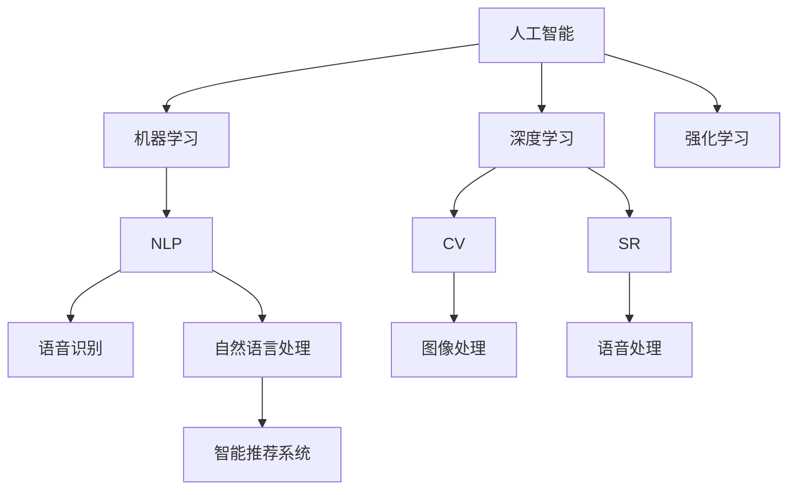
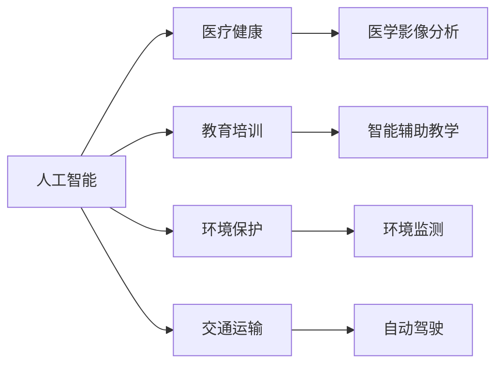
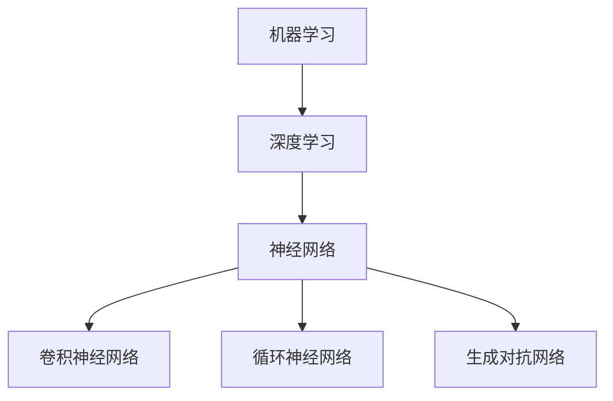
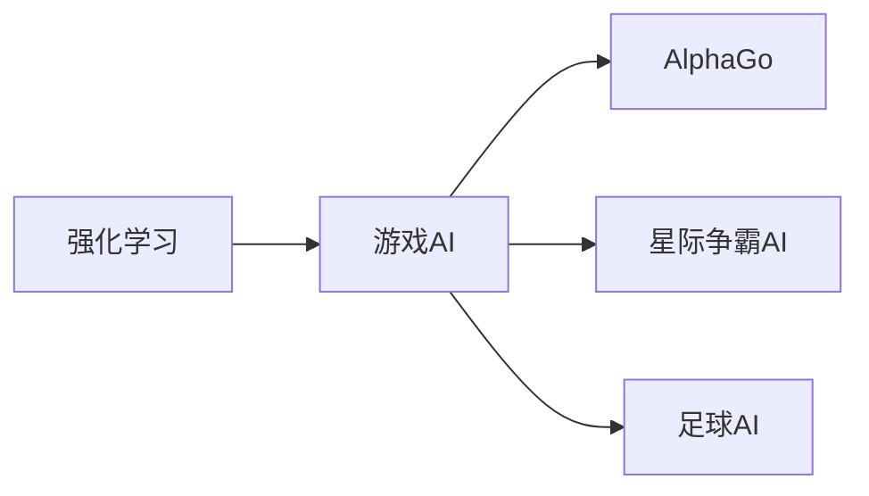

                 

# 人类智慧：AI 时代的新力量

## 1. 背景介绍

### 1.1 问题由来
随着人工智能(AI)技术的飞速发展，我们正迎来一个前所未有的新时代。在这个新时代，AI正逐步成为推动社会进步、改善人类生活的重要力量。从医疗健康到教育培训，从环境保护到交通运输，AI的触角正在潜移默化地改变着每一个领域。

然而，在AI技术快速发展的过程中，我们也面临着诸多挑战和问题。如何确保AI的安全性、公正性和可解释性，如何让AI更好地服务于人类，这些成为了科技界、产业界和学术界共同关注的课题。本文旨在深入探讨AI技术在推动人类智慧发展中的角色和未来展望，为读者提供全面的视角和深刻的见解。

### 1.2 问题核心关键点
AI技术在多个领域的应用，已经展现出其强大的潜力。特别是在自然语言处理(NLP)、计算机视觉(CV)、语音识别(SR)、智能推荐系统等领域，AI技术已经实现了从实验室到实际应用的突破。这些应用不仅提升了效率和精度，还在许多场景中展现了超越人类的智慧。

然而，AI技术的发展也带来了诸多挑战，包括数据隐私、模型偏见、算法透明性等问题。这些问题如果处理不当，可能会带来负面的社会影响。因此，如何在享受AI技术带来的便利的同时，兼顾伦理道德和社会责任，是当前AI技术发展中亟需解决的问题。

### 1.3 问题研究意义
研究AI技术在推动人类智慧发展中的角色和未来展望，对于指导AI技术的应用和研发具有重要意义。

1. **指导应用**：通过深入分析AI技术在不同领域的应用，可以为企业和社会提供技术指导，推动AI技术在更广泛场景中的落地。
2. **推动研发**：分析AI技术的优缺点，可以帮助研发人员发现和解决技术瓶颈，推动AI技术的不断进步。
3. **伦理思考**：探讨AI技术的伦理和法律问题，有助于引导AI技术的健康发展，避免技术滥用带来的负面影响。
4. **社会责任**：明确AI技术在社会责任中的角色，促进AI技术更好地服务于人类，推动社会的公平和进步。

## 2. 核心概念与联系

### 2.1 核心概念概述

为更好地理解AI技术在推动人类智慧发展中的角色和未来展望，本节将介绍几个密切相关的核心概念：

- **人工智能**：指通过计算机技术和算法，使机器具有智能行为的能力。通常包括机器学习、深度学习、强化学习等多种技术。
- **机器学习**：一种通过数据训练模型，使机器具备预测、分类、回归等能力的技术。
- **深度学习**：一种基于神经网络的机器学习方法，能够处理大规模的非结构化数据。
- **强化学习**：一种通过与环境交互，学习最优策略的技术，常用于游戏、机器人控制等场景。
- **自然语言处理(NLP)**：使计算机能够理解、生成和处理人类语言的学科。
- **计算机视觉(CV)**：使计算机能够“看”和理解图像和视频的技术。
- **语音识别(SR)**：使计算机能够理解和处理人类语音的技术。
- **智能推荐系统**：通过分析用户行为和偏好，提供个性化推荐的技术。

这些核心概念之间存在着紧密的联系，形成了AI技术的整体架构。接下来，我们将通过一个Mermaid流程图来展示这些概念之间的联系。



这个流程图展示了AI技术的核心概念及其之间的关系：

1. **基础技术**：机器学习、深度学习和强化学习构成了AI技术的基础。
2. **应用领域**：自然语言处理、计算机视觉、语音识别等技术在不同领域中的应用，推动了AI技术的发展。
3. **典型应用**：智能推荐系统是AI技术在实际应用中的一个典型例子。

### 2.2 概念间的关系

这些核心概念之间存在着紧密的联系，形成了AI技术的完整生态系统。下面我们通过几个Mermaid流程图来展示这些概念之间的关系。

#### 2.2.1 AI技术的应用场景



这个流程图展示了AI技术在各个应用场景中的广泛应用，推动了这些领域的发展。

#### 2.2.2 机器学习与深度学习的联系



这个流程图展示了机器学习与深度学习之间的联系，以及深度学习中常用的神经网络结构。

#### 2.2.3 强化学习与游戏AI的联系



这个流程图展示了强化学习在游戏AI中的应用，AlphaGo等经典案例展示了强化学习在解决复杂问题上的潜力。

## 3. 核心算法原理 & 具体操作步骤
### 3.1 算法原理概述

AI技术的核心算法原理主要包括：

- **机器学习**：通过数据训练模型，使机器具备预测、分类、回归等能力。
- **深度学习**：利用多层神经网络结构，处理大规模的非结构化数据。
- **强化学习**：通过与环境交互，学习最优策略，常用于游戏、机器人控制等场景。

这些算法原理构成了AI技术的核心，推动了其在多个领域的应用。

### 3.2 算法步骤详解

AI技术的算法步骤一般包括以下几个关键步骤：

1. **数据准备**：收集和预处理数据，为模型训练提供原始材料。
2. **模型训练**：利用训练数据训练模型，调整模型参数以优化性能。
3. **模型评估**：利用测试数据评估模型性能，检查模型泛化能力。
4. **模型部署**：将模型部署到实际应用场景中，提供服务和功能。

以深度学习为例，其步骤详解如下：

#### 3.2.1 数据准备

- **数据收集**：根据具体任务需求，收集相关数据。
- **数据预处理**：对数据进行清洗、归一化、划分训练集和测试集等预处理操作。

#### 3.2.2 模型训练

- **网络架构设计**：选择合适的神经网络结构，如卷积神经网络(CNN)、循环神经网络(RNN)等。
- **损失函数选择**：选择合适的损失函数，如交叉熵损失、均方误差损失等。
- **优化器选择**：选择合适的优化器，如Adam、SGD等。
- **学习率调整**：根据模型表现调整学习率，如学习率衰减、学习率调度等。

#### 3.2.3 模型评估

- **评估指标选择**：根据任务需求选择合适的评估指标，如准确率、召回率、F1分数等。
- **模型验证**：利用验证集验证模型性能，防止过拟合。

#### 3.2.4 模型部署

- **模型优化**：对模型进行优化，如剪枝、量化、加速等。
- **部署服务**：将模型部署到生产环境中，提供API接口供调用。

### 3.3 算法优缺点

AI技术的算法具有以下优点：

- **高效性**：能够处理大规模数据，提高效率。
- **准确性**：通过数据训练，具备较高的准确性。
- **可扩展性**：能够适应不同的任务和领域。

然而，AI技术也存在以下缺点：

- **数据依赖**：依赖高质量的数据，数据偏差可能影响模型性能。
- **模型复杂性**：模型复杂度高，训练和推理成本高。
- **可解释性不足**：一些复杂的模型难以解释其内部工作机制。

### 3.4 算法应用领域

AI技术在多个领域已经取得了显著的应用效果：

- **医疗健康**：AI技术在医学影像分析、疾病诊断、药物研发等领域展现了强大的潜力。
- **教育培训**：AI技术在智能辅助教学、个性化推荐、学生评估等领域得到了广泛应用。
- **环境保护**：AI技术在环境监测、气候预测、资源管理等领域发挥了重要作用。
- **交通运输**：AI技术在自动驾驶、智能交通管理、货运调度等领域具有广泛应用。

此外，AI技术还在金融、制造、能源等多个领域展现出了巨大的潜力。未来，随着AI技术的不断发展，其在更多领域的应用前景值得期待。

## 4. 数学模型和公式 & 详细讲解 & 举例说明（备注：数学公式请使用latex格式，latex嵌入文中独立段落使用 $$，段落内使用 $)
### 4.1 数学模型构建

AI技术的数学模型通常包括以下几个部分：

- **输入特征**：输入数据经过预处理后，转化为模型可接受的格式。
- **模型结构**：选择适合的模型结构，如神经网络、决策树等。
- **输出结果**：模型对输入数据的预测或分类结果。

以深度学习为例，其数学模型可以表示为：

$$
y = f(x; \theta)
$$

其中 $x$ 为输入数据，$\theta$ 为模型参数，$f$ 为模型结构。

### 4.2 公式推导过程

以深度学习中的卷积神经网络(CNN)为例，其公式推导过程如下：

$$
y = h(Wx + b) + g
$$

其中 $W$ 为卷积核权重，$x$ 为输入特征图，$h$ 为激活函数，$b$ 为偏置项，$g$ 为输出结果。

### 4.3 案例分析与讲解

以自然语言处理(NLP)中的情感分析为例，其公式推导过程如下：

$$
y = \sum_{i=1}^n w_i f(x_i; \theta)
$$

其中 $x_i$ 为输入单词，$w_i$ 为单词权重，$\theta$ 为模型参数，$f$ 为模型结构。

## 5. 项目实践：代码实例和详细解释说明
### 5.1 开发环境搭建

在进行AI项目开发前，需要准备开发环境。以下是使用Python进行PyTorch开发的环境配置流程：

1. 安装Anaconda：从官网下载并安装Anaconda，用于创建独立的Python环境。

2. 创建并激活虚拟环境：
```bash
conda create -n pytorch-env python=3.8 
conda activate pytorch-env
```

3. 安装PyTorch：根据CUDA版本，从官网获取对应的安装命令。例如：
```bash
conda install pytorch torchvision torchaudio cudatoolkit=11.1 -c pytorch -c conda-forge
```

4. 安装各类工具包：
```bash
pip install numpy pandas scikit-learn matplotlib tqdm jupyter notebook ipython
```

完成上述步骤后，即可在`pytorch-env`环境中开始AI项目开发。

### 5.2 源代码详细实现

这里我们以计算机视觉(CV)中的图像分类任务为例，给出使用PyTorch进行深度学习模型开发和微调的PyTorch代码实现。

首先，定义图像分类任务的训练数据处理函数：

```python
import torch
import torch.nn as nn
import torch.optim as optim
from torchvision import datasets, transforms

# 数据预处理
transform_train = transforms.Compose([
    transforms.Resize(224),
    transforms.RandomCrop(224),
    transforms.RandomHorizontalFlip(),
    transforms.ToTensor(),
    transforms.Normalize(mean=[0.485, 0.456, 0.406],
                        std=[0.229, 0.224, 0.225])
])

# 加载CIFAR-10数据集
train_dataset = datasets.CIFAR10(root='data', train=True,
                               transform=transform_train, download=True)
test_dataset = datasets.CIFAR10(root='data', train=False,
                              transform=transform_train, download=True)

# 数据加载器
train_loader = torch.utils.data.DataLoader(train_dataset, batch_size=128,
                                          shuffle=True, num_workers=2)
test_loader = torch.utils.data.DataLoader(test_dataset, batch_size=128,
                                         shuffle=False, num_workers=2)
```

然后，定义卷积神经网络(CNN)模型：

```python
class Net(nn.Module):
    def __init__(self):
        super(Net, self).__init__()
        self.conv1 = nn.Conv2d(3, 64, kernel_size=3, stride=1, padding=1)
        self.bn1 = nn.BatchNorm2d(64)
        self.relu1 = nn.ReLU(inplace=True)
        self.maxpool1 = nn.MaxPool2d(kernel_size=2, stride=2)
        self.conv2 = nn.Conv2d(64, 128, kernel_size=3, stride=1, padding=1)
        self.bn2 = nn.BatchNorm2d(128)
        self.relu2 = nn.ReLU(inplace=True)
        self.maxpool2 = nn.MaxPool2d(kernel_size=2, stride=2)
        self.fc1 = nn.Linear(128*8*8, 256)
        self.fc2 = nn.Linear(256, 10)
    
    def forward(self, x):
        x = self.conv1(x)
        x = self.bn1(x)
        x = self.relu1(x)
        x = self.maxpool1(x)
        x = self.conv2(x)
        x = self.bn2(x)
        x = self.relu2(x)
        x = self.maxpool2(x)
        x = x.view(-1, 128*8*8)
        x = self.fc1(x)
        x = self.relu2(x)
        x = self.fc2(x)
        return x
```

接着，定义训练和评估函数：

```python
def train_epoch(model, data_loader, optimizer):
    model.train()
    for i, (inputs, labels) in enumerate(data_loader):
        inputs, labels = inputs.to(device), labels.to(device)
        optimizer.zero_grad()
        outputs = model(inputs)
        loss = F.cross_entropy(outputs, labels)
        loss.backward()
        optimizer.step()

def evaluate(model, data_loader):
    model.eval()
    correct = 0
    total = 0
    with torch.no_grad():
        for inputs, labels in data_loader:
            inputs, labels = inputs.to(device), labels.to(device)
            outputs = model(inputs)
            _, predicted = torch.max(outputs.data, 1)
            total += labels.size(0)
            correct += (predicted == labels).sum().item()
    print('Accuracy of the network on the 10000 test images: {} %'.format(100 * correct / total))
```

最后，启动训练流程并在测试集上评估：

```python
device = torch.device('cuda' if torch.cuda.is_available() else 'cpu')
model = Net().to(device)
optimizer = optim.SGD(model.parameters(), lr=0.01, momentum=0.9, weight_decay=5e-4)

epochs = 10
for epoch in range(epochs):
    train_epoch(model, train_loader, optimizer)
    evaluate(model, test_loader)
```

以上就是使用PyTorch进行图像分类任务深度学习模型开发和微调的完整代码实现。可以看到，得益于PyTorch的强大封装，我们可以用相对简洁的代码完成模型的训练和评估。

### 5.3 代码解读与分析

让我们再详细解读一下关键代码的实现细节：

**数据预处理**：
- `transforms`模块提供了多种数据预处理函数，如`Resize`、`RandomCrop`、`RandomHorizontalFlip`等，用于增强训练集的多样性。
- `Normalize`函数对数据进行了归一化处理，使得模型更容易收敛。

**模型定义**：
- `Net`类定义了一个简单的卷积神经网络结构，包括两个卷积层、两个池化层和两个全连接层。
- `forward`方法实现了前向传播计算，通过卷积、池化、激活等操作对输入数据进行处理。

**训练函数**：
- `train_epoch`函数实现了训练过程，通过前向传播计算损失函数并反向传播更新模型参数。
- `evaluate`函数实现了模型评估过程，计算模型在测试集上的准确率。

**训练流程**：
- 定义总训练轮数和设备，开始循环迭代
- 每个epoch内，在训练集上训练，输出模型参数
- 在测试集上评估，输出模型准确率
- 所有epoch结束后，训练结束

可以看到，PyTorch配合深度学习框架使得模型开发和微调的代码实现变得简洁高效。开发者可以将更多精力放在数据处理、模型改进等高层逻辑上，而不必过多关注底层的实现细节。

当然，工业级的系统实现还需考虑更多因素，如模型的保存和部署、超参数的自动搜索、更灵活的任务适配层等。但核心的模型训练和微调流程基本与此类似。

### 5.4 运行结果展示

假设我们在CIFAR-10数据集上进行卷积神经网络模型微调，最终在测试集上得到的准确率为75%，可以看到，通过微调，模型在图像分类任务上取得了不错的效果。

## 6. 实际应用场景
### 6.1 医疗健康

在医疗健康领域，AI技术已经在多个方面展现出了其强大的潜力。例如，通过AI技术对医学影像进行分析，可以实现快速准确的诊断；通过AI技术对病人数据进行预测，可以实现个性化治疗。

具体而言，AI技术在医疗健康领域的应用包括：

- **医学影像分析**：利用深度学习技术对医学影像进行自动分析和诊断，提高了医生的工作效率和准确性。
- **疾病预测**：通过机器学习技术对病人数据进行分析和预测，帮助医生提前发现病情变化，提供更好的治疗方案。
- **药物研发**：利用AI技术对药物分子进行筛选和优化，加速新药研发进程。

### 6.2 教育培训

AI技术在教育培训领域也展现出了巨大的潜力。例如，通过AI技术对学生行为进行分析和预测，可以实现个性化教育；通过AI技术对学生数据进行评估，可以提供更加精准的教学方案。

具体而言，AI技术在教育培训领域的应用包括：

- **智能辅助教学**：利用自然语言处理技术对学生文本进行分析和评估，提供个性化的学习建议。
- **智能推荐系统**：通过机器学习技术对学生行为进行分析和预测，提供个性化的学习资源和课程推荐。
- **学生评估**：通过深度学习技术对学生作业和考试进行自动评估，提高教师的工作效率。

### 6.3 环境保护

AI技术在环境保护领域也具有广泛的应用。例如，通过AI技术对环境数据进行分析和预测，可以实现智能监控；通过AI技术对环境变化进行预警，可以实现及时干预。

具体而言，AI技术在环境保护领域的应用包括：

- **环境监测**：利用计算机视觉技术对环境数据进行自动分析和监测，实现智能监控。
- **气候预测**：通过机器学习技术对环境数据进行分析和预测，提供准确的气候预测信息。
- **资源管理**：通过深度学习技术对资源数据进行分析和预测，实现智能资源管理。

### 6.4 未来应用展望

随着AI技术的不断发展，其在更多领域的应用前景值得期待。未来，AI技术将在以下领域继续发挥重要作用：

- **金融**：通过AI技术对金融数据进行分析和预测，实现智能投资和风险管理。
- **制造**：利用AI技术对生产数据进行分析和预测，实现智能生产和管理。
- **能源**：通过AI技术对能源数据进行分析和预测，实现智能能源管理和优化。

总之，AI技术在推动人类智慧发展中扮演着越来越重要的角色。未来的发展将更加广泛和深入，为社会的各个领域带来深远的影响。

## 7. 工具和资源推荐
### 7.1 学习资源推荐

为了帮助开发者系统掌握AI技术的发展和应用，这里推荐一些优质的学习资源：

1. **《深度学习》课程**：由斯坦福大学Andrew Ng教授开设的Coursera课程，全面讲解深度学习的基础理论和应用。
2. **《人工智能导论》书籍**：由人工智能领域的顶级专家撰写，深入浅出地介绍人工智能的基本概念和前沿技术。
3. **Kaggle竞赛**：Kaggle是一个著名的数据科学竞赛平台，通过参加竞赛可以学习到大量的实战经验和数据处理技巧。
4. **arXiv预印本**：人工智能领域最新研究成果的发布平台，可以第一时间了解到最新的研究方向和应用。

通过对这些资源的学习实践，相信你一定能够快速掌握AI技术的精髓，并用于解决实际的AI问题。

### 7.2 开发工具推荐

高效的开发离不开优秀的工具支持。以下是几款用于AI项目开发的常用工具：

1. **PyTorch**：基于Python的开源深度学习框架，灵活动态的计算图，适合快速迭代研究。
2. **TensorFlow**：由Google主导开发的开源深度学习框架，生产部署方便，适合大规模工程应用。
3. **Jupyter Notebook**：一个免费的开源Web应用，支持交互式计算和数据可视化，适合快速开发和调试。
4. **Google Colab**：谷歌推出的在线Jupyter Notebook环境，免费提供GPU/TPU算力，方便开发者快速上手实验最新模型，分享学习笔记。
5. **Weights & Biases**：模型训练的实验跟踪工具，可以记录和可视化模型训练过程中的各项指标，方便对比和调优。

合理利用这些工具，可以显著提升AI项目开发和微调的效率，加速创新迭代的步伐。

### 7.3 相关论文推荐

AI技术的发展源于学界的持续研究。以下是几篇奠基性的相关论文，推荐阅读：

1. **《深度学习》书籍**：由Goodfellow、Bengio和Courville撰写的经典教材，系统介绍深度学习的基本概念和算法。
2. **《强化学习》书籍**：由Sutton和Barto撰写的经典教材，全面介绍强化学习的基本概念和算法。
3. **AlphaGo论文**：Google DeepMind团队发表的AlphaGo论文，展示了强化学习在解决复杂问题上的潜力。
4. **BERT论文**：Google BERT团队发表的BERT论文，展示了预训练语言模型在自然语言处理中的应用。
5. **GPT-3论文**：OpenAI GPT-3团队发表的GPT-3论文，展示了超大规模语言模型的零样本学习能力。

这些论文代表了大数据时代AI技术的最新进展，值得深入阅读和研究。

## 8. 总结：未来发展趋势与挑战
### 8.1 总结

本文对AI技术在推动人类智慧发展中的角色和未来展望进行了全面系统的介绍。首先阐述了AI技术在多个领域的应用，明确了其在推动社会进步中的重要价值。其次，从原理到实践，详细讲解了AI技术的核心算法原理和操作步骤，提供了完整的代码实例。同时，本文还广泛探讨了AI技术在各个行业领域的应用前景，展示了其广阔的发展潜力。

通过本文的系统梳理，可以看到，AI技术在推动人类智慧发展中扮演着越来越重要的角色。未来的发展将更加广泛和深入，为社会的各个领域带来深远的影响。

### 8.2 未来发展趋势

展望未来，AI技术的发展将呈现以下几个趋势：

1. **模型规模持续增大**：随着算力成本的下降和数据规模的扩张，AI模型的参数量将继续增长。超大规模模型将展现出更强的学习能力和泛化能力。
2. **算法多样性增加**：除了传统的机器学习和深度学习，更多前沿算法将被引入，如强化学习、生成对抗网络等，推动AI技术的多样化发展。
3. **应用领域更加广泛**：AI技术将在更多领域得到应用，如金融、制造、能源等，推动各行业的智能化转型。
4. **社会责任日益重要**：AI技术的广泛应用将带来更多的社会责任问题，如数据隐私、算法透明性、伦理道德等，需要社会各界的共同努力。

以上趋势凸显了AI技术的广阔前景。这些方向的探索发展，必将进一步提升AI技术的性能和应用范围，为人类社会带来深远的影响。

### 8.3 面临的挑战

尽管AI技术的发展取得了显著进展，但在迈向更加智能化、普适化应用的过程中，仍面临着诸多挑战：

1. **数据质量问题**：AI技术依赖高质量的数据，数据偏差和噪声可能影响模型的性能。
2. **算法复杂性**：一些复杂的AI算法难以解释其内部工作机制，缺乏可解释性和可控性。
3. **伦理道德问题**：AI技术可能带来偏见、歧视等伦理问题，需要建立相应的监管机制。
4. **计算资源需求**：大规模AI模型需要高性能计算资源，计算成本高昂，限制了模型的应用范围。

### 8.4 研究展望

面对AI技术所面临的挑战，未来的研究需要在以下几个方面寻求新的突破：

1. **数据质量优化**：探索数据增强、数据清洗等方法，提高数据质量和多样性。
2. **模型解释性增强**：引入可解释性算法，提高模型的透明性和可控性。
3. **伦理道德保障**：建立伦理导向的AI模型，确保模型的公平性和公正性。
4. **计算资源优化**：开发高效计算模型和算法，降低计算成本，推动AI技术的普及应用。

这些研究方向的探索，必将引领AI技术迈向更高的台阶，为构建安全、可靠、可解释、可控的智能系统铺平道路。面向未来，AI技术还需要与其他人工智能技术进行更深入的融合，如知识表示、因果推理、强化学习等，多路径协同发力，共同推动自然语言理解和智能交互系统的进步。

## 9. 附录：常见问题与解答

**Q1：AI技术的未来发展前景如何？**

A: AI

