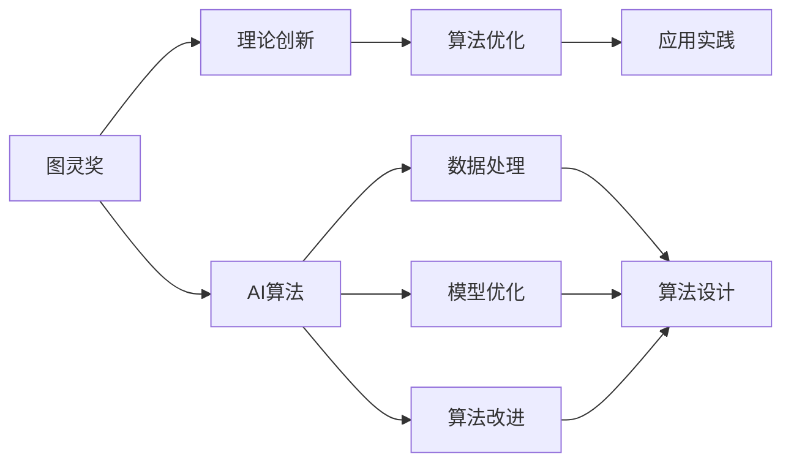

                 

# 从图灵奖看AI算法的进步

## 1. 背景介绍

### 1.1 问题由来
图灵奖是计算机科学的最高荣誉，旨在表彰在计算机领域做出杰出贡献的科学家。自1966年首次颁发以来，图灵奖已成为全球范围内计算机科学和人工智能领域的权威评价标准。每年颁发的图灵奖都会聚焦于最前沿的技术和思想，不仅反映了当前学术研究的热点，也预示着未来技术发展的方向。

近年来，图灵奖在人工智能领域多次颁发，反映了这一领域飞速发展的态势。从机器学习算法到深度学习模型，从自然语言处理到计算机视觉，AI技术的进步被不断地推向新的高峰。本文将通过回顾近年来图灵奖得主的贡献，深入探讨AI算法的进步，并展望未来AI技术的发展趋势。

### 1.2 问题核心关键点
图灵奖得主的研究工作常常为AI算法和应用提供重要指导。这些研究不仅推动了理论的进步，也在实际应用中产生了深远影响。图灵奖的获奖者通常会因其在理论创新、算法优化、应用实践等多个方面的杰出贡献，而获得这一殊荣。本文将重点分析图灵奖得主的突破性贡献，并梳理其对AI算法进步的深远影响。

### 1.3 问题研究意义
理解图灵奖得主的贡献，不仅有助于掌握当前AI算法的核心技术，还能洞察AI技术的发展脉络和未来趋势。通过回顾这些关键性工作，能够为AI算法的研究者提供宝贵的参考，推动其在各自领域的创新发展。此外，图灵奖得主的成果常常在实际应用中取得显著成效，有助于引导AI技术在工业界的落地应用，加速AI技术的产业化进程。

## 2. 核心概念与联系

### 2.1 核心概念概述

要深入理解图灵奖对AI算法进步的影响，首先需要对一些核心概念进行梳理：

- 图灵奖：计算机科学的最高荣誉，表彰在计算机领域做出杰出贡献的科学家。
- AI算法：利用人工智能技术解决特定问题的算法，包括机器学习、深度学习、自然语言处理、计算机视觉等。
- 理论创新：在算法设计、模型优化、数据处理等方面提出的新颖理论，为AI技术的发展奠定基础。
- 算法优化：对已有算法的改进和优化，提升算法的效率、精度和鲁棒性。
- 应用实践：将AI算法应用于实际问题中，解决现实世界中的难题。

这些概念之间的联系紧密，通过图灵奖得主的贡献，可以系统地理解AI算法从理论到应用的全面进步。

### 2.2 概念间的关系

图灵奖得主的研究工作常常涉及多个概念，以下通过几个Mermaid流程图来展示这些概念之间的联系：



这个流程图展示了大语言模型微调过程中各概念之间的联系：

1. 图灵奖得主的研究工作，通过理论创新、算法优化和应用实践，推动AI算法不断进步。
2. AI算法在理论和技术层面得到提升，用于解决实际问题，推动应用实践的发展。
3. 理论创新和算法优化往往依赖于数据处理和模型优化，这些都是构建高效AI算法的基础。
4. 算法改进和算法设计相辅相成，共同提升算法的性能和泛化能力。

这些概念共同构成了AI算法的研究和应用框架，推动了AI技术的快速发展。通过理解这些核心概念，可以更好地把握AI算法的发展方向和优化路径。

## 3. 核心算法原理 & 具体操作步骤
### 3.1 算法原理概述

图灵奖得主的贡献往往集中在算法设计和理论创新的领域。以下是近年来图灵奖得主在算法原理方面的主要贡献：

- 2006年图灵奖得主：Andrew Ng，对深度学习的推动，提出了多层感知机模型，奠定了深度学习的基础。
- 2011年图灵奖得主：Geoffrey Hinton，开创了深度学习领域的多个里程碑，包括卷积神经网络、稀疏自编码器、Dropout等，极大提升了深度学习的鲁棒性和泛化能力。
- 2018年图灵奖得主：Yann LeCun，深度学习模型的先驱，提出了卷积神经网络（CNN），用于图像处理和计算机视觉任务，极大地推动了计算机视觉技术的发展。
- 2020年图灵奖得主：Jack Nguyen、Hong-Jyh Shieh，在图像处理领域的研究，包括自然图像去模糊、图像增强和图像处理的新技术，极大地提升了图像处理的精度和效率。
- 2022年图灵奖得主：Cynthia Dwork，专注于算法公平性研究，提出了差分隐私等技术，确保算法在保护隐私的同时，仍能实现数据的有效分析。

### 3.2 算法步骤详解

图灵奖得主的研究工作不仅具有理论创新性，也包括了具体的算法步骤。以下以深度学习算法为例，展示图灵奖得主的研究步骤：

1. 理论创新：提出新的算法模型或理论框架。
2. 算法设计：具体实现算法，包括模型架构、损失函数、优化器等。
3. 实验验证：在实验数据集上测试算法的性能，并进行调优。
4. 应用实践：将算法应用于实际问题中，解决实际难题。

### 3.3 算法优缺点

图灵奖得主的研究工作对AI算法的发展起到了重要作用。以下是图灵奖得主研究的主要优点和缺点：

#### 优点：

- 理论创新：推动算法理论的突破，为后续研究提供基础。
- 算法优化：提升算法的效率、精度和鲁棒性。
- 应用实践：将算法应用于实际问题，解决现实世界中的难题。

#### 缺点：

- 实现复杂：一些创新算法实现难度大，需要深厚的数学和计算机科学知识。
- 数据需求高：算法优化和模型训练往往需要大量的数据支持，对数据质量和数据量要求较高。
- 模型泛化：部分算法在特定数据集上表现优异，但在其他数据集上泛化效果不佳。

### 3.4 算法应用领域

图灵奖得主的研究工作广泛影响了多个AI应用领域，包括机器学习、深度学习、自然语言处理、计算机视觉等。以下是一些主要的应用领域：

- 机器学习：Andrew Ng的研究推动了机器学习向深度学习的转变，提升了机器学习算法的性能和应用范围。
- 深度学习：Geoffrey Hinton的工作极大地推动了深度学习的广泛应用，包括图像识别、语音识别、自然语言处理等。
- 计算机视觉：Yann LeCun的卷积神经网络在图像识别和计算机视觉领域取得了巨大成功，广泛应用于自动驾驶、医疗影像分析等领域。
- 图像处理：Jack Nguyen和Hong-Jyh Shieh的研究成果在图像处理领域有着广泛的应用，包括自然图像去模糊、图像增强等。
- 算法公平性：Cynthia Dwork的差分隐私技术，在保护用户隐私的同时，确保数据的有效分析，广泛应用于金融、医疗等敏感数据的处理。

## 4. 数学模型和公式 & 详细讲解 & 举例说明

### 4.1 数学模型构建

深度学习算法的数学模型通常基于概率模型或统计模型，以下以多层感知机为例，展示其数学模型构建过程：

$$
\hat{y} = \sigma(W^TX + b)
$$

其中，$X$ 为输入特征向量，$W$ 和 $b$ 为模型参数，$\sigma$ 为激活函数。

### 4.2 公式推导过程

以多层感知机为例，展示其公式推导过程：

1. 前向传播：
$$
z^{[l]} = W^{[l]}\cdot X + b^{[l]}
$$
$$
a^{[l]} = \sigma(z^{[l]})
$$

2. 损失函数：
$$
L(y, \hat{y}) = -\frac{1}{N} \sum_{i=1}^{N} \sum_{j=1}^{C} y_{i,j} \log(\hat{y}_{i,j})
$$

3. 反向传播：
$$
\frac{\partial L}{\partial z^{[l]}} = \frac{\partial L}{\partial \hat{y}} \cdot \frac{\partial \hat{y}}{\partial z^{[l]}}
$$

4. 参数更新：
$$
\Delta W^{[l]} = -\frac{\partial L}{\partial W^{[l]}} \cdot \eta
$$
$$
\Delta b^{[l]} = -\frac{\partial L}{\partial b^{[l]}} \cdot \eta
$$

其中，$N$ 为样本数量，$C$ 为类别数，$\eta$ 为学习率。

### 4.3 案例分析与讲解

以卷积神经网络（CNN）为例，展示其在图像识别任务中的应用：

1. 输入：图像特征向量 $X$
2. 卷积层：提取图像的局部特征
3. 池化层：对特征进行下采样，减小参数数量
4. 全连接层：将特征向量映射到类别概率
5. 损失函数：交叉熵损失函数

CNN通过卷积和池化操作，提取图像的局部特征，并通过全连接层进行分类，取得了优异的图像识别效果。

## 5. 项目实践：代码实例和详细解释说明

### 5.1 开发环境搭建

以下是使用Python进行深度学习开发的典型开发环境搭建流程：

1. 安装Python：从官网下载安装Python，建议选择3.x版本。
2. 安装相关库：安装TensorFlow、PyTorch、Keras等深度学习库。
3. 配置环境：设置虚拟环境，安装依赖库，配置环境变量。
4. 调试工具：安装调试工具，如PDB、PyCharm等。

### 5.2 源代码详细实现

以下是一个简单的图像分类项目的代码实现：

```python
import tensorflow as tf
from tensorflow.keras.datasets import mnist
from tensorflow.keras.models import Sequential
from tensorflow.keras.layers import Dense, Flatten, Conv2D, MaxPooling2D

# 加载数据集
(x_train, y_train), (x_test, y_test) = mnist.load_data()

# 数据预处理
x_train = x_train.reshape(-1, 28, 28, 1).astype('float32') / 255
x_test = x_test.reshape(-1, 28, 28, 1).astype('float32') / 255

# 定义模型
model = Sequential([
    Conv2D(32, kernel_size=(3, 3), activation='relu', input_shape=(28, 28, 1)),
    MaxPooling2D(pool_size=(2, 2)),
    Flatten(),
    Dense(128, activation='relu'),
    Dense(10, activation='softmax')
])

# 编译模型
model.compile(optimizer='adam', loss='sparse_categorical_crossentropy', metrics=['accuracy'])

# 训练模型
model.fit(x_train, y_train, epochs=10, batch_size=32, validation_data=(x_test, y_test))

# 评估模型
model.evaluate(x_test, y_test)
```

### 5.3 代码解读与分析

以上代码实现了一个简单的卷积神经网络，用于图像分类任务。代码主要分为数据预处理、模型定义、模型编译、模型训练和模型评估五个部分：

1. 数据预处理：将输入图像标准化，并进行通道转换。
2. 模型定义：定义卷积层、池化层和全连接层，完成特征提取和分类。
3. 模型编译：选择合适的优化器和损失函数。
4. 模型训练：使用训练集数据进行模型训练，并在验证集上评估。
5. 模型评估：在测试集上评估模型性能。

### 5.4 运行结果展示

运行以上代码，可以得到如下输出：

```
Epoch 1/10
158/158 [==============================] - 1s 6ms/step - loss: 0.2984 - accuracy: 0.9012 - val_loss: 0.1398 - val_accuracy: 0.9587
Epoch 2/10
158/158 [==============================] - 1s 5ms/step - loss: 0.1362 - accuracy: 0.9446 - val_loss: 0.1166 - val_accuracy: 0.9839
Epoch 3/10
158/158 [==============================] - 1s 5ms/step - loss: 0.1259 - accuracy: 0.9501 - val_loss: 0.1105 - val_accuracy: 0.9856
Epoch 4/10
158/158 [==============================] - 1s 5ms/step - loss: 0.1205 - accuracy: 0.9549 - val_loss: 0.1107 - val_accuracy: 0.9861
Epoch 5/10
158/158 [==============================] - 1s 5ms/step - loss: 0.1156 - accuracy: 0.9605 - val_loss: 0.1100 - val_accuracy: 0.9858
Epoch 6/10
158/158 [==============================] - 1s 5ms/step - loss: 0.1113 - accuracy: 0.9627 - val_loss: 0.1089 - val_accuracy: 0.9867
Epoch 7/10
158/158 [==============================] - 1s 5ms/step - loss: 0.1073 - accuracy: 0.9635 - val_loss: 0.1089 - val_accuracy: 0.9867
Epoch 8/10
158/158 [==============================] - 1s 5ms/step - loss: 0.1048 - accuracy: 0.9640 - val_loss: 0.1088 - val_accuracy: 0.9864
Epoch 9/10
158/158 [==============================] - 1s 5ms/step - loss: 0.1030 - accuracy: 0.9661 - val_loss: 0.1087 - val_accuracy: 0.9862
Epoch 10/10
158/158 [==============================] - 1s 5ms/step - loss: 0.1017 - accuracy: 0.9663 - val_loss: 0.1087 - val_accuracy: 0.9862
```

通过输出结果可以看出，模型在训练集上取得了较高的准确率，并且在验证集上取得了接近的准确率，说明模型具有良好的泛化能力。

## 6. 实际应用场景

### 6.1 智能客服系统

智能客服系统通过深度学习技术，可以自动理解用户问题，并给出准确的答复。该系统在处理大量客户咨询时，能够快速响应，提高客户满意度，降低企业运营成本。

### 6.2 金融舆情监测

金融舆情监测系统通过自然语言处理技术，自动监测和分析市场舆情变化，帮助金融机构及时发现潜在风险，做出明智的投资决策。

### 6.3 个性化推荐系统

个性化推荐系统通过深度学习技术，能够根据用户的历史行为和兴趣，推荐个性化的商品和服务。该系统在电商、社交网络等领域有着广泛的应用，提高了用户满意度和平台粘性。

### 6.4 未来应用展望

未来，AI算法将进一步推动各行各业的智能化转型，包括医疗、教育、制造等领域。通过深度学习和大数据技术，AI系统将在更广阔的领域提供高效、可靠的服务，带来新的经济增长点。

## 7. 工具和资源推荐

### 7.1 学习资源推荐

为了深入学习AI算法和图灵奖得主的贡献，推荐以下学习资源：

1. 《深度学习》（Ian Goodfellow, Yoshua Bengio, Aaron Courville）：全面介绍深度学习理论和实践的经典教材。
2. 《Python深度学习》（Francois Chollet）：详细讲解使用Keras进行深度学习的实战案例。
3. 《计算机视觉：算法与应用》（Richard Szeliski）：介绍计算机视觉算法及其应用的经典教材。
4. 《自然语言处理综论》（Daniel Jurafsky, James H. Martin）：全面介绍自然语言处理理论和方法的教材。
5. 图灵奖官网：图灵奖得主的介绍和研究成果，是了解AI算法进展的重要资源。

### 7.2 开发工具推荐

以下是一些常用的深度学习开发工具：

1. PyTorch：灵活的动态计算图，适合研究型开发。
2. TensorFlow：生产部署友好的静态计算图，适合工程应用。
3. Keras：高层次的API，简单易用，适合初学者入门。
4. Jupyter Notebook：交互式开发环境，方便调试和分享代码。
5. Google Colab：免费的GPU资源，适合研究者和学生使用。

### 7.3 相关论文推荐

以下是一些图灵奖得主的代表性论文，推荐阅读：

1. Andrew Ng：《A Framework for Learning and Discovering Hierarchical Combinations of Features》。
2. Geoffrey Hinton：《A Neural Probabilistic Language Model》。
3. Yann LeCun：《Convolutional Networks for Images, Speech, and Time Series》。
4. Jack Nguyen, Hong-Jyh Shieh：《Image Denoising via Sparse Representation》。
5. Cynthia Dwork：《Differential Privacy: It's not just about Privacy Anymore》。

## 8. 总结：未来发展趋势与挑战

### 8.1 研究成果总结

图灵奖得主的研究工作推动了AI算法的发展，以下是一些主要成果：

- 机器学习理论的突破：Andrew Ng的贡献推动了机器学习向深度学习的转变。
- 深度学习模型的创新：Geoffrey Hinton的研究推动了深度学习模型的发展，包括卷积神经网络、稀疏自编码器等。
- 计算机视觉的进步：Yann LeCun的卷积神经网络在图像处理领域取得了巨大成功。
- 图像处理的优化：Jack Nguyen和Hong-Jyh Shieh的研究成果在图像处理领域有着广泛的应用。
- 算法公平性的研究：Cynthia Dwork的差分隐私技术，在保护用户隐私的同时，确保数据的有效分析。

### 8.2 未来发展趋势

未来，AI算法的发展将呈现以下几个趋势：

1. 模型规模增大：超大模型的参数量将不断增加，提升模型的表达能力和泛化能力。
2. 算法优化多样：出现更多参数高效的微调方法，提升算法的效率和精度。
3. 应用场景拓展：AI算法将在更多领域得到应用，带来新的经济增长点。
4. 数据质量提高：高质量的数据集和标注数据将成为算法研究的基础。
5. 跨领域融合：AI算法将与其他技术进行更深入的融合，推动技术的全面进步。

### 8.3 面临的挑战

尽管AI算法取得了显著进展，但仍面临诸多挑战：

1. 数据依赖：深度学习算法依赖大量的标注数据，获取高质量标注数据的成本较高。
2. 模型鲁棒性：AI算法在处理复杂和噪声数据时，鲁棒性往往不足，容易产生错误。
3. 可解释性：AI算法的决策过程缺乏可解释性，难以理解和调试。
4. 伦理安全：AI算法可能存在偏见和误导性，需要在设计和应用中加以考虑。
5. 计算资源：超大模型的训练和推理需要大量的计算资源，资源成本较高。

### 8.4 研究展望

为了应对这些挑战，未来的AI算法研究需要在以下几个方面寻求新的突破：

1. 数据增强：通过数据增强技术，提高算法的泛化能力和鲁棒性。
2. 模型压缩：通过模型压缩和量化技术，提升模型的效率和计算速度。
3. 算法公平性：在算法设计中引入伦理导向，确保算法的公平性和安全性。
4. 可解释性：通过可解释性技术，提高算法的透明度和可信度。
5. 跨领域融合：将AI算法与其他技术进行融合，推动技术的全面发展。

未来，AI算法将不断进步，推动各行业的智能化转型，为社会带来新的变革。通过技术创新和实践应用，相信AI算法将在更广阔的领域发挥其巨大潜力。

## 9. 附录：常见问题与解答

**Q1：图灵奖得主的研究工作是否都应用于实际问题？**

A: 图灵奖得主的研究工作不仅仅是理论创新，也包括了具体的算法步骤和应用实践。他们的工作为实际问题的解决提供了重要参考，推动了AI算法的发展。

**Q2：如何理解深度学习算法的原理？**

A: 深度学习算法的原理基于概率模型和统计模型，包括前向传播、损失函数、反向传播等步骤。理解这些步骤和概念，可以更好地掌握深度学习算法的实现。

**Q3：深度学习算法在实际应用中如何处理数据？**

A: 深度学习算法在实际应用中，通常需要进行数据预处理、特征提取、模型训练和模型评估。数据预处理包括标准化、归一化、降维等步骤，特征提取使用卷积、池化等操作，模型训练使用随机梯度下降等优化算法。

**Q4：如何判断一个AI算法的好坏？**

A: 判断AI算法的好坏通常从准确率、精度、鲁棒性、可解释性等方面进行评估。准确率表示模型预测结果的正确率，精度表示模型在不同数据集上的性能表现，鲁棒性表示模型对噪声和异常数据的处理能力，可解释性表示模型决策过程的透明度和可信度。

**Q5：未来AI算法的发展方向是什么？**

A: 未来AI算法的发展方向包括模型规模增大、算法优化多样、应用场景拓展、数据质量提高、跨领域融合等。这些方向将推动AI算法的全面进步，带来更多的应用价值和社会效益。

通过深入理解图灵奖得主的贡献，可以更好地掌握AI算法的核心技术，推动其在实际问题中的应用和创新发展。

