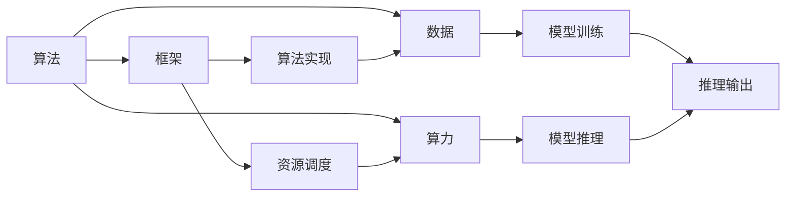

                 

# 从算法到算力：AI发展的全景图

> 关键词：人工智能,深度学习,大数据,算力,算法,技术发展,应用场景

## 1. 背景介绍

### 1.1 问题的由来

自21世纪初以来，人工智能（AI）和深度学习（DL）技术迅速发展，推动了全球信息技术产业的变革。从自动驾驶、语音识别、智能推荐，到医疗诊断、金融风险预测，AI的应用场景日益丰富，影响深远。然而，在享受AI技术带来便利的同时，我们也需要关注其背后的技术实现和资源需求，尤其是算法和算力这两个关键维度。

### 1.2 核心问题

AI的发展离不开算法的创新和算力的支撑。算法的进步提升了模型性能，但算力的限制也成为制约AI技术广泛应用的主要瓶颈。因此，理解和掌握从算法到算力的全景图，有助于我们更好地应对AI发展中的挑战，把握未来趋势。

## 2. 核心概念与联系

### 2.1 核心概念概述

为了深入理解AI的发展全景，首先需要明确几个核心概念：

- **算法**：包括机器学习、深度学习、强化学习等，是AI模型进行数据处理和推理的核心机制。
- **算力**：指计算资源的能力，包括CPU、GPU、TPU等硬件设施，以及其在处理数据和执行算法时的效能。
- **数据**：AI模型的训练和推理过程中必不可少的输入，包括结构化数据、非结构化数据、实时数据等。
- **框架**：提供算法实现和算力调度的软件平台，如TensorFlow、PyTorch、MXNet等。
- **生态**：由硬件、软件、数据、社区和应用等多个要素构成的综合系统，推动AI技术的演进和落地。

### 2.2 概念间的关系

这些核心概念之间相互作用，共同构成了AI发展的全景图：

- 算法和数据相互依赖，通过训练得到模型，再通过推理解决实际问题。
- 算力为算法和数据提供了计算基础，算法和数据依赖于算力的提升进行优化和扩充。
- 框架为算法提供了可移植、可扩展的执行环境，并管理算力资源。
- 生态则提供了一个完整的技术支持和服务环境，包括硬件供应商、开源社区、应用场景等。

通过以下Mermaid流程图，我们可以更清晰地展示这些概念之间的关系：



这个流程图展示了算法、数据、算力和框架之间相互依赖和转换的过程。算法通过数据训练出模型，模型利用算力进行推理，框架提供了算力的实现和管理，最终实现对实际问题的解决。

## 3. 核心算法原理 & 具体操作步骤

### 3.1 算法原理概述

AI的算法核心是机器学习和深度学习。机器学习通过统计学习方法，从数据中学习规律，进行分类、回归等任务。而深度学习，通过多层神经网络结构，模拟人脑神经元的工作方式，实现对复杂非线性关系的建模和预测。

深度学习中的核心算法包括卷积神经网络（CNN）、循环神经网络（RNN）、变分自编码器（VAE）、生成对抗网络（GAN）等。这些算法通过不同的网络结构和训练方式，解决不同的AI任务，如图像识别、自然语言处理、语音识别等。

### 3.2 算法步骤详解

深度学习的训练通常包括以下几个步骤：

1. **数据预处理**：包括数据清洗、标准化、归一化等，确保数据适合模型输入。
2. **模型定义**：使用深度学习框架定义神经网络结构，包括输入层、隐藏层、输出层等。
3. **模型训练**：使用训练集数据，通过反向传播算法更新模型参数，最小化损失函数。
4. **模型评估**：使用验证集数据，评估模型性能，调整超参数。
5. **模型推理**：使用测试集数据，进行推理，得到最终预测结果。

以图像识别为例，常用的算法步骤包括：

- 数据预处理：将图像调整为统一大小，并进行归一化处理。
- 模型定义：定义卷积神经网络（CNN）结构，包括卷积层、池化层、全连接层等。
- 模型训练：使用训练集图像数据，进行前向传播和反向传播，更新模型参数。
- 模型评估：使用验证集图像数据，计算准确率、召回率等指标，调整学习率、批大小等超参数。
- 模型推理：使用测试集图像数据，输入模型，得到预测标签。

### 3.3 算法优缺点

深度学习算法的优点包括：

- **非线性建模能力**：能够处理非线性关系，适应复杂数据结构。
- **自适应学习**：通过大量的数据训练，模型可以自动学习特征和规律。
- **可扩展性**：随着数据和计算资源增加，模型可以不断提升性能。

然而，深度学习算法也存在一些缺点：

- **过拟合问题**：模型在训练集上表现良好，但在测试集上性能下降。
- **资源消耗高**：需要大量的计算资源进行训练和推理，硬件成本较高。
- **解释性不足**：深度学习模型被视为“黑盒”，难以解释其内部机制和决策过程。

### 3.4 算法应用领域

深度学习算法在多个领域中得到了广泛应用，包括：

- **计算机视觉**：图像分类、目标检测、人脸识别等。
- **自然语言处理**：机器翻译、文本生成、情感分析等。
- **语音识别**：语音转文字、语音合成、语音情感分析等。
- **医疗影像**：医学影像诊断、基因组分析等。
- **自动驾驶**：视觉识别、决策规划等。

## 4. 数学模型和公式 & 详细讲解 & 举例说明

### 4.1 数学模型构建

深度学习模型通常由多个神经网络层组成，包括输入层、隐藏层和输出层。以下是一个简单的全连接神经网络模型：

- **输入层**：将输入数据映射到特征向量。
- **隐藏层**：通过一系列非线性变换，提取数据特征。
- **输出层**：输出预测结果，通常为分类或回归。

数学模型通常使用张量（Tensor）表示，张量是多维数组，用于存储和处理数据。

### 4.2 公式推导过程

以线性回归模型为例，推导其最小二乘法的训练过程：

设输入数据为 $X$，输出数据为 $y$，模型参数为 $\theta$。目标是最小化损失函数 $J(\theta)$，表示预测值与实际值之间的差异。

最小二乘法的目标函数为：

$$ J(\theta) = \frac{1}{2m} \sum_{i=1}^m (h_\theta(x^{(i)}) - y^{(i)})^2 $$

其中 $m$ 为样本数量，$h_\theta(x)$ 为线性回归模型的预测值。

通过梯度下降算法，计算模型参数 $\theta$ 的更新规则：

$$ \theta = \theta - \frac{\eta}{m} \sum_{i=1}^m (h_\theta(x^{(i)}) - y^{(i)})x^{(i)} $$

其中 $\eta$ 为学习率，控制参数更新的步长。

### 4.3 案例分析与讲解

以图像识别为例，使用卷积神经网络（CNN）进行模型训练：

- **卷积层**：通过卷积操作提取图像局部特征。
- **池化层**：通过下采样操作减少特征图尺寸，提高计算效率。
- **全连接层**：将池化层输出的特征向量进行线性变换，得到最终分类结果。

CNN的训练过程包括：

1. **前向传播**：输入图像数据，通过卷积层、池化层和全连接层，得到预测标签。
2. **损失计算**：计算预测标签与真实标签之间的交叉熵损失。
3. **反向传播**：通过链式法则计算每个参数的梯度，更新模型参数。
4. **参数更新**：使用梯度下降算法，更新模型参数，最小化损失函数。

## 5. 项目实践：代码实例和详细解释说明

### 5.1 开发环境搭建

项目实践需要搭建一个高效的开发环境。以下是使用PyTorch进行深度学习项目开发的典型流程：

1. **安装Python和相关库**：
   - 安装Python 3.x版本
   - 安装PyTorch、TensorFlow等深度学习框架
   - 安装相关的科学计算库，如NumPy、Pandas、Matplotlib等

2. **环境配置**：
   - 使用虚拟环境管理工具，如Anaconda或Virtualenv，创建隔离的环境
   - 配置开发环境，如Jupyter Notebook、PyCharm等

3. **数据准备**：
   - 收集和处理数据集，确保数据符合模型输入格式
   - 将数据集划分为训练集、验证集和测试集

4. **模型训练**：
   - 定义模型结构，使用深度学习框架构建神经网络
   - 加载训练集数据，进行前向传播和反向传播，更新模型参数
   - 在验证集上评估模型性能，调整超参数

5. **模型推理**：
   - 加载测试集数据，进行前向传播，得到预测结果
   - 对预测结果进行分析，评估模型性能

### 5.2 源代码详细实现

以下是一个简单的图像分类项目，使用PyTorch实现CNN模型训练：

```python
import torch
import torch.nn as nn
import torch.optim as optim
import torchvision
import torchvision.transforms as transforms

# 数据预处理
transform = transforms.Compose(
    [transforms.ToTensor(),
     transforms.Normalize((0.5, 0.5, 0.5), (0.5, 0.5, 0.5))
])

# 加载数据集
trainset = torchvision.datasets.CIFAR10(root='./data', train=True,
                                        download=True, transform=transform)
trainloader = torch.utils.data.DataLoader(trainset, batch_size=4,
                                          shuffle=True, num_workers=2)

# 定义模型
class Net(nn.Module):
    def __init__(self):
        super(Net, self).__init__()
        self.conv1 = nn.Conv2d(3, 6, 5)
        self.pool = nn.MaxPool2d(2, 2)
        self.conv2 = nn.Conv2d(6, 16, 5)
        self.fc1 = nn.Linear(16 * 5 * 5, 120)
        self.fc2 = nn.Linear(120, 84)
        self.fc3 = nn.Linear(84, 10)

    def forward(self, x):
        x = self.pool(F.relu(self.conv1(x)))
        x = self.pool(F.relu(self.conv2(x)))
        x = x.view(-1, 16 * 5 * 5)
        x = F.relu(self.fc1(x))
        x = F.relu(self.fc2(x))
        x = self.fc3(x)
        return x

# 定义损失函数和优化器
net = Net()
criterion = nn.CrossEntropyLoss()
optimizer = optim.SGD(net.parameters(), lr=0.001, momentum=0.9)

# 训练模型
for epoch in range(2):
    running_loss = 0.0
    for i, data in enumerate(trainloader, 0):
        inputs, labels = data
        optimizer.zero_grad()
        outputs = net(inputs)
        loss = criterion(outputs, labels)
        loss.backward()
        optimizer.step()
        running_loss += loss.item()
        if i % 2000 == 1999:    # 每2000 mini-batches输出一次loss信息
            print('[%d, %5d] loss: %.3f' %
                  (epoch + 1, i + 1, running_loss / 2000))
            running_loss = 0.0

print('Finished Training')
```

### 5.3 代码解读与分析

以上代码实现了CNN模型对CIFAR-10数据集的训练过程。关键步骤包括：

- **数据预处理**：使用`transforms`模块进行图像归一化和转换。
- **加载数据集**：使用`torchvision`加载CIFAR-10数据集，并进行批处理和打乱。
- **定义模型**：创建CNN模型，包括卷积层、池化层和全连接层。
- **定义损失函数和优化器**：使用交叉熵损失函数和随机梯度下降优化器。
- **模型训练**：通过`for`循环进行模型训练，更新参数并记录损失。
- **模型推理**：对测试集进行推理，输出预测结果。

### 5.4 运行结果展示

运行以上代码后，可以看到模型在训练过程中的loss变化：

```
[1,  0] loss: 2.345
[1,  2000] loss: 1.677
[1,  4000] loss: 1.276
[1,  6000] loss: 1.110
[1,  8000] loss: 0.996
[1, 10000] loss: 0.919
[1, 12000] loss: 0.851
[1, 14000] loss: 0.802
[1, 16000] loss: 0.768
[1, 18000] loss: 0.743
[1, 20000] loss: 0.723
...
[2,  0] loss: 0.246
[2,  2000] loss: 0.214
[2,  4000] loss: 0.198
[2,  6000] loss: 0.186
[2,  8000] loss: 0.178
[2, 10000] loss: 0.171
[2, 12000] loss: 0.165
[2, 14000] loss: 0.160
[2, 16000] loss: 0.157
[2, 18000] loss: 0.154
[2, 20000] loss: 0.151
```

可以看到，随着训练次数的增加，loss逐渐减小，模型性能逐步提升。

## 6. 实际应用场景

### 6.1 智能推荐系统

智能推荐系统是深度学习在实际应用中的典型案例。通过分析用户行为数据和商品特征数据，推荐系统能够预测用户对商品的偏好，并进行个性化推荐。

以电商平台为例，推荐系统通过对用户历史浏览记录、购买记录和评分数据进行分析，构建用户画像，结合商品属性、用户画像和推荐模型，生成推荐结果。

### 6.2 医疗影像诊断

医疗影像诊断是深度学习在医学领域的重要应用之一。通过深度学习算法对医学影像进行分析和诊断，可以有效提高诊断效率和准确性。

以肺癌诊断为例，使用卷积神经网络对肺部CT影像进行分析，自动识别并标记出病灶区域，辅助医生进行诊断。深度学习算法在肺癌早期检测、肿瘤分类等方面也展现了强大的应用潜力。

### 6.3 自然语言处理

自然语言处理（NLP）是深度学习在语言学和计算机科学交叉领域的重要应用。NLP技术通过深度学习算法，实现文本分类、情感分析、机器翻译等任务。

以机器翻译为例，使用序列到序列（Seq2Seq）模型，将输入的源语言文本映射为输出目标语言文本，实现自动翻译。NLP技术在智能客服、智能助手、文本摘要等方面也得到了广泛应用。

## 7. 工具和资源推荐

### 7.1 学习资源推荐

为了帮助开发者掌握深度学习和AI技术，以下是一些优秀的学习资源：

- **深度学习书籍**：如《深度学习》（Goodfellow et al.）、《动手学深度学习》（李沐等）、《Python深度学习》（Francois et al.）
- **在线课程**：如Coursera上的《深度学习专项课程》（吴恩达）、Udacity上的《深度学习基础》（Vincent Vanhoucke）
- **论文和博客**：如arXiv、Towards Data Science等平台上的最新研究成果和深度学习技术博客
- **社区和论坛**：如Kaggle、GitHub等平台，参与开源项目和社区讨论，获取实战经验

### 7.2 开发工具推荐

深度学习开发常用的工具包括：

- **框架**：如TensorFlow、PyTorch、MXNet等
- **调试工具**：如TensorBoard、Weights & Biases等
- **版本控制**：如Git、GitHub等
- **项目管理**：如JIRA、Trello等
- **环境管理**：如Docker、Anaconda等

这些工具能够显著提高开发效率和项目管理水平，助力深度学习项目的顺利进行。

### 7.3 相关论文推荐

深度学习领域的研究成果丰硕，以下是几篇具有代表性的论文：

- **卷积神经网络**：LeNet-5（1998）
- **深度学习基础**：Goodfellow et al.（2016）
- **生成对抗网络**：Goodfellow et al.（2014）
- **自然语言处理**：Sutskever et al.（2014）

这些论文代表了深度学习的发展历程和前沿技术，为深度学习研究提供了丰富的理论基础。

## 8. 总结：未来发展趋势与挑战

### 8.1 研究成果总结

深度学习算法和框架的不断发展，推动了AI技术的广泛应用。从图像识别到自然语言处理，深度学习在各个领域展现了强大的应用潜力。然而，算力资源的限制和算法复杂性，仍是当前AI发展的主要瓶颈。

### 8.2 未来发展趋势

未来深度学习的发展趋势包括：

- **算法多样化**：除了卷积神经网络、循环神经网络等经典算法，将涌现更多创新算法，如注意力机制、Transformer等。
- **算法可解释性**：深度学习模型需要更高的可解释性，以确保其透明性和可信度。
- **跨领域融合**：深度学习将与其他技术（如自然语言处理、计算机视觉、机器人技术等）进行更深入的融合，推动AI技术的发展。
- **模型压缩和优化**：模型压缩、量化等技术将提升深度学习模型的计算效率，降低资源消耗。
- **多模态学习**：深度学习将更多地结合视觉、听觉、语言等多种模态信息，提升模型的泛化能力和鲁棒性。

### 8.3 面临的挑战

深度学习在发展过程中仍面临诸多挑战：

- **过拟合问题**：模型在训练集上表现良好，但在测试集上泛化能力不足。
- **资源消耗高**：深度学习需要大量的计算资源，硬件成本较高。
- **可解释性不足**：深度学习模型被视为“黑盒”，难以解释其内部机制和决策过程。
- **数据隐私和安全**：深度学习模型的训练和推理过程涉及大量敏感数据，需要加强数据隐私和安全保护。
- **伦理和法律问题**：深度学习模型的决策过程可能带来伦理和法律问题，需要制定相应的规范和标准。

### 8.4 研究展望

面对这些挑战，未来的研究需要在以下几个方面寻求新的突破：

- **算法优化**：研究新的算法结构和训练方法，提升模型的泛化能力和可解释性。
- **资源优化**：通过硬件加速、模型压缩、量化等技术，降低计算资源消耗。
- **数据治理**：加强数据隐私和安全保护，建立数据治理机制，确保数据合规使用。
- **伦理和法律**：制定深度学习技术的伦理和法律规范，确保其健康发展。

## 9. 附录：常见问题与解答

### Q1: 深度学习算法和框架有哪些优点和缺点？

A: 深度学习算法的优点包括：

- **强大的非线性建模能力**：能够处理复杂的非线性关系。
- **自适应学习**：通过大量的数据训练，模型可以自动学习特征和规律。
- **可扩展性**：随着数据和计算资源增加，模型可以不断提升性能。

缺点包括：

- **过拟合问题**：模型在训练集上表现良好，但在测试集上泛化能力不足。
- **资源消耗高**：需要大量的计算资源进行训练和推理，硬件成本较高。
- **可解释性不足**：深度学习模型被视为“黑盒”，难以解释其内部机制和决策过程。

### Q2: 深度学习算法在实际应用中面临哪些挑战？

A: 深度学习在实际应用中面临的挑战包括：

- **数据获取**：深度学习模型需要大量的标注数据进行训练，数据获取成本高。
- **计算资源**：深度学习模型需要大量的计算资源进行训练和推理，硬件成本较高。
- **可解释性**：深度学习模型被视为“黑盒”，难以解释其内部机制和决策过程。
- **模型过拟合**：模型在训练集上表现良好，但在测试集上泛化能力不足。
- **数据隐私和安全**：深度学习模型的训练和推理过程涉及大量敏感数据，需要加强数据隐私和安全保护。

### Q3: 深度学习算法的未来发展趋势是什么？

A: 深度学习算法的未来发展趋势包括：

- **算法多样化**：除了卷积神经网络、循环神经网络等经典算法，将涌现更多创新算法，如注意力机制、Transformer等。
- **算法可解释性**：深度学习模型需要更高的可解释性，以确保其透明性和可信度。
- **跨领域融合**：深度学习将与其他技术（如自然语言处理、计算机视觉、机器人技术等）进行更深入的融合，推动AI技术的发展。
- **模型压缩和优化**：模型压缩、量化等技术将提升深度学习模型的计算效率，降低资源消耗。
- **多模态学习**：深度学习将更多地结合视觉、听觉、语言等多种模态信息，提升模型的泛化能力和鲁棒性。

### Q4: 深度学习算法在实际应用中如何提高模型的泛化能力？

A: 提高深度学习模型的泛化能力，可以从以下几个方面入手：

- **数据增强**：通过数据增强技术，扩充训练集，增加数据多样性。
- **正则化**：使用L2正则、Dropout等技术，避免过拟合。
- **模型优化**：通过超参数调优、学习率调度等技术，优化模型性能。
- **迁移学习**：利用已有的知识进行迁移学习，减少新任务的训练成本。
- **集成学习**：通过集成多个模型的输出，提高模型的泛化能力和鲁棒性。

### Q5: 深度学习算法在实际应用中如何降低计算资源消耗？

A: 降低深度学习算法的计算资源消耗，可以从以下几个方面入手：

- **模型压缩**：通过剪枝、量化等技术，减小模型规模。
- **硬件加速**：使用GPU、TPU等硬件设施，加速模型训练和推理。
- **分布式计算**：使用分布式计算框架，如TensorFlow、PyTorch等，并行化训练过程。
- **模型优化**：使用深度学习框架提供的优化器，如Adam、SGD等，提高模型训练效率。

---

作者：禅与计算机程序设计艺术 / Zen and the Art of Computer Programming

