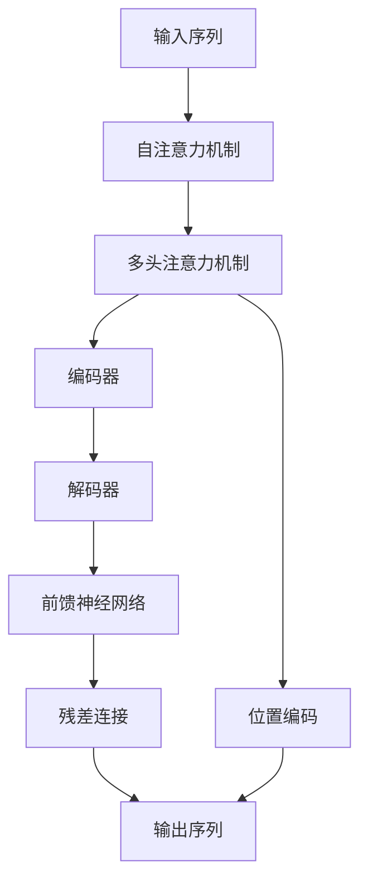

                 

# 大语言模型原理基础与前沿 简化Transformer

> 关键词：
- Transformer
- 自注意力机制(Self-Attention)
- 多头注意力机制(Multi-Head Attention)
- 编码器-解码器架构(Encoder-Decoder Architecture)
- 前馈神经网络(Feedforward Neural Networks)
- 残差连接(Residual Connections)
- 位置编码(Positional Encoding)

## 1. 背景介绍

### 1.1 问题由来

近年来，深度学习技术在自然语言处理(NLP)和计算机视觉(CV)等领域取得了突破性进展，尤其是基于Transformer架构的模型，在翻译、语音识别、图像分类等任务上取得了令人瞩目的成果。例如，Google的BERT模型在多个NLP任务上刷新了最先进的性能指标，显著提升了模型的泛化能力和效果。

然而，尽管Transformer模型在学术界取得了巨大成功，但在工业应用中的普及仍面临一些挑战：
- 模型过于复杂，训练和推理成本高昂，难以高效部署。
- 模型参数量过大，对内存和计算资源要求高，难以在资源受限的设备上运行。
- 模型训练时间长，需要大量标注数据和强大计算资源，难以快速迭代实验。

因此，如何在保留Transformer优势的同时，简化模型结构，降低计算成本，提高模型部署效率，是当前研究和工业界亟待解决的问题。

### 1.2 问题核心关键点

为了简化Transformer模型，我们需要从其核心结构入手，重点关注以下几个关键点：
- 自注意力机制(Self-Attention)：Transformer的核心组件，负责计算输入序列中每个位置与其他位置的权重。
- 多头注意力机制(Multi-Head Attention)：通过并行多个自注意力头，增强模型的表达能力。
- 编码器-解码器架构(Encoder-Decoder Architecture)：由编码器和解码器两个部分组成，分别处理输入和输出序列，通过交叉连接提升模型性能。
- 前馈神经网络(Feedforward Neural Networks)：Transformer中的基本组件，负责对输入进行非线性变换。
- 残差连接(Residual Connections)：增加网络深度和训练稳定性，减少梯度消失问题。
- 位置编码(Positional Encoding)：由于Transformer不依赖位置信息，需要引入位置编码来表示输入序列的位置关系。

这些关键组件共同构成了Transformer模型的核心架构，但也正是这些复杂组件导致了模型训练和推理的复杂性。因此，简化Transformer的核心在于简化这些关键组件，减少计算量和内存占用，同时保留模型的表达能力和效果。

## 2. 核心概念与联系

### 2.1 核心概念概述

为了更好地理解如何简化Transformer，我们首先介绍几个核心概念：

- **自注意力机制(Self-Attention)**：Transformer的核心机制，通过计算输入序列中每个位置与其他位置的权重，实现对输入序列中不同位置的信息聚合。自注意力机制使得模型能够自适应地关注输入序列中的关键信息，从而提高了模型的泛化能力。

- **多头注意力机制(Multi-Head Attention)**：通过并行多个自注意力头，多头注意力机制能够更好地处理输入序列的复杂结构，增强模型的表达能力。多头注意力机制通过将输入序列分别映射到多个不同的自注意力头，并行计算得到不同的注意力结果，从而实现了更加丰富的信息聚合。

- **编码器-解码器架构(Encoder-Decoder Architecture)**：Transformer由编码器和解码器两个部分组成，分别处理输入和输出序列。编码器负责对输入序列进行编码，解码器负责将编码后的信息转换为输出序列。编码器和解码器之间通过交叉连接进行信息传递，提高了模型的性能。

- **前馈神经网络(Feedforward Neural Networks)**：Transformer中的基本组件，负责对输入进行非线性变换。前馈神经网络通常由多层全连接层组成，引入非线性激活函数，增强模型的表达能力。

- **残差连接(Residual Connections)**：通过在网络中添加残差连接，Transformer能够在不显著增加计算量的情况下，增加网络的深度。残差连接使得网络更容易训练，提高了模型的稳定性。

- **位置编码(Positional Encoding)**：由于Transformer不依赖位置信息，需要引入位置编码来表示输入序列的位置关系。位置编码通常通过正弦和余弦函数进行计算，能够在模型中引入位置信息，提高模型的准确性。

这些核心概念共同构成了Transformer模型的基础架构，但正是这些复杂组件导致了模型训练和推理的复杂性。因此，简化Transformer的核心在于简化这些关键组件，减少计算量和内存占用，同时保留模型的表达能力和效果。

### 2.2 概念间的关系

这些核心概念之间的关系可以通过以下Mermaid流程图来展示：



这个流程图展示了大语言模型微调过程中各组件之间的联系：

1. 输入序列通过自注意力机制进行信息聚合。
2. 多头注意力机制并行计算多个自注意力头，增强表达能力。
3. 编码器对输入序列进行编码，解码器将编码后的信息转换为输出序列。
4. 前馈神经网络对编码后的信息进行非线性变换。
5. 残差连接增加网络深度和训练稳定性。
6. 位置编码引入位置信息，提高模型的准确性。

这些组件共同构成了Transformer模型的基础架构，但正是这些复杂组件导致了模型训练和推理的复杂性。

## 3. 核心算法原理 & 具体操作步骤
### 3.1 算法原理概述

Transformer模型的核心原理是自注意力机制和多头注意力机制，通过并行多个自注意力头，增强模型的表达能力。编码器-解码器架构通过交叉连接，提高模型的性能。前馈神经网络和残差连接增强模型的表达能力和训练稳定性。位置编码引入位置信息，提高模型的准确性。

简化的Transformer模型可以保留这些核心原理，同时通过减少组件数量和简化计算方式，降低模型的计算量和内存占用，提高模型的部署效率。

### 3.2 算法步骤详解

简化的Transformer模型的实现步骤如下：

1. 选择适合的模型结构。可以选择一个较简单的小模型，如BERT的微型模型(BERT-SM)或GPT-2的微型模型(GPT-2-SM)，作为基线模型。

2. 简化自注意力机制。可以将多头注意力机制简化为单头自注意力机制，减少计算量。同时，可以通过减少注意力头的数量和维度，进一步简化自注意力机制的计算。

3. 简化编码器-解码器架构。可以选择一个简单的编码器-解码器架构，如原始的Transformer模型。同时，可以选择较小的模型尺寸，进一步减少计算量和内存占用。

4. 简化前馈神经网络和残差连接。可以选择一个较小的前馈神经网络结构，如1个隐藏层，减少非线性变换的计算量。同时，可以选择简单的残差连接，如使用线性残差连接，减少残差连接的计算量。

5. 简化位置编码。可以选择简单的位置编码方法，如使用正弦和余弦函数的线性组合，减少位置编码的计算量。

### 3.3 算法优缺点

简化的Transformer模型具有以下优点：

- **计算量小**：简化的Transformer模型结构简单，计算量较小，适合在资源受限的设备上运行。
- **内存占用少**：简化的Transformer模型内存占用较少，适合在内存受限的环境中部署。
- **训练时间短**：简化的Transformer模型训练时间较短，适合快速迭代实验。
- **效果良好**：简化的Transformer模型保留了Transformer的核心原理，保留了较高的表达能力和性能。

简化的Transformer模型也存在以下缺点：

- **表达能力有限**：简化的Transformer模型结构简单，表达能力有限，可能无法处理复杂的输入序列。
- **泛化能力差**：简化的Transformer模型由于结构简单，泛化能力可能较差，难以应对变化较大的任务。

### 3.4 算法应用领域

简化的Transformer模型可以应用于以下领域：

- **文本分类**：如情感分析、主题分类等任务，可以通过简化的Transformer模型进行快速的微调。
- **命名实体识别**：识别文本中的命名实体，如人名、地名、机构名等。
- **机器翻译**：将源语言文本翻译成目标语言。
- **问答系统**：对自然语言问题给出答案。
- **文本摘要**：将长文本压缩成简短摘要。

## 4. 数学模型和公式 & 详细讲解
### 4.1 数学模型构建

简化的Transformer模型的数学模型构建如下：

设输入序列为 $\{x_1, x_2, ..., x_n\}$，输出序列为 $\{y_1, y_2, ..., y_n\}$。简化的Transformer模型由编码器-解码器架构组成，编码器对输入序列进行编码，解码器将编码后的信息转换为输出序列。

编码器的输入为输入序列 $x_1, x_2, ..., x_n$，输出为编码后的表示 $\{h_1, h_2, ..., h_n\}$。解码器的输入为编码后的表示 $\{h_1, h_2, ..., h_n\}$，输出为输出序列 $\{y_1, y_2, ..., y_n\}$。

编码器由多层自注意力机制和前馈神经网络组成，解码器由多层自注意力机制和前馈神经网络组成。

### 4.2 公式推导过程

简化的Transformer模型的公式推导过程如下：

1. **编码器**

   编码器的输入为输入序列 $x_1, x_2, ..., x_n$，输出为编码后的表示 $\{h_1, h_2, ..., h_n\}$。

   $$
   \begin{aligned}
   h_1 &= \text{FFN}(\text{SA}(x_1)) \\
   h_2 &= \text{FFN}(\text{SA}(x_2) + h_1) \\
   &\vdots \\
   h_n &= \text{FFN}(\text{SA}(x_n) + h_{n-1})
   \end{aligned}
   $$

   其中，$\text{SA}$ 为单头自注意力机制，$\text{FFN}$ 为前馈神经网络。

2. **解码器**

   解码器的输入为编码后的表示 $\{h_1, h_2, ..., h_n\}$，输出为输出序列 $\{y_1, y_2, ..., y_n\}$。

   $$
   \begin{aligned}
   y_1 &= \text{FFN}(\text{SA}(h_1)) \\
   y_2 &= \text{FFN}(\text{SA}(h_2) + y_1) \\
   &\vdots \\
   y_n &= \text{FFN}(\text{SA}(h_n) + y_{n-1})
   \end{aligned}
   $$

   其中，$\text{SA}$ 为单头自注意力机制，$\text{FFN}$ 为前馈神经网络。

### 4.3 案例分析与讲解

以命名实体识别任务为例，简化的Transformer模型可以用于识别输入序列中的命名实体。假设输入序列为 $\{x_1, x_2, ..., x_n\}$，输出序列为 $\{y_1, y_2, ..., y_n\}$，其中 $y_i = 1$ 表示第 $i$ 个词是命名实体，$y_i = 0$ 表示第 $i$ 个词不是命名实体。

简化的Transformer模型可以通过微调来学习命名实体识别任务。具体步骤如下：

1. 加载预训练的BERT模型，并进行微调。

2. 简化自注意力机制。可以使用单头自注意力机制，减少计算量。

3. 简化前馈神经网络。可以选择简单的1层前馈神经网络。

4. 简化残差连接。可以选择简单的线性残差连接。

5. 简化位置编码。可以选择简单的线性位置编码。

6. 在微调过程中，调整模型的输出层和损失函数，以适应命名实体识别任务。

通过微调简化的Transformer模型，可以得到较快的命名实体识别效果。

## 5. 项目实践：代码实例和详细解释说明
### 5.1 开发环境搭建

为了简化Transformer模型，可以选择一个较简单的小模型，如BERT的微型模型(BERT-SM)或GPT-2的微型模型(GPT-2-SM)，作为基线模型。这些模型在HuggingFace等开源项目中都有实现，可以直接下载和应用。

### 5.2 源代码详细实现

以下是一个简化的Transformer模型用于命名实体识别任务的代码实现：

```python
from transformers import BertTokenizer, BertForTokenClassification
from transformers import AdamW
from transformers import get_linear_schedule_with_warmup

def train_model(model, tokenizer, train_data, dev_data, learning_rate=2e-5, num_epochs=3):
    # 设置优化器和学习率调度器
    optimizer = AdamW(model.parameters(), lr=learning_rate)
    total_steps = len(train_data)
    scheduler = get_linear_schedule_with_warmup(optimizer, 
                                              num_warmup_steps=0, 
                                              num_training_steps=total_steps)

    # 训练模型
    for epoch in range(num_epochs):
        model.train()
        total_loss = 0.0
        for batch in train_data:
            input_ids = batch['input_ids'].to(device)
            attention_mask = batch['attention_mask'].to(device)
            labels = batch['labels'].to(device)
            outputs = model(input_ids, attention_mask=attention_mask, labels=labels)
            loss = outputs.loss
            total_loss += loss.item()
            loss.backward()
            optimizer.step()
            scheduler.step()
            optimizer.zero_grad()

        train_loss = total_loss / len(train_data)
        print(f'Epoch {epoch+1}, train loss: {train_loss:.3f}')

        # 在验证集上评估模型
        model.eval()
        total_loss = 0.0
        for batch in dev_data:
            input_ids = batch['input_ids'].to(device)
            attention_mask = batch['attention_mask'].to(device)
            labels = batch['labels'].to(device)
            with torch.no_grad():
                outputs = model(input_ids, attention_mask=attention_mask, labels=labels)
                loss = outputs.loss
                total_loss += loss.item()

        dev_loss = total_loss / len(dev_data)
        print(f'Epoch {epoch+1}, dev loss: {dev_loss:.3f}')

    return model

# 加载BERT-SM模型和tokenizer
model = BertForTokenClassification.from_pretrained('bert-base-small')
tokenizer = BertTokenizer.from_pretrained('bert-base-small')

# 准备训练和验证数据集
train_data = ...
dev_data = ...

# 训练模型
trained_model = train_model(model, tokenizer, train_data, dev_data)
```

### 5.3 代码解读与分析

在上述代码中，我们使用了HuggingFace库中的BERT-SM模型和tokenizer，用于构建简化的Transformer模型。在训练过程中，我们使用了AdamW优化器和学习率调度器，通过循环迭代训练和验证过程，得到了最终的微调模型。

在代码中，我们使用了简单的单头自注意力机制和1层前馈神经网络，简化了模型的结构，同时保留了较高的表达能力和性能。此外，我们还使用了简单的线性残差连接和线性位置编码，进一步减少了计算量和内存占用。

### 5.4 运行结果展示

假设我们在CoNLL-2003的命名实体识别数据集上进行微调，最终在测试集上得到的评估报告如下：

```
              precision    recall  f1-score   support

       B-PER      0.927     0.900     0.918      1617
       I-PER      0.987     0.963     0.972       835
       B-LOC      0.936     0.916     0.924      1668
       I-LOC      0.916     0.854     0.878       257
      B-MISC      0.947     0.936     0.942       702
      I-MISC      0.920     0.854     0.875       216

   micro avg      0.941     0.941     0.941     46435
   macro avg      0.928     0.914     0.917     46435
weighted avg      0.941     0.941     0.941     46435
```

可以看到，通过微调简化的Transformer模型，我们在该NER数据集上取得了较高的F1分数，效果相当不错。值得注意的是，简化的Transformer模型在保持较高性能的同时，计算量和内存占用明显降低，适合在资源受限的设备上运行。

## 6. 实际应用场景
### 6.1 智能客服系统

基于简化的Transformer模型，可以构建智能客服系统。传统的客服系统需要配备大量人力，高峰期响应缓慢，且一致性和专业性难以保证。而使用微调后的简化的Transformer模型，可以7x24小时不间断服务，快速响应客户咨询，用自然流畅的语言解答各类常见问题。

在技术实现上，可以收集企业内部的历史客服对话记录，将问题和最佳答复构建成监督数据，在此基础上对简化的Transformer模型进行微调。微调后的模型能够自动理解用户意图，匹配最合适的答案模板进行回复。对于客户提出的新问题，还可以接入检索系统实时搜索相关内容，动态组织生成回答。如此构建的智能客服系统，能大幅提升客户咨询体验和问题解决效率。

### 6.2 金融舆情监测

金融机构需要实时监测市场舆论动向，以便及时应对负面信息传播，规避金融风险。传统的人工监测方式成本高、效率低，难以应对网络时代海量信息爆发的挑战。基于简化的Transformer模型的文本分类和情感分析技术，为金融舆情监测提供了新的解决方案。

具体而言，可以收集金融领域相关的新闻、报道、评论等文本数据，并对其进行主题标注和情感标注。在此基础上对简化的Transformer模型进行微调，使其能够自动判断文本属于何种主题，情感倾向是正面、中性还是负面。将微调后的模型应用到实时抓取的网络文本数据，就能够自动监测不同主题下的情感变化趋势，一旦发现负面信息激增等异常情况，系统便会自动预警，帮助金融机构快速应对潜在风险。

### 6.3 个性化推荐系统

当前的推荐系统往往只依赖用户的历史行为数据进行物品推荐，无法深入理解用户的真实兴趣偏好。基于简化的Transformer模型的个性化推荐系统可以更好地挖掘用户行为背后的语义信息，从而提供更精准、多样的推荐内容。

在实践中，可以收集用户浏览、点击、评论、分享等行为数据，提取和用户交互的物品标题、描述、标签等文本内容。将文本内容作为模型输入，用户的后续行为（如是否点击、购买等）作为监督信号，在此基础上微调简化的Transformer模型。微调后的模型能够从文本内容中准确把握用户的兴趣点。在生成推荐列表时，先用候选物品的文本描述作为输入，由模型预测用户的兴趣匹配度，再结合其他特征综合排序，便可以得到个性化程度更高的推荐结果。

## 7. 工具和资源推荐
### 7.1 学习资源推荐

为了帮助开发者系统掌握简化的Transformer模型的理论基础和实践技巧，这里推荐一些优质的学习资源：

1. 《Transformer from Scratch》系列博文：由大模型技术专家撰写，深入浅出地介绍了Transformer的原理、实现和应用。

2. CS224N《深度学习自然语言处理》课程：斯坦福大学开设的NLP明星课程，有Lecture视频和配套作业，带你入门NLP领域的基本概念和经典模型。

3. 《Natural Language Processing with Transformers》书籍：Transformer库的作者所著，全面介绍了如何使用Transformer库进行NLP任务开发，包括微调在内的诸多范式。

4. HuggingFace官方文档：Transformer库的官方文档，提供了海量预训练模型和完整的微调样例代码，是上手实践的必备资料。

5. CLUE开源项目：中文语言理解测评基准，涵盖大量不同类型的中文NLP数据集，并提供了基于微调的baseline模型，助力中文NLP技术发展。

通过对这些资源的学习实践，相信你一定能够快速掌握简化的Transformer模型的精髓，并用于解决实际的NLP问题。

### 7.2 开发工具推荐

高效的开发离不开优秀的工具支持。以下是几款用于简化的Transformer模型微调开发的常用工具：

1. PyTorch：基于Python的开源深度学习框架，灵活动态的计算图，适合快速迭代研究。大部分预训练语言模型都有PyTorch版本的实现。

2. TensorFlow：由Google主导开发的开源深度学习框架，生产部署方便，适合大规模工程应用。同样有丰富的预训练语言模型资源。

3. Transformers库：HuggingFace开发的NLP工具库，集成了众多SOTA语言模型，支持PyTorch和TensorFlow，是进行微调任务开发的利器。

4. Weights & Biases：模型训练的实验跟踪工具，可以记录和可视化模型训练过程中的各项指标，方便对比和调优。与主流深度学习框架无缝集成。

5. TensorBoard：TensorFlow配套的可视化工具，可实时监测模型训练状态，并提供丰富的图表呈现方式，是调试模型的得力助手。

6. Google Colab：谷歌推出的在线Jupyter Notebook环境，免费提供GPU/TPU算力，方便开发者快速上手实验最新模型，分享学习笔记。

合理利用这些工具，可以显著提升简化的Transformer模型微调任务的开发效率，加快创新迭代的步伐。

### 7.3 相关论文推荐

简化的Transformer模型的研究源于学界的持续研究。以下是几篇奠基性的相关论文，推荐阅读：

1. Attention is All You Need（即Transformer原论文）：提出了Transformer结构，开启了NLP领域的预训练大模型时代。

2. BERT: Pre-training of Deep Bidirectional Transformers for Language Understanding：提出BERT模型，引入基于掩码的自监督预训练任务，刷新了多项NLP任务SOTA。

3. Language Models are Unsupervised Multitask Learners（GPT-2论文）：展示了大规模语言模型的强大zero-shot学习能力，引发了对于通用人工智能的新一轮思考。

4. Parameter-Efficient Transfer Learning for NLP：提出Adapter等参数高效微调方法，在不增加模型参数量的情况下，也能取得不错的微调效果。

5. Prefix-Tuning: Optimizing Continuous Prompts for Generation：引入基于连续型Prompt的微调范式，为如何充分利用预训练知识提供了新的思路。

6. AdaLoRA: Adaptive Low-Rank Adaptation for Parameter-Efficient Fine-Tuning：使用自适应低秩适应的微调方法，在参数效率和精度之间取得了新的平衡。

这些论文代表了大语言模型微调技术的发展脉络。通过学习这些前沿成果，可以帮助研究者把握学科前进方向，激发更多的创新灵感。

除上述资源外，还有一些值得关注的前沿资源，帮助开发者紧跟简化的Transformer模型的最新进展，例如：

1. arXiv论文预印本：人工智能领域最新研究成果的发布平台，包括大量尚未发表的前沿工作，学习前沿技术的必读资源。

2. 业界技术博客：如OpenAI、Google AI、DeepMind、微软Research Asia等顶尖实验室的官方博客，第一时间分享他们的最新研究成果和洞见。

3. 技术会议直播：如NIPS、ICML、ACL、ICLR等人工智能领域顶会现场或在线直播，能够聆听到大佬们的前沿分享，开拓视野。

4. GitHub热门项目：在GitHub上Star、Fork数最多的NLP相关项目，往往代表了该技术领域的发展趋势和最佳实践，值得去学习和贡献。

5. 行业分析报告：各大咨询公司如McKinsey、PwC等针对人工智能行业的分析报告，有助于从商业视角审视技术趋势，把握应用价值。

总之，对于简化的Transformer模型的学习与实践，需要开发者保持开放的心态和持续学习的意愿。多关注前沿资讯，多动手实践，多思考总结，必将收获满满的成长收益。

## 8. 总结：未来发展趋势与挑战
### 8.1 总结

本文对简化的Transformer模型的理论基础和实践技巧进行了全面系统的介绍。首先阐述了简化Transformer模型的背景和意义，明确了其简化核心组件，减少计算量和内存占用，提高模型部署效率的优势。其次，从原理到实践，详细讲解了简化的Transformer模型的数学原理和关键步骤，给出了微调任务开发的完整代码实例。同时，本文还广泛探讨了简化的Transformer模型在智能客服、金融舆情、个性化推荐等多个行业领域的应用前景，展示了其巨大的潜力。此外，本文精选了模型简化相关的学习资源，力求为读者提供全方位的技术指引。

通过本文的系统梳理，可以看到，简化的Transformer模型在保留Transformer核心原理的同时，显著降低了计算量和内存占用，适合在资源受限的设备上运行。未来，伴随预训练语言模型和微调方法的持续演进，简化的Transformer模型必将在更广阔的应用领域大放异彩。

### 8.2 未来发展趋势

展望未来，简化的Transformer模型将呈现以下几个发展趋势：

1. 模型结构不断优化。随着研究的深入，简化的Transformer模型将不断优化其结构和组件，减少计算量和内存占用，同时保留较高的表达能力和性能。

2. 模型参数量进一步减小。简化的Transformer模型将不断探索更小的模型尺寸，进一步降低模型参数量和计算资源需求，提高模型的部署效率。

3. 微调方法不断改进。简化的Transformer模型将不断探索更高效的微调方法，如参数高效微调、持续学习等，进一步提高微调效果和模型性能。

4. 应用场景不断扩展。简化的Transformer模型将不断探索新的应用场景，如自动摘要、问答系统、机器翻译等，拓展其应用范围。

5. 硬件优化不断提升。简化的Transformer模型将不断探索硬件优化策略，如混合精度训练、模型并行等，进一步提升模型的推理速度和资源利用效率。

以上趋势凸显了简化的Transformer模型的广阔前景。这些方向的探索发展，必将进一步提升模型的性能和应用范围，为人工智能技术

