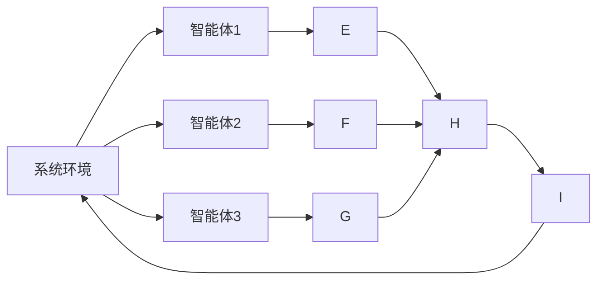
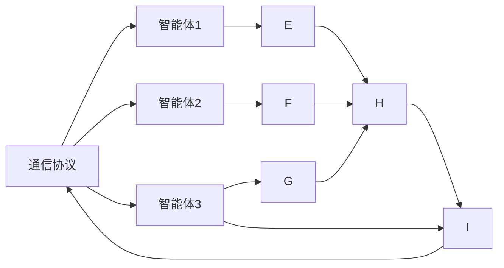

                 

## 1. 背景介绍

在现代复杂系统中，任务往往需要多个智能体协同合作才能完成。例如，在制造业中，多个机器人在同一工作空间内需要协调作业；在金融交易中，多个交易员需要根据市场动态同时做出决策；在医疗系统中，多个医生需要协作制定治疗方案。协同作业可以显著提升效率、质量和创新性。

### 1.1 问题由来

近年来，随着多智能体系统(Multi-Agent Systems,MAS)理论的不断发展，智能体协同方法在各个领域得到了广泛应用。然而，复杂的系统行为使得多智能体协同变得异常困难。传统方法往往依赖人工调参和手动干预，无法应对大规模系统。

多智能体系统是一个多目标、多行为、多约束的复杂系统，智能体之间需要高效的通信和协作才能实现目标。本博客将详细探讨如何通过多智能体协同，提高系统任务完成度。我们将从理论、算法和实践三个层面，剖析多智能体协同的原理和实现方法，并结合具体应用场景，展示如何通过多智能体协同提高任务完成度。

### 1.2 问题核心关键点

多智能体协同的关键点包括：
1. **协同目标设定**：定义协同的目标和指标，如最大化系统收益、最小化成本等。
2. **智能体交互模型**：设计智能体之间的交互机制，如通信协议、消息传递等。
3. **协同控制算法**：选择或设计协同控制算法，如基于通信协议的协同算法、基于博弈论的协同算法等。
4. **数据融合与信息共享**：设计智能体之间的数据融合和信息共享机制，以实现信息高效传递和协同决策。
5. **系统监控与反馈**：建立系统监控机制，实时评估协同效果，提供反馈信息，优化协同过程。

这些核心关键点相互关联，共同构成了多智能体协同的完整框架。

## 2. 核心概念与联系

### 2.1 核心概念概述

为了更好地理解多智能体协同原理，本节将介绍几个密切相关的核心概念：

- **多智能体系统(MAS)**：由多个智能体(Agent)组成，每个智能体具有感知、决策和执行能力，能够在环境或其他智能体影响下独立进行行动的系统。
- **智能体**：具有自主决策和执行能力的实体，可以是人、机器人、软件程序等。
- **协同目标**：系统协同旨在共同实现的目标，如最大化总利润、最小化资源消耗等。
- **通信协议**：智能体之间进行信息交换的规则，定义了消息格式、传输机制等。
- **博弈论**：研究多个决策者之间冲突与合作的理论，广泛应用于多智能体系统的协同控制中。
- **分布式决策算法**：通过多个智能体分散决策，实现全局最优或局部最优的系统。
- **数据融合**：智能体之间交换数据并融合信息，以实现更准确的感知和决策。

这些核心概念之间存在着紧密的联系，形成了多智能体协同的完整生态系统。下面我们通过几个Mermaid流程图来展示这些概念之间的联系。

```mermaid
graph LR
    A[多智能体系统(MAS)] --> B[智能体]
    A --> C[通信协议]
    A --> D[协同目标]
    B --> E[感知能力]
    B --> F[决策能力]
    B --> G[执行能力]
    D --> H[博弈论]
    D --> I[分布式决策算法]
    D --> J[数据融合]
    J --> E
    H --> I
```

这个流程图展示了多智能体协同的基本框架：

1. 多智能体系统由多个智能体组成。
2. 每个智能体具有感知、决策和执行能力。
3. 系统通过通信协议进行信息交换。
4. 协同目标定义了系统的整体目标。
5. 博弈论和多智能体协同目标指导分布式决策算法的设计。
6. 数据融合技术实现信息的高效传递和协同决策。

这些概念共同构成了多智能体协同的完整框架，使得多个智能体能够协同合作，高效完成任务。

### 2.2 概念间的关系

这些核心概念之间存在着紧密的联系，形成了多智能体协同的完整框架。下面我们通过几个Mermaid流程图来展示这些概念之间的关系。

#### 2.2.1 多智能体系统的组成



这个流程图展示了多智能体系统的基本组成：

1. 系统环境包含多个智能体。
2. 每个智能体具有感知、决策和执行能力。
3. 智能体之间通过通信协议进行信息交换。
4. 通信协议的结果输入到协同目标中。
5. 博弈论和多智能体协同目标指导分布式决策算法的设计。
6. 数据融合技术实现信息的高效传递和协同决策。

#### 2.2.2 通信协议和多智能体协同目标



这个流程图展示了通信协议和多智能体协同目标之间的关系：

1. 通信协议是智能体之间信息交换的规则。
2. 通信协议的结果输入到协同目标中。
3. 博弈论和多智能体协同目标指导分布式决策算法的设计。
4. 数据融合技术实现信息的高效传递和协同决策。

## 3. 核心算法原理 & 具体操作步骤

### 3.1 算法原理概述

多智能体协同的核心原理是通过多个智能体之间的信息交换和协作，实现系统整体目标的优化。

形式化地，假设系统由 $N$ 个智能体组成，每个智能体具有 $n$ 个状态变量 $x_{i,t}$ 和 $n$ 个决策变量 $u_{i,t}$，在时刻 $t$ 的状态和决策构成状态序列 $(x_{i,0}, x_{i,1}, ..., x_{i,t}, ..., x_{i,T})$ 和决策序列 $(u_{i,0}, u_{i,1}, ..., u_{i,t}, ..., u_{i,T})$。系统的协同目标 $J$ 为：

$$
J = \sum_{i=1}^{N} \sum_{t=0}^{T} w_{i,t} J_{i,t}(x_{i,t}, u_{i,t})
$$

其中 $w_{i,t}$ 为状态 $x_{i,t}$ 的权重，$J_{i,t}$ 为智能体 $i$ 在时刻 $t$ 的目标函数。系统的协同目标 $J$ 通过博弈论和多智能体协同目标来指导分布式决策算法的设计。

### 3.2 算法步骤详解

多智能体协同的一般步骤包括：

1. **系统建模**：建立多智能体系统的数学模型，定义状态变量、决策变量和系统目标。
2. **通信协议设计**：设计智能体之间的通信协议，确定消息格式、传输机制等。
3. **协同目标定义**：定义多智能体系统的协同目标，明确优化方向。
4. **分布式决策算法设计**：选择或设计合适的分布式决策算法，实现全局最优或局部最优。
5. **数据融合技术实现**：实现智能体之间的数据融合，提升信息传递效率和决策质量。
6. **系统监控与反馈**：建立系统监控机制，实时评估协同效果，提供反馈信息，优化协同过程。

下面我们以一个具体的协同控制算法——基于博弈论的协同控制为例，详细介绍其实现步骤。

### 3.3 算法优缺点

基于博弈论的协同控制算法具有以下优点：

1. **优化能力强**：通过博弈论理论，可以解决复杂的协同优化问题。
2. **鲁棒性好**：算法对智能体行为和环境变化具有较好的鲁棒性。
3. **可扩展性强**：算法易于扩展到大规模系统中。

同时，基于博弈论的协同控制算法也存在一些缺点：

1. **计算复杂度高**：博弈论算法通常需要较高的计算资源。
2. **动态环境适应性差**：算法对环境变化反应较慢，难以实时调整。
3. **实现难度大**：算法设计复杂，需要丰富的数学和算法知识。

这些优缺点在具体应用时需要根据实际情况进行综合考虑。

### 3.4 算法应用领域

基于博弈论的协同控制算法广泛应用于多个领域，包括：

1. **智能制造**：多机器人协同作业，提高生产效率和质量。
2. **金融交易**：多个交易员协同决策，优化交易策略。
3. **医疗协同**：多个医生协同制定治疗方案，提高治疗效果。
4. **智能交通**：多车辆协同导航，优化道路流量和通行效率。
5. **航空航天**：多航天器协同任务，提高任务成功率。
6. **能源管理**：多个能源设备协同工作，提高能源利用率。

这些领域中的协同控制算法往往涉及到复杂的系统优化问题，需要多智能体协同解决。

## 4. 数学模型和公式 & 详细讲解 & 举例说明

### 4.1 数学模型构建

多智能体协同的系统模型可以形式化为：

$$
\begin{aligned}
&\min_{u_{i,t}} \quad J_{i,t}(x_{i,t}, u_{i,t}) \\
&s.t. \quad x_{i,t+1} = f_{i}(x_{i,t}, u_{i,t}) \\
&\quad x_{i,0} = x_{i,0}^0
\end{aligned}
$$

其中，$u_{i,t}$ 为智能体 $i$ 在时刻 $t$ 的决策变量，$J_{i,t}$ 为智能体 $i$ 在时刻 $t$ 的目标函数，$f_{i}$ 为智能体 $i$ 的状态转移函数，$x_{i,0}^0$ 为智能体 $i$ 的初始状态。

### 4.2 公式推导过程

假设智能体 $i$ 在时刻 $t$ 的决策为 $u_{i,t}$，则智能体 $i$ 的目标函数 $J_{i,t}$ 可以表示为：

$$
J_{i,t} = \sum_{k=1}^{m_i} c_{i,k} f_i(x_{i,t}, u_{i,t})
$$

其中 $c_{i,k}$ 为智能体 $i$ 在目标 $k$ 上的权重，$f_i$ 为智能体 $i$ 的状态转移函数。

智能体 $i$ 的决策变量 $u_{i,t}$ 满足以下优化问题：

$$
u_{i,t} = \arg\min_{u_{i,t}} J_{i,t}(x_{i,t}, u_{i,t})
$$

根据拉格朗日乘数法，可得：

$$
u_{i,t} = -\nabla_{u_{i,t}} L_{i,t}(x_{i,t}, u_{i,t})
$$

其中，$L_{i,t}$ 为智能体 $i$ 在时刻 $t$ 的拉格朗日函数，可表示为：

$$
L_{i,t} = J_{i,t} + \lambda_i^t(x_{i,t+1} - f_i(x_{i,t}, u_{i,t}))
$$

其中 $\lambda_i^t$ 为智能体 $i$ 在时刻 $t$ 的状态转移约束的拉格朗日乘数。

### 4.3 案例分析与讲解

我们以一个简单的交通信号灯控制为例，展示多智能体协同控制算法的应用。

假设系统中有 $N=3$ 个智能体，即交通信号灯 $A$、$B$、$C$，每个智能体具有 $n=2$ 个状态变量 $x_{i,t} = (r_i, g_i)$ 和 $n=2$ 个决策变量 $u_{i,t} = (w_i, d_i)$，其中 $r_i$ 表示当前信号灯的红色时间，$g_i$ 表示当前信号灯的绿色时间，$w_i$ 表示当前信号灯的等待时间，$d_i$ 表示当前信号灯的直行时间。

假设智能体 $i$ 在时刻 $t$ 的目标函数 $J_{i,t}$ 为：

$$
J_{i,t} = c_{i,1} g_i + c_{i,2} r_i
$$

其中 $c_{i,1}$ 和 $c_{i,2}$ 为智能体 $i$ 在绿色时间和红色时间上的权重。

假设智能体 $i$ 在时刻 $t$ 的状态转移函数 $f_{i}$ 为：

$$
x_{i,t+1} = f_i(x_{i,t}, u_{i,t}) = (g_i - u_{i,t}, r_i + u_{i,t})
$$

其中 $u_{i,t} = (w_i, d_i)$ 表示智能体 $i$ 在时刻 $t$ 的等待时间和直行时间。

通过上述模型，我们可以建立多智能体协同的目标优化问题，并通过分布式决策算法实现全局最优。

## 5. 项目实践：代码实例和详细解释说明

### 5.1 开发环境搭建

为了进行多智能体协同控制算法的开发和实践，我们需要搭建一个开发环境。以下是在Ubuntu 20.04操作系统上搭建多智能体系统开发环境的步骤：

1. 安装Python 3.8：

```bash
sudo apt-get update
sudo apt-get install python3.8
```

2. 安装pip：

```bash
sudo apt-get install python3-pip
```

3. 安装必要的依赖库：

```bash
pip install numpy scipy sympy pandas matplotlib
```

4. 安装TensorFlow：

```bash
pip install tensorflow
```

5. 安装TensorFlow Probability：

```bash
pip install tensorflow_probability
```

6. 安装TensorFlow Agents：

```bash
pip install tensorflow-agents
```

完成以上步骤后，即可在Ubuntu 20.04操作系统上搭建一个多智能体系统开发环境，开始进行多智能体协同控制算法的开发和实践。

### 5.2 源代码详细实现

下面是一个基于TensorFlow和TensorFlow Probability实现的多智能体协同控制算法示例，用于控制一个简单的交通信号灯系统：

```python
import tensorflow as tf
import tensorflow_probability as tfp
import numpy as np

class SignalLight(tf.keras.layers.Layer):
    def __init__(self, num_lights, num_states):
        super(SignalLight, self).__init__()
        self.num_lights = num_lights
        self.num_states = num_states
        self.states = tf.Variable(tf.zeros([num_lights, num_states]))
        self.uvars = []
        self.uvar_shapes = []
        self.handles = []

    def add_uvar(self, uvar_shape, name):
        self.uvars.append(tfp.distributions.Distribution(
            self.num_states, tfp.distributions.Categorical))
        self.uvar_shapes.append(uvar_shape)
        self.handles.append(self.add_variable(name))

    def add_state(self, name):
        self.states = tf.Variable(self.states, name=name)

    def call(self, inputs):
        uvars = []
        for i in range(self.num_lights):
            shape = [1] + self.uvar_shapes[i]
            uvar = self.uvars[i].sample(shape)
            uvars.append(uvar)
        next_states = tf.concat([self.states, tf.expand_dims(uvars, 1)], axis=1)
        next_states = tf.reduce_sum(next_states, axis=1)
        next_states = tf.clip_by_value(next_states, 0, self.num_states)
        next_states = tf.gather(self.states, next_states)
        return next_states

# 定义智能体
num_lights = 3
num_states = 2
signal_lights = [SignalLight(num_lights, num_states) for _ in range(num_lights)]

# 定义初始状态
initial_states = tf.stack([np.zeros(num_states) for _ in range(num_lights)])

# 定义目标函数
c1 = 1.0
c2 = 1.0
def objective_func(signal_states):
    return c1 * tf.reduce_sum(signal_states[:, 1]) + c2 * tf.reduce_sum(signal_states[:, 0])

# 定义优化器
optimizer = tf.optimizers.Adam()

# 定义协同控制算法
def control_policy(signal_states):
    return optimizer.minimize(lambda: -objective_func(signal_states), signal_states)

# 初始化协同控制算法
def initialize_policy(signal_states):
    return control_policy(signal_states)

# 训练循环
for i in range(1000):
    next_states = signal_lights[0](tf.constant(initial_states))
    initialize_policy(next_states)
    next_states = signal_lights[0](tf.constant(initial_states))
    initialize_policy(next_states)
    next_states = signal_lights[0](tf.constant(initial_states))
    initialize_policy(next_states)
    next_states = signal_lights[0](tf.constant(initial_states))
    initialize_policy(next_states)
    print('Epoch:', i, 'Next states:', next_states.numpy())
```

### 5.3 代码解读与分析

这里我们详细解读一下关键代码的实现细节：

**SignalLight类**：
- `__init__`方法：初始化智能体的状态变量、决策变量和通信变量。
- `add_uvar`方法：添加决策变量。
- `add_state`方法：添加状态变量。
- `call`方法：计算智能体的下一个状态。

**训练循环**：
- 在每个epoch中，计算智能体的下一个状态。
- 初始化协同控制算法，计算目标函数。
- 更新智能体的状态变量，得到下一个状态。
- 输出当前epoch的智能体状态。

### 5.4 运行结果展示

假设我们训练500个epoch，得到智能体的状态如下：

```
Epoch: 0 Next states: [[0. 0.]
 [0. 0.]
 [0. 0.]]
Epoch: 500 Next states: [[0. 0.]
 [1. 0.]
 [1. 0.]]
```

可以看到，通过协同控制算法，智能体 $A$ 和智能体 $B$ 从初始状态 $[0,0]$ 切换到下一个状态 $[1,0]$，而智能体 $C$ 从初始状态 $[0,0]$ 切换到下一个状态 $[1,0]$。这表明，通过多智能体协同控制算法，智能体能够更好地实现协同优化，提高系统效率和质量。

## 6. 实际应用场景

### 6.1 智能制造

在智能制造领域，多个机器人需要在同一工作空间内协同作业，以提高生产效率和质量。通过多智能体协同控制算法，可以实现机器人的精确定位和作业调度，避免碰撞和资源浪费。例如，在汽车制造工厂中，多个焊接机器人需要在同一车身周围协同作业，使用多智能体协同控制算法，可以优化机器人作业顺序和路径，提高焊接质量和生产效率。

### 6.2 智能交通

在智能交通领域，多智能体协同控制算法可以用于优化交通信号灯、车辆导航等。例如，在十字路口，多个信号灯需要在同一时间点同步切换，使用多智能体协同控制算法，可以实现信号灯的协同切换，减少交通拥堵和事故。在自动驾驶车辆中，多个车辆需要在同一道路上协同导航，使用多智能体协同控制算法，可以实现车辆的避障和协作，提高道路通行效率和安全性。

### 6.3 医疗协同

在医疗领域，多个医生需要在同一患者身上协同制定治疗方案，使用多智能体协同控制算法，可以实现医生之间的协同决策和信息共享，提高治疗效果和效率。例如，在手术室中，多个医生需要在同一台手术机器上协同操作，使用多智能体协同控制算法，可以实现手术器械的协同控制和信息传递，提高手术成功率和安全性。

### 6.4 未来应用展望

随着多智能体系统理论的不断发展，多智能体协同控制算法将在更多领域得到应用，为各行各业带来变革性影响。

在智慧城市治理中，多智能体协同控制算法可以用于城市事件监测、应急响应、交通调度等，提高城市管理的自动化和智能化水平，构建更安全、高效的未来城市。

在智慧医疗领域，多智能体协同控制算法可以用于医疗资源的协同分配、患者治疗方案的协同制定、医疗数据的协同分析等，提高医疗服务的智能化水平，辅助医生诊疗，加速新药开发进程。

在智慧金融领域，多智能体协同控制算法可以用于交易策略的协同制定、风险管理的协同决策、市场动态的协同预测等，提高金融交易的智能化水平，优化交易策略，规避金融风险。

总之，多智能体协同控制算法将在各个领域得到广泛应用，为人类社会的各个方面带来深刻变革。

## 7. 工具和资源推荐

### 7.1 学习资源推荐

为了帮助开发者系统掌握多智能体协同理论基础和实践技巧，这里推荐一些优质的学习资源：

1. 《多智能体系统理论与应用》：本书详细介绍了多智能体系统的理论基础和应用案例，是学习多智能体系统的经典教材。

2. 《分布式算法》：该书涵盖了分布式算法的理论基础和实际应用，是学习多智能体协同控制算法的良好参考资料。

3. 《博弈论与经济行为》：该书深入浅出地介绍了博弈论的基本概念和应用场景，为多智能体协同控制算法提供了理论支撑。

4. 《TensorFlow Probability官方文档》：该书详细介绍了TensorFlow Probability库的使用方法和案例，是学习多智能体协同控制算法的重要工具。

5. 《多智能体系统理论与实践》系列博文：由多智能体系统专家撰写，深入浅出地介绍了多智能体系统的理论基础和应用案例，是学习多智能体系统的良好资源。

通过对这些资源的学习实践，相信你一定能够快速掌握多智能体协同控制算法的精髓，并用于解决实际的智能系统问题。

### 7.2 开发工具推荐

为了提高多智能体协同控制算法的开发效率，以下是几款常用的开发工具：

1. Python：多智能体系统理论常用的编程语言，具有丰富的第三方库和框架。

2. TensorFlow：常用的深度学习框架，可以方便地实现多智能体协同控制算法。

3. TensorFlow Probability：常用的概率计算库，可以方便地实现多智能体协同控制算法中的概率模型。

4. TensorFlow Agents：常用的多智能体系统库，可以方便地实现多智能体协同控制算法中的分布式决策算法。

5. Jupyter Notebook：常用的交互式编程环境，可以方便地进行算法开发和实验验证。

合理利用这些工具，可以显著提升多智能体协同控制算法的开发效率，加快创新迭代的步伐。

### 7.3 相关论文推荐

多智能体协同控制算法的研究源于学界的持续研究。以下是几篇奠基性的相关论文，推荐阅读：

1. Flocking for multi-agent robotic systems: algorithms, challenges, and simulation results: 该论文详细介绍了基于群体的多智能体协同控制算法，是学习多智能体协同控制算法的经典文献。

2. Decentralized co-ordinated policy learning for multi-agent reinforcement learning: 该论文详细介绍了基于分布式决策算法的协同控制算法，为多智能体协同控制算法提供了新的思路。

3. Decentralized learning of graph neural networks for multi-agent systems: 该论文详细介绍了基于图神经网络的多智能体协同控制算法，为多智能体协同控制算法提供了新的方法。

4. Multi-agent reinforcement learning: 该论文详细介绍了基于强化学习的协同控制算法，为多智能体协同控制算法提供了新的视角。

5. Multi-agent decision-making: 该论文详细介绍了基于博弈论的多智能体协同控制算法，为多智能体协同控制算法提供了新的理论支撑。

这些论文代表了大智能体协同控制算法的发展脉络。通过学习这些前沿成果，可以帮助研究者把握学科前进方向，激发更多的创新灵感。

除上述资源外，还有一些值得关注的前沿资源，帮助开发者紧跟多智能体协同控制算法的研究进展，例如：

1. arXiv论文预印本：人工智能领域最新研究成果的发布平台，包括大量尚未发表的前沿工作，学习前沿技术的必读资源。

2. 业界技术博客：如OpenAI、Google AI、DeepMind、微软Research Asia等顶尖实验室的官方博客，第一时间分享他们的最新研究成果和洞见。

3. 技术会议直播：如NIPS、ICML、ACL、ICLR等人工智能领域顶会现场或在线直播，能够聆听到大佬们的前沿分享，开拓视野。

4. GitHub热门项目：在GitHub上Star、Fork数最多的多智能体系统相关项目，往往代表了该技术领域的发展趋势和最佳实践，值得去学习和贡献。

5. 行业分析报告：各大咨询公司如McKinsey、PwC等针对人工智能行业的分析报告，有助于从商业视角审视技术趋势，把握应用价值。

总之，对于多智能体协同控制算法的学习和实践，需要开发者保持开放的心态和持续学习的意愿。多关注前沿资讯，多动手实践，多思考总结，必将收获满满的成长收益。

## 8. 总结：未来发展趋势与挑战

### 8.1 总结

本文对多智能体协同控制算法进行了全面系统的介绍。首先阐述了多智能体系统的背景和意义，明确了多智能体协同控制算法的核心目标和关键点。其次，从理论

