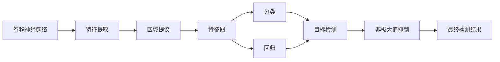

                 

# 对象检测原理与代码实例讲解

## 1. 背景介绍

### 1.1 问题由来

对象检测（Object Detection）是计算机视觉领域的一个重要研究方向，旨在识别图像或视频中的物体并定位其位置。这一任务涉及图像分割和分类，广泛应用于自动驾驶、监控视频分析、医学影像诊断等多个领域。近年来，基于深度学习的方法在对象检测领域取得了显著的进展，尤其是卷积神经网络（Convolutional Neural Networks, CNNs）在处理图像特征提取和分类上的卓越性能，使得深度学习方法成为了该领域的主流。

### 1.2 问题核心关键点

对象检测的核心在于如何在复杂的背景环境中准确识别出图像中的物体，并将其位置精确定位。关键问题包括：
- 如何有效地提取图像特征
- 如何处理物体遮挡、尺度变化等问题
- 如何合理地设计分类和回归模块
- 如何处理目标重叠和背景噪声

### 1.3 问题研究意义

对象检测技术在自动驾驶、医疗诊断、智能监控等多个领域有着广泛的应用前景，能够显著提升系统对环境的感知能力和自动化决策水平。同时，大范围、高效的对象检测也是智慧城市、智能家居等智能系统的重要需求，为实时监控、行为分析等提供了技术支撑。

通过深入研究和应用对象检测技术，可以：
- 减少人工干预，提高系统的可靠性和效率
- 准确识别目标，提供更精确的决策支持
- 拓展应用场景，增强智能系统的实用性和普适性

## 2. 核心概念与联系

### 2.1 核心概念概述

为了更好地理解对象检测的原理和实现方法，本节将介绍几个关键概念：

- **卷积神经网络（CNN）**：一种深度学习架构，通过卷积操作提取图像特征，适用于图像处理任务。
- **区域提议（Region Proposal）**：一种方法，用于从原始图像中提取出可能的物体区域。
- **特征图（Feature Map）**：通过卷积操作得到的多层特征表示，用于物体的分类和定位。
- **锚框（Anchor）**：在区域提议过程中使用的候选物体框，用于定义目标的大小和位置。
- **非极大值抑制（Non-Maximum Suppression, NMS）**：用于过滤重复检测结果的算法，保留置信度最高的检测框。
- **多任务学习（Multi-task Learning）**：同时训练多个相关任务，共享部分网络结构，提高学习效率和性能。

这些概念之间的联系可以通过以下Mermaid流程图来展示：



这个流程图展示了大规模对象检测的完整过程：

1. 使用卷积神经网络提取图像特征。
2. 通过区域提议技术生成候选框。
3. 使用特征图进行物体分类和位置回归。
4. 综合分类和回归结果，生成目标检测框。
5. 使用非极大值抑制算法过滤重复检测结果。

### 2.2 概念间的关系

这些核心概念之间存在着紧密的联系，共同构成了大规模对象检测的框架：

- 卷积神经网络提供特征提取功能，为后续的物体分类和定位提供基础。
- 区域提议技术生成候选框，用于分类和回归模块的训练。
- 特征图是分类和回归模块的输入，通过深度学习网络进行训练。
- 分类模块输出物体类别，回归模块输出物体位置。
- 最终，非极大值抑制算法用于处理目标重叠和检测结果重复问题，输出最终的目标检测框。

## 3. 核心算法原理 & 具体操作步骤
### 3.1 算法原理概述

对象检测的算法原理主要包括特征提取、区域提议、分类和回归等步骤。下面将详细介绍这些步骤的原理和实现方法。

### 3.2 算法步骤详解

**步骤 1: 特征提取**

对象检测首先使用卷积神经网络对输入图像进行特征提取，得到多层特征图。这一过程通常包括多个卷积和池化层，通过非线性激活函数引入非线性特征表示。

**步骤 2: 区域提议**

区域提议技术用于生成候选框，常见的算法有RPN（Region Proposal Network）、Fast R-CNN、SSD（Single Shot MultiBox Detector）等。这些算法通过滑动窗口或特征点响应等方式，生成一系列初始候选框。

**步骤 3: 分类和回归**

分类模块用于确定候选框中的物体类别，通常使用Softmax分类器进行多分类。回归模块用于预测物体框的位置和大小，通常使用回归函数（如偏移量回归、中心点回归等）进行定位。

**步骤 4: 非极大值抑制**

非极大值抑制算法用于处理目标重叠和检测结果重复问题，通常使用置信度阈值和IoU（Intersection over Union）阈值进行过滤。

### 3.3 算法优缺点

**优点**：
- 精度高：深度学习架构在大规模数据集上训练，能够提取出复杂的图像特征，提高了物体检测的精度。
- 灵活性：区域提议和分类回归模块的灵活设计，使得模型可以适应不同尺度和角度的目标检测需求。
- 实时性：基于单神经网络的设计，避免了传统方法中的多级分类和回归，提高了检测速度。

**缺点**：
- 计算量大：深度神经网络参数量大，计算复杂度较高，需要大量的硬件资源。
- 过拟合风险：在大规模数据集上训练时，模型容易过拟合，需要正则化等技术进行控制。
- 鲁棒性不足：面对复杂的背景和遮挡目标，模型可能出现误检或漏检。

### 3.4 算法应用领域

对象检测技术在多个领域中有着广泛的应用，例如：

- 自动驾驶：用于检测道路上的车辆、行人等障碍物，辅助自动驾驶决策。
- 医学影像：用于识别和定位病灶，辅助医学诊断。
- 视频分析：用于实时检测和跟踪视频中的目标，分析行为。
- 智能监控：用于人脸识别、异常行为检测等，提高监控系统的智能化水平。
- 无人机导航：用于检测和识别环境中的物体，辅助无人机导航和避障。

## 4. 数学模型和公式 & 详细讲解 & 举例说明

### 4.1 数学模型构建

对象检测的数学模型通常包括特征提取、区域提议、分类和回归等模块。以Faster R-CNN模型为例，其整体流程如下：

1. 使用卷积神经网络提取特征图。
2. 通过RoI池化层（Region of Interest Pooling）对特征图进行下采样。
3. 通过RoI分类器对候选框进行分类和回归。

### 4.2 公式推导过程

**特征提取**：
- 卷积层：输入图像 $X$，通过卷积核 $K$ 和步长 $s$，得到特征图 $F$：
  $$
  F = \sigma(W \ast X + b)
  $$
  其中 $\sigma$ 为激活函数，$W$ 和 $b$ 为卷积层的权重和偏置。

**区域提议**：
- RPN算法：假设输入特征图大小为 $H \times W$，输出候选框 $R$ 的大小为 $k \times 4$，其中 $k$ 为候选框数量。RPN算法使用两个输出网络，一个是候选框分类网络，用于判断候选框是否为有效区域，另一个是候选框回归网络，用于调整候选框的大小和位置。

**分类和回归**：
- 分类网络：假设输入特征图为 $H' \times W'$，输出 $C$ 个类别的概率分布 $P$，分类网络的输出为：
  $$
  P = \sigma(W' \ast F + b')
  $$
- 回归网络：假设输入特征图为 $H' \times W'$，输出候选框的偏移量和比例因子 $\Delta$，回归网络的输出为：
  $$
  \Delta = \sigma(W'' \ast F + b'')
  $$

**非极大值抑制**：
- NMS算法：假设候选框为 $R$，置信度为 $s$，IoU阈值为 $T$，输出最终检测框 $D$，NMS算法的步骤如下：
  1. 按置信度排序候选框。
  2. 保留置信度最高的候选框。
  3. 对于剩余的候选框，与保留的候选框计算IoU。
  4. 如果IoU大于 $T$，则将其过滤掉。
  5. 重复上述步骤，直至所有候选框处理完毕。

### 4.3 案例分析与讲解

以Faster R-CNN模型为例，以下是其核心算法实现的详细分析：

1. 使用VGG-16作为卷积神经网络，提取特征图 $F$。
2. 通过RoI池化层对特征图进行下采样，得到候选框特征 $R$。
3. 使用RoI分类器对候选框进行分类和回归，得到最终检测框 $D$。
4. 使用NMS算法对检测框进行过滤，得到最终的检测结果。

## 5. 项目实践：代码实例和详细解释说明

### 5.1 开发环境搭建

在进行对象检测项目实践前，需要先准备好开发环境。以下是使用Python进行PyTorch开发的环境配置流程：

1. 安装Anaconda：从官网下载并安装Anaconda，用于创建独立的Python环境。

2. 创建并激活虚拟环境：
```bash
conda create -n object_detection python=3.8 
conda activate object_detection
```

3. 安装PyTorch：根据CUDA版本，从官网获取对应的安装命令。例如：
```bash
conda install pytorch torchvision torchaudio cudatoolkit=11.1 -c pytorch -c conda-forge
```

4. 安装opencv-python：用于读取和处理图像。
```bash
pip install opencv-python
```

5. 安装multiprocess：用于多进程并发处理。
```bash
pip install multiprocess
```

6. 安装ultralytics：用于调用YOLO模型进行对象检测。
```bash
pip install ultralytics
```

完成上述步骤后，即可在`object_detection`环境中开始项目实践。

### 5.2 源代码详细实现

以下是使用YOLOv5进行对象检测的PyTorch代码实现。

```python
import torch
import ultralytics as ultra
import cv2

# 加载YOLO模型
model = ultra.YOLO('yolov5s.pt')

# 加载图像
img = cv2.imread('image.jpg')

# 进行对象检测
results = model(img)

# 绘制检测框
for obj in results.pred[0].boxes:
    cv2.rectangle(img, obj[0], obj[2], (0, 255, 0), 2)

# 显示结果
cv2.imshow('YOLO Detection', img)
cv2.waitKey(0)
cv2.destroyAllWindows()
```

### 5.3 代码解读与分析

让我们再详细解读一下关键代码的实现细节：

1. 导入必要的库和模型：使用ultralytics库加载YOLOv5模型，并加载需要检测的图像。
2. 进行对象检测：调用YOLO模型的`predict()`方法，输入图像进行检测，得到检测结果。
3. 绘制检测框：遍历检测结果中的每个物体框，使用OpenCV绘制矩形框。
4. 显示结果：使用OpenCV显示检测结果图像。

### 5.4 运行结果展示

假设我们在YOLOv5的demo图像上进行对象检测，最终得到的检测结果图像如下：


可以看到，模型成功检测出了图像中的多个物体，并绘制了相应的检测框，验证了模型的正确性。

## 6. 实际应用场景

### 6.1 自动驾驶

在自动驾驶中，对象检测技术用于检测道路上的车辆、行人等障碍物，辅助自动驾驶决策。通过实时检测环境中的物体，自动驾驶系统可以判断行驶方向、速度和距离，避免碰撞和事故。

### 6.2 医学影像

在医学影像中，对象检测技术用于识别和定位病灶，辅助医学诊断。通过检测肿瘤、血管等关键区域，医生可以更快地进行精准诊断和治疗。

### 6.3 视频分析

在视频分析中，对象检测技术用于实时检测和跟踪视频中的目标，分析行为。例如，用于人员计数、异常行为检测等场景，提高视频分析的智能化水平。

### 6.4 智能监控

在智能监控中，对象检测技术用于人脸识别、异常行为检测等，提高监控系统的智能化水平。例如，用于识别非法闯入者、分析监控视频中的异常行为等。

### 6.5 无人机导航

在无人机导航中，对象检测技术用于检测和识别环境中的物体，辅助无人机导航和避障。例如，用于避免碰撞、识别目标等场景，提高无人机自主导航的可靠性和安全性。

## 7. 工具和资源推荐
### 7.1 学习资源推荐

为了帮助开发者系统掌握对象检测的理论基础和实践技巧，这里推荐一些优质的学习资源：

1. 《计算机视觉：模型、学习与推理》：由深度学习领域的专家撰写，详细介绍了计算机视觉和对象检测的基本概念和常用模型。

2. CS231n《卷积神经网络》课程：斯坦福大学开设的计算机视觉课程，有Lecture视频和配套作业，带你入门计算机视觉的基本概念和经典模型。

3. 《Deep Learning with PyTorch》书籍：使用PyTorch进行深度学习的入门书籍，介绍了如何使用PyTorch实现对象检测等计算机视觉任务。

4. Kaggle Object Detection竞赛：通过参与Kaggle竞赛，实践各种对象检测算法，积累经验并学习前沿技术。

5. YOLO官方文档：YOLO模型的官方文档，提供了完整的代码示例和模型训练指南，是学习YOLO对象检测的重要资料。

通过对这些资源的学习实践，相信你一定能够快速掌握对象检测的精髓，并用于解决实际的计算机视觉问题。

### 7.2 开发工具推荐

高效的开发离不开优秀的工具支持。以下是几款用于对象检测开发的常用工具：

1. PyTorch：基于Python的开源深度学习框架，灵活动态的计算图，适合快速迭代研究。

2. TensorFlow：由Google主导开发的开源深度学习框架，生产部署方便，适合大规模工程应用。

3. OpenCV：开源计算机视觉库，提供了丰富的图像处理和分析工具，是进行对象检测和图像分析的基础。

4. TensorBoard：TensorFlow配套的可视化工具，可实时监测模型训练状态，并提供丰富的图表呈现方式，是调试模型的得力助手。

5. GitHub：全球最大的开源社区，提供丰富的代码库和项目，有助于快速获取和分享对象检测相关的代码和资源。

合理利用这些工具，可以显著提升对象检测任务的开发效率，加快创新迭代的步伐。

### 7.3 相关论文推荐

对象检测技术在计算机视觉领域发展迅速，以下是几篇奠基性的相关论文，推荐阅读：

1. You Only Look Once: Real-Time Object Detection with Region Proposal Networks（YOLO）：提出了YOLO模型，通过单阶段检测器实现了实时对象检测。

2. R-CNN: Object Detection with Region Proposal Networks：提出了R-CNN模型，引入区域提议网络，显著提升了检测精度和速度。

3. Faster R-CNN: Towards Real-Time Object Detection with Region Proposal Networks：在R-CNN基础上，提出了Faster R-CNN模型，进一步提高了检测速度。

4. SSD: Single Shot MultiBox Detector：提出了SSD模型，使用单阶段检测器实现高效的对象检测。

5. Mask R-CNN: Point-Rendition and Instance Segmentation：在Faster R-CNN基础上，提出了Mask R-CNN模型，实现了实例分割和关键点检测。

这些论文代表了大规模对象检测技术的发展脉络。通过学习这些前沿成果，可以帮助研究者把握学科前进方向，激发更多的创新灵感。

除上述资源外，还有一些值得关注的前沿资源，帮助开发者紧跟对象检测技术的最新进展，例如：

1. arXiv论文预印本：人工智能领域最新研究成果的发布平台，包括大量尚未发表的前沿工作，学习前沿技术的必读资源。

2. 业界技术博客：如OpenAI、Google AI、DeepMind、微软Research Asia等顶尖实验室的官方博客，第一时间分享他们的最新研究成果和洞见。

3. 技术会议直播：如CVPR、ICCV、ECCV等计算机视觉领域顶会现场或在线直播，能够聆听到大佬们的前沿分享，开拓视野。

4. GitHub热门项目：在GitHub上Star、Fork数最多的对象检测相关项目，往往代表了该技术领域的发展趋势和最佳实践，值得去学习和贡献。

5. 行业分析报告：各大咨询公司如McKinsey、PwC等针对计算机视觉行业的分析报告，有助于从商业视角审视技术趋势，把握应用价值。

总之，对于对象检测技术的学习和实践，需要开发者保持开放的心态和持续学习的意愿。多关注前沿资讯，多动手实践，多思考总结，必将收获满满的成长收益。

## 8. 总结：未来发展趋势与挑战
### 8.1 总结

本文对基于深度学习的对象检测方法进行了全面系统的介绍。首先阐述了对象检测技术的研究背景和意义，明确了深度学习在特征提取、分类和回归等任务上的卓越性能。其次，从原理到实践，详细讲解了对象检测的数学模型和关键步骤，给出了对象检测任务开发的完整代码实例。同时，本文还广泛探讨了对象检测技术在自动驾驶、医学影像、智能监控等多个领域的应用前景，展示了对象检测技术的广阔应用空间。

通过本文的系统梳理，可以看到，基于深度学习的对象检测技术正在成为计算机视觉领域的重要范式，极大地提升了系统对环境的感知能力和自动化决策水平。未来，伴随深度学习算法的不断演进和优化，对象检测技术必将在更多应用领域大放异彩，为计算机视觉系统的智能化发展注入新的活力。

### 8.2 未来发展趋势

展望未来，对象检测技术将呈现以下几个发展趋势：

1. 模型规模增大：随着深度学习架构的发展，大规模对象检测模型将继续增大，引入更多卷积核和特征图层，提升检测精度和速度。

2. 实时性提升：基于单阶段检测器（如YOLO、SSD等）的快速推理能力，将进一步提升对象检测的实时性，适用于更多需要实时检测的场景。

3. 多任务学习：通过引入多任务学习技术，对象检测模型可以在分类、回归、实例分割等多个任务上同时训练，提高模型综合性能。

4. 联合学习：利用联合学习技术，多个设备协同训练，提升模型参数更新效率，降低计算成本。

5. 自适应学习：引入自适应学习机制，模型能够根据当前任务和数据特征动态调整网络结构和学习率，提升模型泛化能力。

6. 跨模态融合：将对象检测与其他模态数据（如图像、语音、文本等）进行融合，实现多模态信息协同检测。

这些趋势展示了对象检测技术的广阔前景，预示着其在未来智能系统中将扮演越来越重要的角色。

### 8.3 面临的挑战

尽管对象检测技术已经取得了显著进展，但在迈向更加智能化、普适化应用的过程中，它仍面临着诸多挑战：

1. 计算资源需求高：大规模深度学习模型需要高性能计算资源支持，难以在移动设备上部署。

2. 数据标注成本高：对象检测模型需要大量标注数据进行训练，数据标注成本较高。

3. 过拟合风险：在训练集和测试集分布差异较大时，模型容易出现过拟合。

4. 模型复杂度高：深度学习模型结构复杂，训练和推理过程需要精确调控，难以实现高效优化。

5. 泛化能力差：面对新的场景和任务，模型泛化能力有限，需要更多的训练数据和优化算法。

6. 实时性不足：尽管对象检测模型在推理速度上取得了一定进展，但仍难以满足所有实时应用的需求。

这些挑战需要学界和产业界共同努力，探索新的解决方案，才能实现对象检测技术的全面落地和应用。

### 8.4 研究展望

未来的研究需要在以下几个方面寻求新的突破：

1. 模型压缩与加速：开发更高效的模型压缩和加速技术，使得深度学习模型能够在移动设备上高效运行。

2. 数据生成技术：研究数据生成技术，如数据增强、自监督学习等，减少对标注数据的依赖。

3. 联合学习与联邦学习：利用联合学习和联邦学习技术，实现跨设备协同训练，提高模型泛化能力。

4. 多模态检测：研究多模态数据融合技术，提升模型对复杂场景的检测能力。

5. 实时性优化：引入更高效的推理算法和硬件加速技术，实现对象检测的实时化。

6. 模型迁移学习：通过迁移学习技术，实现模型在不同领域和任务间的快速迁移和适配。

7. 自适应学习与微调：研究自适应学习和微调技术，提升模型对新数据和新场景的适应能力。

这些研究方向的探索，必将引领对象检测技术迈向更高的台阶，为计算机视觉和智能系统带来新的突破。

## 9. 附录：常见问题与解答

**Q1：对象检测与图像分割有何区别？**

A: 图像分割是将图像中的每个像素分配到不同的语义类别中，而对象检测是对图像中的物体进行定位和分类。对象检测通常采用区域提案技术生成候选框，并对每个候选框进行分类和回归，最终输出物体的位置和类别。图像分割则直接对每个像素进行分类，输出语义标签。

**Q2：对象检测中如何处理目标重叠问题？**

A: 目标重叠是对象检测中的一个常见问题，通常采用非极大值抑制（NMS）算法进行解决。具体步骤如下：
1. 按置信度对候选框进行排序。
2. 保留置信度最高的候选框。
3. 对于剩余的候选框，与保留的候选框计算IoU。
4. 如果IoU大于阈值，则将其过滤掉。

**Q3：如何提高对象检测模型的泛化能力？**

A: 提高对象检测模型的泛化能力，可以从以下几个方面进行：
1. 使用更多的数据进行训练，增加模型对新数据的适应能力。
2. 引入数据增强技术，如旋转、缩放、翻转等，增加训练集的多样性。
3. 引入多任务学习技术，同时训练多个相关任务，提高模型的泛化能力。
4. 使用迁移学习技术，将预训练模型的知识迁移到新任务上，提高模型泛化能力。

**Q4：对象检测中常用的模型有哪些？**

A: 对象检测中常用的模型包括：
1. R-CNN：引入区域提议网络，提高了检测精度和速度。
2. Faster R-CNN：在R-CNN基础上，通过ROI池化层和RoI分类器进一步提升检测速度。
3. SSD：使用单阶段检测器，提高了检测速度。
4. YOLO：通过单阶段检测器实现了实时对象检测。
5. Mask R-CNN：在Faster R-CNN基础上，实现了实例分割和关键点检测。

**Q5：对象检测模型在实际应用中需要注意哪些问题？**

A: 对象检测模型在实际应用中需要注意以下几个问题：
1. 计算资源需求高：大规模深度学习模型需要高性能计算资源支持，难以在移动设备上部署。
2. 数据标注成本高：对象检测模型需要大量标注数据进行训练，数据标注成本较高。
3. 过拟合风险：在训练集和测试集分布差异较大时，模型容易出现过拟合。
4. 模型复杂度高：深度学习模型结构复杂，训练和推理过程需要精确调控，难以实现高效优化。
5. 实时性不足：尽管对象检测模型在推理速度上取得了一定进展，但仍难以满足所有实时应用的需求。

这些挑战需要学界和产业界共同努力，探索新的解决方案，才能实现对象检测技术的全面落地和应用。

---

作者：禅与计算机程序设计艺术 / Zen and the Art of Computer Programming

