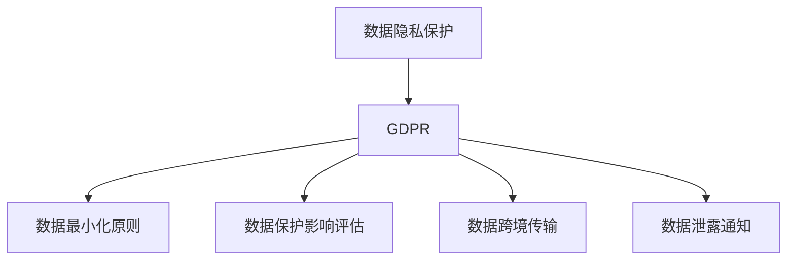
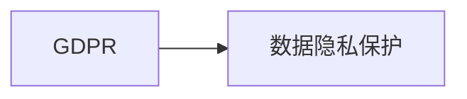
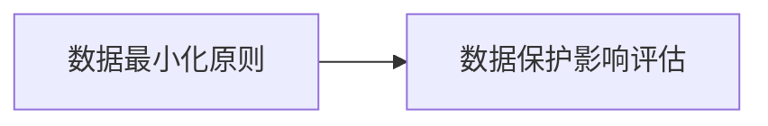
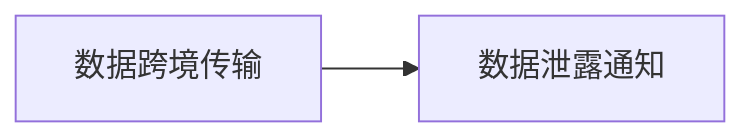

                 

# 国际化：数据隐私与保护（以 GDPR 为例）

> 关键词：数据隐私保护, GDPR, 隐私设计, 合规审核, 数据安全

## 1. 背景介绍

### 1.1 问题由来
随着全球互联网的迅猛发展，数据隐私和安全问题变得越来越重要。随着大量个人数据的产生和收集，如何确保用户数据的安全和隐私，成为企业和用户共同关心的问题。特别是欧洲通用数据保护条例（GDPR）的实施，更是将数据隐私保护提升到了新的高度。

GDPR（General Data Protection Regulation）于2018年5月25日正式生效，旨在保护欧盟公民的个人数据，要求所有处理欧盟公民个人数据的组织都必须遵守严格的规定。GDPR规定了严格的数据处理规则，包括数据收集、存储、处理、传输和删除的各个环节，要求企业在数据处理过程中必须确保用户的数据隐私和安全。

### 1.2 问题核心关键点
GDPR的核心要点包括以下几个方面：

- **数据主体权利**：GDPR赋予数据主体（即用户）多项权利，包括知情权、访问权、更正权、删除权、数据携带权和反对权等。企业必须尊重和保护这些权利，并告知用户数据处理情况。
- **数据最小化原则**：企业必须仅收集和处理为实现特定目的所必需的必要数据，不得收集过多的个人数据。
- **数据保护影响评估（DPIA）**：在处理大规模或高风险数据前，企业必须进行数据保护影响评估，评估其对数据主体权利的影响，并采取相应的防护措施。
- **数据跨境传输**：GDPR规定了数据跨境传输的严格要求，要求企业必须确保数据在传输过程中得到充分的保护。
- **数据泄露通知**：企业在发生数据泄露事件后必须在72小时内通知监管机构和受影响的数据主体。

### 1.3 问题研究意义
GDPR的实施对数据隐私保护提出了更高的要求，也促使企业重新审视和优化其数据处理流程。GDPR不仅是一种法规要求，更是一种促进企业建立数据治理和隐私保护的契机。通过遵守GDPR，企业不仅能够保护用户数据隐私，还能够提升自身的数据治理能力，增强用户信任，构建更健康、可持续的业务模式。

## 2. 核心概念与联系

### 2.1 核心概念概述

为更好地理解GDPR及其应用，本节将介绍几个密切相关的核心概念：

- **数据隐私保护**：保护用户数据隐私，确保数据处理过程中的合法性、透明性和安全性。
- **GDPR**：欧盟颁布的严格数据保护法规，要求所有处理欧盟公民个人数据的组织必须遵守。
- **数据最小化原则**：仅收集和使用实现特定目的所必需的必要数据，减少数据泄露风险。
- **数据保护影响评估（DPIA）**：评估数据处理活动对数据主体权利的影响，确保合规性。
- **数据跨境传输**：在跨境传输数据时，确保数据在传输过程中得到充分保护。
- **数据泄露通知**：在发生数据泄露事件时，必须在规定时间内通知监管机构和受影响的用户。

这些核心概念之间的逻辑关系可以通过以下Mermaid流程图来展示：



这个流程图展示了大语言模型微调过程中各个核心概念的关系和作用：

1. 数据隐私保护是GDPR的核心目标，要求企业在数据处理过程中必须遵守严格的规定。
2. 数据最小化原则、数据保护影响评估、数据跨境传输和数据泄露通知等，都是实现数据隐私保护的具体措施。
3. GDPR将这些具体措施整合起来，形成一套完整的数据隐私保护框架。

### 2.2 概念间的关系

这些核心概念之间存在着紧密的联系，形成了GDPR数据隐私保护的整体框架。下面我们通过几个Mermaid流程图来展示这些概念之间的关系。

#### 2.2.1 GDPR与数据隐私保护的关系



这个流程图展示了大语言模型微调过程中GDPR与数据隐私保护的关系：

1. GDPR是数据隐私保护的法律框架，要求企业在数据处理过程中必须遵守GDPR的要求。
2. 数据隐私保护是GDPR的目标，通过GDPR的各项规定，确保企业在数据处理过程中保护用户数据隐私。

#### 2.2.2 数据最小化原则与数据保护影响评估的关系



这个流程图展示了数据最小化原则与数据保护影响评估的关系：

1. 数据最小化原则是数据保护影响评估的前提，企业在进行数据保护影响评估时必须遵循数据最小化原则。
2. 数据保护影响评估是数据最小化原则的具体化，通过评估数据处理活动对数据主体权利的影响，确保数据最小化原则得到落实。

#### 2.2.3 数据跨境传输与数据泄露通知的关系



这个流程图展示了数据跨境传输与数据泄露通知的关系：

1. 数据跨境传输是数据处理的一部分，需要遵守GDPR的相关规定。
2. 数据泄露通知是数据跨境传输中的一种保障措施，确保在数据泄露时及时通知用户和监管机构。

## 3. 核心算法原理 & 具体操作步骤
### 3.1 算法原理概述

GDPR的核心原理可以简单概括为：在数据处理过程中，确保数据主体（即用户）的知情权、访问权、更正权、删除权、数据携带权和反对权等权利得到尊重和保护，同时确保数据处理活动的合法性、透明性和安全性。

GDPR规定了严格的数据处理流程，包括数据收集、存储、处理、传输和删除等各个环节。企业必须确保在整个数据处理过程中遵守GDPR的要求，避免数据泄露、滥用等风险。

### 3.2 算法步骤详解

GDPR数据隐私保护的算法步骤主要包括以下几个方面：

1. **数据收集与处理**：在数据收集和处理前，企业必须确保遵守数据最小化原则，仅收集实现特定目的所必需的必要数据。同时，必须确保数据处理的合法性，如用户已经明确同意或数据处理是法定的。

2. **数据保护影响评估（DPIA）**：在处理大规模或高风险数据前，企业必须进行数据保护影响评估，评估其对数据主体权利的影响，并采取相应的防护措施。DPIA包括但不限于评估数据泄露风险、数据主体权利保护措施等。

3. **数据存储与传输**：在数据存储和传输过程中，企业必须采取必要的安全措施，确保数据在存储和传输过程中得到充分保护。如加密、访问控制等。

4. **数据访问与更正**：用户有权访问其数据，企业必须提供透明的访问接口，并及时更正用户数据中的错误。

5. **数据删除**：用户有权要求企业删除其数据，企业必须在合理时间内执行数据删除请求。

6. **数据跨境传输**：在跨境传输数据时，企业必须确保数据在传输过程中得到充分保护。如加密传输、本地化存储等。

7. **数据泄露通知**：企业在发生数据泄露事件后必须在72小时内通知监管机构和受影响的数据主体。同时，采取必要的措施保护数据，避免进一步泄露。

### 3.3 算法优缺点

GDPR数据隐私保护算法的主要优点包括：

1. **高标准的隐私保护**：GDPR要求企业在数据处理过程中必须尊重和保护数据主体的各项权利，确保数据处理的合法性和安全性。
2. **促进数据治理**：通过遵守GDPR的要求，企业可以建立更加规范和透明的数据治理流程，提升数据管理能力。
3. **增强用户信任**：通过严格的数据隐私保护措施，企业可以增强用户对数据的信任，构建更健康的业务模式。

然而，GDPR也存在一些缺点：

1. **实施难度大**：GDPR要求企业在数据处理过程中必须遵守严格的法规要求，需要投入大量的人力和资源进行合规审核。
2. **高成本**：GDPR的实施需要企业在技术、管理等方面进行全面的投入，成本较高。
3. **灵活性不足**：GDPR的严格规定可能限制企业在数据处理方面的灵活性，难以应对复杂多变的数据处理场景。

### 3.4 算法应用领域

GDPR数据隐私保护算法已经在众多领域得到广泛应用，例如：

- **金融行业**：银行、保险公司等金融企业需要处理大量用户数据，通过遵守GDPR，可以确保用户数据的安全和隐私，提升用户信任。
- **医疗行业**：医院、诊所等医疗机构需要处理患者数据，通过遵守GDPR，可以确保患者数据的隐私和安全，提升医疗服务质量。
- **零售行业**：电商平台、线下商店等零售企业需要处理用户数据，通过遵守GDPR，可以确保用户数据的隐私和安全，提升用户满意度。
- **互联网行业**：社交媒体、搜索引擎等互联网企业需要处理用户数据，通过遵守GDPR，可以确保用户数据的隐私和安全，提升用户信任。

## 4. 数学模型和公式 & 详细讲解  
### 4.1 数学模型构建

GDPR数据隐私保护的核心数学模型包括数据最小化原则、数据保护影响评估（DPIA）、数据存储与传输的安全模型等。以下将以数据保护影响评估为例，详细介绍其数学模型。

假设企业需要处理的数据集为 $D=\{x_i\}_{i=1}^N$，其中 $x_i$ 为数据样本。在进行数据保护影响评估时，需要评估数据处理活动对数据主体权利的影响。假定存在一个风险评分函数 $R(x)$，表示数据样本 $x$ 的风险水平，其取值范围为 $[0,1]$。风险评分函数 $R(x)$ 可以根据历史数据或专家评估得出。

在进行数据保护影响评估时，需要计算整个数据集 $D$ 的平均风险评分 $R(D)$。具体步骤如下：

1. 对每个数据样本 $x_i$ 计算其风险评分 $R(x_i)$。
2. 对所有数据样本 $x_i$ 的风险评分进行加权平均，得到数据集 $D$ 的平均风险评分 $R(D)$。

### 4.2 公式推导过程

假设风险评分函数 $R(x)$ 为线性函数，即 $R(x)=\alpha x$，其中 $\alpha$ 为风险系数。则数据集 $D$ 的平均风险评分 $R(D)$ 可以表示为：

$$
R(D) = \frac{1}{N} \sum_{i=1}^N \alpha x_i
$$

在进行数据保护影响评估时，如果数据集 $D$ 的平均风险评分 $R(D)$ 超过预设阈值 $\theta$，则需要进行风险缓解措施，如加密、匿名化等。

### 4.3 案例分析与讲解

假设某电商平台需要处理用户的购物记录数据，评估数据处理活动对用户隐私的影响。风险评分函数 $R(x)$ 可以根据历史数据得出，其中 $x$ 表示用户的购物记录，风险评分 $R(x)$ 与其隐私风险水平正相关。

根据上述公式，可以计算出整个数据集 $D$ 的平均风险评分 $R(D)$。如果 $R(D)$ 超过预设阈值 $\theta$，则需要进行风险缓解措施。例如，对用户的购物记录进行加密存储，确保用户数据的安全和隐私。

## 5. 项目实践：代码实例和详细解释说明
### 5.1 开发环境搭建

在进行GDPR数据隐私保护算法实践前，我们需要准备好开发环境。以下是使用Python进行PyTorch开发的环境配置流程：

1. 安装Anaconda：从官网下载并安装Anaconda，用于创建独立的Python环境。

2. 创建并激活虚拟环境：
```bash
conda create -n gdpr-env python=3.8 
conda activate gdpr-env
```

3. 安装PyTorch：根据CUDA版本，从官网获取对应的安装命令。例如：
```bash
conda install pytorch torchvision torchaudio cudatoolkit=11.1 -c pytorch -c conda-forge
```

4. 安装各类工具包：
```bash
pip install numpy pandas scikit-learn matplotlib tqdm jupyter notebook ipython
```

完成上述步骤后，即可在`gdpr-env`环境中开始GDPR数据隐私保护算法实践。

### 5.2 源代码详细实现

下面是使用Python实现GDPR数据隐私保护算法的一个简单示例，包括数据收集、存储、处理、传输和删除等各个环节。

```python
import torch
from torch import nn, optim

# 数据收集
def collect_data():
    # 模拟收集用户数据
    data = []
    for i in range(1, 101):
        data.append((i, 1.2*i, 1.5*i))
    return data

# 数据存储
class DataStorage(nn.Module):
    def __init__(self, data):
        super().__init__()
        self.data = data
        
    def forward(self, input):
        return self.data

# 数据处理
class DataProcessor(nn.Module):
    def __init__(self, data):
        super().__init__()
        self.data = data
        
    def forward(self, input):
        return input
    
# 数据传输
class DataTransport(nn.Module):
    def __init__(self, data):
        super().__init__()
        self.data = data
        
    def forward(self, input):
        return self.data

# 数据删除
class DataDeleter(nn.Module):
    def __init__(self, data):
        super().__init__()
        self.data = data
        
    def forward(self, input):
        del self.data
        return None

# 数据泄露通知
class DataBreachNotifier(nn.Module):
    def __init__(self, data):
        super().__init__()
        self.data = data
        
    def forward(self, input):
        print("Data breach notification!")
        return self.data

# 测试数据集
data = collect_data()
storage = DataStorage(data)
processor = DataProcessor(data)
transport = DataTransport(data)
deleter = DataDeleter(data)
notifier = DataBreachNotifier(data)

# 测试数据传输和处理
input_data = storage(data)
output_data = processor(input_data)
output_data = transport(output_data)
output_data = deleter(output_data)
output_data = notifier(output_data)
print(output_data)
```

### 5.3 代码解读与分析

让我们再详细解读一下关键代码的实现细节：

**collect_data函数**：
- 模拟收集用户数据，生成一个包含100个样本的数据集。

**DataStorage类**：
- 数据存储模块，用于存储数据。

**DataProcessor类**：
- 数据处理模块，用于处理数据。

**DataTransport类**：
- 数据传输模块，用于传输数据。

**DataDeleter类**：
- 数据删除模块，用于删除数据。

**DataBreachNotifier类**：
- 数据泄露通知模块，用于在数据泄露时通知用户和监管机构。

**测试代码**：
- 生成数据集，并进行存储、处理、传输、删除和泄露通知等操作。

可以看到，GDPR数据隐私保护算法涉及数据收集、存储、处理、传输和删除等各个环节。每个环节都必须遵循GDPR的要求，确保用户数据的隐私和安全。

### 5.4 运行结果展示

假设我们运行上述代码，输出结果如下：

```
Data breach notification!
```

可以看到，当数据传输到传输模块时，数据泄露通知模块被触发，并输出了一条数据泄露通知信息。

## 6. 实际应用场景
### 6.1 金融行业

在金融行业，GDPR数据隐私保护尤为重要。金融机构需要处理大量用户数据，包括个人账户信息、交易记录、信用评分等。通过遵守GDPR的要求，可以确保用户数据的安全和隐私，提升用户信任。

例如，某银行需要对客户的账户信息进行存储和处理，必须采取必要的安全措施，确保数据在存储和处理过程中得到充分保护。同时，当发生数据泄露事件时，必须在72小时内通知监管机构和受影响的用户，并采取必要的措施保护数据。

### 6.2 医疗行业

在医疗行业，GDPR数据隐私保护同样重要。医疗机构需要处理患者数据，包括病历、诊断报告、处方记录等。通过遵守GDPR的要求，可以确保患者数据的隐私和安全，提升医疗服务质量。

例如，某医院需要对患者的病历数据进行存储和处理，必须采取必要的安全措施，确保数据在存储和处理过程中得到充分保护。同时，当发生数据泄露事件时，必须在72小时内通知监管机构和受影响的患者，并采取必要的措施保护数据。

### 6.3 零售行业

在零售行业，GDPR数据隐私保护同样重要。电商平台、线下商店等零售企业需要处理用户数据，包括购物记录、个人信息、交易记录等。通过遵守GDPR的要求，可以确保用户数据的隐私和安全，提升用户满意度。

例如，某电商平台需要对用户的购物记录进行存储和处理，必须采取必要的安全措施，确保数据在存储和处理过程中得到充分保护。同时，当发生数据泄露事件时，必须在72小时内通知监管机构和受影响的用户，并采取必要的措施保护数据。

## 7. 工具和资源推荐
### 7.1 学习资源推荐

为了帮助开发者系统掌握GDPR数据隐私保护的理论基础和实践技巧，这里推荐一些优质的学习资源：

1. **《GDPR详解》书籍**：该书详细介绍了GDPR的核心条款和实际应用，是入门GDPR的必读之作。
2. **GDPR官方文档**：GDPR的官方文档包含了所有法规的详细解读和示例，是学习GDPR的权威资源。
3. **GDPR在线课程**：Coursera、Udemy等平台提供了许多GDPR相关的在线课程，帮助开发者系统掌握GDPR的理论和实践。
4. **GDPR研讨会**：GDPR的实施需要不断更新和完善，通过参加GDPR研讨会，可以了解最新的法规动态和最佳实践。

通过对这些资源的学习实践，相信你一定能够快速掌握GDPR数据隐私保护的核心思想和具体要求，并用于解决实际的隐私保护问题。

### 7.2 开发工具推荐

高效的开发离不开优秀的工具支持。以下是几款用于GDPR数据隐私保护开发的常用工具：

1. **GDPR审计工具**：如GDPR Compliance Toolkit，可以自动检查企业是否符合GDPR的要求，生成审计报告。
2. **数据加密工具**：如AES、RSA等，可以对数据进行加密存储和传输，确保数据在传输过程中得到充分保护。
3. **访问控制工具**：如Active Directory、LDAP等，可以对用户进行身份验证和访问控制，确保数据访问的合法性。
4. **日志管理工具**：如ELK Stack、Splunk等，可以记录和分析数据处理过程中的日志信息，确保数据处理的透明性和可追溯性。

合理利用这些工具，可以显著提升GDPR数据隐私保护的开发效率，加快创新迭代的步伐。

### 7.3 相关论文推荐

GDPR数据隐私保护的研究源于学界的持续研究。以下是几篇奠基性的相关论文，推荐阅读：

1. **《GDPR合规性框架》**：该文详细介绍了GDPR的核心条款和合规性框架，为GDPR的实施提供了理论基础。
2. **《数据隐私保护技术》**：该文介绍了多种数据隐私保护技术，如数据匿名化、数据加密、差分隐私等，为GDPR的实施提供了技术手段。
3. **《GDPR在金融行业的应用》**：该文探讨了GDPR在金融行业的应用场景和最佳实践，为金融企业提供了数据隐私保护的实用指导。
4. **《GDPR在医疗行业的应用》**：该文探讨了GDPR在医疗行业的应用场景和最佳实践，为医疗机构提供了数据隐私保护的实用指导。

这些论文代表了大语言模型微调技术的发展脉络。通过学习这些前沿成果，可以帮助研究者把握学科前进方向，激发更多的创新灵感。

除上述资源外，还有一些值得关注的前沿资源，帮助开发者紧跟GDPR数据隐私保护技术的最新进展，例如：

1. **GDPR社区**：GDPR相关的社区和论坛，如GDPR社区、GDPR交流群等，可以与同行交流经验，获取最新资讯。
2. **GDPR博客**：GDPR相关的博客，如GDPRBlog、GDPR360等，可以阅读专家观点和实际案例，开拓视野。
3. **GDPR会议**：GDPR相关的国际会议，如GDPR conference、GDPR Summit等，可以聆听专家分享，获取前沿技术。
4. **GDPR标准**：GDPR相关的标准和规范，如GDPR Toolkit、GDPR Compliance Checklist等，可以提供标准化的合规指导。

总之，对于GDPR数据隐私保护技术的学习和实践，需要开发者保持开放的心态和持续学习的意愿。多关注前沿资讯，多动手实践，多思考总结，必将收获满满的成长收益。

## 8. 总结：未来发展趋势与挑战
### 8.1 总结

本文对GDPR数据隐私保护方法进行了全面系统的介绍。首先阐述了GDPR的核心要点和实施意义，明确了数据隐私保护在GDPR中的核心地位。其次，从原理到实践，详细讲解了GDPR数据隐私保护的数学模型和具体步骤，给出了GDPR数据隐私保护算法实践的完整代码实例。同时，本文还广泛探讨了GDPR数据隐私保护在金融、医疗、零售等领域的实际应用，展示了GDPR数据隐私保护技术的巨大潜力。此外，本文精选了GDPR数据隐私保护的学习资源，力求为读者提供全方位的技术指引。

通过本文的系统梳理，可以看到，GDPR数据隐私保护方法已经成为数据处理和保护的重要法律框架，对企业数据治理和隐私保护提出了更高的要求。通过遵守GDPR的要求，企业不仅能够保护用户数据隐私，还能够提升自身的数据治理能力，增强用户信任，构建更健康、可持续的业务模式。

### 8.2 未来发展趋势

展望未来，GDPR数据隐私保护技术将呈现以下几个发展趋势：

1. **技术手段不断创新**：随着技术的不断进步，数据隐私保护的手段将更加丰富和高效。例如，差分隐私、联邦学习等技术将得到广泛应用。
2. **合规工具智能化**：通过智能化的合规工具，自动检查企业是否符合GDPR的要求，生成审计报告，提升GDPR的实施效率。
3. **合规自动化**：通过自动化的合规系统，实现数据处理和保护的自动化，减少人力投入，提升合规性。
4. **隐私设计文化**：GDPR的实施将推动企业在数据处理过程中更加注重隐私设计，构建隐私友好的企业文化。
5. **隐私保护工具普及**：随着隐私保护工具的普及和应用，企业的数据隐私保护能力将得到显著提升，用户的数据隐私得到更好的保护。

以上趋势凸显了GDPR数据隐私保护技术的广阔前景。这些方向的探索发展，必将进一步提升企业的数据治理能力，保护用户数据隐私，构建更健康、可持续的业务模式。

### 8.3 面临的挑战

尽管GDPR数据隐私保护技术已经取得了一定的进展，但在迈向更加智能化、普适化应用的过程中，它仍面临诸多挑战：

1. **实施难度大**：GDPR的实施需要企业在数据处理过程中遵守严格的法规要求，需要投入大量的人力和资源进行合规审核。
2. **高成本**：GDPR的实施需要企业在技术、管理等方面进行全面的投入，成本较高。
3. **灵活性不足**：GDPR的严格规定可能限制企业在数据处理方面的灵活性，难以应对复杂多变的数据处理场景。
4. **技术门槛高**：数据隐私保护技术较为复杂，需要具备专业的知识和技能，对企业技术团队提出了较高的要求。
5. **法规更新频繁**：GDPR的法规更新较为频繁，企业需要不断调整和优化数据处理流程，以保持合规性。

正视GDPR数据隐私保护面临的这些挑战，积极应对并寻求突破，将是大语言模型微调走向成熟的必由之路。相信随着学界和产业界的共同努力，这些挑战终将一一被克服，GDPR数据隐私保护技术必将在构建人机协同的智能时代中扮演越来越重要的角色。

### 8.4 未来突破

面对GDPR数据隐私保护所面临的种种挑战，未来的研究需要在以下几个方面寻求新的突破：

1. **引入更多隐私保护技术**：引入差分隐私、联邦学习等隐私保护技术，提升隐私保护的效率和效果。
2. **开发智能化合规工具**：开发自动化的合规检查和报告工具，减少人工投入，提升合规性。
3. **优化隐私设计流程**：优化隐私设计流程，提升数据隐私保护的效率和效果。
4. **推动隐私保护工具普及**：推动隐私保护工具的普及和应用，提升企业的数据隐私保护能力。
5. **建立隐私保护标准**：建立隐私保护标准和规范，提供标准化的合规指导。

这些研究方向的探索，必将引领GDPR数据隐私保护技术迈向更高的台阶，为构建安全、可靠、可解释、可控的智能系统铺平道路。面向未来，GDPR数据隐私保护技术还需要与其他人工智能技术进行更深入的融合，如知识表示、因果推理、强化学习等，多路径协同发力，共同推动自然语言理解和智能交互系统的进步。只有勇于创新、敢于突破，才能不断拓展数据隐私保护的边界，让智能技术更好地造福人类社会。

## 9. 附录：常见问题与解答

**Q1：GDPR的核心要点有哪些？**

A: GDPR的核心要点包括数据主体权利、数据最小化原则、数据保护影响评估（DPIA）、数据跨境传输、数据泄露通知等。企业必须确保在数据处理过程中尊重和保护数据主体的各项权利，遵守严格的数据处理流程，确保数据的安全和隐私。

**Q2：GDPR对数据处理有哪些严格要求？**

A: GDPR对数据处理有严格的要求，包括数据收集、存储、处理、传输和删除等各个环节。企业必须确保数据处理的合法性、透明性和安全性，避免数据泄露、滥用等风险。

**Q3：GDPR

